# 🫘 Renal ASL — Explained Simply

### *A from-zero guide to arterial spin labelling in the kidney, written for someone who already knows brain ASL*

> 🧭 **What this file is:** the kidney equivalent of `../RESEARCH_EXPLAINED.md`. It assumes you can
> read code but have never stood next to an MRI scanner, and it spends its time on **everything the
> kidney does differently.**
>
> 🔒 **The rule it obeys:** every number carries its **ROI, cohort, field strength and labelling
> scheme.** A renal perfusion value without its ROI is meaningless — cortex and medulla differ by a
> factor of 2.3 to 7 depending on how you draw the mask. Where something could not be verified, it
> says so.
>
> 📌 **Evidence:** `papers/` holds the source PDFs; `screenshots/` holds **77** rendered pages at
> 130 dpi. **19** of them are shown below, each with what is highlighted or visible on that page named
> in the caption; the rest are the working set the numbers were read from.

---

## 📋 Part 0 — The one-page version

1. **The kidney has its own White Paper.** It is **Nery et al. 2020, MAGMA 33(1):141–161** — a
   modified-Delphi consensus from a **23-member expert panel** (26 authors) that produced
   **59 agreed statements** and 2 that failed. CC-BY, at
   [`papers/nery2020_renal_asl_consensus.pdf`](papers/nery2020_renal_asl_consensus.pdf).
   **David Alsop co-authored both it and the 2015 brain White Paper** — the lineage is direct.

2. **Both FAIR and PCASL are endorsed** (**R3.1**, 6% abstention, 93% agreement). The brain
   toolbox's "assume PCASL" default is invalid here — and the two schemes measure RBF values
   **1.5 to 1.8× apart in the same subjects**.

3. **The default readout is 2D SINGLE-SLICE spin-echo EPI, coronal oblique.** **R6.3** says 3D is
   explicitly *not* the default. This inverts the brain White Paper.

4. **Free breathing, not breath-hold** (**R7.3**, 94%; **R7.4**, 76%). Respiratory motion of the
   organ itself — not head motion — is the dominant failure mode, and it breaks assumptions brain
   motion correction is built on.

5. **Report CORTICAL perfusion, left and right kidney separately** (**R10.1**, 0% abstention,
   **100% agreement** — the strongest statement in the document). And **R10.2** (14%, 89%):
   *"Medullary renal blood flow values are not considered reliable with current measurement
   approaches."*

6. **The M0 rule is identical to brain.** M0 mandatory (**R9.1**, 94%), acquired **without labelling
   and without background suppression**, long TR, corrected if TR is not > 5 s. Brain Module 6 ports
   across almost unchanged, because the rule is a property of relaxation physics, not of the organ.

7. **The consensus contains ZERO numeric image-quality thresholds.** No tSNR floor, no CoV cutoff,
   no motion limit, no QEI analogue. `mL/100` appears exactly once in the full text, in the phrase
   *"typically mL/100 g/min"*, with no value attached. **Every renal CBF-map threshold starts life
   `uncalibrated`.** That is not a weakness of the design — it is the honest state of the field.

---

# PART 1 — What renal ASL is, and the physics vocabulary you need

## 1.1 The one-paragraph version

Everything you know still applies: tag the water in arterial blood with an RF pulse, wait for it to
arrive, image, image again without tagging, subtract, divide by M0, multiply by constants. What
changes is **where you tag** (the abdominal aorta, not the carotids — or, for FAIR, you invert
everything *except* a slab around the kidney), **what you wait for** (the kidney sits right off the
aorta, so transit is short), **what moves** (the organ itself, ~11 mm, on every breath), and **what
you divide the image into afterwards** (cortex and medulla, with no probability maps to help you).

The output is called **RBF — renal blood flow** — in the same units you already use,
**mL/100 g/min**. The OSIPI living ASL Lexicon defines it exactly that way: *"Kidney | Renal Blood
Flow / Renal perfusion | RBF | mL/100g/min | Tissue perfusion value in kidney"*.

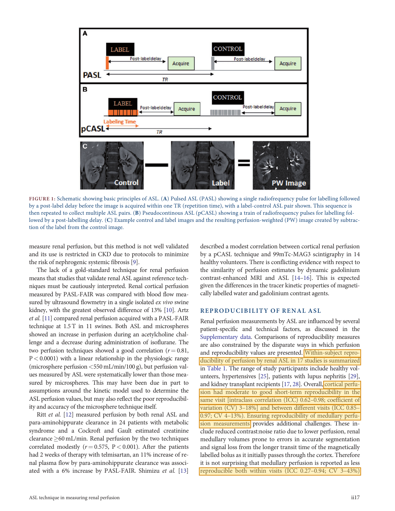

*Odudu 2018, p. ii17. Panel A is PASL timing (one inversion pulse, then a post-label delay), panel B
is pCASL (a long train of pulses defining a labelling duration, then a PLD). Panel C is the part
worth staring at: two almost identical grey kidney images, and their difference — the
perfusion-weighted image, in which only the flowing blood survives. The highlighted sentences lower
on this same page are the reproducibility ranges quoted in §7.5.*

## 1.2 Five physical ideas you need before anything else

You cannot judge a renal ASL map without these. Each one is a from-zero definition, then what it
looks like in the data.

### (a) The perfusion-weighted signal, ΔM — and why it is so small

An MRI image is a map of how much net nuclear magnetisation each voxel has at readout time. In ASL
you acquire two images that are identical except that in one of them the arterial blood flowing
*into* the slice had its magnetisation inverted a second or two earlier. Subtract them and every
static thing — muscle, fat, cortex tissue that was already sitting there — cancels exactly, because
it was in the same state both times. What survives, **ΔM**, is only the blood that arrived between
the label and the readout. That is the entire trick.

The catch is that blood is a small fraction of a voxel's water. In brain, ΔM is about **1%** of the
control image. In renal cortex it is roughly **3%** measured (Garcia-Ruiz 2025: 2.95 ± 0.56% at
1.5T, 3.09 ± 0.59% at 3T, n=16 healthy), and Odudu 2018 quotes *"a typical renal cortex
perfusion-weighted signal intensity of 5% of the control image signal."* So the kidney is easier
than the brain — but you are still measuring a 3% difference between two noisy images, and **any
systematic difference between the control and label acquisitions that is bigger than 3% will
dominate your perfusion map.** Motion is exactly such a difference. That single sentence explains
most of Part 3.

### (b) M0 — the denominator that makes the number mean something

Raw MRI intensities are in arbitrary units. A voxel reading 480 means nothing on its own: change the
coil, the gain, or the patient's position and it changes. **M0** (also called the PD or
proton-density image) is an image of the *same* tissue acquired with the labelling switched off and
enough recovery time that the magnetisation has fully relaxed back to equilibrium. It is therefore
"what a fully-magnetised voxel of this tissue reads on this scanner today", and dividing ΔM by it
turns arbitrary units into a **dimensionless fraction** — which the kinetic model then converts to
mL/100 g/min.

Two consequences follow, and both are checkable:

- **M0 must not have background suppression applied** (see (c)). BS deliberately crushes the static
  tissue signal. If your denominator is crushed, the ratio inflates and every CBF value in the map
  is over-estimated.
- **M0 must be given time to fully relax.** Longitudinal magnetisation recovers as
  `1 − exp(−TR/T1)`. At TR = 5 s and a cortical T1 of ~1.35 s (3T), recovery is 97.5%; at TR = 2 s
  it is only 77%, so M0 reads 23% low and every CBF value reads ~30% high. That is why both the
  brain White Paper and the renal consensus set the same > 5 s bar and the same exact correction
  `SI_PD / (1 − exp(−TR/T1_tissue))`.

### (c) Background suppression — what it is and why it exists

Background suppression (BS, or BGS) is a set of 2–4 extra inversion pulses played between the label
and the readout, timed so that at the moment of readout the *static* tissue's longitudinal
magnetisation is passing through zero. The static signal is therefore near-nulled in **both** the
control and the label image.

Why bother, when subtraction already cancels static tissue perfectly? Because it only cancels
perfectly if nothing changed between the two acquisitions. In reality the subject breathes, the
scanner drifts, and the signal fluctuates. Those fluctuations scale with the size of the signal they
sit on. If static tissue reads 1000 and fluctuates by 1%, that is ±10 units of noise sitting on top
of a ΔM of ~30. Null the static tissue first and the fluctuation has almost nothing to scale with.
BS does not increase your signal; it removes the source of your physiological noise.

Renal ASL takes this seriously (**R7.2**, 5% abstention, 80% agreement), and it buys a lot: Bones
2019 measured whole-kidney tSNR rising from **0.60 ± 0.15 without BGS to 0.93 ± 0.22 with heavy
BGS** (n=9, 1.5T).

BS is not free. Each inversion pulse is imperfect and destroys some of the label too — the consensus
prices this at **×0.93 per BGS inversion pulse** (**R9.9**, 19% abstention, 100% agreement). So
PCASL with 3 BS pulses has an effective labelling efficiency of 0.85 × 0.93³ = **0.684**, not 0.85.
And there is a second, sharper cost that is specific to the kidney, in §3.4.

### (d) Partial volume — the effect that manufactures fake perfusion values

A voxel is a box, typically 3 × 3 × 5 mm in renal ASL. Anatomy does not respect box boundaries. A
voxel straddling the cortex/medulla border contains some of each, and the number it reports is the
**volume-weighted average** of the two. It is not noise — it is a perfectly repeatable, perfectly
wrong measurement.

This matters more in the kidney than in the brain for a geometric reason: the renal cortex is a
**shell about 1 cm thick** wrapped around the medulla. With 3 mm in-plane voxels you get roughly
three voxels across the cortex, and the two on either edge are contaminated — one by fat and the
capsule, one by medulla. Brain grey matter is a similarly thin ribbon, but brain ASL has continuous
tissue-probability maps that let you model the mixing. The kidney has none (§2.3).

And it gets worse exactly where it hurts most. The consensus:

> *"In the case of advanced disease, the reduction in cortical thickness can be severe enough such
> that it approaches the typical dimensions of the ASL voxels, significantly reducing the number of
> pure cortex voxels from which cortical RBF can be estimated. The mixing of perfusion signal from
> the cortex with medullary signal may bias cortical RBF estimates to lower values (i.e. potentially
> causing an apparent reduction of cortical perfusion). … Therefore, cortical RBF results from ASL
> should be interpreted with caution in cases where cortical thinning is evident."*

**In advanced CKD, partial volume can manufacture a low cortical perfusion reading out of nothing.**
A low-CBF alarm that does not know the cortical thickness will confidently mis-diagnose thin
kidneys.

### (e) Transit time and the transit artefact

The label is created upstream and has to travel. **Arterial transit time (ATT)** is how long that
takes. You must wait at least ATT before reading out, or the labelled blood is still in the arteries
rather than the tissue — and arteries are what a **transit artefact** looks like: bright,
snake-shaped, high-intensity streaks tracing the vasculature, sitting on top of a dimmer,
plausible-looking parenchyma. A voxel containing a labelled artery reports a perfusion value several
times higher than any tissue can have, because the tracer is present but has not yet been delivered.

Renal ATT is short — the kidney is ~10 cm from the labelling plane, not the full neck-to-cortex
distance of the brain. Published cortical values run roughly **0.19 s** (Bones 2021, 1.5T FAIR) to
**1.14 s** (Kim 2017, 3T pCASL), and the consensus PLD of **1.2–1.5 s** (**R5.11**) clears that
comfortably — which is *why* single-delay acquisition is defensible in the kidney and more
contentious in the brain.

The renal consensus' remedy for residual vascular signal is entirely manual:

> *"ROIs should be adjusted to avoid hyperintense signals on the perfusion image as they likely
> represent vessels."*

Gillis 2014 implemented that as a percentile clip (*"Pixels with intensity at the extremes of the
range were excluded, as these were likely to represent adventitia or major vessels"*); Olsen 2025
used a hard cap, excluding voxels above 500 mL/min/100 mL.

> 📌 **Trace that 500 before reusing it.** Olsen cites it to the Nery consensus, but `500` appears in
> the consensus exactly twice, both times as "500 μs" RF pulse duration. The real origin is
> **Gullaksen et al., Diabetologia 2023;66:813–825**: *"Perfusion values outside 0–500 ml (100 g)⁻¹
> min⁻¹ were rejected"* — per 100 **grams**, and **two-sided**: it also rejects negative perfusion,
> which is the direct renal analogue of the brain negative-voxel check and the more useful half.

## 1.3 Why you must average, and why the consensus says 20 pairs

**R4.7** (10% abstention, 89% agreement) and its PCASL twin **R5.12** (14%, 83%) both say: *"a
minimum of 20 ASL pairs is recommended."* Here is the arithmetic behind that number, because you
will be asked.

One control/label pair gives you one ΔM image. Call the true cortical perfusion signal `S` and the
per-pair noise standard deviation `σ`. From Garcia-Ruiz's measured numbers, the *single-pair*
cortical signal is about 3% of M0, and the per-pair temporal SNR — the mean ΔM divided by its
standard deviation across repetitions — is **tSNR ≈ 3.5 at 1.5T, 3.3 at 3T**. So a single pair
carries a signal only about three times its own noise. A perfusion map built from one pair is
unusable: a 30% error bar on every voxel.

Averaging `N` independent pairs averages the signal exactly (each pair has the same `S`) but
averages the noise **incoherently**. The standard deviation of the mean of `N` independent samples
is `σ/√N`. So:

```
SNR(N averaged pairs) = S / (σ/√N) = √N · SNR(1 pair)
```

This is the single most important line of arithmetic in the whole document, and its consequences
are:

| Pairs averaged | SNR multiplier | Cortical SNR from a base tSNR of 3.5 |
|---|---|---|
| 1 | 1.0× | 3.5 |
| 4 | 2.0× | 7.0 |
| **20** | **4.5×** | **~15.6** |
| 40 | 6.3× | 22.1 |
| 80 | 8.9× | 31.3 |

Twenty pairs is where the map first becomes reliably readable — a ~6% error bar per voxel — and it
is also where the curve starts to flatten. Going from 20 to 40 pairs doubles the scan time for a
41% SNR gain. With a TR of 4–6 s (**R6.12**, 94%), 20 pairs plus an M0 is roughly **3.5 minutes**;
40 pairs is 7 minutes of breathing, which increases the motion risk faster than it increases SNR.
That trade-off, not a magic number, is what 20 encodes.

Two practical corollaries:

- **Always check whether a published SNR is per-pair or post-averaging.** They differ by √N — a
  factor of 4.5 at 20 pairs. This is the single most common way to mis-set a renal SNR threshold,
  and §7.6 shows it happening in the literature.
- The 20-pair rule is scoped in Nery's body text to *"when using the recommended 2D readout."* A 3D
  acquisition collects a whole volume per pair and needs fewer; the two paediatric 3D-GRASE studies
  used 25 (Nery 2019) and 6 (Radovic 2025). Any pair-count check must be gated on readout type.

## 1.4 What a renal perfusion map actually looks like

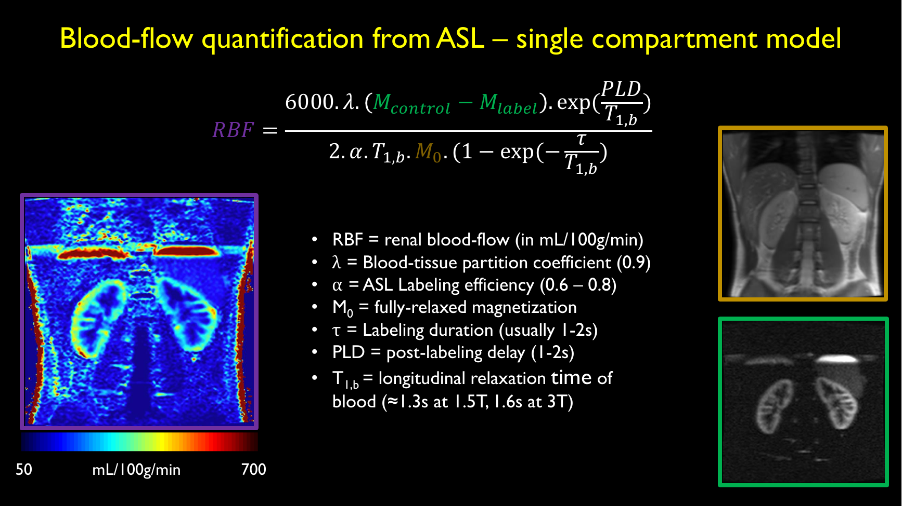

*(⚠️ conference slides, not peer-reviewed — use for orientation, not for numbers.)* This is worth
reading carefully if you have never seen one. Left: a quantified RBF map on a 50–700 mL/100 g/min
colour scale. The bright ring around each kidney is **cortex**. The dark blue interior is
**medulla** — it is not empty, it is genuinely perfused several times less. The intense red band
running horizontally above both kidneys — bilateral and symmetric about the midline, and visible as
the bright streak in the perfusion-weighted image bottom-right too — is **labelled blood that has not
been delivered to any tissue**: a textbook vascular/transit artefact, reading several times higher
than any parenchyma can. ⚠️ *The slide carries no annotation naming that structure, so take the
reading and not the label: it is a large-vessel signal, but this document will not tell you which
vessel.* It is why the consensus's remedy for residual vascular signal is manual ROI adjustment —
*"ROIs should be adjusted to avoid hyperintense signals on the perfusion image as they likely
represent vessels"* (§1.2e). The speckled red at the left and right edges is the body wall and
perirenal fat, where the quantification model does not apply at all. Top right is the anatomical/M0
image; bottom right the perfusion-weighted difference image before quantification, in which the
kidneys and that same vascular band are the *only* things left bright — everything static has
cancelled.

Note the slide's labelling efficiency of 0.6–0.8, below the consensus's 0.85 (**R9.8**). Assumed α
sits in the denominator of the RBF equation, so a *smaller* assumed α makes every reported value
**larger**: 0.85/0.8 = 1.06 (6% higher) at one end, 0.85/0.6 = 1.42 (**42% higher**) at the other.
See §4.3.

---

# PART 2 — Cortex, medulla, and why they are not grey and white matter

## 2.1 The anatomy, in 90 seconds

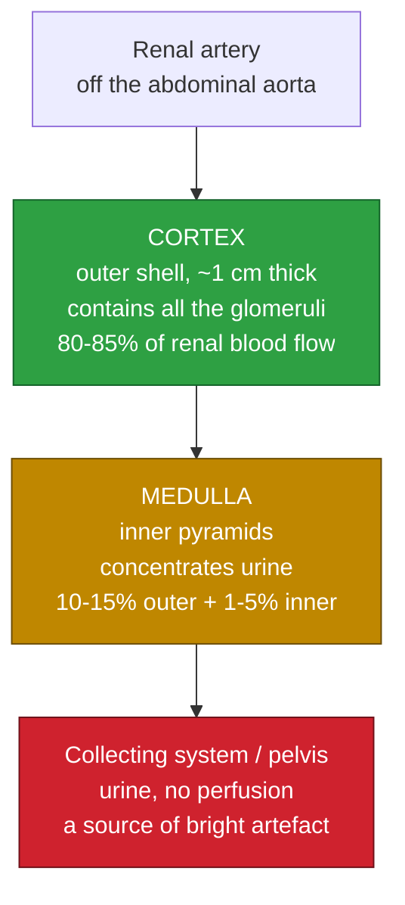
```mermaid
flowchart TD
  A["Renal artery<br/>off the abdominal aorta"] --> B["CORTEX<br/>outer shell, ~1 cm thick<br/>contains all the glomeruli<br/>80-85% of renal blood flow"]
  B --> C["MEDULLA<br/>inner pyramids<br/>concentrates urine<br/>10-15% outer + 1-5% inner"]
  C --> D["Collecting system / pelvis<br/>urine, no perfusion<br/>a source of bright artefact"]
  classDef good fill:#2ea043,color:#fff,stroke:#136229;
  classDef warn fill:#bf8700,color:#fff,stroke:#6b4c00;
  classDef bad fill:#cf222e,color:#fff,stroke:#6e1119;
  class B good;
  class C warn;
  class D bad;
```

Blood enters through the renal artery and goes first to the **cortex**, the outer shell. The cortex
contains every **glomerulus** — the tuft of capillaries where blood is filtered. Filtration needs
pressure and volume, so the cortex is one of the most heavily perfused tissues in the body. The
filtrate then runs down into the **medulla**, the inner pyramids, whose job is to concentrate urine
by maintaining a steep salt gradient. A steep gradient is destroyed by washout, so the medulla is
deliberately perfused *slowly*. Perfusion here is not a measure of tissue demand; it is a
consequence of the organ's plumbing.

The flow shares — from the NCBI Bookshelf preclinical renal ASL chapter — are *"roughly estimated
that 80–85% of the total renal blood flow supplies renal cortex, 10–15% outer medulla and only 1–5%
inner medulla."* Note these are **shares of total flow**, not per-gram perfusion; they do not
convert into a cortex:medulla ratio without a mass correction, and the source calls them "roughly
estimated".

The magnitude anchor, from Odudu 2018:

> *"All blood flow to the kidney (~25% of cardiac output at rest or ~1200 mL/min or ~400 mL/100 g/min
> in a 70 kg adult with a 300 g kidney) passes through the glomeruli of the renal cortices."*

So **~400 mL/100 g/min whole-kidney is a useful outer sanity bound**: a cortical value materially
above it implies more blood than the kidney receives.

## 2.2 Why the cortex/medulla split is NOT a grey/white matter analogue

The temptation is obvious: brain has GM ≈ 2.5 × WM, kidney has cortex > medulla, so port the GM/WM
ratio check. **Do not.** The analogy fails physically, and it fails statistically.

### Physically: the two boundaries are different kinds of object

**Grey and white matter are distinguished by tissue composition.** White matter is myelinated axons;
grey matter is cell bodies. Myelin is fatty and changes the T1 relaxation time dramatically, so on a
standard T1-weighted structural scan the two classes separate with high contrast, and every brain
pipeline can segment them essentially for free. The boundary is a genuine material interface.

**Cortex and medulla are distinguished by function, not composition.** Both are renal parenchyma —
the same basic tissue, the same water content, similar T1. What differs is which part of the nephron
you are in, and the nephron is a tube that runs continuously from cortex to medulla and back.
Consequences:

1. **The border is geometrically hostile.** It is not a smooth shell. Cortical tissue dives *into*
   the medulla between the pyramids as the **columns of Bertin**, so any coronal slice cuts through
   interdigitating fingers of cortex and medulla. A 2D slice through that geometry has a large
   boundary length per unit area, which is exactly the condition that maximises partial volume
   (§1.2d).
2. **The native MRI contrast that separates them is T1, and it is weak and variable.** Garcia-Ruiz
   2025 measured cortical T1 at **1356 ± 39 ms** and medullary at **1633 ± 46 ms** at 3T — a gap of
   ~280 ms, roughly 20%. Real, but nothing like the myelin contrast in brain. And the gap shrinks or
   vanishes in disease.
3. **The contrast that works is a quantitative T1 map, which the consensus does not require.**
   **R9.11** (6%, 93%) says ROIs should be drawn on the M0 image or a separately acquired structural
   dataset. A T1 map is listed as an option for semi-automatic methods "if local expertise is
   available" (**R9.10**), not as part of the minimum protocol. So the one image that would let you
   segment reliably is usually not in the dataset.

### Statistically: there are no probability maps, and the boundary is at human-observer noise

A brain tissue **probability map** is a per-voxel number in [0,1] saying how much of this voxel is
grey matter. It is what makes QEI's structural term possible: `Pearson(CBF, 2.5·GM + 1.0·WM)` needs a
continuous expected-perfusion image to correlate against. For the kidney:

- The consensus default is **manual ROI drawing** (**R9.10**, 0% abstention, **100% agreement**).
- Every off-the-shelf renal segmentation tool checked — UKAT, Renal Segmentor, TotalSegmentator —
  outputs **whole kidney only**. None produces a cortex/medulla split, let alone a probability.
- The best published automatic cortex segmentation is Bones et al. 2022 (a 3-U-net cascade,
  extracting cortex from the T1 map). It scores **Dice 0.78 ± 0.04** against reference — while a
  **second human expert** scores **0.77 ± 0.02** against the same reference.

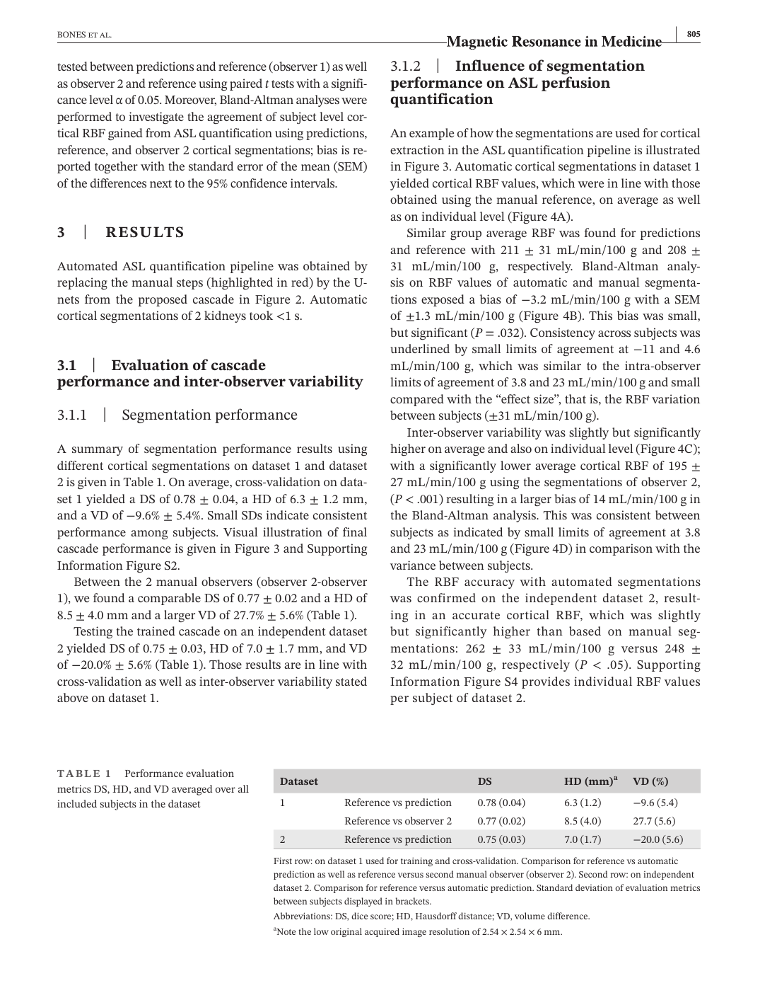

That second number is the important one. **The automatic method is already as good as a second
trained human.** The cortex/medulla boundary is not hard to find because the algorithms are
immature; it is intrinsically ill-defined, and there is no ground truth to be more accurate than.

> ⛔ **Do not convert Dice 0.78 into "22% error on the perfusion value."** Dice is a surface-overlap
> statistic, and perfusion is a volume mean. In the same paper, Dice 0.78 produced a cortical RBF
> difference of **1.4%** (auto 211 ± 31 vs manual 208 ± 31 mL/min/100 g, n=10 healthy, 1.5T balanced
> pCASL) — a bias of −3.2 with SEM 1.3, statistically significant at P = .032 but small. The second
> human observer was *further* off, at 195 ± 27 (bias 14, P < .001). Segmentation disagreement
> mostly cancels in the mean.

### And so the ratio itself is unstable

Computed from published means (this is arithmetic on their reported values, not a published
statistic):

| Study | Cortex | Medulla | Ratio | How the medulla mask was drawn |
|---|---|---|---|---|
| Haddock 2019 | 273 ± 38 | **38 ± 5** | **7.2** | **innermost half** of the medulla volume, 3T FAIR bFFE, n=9 |
| Li LP 2016 | 207.3 ± 41.8 | 42.6 ± 15.8 | 4.9 | 3T FAIR True-FISP, n=30 healthy |
| Harteveld 2020 (FAIR) | 362 ± 57 | 140 ± 47 | 2.6 | 3T multi-delay, n=15 healthy |
| Harteveld 2020 (pCASL) | 201 ± 72 | 84 ± 27 | 2.4 | same subjects, same session |
| Garcia-Ruiz 2025 (3T) | 310.63 ± 52.72 | 133.83 ± 19.68 | 2.3 | 3T multi-delay PCASL, n=16 |
| Zhang 2024 | 317.59 ± 14.02 | 202.85 ± 28.50 | 1.6 | 3T 3D pCASL, n=10 |
| Hammon 2016 | 337.10 ± 34.83 | **279.61 ± 26.73** | **1.2** | 1.5T FAIR True-FISP, semi-automatic k-means |
| Shirvani 2019 | 190.72 ± 32.35 | ~168–183 | **1.1** | cortex = **outer 3 voxels**, 3T FAIR 3D-GRASE |

**1.1 to 7.2 — a factor of 6.5, driven almost entirely by how the medulla mask was drawn.** Haddock
took the innermost half of the medulla, guaranteeing pure medulla and the highest ratio. Shirvani
took the outer three voxels as "cortex", guaranteeing contamination and the lowest.

The low end is a documented artefact, and Hammon 2016 says so about its own data:

> *"the segmentation of the medulla may contain parts of the cortex what explains higher than
> expected medullary perfusion values"*

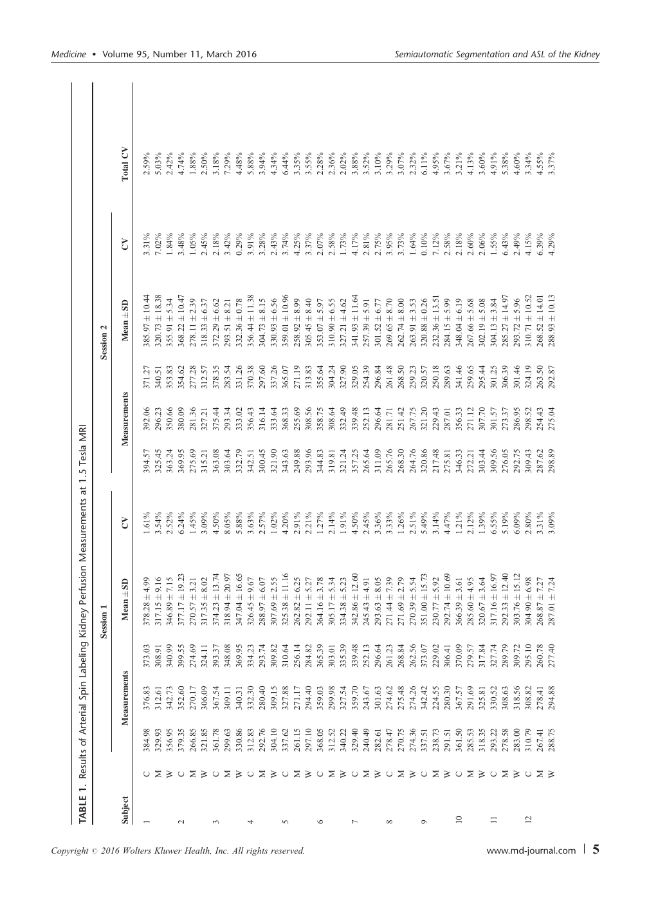

There are two internal tells you can check without trusting anyone's prose:

1. Hammon's **whole-kidney value (307.26 ± 25.65) sits *between* cortex (337.10) and medulla
   (279.61)**, with only 58 units separating the compartments. That is the signature of a k-means
   split of a nearly uniform map, not of a real physiological gradient.
2. Shirvani 2019 reports a fitted tissue T1 of **799.61 ms cortex vs 807.11 ms medulla at 3T** — an
   8 ms gap where Garcia-Ruiz measures 280 ms, and where Gillis 2014 measured renal medulla T1 at
   **1651 ± 86 ms**. Their two "compartments" were the same tissue.

> ✅ **What the ratio *is* good for:** an **UNCALIBRATED segmentation-integrity flag.** A ratio near
> 1 is a reliable signature of a broken cortico-medullary segmentation, because no protocol that
> genuinely separates the compartments has ever reported one. Report it against the **segmentation**,
> never as a verdict on the CBF map.

## 2.3 Why medullary perfusion is physically unreliable to measure

R10.2 is a consensus statement, but it is not an arbitrary one. Five independent physical effects
stack up, and each of them makes the medullary number worse.

**1. The signal is small to begin with.** Medullary perfusion is genuinely 2.5–7× lower than
cortical, so ΔM is proportionally smaller. Garcia-Ruiz measured medullary PWS at **1.36–1.40% of M0**
against 2.95–3.09% in cortex. You are now measuring a 1.4% difference between two images.

**2. The label has to cross the cortex first, and decays on the way.** Blood reaching the medulla
has already traversed the cortical circulation. The label is not a chemical tracer — it is inverted
magnetisation, and it decays with T1 of blood (1.65 s at 3T) from the instant it is created. Every
extra 0.2 s of transit costs `1 − exp(−0.2/1.65) ≈ 11%` of the remaining label. Harteveld 2020
measured medullary ATT at **0.70 s (FAIR) / 0.86 s (pCASL)** against cortical **0.47 / 0.71 s** in
the same subjects — so the medulla's tracer arrives measurably later and measurably weaker.

**3. Some of the tracer stops being blood.** This is the effect with no brain analogue at all. The
tracer *is water*, and the kidney's job is to filter water out of blood. Labelled water that is
filtered at the glomerulus leaves the vascular compartment and enters the tubular filtrate, then
travels down into the medulla **as urine rather than as blood**. The single-compartment kinetic
model — which assumes the tracer stays in a well-mixed blood/tissue pool — no longer describes what
is happening. The consensus states this plainly:

> *"Medullary perfusion is difficult to measure reliably … because of its lower perfusion (and,
> therefore, lower signal) and close proximity to cortex which makes it susceptible to partial volume
> contamination. The kinetics of labelled water are also uncertain because arterial water is divided
> between filtrate and smaller arterioles."*

**4. Partial volume runs one way.** The medulla is surrounded by tissue perfused several times
higher. Every contaminated boundary voxel therefore pushes the medullary mean **up**, never down.
This is why medullary values across the literature drift upward as segmentation gets sloppier
(§2.2), and why the highest published medullary values come with author admissions of cortical
contamination.

**5. And the measurement does not reproduce.** Garcia-Ruiz 2025's test–retest, n=14 completed,
~1 week apart:

| ROI | Field / method | within-subject CV | ICC [95% CI] |
|---|---|---|---|
| **Cortex** | 1.5T multi-delay | **7.27%** | 0.83 [0.55–0.94] |
| Cortex | 3T multi-delay | 10.50% | 0.72 [0.34–0.90] |
| **Medulla** | 1.5T multi-delay | 15.78% | **0.43** [−0.12–0.77] |
| **Medulla** | **3T multi-delay** | **19.38%** | **0.08** [−0.45–0.57] |

**All four medullary ICC confidence intervals include zero.** An ICC of 0.08 means essentially no
subject-specific information survives between sessions — scan the same person twice and the second
medullary value tells you almost nothing about the first.

> ✅ **Design consequence:** medullary metrics are **INFO / N-A**, never PASS/WARN/FAIL. Two careful
> groups reached that conclusion independently in practice: Gillis 2014 fell back to whole-kidney
> perfusion (*"Perfusion maps generated via post processing result in a heterogeneous appearance of
> the renal medulla, probably due to the presence of larger vessels and the renal pelvis"*), and
> de Boer 2021 wrote *"In accordance with a recent recommendation article, medullary perfusion was
> not reported for FAIR-ASL since it was deemed unreliable due to low SNR."*

---

# PART 3 — Motion: why a moving organ breaks brain motion correction

## 3.1 What brain motion correction actually assumes

Brain realignment is rigid-body registration: for each volume in the time series, estimate 6
parameters (3 translations, 3 rotations) that best align it to a reference, then resample. It works
because four assumptions hold almost perfectly in the head:

1. **One rigid body.** The skull does not deform, and everything inside it moves together.
2. **The object keeps its shape.** Frame 40 contains exactly the same anatomy as frame 1, just
   displaced.
3. **The imaged volume covers the object.** If the head shifts 2 mm, the tissue that moved out of
   one voxel moved into a neighbouring voxel that you also acquired.
4. **The labelling geometry moves with the object,** because the neck and the brain are attached and
   the labelling plane is fixed relative to both.

In the kidney, **all four fail.** That is why "port the framewise-displacement check" is the wrong
instinct.

## 3.2 How much the kidney moves, measured

The consensus puts it rhetorically:

> *"Subject breathing induces kidney displacements up to an order of magnitude larger than the
> typical ASL voxel size, which if unaccounted for cause a significant loss of image quality in ASL."*

Here is the measurement instead. **Yamashita et al. 2014** tracked the **centre of gravity** of 39
kidneys in 20 cancer patients (median age 47, range 26–86) on **4D-CT** — not MRI, so treat it as
displacement physics rather than an ASL result:

| Axis | Displacement | Range |
|---|---|---|
| **Cranio-caudal** | **11.1 ± 4.8 mm** | 2.5 – 20.5 mm |
| Anterior-posterior | 3.6 ± 2.1 mm | 0.6 – 8.0 mm |
| Right-left | 1.7 ± 1.4 mm | 0.4 – 5.9 mm |

Motion correlated with respiratory phase at **r > 0.97, p < 0.01 in all three directions** — it is
not random, it is a periodic driven signal.

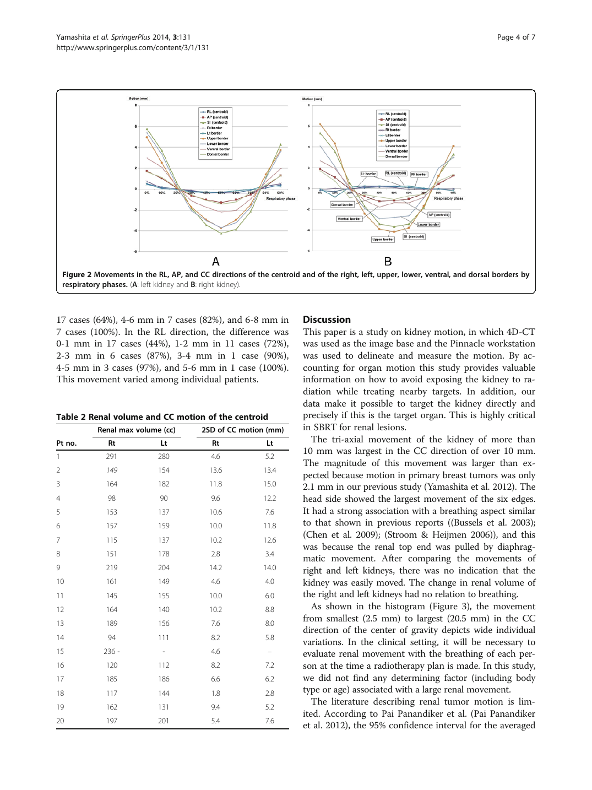

**A second cohort disagrees in magnitude, and the reason is instructive.** Siva et al. 2013 (62
analysed of 71 patients, median age 68) measured the **kidney apex**, not the centre of gravity, and
got mean cranio-caudal displacement of **0.74 cm left / 0.75 cm right**, with **ranges 0.10–2.15 and
0.11–1.92 cm** and 90th percentiles 1.33 and 1.30 cm. Different landmark, different number — which is
exactly the sort of thing that must be recorded next to a value.

> ⚠️ **A citation trap in that paper.** Its abstract reads *"The mean (interquartile range)
> displacement of the left and right kidneys was 0.74 cm (0.45-0.98 cm)"*. Anyone quoting the abstract
> alone will carry 0.45–0.98 cm forward as if it were the range. It is the **IQR**; the range is
> 0.10–2.15 cm, four times wider at the top. Read Table 1 on p.3, not the abstract.

> ⚠️ **One honest caveat.** The consensus's "order of magnitude larger than the voxel" is not
> consistent with its own recommended in-plane resolution of 2–4 mm (**R6.10**): 11.1 mm is about
> **3–5 voxels**, not 10–20. Lead with the measured number, not the rhetoric.

Note also the **anisotropy**, roughly **6.5 : 2 : 1** (CC : AP : RL). An isotropic scalar like brain
framewise displacement collapses those three axes into one number and averages away the only axis
that matters.

## 3.3 What each broken assumption costs you

**Assumption 1 fails — there are two independent rigid bodies.** The consensus is explicit:

> *"Note that the kidneys should be registered separately if using rigid/affine transformations as
> they move independently."* — Nery 2020, in the **R8.1** discussion

This is corroborated by three independent implementations: Bones 2019 uses a per-kidney
translation-only 3D Euler transform in Elastix; Bones 2022 registers *per subject, per kidney, per
slice*; Olsen 2025 applies rigid-body affine *"separately for each repetition and kidney"*. A single
transform fitted to both kidneys is guaranteed to be wrong for at least one of them, and the fit will
be dragged by whichever kidney has more voxels. Combined with **R10.1** (report left and right
separately, 100% agreement), this changes the data model: **a renal QC report has at minimum two
ROIs per subject, not one.**

**Assumption 2 fails — the kidney deforms.** The diaphragm pushes it, the liver presses on the right
one, and the surrounding organs are soft. A rigid transform can align the centroid and still leave
the cortical rim misaligned by a voxel, which is the width of the structure you are trying to
measure.

**Assumption 3 fails hardest, and this is the one that ends scans.** The consensus default readout
is **2D single-slice** (**R6.1**). You acquire one 4–8 mm slab and nothing else. If the kidney moves
11 mm cranio-caudally and your slice is 5 mm thick, then **at end-inspiration the slice contains
different tissue than at end-expiration** — possibly no kidney at all. This is *through-plane*
motion, and no amount of in-plane registration can recover it, because the information was never
acquired. Registration can only fix displacement inside the plane it sampled.

That is the real reason **R6.7** (6%, 93%) recommends coronal-oblique slices along the kidney's long
axis. It is usually explained as a FAIR requirement, and it is one — but it also aligns the dominant
cranio-caudal motion axis **with the image plane**, converting the failure that cannot be fixed into
the failure that can. **An orientation check is therefore a motion-risk check**, and it must be
transplant-aware (§3.5).

**Assumption 4 fails — the label itself is corrupted, not just the image.** In pCASL the labelling
plane is fixed on the aorta. If the subject moves, the *tissue* moves relative to a plane that
stays put, so the geometric relationship between label and target changes mid-scan. Worse, for
velocity-selective ASL, motion of tissue through the velocity-encoding gradients **creates label
where there should be none**. Bones 2020 (n=15 healthy) measured this: spurious labelling from
motion appears as *"homogeneously high ΔM over the entire kidney ROI"* — an abnormally high
whole-kidney mean **with loss of cortico-medullary contrast**. It affected **25.4% of repetitions**
with feet–head labelling (4.3% right–left, 4.9% anterior–posterior), and **5 of 15 subjects were
excluded** entirely. That two-part signature — high mean *and* flat contrast — is directly
implementable and is the best concrete detection lead in the renal literature.

The same paper kills the obvious shortcut:

> 🚩 *"no one-to-one correlation between respiratory bellows signal change and generated spurious
> label. Some repetitions had tissue labeling without the bellows indicating motion, others showed no
> spurious labeling even when motion was detected."*

**An external respiratory trace is not sufficient.** Image-derived metrics are required.

## 3.4 The cost when motion is uncorrected, and the BS trade-off

**Signature in the image:** Bones 2019 — *"When motion in free-breathing renal ASL series is not
accounted for, perfusion maps have a blurred appearance with low SNR due to subtraction artifacts."*
Because control and label are acquired at different times and therefore at different points in the
breathing cycle, the subtraction does not cancel static tissue — it leaves a bright/dark edge
wherever the organ boundary moved. Those edges are typically far larger than the 3% ΔM you wanted.

**Cost, measured:** Nery 2019's paediatric inter-session within-subject CV was **50.6% without motion
correction versus 20.1% with it**, and ICC rose from **0.372 to 0.833**. Whole subjects are lost too:
Bones 2019 lost **1 of 10** to through-plane motion; Franklin 2021 lost **1 of 6**; Radovic 2022
excluded **3 of 21** paediatric transplant patients (14.3%) *"due to poor cooperation and motion
artefacts."*

And then the trap. Background suppression (§1.2c) improves tSNR by 1.6–2×, but registration works by
matching anatomical features — and background suppression exists precisely to **remove anatomical
signal**. Bones 2019 measured the collision: under the heaviest BGS condition, conventional
ASL-image-driven coregistration to M0 **succeeded only 54% of the time**, versus 100% when driven by
separately acquired fat images.

> 🚩 **A renal QC tool must therefore check background-suppression quality and registration quality
> as separate, potentially opposing, metrics.** A scan can have excellent BS *because* it has
> unusable registration.

One more subtlety: magnitude-only subtraction leaves a **positive** residual static-tissue signal
(Bones 2019), so a residual-signal check must not assume perfect cancellation to zero.

## 3.5 Transplants are a different organ, geometrically

A transplanted kidney sits in the **iliac fossa**, anastomosed to the iliac artery. From the
consensus's Transplants section:

- Much less respiratory motion — *"making respiratory gating/triggering less important for ASL in
  the transplant setting."*
- PCASL *"may be preferable"* (the consensus's words — not "preferred") because of the flexibility in
  positioning the labelling and imaging planes.
- The labelling plane goes perpendicular to the abdominal aorta **just above the iliac bifurcation**.
- Baseline iliac flow *"likely changes the absolute perfusion of the transplanted kidney compared to
  the native kidney, biasing absolute perfusion towards lower values."*

And a practical consequence measured by Echeverria-Chasco 2023 (n=20 enrolled / 18 ASL analysed,
54 ± 14 y, 120 ± 105 months post-transplant, 3.0T Siemens Skyra, pCASL SE-EPI, PLD 1.2 s):

> *"Because the allograft is placed in the iliac fossa under different orientations, orienting the
> imaging slab along the long axis of the kidney was not always possible."*

So the coronal-oblique orientation check must be transplant-aware, or it will fail every allograft.

## 3.6 The renal artefact sources with no brain analogue

| Source | What it is, and the evidence |
|---|---|
| **Air in lungs and bowel** | Air and tissue have very different magnetic susceptibility; the field distorts at the boundary and EPI geometry stretches. de Boer 2021 (n=19, 3T FAIR GE-EPI): *"Artifacts (Fig. 5) were limited to geometrical distortion due to B0 inhomogeneities and susceptibility effects due to air in the lungs and digestive tract, which did not affect the perfusion quantification."* — a WARN, not a FAIL |
| **Intestinal peristalsis** | Bowel moves independently of breathing, so respiratory gating does not remove it. Radovic 2022 resolved it by *"organising patients to come early in the morning fasted"* |
| **The collecting system / renal pelvis** | Urine, not tissue; no perfusion, but bright and central. Franklin 2021 saw *"small abnormalities at locations that are part of the collecting system"* |
| **Perirenal fat** | Fat has a short T1, so it recovers quickly and **survives background suppression** — Bones 2019: *"fatty tissue … recovers quickly from preceding BGS pulses due to the short T1."* Hence **R7.6**, fat suppression (5%, 90%) |
| **Chemical shift** | Fat and water precess at slightly different frequencies, so fat is mis-mapped along the phase-encode axis — *"particularly important for readout schemes with a low phase-encoding bandwidth, such as the aforementioned recommended EPI readout"* |
| **bSSFP banding** | *"sensitive to field inhomogeneity, which results in banding artefacts in areas of off-resonance."* Brain ASL almost never uses bSSFP; renal FAIR frequently does |
| **Anatomical un-plannability** | de Boer 2021: *"In one subject, FAIR-ASL could not be planned because the kidneys were located in the same coronal plane as the aorta"* (1 of 19) — the selective slab must exclude the aorta, and sometimes geometry forbids it |

---

# PART 4 — The two labelling schemes, and why they disagree by 80%

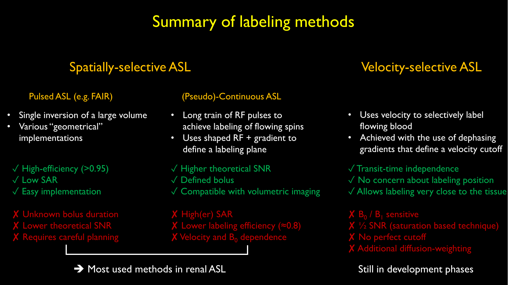

*(⚠️ conference slides, not peer-reviewed.)* Both PASL/FAIR and PCASL are consensus-endorsed
(**R3.1**, 6% abstention, 93% agreement), and Odudu 2018 notes *"The flow-sensitive alternating
inversion recovery (FAIR) variant is the PASL scheme most widely used in renal imaging"* —
so `PASLType: "FAIR"` is the common path in the kidney, not an
edge case. Velocity-selective ASL is still developmental.

## 4.1 What each scheme actually does

**FAIR (Flow-sensitive Alternating Inversion Recovery)** is pulsed ASL with a geometry trick. For the
**label** image, you apply a *non-selective* inversion — the whole body's magnetisation is flipped,
including all inflowing blood. For the **control** image, you apply a *selective* inversion of just a
slab containing the imaging slice. Blood that flows in from outside that slab is inverted in the
label condition but not in the control, so the subtraction isolates it. **R4.2** (6%, **100%**
agreement) requires the selective slab to exclude the aorta, and **R4.3** (13%, 86%) sets its
thickness to imaging slab + 10–20 mm.

**PCASL** labels continuously at a fixed plane: a long train of RF pulses with a matched gradient
flips blood as it flows through one geometric plane, 8–10 cm superior to the kidney centre
(**R5.4**, 14%, 94%), perpendicular to the aorta (**R5.3**, 13%, 100%), for a labelling duration of
1.5–1.8 s (**R5.2**, 10%, 100%).

## 4.2 The measurement: 1.5 to 1.8× apart in the same people

**Harteveld et al. 2020** scanned the **same subjects** with **both** schemes in the same session
(16 recruited, 15 analysed at visit 1, 12 at visit 2; 8 male; age 51 ± 10 y with a >40 y inclusion
criterion; eGFR 86 ± 15; 3T Philips Ingenia; multi-delay; single-shot **gradient-echo** EPI 2D
multislice).

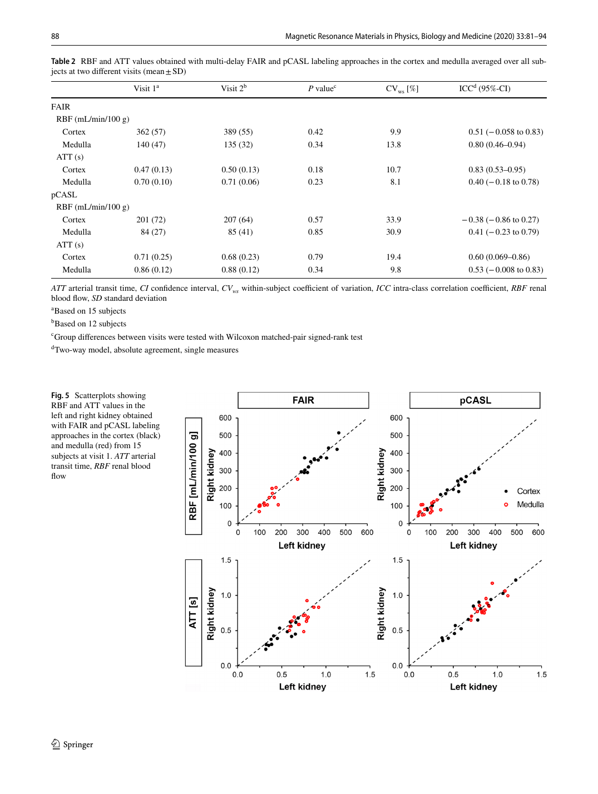

| | FAIR | pCASL |
|---|---|---|
| **Cortex RBF** (mL/min/100 g) | **362 ± 57** | **201 ± 72** |
| **Medulla RBF** | 140 ± 47 | 84 ± 27 |
| Cortex ATT (s) | 0.47 ± 0.13 | 0.71 ± 0.25 |
| Medulla ATT (s) | 0.70 ± 0.10 | 0.86 ± 0.12 |
| Cortex within-subject CV | **9.9%** (ICC 0.51) | **33.9%** (ICC −0.38) |
| Medulla within-subject CV | 13.8% | 30.9% |

**362 / 201 = 1.80.** That is larger than any age effect, any field-strength effect, and any disease
effect in this entire document. It is the same organ, the same session, the same analysis.

## 4.3 Why the gap exists — three real mechanisms, and one term that works the *other* way

> 🧭 **Start with the term that does not explain it, because getting its sign wrong is the easiest
> mistake in this whole section.** In both RBF equations α sits alone in the **denominator**, so
> RBF scales as `1/α`. The consensus assumes **α = 95% for PASL** (**R9.7**, 6% abstention, 100%
> agreement — note this is *not* the brain White Paper's 98%) and **α = 85% for PCASL** (**R9.8**,
> 13%, 86%), and Harteveld quantified both arms with exactly those numbers (*"labeling efficiency of
> 95% for FAIR and 85% for pCASL"*). FAIR therefore carries the *larger* assumed α and is divided by
> *more* — so this term pushes FAIR **down** relative to pCASL, by a factor `0.85/0.95 = 0.895`, i.e.
> **10.5% down**. The constant choice **cannot be a cause of the 1.80× gap; it partially cancels it.**
>
> Which makes the underlying physical difference *bigger* than the table shows. Strip the constants
> out and the raw ΔM ratio is `1.80 ÷ 0.895 ≈ **2.0×**`. Three mechanisms have to account for 2.0×,
> not 1.8×.
>
> ⚠️ And note the arithmetic trap while you are here: `0.95/0.85 − 1 = 11.8%` is the ratio of the two
> **constants**, and that is the *correction factor*, not the effect on the **map**. The effect on the
> map is `1 − 0.85/0.95 = 10.5%`. K8.4 in the design doc makes the same distinction for every
> constant it grades; get it wrong and every quantification-conformance number in this project reads
> a few percent too large and, worse, sometimes in the wrong direction.
>
> It gets worse in practice, and this part is real: Garcia-Ruiz 2025 assumed a PCASL efficiency of
> **0.75**, and the Taso slides quote 0.6–0.8. Every one of those choices rescales the whole map, and
> two studies using different assumed α are not comparable at all.

**Mechanism 1 — pCASL's true efficiency is genuinely lower in the abdomen, and it is not measured.**
Two abdominal effects with no brain equivalent, from the Taso slides:

> *"Off-resonance/B1 effects: Dielectric (B1) and field inhomogeneities (B0) are more important in
> the abdomen. Impacts labeling efficiency + imaging quality. Highly pulsatile flow: The abdominal
> aorta has a strong pulsatile profile. Affects labeling efficiency (especially in PCASL)."*

pCASL relies on blood passing through the labelling plane at a velocity within the range the pulse
train was designed for. The aorta is the most pulsatile vessel in the body: velocity swings from
near-zero in diastole to a metre per second in systole. Blood arriving at the wrong phase is labelled
inefficiently or not at all. FAIR does not care — it inverts a whole slab, so velocity is irrelevant
to whether the label is created. **If the true α is lower than the assumed 0.85, the computed pCASL
RBF is biased low** — which is the direction observed.

**Mechanism 2 — transit distance.** pCASL creates the label 8–10 cm upstream; FAIR creates it
essentially at the target. Every millisecond of transit costs label to T1 decay (§2.3, mechanism 2).
Harteveld measured cortical ATT of 0.47 s (FAIR) versus 0.71 s (pCASL) — 0.24 s of extra decay is
another `1 − exp(−0.24/1.65) ≈ 14%` of label lost, and if the model's assumed transit does not match,
that loss lands in the perfusion estimate.

**Mechanism 3 — FAIR's bolus is undefined without a saturation scheme.** pCASL has a bolus whose
duration you set: τ, the labelling duration. FAIR does not — the "bolus" is however much blood
happened to be in the inverted region, which depends on the subject's cardiac output. This is why
**R4.5** (25% abstention, **100%** agreement) makes **QUIPSS II or Q2TIPS mandatory** for FAIR
quantification: those schemes saturate the label after a defined TI1 (1.0–1.2 s, **R4.6**, 25%, 92%),
imposing a known bolus duration. FAIR data quantified without bolus saturation — which the consensus
notes many studies do, replacing TI1 with TI — *"maximizes signal but will underestimate flow by a
transit time-dependent factor."* Studies differ in whether they applied it.

> ⚠️ **What you should NOT conclude.** The ATT difference is partly definitional, and Harteveld says
> so: *"The ATT is dependent on the used measurement method, and was, therefore, not directly
> compared between both labeling approaches."* FAIR studies typically sample first delays at
> 0.1–0.3 s while pCASL starts at 0.4–0.5 s, and you cannot fit an ATT below your first sampled
> delay. Do not report the FAIR/pCASL ATT gap as a physiological finding.

## 4.4 What this means for any threshold

> 🚩 **A renal perfusion plausibility band must be keyed on labelling scheme FIRST**, then field
> strength, then population. A single global band is meaningless: the FAIR healthy mean (362) is
> higher than the pCASL healthy mean plus two standard deviations (201 + 144 = 345).

There is a second lesson in that table. **FAIR's within-subject CV was 9.9%; pCASL's was 33.9%, with
an ICC of −0.38** — a negative ICC means between-subject variance was indistinguishable from noise.
Repeatability is scheme-dependent too, and pCASL in the abdomen is the harder of the two to
stabilise. Whatever tolerance you set for longitudinal change, it cannot be the same number for both
schemes.

---

# PART 5 — Brain vs kidney, difference by difference

The table to keep open while porting a check. Brain column = the 2015 Alsop White Paper
(`../researchpaper/nihms591163.pdf`). Kidney column = Nery 2020 unless stated.

Only the rows where the two documents genuinely **disagree**, or where the kidney has a rule the
brain has none for, are listed — the full verbatim renal statements are in §6.2.

| # | Aspect | 🧠 Brain (Alsop 2015) | 🫘 Kidney (Nery 2020) | Consequence |
|---|---|---|---|---|
| 1 | **Labelling scheme** | PCASL is *the* recommendation | **Both FAIR and PCASL adequate** (R3.1, 93%) | Cannot assume one. Every check branches |
| 2 | **Labelling geometry** | Plane ~85 mm below AC–PC | PCASL: perpendicular to the **aorta**, **8–10 cm superior** to kidney centre. FAIR: selective slab **excludes the aorta** | Two mutually exclusive geometry checks |
| 3 | **PLD / TI** | PLD 1800 ms; 2000 ms >70 y | **PCASL PLD 1.2–1.5 s**; **FAIR TI 1.8–2.0 s**, TI1 1.0–1.2 s | Renal PLD is **shorter**. A brain-tuned "PLD too short" rule fires on every good renal scan |
| 4 | **Bolus control** | QUIPSS II, TI1 = 800 ms | **QUIPSS II or Q2TIPS mandatory** for FAIR quantification (R4.5, **100%**) | Hard check on the FAIR path |
| 5 | **Averages** | not specified numerically | **≥20 ASL pairs**, body text scoped to *"the recommended 2D readout"* | **Gate on readout type** (§1.3) |
| 6 | **Readout** | **3D** segmented RARE/GRASE recommended | **2D single-slice** default (R6.1, 95%); **3D explicitly not the default** (R6.3, 95%) | Inverted. Default artefacts are EPI distortion + chemical shift, not 3D blurring |
| 7 | **Orientation** | axial | **Coronal oblique along the kidney long axis** (R6.7, 93%) | Checkable from the NIfTI affine; it is a motion-risk check (§3.3); must be transplant-aware |
| 8 | **Breathing** | n/a — the head is still | **Breath-hold NOT recommended** (94%); **free breathing preferred** (76%); **triggering advantageous** (95%) | Free breathing + retrospective correction is the *expected* case |
| 9 | **M0 and BS** | M0 must have BS **OFF** | *"The PD image should be acquired without labelling or BGS"* | **Identical rule.** Do not invert Module 6 |
| 10 | **M0 requirement / TR** | *recommended*; TR > 5 s else corrected | **mandatory** (R9.1, 94%); **same 5 s, same correction**, but T1<sub>tissue</sub> is kidney T1 and no value is given | Port the check; source the constant separately (§7.4) |
| 11 | **Fat suppression** | not a brain issue | **recommended** (R7.6, 90%) | New check, metadata-only |
| 12 | **Registration** | rigid, one brain | **highly recommended** (R8.1, **100%**), **each kidney separately** | Per-kidney, not per-volume |
| 13 | **Outlier rejection** | SCORE/SCRUB/ENABLE | **recommended** (R8.2, **100%**) — **no method and no threshold specified** | The clearest opening for the toolbox |
| 14 | **Tissue priors** | GM/WM/CSF probability maps | **none.** Manual ROI is the default (R9.10, 100%) | **QEI does not port as written** |
| 15 | **Reported ROI** | whole-brain GM | **cortex, left and right separately** (R10.1, **100%**); whole-kidney explicitly rejected | Two verdicts per subject |
| 16 | **Medulla / WM analogue** | WM is a valid ROI | **medullary RBF "not considered reliable"** (R10.2, 89%) | Medulla → INFO/N-A, never PASS/FAIL |
| 17 | **T1<sub>blood</sub> @1.5T** | 1350 ms | **1.48 s — differs** (R9.6, 93%) | Change on the 1.5T path |
| 18 | **α PASL** | 0.98 | **0.95 — differs** (R9.7, 100%) | Change on the FAIR path |
| 19 | **Standard data layout** | ASL-BIDS | **none.** ASL-BIDS: *"validated in ASL images of the brain only"* | §9.5 |
| 20 | **Reference pipeline** | ASLPrep, ExploreASL, BASIL | **none.** No renal ASL pipeline exists | Cannot consume pipeline derivatives (§9.6) |
| 21 | **Published quality index** | QEI (Dolui 2024), cutoff ~0.5 | **none** | §9.1 |

**Unchanged, and worth knowing are unchanged:** λ = 0.9 mL/g, T1<sub>blood</sub> = 1.65 s at 3T,
α<sub>PCASL</sub> = 0.85, the single-compartment model, and background suppression being recommended
for the ASL pairs.

> 💡 **The three that trip people up:** #6 (2D not 3D), #9 (the M0/BS rule is the **same**, not
> inverted), and #14 (no tissue priors, therefore no QEI).

---

# PART 6 — The consensus, quoted

## 6.1 What Nery 2020 actually is

*Consensus-based technical recommendations for clinical translation of renal ASL MRI*, MAGMA
33(1):141–161, DOI `10.1007/s10334-019-00800-z`, **CC-BY**, funded by EU COST Action **CA16103
(PARENCHIMA)**. A modified Delphi process — online surveys plus two in-person meetings — run by a
panel of **23 renal ASL experts** (26 authors; from Table 1: 16 physicists, 4 engineers,
2 radiologists, 1 nephrologist, across 6 countries). **59 statements achieved consensus** (p.6:
*"The 59 final consensus statements are listed in Table 2"*); **2 failed**, both on dietary
preparation.

One mechanic to quote, or a reviewer will think you made an arithmetic error: *"Consensus was assumed
to be found when 75% or more of respondents agreed"*, and **neutral responses counted as abstentions
and were excluded from the denominator** — which is why agreement + abstention can exceed 100%.

## 6.2 The statements, verbatim

Format: **R-number (abstention %, agreement %)**.

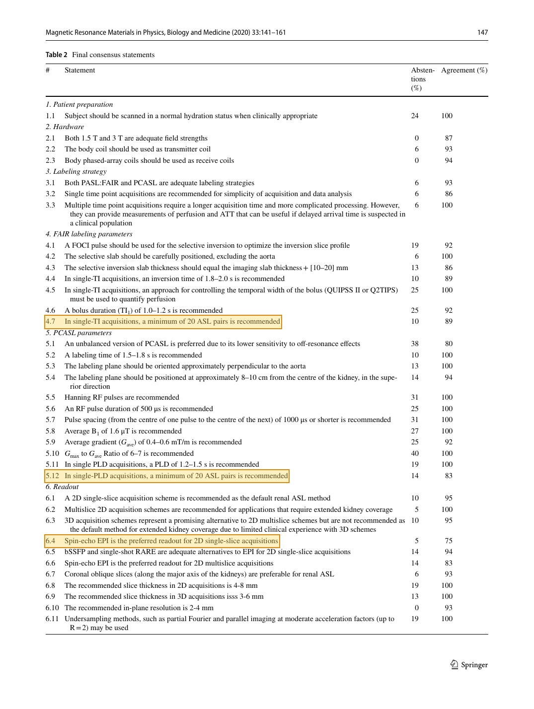

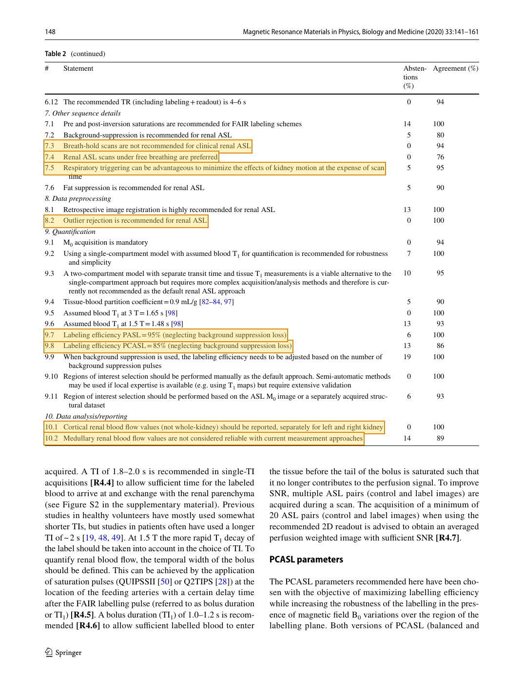

**Field strength and scheme**
- **R2.1** (0, 87) — *"Both 1.5 T and 3 T are adequate field strengths"*
- **R3.1** (6, 93) — *"Both PASL:FAIR and PCASL are adequate labeling strategies"*
- **R3.2** (6, 86) — *"Single time point acquisitions are recommended for simplicity of acquisition and data analysis"*; **R3.3** (6, 100) — multi-timepoint *"can be useful if delayed arrival time is suspected in a clinical population"*

**FAIR path**
- **R4.2** (6, 100) — *"The selective slab should be carefully positioned, excluding the aorta"*
- **R4.3** (13, 86) — *"The selective inversion slab thickness should equal the imaging slab thickness + [10–20] mm"*
- **R4.4** (10, 89) — *"In single-TI acquisitions, an inversion time of 1.8–2.0 s is recommended"*
- **R4.5** (25, 100) — *"In single-TI acquisitions, an approach for controlling the temporal width of the bolus (QUIPSS II or Q2TIPS) must be used to quantify perfusion"*
- **R4.6** (25, 92) — *"A bolus duration (TI1) of 1.0–1.2 s is recommended"*
- **R4.7** (10, 89) — *"In single-TI acquisitions, a minimum of 20 ASL pairs is recommended"*

**PCASL path**
- **R5.2** (10, 100) — *"A labeling time of 1.5–1.8 s is recommended"*
- **R5.3** (13, 100) — *"The labeling plane should be oriented approximately perpendicular to the aorta"*
- **R5.4** (14, 94) — *"The labeling plane should be positioned at approximately 8–10 cm from the centre of the kidney, in the superior direction"*
- **R5.11** (19, 100) — *"In single PLD acquisitions, a PLD of 1.2–1.5 s is recommended"*
- **R5.12** (14, 83) — *"In single-PLD acquisitions, a minimum of 20 ASL pairs is recommended"*

**Readout and geometry**
- **R6.1** (10, 95) — 2D single-slice default; **R6.3** (10, 95) — 3D not the default
- **R6.4** (5, **75**) — *"Spin-echo EPI is the preferred readout for 2D single-slice acquisitions"*
- **R6.7** (6, 93) — *"Coronal oblique slices (along the major axis of the kidneys) are preferable for renal ASL"*
- **R6.8** (19, 100) 2D slice 4–8 mm · **R6.9** (13, 100) 3D slice 3–6 mm · **R6.10** (0, 93) in-plane 2–4 mm ·
  **R6.11** (19, 100) acceleration *"up to R = 2 may be used"* · **R6.12** (0, 94) TR *"(including labeling + readout) is 4–6 s"*

**Motion and preprocessing**
- **R7.2** (5, 80) — *"Background-suppression is recommended for renal ASL"*
- **R7.3** (0, 94) — *"Breath-hold scans are not recommended for clinical renal ASL"*
- **R7.4** (0, **76**) — *"Renal ASL scans under free breathing are preferred"*
- **R7.5** (5, 95) — *"Respiratory triggering can be advantageous to minimize the effects of kidney motion at the expense of scan time"*
- **R7.6** (5, 90) — *"Fat suppression is recommended for renal ASL"*
- **R8.1** (13, **100**) — *"Retrospective image registration is highly recommended for renal ASL"*
- **R8.2** (0, **100**) — *"Outlier rejection is recommended for renal ASL"*

**Reporting**
- **R9.10** (0, 100) — *"Regions of interest selection should be performed manually as the default approach. Semi-automatic methods may be used if local expertise is available (e.g. using T1 maps) but require extensive validation"*; **R9.11** (6, 93) — ROI *"based on the ASL M0 image or a separately acquired structural dataset"*
- **R10.1** (0, **100**) — *"Cortical renal blood flow values (not whole-kidney) should be reported, separately for left and right kidney"*
- **R10.2** (14, 89) — *"Medullary renal blood flow values are not considered reliable with current measurement approaches"*

> ⚠️ **Watch the weak ones.** R6.4 (75%) and R7.4 (76%) barely cleared the bar; anything built on
> them must WARN, never FAIL. R5.10 (Gmax/Gave 6–7) carries **40% abstention** — the highest in the
> document — *and* the discussion says "a ratio of 7" while Table 2 says "6–7". Advisory at best.

**The two that failed**, both on patient preparation: *"Diet needs to be controlled before the scan"*
(43% abstention, 50% agreement) and *"Subjects are required to follow a controlled and standardized
salt intake before the scan"* (48%, 27%). Only **R1.1** (24%, 100%) passed: *"Subject should be
scanned in a normal hydration status when clinically appropriate."*

## 6.3 The quantification block

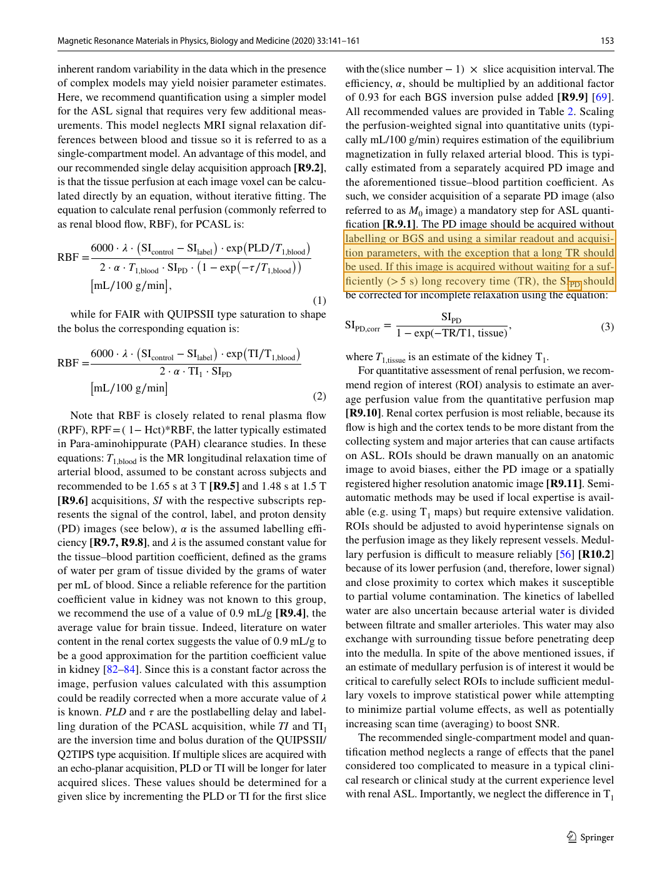

**PCASL:**

```
RBF = 6000 · λ · (SI_control − SI_label) · exp(PLD / T1_blood)
      ────────────────────────────────────────────────────────   [mL/100 g/min]
      2 · α · T1_blood · SI_PD · (1 − exp(−τ / T1_blood))
```

**FAIR with QUIPSS II / Q2TIPS bolus saturation:**

```
RBF = 6000 · λ · (SI_control − SI_label) · exp(TI / T1_blood)
      ───────────────────────────────────────────────────────    [mL/100 g/min]
      2 · α · TI1 · SI_PD
```

Read the structure rather than the symbols. The numerator is **the measured perfusion signal,
corrected back up for the label that decayed during the wait** (`exp(delay/T1_blood)`). The
denominator is **everything you have to divide out to make the number physical**: `SI_PD` converts
arbitrary units to a fraction, `α` accounts for the label you never created, the `2` is because
inversion changes magnetisation by twice the equilibrium value, and the bolus term (`T1_blood ·
(1 − exp(−τ/T1_blood))` for PCASL, `TI1` for FAIR) is the effective duration over which label was
delivered. `6000` converts mL/g/s to mL/100 g/min.

**Constants, with their agreement levels:**

| Constant | Renal value | Brain White Paper | Same? |
|---|---|---|---|
| λ (partition coefficient) | **0.9 mL/g** (R9.4, 5/90) | 0.9 mL/g | ✅ same number |
| T1<sub>blood</sub> @ 3T | **1.65 s** (R9.5, 0/100) | 1650 ms | ✅ identical |
| T1<sub>blood</sub> @ 1.5T | **1.48 s** (R9.6, 13/93) | 1350 ms | ❌ **differs** |
| α PASL | **95%** (R9.7, 6/100) | 0.98 | ❌ **differs** |
| α PCASL | **85%** (R9.8, 13/86) | 0.85 | ✅ identical |
| BS penalty | **×0.93 per inversion pulse** (R9.9, 19/100) | ~5%/pulse noted | ≈ same |

Both α statements are explicitly parenthesised *"(neglecting background suppression loss)"*, and
R7.2 recommends BS. **So the recommended renal protocol is exactly the case where the raw α values
must not be used.** A quantifier that hard-codes 0.85 or 0.95 will be systematically wrong on the
recommended acquisition.

> 🚩 **The λ caveat you must carry.** The consensus says it itself, on the page above:
>
> *"Since a reliable reference for the partition coefficient value in kidney was not known to this
> group, we recommend the use of a value of 0.9 mL/g [R9.4], the average value for brain tissue.
> Indeed, literature on water content in the renal cortex suggests the value of 0.9 mL/g to be a
> good approximation … Since this is a constant factor across the image, perfusion values calculated
> with this assumption could be readily corrected when a more accurate value of λ is known."*
>
> λ = 0.9 is a **consensus-endorsed borrowed brain constant**, not a renal measurement. For context
> the field uses 0.8 (Gillis 2014, Cox 2017), 0.9 (consensus, Harteveld, Shirvani), 0.91 (measured in
> **dog** kidney by Hillaert 2024), and the preclinical literature spans **0.52–0.94** with the
> Chuang chapter stating flatly that *"the suitable value for the kidney remains to be determined."*
> Both blood-T1 values likewise trace to a **single** primary source — Zhang et al., MRM
> 2013;70:1082–1086 (consensus reference [98]), paywalled and unread here.

## 6.4 The M0 rule — the cleanest port from brain

> *"we consider acquisition of a separate PD image (also referred to as M0 image) a mandatory step
> for ASL quantification [R.9.1]. The PD image should be acquired without labelling or BGS and using
> a similar readout and acquisition parameters, with the exception that a long TR should be used. If
> this image is acquired without waiting for a sufficiently (> 5 s) long recovery time (TR), the
> SI_PD should be corrected for incomplete relaxation using the equation:*
>
> `SI_PD,corr = SI_PD / (1 − exp(−TR / T1_tissue))`
>
> *where T1_tissue is an estimate of the kidney T1."*

Compare the brain White Paper: *"If TR is less than 5 s, the PD image should be multiplied by the
factor (1/(1 − e^(−TR/T1,tissue))), where T1,tissue is the assumed T1 of gray matter."* **Same
threshold, same functional form, same direction.**

That is not a coincidence, and it is worth understanding why the rule ports unchanged when almost
nothing else does. The M0 rule is not a statement about kidneys or brains. It is a statement about
**longitudinal relaxation**, which is a property of hydrogen nuclei in water in a magnetic field. The
recovery curve `1 − exp(−TR/T1)` has the same form in every tissue in every organ; only the value of
T1 changes. The 5 s threshold is simply the point at which recovery exceeds ~95% for any plausible
soft-tissue T1 at clinical field strengths, and the correction is the exact algebraic inverse of the
curve. Any organ, same rule.

> ⚠️ **But the kidney has two tissue T1s, and the consensus gives neither.** A regex search of the
> full paper for any `\d{3,4} ms` pattern returns **zero hits**; the only mention is *"where
> T1_tissue is an estimate of the kidney T1."* The paper mandates a correction it does not
> parameterise. Published values must come from elsewhere — see §7.4. And since cortex and medulla
> differ by 280–450 ms, a single "kidney T1" in the correction is itself an approximation.

## 6.5 What the consensus does NOT contain

This is the most decision-relevant finding in the whole document, and it is a **negative**:

- ❌ **No numeric image-quality threshold of any kind** — no tSNR floor, no CoV cutoff, no motion
  limit, no negative-voxel fraction, no SNR floor, no renal QEI.
- ❌ **No reference perfusion values.** `mL/100` appears exactly **once** in the paper, in the phrase
  *"typically mL/100 g/min"*, with no number attached.
- ❌ **No kidney tissue T1 value** (§6.4).
- ❌ **No outlier-rejection method or criterion**, despite R8.2 being unanimous. The consensus's own
  survey of practice is an admission: *"Outlier rejection methods, including retrospective sorting of
  renal ASL data, have relied on manual or automatic approaches, including using data from external
  sensors such as respiratory bellows."*
- ❌ **No paediatric or age-specific recommendation** anywhere among the 59 statements. *(Established
  by exhaustive search — an absence cannot be quoted.)*
- ❌ No mention of vascular crusher gradients or flow suppression, unlike the brain White Paper.

The panel is candid about why:

> *"Another limitation of this work is that experimental data were lacking to provide a definitive
> answer for certain issues. When no published data were available to support a specific statement
> or the existing evidence was not strong, members were asked to provide an answer based on their
> expert opinion. The consensus protocol proposed here can thus be considered a starting point that
> will likely be modified in the future as more data become available."*

**So Nery 2020 gives a hard protocol-conformance specification and nothing at all for judging the
perfusion map.** Stream A is fully evidenced; every Stream B threshold ships `uncalibrated`.

## 6.6 Table 4 — the closest thing to a renal sidecar schema

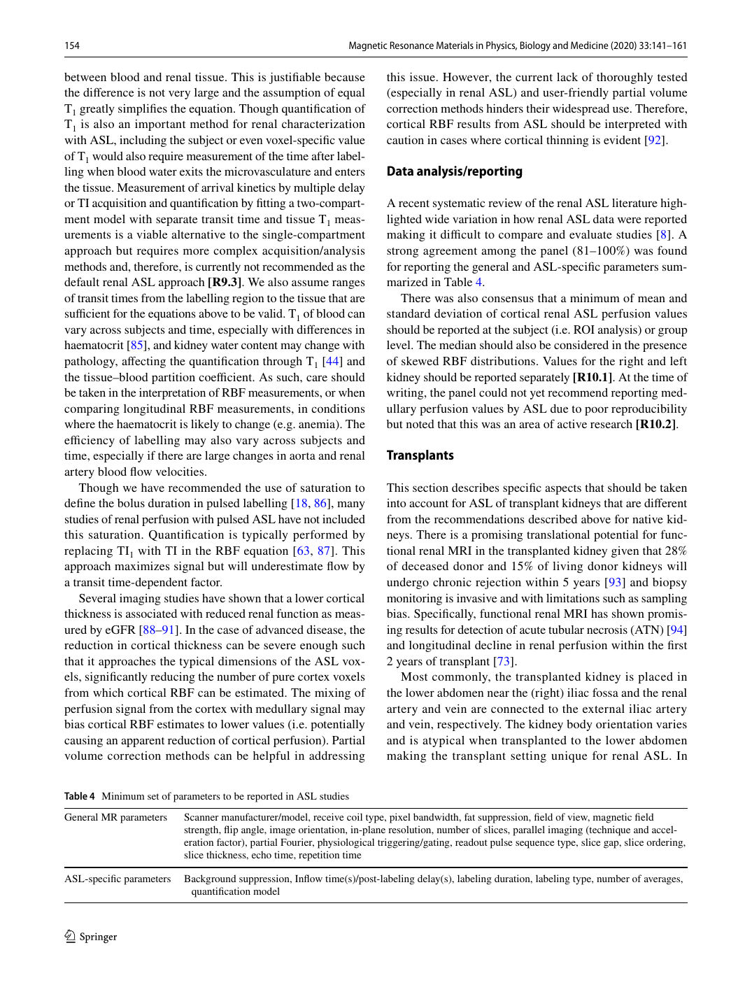

Agreed at **81–100%**:

- **General MR (19 items):** scanner manufacturer/model, receive coil type, pixel bandwidth, fat
  suppression, field of view, field strength, flip angle, image orientation, in-plane resolution,
  number of slices, parallel imaging (technique + acceleration factor), partial Fourier,
  physiological triggering/gating, readout pulse sequence type, slice gap, slice ordering, slice
  thickness, echo time, repetition time.
- **ASL-specific (6 items):** background suppression, inflow time(s)/post-labelling delay(s),
  labelling duration, labelling type, number of averages, quantification model.
- Plus, from the discussion: *"a minimum of mean and standard deviation of cortical renal ASL
  perfusion values should be reported … The median should also be considered in the presence of
  skewed RBF distributions."*

Roughly **eight** of those items have no dedicated BIDS field — see §9.5.

---

# PART 7 — Normal values, with everything attached

## 7.1 Read this before using any number below

> 🛑 **Every value in this section is a COHORT MEAN, not a threshold.** No paper in the 51-PDF
> library proposes a PASS/FAIL band for renal perfusion. Converting a mean ± SD into a band is the
> single most likely way to ship something indefensible.

Four technical confounds move renal cortical perfusion **before any physiology**:

| Confound | Effect size | Evidence |
|---|---|---|
| **Labelling scheme** | **~80%** | FAIR 362 ± 57 vs pCASL 201 ± 72, **same 15 subjects, same session** (Harteveld 2020, 3T) |
| **Field strength** | **~11%** | 1.5T 347.65 ± 54.08 vs 3T 310.63 ± 52.72, **same 16 subjects, same day** (Garcia-Ruiz 2025, multi-delay PCASL, p<0.001) |
| **Age** | **~20%** | <40 y 383.90 ± 61.80 vs ≥40 y 306.10 ± 41.33 at 1.5T single-delay (Garcia-Ruiz 2025, n=8 vs 8, p=0.005) |
| **ROI definition** | **~7%** | Two competent human observers differ by 14 mL/100 g/min on the same data (Bones 2022, 1.5T pCASL) |

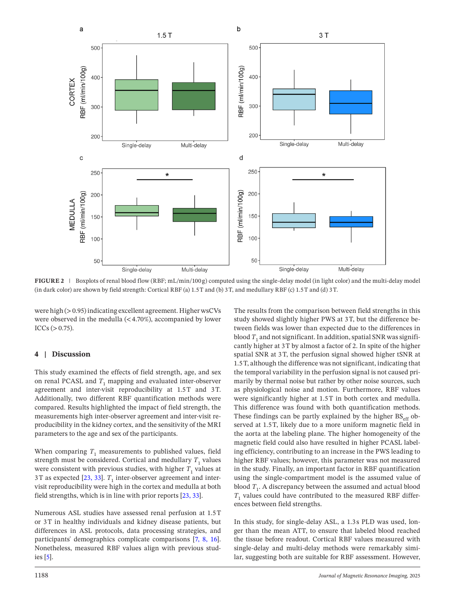

The field-strength direction is **counter-intuitive**: higher field gives *lower* measured RBF. The
paper's own explanation is worth reading, because it is a labelling story, not a signal story —
background-suppression efficiency was higher at 1.5T (91.3% vs 88.5% in cortex), *"likely due to a
more uniform magnetic field in the aorta at the labeling plane"*, which raises the perfusion-weighted
signal and hence the computed RBF. Store field strength as an explicit band key rather than assume
it.

**Not a confound:** sex. Garcia-Ruiz found no significant sex effect on RBF (p = 0.076 cortex,
p = 0.621 medulla) — but ATT *was* significantly shorter in females (0.75 ± 0.11 s vs 0.96 ± 0.22 s
at 1.5T). Stratify an ATT check by sex; do not stratify a perfusion band by it.

## 7.2 Cortical perfusion — the healthy adult picture

**The literature-wide envelope** (Odudu et al. 2018, systematic review of **53 studies** published in
English through January 2018; studies *"generally small (mean 25 ± 23 participants, range 4–98)"*,
mixed 1.5T/3T, mixed FAIR/pCASL):

> *"Renal cortical perfusion by ASL ranged from 139 to 427 mL/100 g/min in healthy volunteers and
> from 83 to 412 mL/100 g/min in a broad range of patient groups."*

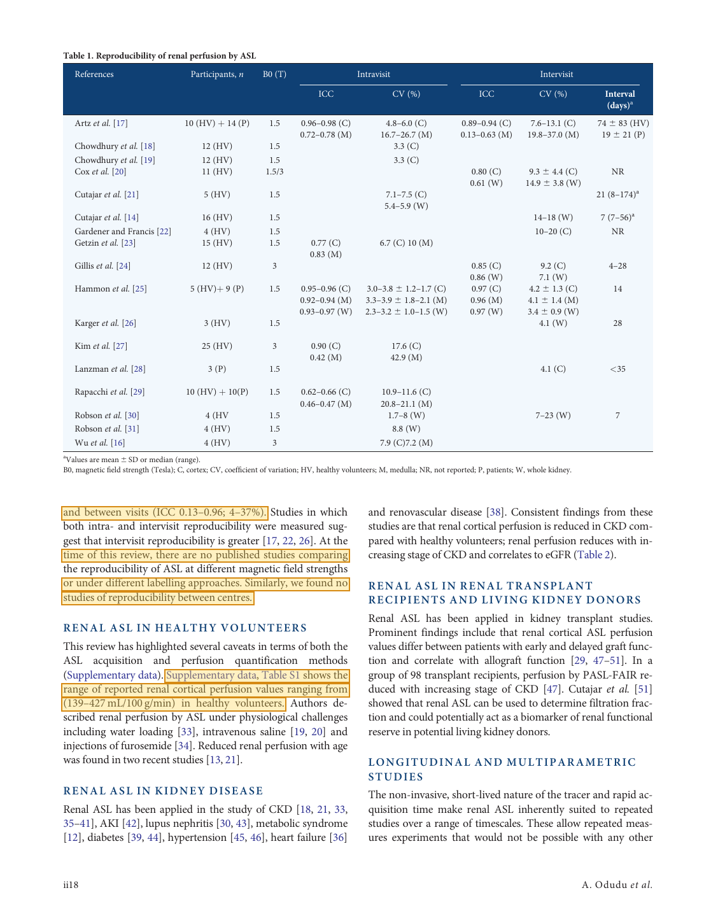

> ⚠️ **Three reasons that range is not a PASS band.** (1) It is a spread of **study-level means**, not
> of individuals — mechanically narrower than the individual distribution. (2) Healthy (139–427) and
> patient (83–412) ranges **overlap almost entirely**, so it has essentially no discriminative power.
> (3) The lower bound of 139 does not trace to any row of the review's own supplementary Table S1 —
> the lowest healthy-control cortical mean there is **117 ± 24** (Shimizu 2017, older subgroup).

**Individual-subject spread**, which is what you would actually need: Olsen et al. 2025 report
**150–422 mL/min/100 mL** across 10 healthy subjects (3T, multislice FAIR + background suppression,
TI 1500 ms, 20 pairs). Note the units — **per 100 mL, not per 100 g**.

**Representative published healthy-adult cortical means**, chosen to span the range:

| Value (mL/100 g/min) | n | Age | Field | Labelling | Source |
|---|---|---|---|---|---|
| **441 ± 84** | 7 | 23–34 | 1.5T | FAIR | Bones 2021 |
| **383.90 ± 61.80** (<40 y) | 8 | 25–38 | 1.5T | PCASL single-delay | Garcia-Ruiz 2025 |
| **362 ± 57** | 15 | 51 ± 10 | 3T | multi-delay FAIR, GE-EPI | Harteveld 2020 |
| **337.10 ± 34.83** | 14 (5 HV + 9 hypertensive) | 48 ± 13 | 1.5T | FAIR True-FISP, 18-s breath-hold | Hammon 2016 |
| **310.63 ± 52.72** | 16 | 41.8 ± 13.3 | 3T | multi-delay PCASL | Garcia-Ruiz 2025 |
| **273 ± 38** (230–343) | 9 | 20–48 | 3T | FAIR bFFE | Haddock 2019 |
| **255 ± 70** | 85 (of 127) | 41 ± 19 | **1.5T AND 3T pooled** | FAIR, λ=0.8 | Cox 2017 |
| **211 ± 31** (auto) / 208 ± 31 (manual) | 10 | 23–38 | 1.5T | balanced pCASL | Bones 2022 |
| **207.3 ± 41.8** | 30 | 42.0 ± 18.1 | 3.0T | FAIR True-FISP | Li LP 2016 |
| **201 ± 72** | 15 | 51 ± 10 | 3T | multi-delay pCASL, GE-EPI | Harteveld 2020 |
| **201 ± 36** (SE-EPI) | 10 | 27 ± 10 | 3T | FAIR, respiratory-triggered | Buchanan 2018 |
| **139.10 ± 37.93** (ATT-corrected) | 14 **males only** | 27.0 / 64.8 subgroups | 3.0T | pcASL, α assumed 0.75 | Shimizu 2017 |

**That is 139 to 441 — a factor of 3.2, in healthy adults.** Every one is a legitimate published
measurement. **The spread is protocol, not biology.**

> ⚠️ **One frequently-quoted value is not what it looks like.** Nery 2019's `295 ± 97` is a
> **voxelwise** SD across the cortical ROI, not a between-subject SD (*"expressed as mean ± SD
> considering all voxels within the cortical ROI"*); its between-subject spread is the range 245–343
> from 5 **adults**, not children. Never compute mean ± 2SD from it.

## 7.3 Cortical perfusion in disease — why a low-perfusion gate cannot be a hard check

| Cohort | Cortical RBF | n | Field | Labelling | Source |
|---|---|---|---|---|---|
| Healthy | 317.59 ± 14.02 | 10 | 3T | 3D pCASL | Zhang 2024 |
| CKD stage 3 | 182.66 ± 24.35 | 15 | " | " | " |
| **CKD stage 5** | **110.53 ± 25.85** | 5 | " | " | " |
| Healthy | 207.3 ± 41.8 | 30 | 3.0T | FAIR True-FISP | Li LP 2016 |
| **Diabetic stage-3 CKD** | **108.4 ± 36.4** | 33 | " | " | " |
| Healthy (Cox cohort) | 255 ± 70 | 85 | 1.5T+3T | FAIR | Cox 2017 |
| **CKD** | **83 ± 68** | 11 | " | " | " |
| Renal artery stenosis, GFR <30 | 133.7 ± 45.2 | 118 kidneys / 62 pts | 3.0T | pCASL, PLD 2000 ms | Zhao 2025 |

> 🚩 **Look at what that does to a threshold.** Healthy cohorts run 139–441. Diseased cohort *means*
> reach 83–110, and individual patients go lower. **The healthy and diseased distributions overlap
> almost completely once protocol is included.**
>
> The only defensible use of an absolute renal perfusion value in v1.0 is an **implausibility guard**
> — flag 900, flag 5, say nothing about 150 — reported as **INFO/WARN**, never FAIL.

> ⚠️ **Two footnotes on the Li LP rows.** The Kidney Int Rep CKD paper (PMC5575771) is **Li L-P et
> al.**, *not* Cox et al. — the attribution circulates wrong. And its controls were scanned at
> **TI 1.5 s** while patients were scanned at **TI 2.0 s** (*"Although this is not ideal"*, the paper
> concedes), with the groups differing by 26 years in age.

Published healthy **medullary** means, for completeness, run from **38 ± 5** (Haddock 2019,
innermost-half ROI) to **279.61 ± 26.73** (Hammon 2016, authors admitting cortical contamination) —
**a factor of 7.4 for the same tissue**, listed in the ratio table in §2.2 and explained physically
in §2.3. There is nothing there to build a threshold on either.

## 7.4 Renal T1 — you need this for the M0 correction

The consensus mandates `SI_PD / (1 − exp(−TR/T1_tissue))` and supplies no T1.

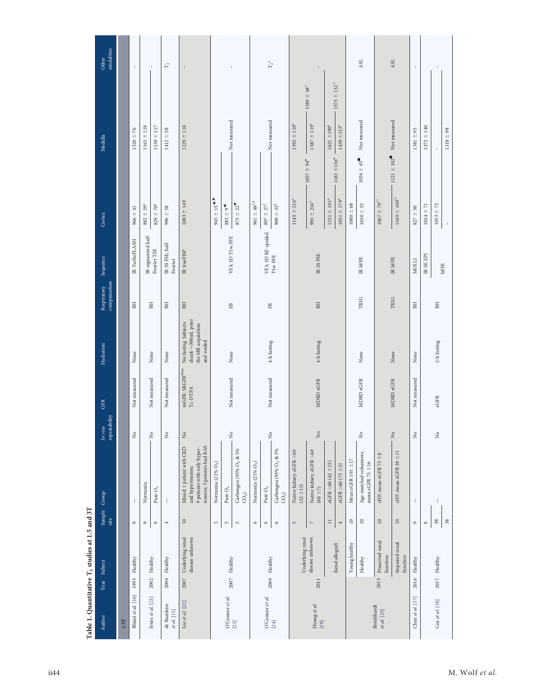

Healthy-subject spread from that review:

| Field | Cortex T1 | Medulla T1 |
|---|---|---|
| **1.5T** | ~827 – 1080 ms | ~1054 – 1428 ms |
| **3T** | ~1124 – 1406 ms | ~1388 – 1685 ms |

The most-cited single reference is **de Bazelaire et al. 2004** (*Radiology* 230(3):652–9) — cortex
**1142 ± 154 ms**, medulla **1545 ± 142 ms** at 3.0T (n=6); cortex 996 ± 58, medulla 1412 ± 58 at
1.5T (n=4). *(Paywalled — read here only via the Wolf 2018 table, so secondary.)* David Alsop is a
co-author of de Bazelaire too.

Measured alongside PCASL by Garcia-Ruiz 2025 (n=16): cortical T1 **1023.29 ± 39.30 ms** (1.5T) /
**1356.02 ± 38.72 ms** (3T); medullary **1348.54 ± 50.40** / **1632.68 ± 46.24 ms**.

> ⚠️ **A trap.** Stanisz 2005 is widely cited for tissue T1, but its "kidney" row is **rat kidney
> measured in vitro** (1194 ± 27 ms at 3T, 690 ± 30 ms at 1.5T). The 1.5T value is ~140 ms below any
> human in vivo cortex T1. Do not use it as a human renal constant.

## 7.5 Repeatability — the ceiling on any renal threshold

**Pooled ranges** (Odudu 2018 narrative, from the 17 of 53 studies reporting reproducibility):

| ROI | Intra-visit | Inter-visit |
|---|---|---|
| **Cortex** | ICC 0.62–0.98, CV **3–18%** | ICC 0.85–0.97, CV **4–13%** |
| **Medulla** | ICC 0.27–0.94, CV **3–43%** | ICC 0.13–0.96, CV **4–37%** |

> ⚠️ **One of those bounds does not trace to the review's own Table 1** (visible in the §7.2
> screenshot): the lowest medullary intra-visit ICC there is **0.42**, not 0.27. The other five check
> out. Cite the narrative sentence, and be ready for a reviewer who opens the table.

**Individual studies, cortex:**

| Study | Design | Cortex repeatability |
|---|---|---|
| Gillis 2014 | 3.0T FAIR True-FISP, 4–28 d, n=12 | ICC 0.85 (0.65–0.94), CVws **9.2%** |
| Echeverria-Chasco 2023 | 3.0T pCASL, n=18 allografts | CVws **10.73%**, ICC 0.84 |
| Garcia-Ruiz 2025 | 1.5T+3T PCASL, n=14, ~1 wk | wsCV 7.27–11.33%, ICC 0.72–0.83 |
| Olsen 2025 | 3T FAIR + PET, n=10 | same-day CoV 10.9%; between-day (median 16 d) **11.2%** |
| de Boer 2021 | 3T FAIR, n=13 | CoV 10%, ICC 0.47, **repeatability coefficient 29% (19–39%)** |
| Harteveld 2020 | 3T, n=12 at visit 2, 1 wk | **FAIR 9.9%** / **pCASL 33.9%** |
| Buchanan 2018 | 3T FAIR, n=10, 2 visits ≤2 wk | between-session CoV **SE-EPI 17.2%** / **GE-EPI 28.3%** |
| Nery 2019 | 1.5T FAIR, **n=11 children**, 23 ± 10 d | inter-session WSCV **20.1%** with motion correction, **50.6%** without |

> 🎯 **What actually constrains the design:** realistic **inter-session** cortex repeatability is
> **~10–11%** — Garcia-Ruiz, Olsen, de Boer and Echeverria-Chasco converge there independently, and
> de Boer's **repeatability coefficient of 29%** is the honest answer to "how big must a change be
> before it is real?" Meanwhile **inter-observer ROI drawing is only 1.30–2.46%** (Garcia-Ruiz, ICC
> 0.96–0.99; Radovic 2022 measured ICC 0.96). **So segmentation is NOT the dominant error —
> acquisition and physiology are.** Put QC effort into motion, M0 and labelling checks, not ROI
> refinement.
>
> ⛔ **But note the category error waiting here.** All of these are **wsCV / ICC / repeatability
> coefficients** — group statistics computed across subjects × sessions. They **cannot be evaluated
> on a single incoming scan**, which is what a per-scan verdict must do. They bound a
> *longitudinal-change* alarm; they are not per-scan thresholds. And Gillis's 9.2% is a
> **between-session** wsCV, **not** a spatial coefficient of variation across voxels — calibrate a
> renal sCoV threshold at 9.2% and essentially every real kidney map fails.

And one measured warning that is easy to miss. Nery 2019:

> *"Despite the prevalence of artefacts in the RBF maps without applying MC methods, the intra-session
> repeatability was high. Because both ASL runs shared the same M0 … systematic errors because of a
> consistent misalignment between the M0 and the ASL data set in both ASL runs resulted in a
> repeatable mean RBF despite severe corruption in the RBF maps in the no-registration case. **For
> this reason, intra-session WSCV and ICC alone should not be taken to be indicators of image quality
> directly.**"*

**Two scans can agree perfectly and both be wrong, because they share a broken denominator.**

## 7.6 Image-quality metrics — the closest thing to renal QC reference values

From **Garcia-Ruiz et al. 2025** (n=16 healthy, 8 female, 41.8 ± 13.3 y, eGFR 101.40 ± 13.72; **same
subjects at both field strengths on the same day**; PCASL, SE-EPI, 3 slices per kidney, 3×3×5 mm,
TR 6000 ms, PLD 1.3 s single-delay, 2 background-suppression pulses):


| Metric | Cortex 1.5T | Cortex 3T | Medulla 1.5T | Medulla 3T |
|---|---|---|---|---|
| **PWS (% of M0)** | 2.95 ± 0.56 | 3.09 ± 0.59 | 1.36 ± 0.15 | 1.40 ± 0.19 |
| **Spatial SNR** | 1.10 ± 0.35 | 2.05 ± 0.66 | 0.54 ± 0.12 | 0.92 ± 0.26 |
| **tSNR** | 3.54 ± 0.71 | 3.33 ± 0.54 | 2.00 ± 0.44 | 1.89 ± 0.41 |
| **BS efficiency (%)** | 91.34 ± 3.18 | 88.45 ± 3.02 | 91.81 ± 4.02 | 86.40 ± 4.52 |

**Their spatial-SNR definition is implementable and renal-specific:**

```
Spatial SNR = 0.655 · μ_signal / ( sqrt(N_pairs) · σ_noise )
```

where `μ_signal` is the mean in a kidney ROI and — the clever part — **`σ_noise` is measured in a
LIVER ROI**, *"since blood flow to the liver was not labeled; therefore, the difference signal in
the liver should be noise."* That is a genuinely good idea: it gives you a same-image, same-shot
noise estimate from tissue that should be exactly zero, and it needs no phantom and no repeat scan.

> ⛔ **Get the square root right.** It is `sqrt(N_pairs)` in the denominator, not `N_pairs`. At 20
> pairs that is a factor of **4.5**, and getting it wrong makes your values incomparable to the
> reference table above.

**Readout dependence** — Buchanan, Cox & Francis 2018 (n=10 healthy, 27 ± 10 y, 3T Philips Achieva,
FAIR + FOCI, respiratory-triggered, 25 pairs, renal **cortex**):

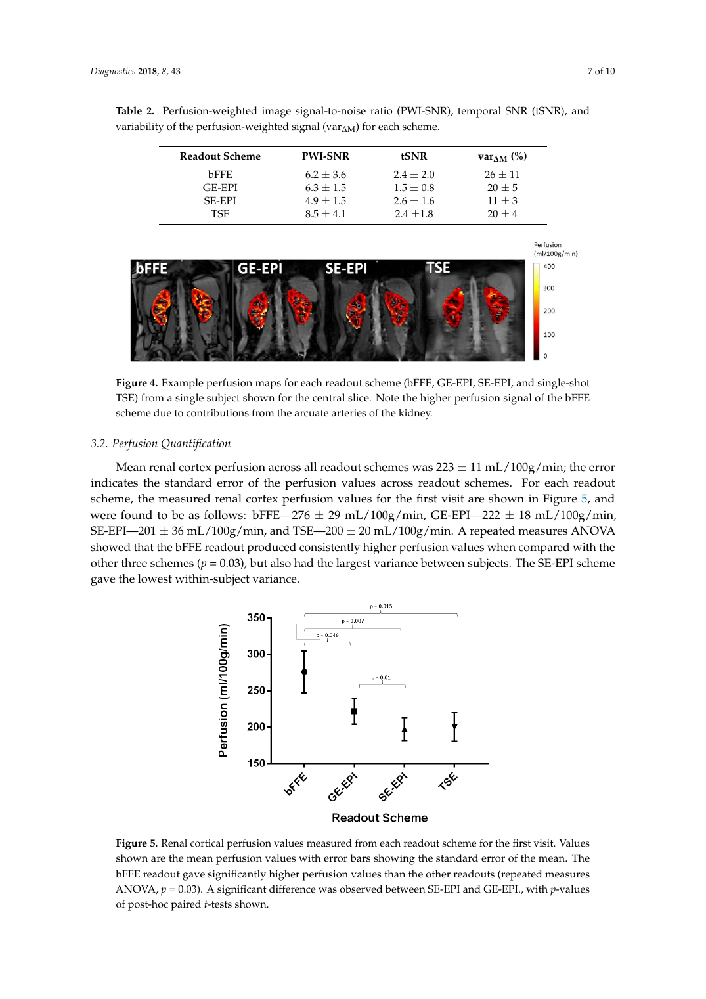

| Readout | PWI-SNR | tSNR | var ΔM across slices | Cortex RBF |
|---|---|---|---|---|
| bFFE | 6.2 ± 3.6 | 2.4 ± 2.0 | 26 ± 11% | 276 ± 29 |
| GE-EPI | 6.3 ± 1.5 | 1.5 ± 0.8 | 20 ± 5% | 222 ± 18 |
| **SE-EPI** | 4.9 ± 1.5 | **2.6 ± 1.6** | **11 ± 3%** | 201 ± 36 |
| TSE | 8.5 ± 4.1 | 2.4 ± 1.8 | 20 ± 4% | 200 ± 20 |

Figure 4 on that page shows the same subject imaged four ways, and the bFFE map is visibly brighter —
the caption attributes it to *"contributions from the arcuate arteries of the kidney"*, i.e. vascular
signal, not tissue perfusion (§1.2e). That is a readout choice creating a 37% perfusion difference in
the same people.

> ⛔ **The most dangerous number in this document.** Buchanan defines tSNR as *"the mean PW signal
> divided by the standard deviation across the 25 ASL pairs"* — a **single-repetition** tSNR. The
> **averaged** map has roughly √25 = **5×** higher SNR. Anyone who sets a renal SNR threshold from
> "tSNR 1.5–2.6" sets it about 5× too strict and fails nearly every good kidney scan. (See §1.3.)
>
> ⚠️ Note also `var ΔM` is defined as *"the standard deviation in the PW signal across the slices
> divided by the mean PW signal"* — a **coefficient of variation across slices**, despite the name.
> Do not implement it as a variance.

**Cross-scheme tSNR** (Franklin 2021, n=5 of 6, ages 23–30, 3T, renal cortex): VSASL 1.59 ± 0.21,
pCASL 1.79 ± 0.56, **FAIR 4.61 ± 0.71**, with the other velocity-selective variants between 1.37 and
1.62; medulla VSI-ASL was **0.17 ± 0.14**, effectively zero. Independently, Bones 2021 found FAIR
cortical tSNR 3.30 ± 0.72 vs VSASL 0.82–1.37 at 1.5T.

> ⛔ **These tSNR values span roughly 0.17 to 4.61 across four sources**, with incompatible
> definitions (single-pair vs averaged; whole-kidney vs cortex; 1.5T vs 3T; six labelling schemes).
> tSNR is only comparable within a fixed (definition, ROI, readout, labelling, field-strength) tuple.
> **There is no single renal tSNR threshold to be had.**

## 7.7 The gold standard disagrees with itself

Olsen 2025 compared ASL against simultaneous [¹⁵O]H₂O PET in the same 10 healthy subjects — the
closest thing renal ASL has to ground truth.

![Olsen 2025 p.2542 — Figure 3 and Table 2: single-kidney cortical perfusion by ASL-MR and by [15O]H2O PET across three scan sessions, left and right kidney reported separately](screenshots/olsen2025_renal_asl_vs_o15_pet_p6.png)

ASL spanned **150–422** vs PET **184–470** mL/min/100 mL across individuals, with a
method-comparison bias of **18** and **limits of agreement ±136** — and the authors' own conclusion
that *"Agreement between ASL-MR and PET was acceptable at perfusion values between approximately 250
and 350 mL/min/100 mL"*, i.e. only over a narrow middle band. Repeatability CoV was ASL 10.9% vs PET
8.4%. Note the study design visible in the figure: **every value is reported per kidney, per scan**,
exactly as R10.1 requires.

> ⚠️ **Do not confuse the two LoA figures.** ±136 is the **method-comparison** limit. The narrower
> −56 to +67 (same-day) and −98 to +100 (between-day) are **repeatability** limits. Quoting the
> repeatability figure under an agreement claim makes ASL–PET concordance look about twice as tight
> as it is.

## 7.8 Transplants and children

**Transplants:** a real perfusion band exists, but it discriminates *function*, not *quality*. Stable
allografts sit around 190–260 mL/100 g/min (Echeverria-Chasco 2023: 196.54 (53.22), n=18, 3T pCASL;
Que 2026: 259.74 ± 47.52 for eGFR ≥60 down to 112.76 ± 32.08 for eGFR <30), and published
discrimination cut-offs cluster at **192–210** mL/100 g/min (AUC 0.74–0.97).

> ⛔ **Those cut-offs answer a CLINICAL question — "is this allograft working?" — not a QC question.
> Never reuse them as image-quality thresholds.** They are also less independent than they look: Que
> 2026 and Jiang 2024 share identical acquisition parameters and eGFR strata yet sit ~40 units apart
> at nominally equivalent function. And the headline "transplants run lower than native" does not
> survive scrutiny — Ahn 2020 measured transplant cortex *higher* (358.3 vs 271.8). Ship a transplant
> **profile** (geometry, labelling plane, gating expectations — all well evidenced) **without** an
> absolute band.

**Children:** normative data do not exist. Four paediatric renal ASL papers in total, covering roughly
**50 children**. **None** in healthy children, **none** in neonates, **none** reporting a
cortex/medulla split. Nery 2019 (11 children, 12 ± 3 y, severe CKD) reports RBF **95.3 ± 46.9** on a
*"cortical and/or functional renal parenchyma"* ROI; Harteveld 2022 (10 children, mean 4.3 y) reports
no absolute perfusion at all, only PWS; Radovic 2022 and 2025 are transplant recipients, the latter
in **ml/kidney/min, not per 100 g**.

What the paediatric literature *does* give you is threefold and genuinely useful: **a realistic
failure rate** (Radovic 2022 excluded 3 of 21, **14.3%**, for poor cooperation and motion — order of
~10%, not a calibrated target); **a measured motion-correction benefit** (Nery 2019: inter-session
WSCV 0.506 → 0.201, ICC 0.372 → 0.833, with the improvement correlating negatively with age,
R = −0.49, P = 0.0009, *"showing that these MC methods are especially useful in younger children"*);
and **the citable authority for shipping paediatric thresholds `uncalibrated`** — De Mul et al. 2025
(*Pediatr Nephrol*): *"Arterial spin labeling (ASL) is an experimental and not validated technique
that enables the measurement of cortical and medullary perfusion without the need for exogenous
contrast agents."* Note also that anaesthesia — often necessary under age 7 — itself alters
perfusion; encode it as context, not failure.

---

# PART 8 — Failure modes, and what each looks like in the data

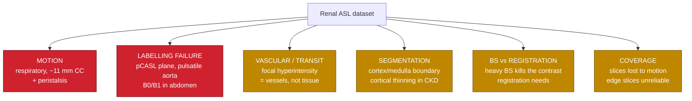
```mermaid
flowchart TD
  R["Renal ASL dataset"] --> M["MOTION<br/>respiratory, ~11 mm CC<br/>+ peristalsis"]
  R --> L["LABELLING FAILURE<br/>pCASL plane, pulsatile aorta<br/>B0/B1 in abdomen"]
  R --> V["VASCULAR / TRANSIT<br/>focal hyperintensity<br/>= vessels, not tissue"]
  R --> S["SEGMENTATION<br/>cortex/medulla boundary<br/>cortical thinning in CKD"]
  R --> B["BS vs REGISTRATION<br/>heavy BS kills the contrast<br/>registration needs"]
  R --> C["COVERAGE<br/>slices lost to motion<br/>edge slices unreliable"]
  classDef bad fill:#cf222e,color:#fff,stroke:#6e1119;
  classDef warn fill:#bf8700,color:#fff,stroke:#6b4c00;
  class M,L bad;
  class V,S,B,C warn;
```

The physics of motion, labelling and segmentation failure is in Parts 2–4. This part is what each one
*looks like*, and the published rules for catching it.

## 8.1 What a motion-corrupted perfusion-weighted image looks like


Figure 4 on that page is the single most instructive image in the renal ASL literature for this
project. Fifteen individual perfusion-weighted images from one child, before averaging. The top two
rows, labelled **Still**, show two grey kidney shapes with visible internal texture — recognisably
kidneys. The bottom row, labelled **Movement**, shows the same anatomy smeared into bright and dark
crescents: the subtraction has failed at every edge that moved, and the residual is far larger than
the perfusion signal.

The number on each panel is the weight `w_p` the `wMean^MVARS_masked` scheme gave it. Still images get
**0.061–0.146** (mean 0.096); moving images get **0.003–0.010** (mean 0.007) — about **14× less** on
the means. The paper's own framing is *"~1 order of magnitude lower"*, quantified as the corrupted
images' contribution to the averaged image dropping from *"≈33% [5/15]"* to **3.5%** — a 9.4× drop.
Use one of those two figures, not the 20× you get by dividing the extreme of one range by the extreme
of the other. That is
what a working outlier-rejection scheme does, and it is a **threshold-free weighting**, not a hard
cut — worth noting, because it sidesteps the problem that nobody knows where the cut should be.

**Published motion-handling rules you can implement:**

| Rule | Observed behaviour | Source | Tier |
|---|---|---|---|
| Reject subtraction if **>20% of kidney voxels beyond ±2 SD** of the voxel-wise mean | Fired in **18/27 FAIR** and **19/27 pCASL** datasets; max 2 pairs excluded per delay | Harteveld 2020, n=15, 3T | `implementation` |
| Keep ΔM only if **>80% of kidney voxels within ±2 SD** | authors call it *"an empirically chosen threshold"* | Bones 2021, n=7, 1.5T | `implementation` |
| Reject subtraction if **>20% of voxels beyond ±1.5 SD** | ~1 of 10 pairs rejected (range 0–3) | Harteveld 2022, n=10 children | `implementation` |
| Discard time-series outliers beyond **mean ± 2 SD**, plus per-slice fit **RMSE > mean + 2 SD** | **1% of slices excluded**; no participant lost | Garcia-Ruiz 2025, n=16 | `implementation` |
| Discard volume if **cortical ROI signal outside mean ± 2 SD** | scalar-per-volume, cheaper | Echeverria-Chasco 2023, n=18 | `implementation` |
| Exclude difference image if kidney movement **>1 voxel** | visual inspection, voxel size unstated | Cox 2017, n=127 | `implementation`, under-specified |

> 💡 **Harteveld's rule fires in roughly two-thirds of NORMAL healthy datasets.** "The rule fired at
> all" is therefore not a defect signal — only the *count* matters, and the observed ceiling in good
> data is 2 pairs per delay.

**Navigator gating**, for context (Tan, Koktzoglou & Prasad 2014, *MRM* 71(2):570–579,
DOI `10.1002/mrm.24692`, PMC4429520; n=10 healthy + 5 CKD, 3T FAIR True-FISP —
⚠️ *not in `papers/`: PMC free-to-read but outside the OA subset, so these figures were read from the
PMC record rather than a local PDF*): an **8 mm acceptance window** left residual SI displacement
averaging 1.1 mm across all subjects (max 4 mm), at an acquisition efficiency of **50 ± 13%**
(coronal) / 41 ± 9% (sagittal) in the healthy group and ~35% in the patients. SNR was 36.65 / 31.36
with navigators versus **12.15 for breath-hold** — quantitative support for the anti-breath-hold
recommendation. But do **not** turn 41–50% efficiency into a threshold: those *are* the normal healthy
means, so a "below 40–50% is poor compliance" rule would fail about half of normal sagittal-navigator
scans. Report as INFO.

## 8.2 What a labelling failure looks like

**A published quantitative signature:** Harteveld 2020 — *"For some pCASL data sets (3 out of 27), the
averaged perfusion-weighted images showed very low signal corresponding to cortical RBF values
< 100 mL/min/100 g. Compared with RBF values obtained at the other visit or with FAIR labeling in
the same subject, it seems that these pCASL measurements failed."*

> ⚠️ **But you cannot ship `<100 = FAIL`.** The authors identified failure by comparing against the
> *same subject's other visit and other labelling scheme* — references you will not have at QC time;
> the finding is pCASL-specific, from a >40 y cohort, on a readout the consensus does not recommend;
> and genuinely diseased kidneys live below 100 (§7.3). **A low-CBF flag must be structural — a
> spatial pattern — not a bare number.**

**FAIR has its own failure mode with a diagnostic rule** (preclinical, Chuang 2021): *"If perfusion
signal is weak, the nonselective inversion may not be effective. Try increasing the bandwidth of the
inversion pulse."* And *"Shimming is particularly important for nonselective (global) inversion,
since adiabatic condition depends on B0 field homogeneity."*

**Velocity-selective ASL's signature** — high whole-kidney mean *with* loss of cortico-medullary
contrast — is described in §3.3.

## 8.3 Coverage loss

**Measured** (Olsen 2025, 60 single-kidney scans, 5-slice protocol, 3T FAIR): only **48.3%** of scans
retained all five slices. 25.0% used four, 16.7% three, 8.3% two, and 1.7% were reduced to a single
slice. Slices were dropped for *"motion compensation failure"* and localised artefact — by **visual
assessment**, which is itself the gap.

**Edge slices are systematically worse** (Radovic 2022): *"maps with significant noise were excluded
(mostly generated from slices at the very beginning or end of the imaging stack, mainly due to
partial volume effect with the nearby structures). The middle slice … was the most representative
one."* That is §1.2d again — the outermost slices of the stack are half-kidney, half-something-else.

> ✅ **Design consequence:** a **per-slice** verdict with position weighting, plus a "usable slice
> fraction" INFO metric. But 48.3% is one protocol on one scanner in healthy young adults — it is
> motivation, not calibration.

## 8.4 The state of the art in renal ASL QC, as of now

> *"Data exclusion was performed based on visual assessment of the averaged perfusion-weighted images.
> Whole slices were excluded from the segmentation in cases of motion compensation failure."*
> — **Olsen et al. 2025**, a state-of-the-art simultaneous ASL/[¹⁵O]H₂O PET study
>
> *"Quality of all data with regard to image artifacts was visually assessed."*
> — **Bones et al. 2022**, the most automated renal ASL workflow published

Even the preclinical protocol chapter specifies QC only qualitatively: *"Scans with poor quality or
large movement should be discarded"*, checking for *"sudden movement, spikes, banding artifacts, or
sudden changes in SNR."*

**Renal ASL quality control in 2026 is still done by eye.** That is the gap.

---

# PART 9 — What is not known

> 💎 Stating the gaps plainly is what makes the numbers you *do* ship believable. Every item here is
> a verified absence, not "I didn't look hard enough".

## 9.1 There is no renal QEI, and no renal quality index of any kind

No composite quality metric for renal ASL exists. No paper defines one, and the consensus contains no
numeric image-quality threshold (§6.5).

**Why QEI cannot simply be ported:**

| QEI component | Brain input | Kidney equivalent |
|---|---|---|
| Structural similarity: `Pearson(CBF, 2.5·GM + 1·WM)` | GM/WM probability maps, free with any T1w | ❌ **none exist.** Consensus default is manual ROI (R9.10) |
| Dispersion: pooled variance / mean GM CBF, masks at prob ≥ 0.9 | three tissue classes with probabilities | ❌ two compartments, binary masks, boundary Dice ≈ 0.78 |
| Negative GM fraction | GM mask | ⚠️ possible on a cortex mask — this is the one term that ports |
| Calibration | fitted to 2 neuroradiologists rating 101 maps; cutoff ≈ 0.5 | ❌ no rated renal dataset exists |

The nearest thing to a defined renal quality panel is Buchanan 2018's three metrics — PWI-SNR, tSNR,
and inter-slice variability of the PW signal — defined explicitly and with **no thresholds attached
to any of them**. That is exactly the gap.

> ⛔ **There is also no renal spatial-CoV precedent.** A Europe PMC search for spatial coefficient of
> variation crossed with renal/kidney returns hits that are, without exception, cerebral. And a naive
> whole-kidney sCoV would be dominated by the **normal 2.3–7× cortico-medullary gradient**, not by
> artefact. If you build one, it is novel and `uncalibrated`.

## 9.2 No renal reference perfusion value that survives protocol

Established in §7.2: healthy adult cortex spans **139–441 mL/100 g/min** across published means,
driven by labelling scheme, field strength, age and ROI definition, with healthy and patient ranges
overlapping almost entirely — and even ASL-vs-PET agreement holds only over a narrow band (§7.7).

## 9.3 No inter-centre reproducibility study

Odudu 2018, highlighted on the §7.2 screenshot: *"At the time of this review, there are no published
studies comparing the reproducibility of ASL at different magnetic field strengths or under different
labelling approaches. Similarly, we found no studies of reproducibility between centres."*

Two of those three are now **superseded** — Garcia-Ruiz 2025 is a within-centre 1.5T-vs-3T comparison
and Harteveld 2020 a within-centre FAIR-vs-pCASL comparison — but **the inter-centre gap still
stands**; the only multi-centre, multi-vendor renal PCASL work findable is an unpublished ISMRM 2026
abstract, which is not a citable number. Date-bound the Odudu quote to its **January 2018** cut-off;
do not restate it in the present tense.

## 9.4 No outlier-rejection method or threshold, despite unanimity

**R8.2** is 0% abstention / **100% agreement** that outlier rejection is recommended — and specifies
neither a method nor a number. The six implementation-tier rules in §8.1 are individual groups'
choices, not validated cut-offs.

## 9.5 BIDS does not cover the kidney

- The ASL-BIDS authors say so: *"Whereas ASL-BIDS could perhaps be used for other body parts,
  **ASL-BIDS is validated in ASL images of the brain only**"* — citing the renal consensus as the
  out-of-scope example (Clement et al. 2022, *Sci Data* 9:543). *kidney*, *renal* and *abdominal*
  appear **zero times** in the released BIDS schema (v1.11.1); *brain* appears 64 times.
- The only quantified-perfusion volume type is **`cbf`** — *"The **cerebral** blood flow (CBF) image
  … quantified into mL/100g/min"*, defined by reference to the brain White Paper. **There is no
  renal-blood-flow volume type.** The raw types (`control`, `label`, `m0scan`, `deltam`) are
  organ-neutral and port fine; the derivative type does not. `M0Estimate` is *"A single numerical
  **whole-brain** M0 value"*. The only organ hooks — `BodyPart` and friends — are OPTIONAL free
  text, with no organ entity in the `*_asl` filename.
- **Good news:** respiratory traces *are* legal alongside renal ASL (`*_physio.tsv.gz` is permitted
  in the `perf` datatype, with `respiratory` a defined column). The breathing **signal** has a
  standards-compliant home; the breathing **strategy** does not.
- Roughly **eight** Nery Table 4 items have no dedicated typed field: physiological triggering/gating,
  fat suppression, pixel bandwidth, slice gap, field of view, number of slices, image orientation,
  quantification model. *(Caveat: `ScanOptions` maps to DICOM (0018,0022), where a faithful converter
  puts fat-sat and gating; orientation, FOV and slice count come from the NIfTI affine.)*

> 🐛 **A genuine, apparently unreported BIDS bug on the renal FAIR path.**
> `LabelingSlabThickness`'s description says *"For non-selective FAIR a zero is entered"* — but the
> schema constrains it to `exclusiveMinimum: 0`. A non-selective FAIR acquisition therefore cannot be
> encoded as the prose instructs without failing validation. *(The field is only `recommended` for
> PASL, so the workaround is to omit it.)*

## 9.6 There is no renal ASL processing pipeline

- **ASLPrep, ExploreASL, PyASL, BASIL/oxford_asl** contain **zero** kidney or renal code (grepped in
  the local clones). The OSIPI TF2.2 ASL code collection has **0** renal matches across 414 tracked
  paths; its only non-human content is **mouse brain** ASL.
- The OSIPI pipeline inventory paper: *"the inventory contains pipelines for human brain data only,
  as nobody registered ASL pipelines that would be primarily non-brain or non-human."* And OSIPI's
  own **2023–2025 roadmap**: *"We do not have any pipelines able to process human clinical non-brain
  data. … there is no large free available pipeline for processing these data, and the data
  evaluation … has to rely on in-house scripts."*
- **UKAT** (UKRIN Kidney Analysis Toolbox), the flagship renal MRI package, maps B0, diffusion, MTR,
  T1, T2, T2\* — **no ASL**. Its entire QA subpackage is one file with two SNR classes and no quality
  verdict; a `perfusion.py` exists only on the unreleased `dev` branch, computing
  `mean_label − mean_control` with no M0, no kinetic model and no units.

> 🎯 **Consequence:** a kidney QC tool **cannot consume a standard pipeline's derivatives**, because
> there is no standard pipeline. It must take near-raw NIfTI (4D control/label series + M0 +
> optionally a perfusion map) plus an **externally supplied** cortex mask.

## 9.7 OSIPI's own ASL standard is brain-scoped

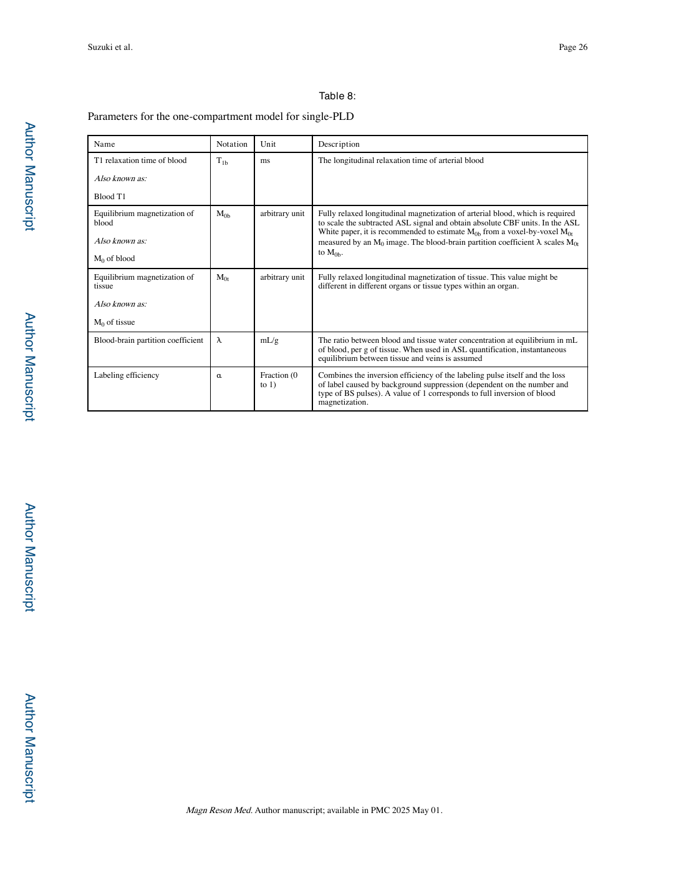

The peer-reviewed **OSIPI ASL Lexicon** (Suzuki et al. 2024, *MRM* 91(5):1743–1760) is brain-scoped:
*"(Pseudo-) Continuous ASL, Pulsed ASL, Velocity-selective ASL and Multi-timepoint ASL **for brain
perfusion imaging**"* — with an explicit invitation to extend: *"the content of the lexicon is **not
intended to be limited** to these techniques."*

The table above shows how deep the brain assumption goes: the partition coefficient is named
*"blood-**brain** partition coefficient"* even though the quantity is organ-general. The **living**
(Google Doc) version has a *"Section 7: Outside of Brain"* with kidney cortex/medulla λ and T1 rows
and the RBF definition — the only OSIPI-branded renal ASL content that exists — and the Lexicon
already lists the PARENCHIMA renal recommendations as one of its four foundational standardisation
sources, alongside ASL-BIDS and the White Paper.

## 9.8 A summary of what can be tagged what

| Renal quantity | Best available tier |
|---|---|
| Acquisition parameter bands (PLD, TI, TI1, τ, TR, slice/voxel size, R≤2, orientation, ≥20 pairs) | ✅ **`published`** — Nery 2020, with per-statement agreement % |
| M0 mandatory / no BS / TR > 5 s / correction formula | ✅ **`published`** |
| λ, T1<sub>blood</sub>, α, ×0.93 per BS pulse | ✅ **`published`** (λ flagged as brain-borrowed; blood T1 as `published-via-consensus`) |
| Report cortex, L/R separately; medulla not reliable | ✅ **`published`** |
| Registration required; outlier rejection required | ✅ **`published`** *(as requirements — no method, no number)* |
| Table 4 minimum reporting set | ✅ **`published`** |
| The six ±SD outlier rules; 750 ms ATT default; 0–500 voxel clip; 8 mm navigator window | ⚠️ **`implementation`** |
| tSNR / spatial SNR / PWS / BS-efficiency floors | ❌ **`uncalibrated`** |
| Spatial CoV, negative-voxel fraction, motion (mm or FD analogue) | ❌ **`uncalibrated`** — no renal precedent at all |
| Cortex:medulla ratio trip point | ❌ **`uncalibrated`** — and it must flag the *segmentation*, not the map |
| Any absolute cortical RBF band | ❌ **`uncalibrated`** — implausibility guard only |
| **Any** medullary threshold | ⛔ **do not ship** — R10.2 + ICC 0.08 |
| Any paediatric renal threshold | ❌ **`uncalibrated`** — ~50 children total, zero healthy |
| Any renal QEI analogue | ❌ **`uncalibrated`** and novel |

---

# PART 10 — What ports from the brain toolbox, and what does not

| Brain module | Ports to kidney? | Why |
|---|---|---|
| 1 — QEI engine | ❌ **No** | No tissue probability maps, no rated renal dataset (§9.1) |
| 2 — Noise & distribution | ⚠️ Partly | Negative-voxel fraction ports onto a cortex mask; sCoV has no renal precedent and is confounded by the cortico-medullary gradient |
| 3 — CBF level & contrast | ⚠️ Reframe | Level → wide implausibility guard only. GM/WM ratio → cortex:medulla as a **segmentation-integrity** flag (§2.2) |
| 4 — Co-registration | ✅ Mostly | Dice/Pearson/overlap are organ-agnostic and take arbitrary binary masks. Needs a kidney mask; must run **per kidney** (§3.3) |
| 5 — Schema & data-type | ⚠️ Rebuild | BIDS has no renal contract. Build against **Nery Table 4** instead (§6.6, §9.5) |
| 6 — M0 calibration | ✅ **Yes** | Same rule, same 5 s, same formula — because it is relaxation physics, not organ physiology. Swap T1<sub>tissue</sub> (§6.4) |
| 7 — Motion | ⚠️ Rebuild | Respiratory, per-kidney, anisotropic, and it corrupts the label as well as the image (Part 3). The ±SD outlier rules are the renal analogue |
| 8 — Acquisition metadata | ✅ **Yes, richer than brain** | ~20 agreement-graded consensus values to check against (§6.2) |

And two things the evidence forces regardless of design taste: **branch on labelling scheme before
anything else** (FAIR and pCASL are both endorsed and differ by ~80%, Part 4), and **expect an
externally supplied mask** — manual ROI is the consensus default and no tool produces cortex/medulla
masks, so the mask itself becomes an input to QC rather than a given.

---

# 📚 Sources

**The two anchor documents**
- **Nery F, Buchanan CE, Harteveld AA, Odudu A, Bane O, Cox EF, Derlin K, Gach HM, Golay X, Gutberlet M,
  Laustsen C, Ljimani A, Madhuranthakam AJ, Pedrosa I, Prasad PV, Robson PM, Sharma K, Sourbron S,
  Taso M, Thomas DL, Wang DJJ, Zhang JL, Alsop DC, Fain SB, Francis ST, Fernández-Seara MA.**
  *"Consensus-based technical recommendations for clinical translation of renal ASL MRI."*
  **MAGMA 2020;33(1):141–161.** DOI [10.1007/s10334-019-00800-z](https://doi.org/10.1007/s10334-019-00800-z) · CC-BY ·
  [`papers/nery2020_renal_asl_consensus.pdf`](papers/nery2020_renal_asl_consensus.pdf)
- **Odudu A, Nery F, Harteveld AA, Evans RG, Pendse D, Buchanan CE, Francis ST, Fernández-Seara MA.**
  *"Arterial spin labelling MRI to measure renal perfusion: a systematic review and statement paper."*
  **Nephrol Dial Transplant 2018;33(suppl_2):ii15–ii21.** DOI [10.1093/ndt/gfy180](https://doi.org/10.1093/ndt/gfy180) ·
  [`papers/odudu2018_renal_asl_systematic_review.pdf`](papers/odudu2018_renal_asl_systematic_review.pdf)

**Consensus family**
- Mendichovszky I, Pullens P, Dekkers I, et al. *MAGMA* 2020;33(1):131–140 — the PARENCHIMA Delphi process paper
- Dekkers IA, de Boer A, Sharma K, et al. *MAGMA* 2020;33:163–176 — renal T1/T2 consensus, the only one addressing cortex-vs-medulla ROI methodology directly

**Healthy reference, reproducibility and image quality**
- Garcia-Ruiz L, Echeverria-Chasco R, Aramendia-Vidaurreta V, et al. *JMRI* 2025;62(4):1180–1195 — field strength, sex, age; the QC-metric table
- Harteveld AA, de Boer A, Franklin SL, Leiner T, van Stralen M, Bos C. *MAGMA* 2020;33(1):81–94 — FAIR vs pCASL, same subjects
- Buchanan CE, Cox EF, Francis ST. *Diagnostics* 2018;8(3):43 — readout comparison
- Gillis KA, McComb C, Foster JE, et al. *BMC Nephrol* 2014;15:23 · Hammon M, Janka R, Siegl C, et al. *Medicine* 2016;95(11):e3083 (⚠️ medulla contaminated) — reproducibility at 3T and 1.5T
- Haddock B, Larsson HBW, Francis S, Andersen UB. *Acta Physiol* 2019;227:e13292 — the credible cortex:medulla split
- Olsen NE, Mariager CO, Arildsen MM, et al. *Magn Reson Med* 2025 — ASL vs [¹⁵O]H₂O PET
- Cox EF, Buchanan CE, Bradley CR, et al. *Front Physiol* 2017;8:696 · Shirvani S, Tokarczuk P, Statton B, … O'Regan DP. *Eur Radiol* 2019;29:232–240 · de Boer A, Harteveld AA, Stemkens B, et al. *JMRI* 2021;53:859–873
- Wolf M, de Boer A, Sharma K, et al. *Nephrol Dial Transplant* 2018 — renal T1/T2 systematic review

**Motion, labelling and artefact**
- Bones IK, et al. *Magn Reson Med* **2019**;82(1):276–288 (free-breathing BGS, the 54% registration finding) · **2020**;84:1919–1932 (spurious VS labelling, the bellows finding) · **2021**;86:131–142 (VSASL label dynamics, FAIR ATT) · **2022**;87:800–809 (the 3-U-net cascade)
- Franklin SL, Bones IK, Harteveld AA, et al. *Magn Reson Med* 2021;85:2580–2594 — multi-organ tSNR comparison
- Yamashita H, et al. *SpringerPlus* 2014;3:131 (4D-CT, centre of gravity) · Siva S, et al. *Radiat Oncol* 2013;8:248 (4D-CT, apex)
- Brumer I, Bauer DF, Schad LR, Zöllner FG. *Diagnostics* 2022;12(8):1854 — synthetic renal ASL phantom (**ground truth cortex 250 / medulla 50 healthy; 100 / 20 abnormal** — do not confuse with the *recovered* 210/49)

**Disease, transplant and paediatric**
- Li L-P, Tan H, Thacker JM, et al. *Kidney Int Rep* 2017 · Zhang X, et al. *Renal Failure* 2024;46(2):2428337 · Zhao L, et al. *Renal Failure* 2025;47(1):2444403
- Echeverria-Chasco R, et al. *NMR Biomed* 2023;36(2):e4832 · Que C, et al. *QIMS* 2026;16(2):165 · Ma J, et al. *QIMS* 2025;15(8):6882–6896 ⚠️ (Table 1 header reads `mL/100 g/min` while Results reads `mL/min/1.73 m²` for the same values) · Jiang B, et al. *QIMS* 2024;14(3):2415–2425
- **Nery F, De Vita E, Clark CA, Gordon I, Thomas DL.** *Magn Reson Med* 2019;81:2972–2984 — the only dedicated paediatric native-kidney renal ASL study
- Harteveld AA, et al. *MAGMA* 2022;35:235–246 · Radovic T, et al. *Sci Rep* 2022;12:828 and *Sci Rep* 2025 · De Mul A, et al. *Pediatr Nephrol* 2025;40(5):1539–1548 (*"experimental and not validated"*)

**Standards, tooling and preclinical**
- Clement P, Castellaro M, Okell TW, et al. *Sci Data* 2022;9:543 — ASL-BIDS (*"validated in ASL images of the brain only"*)
- Suzuki Y, Clement P, Dai W, **Dolui S**, Fernández-Seara MA, et al. *Magn Reson Med* 2024;91(5):1743–1760 — OSIPI ASL Lexicon
- Fan H, Mutsaerts HJMM, Anazodo U, … **Dolui S**, Petr J. *Magn Reson Med* 2023 — OSIPI ASL pipeline inventory
- Nery F, Gordon I, Thomas DL. *Diagnostics* 2018;8(1):2 — renal ASL challenges and opportunities review
- Chuang K-H et al. — Ch. 26 and Ch. 39 in **Preclinical MRI of the Kidney** (Methods Mol Biol 2216, 2021), CC-BY · Hillaert A, et al. *Animals* 2024;14(12):1810 (λ measured in dog kidney) · **UKAT** — [github.com/UKRIN-MAPS/ukat](https://github.com/UKRIN-MAPS/ukat)
- Gullaksen S, et al. *Diabetologia* 2023;66:813–825 — the true origin of the 0–500 mL/100 g/min voxel rejection rule

**Not obtained, and it matters** — **Taso M, Aramendía-Vidaurreta V, Englund EK, Francis S,
Franklin SL, Madhuranthakam AJ, et al.** *"Update on state-of-the-art for arterial spin labeling (ASL)
human perfusion imaging outside of the brain."* *Magn Reson Med* 2023;89(5):1754–1776 — an ISMRM
Perfusion Study Group review whose organ-by-organ section starts with kidneys, senior-authored by
María Fernández-Seara, the same senior author as the Nery consensus. CC-BY per Unpaywall, but Wiley
blocks scripted access and there is no PMC copy. Until it is read, treat the renal acquisition
guidance here as possibly incomplete. A further 22 papers with DOIs are listed in
[`papers/README.md`](papers/README.md), including Robson 2009, Tan 2014, Artz 2011, Cutajar 2012,
Kim 2017, Ahn 2020, de Bazelaire 2004, and Zhang 2013 (the primary source for both blood-T1
constants).

---

*Every screenshot above lives in `screenshots/` at 130 dpi, rendered with*
*`pdftoppm -r 130 -png -f N -l N`, and every caption names what is highlighted or shown on that page.*
*Every PDF lives in `papers/`. Diagrams are inline Mermaid.*
