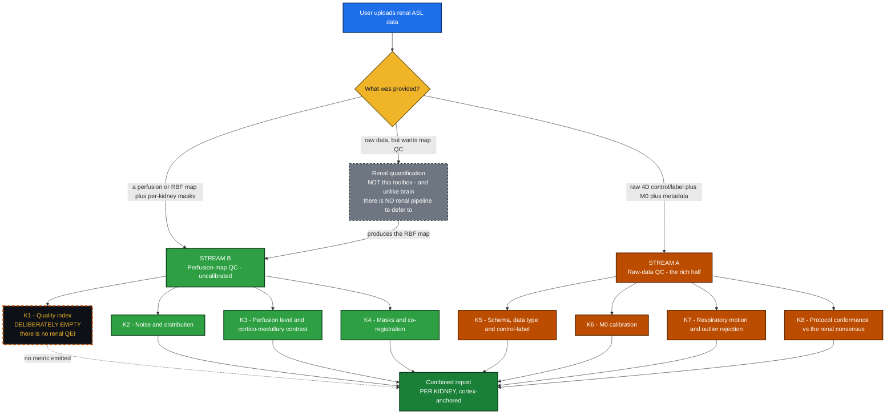
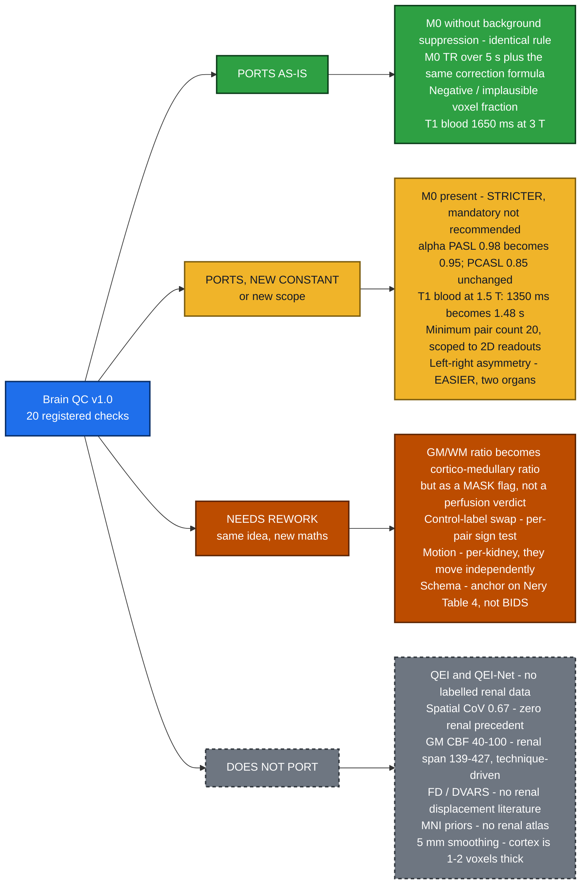

# Kidney QC — Design Brief

### Extending the ASL QC ToolBox from brain to kidney
**Two streams · 8 modules · the evidence base is inverted**

*Full spec with one card per check: `KIDNEY_QC_DESIGN.md`. This is the argument only.*

---

## 🔭 The one thing to take away

The renal ASL literature has an authoritative, consensus-graded specification for **how a renal ASL
scan should be acquired**, and essentially nothing on **how to judge whether the resulting perfusion
map is good**. That inverts the brain toolbox, where Stream B is the rich half (QEI with a validated
≈0.5 cutoff, sCoV 0.67, GM/WM 40–100) and Stream A is thin. In kidney it is the other way round, and
the design has to say so rather than build a symmetrical doc on numbers that do not exist.

> ### ⚠️ The central finding
>
> **Nery et al. 2020** (MAGMA 33:141–161; PARENCHIMA COST CA16103) is the renal equivalent of the 2015
> ASL White Paper: *"An international panel of 23 renal ASL experts followed a modified Delphi
> process"* (p.1), and *"Fifty-nine statements achieved consensus, while agreement could not be
> reached on two statements"* (p.1). It gives a hard Stream A protocol spec — labelling, readout,
> background suppression, pair counts, M0 rules, quantification constants, all with agreement
> percentages.
>
> **It contains zero numeric image-quality thresholds.** No tSNR floor, no CoV cutoff, no motion
> limit, no negative-voxel fraction, no QEI analogue. Its closest approach to a quality statement is
> qualitative: *"This approach is considered robust and reproducible and can provide renal perfusion
> images of adequate quality"* (p.1). Even the QC-adjacent statements specify no method and no number
> — *"8.2 Outlier rejection is recommended for renal ASL"* (p.8; 0% abstentions, **100% agreement**),
> backed in the body only by *"Outlier rejection methods … have relied on manual …"* (p.12) plus a
> citation list.
>
> **Consequence:** every renal CBF-map (Stream B) threshold in this design ships tagged
> 🔧 **UNCALIBRATED**, and an uncalibrated threshold may never drive a FAIL on its own.

---

## 🗺️ Proposed module map

**K1 is drawn hollow because it is empty on purpose.** The brain anchor check does not port: there is
no cortex/medulla probability substrate to build a `spRBF` template from, and — the binding constraint
— **no renal ASL dataset with expert quality ratings that I could find**, so there are no curves to
fit and no cutoff to validate. Shipping a "renal QEI" with brain-fitted constants would be the single
most misleading thing this toolbox could do. The slot stays visible so the gap is visible.

---

## 🔁 What actually transfers from brain

The number worth staring at in that bottom box: published healthy **cortical** perfusion spans
**139–427 mL/100 g/min** — *"Renal cortical perfusion by ASL ranged from 139 to 427 mL/100 g/min in
healthy volunteers"* (📄 Odudu 2018, PARENCHIMA systematic review over 53 studies to Jan 2018, p.2,
aggregated in Supplementary Table S1). The patient range, **83–412**, overlaps it almost entirely.
And the dominant driver of that spread is **technique, not biology**: Harteveld 2020 measured FAIR and
pCASL in the **same 16 healthy volunteers at 3 T** and got cortical RBF **362 ± 57** vs
**201 ± 72 mL/min/100 g** — a **1.8× gap from the labelling scheme alone**. A brain-style "normal CBF
band" is therefore not available in kidney at any useful tightness.

---

## 📋 The proposed checks

| id | what it asks | tier |
|---|---|---|
| **K1.1** | *(renal quality index — not implemented in v1; no labelled data exists)* | — |
| **K2.1** | Temporal SNR per kidney — report-only | 🔧 UNCALIBRATED |
| **K2.2** | Is perfusion-weighted signal a plausible % of M0? (band ~0.5–8%) | 📄 values published, 🔧 band |
| **K2.3** | Negative and implausible-value fraction, cortex-restricted | 💻 0–500 clip |
| **K2.4** | Cortex-restricted spatial CoV *(stretch — no renal precedent)* | 🔧 UNCALIBRATED |
| **K3.1** | Cortical RBF level, **per kidney** — the consensus-mandated quantity | 📄 range, 🔧 verdict bands |
| **K3.2** | Cortico-medullary ratio — **as a segmentation-integrity flag** | 🔧 UNCALIBRATED (never FAILs) |
| **K3.3** | Left-vs-right cortical consistency | 🔧 UNCALIBRATED |
| **K4.1** | Per-kidney mask integrity (size, contiguity, overlap) | 🧮 DEFINITION |
| **K4.2** | ASL ↔ M0 and per-kidney registration | 🔧 UNCALIBRATED |
| **K4.3** | Slice coverage / usable-slice fraction | 🧮 DEFINITION |
| **K5.1** | Metadata completeness vs **Nery Table 4** (not BIDS — BIDS has no kidney) | 📄 PUBLISHED |
| **K5.2** | Data-type / geometry detection — routing, INFO only | 🧮 DEFINITION |
| **K5.3** | Control-vs-label ordering, per-pair sign consistency | 🧮 DEFINITION |
| **K6.1** | M0 present — *"M0 acquisition is mandatory"* (R9.1, 94%) | 📄 PUBLISHED |
| **K6.2** | M0 without labelling **and without background suppression** | 📄 PUBLISHED |
| **K6.3** | M0 TR > 5 s, else corrected | 📄 PUBLISHED |
| **K6.4** | M0 geometry matches ASL *(stretch)* | 🧮 DEFINITION |
| **K7.1** | Per-kidney respiratory displacement | 🔧 UNCALIBRATED |
| **K7.2** | Subtraction-outlier rate, surviving-pair count | 💻 IMPLEMENTATION ×4 |
| **K7.3** | Breathing strategy and gating efficiency | 📄 PUBLISHED |
| **K7.4** | Spurious-labelling signature *(stretch)* | 🔧 UNCALIBRATED |
| **K8.1–K8.4** | FAIR/PASL timing · PCASL timing and averaging · geometry and readout · quantification constants | 📄 PUBLISHED |

📄 = a paper states this number for this purpose · 💻 = a reference study's code/method uses it, not a
validated cutoff · 🔧 = engineering default, no published source · 🧮 = maths, nothing to tune.

Two published rules that are hard and checkable: **20 ASL pairs minimum** — *"4.7 In single-TI
acquisitions, a minimum of 20 ASL pairs is recommended"* (p.7; **89%**) and its identically worded
PCASL twin *"5.12 In single-PLD acquisitions…"* (p.7; **83%**); and the labelling efficiencies
*"9.8 Labeling efficiency PCASL = 85%"* (p.8; **86%**) and *"9.7 Labeling efficiency PASL = 95%"*
(p.8; **100%**) — renal PASL is **95%**, not the brain White Paper's 98%.

**Agreement percentages gate severity.** *"6.4 Spin-echo EPI is the preferred readout for 2D
single-slice acquisitions"* sits at **75%** (p.7) — the weakest of all 59 statements, exactly on the
inclusive consensus bar — and *"7.4 Renal ASL scans under free breathing are preferred"* at **76%**
(p.8) is second weakest. Both must **WARN, never FAIL**. By contrast *"7.3 Breath-hold scans are not
recommended for clinical renal ASL"* carries **94%** (p.8), so detecting a breath-hold is a firmer
basis for a flag than the mere absence of free breathing.

---

## 📥 Minimum inputs — and what a reviewer may conclude at each tier

| tier | you must supply | what a reviewer may legitimately conclude |
|---|---|---|
| **B0** | RBF map only | Almost nothing — global histogram shape and implausible-value fraction. There is no renal analogue of "just BET the brain", so a lone map buys far less than in brain. |
| **B1** | + whole-kidney masks, L and R separately | "Nothing is grossly broken" — negative fraction, mask integrity, coverage, left-vs-right. **Not** the consensus quantity. |
| **B2** | + cortex mask per kidney | The one conclusion the consensus actually asks for: cortical RBF, per kidney, in a published context. |
| **B3** | + medulla mask (or a quantitative T1 map to derive one) | Additionally: whether the cortex and medulla masks are genuinely separated. Never a statement about the medulla's perfusion. |
| **A0** | raw 4D control/label + kidney masks | Whether the acquisition survived breathing — outlier rate, per-kidney displacement, pair ordering. |
| **A1** | + M0 / PD image | Whether calibration is usable at all: M0 presence, ASL↔M0 registration, PWS as % of M0. |
| **A2** | + acquisition metadata (JSON or vendor header) | **Full protocol conformance vs the renal consensus** — the richest and best-sourced verdict this toolbox can give. |
| **A3** | + respiratory trace | Gating efficiency, and whether motion explains the rejected pairs. |

The renal cliff is **masks, not tissue maps** — R9.10 (100%) makes manual ROI the default and R9.11
(93%) says ROIs are drawn on the M0 or a structural image, not on the perfusion map, so nothing here
auto-derives the way a brain mask does. **Cortex masks are the highest-value input a user can add.**

---

## ✅ The two rules we get for free

These are the only two places where the renal consensus hands us a QC-shaped constraint outright, and
both are about **what to report**, not about quality:

> **R10.1** — *"Cortical renal blood flow values (not whole-kidney) should be reported, separately for
> left and right kidney."* — p.8, **0% abstentions, 100% agreement**

Unanimous, zero abstentions — the cleanest published constraint in the renal corpus, and it drives the
**data model**, not just a check: the report object is `{left: {...}, right: {...}}`, the aggregator
runs per kidney then combines, and no check may headline a single whole-organ number.

> **R10.2** — *"Medullary renal blood flow values are not considered reliable with current measurement
> approaches."* — p.8, **14% abstentions, 89% agreement**

Independently corroborated by measurement: medullary reproducibility spans **ICC 0.27–0.94, CV 3–43%**
within visits and **ICC 0.13–0.96, CV 4–37%** between visits (📄 Odudu 2018, p.3–4), against cortical
**ICC 0.62–0.98 / CV 3–18%** and **ICC 0.85–0.97 / CV 4–13%**; and Garcia-Ruiz 2025 reports medullary
RBF ICCs of **0.081–0.426**. **Rule: no medullary metric may drive a FAIL.**

---

## ⭐ Why cortex:medulla ratio is a mask check, not a perfusion verdict

This is the design decision most likely to be challenged, so here is the whole argument in one place.

`CMR = mean(RBF[cortex]) / mean(RBF[medulla])`, per kidney — the renal analogue of the brain GM/WM
ratio in **form** (scale-free, immune to a global quantification error) but deliberately **not in
role**. In brain, GM/WM < 1 is a published data-quality FAIL. In kidney, CMR may flag the **masks**
and may never grade the kidney. Three reasons:

1. **Its denominator is the least reliable measurement in renal ASL** — R10.2 above, plus ICCs down to
   0.081. Grading a scan on CMR means grading it on the one number the consensus says not to trust.
2. **It is not monotone with disease.** Across the two severity-staged cohorts in the paper library it
   moves in *opposite* directions — rising 1.57 → 2.01 with CKD stage in one, falling 2.08 → 1.75 in
   the other. A quantity that moves both ways cannot discriminate disease.
3. **But it does detect one specific, common, published failure.** Only ~10% of renal blood flow
   perfuses the medulla (📄 Odudu 2018, p.1), so a CMR near 1 is anatomically impossible — evidence the
   two masks are drawing from the same tissue. Worked example: Hammon 2016 reports CMR ≈ 1.21 and the
   authors say so themselves — *"the segmentation of the medulla may contain parts of the cortex what
   explains higher than expected medullary perfusion values"*. Clean studies cluster at 2.26–2.59.

So the check emits **INFO** normally, **WARN** only in the low direction with the reason *"cortex and
medulla masks may not be separated"*, **never FAIL**, and is excluded from aggregation. The ~1.5 trip
point is 🔧 **UNCALIBRATED** — no paper states a CMR threshold for any purpose — and sits between the
two clusters above with margin. High CMR (5–8.5) carries no verdict: it just means a strict
inner-medulla ROI convention.

---

## ❓ Open questions — the answers change the design

**For the renal specialist, above all:**

1. **What rejected-pair count makes a renal scan unusable?** Four published outlier rules exist
   (±2 SD / >20% of voxels, and variants) and **not one paper says how many rejected pairs is too
   many**. Harteveld's rule fires in ~2/3 of *healthy* datasets with a ceiling of 2 rejected pairs. Is
   "≥3 rejected → WARN, surviving pairs < 20 → FAIL" defensible — or is applying the 20-pair
   *acquisition* recommendation to *surviving* pairs a misuse of it? **Is there an unpublished in-house
   standard the renal community actually runs?**
2. **Is there a renal heterogeneity metric worth having at all?** sCoV has zero renal precedent, and a
   whole-kidney CoV would be dominated by the normal cortico-medullary gradient — i.e. by anatomy, not
   artefact. Is cortex-restricted CoV meaningful, or is cortico-medullary CNR the better primitive?
3. **Is CMR-as-a-mask-check the right framing, or too clever?** Would a renal reader actually act on
   *"CMR 1.18, masks may not be separated"*?

**For the mentors:**

4. **Cortex-only, or cortex + medulla?** CMR needs a medulla mask that most users will not have. Do we
   (a) require it, (b) derive it from a T1 map when present, or (c) ship CMR as optional? My
   inclination is (b) with (c) as fallback — this decides whether the toolbox needs a segmentation step
   at all.
5. **Which kidney T1 for the M0 TR correction?** The consensus prescribes
   `SI_PD/(1 − exp(−TR/T1,tissue))` (p.13) and then never supplies a value; cortex and medulla differ
   by ~400 ms. Apply one default, or refuse to correct and WARN with the magnitude under both
   compartments (my current proposal)?
6. **Do we ever compute RBF ourselves, or only consume it?** The brain toolbox settled this as "QC
   layer, light derivation only" and deferred to PyASL/ASLPrep. **There is no renal pipeline to defer
   to** — ASLPrep, ExploreASL and PyASL contain zero renal code, `ukat` has no ASL module. Same line?
7. **Is there any renal ASL dataset with expert quality ratings, or a repeat-scan dataset?** Without
   labels there is no renal QEI and no calibrated Stream B threshold — the binding constraint on this
   entire design. Could PARENCHIMA or the ISMRM Renal MR Study Group supply one?
8. **Taso et al. 2023 (MRM 89:1754–1776), the ISMRM body-ASL "Grey Paper", is paywalled and I have not
   read it.** Its organ-by-organ review starts with kidneys and its senior author is Nery 2020's.
   Could María supply a copy — and does it supersede any Nery parameter?

---

*Every number above carries its provenance tier. Where nobody has published one, this brief says so
rather than inventing a band — the same policy as the brain design, in a domain where it bites harder.*
