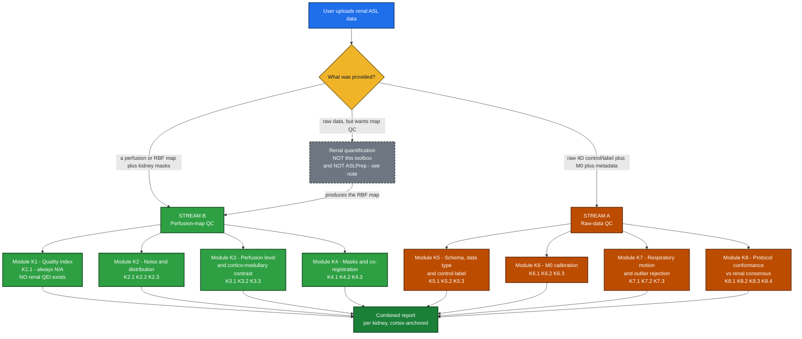

<div align="center">

# Kidney QC ToolBox — Renal ASL QC Design

### Automatic PASS / WARN / FAIL triage for **renal** ASL MRI
**Two streams · 8 modules · 23 checks · per-check inputs, outputs, method, verdict, sources & provenance tier**

</div>

---

## 🔭 Overview

This is the renal counterpart to `QC_DESIGN.md`. It keeps the same shape — two streams, eight
modules, one spec card per check — so the brain and kidney toolboxes share a registry, a result
type, and a report format. What it does **not** keep is the brain's evidence base.

**The single most important fact about this design, and it is a negative one:** the renal ASL
literature contains a rich, quotable, consensus-graded specification for **how a scan should be
acquired**, and almost nothing at all about **how to judge whether the resulting map is good**. The
one authoritative document — Nery et al. 2020 (`nery2020_renal_asl_consensus.pdf`, MAGMA 33:141–161,
PARENCHIMA COST CA16103, *"An international panel of 23 renal ASL experts followed a modified Delphi
process"*, p.1; *"Fifty-nine statements achieved consensus"*, p.1) — is the renal equivalent of the
2015 ASL White Paper, and it contains **zero numeric image-quality thresholds**: no tSNR floor, no
CoV cutoff, no motion limit, no negative-voxel fraction, no QEI analogue. Its two QC-adjacent
statements are R8.1 (*"retrospective image registration is highly recommended"*, 100% agreement) and
R8.2 (*"Outlier rejection is recommended for renal ASL"*, p.8, 0% abstentions, **100% agreement**),
and **both specify a method of exactly zero and a threshold of exactly zero.** The closest the
document comes to an image-quality claim is qualitative: the default protocol *"is considered robust
and reproducible and can provide renal perfusion images of adequate quality"* (p.1) — no number
attached.

That produces an inversion relative to the brain toolbox, stated plainly rather than hidden:

| | Brain v1.0 | Kidney |
|---|---|---|
| **Stream A** (was the acquisition correct?) | thin — White Paper Table 1, a handful of rules | **rich** — ~25 consensus statements with agreement percentages |
| **Stream B** (is the perfusion map good?) | **rich** — QEI with a validated ≈0.5 cutoff, sCoV 0.67, GM 40–100 | **almost empty** — no renal QEI, no renal sCoV, no published band |

So the honest v1 kidney toolbox is **Stream-A-heavy**. Stream B ships real, computable metrics, but
**every renal Stream-B threshold ships `UNCALIBRATED`**, and this document says so at every single
one rather than manufacturing bands to look symmetrical with the brain doc.



> ⚠️ **The gray dashed box is emptier than it is for brain.** For brain, "the pipeline makes the map"
> means ASLPrep / ExploreASL / PyASL. For kidney **there is no such pipeline.** I grepped the local
> clones: ASLPrep, ExploreASL and PyASL contain **zero** kidney/renal code (ASLPrep's only `renal`
> string match is a false positive inside a base64 blob in `docs/_static/brainextraction.svg`). The
> renal MRI community's flagship toolbox, UKRIN's `ukat`, has **no ASL module at all** — its mapping
> subpackage is B0/diffusion/MTR/T1/T2/T2\*, and its entire QA subpackage is one `snr.py`. There is an
> unreleased 4.8 kB `perfusion.py` on `ukat`'s `dev` branch that does label−control subtraction with
> no M0, no quantification and no QC; it opens with
> `warnings.warn('Perfusion is still a work in progress and likely to be re-written. Use with caution.')`.
> **Consequence for scope:** the kidney toolbox cannot assume it will be handed a pipeline's
> derivatives. It must consume near-raw NIfTI plus user-supplied masks.

**Scope decision: the toolbox consumes RBF, it never computes it.** Same line as the brain toolbox —
QC layer, light QC-grade derivation only. This is *more* important for kidney, not less, despite
there being no renal pipeline to defer to: quantifying renal RBF ourselves would mean inheriting
λ = 0.9 (which the consensus admits is borrowed from brain), α = 95%/85% **which must be multiplied
by 0.93 per background-suppression pulse**, and a BGS pulse count that is rarely recorded. A QC layer
that silently made those three choices would be grading its own arithmetic. Instead K8.4 grades the
constants the *user* used and reports the exact rescaling factor to consensus values.

**Positioning inside OSIPI.** OSIPI has no renal task force, no renal lexicon section beyond three
kidney rows in the living lexicon, no renal reporting checklist and no renal ASL datasets (TF3.2's
inventory has one kidney entry and it is DCE). The authoritative renal ASL standard is PARENCHIMA's,
not OSIPI's. But both OSIPI task forces whose roadmap explicitly targets non-brain ASL are led by
this project's own mentors — **TF2.2 (ASL code library)** and **TF1.1 (pipeline inventory)** — and the
OSIPI roadmap states in writing: *"We do not have any pipelines able to process human clinical
non-brain data … there is no large free available pipeline for processing these data."* This work
fills a gap OSIPI has already documented and owns.

---

## ⚖️ How the verdict works

Identical machinery to brain — same `Verdict` enum, same aggregation — with **three renal-specific
rules**, each of which is a decision with a published justification, not a preference.

**1. Everything is reported per kidney.** R10.1 (0% abstentions, **100% agreement**, p.8), verbatim:
*"Cortical renal blood flow values (not whole-kidney) should be reported, separately for left and
right kidney."* So the report object is `{left: {...}, right: {...}}`, never a single scalar, and the
aggregator runs per kidney then combines with the same worst-wins rule. This is the strongest,
cleanest published constraint in the whole renal corpus and it drives the data model.

**2. Cortex is the anchor ROI; no medullary metric may drive a FAIL.** R10.2 (14% abstentions, **89%
agreement**, p.8), verbatim: *"Medullary renal blood flow values are not considered reliable with
current measurement approaches."* Backed by measurement: medullary inter-visit reproducibility spans
*"(ICC 0.13–0.96; 4–37%)"* (`odudu2018_renal_asl_systematic_review.pdf`, p.4) against cortical
*"(ICC 0.85–0.97; CV 4–13%)"* (p.3), and Garcia-Ruiz measured a medullary inter-session ICC of
**0.08 at 3 T** — essentially no subject-specific information at all. This is why **K3.2's
cortex:medulla ratio is a segmentation-integrity flag rather than a perfusion verdict**: a quantity
whose denominator the consensus itself declares unreliable can legitimately say *"these two masks are
drawing from the same tissue"* and cannot legitimately say *"this kidney's perfusion is wrong."*

**3. An `UNCALIBRATED` threshold never drives a FAIL on its own.** Inherited from
`THRESHOLD_PROVENANCE.md`. In the brain toolbox that rule protected a minority of checks; here it
protects nearly all of Stream B. Every FAIL in this document is traceable either to a physical
impossibility, a definitional floor, or a consensus statement at ≥ 90% agreement whose violation
*invalidates* rather than *degrades* the measurement.

Aggregation is otherwise unchanged: any FAIL → FAIL; else any WARN → WARN; else any PASS → PASS;
else UNKNOWN. `N/A`, `INFO` and `UNKNOWN` are excluded from aggregation and reported through
`coverage()` instead.

### Provenance tiers used throughout

| tag | meaning | how common in this doc |
|---|---|---|
| 📄 **PUBLISHED** | a peer-reviewed paper states this number, for this purpose | almost all of Stream A protocol conformance (Module K8) |
| 💻 **IMPLEMENTATION** | a reference study's code or method uses it; not a validated cutoff | the outlier-rejection rules, the 0–500 clip |
| 🔧 **UNCALIBRATED** | engineering default, no published source | **every threshold in Stream B** |
| 🧮 **DEFINITION** | physics/maths, nothing to tune | ratios, centroids, formulas |

Consensus statements are quoted **with their agreement and abstention percentages**, because they
vary a lot and a 75% statement must not be enforced as hard as a 100% one. Highest-abstention
warning: R5.10 (Gmax/Gave) carries **40% abstention** and the paper contradicts itself between Table 2
and the Discussion — it is excluded from grading entirely and reported as INFO if present.

---

## 📥 Minimum inputs — what you must bring for each tier of kidney QC

**Nothing here can be auto-derived the way a brain mask can.** R9.10 (0% abstentions, 100%
agreement) makes **manual ROI the default**, and R9.11 (93%) says ROIs should be drawn on the **ASL
M0 image or a separately acquired structural dataset**, not on the perfusion map.

| Tier | You must supply | What becomes computable | What stays UNKNOWN |
|---|---|---|---|
| **B0** | perfusion / RBF map only | almost nothing — global implausible-value fraction | every ROI metric; there is no renal analogue of "just BET the brain" |
| **B1** | + **whole-kidney masks, left and right separately** | negative-voxel fraction, implausible-value fraction, whole-kidney level (reported, *not* the consensus quantity), left-vs-right consistency, mask integrity, slice coverage | cortical RBF (the consensus-mandated value), cortex:medulla ratio |
| **B2** | + **cortex mask per kidney** | **cortical RBF level per kidney** — the quantity R10.1 requires; cortical negative fraction; cortex-restricted tSNR | cortex:medulla ratio |
| **B3** | + **medulla mask per kidney** (or a quantitative T1 map to derive one) | cortex:medulla ratio as a **segmentation-integrity flag** | — |
| **A0** | raw 4D control/label series + kidney masks | subtraction-outlier rate, per-kidney respiratory displacement, control/label ordering, surviving-pair count | everything metadata-driven |
| **A1** | + **M0 / PD image** | M0 presence (mandatory per R9.1), ASL↔M0 registration, PWS as % of M0 | M0 TR rule |
| **A2** | + acquisition metadata (JSON sidecar or vendor header) | **the whole of Module K8** — the richest published block in this design — plus M0 TR ≥ 5 s | — |
| **A3** | + respiratory trace (`_physio.tsv.gz`) | gating efficiency | — |

**Practical reading:** the highest-value single input a renal user can add is **cortex masks per
kidney** (B1 → B2), because it unlocks the one quantity the consensus actually asks you to report.
The highest-value *metadata* input is a JSON sidecar, because Module K8 is where nearly all the
published thresholds live. And a quantitative **T1 map** is disproportionately valuable: it is the
only contrast that reliably separates cortex from medulla, *and* it supplies the `T1,tissue` that the
consensus M0 correction equation needs but never numerically specifies (K6.3).

> ⚠️ **Auto-segmentation is possible but is advisory only.** Renal Segmentor (the engine behind
> `ukat`) reports whole-kidney Dice 0.93 ± 0.01 and can emit a per-voxel probability map — the closest
> renal analogue to a brain tissue prior. Two caveats: it is **whole-kidney only**, and that 0.93
> validates the *original 2021* network while its README says the shipped weights have since been
> **retrained on 378 CKD subjects across three vendors**, so 0.93 is a superseded number. For
> cortex/medulla there is no shipped tool at all: current `ukat` `master` contains **zero** matches for
> `cortex` or `medulla` in code. A derived mask is therefore always tagged `mask_source: "derived"` in
> every metric it touches, and a check whose verdict rests on a derived mask is flagged `provisional`.

---

# 🟢 STREAM B — QC of the perfusion map *(Modules K1–K4)*

## 🧪 Shared PRE-STEP (runs once, before any perfusion-map check)

1. **Split by kidney.** Every downstream statistic is computed on left and right independently.
   Never pool. (R10.1, 100%.)
2. **Masks must ARRIVE on the perfusion grid — the toolbox does not resample them.** Same hard rule
   as brain: a grid mismatch raises an actionable error rather than a silent guess. Note the renal
   grid is coarse and anisotropic *by design* — the consensus recommends in-plane 2–4 mm (R6.10, 0%
   abst / 93%) with 4–8 mm slices in 2D (R6.8, 19% / **100%**).
3. **No default tissue priors, and no fallback mask.** The brain pre-step can at least threshold |CBF|
   into a rough brain mask. **There is no renal equivalent** — no standard renal atlas space, no
   cortex/medulla priors, and kidney position and shape vary far more than brain. If masks are absent,
   ROI checks return UNKNOWN. This is a real capability loss versus the brain toolbox and it is stated
   out loud rather than papered over with a percentile threshold that would happily select bowel.
4. **No smoothing step.** The brain pre-step smooths at 5 mm FWHM *inside* the QEI engine because
   Dolui's constants were fitted on 5 mm-smoothed data. **There is no renal QEI, therefore no renal
   smoothing prescription.** Smoothing a 2–4 mm in-plane renal map with a 5 mm kernel would also blur
   straight across a cortex that can be only a few voxels thick (see K4.1). Do not port this step.
5. **Clean non-finite voxels** — replace or exclude, unchanged from brain.
6. **Record the acquisition context on every metric.** Every Stream-B number is emitted with
   `{labelling_scheme, field_strength_T, pld_or_ti_s, readout, n_pairs, subject_age, native_or_transplant, units}`
   attached, because — see K3.1 — those factors move renal cortical RBF more than disease does.

---

## 🟢 Module K1 — Quality index ⭐ *(the QEI slot — and why it is empty)*

### K1.1 Renal composite quality index · `REGISTERED — ALWAYS N/A IN v1`

**🎯 what it asks:** is there a single 0–1 number summarising renal perfusion-map quality, the way
QEI does for brain? In v1 the answer is no, and this check exists to say so in the report rather than
leave a silent hole where a reviewer expects the anchor metric.

**📥 inputs:**
```python
{
  "rbf_map":      "NIfTI 3D float | None",
  "cortex_masks": "{'left': NIfTI 3D bool, 'right': NIfTI 3D bool} | None",
  "medulla_masks":"{'left': NIfTI 3D bool, 'right': NIfTI 3D bool} | None",
}
```
**📤 output:**
```python
{
  "metric": {
    "renal_qei": None,
    "blockers": ["no_probability_substrate", "boundary_not_reliably_drawable",
                 "denominator_compartment_declared_unreliable", "no_labelled_dataset"],
    "components_shipped_separately": ["K3.2.cmr", "K2.3.negative_fraction", "K2.1.tsnr"],
  },
  "verdict": "N/A",
  "reason":  "no renal quality index exists; the computable components ship as K2.1, K2.3 and K3.2",
}
```

**🔧 how I plan to compute it (method):**
1. Return `N/A` unconditionally, with the blocker list above. No arithmetic runs.
2. Emit the ids of the checks that carry the individually-computable pieces, so a report reader is
   routed to what *does* exist instead of seeing an unexplained gap.
3. **Do not form a composite from those pieces.** That is a decision, not a deferral: a geometric mean
   of three uncalibrated components is not more trustworthy than its components, it is less
   interpretable — a single 0.41 would hide which of dispersion, negativity or structure caused it,
   and none of the three has a validated scale to be averaged on. Ship the components.

**📊 PASS / WARN / FAIL:**
| outcome | condition |
|---|---|
| ⊘ N/A | always in v1 — *excluded from the overall verdict, so the empty slot cannot drag a scan down* |

**📍 thresholds & sources — the *absence* is the finding:**
- 🧮 Verified by exhaustive term scan of `nery2020_renal_asl_consensus.pdf`: zero occurrences of
  `quality control`, `quality assurance`, `CoV`, `cut-off`, `criteri*`, `DVARS`, `framewise`; `tSNR`
  appears once and only qualitatively. Europe PMC searches return no renal quality index.
- **Blocker 1 — no probability substrate.** QEI's structural term is `spCBF = 2.5·GM + 1.0·WM`. The
  renal analogue `spRBF = a·cortex + b·medulla` has no consensus `a:b`: measured cortex:medulla ratios
  cluster at 2.26–2.59 in cleanly-segmented studies (table in K3.2), while the XCAT synthetic phantom
  (`brumer2022_synthetic_renal_asl_phantom.pdf`) *assumes* 5.0 as an input. An assumption cannot
  validate itself.
- **Blocker 2 — the boundary is not reliably drawable, even by humans.** Automatic cortex segmentation
  reached Dice **0.78 ± 0.04** against reference and a second human expert reached **0.77 ± 0.02**
  against the same reference (📄 `bones2022_automatic_renal_perfusion_workflow.pdf`), against > 0.90
  typical for brain GM/WM. Note the inference limit, stated so it is not overclaimed: that 0.78 Dice
  produced only a **1.4%** difference in cortical RBF in the same paper, so a Dice deficit does not
  convert into a proportional metric error — but it does mean the mask is not a stable enough scaffold
  for a *fitted* structural-correlation term.
- **Blocker 3 — the denominator compartment is declared unreliable** by R10.2 (89%), so any pooled
  cortex+medulla variance term (QEI's `DI` analogue) inherits that.
- **Blocker 4 — no labels, therefore no curves and no cutoff.** QEI's `f₁ f₂ f₃` and its ≈0.5 cutoff
  were fitted against expert ratings on ~500 scans. No renal ASL dataset with expert quality ratings
  was found. Without labels there is nothing to fit and nothing to threshold; a QEI-Net analogue is
  further out still, for the same reason.

**🔗 needs (dependency):** nothing. It returns N/A regardless of what is supplied, so it never
consumes inputs and never blocks a report.

**🩺 catches:** nothing — deliberately. Its job is to make the absence of a renal anchor metric
visible in every report, so that the Stream-B verdict is never read as if a QEI stood behind it.

---

## 🟣 Module K2 — Noise & distribution

### K2.1 Temporal SNR (tSNR) · `REQUIRED` *(report-only — emits INFO, never a verdict)*

**🎯 what it asks:** how stable is the perfusion-weighted signal across repetitions?

**📥 inputs:**
```python
{
  "delta_m_4d":   "NIfTI 4D float",      # (X, Y, Z, n_pairs) per-repetition control-label subtractions
  "kidney_masks": {"left": "NIfTI 3D bool", "right": "NIfTI 3D bool"},
  "cortex_masks": {"left": "NIfTI 3D bool", "right": "NIfTI 3D bool"},   # optional, preferred
  "context":      {"labelling": "FAIR", "field_T": 3.0, "readout": "2D SE-EPI", "n_pairs": 25},
}
```
**📤 output:**
```python
{
  "metric": {
    "left":  {"tsnr_cortex": 3.4, "tsnr_whole": 2.1, "n_pairs_used": 24, "n_voxels": 430},
    "right": {"tsnr_cortex": 3.1, "tsnr_whole": 2.0, "n_pairs_used": 23, "n_voxels": 418},
    "definition":     "voxelwise mean(dM, t) / sd(dM, t), then averaged over ROI voxels",
    "per_repetition": True,           # NOT the tSNR of the averaged map
    "context":        {"labelling": "FAIR", "field_T": 3.0, "readout": "2D SE-EPI", "n_pairs": 25},
    "provenance":     "uncalibrated - no renal tSNR cutoff exists; reported for inspection only",
  },
  "verdict": "INFO | UNKNOWN",
  "reason":  "cortical tSNR 3.4 (L) / 3.1 (R), per-repetition, FAIR 3T - reported, not graded",
}
```

**🔧 how I plan to compute it (method):**
1. Drop non-finite volumes; record `n_pairs_used` per kidney (it can differ if K7.2 already rejected
   pairs for one side only).
2. Voxelwise `mu = numpy.mean(dM, axis=3)` and `sd = numpy.std(dM, axis=3, ddof=1)` over the
   repetition axis.
3. `tsnr_voxel = mu / sd` with `sd <= 0` voxels excluded, then average `tsnr_voxel` over the ROI —
   cortex when a cortex mask exists, whole kidney otherwise. This is the definition used in
   `harteveld2020_multidelay_fair_vs_pcasl.pdf` and `garciaruiz2025_field_strength_sex_age_kidney.pdf`.
4. Emit `definition` and `per_repetition: True` **inside the metric**, plus the full acquisition
   context, because renal tSNR is not comparable across papers otherwise.
5. Report per kidney. Never pool, never compare left against right on this metric — the two ROIs have
   different voxel counts and different distances from the coil.
6. **Emit INFO and stop.** No band is applied, for the two reasons below.

**📊 PASS / WARN / FAIL:**
| outcome | condition |
|---|---|
| ℹ️ INFO | always, when it runs — the numbers and their context are reported, never graded |
| ❓ UNKNOWN | no 4D series (a single averaged map has no temporal axis), no mask, or fewer than 3 usable repetitions |

**📍 thresholds & sources:**
- **tSNR = voxelwise mean/SD over repetitions, averaged in ROI** — 🧮 definition; 📄 stated in
  `harteveld2020_multidelay_fair_vs_pcasl.pdf` and `garciaruiz2025_field_strength_sex_age_kidney.pdf`.
- **Reference values (context only, explicitly NOT thresholds):** cortex 3.54 ± 0.71 at 1.5 T and
  3.33 ± 0.54 at 3 T (n=16, PCASL, SE-EPI, background-suppressed — 📄 `garciaruiz2025`); cortex
  1.5–2.6 depending on readout (n=10, 3 T FAIR — 📄 `buchanan2018_2d_imaging_schemes_kidney_cortex.pdf`);
  whole kidney 0.60 ± 0.15 without background suppression rising to 0.93 ± 0.22 with heavy BS (n=9,
  1.5 T pCASL — 📄 `bones2019_freebreathing_bgs_renal_pcasl.pdf`); medulla 0.17 ± 0.14 for VSI-ASL
  (📄 `franklin2021_multiorgan_flowbased_asl.pdf`).
- **PASS/WARN/FAIL band** — 🔧 **UNCALIBRATED and deliberately not set**, because two specific errors
  would follow from setting one:
  1. **The definitions are not the same quantity.** Buchanan's tSNR divides by the SD *across the 25
     ASL pairs* — a **per-repetition** figure. The averaged perfusion map built from 25 pairs has
     roughly √25 = 5× higher SNR. A threshold copied from "tSNR 1.5–2.6" onto an averaged map would be
     about 5× too strict and would fail nearly every good kidney scan.
  2. **The values span ~7× across published studies** (0.17 → 3.54) driven by ROI, field strength,
     labelling scheme, readout and repetition count — not by data quality. tSNR is comparable only
     within a fixed (definition, ROI, readout, labelling, field strength, n_pairs) tuple, which is
     exactly why the metric carries all of those with it.

**🔗 needs (dependency):** a 4D ΔM series **and** at least a whole-kidney mask per side. Without a
temporal axis → UNKNOWN; without masks → UNKNOWN. It never falls back to a whole-image tSNR, because
outside the kidney the denominator is noise and the number becomes meaningless.

**🩺 catches:** unstable subtraction — the joint signature of respiratory motion, labelling failure
and inadequate background suppression. Because it is INFO, it catches these *for a human reader*; the
graded versions of the same failures live in K7.1 (motion), K7.2 (outliers) and K2.2 (labelling).

---

### K2.2 Perfusion-weighted signal as % of M0 · `REQUIRED`

**🎯 what it asks:** is the ASL difference signal a physically sensible magnitude relative to the
calibration image — the renal analogue of "does this look like ~1% ASL contrast?"

**📥 inputs:**
```python
{
  "delta_m":      "NIfTI 3D float",      # the mean subtraction across pairs
  "m0":           "NIfTI 3D float",      # calibration / PD image, same grid
  "kidney_masks": {"left": "NIfTI 3D bool", "right": "NIfTI 3D bool"},
  "cortex_masks": {"left": "NIfTI 3D bool", "right": "NIfTI 3D bool"},   # optional, preferred
  "medulla_masks":{"left": "NIfTI 3D bool", "right": "NIfTI 3D bool"},   # optional, INFO only
  "pld_or_ti_s":  1.4,                   # required to interpret the value; None -> reported, not graded
  "n_bs_pulses":  3,                     # optional; BS scales dM and M0 differently
}
```
**📤 output:**
```python
{
  "metric": {
    "left":  {"pws_cortex_pct": 3.0, "pws_medulla_pct": 1.4, "pws_whole_pct": 2.4},
    "right": {"pws_cortex_pct": 2.9, "pws_medulla_pct": 1.3, "pws_whole_pct": 2.3},
    "pld_or_ti_s": 1.4,
    "band_used":   [0.5, 8.0],
    "provenance":  "uncalibrated band drawn to contain the full published spread",
  },
  "verdict": "PASS | WARN | UNKNOWN",
  "reason":  "cortical PWS 3.0% / 2.9% at PLD 1.4 s - within the reported renal range",
}
```

**🔧 how I plan to compute it (method):**
1. Gate on space: if K4.2 reports that ΔM and M0 are not on the same grid and no transform was
   supplied, return UNKNOWN. A PWS ratio computed across mismatched grids is a number about
   interpolation, not about labelling.
2. For each kidney and each available ROI: `PWS% = 100 · mean(delta_m[roi]) / mean(m0[roi])`, with
   `numpy.nanmean` on both. Cortex is the graded ROI; whole-kidney and medulla are reported alongside.
3. If `mean(m0[roi]) <= 0`, return UNKNOWN for that kidney — the denominator is not a PD signal.
4. Grade the **cortical** value only, against the 0.5–8% band. Medulla is INFO (R10.2), whole-kidney
   is INFO (R10.1 asks for cortex).
5. If `pld_or_ti_s` is absent, still compute and report but demote the verdict to INFO: PWS falls by
   roughly 3× between PLD 0.5 s and 1.5 s in the same subjects, so an ungated band is not a
   defensible test.
6. Take the **worse** of the two kidneys as the check's verdict, and name which side in the reason.

**📊 PASS / WARN / FAIL:**
| outcome | condition |
|---|---|
| ✅ PASS | cortical PWS within **0.5–8%** on both kidneys |
| ⚠️ WARN | cortical PWS outside 0.5–8% on either kidney — labelling weak, or M0 mis-scaled |
| ⚠️ WARN | cortical PWS **≤ 0** on either kidney — points at a subtraction-sign failure; cross-check K5.3 |
| ❌ FAIL | **never.** Every bound here is uncalibrated, and a low PWS at a long PLD is a legitimate physiological finding, not a defect |
| ℹ️ INFO | computed but `pld_or_ti_s` unknown, so the band cannot be applied honestly |
| ❓ UNKNOWN | no M0, no mask, ΔM and M0 not co-registered, or `mean(M0[roi]) ≤ 0` |

**📍 thresholds & sources:**
- **Reference values:** cortex 2.95 ± 0.56% (1.5 T) and 3.09 ± 0.59% (3 T); medulla 1.36 ± 0.15% and
  1.40 ± 0.19% — 📄 `garciaruiz2025`, n=16. Whole kidney 3.43 ± 1.43% in paediatric allografts — 📄
  `radovic2022_paediatric_allograft_asl.pdf`. Cortex peak 5.98 ± 0.70% (FAIR at optimal TI) — 📄
  `bones2021_vsasl_label_dynamics_kidney.pdf`. Paediatric contralateral kidney 1.5 ± 0.61% at PLD
  0.5 s falling to 0.51 ± 0.27% at PLD 1.5 s — 📄
  `harteveld2022_paediatric_neuroblastoma_nephroblastoma_pcasl.pdf`. Review-level statement *"typical
  renal cortex perfusion-weighted signal intensity of 5% of the control image signal"* — 📄
  `odudu2018_renal_asl_systematic_review.pdf`.
- **The 0.5–8% band** — 🔧 **UNCALIBRATED.** It is drawn to contain the full measured spread above,
  not fitted to anything. Note the measured cortical values (~3%) sit *below* the review's
  oft-quoted 5%, so a band anchored on 5% would be wrong in the common case.
- **PWS ≤ 0 is a finding, not a bound** — 🧮 physics: a negative mean cortical difference cannot be
  perfusion under a correct subtraction sign.
- **Background suppression changes the ratio** — 📄 `bones2019` measured whole-kidney tSNR rising from
  0.60 to 0.93 under heavy BS; BS attenuates the static signal in both ΔM and M0 but not identically,
  so `n_bs_pulses` is recorded with the metric and a BS-heavy acquisition is annotated rather than
  re-banded (there is no published BS-conditioned PWS band to re-band onto).

**🔗 needs (dependency):** ΔM **and** M0 on the same grid, **and** at least a whole-kidney mask;
cortex masks to grade the consensus ROI. Missing M0 → UNKNOWN (and K6.1 separately reports why).
Missing PLD/TI → INFO instead of a graded verdict.

**🩺 catches:** labelling failure, wrong subtraction sign, M0 scaling errors, and background
suppression far more or less aggressive than declared.

---

### K2.3 Implausible-value and negative-voxel fraction · `REQUIRED`

**🎯 what it asks:** what fraction of within-kidney voxels are physiologically impossible?

**📥 inputs:**
```python
{
  "rbf_map":      "NIfTI 3D float",
  "kidney_masks": {"left": "NIfTI 3D bool", "right": "NIfTI 3D bool"},
  "cortex_masks": {"left": "NIfTI 3D bool", "right": "NIfTI 3D bool"},   # optional, preferred
  "units":        "mL/100g/min",     # or "mL/100mL/min"; REQUIRED - no default is assumed
}
```
**📤 output:**
```python
{
  "metric": {
    "left":  {"neg_frac": 0.03, "over_ceiling_frac": 0.004, "n_voxels": 812, "roi": "cortex"},
    "right": {"neg_frac": 0.05, "over_ceiling_frac": 0.011, "n_voxels": 790, "roi": "cortex"},
    "ceiling": 500.0,
    "units":   "mL/100g/min",
  },
  "verdict": "PASS | WARN | FAIL | UNKNOWN",
  "reason":  "3% (L) / 5% (R) negative cortical voxels; ceiling exceedance under 2%",
}
```

**🔧 how I plan to compute it (method):**
1. **Unit guard before any arithmetic.** The published clip is stated per **100 g** at origin
   (*"Perfusion values outside 0–500 ml (100 g)⁻¹ min⁻¹ were rejected"*, Gullaksen 2023, applied in
   `olsen2025_renal_asl_vs_o15_pet.pdf`) and re-cited per **100 mL** elsewhere. These are different
   normalisations (~1.05 g/mL apart). If `units` is not declared, return UNKNOWN — do not guess.
2. Select the graded ROI: cortex where a cortex mask exists, whole kidney otherwise, and record which
   in `roi`. Negatives are counted where the consensus asks the value to be read.
3. `neg_frac = numpy.count_nonzero(rbf[roi] < 0) / rbf[roi].size`.
4. `over_ceiling_frac = numpy.count_nonzero(rbf[roi] > 500) / rbf[roi].size`.
5. Score each kidney; the check's verdict is the **worse** of the two, naming the side.
6. Do not clip the map. This is QC: it reports how much of the map is impossible, it does not repair
   it. Repair is the quantification pipeline's job.

**📊 PASS / WARN / FAIL:**
| outcome | condition |
|---|---|
| ✅ PASS | negative fraction < 5% **and** ceiling-exceedance fraction < 5%, on both kidneys |
| ⚠️ WARN | either fraction in 5–20% on either kidney |
| ❌ FAIL | negative fraction > 20% on either kidney — a majority-negative perfusion map is not a perfusion map; cross-check K5.3 for a control/label inversion |
| ❓ UNKNOWN | no mask, `units` not declared, or fewer than 20 ROI voxels |

**📍 thresholds & sources:**
- **The 0–500 voxel window** — 💻 **IMPLEMENTATION.** Real and published (Gullaksen 2023, applied in
  📄 `olsen2025`), but it is a per-voxel **preprocessing clip** inside one study's segmentation step,
  not a validated scan-level quality bound. The rodent protocol chapter's display range `[0 500]` is
  explicitly prefaced *"for example"* and is **not** independent corroboration. It is implemented
  two-sided because the original rule rejects negatives too — and that half is the direct renal
  analogue of the brain's negative-voxel check and the more useful of the two.
- **5% / 20% fraction cut-points** — 🔧 **UNCALIBRATED.** Nobody publishes "reject the scan if X% of
  cortical voxels are negative." They are carried over in spirit from the brain module (which uses
  10%/20%), tightened to 5% at the WARN line because renal cortical ROIs are small (a few hundred
  voxels) so a 5% excursion is a real count, not a rounding artefact.
- **The FAIL at >20% negative is on the physics, not the number** — 🧮 negative perfusion is
  impossible; the 20% only sets how much noise-driven negativity is tolerated before the map is
  declared not-a-perfusion-map. It is the only Stream-B FAIL that grades **perfusion values** at all —
  the other two (K4.1's empty or overlapping masks, K4.2's grid mismatch) are structural. It sits on
  the Rule-3 "physical impossibility" branch rather than being an exception to Rule 3: the FAIL is
  licensed by the *sign*, not by the 20%. A reader who is unwilling to let an uncalibrated *fraction*
  gate a FAIL can set `strict=False`, which demotes it to WARN.
- **Physiological ceiling context:** whole-kidney flow is ~1200 mL/min ≈ **400 mL/100 g/min** in a
  70 kg adult with a 300 g kidney (📄 `odudu2018`), so voxels far above ~500 imply more than the
  entire renal blood supply. Note this is a *whole-kidney mass-normalised* physiology figure — it is
  context for the ceiling's plausibility, not a cortical reference value.

**🔗 needs (dependency):** a quantified RBF map, declared units, and at least a whole-kidney mask per
side. Without units → UNKNOWN (the ceiling is unit-specific). Without masks → UNKNOWN. On a raw ΔM
rather than a quantified map the ceiling test is meaningless, so K5.2's `structure` field gates it:
ΔM input → the negative half runs, the ceiling half reports `None`.

**🩺 catches:** control/label swap, subtraction sign errors, vascular contamination (bright focal
outliers), and gross quantification-constant errors.

---

## 🔵 Module K3 — Perfusion level & cortico-medullary contrast

### K3.1 Cortical RBF level, per kidney · `REQUIRED`

**🎯 what it asks:** is cortical renal blood flow a physiologically possible number — the
consensus-mandated reported quantity (R10.1, 0% abst / **100%**)?

**📥 inputs:**
```python
{
  "rbf_map":      "NIfTI 3D float",
  "cortex_masks": {"left": "NIfTI 3D bool", "right": "NIfTI 3D bool"},
  "kidney_masks": {"left": "NIfTI 3D bool", "right": "NIfTI 3D bool"},   # fallback ROI, reported only
  "units":        "mL/100g/min",       # REQUIRED
  "context":      {"labelling": "FAIR", "field_T": 3.0, "pld_or_ti_s": 1.9,
                   "subject_age": 51, "native_or_transplant": "native",
                   "lambda": 0.9, "alpha": 0.95, "t1_blood_s": 1.65},
}
```
**📤 output:**
```python
{
  "metric": {
    "left":  {"cortical_rbf_mean": 312.0, "cortical_rbf_sd": 48.0,
              "cortical_rbf_median": 305.0, "n_voxels": 430},
    "right": {"cortical_rbf_mean": 298.0, "cortical_rbf_sd": 51.0,
              "cortical_rbf_median": 291.0, "n_voxels": 418},
    "whole_kidney_mean": {"left": 241.0, "right": 236.0},   # reported, NOT the consensus quantity
    "sanity_band": [50.0, 500.0],
    "band_used":   "none - no per-scan reference interval exists; sanity bound only",
    "context":     {"labelling": "FAIR", "field_T": 3.0, "age": 51, "graft": False},
  },
  "verdict": "INFO | WARN | UNKNOWN",
  "reason":  "cortical RBF 312 (L) / 298 (R) mL/100g/min, FAIR 3T age 51 - reported against context",
}
```

**🔧 how I plan to compute it (method):**
1. Refuse to run without declared `units` → UNKNOWN. Every number below is unit-specific and the two
   renal conventions (per 100 g, per 100 mL) differ by the ~1.05 g/mL tissue density.
2. Per kidney, over the cortex mask: `numpy.nanmean`, `numpy.nanstd(ddof=1)` and `numpy.nanmedian`.
   **The median is computed because the consensus explicitly asks for it:** *"The median should also
   be considered in the presence of skewed RBF distributions."*
3. Compute the whole-kidney mean as well and emit it, clearly labelled as *not* the consensus
   quantity — it exists so a user with only whole-kidney masks still gets a number, and so that the
   difference between the two ROIs is visible in one place.
4. **Report left and right separately, never pooled** (R10.1). A single combined mean is not emitted
   at all, so no downstream consumer can accidentally use one.
5. Grade only against the wide sanity band 50–500. Anything inside it is reported as **INFO** with its
   full acquisition context attached; anything outside is **WARN**.
6. Emit no low-side FAIL, and the reason is anatomical rather than statistical: K4.1 can detect a
   cortex only 1–2 voxels thick, in which case partial-volume mixing with medulla biases cortical RBF
   *downward* — so a low cortical RBF may be a fact about the anatomy and the voxel size, not about
   the data quality.

**📊 PASS / WARN / FAIL:**
| outcome | condition |
|---|---|
| ℹ️ INFO | cortical mean within **50–500** — value reported with its acquisition context, no quality claim made |
| ⚠️ WARN | cortical mean outside **50–500 mL/100 g/min** on either kidney — a sanity bound, not a normal range |
| ❌ FAIL | **never.** No per-scan reference interval exists; see below |
| ⊘ N/A | no cortex mask but a whole-kidney mask exists — the whole-kidney mean is reported and explicitly not graded |
| ❓ UNKNOWN | no mask at all, `units` undeclared, or fewer than 20 cortical voxels |

**📍 thresholds & sources — read this before proposing any tighter band:**
- **Published *literature spread*: 139–427 mL/100 g/min in healthy volunteers, 83–412 in patients** —
  📄 `odudu2018`, p.2 verbatim: *"Renal cortical perfusion by ASL ranged from 139 to 427 mL/100 g/min
  in healthy volunteers and from 83 to 412 mL/100 g/min in a broad range of patient groups."* **This
  is a range of study-level cohort MEANS across 53 studies**, sourced to Supplementary Table S1
  (*"reviews renal perfusion data in 53 studies"*, p.1). It is **not** a per-scan reference interval,
  and the healthy and patient ranges overlap almost entirely — so it has near-zero discriminative
  power as a PASS band. Using it as one would be the cohort-mean-as-threshold error.
- **Individual-subject range, PET-validated:** 150–422 mL/min/**100 mL** for ASL vs 184–470 for
  [¹⁵O]H₂O PET, n=10 healthy, 3 T FAIR — 📄 `olsen2025_renal_asl_vs_o15_pet.pdf`. This *is* an
  individual-level range and is the better anchor, but the units are per 100 **mL**, not per 100 g.
  Agreement with PET was acceptable only between ~250 and ~350; overall bias 18 with limits of
  agreement **±136** mL/min/100 mL. **The reference standard itself disagrees by ±136** — the single
  strongest argument that no accuracy-based band is defensible.
- **The 50–500 sanity bound** — 🔧 **UNCALIBRATED**, deliberately wide, and it encodes *"this cannot
  be renal cortical perfusion"*, not *"this is not healthy perfusion."* Its upper edge coincides with
  the implementation ceiling in K2.3, which is the only ceiling with any published life at all.
- **Reproducibility bounds how tight any band could ever be:** cortical intra-visit *"[intraclass
  correlation (ICC) 0.62–0.98; coefficient of variation (CV) 3–18%]"* and inter-visit *"(ICC
  0.85–0.97; CV 4–13%)"* — 📄 `odudu2018`, p.3, from the 17 of 53 studies reporting it.

> ⚠️ **Technical factors move this number more than disease does, which is why the check reports
> context instead of grading against a population.**
> - **Labelling scheme: ~1.8×.** In the *same subjects, same session*, FAIR gave cortical RBF
>   362 ± 57 vs pCASL 201 ± 72 mL/min/100 g (P < 0.001) — 📄 `harteveld2020_multidelay_fair_vs_pcasl.pdf`,
>   **n = 15** (16 volunteers recruited; Table 2 footnote a: *"Based on 15 subjects"* for visit 1, which
>   is where these values live). Larger than any healthy-vs-diseased, native-vs-transplant or
>   adult-vs-child difference in this entire evidence base. Note that both arms were quantified with
>   the consensus constants (α = 95% FAIR, 85% pCASL, λ = 0.9, T1b = 1.65 s), and α sits in the
>   denominator — so the *assumed* constants shrink the apparent gap: the underlying ΔM ratio is
>   1.80 ÷ (0.85/0.95) ≈ **2.0×**.
> - **Field strength: ~11%.** Same subjects, same day: cortex 347.65 ± 54.08 at 1.5 T vs
>   310.63 ± 52.72 at 3 T (P < 0.001) — 📄 `garciaruiz2025`. Note the counter-intuitive direction.
> - **Age: ~20%.** 1.5 T single-delay cortex 383.90 ± 61.80 for < 40 y vs 306.10 ± 41.33 for ≥ 40 y —
>   📄 `garciaruiz2025`.
> - **ROI convention: ~7%.** Two competent human observers differed by 14 mL/min/100 g on the same
>   data — 📄 `bones2022`.
> - **Quantification constants: ~11% on λ alone, ~22% once the BGS α correction is included.** 📄
>   `cox2017_multiparametric_renal_mri_validation.pdf` uses λ = 0.8 and T1b = 1.55 s at 3 T against the
>   consensus λ = 0.9 and 1.65 s. λ is in the numerator, so λ = 0.8 alone makes the reported map
>   **11.1% low**; the T1b difference works the *other* way (8.5% high on its own); and omitting the
>   ×0.93³ background-suppression correction to α — which is in the denominator — costs a further
>   19.6%. Net: **22.4% low**, a ×1.289 correction. K8.4 computes that composite explicitly, with the
>   direction, rather than leaving it as a caveat.
> - **And there is no cross-centre calibration to fall back on:** 📄 `odudu2018`, p.4 — *"we found no
>   studies of reproducibility between centres."*

**🔗 needs (dependency):** an RBF map, declared units, **and** cortex masks per kidney for the graded
quantity. With only whole-kidney masks it reports the whole-kidney mean and returns N/A rather than
grading a different quantity under the same name. Without any mask → UNKNOWN.

**🩺 catches:** gross quantification errors, wrong constants, wrong units, and a mask placed outside
the kidney — all of which push the value out of 50–500. It does **not** catch abnormal perfusion, and
is not intended to.

---

### K3.2 Cortico-medullary ratio (CMR) ⭐ · `OPTIONAL` *(a segmentation-integrity flag, never a perfusion verdict)*

**🎯 what it asks:** `CMR = mean(RBF[cortex]) / mean(RBF[medulla])`, per kidney — are the cortex and
medulla masks actually drawing from different tissue?

It is the renal analogue of the brain GM/WM ratio in *form* — scale-free, robust to global scaling
errors, independent of quantification constants — but **deliberately not in role**. In brain, GM/WM
ratio < 1 is a published data-quality FAIL (Adebimpe 2022). In kidney it flags the **masks**, not the
kidney, and the justification is a published statement rather than a preference: R10.2 (14% abst,
**89%**) states *"Medullary renal blood flow values are not considered reliable with current
measurement approaches"*, so a ratio whose denominator the consensus itself declares unreliable
cannot carry a verdict about perfusion. It can carry one about whether the two ROIs are separated,
because that reading depends only on the *sign of the difference between two compartments*, not on
the accuracy of either.

**📥 inputs:**
```python
{
  "rbf_map":       "NIfTI 3D float",
  "cortex_masks":  {"left": "NIfTI 3D bool", "right": "NIfTI 3D bool"},
  "medulla_masks": {"left": "NIfTI 3D bool", "right": "NIfTI 3D bool"},   # or derived from t1_map
  "t1_map":        "NIfTI 3D float | None",   # ms; used to derive medulla when no mask is supplied
  "field_T":       3.0,                        # selects the T1 split point
}
```
**📤 output:**
```python
{
  "metric": {
    "left":  {"cmr": 2.41, "cortex_mean": 312.0, "medulla_mean": 129.5,
              "mask_source": "supplied"},
    "right": {"cmr": 1.18, "cortex_mean": 298.0, "medulla_mean": 252.5,
              "mask_source": "supplied"},
    "flag":  {"left": "plausible", "right": "compartments_likely_not_separated"},
    "trip_point": 1.5,
  },
  "verdict": "INFO | WARN | UNKNOWN | N/A",
  "reason":  "right kidney CMR 1.18 - cortex and medulla masks may not be separated",
}
```

**🔧 how I plan to compute it (method):**
1. If no medulla mask is supplied and a quantitative `t1_map` is, derive one: within the whole-kidney
   mask, medulla is the high-T1 compartment. Split at the midpoint of the published compartment
   ranges for the field strength — **1247 ms at 3 T** (cortex 1124–1406, medulla 1388–1685) and
   **1067 ms at 1.5 T** (cortex 827–1080, medulla 1054–1428), from 📄
   `wolf2018_renal_t1_t2_systematic_review.pdf`. Tag `mask_source: "derived_from_t1"` and mark any
   resulting verdict `provisional`.
2. Per kidney: `cmr = numpy.nanmean(rbf[cortex]) / numpy.nanmean(rbf[medulla])`.
3. Guard the denominator: if `medulla_mean <= 0` or the medulla mask has fewer than 10 voxels, return
   UNKNOWN for that kidney rather than dividing.
4. Emit **both compartment means** alongside the ratio, so a reader can see which side of the ratio is
   anomalous — a CMR of 1.2 caused by a low cortex is a different problem from one caused by a high
   medulla.
5. **Interpret only in the low direction.** `cmr < 1.5` → WARN with the reason string *"cortex and
   medulla masks may not be separated"*. High CMR is never flagged (see below).
6. Never FAIL, and never contribute to aggregation as anything stronger than a WARN about masks.

**📊 PASS / WARN / FAIL:**
| outcome | condition |
|---|---|
| ℹ️ INFO | CMR ≥ **1.5** on both kidneys — reported, no quality claim made |
| ⚠️ WARN | CMR < **1.5** on either kidney → *"cortex and medulla masks may not be separated"* — a statement about the masks, not about the kidney |
| ❌ FAIL | **never**, on any input |
| ⊘ N/A | no medulla mask and no T1 map — the consensus default protocol produces cortex ROIs only, so this is the common case and must not be penalised |
| ❓ UNKNOWN | medulla mean ≤ 0, or either mask has too few voxels to average |

**📍 thresholds & sources:**
- **The 1.5 trip point** — 🔧 **UNCALIBRATED.** No paper states a cortex:medulla ratio threshold for
  any purpose. It is placed between two empirically separated clusters, with margin:

| study | CMR (derived) | segmentation status |
|---|---|---|
| `hammon2016_reproducibility_15t_semiautomatic.pdf` | 337.10 / 279.61 = **1.21** | authors state: *"the segmentation of the medulla may contain parts of the cortex what explains higher than expected medullary perfusion values"* |
| `shirvani2019_motioncorrected_multiparametric_renal_asl.pdf` | 184.84 / 168.49 = **1.10** | 3D-GRASE; same paper reports cortex T1 **799.61 ms** vs medulla **807.11 ms** at 3 T — implausibly low and essentially identical, against Gillis's medulla T1 of 1651 ± 86 ms at 3 T. Their T1-threshold segmentation almost certainly did not separate the compartments |
| `garciaruiz2025` (3 T) | 310.63 / 133.83 = **2.32** | clean |
| `garciaruiz2025` (1.5 T) | 347.65 / 153.64 = **2.26** | clean |
| `harteveld2020` (FAIR) | 362 / 140 = **2.59** | clean |
| `harteveld2020` (pCASL) | 201 / 84 = **2.39** | clean |
| `haddock2019_furosemide_cortex_medulla.pdf` | 273 / 38 = **7.2** | strict *inner-half-of-medulla* ROI |
| XCAT phantom | 250 / 50 = **5.0** | **input assumption**, cites Roberts 1995 — cannot validate itself |

- 🧮 **Physiological backing for the low-direction reading:** only **~10% of renal blood flow perfuses
  the medulla** (📄 `odudu2018`). A CMR near 1 is anatomically impossible, so it is evidence that the
  two masks are drawing from the same tissue.
- 🧮 **Why the high direction carries no verdict:** high CMR (5–8.5) reflects a strict inner-medulla
  ROI convention (Haddock; Artz). Convention, not defect. Never flagged.
- **The clean cluster is not as tight as it looks** — 🔧 the four "clean" studies happen to be the ones
  whose *absolute cortical values* already agree closely (310–362), so selecting on medulla-reporting
  partly selects on agreement. Four points spanning 2.26–2.59 is a cluster, not a distribution; treat
  it as suggestive, not as a reference interval.

> ⚠️ **CMR is not a disease marker and is not even monotone with disease.** Across the two
> severity-staged cohorts it moves in **opposite directions**: `zhang2024_ckd_oxygenation_perfusion.pdf`
> rises 1.57 (healthy) → 2.01 (CKD5), while `shi2026_membranous_nephropathy.pdf` falls 2.08 (healthy)
> → 1.75 (moderate-severe). A quantity that moves both ways with disease cannot discriminate disease —
> which is a second, independent reason the check is confined to grading its own inputs.

**🔗 needs (dependency):** cortex **and** medulla masks per kidney, or cortex masks plus a
quantitative T1 map. Without a medulla compartment → **N/A**, which does not escalate and does not
count against coverage, because the recommended renal protocol does not produce one.

**🩺 catches:** cortex and medulla masks that are not actually separated — the dominant renal
segmentation failure, and one with a published worked example in Hammon's own admission. It is also
the one Stream-B check that **cannot** be fooled by a global scaling error, which is exactly why it is
worth having alongside K3.1.

---

### K3.3 Left-vs-right consistency · `REQUIRED`

**🎯 what it asks:** do the two kidneys give consistent cortical RBF, or did one side's masks,
registration or motion correction fail?

**📥 inputs:**
```python
{
  "cortical_rbf": {"left": 312.0, "right": 298.0},   # means from K3.1, same units
  "n_kidneys":    2,                                  # 1 for transplant / nephrectomy / agenesis
  "units":        "mL/100g/min",
}
```
**📤 output:**
```python
{
  "metric": {
    "asymmetry_index": 0.046,     # (L - R) / (0.5 * (L + R))
    "left": 312.0, "right": 298.0,
    "tolerance": 0.20,
    "higher_side": "left",
  },
  "verdict": "PASS | WARN | UNKNOWN | N/A",
  "reason":  "left-right asymmetry 4.6% - within the tolerated normal bias",
}
```

**🔧 how I plan to compute it (method):**
1. Take the two cortical means from K3.1. If either is UNKNOWN, this check is UNKNOWN — it never
   substitutes a whole-kidney mean for a cortical one, because the two ROIs have different
   partial-volume behaviour and the asymmetry would then mix an ROI effect with a physiological one.
2. `AI = (L − R) / (0.5·(L + R))` — 🧮 the standard normalised-difference definition, identical to the
   brain asymmetry check.
3. Compare `abs(AI)` against 0.20.
4. Report which side is higher, because the expected normal bias has a direction (left > right) and a
   right-higher asymmetry of the same magnitude is marginally more interesting.
5. Never FAIL: a large asymmetry may be renal artery stenosis or a single functioning kidney, which is
   a clinical finding, not an image defect.
6. Grade **perfusion only.** Do not extend this check to arterial transit time: ATT *does* differ
   significantly between kidneys with FAIR (cortex 0.50 ± 0.13 vs 0.45 ± 0.14 s, P = 0.010) even when
   perfusion does not (📄 `harteveld2020`), so an ATT asymmetry check would fire on normal physiology.

**📊 PASS / WARN / FAIL:**
| outcome | condition |
|---|---|
| ✅ PASS | \|AI\| ≤ **0.20** |
| ⚠️ WARN | \|AI\| > **0.20** → flag for human review; may be one-sided mask/registration failure or real unilateral pathology |
| ❌ FAIL | **never** — asymmetry is a review flag, not a rejection |
| ⊘ N/A | `n_kidneys == 1` (transplant, nephrectomy, agenesis) |
| ❓ UNKNOWN | either kidney's cortical RBF is unavailable |

**📍 thresholds & sources:**
- 📄 **No significant left–right perfusion difference** in four independent cohorts: cortex P = 0.93
  (FAIR) and P = 0.52 (pCASL) with within-subject L–R correlation r = 0.83 / 0.94 (`harteveld2020`);
  P > 0.05 in n=30 (Li 2020); p = 0.93 in n=12 (`gillis2014_interstudy_reproducibility_3t.pdf`);
  non-significant across three sessions in n=10 PET/MR (`olsen2025`).
- 📄 **But a consistent small left > right bias exists and must be tolerated:** ~0.5–6.8% in four
  Table-S1 studies (Boss 336/316, Cai 193/189, Rapacchi 315/295, Ren 392/390 — left higher in **four
  of four**), and ~9–13% across three PET/MR sessions (`olsen2025`). A tolerance tighter than ~13%
  would fire on normal anatomy.
- **The 0.20 tolerance** — 🔧 **UNCALIBRATED.** Set above the largest observed normal bias (~13%) with
  margin, and comfortably above the cortical between-visit CV of 4–13% (📄 `odudu2018`, p.3) so that
  ordinary measurement noise on two independent ROIs cannot trip it.
- **AI = (L − R) / (0.5·(L + R))** — 🧮 definition.

**🔗 needs (dependency):** cortical RBF for **both** kidneys, from K3.1. A single-kidney subject →
N/A. One kidney UNKNOWN → UNKNOWN.

**🩺 catches:** one-sided mask, registration or motion-correction failure — the failure mode that is
invisible to every per-kidney check, because each side looks internally consistent. Genuinely
asymmetric pathology is surfaced for review rather than graded.

---

## 🟦 Module K4 — Masks & co-registration

### K4.1 Per-kidney mask integrity · `REQUIRED`

**🎯 what it asks:** are the supplied masks structurally sane — one connected component per kidney,
non-empty, non-overlapping, inside the field of view, and thick enough to support a cortical mean?

**📥 inputs:**
```python
{
  "kidney_masks":  {"left": "NIfTI 3D bool", "right": "NIfTI 3D bool"},
  "cortex_masks":  {"left": "NIfTI 3D bool", "right": "NIfTI 3D bool"},   # optional
  "medulla_masks": {"left": "NIfTI 3D bool", "right": "NIfTI 3D bool"},   # optional
  "voxel_size_mm": [3.0, 3.0, 5.0],
  "image_shape":   [96, 96, 5],
}
```
**📤 output:**
```python
{
  "metric": {
    "left":  {"n_voxels": 812, "n_components": 1, "largest_component_frac": 1.00,
              "touches_fov_edge": False, "cortex_voxels": 430,
              "cortex_thickness_mm_est": 6.3, "cortex_thickness_vox_est": 2.1},
    "right": {"n_voxels": 790, "n_components": 3, "largest_component_frac": 0.71,
              "touches_fov_edge": True,  "cortex_voxels": 402,
              "cortex_thickness_mm_est": 5.9, "cortex_thickness_vox_est": 2.0},
    "cortex_medulla_overlap_voxels": {"left": 0, "right": 0},
    "kidney_kidney_overlap_voxels": 0,
  },
  "verdict": "PASS | WARN | FAIL | UNKNOWN",
  "reason":  "right kidney mask is fragmented (3 components) and touches the FOV edge",
}
```

**🔧 how I plan to compute it (method):**
1. **Connected components in pure NumPy** (osipy bans scipy): iterative flood fill with 6-connectivity
   over the boolean mask, returning component sizes. Report `n_components` and the fraction of mask
   voxels in the largest component — the fraction matters more than the count, because a 3-voxel
   speckle is a different problem from a mask split in half.
2. `n_voxels` per mask; an empty mask is a FAIL, not an UNKNOWN, because a mask was supplied and it
   does not describe a kidney.
3. **FOV-edge test:** `touches_fov_edge = mask[0,:,:].any() or mask[-1,:,:].any() or ...` over all six
   faces. A kidney clipped by the FOV means the reported mean is over a truncated organ.
4. **Overlap tests:** `numpy.logical_and(cortex, medulla).sum()` per kidney, and
   `numpy.logical_and(left, right).sum()`. Any non-zero cortex∩medulla is a FAIL — the two
   compartments are defined to be disjoint, so an overlap is a construction error, not a borderline
   measurement.
5. **Cortical thickness estimate:** `thickness_vox ≈ cortex_volume / cortex_surface`, where the
   surface is counted as the number of cortex voxel faces adjacent to a non-cortex voxel (pure NumPy
   shifted-array comparison in three axes). Convert to mm with `voxel_size_mm`. This is a crude mean
   half-thickness for a shell-like structure and is labelled as an estimate in the metric.
6. Verdict is the **worse** of the two kidneys, naming the side and the specific structural failure.

**📊 PASS / WARN / FAIL:**
| outcome | condition |
|---|---|
| ✅ PASS | one dominant component per kidney (largest ≥ 95% of voxels), no overlap, not FOV-clipped, ≥ 50 cortical voxels, estimated cortical thickness ≥ 2 voxels |
| ⚠️ WARN | fragmented (largest component < 95%), FOV-clipped, fewer than 50 cortical voxels, or estimated cortical thickness < 2 voxels |
| ❌ FAIL | an empty mask, or cortex ∩ medulla non-empty, or left ∩ right non-empty |
| ❓ UNKNOWN | no masks supplied |

**📍 thresholds & sources:**
- **All structural rules (components, overlap, edge contact, empty)** — 🧮 definitions. Nothing to
  tune; a mask either overlaps another or it does not.
- **Cortical-thickness-to-voxel-size warning** — 🔧 the ≥ 2-voxel line is **UNCALIBRATED**, but the
  *mechanism* is published: 📄 consensus, verbatim — *"In the case of advanced disease, the reduction
  in cortical thickness can be severe enough such that it approaches the typical dimensions of the ASL
  voxels … The mixing of perfusion signal from the cortex with medullary signal may bias cortical RBF
  estimates to lower values … cortical RBF results from ASL should be interpreted with caution in
  cases where cortical thinning is evident."* With the recommended in-plane resolution of 2–4 mm
  (R6.10, 0% abst / 93%), a thinned CKD cortex is genuinely only ~1–2 voxels wide. **This is why K3.1
  carries no low-side FAIL:** a low cortical RBF can be an artefact of anatomy meeting voxel size.
- **≥ 50 cortical voxels** — 🔧 **UNCALIBRATED.** For context, 📄 `shi2026` used one cortical ROI of
  70–110 voxels and three medullary ROIs of 12–25 voxels each, so 50 sits below normal practice and
  flags only genuinely marginal ROIs.
- **Optional erosion pre-step** — 💻 `bones2021_vsasl_label_dynamics_kidney.pdf` erodes the kidney mask
  with a 2×2 kernel to suppress partial-volume contamination. Offered as an opt-in, off by default,
  because eroding a 2-voxel cortex removes it.

**🔗 needs (dependency):** at least whole-kidney masks per side, plus voxel size for the mm
conversion. Cortex and medulla tests are skipped (not failed) when those masks are absent. No masks at
all → UNKNOWN.

**🩺 catches:** the mask problems that silently corrupt every other Stream-B number — a mask that
caught bowel or liver as a second component, a kidney cut off by the FOV, cortex and medulla ROIs
drawn overlapping, and a cortex too thin for the voxel size to resolve.

---

### K4.2 ASL ↔ M0 and per-kidney registration · `REQUIRED`

**🎯 what it asks:** are the perfusion series, the M0 and the masks actually in the same space, and
was registration done **per kidney**?

**📥 inputs:**
```python
{
  "delta_m_affine": "4x4 float", "delta_m_shape": (96, 96, 5, 25),
  "m0_affine":      "4x4 float", "m0_shape":      (96, 96, 5),
  "mask_affine":    "4x4 float", "mask_shape":    (96, 96, 5),
  "registration": {                       # provenance, as recorded by the upstream pipeline
     "performed": True,
     "scope":     "per_kidney",           # "per_kidney" | "global" | "per_kidney_per_slice" | None
     "n_transforms": 2,
     "type":      "rigid",
  },
  "kidney_masks": {"left": "NIfTI 3D bool", "right": "NIfTI 3D bool"},   # for the residual test
}
```
**📤 output:**
```python
{
  "metric": {
    "grids_match":        {"m0_vs_asl": True, "mask_vs_asl": True},
    "affine_max_diff_mm": 0.0,
    "registration_scope": "per_kidney",
    "residual_centroid_shift_mm": {"left": 0.8, "right": 1.1},
    "voxel_size_mm": [3.0, 3.0, 5.0],
  },
  "verdict": "PASS | WARN | FAIL | UNKNOWN",
  "reason":  "grids match; per-kidney registration declared; residual centroid shift under 1 voxel",
}
```

**🔧 how I plan to compute it (method):**
1. **Compare grids, not just matrix sizes.** Shapes must match on the first three dimensions **and**
   the affines must agree: `affine_max_diff_mm = numpy.abs(A_m0 - A_asl).max()` over the 3×4
   geometry block, with a 0.01 mm tolerance for float round-trip. A matrix-size test alone is
   necessary but not sufficient — two images can share `96×96×5` on different voxel sizes.
2. If the grids differ and **no** transform is supplied, FAIL: every ROI statistic would be computed
   over the wrong voxels, so this is a corruption, not an absence.
3. If the grids differ but a transform is supplied, PASS on geometry and record the transform.
4. **Read the registration scope.** `scope == "global"` → WARN: a single rigid transform for both
   kidneys cannot be right, because they move independently.
5. **Residual check, when the masks and the 4D series are both present:** compute the intensity-
   weighted centroid of each kidney mask region in the first and last volumes and report the distance
   in mm. This is a cheap, dependency-free residual-misalignment indicator; it is reported, and it
   feeds K7.1 which grades displacement properly.
6. Verdict is the worst of: grid test, scope test, and (if computed) the residual shift exceeding one
   voxel in the in-plane dimension.

**📊 PASS / WARN / FAIL:**
| outcome | condition |
|---|---|
| ✅ PASS | grids match (or transforms supplied) **and** registration scope is `per_kidney` or `per_kidney_per_slice` |
| ⚠️ WARN | a **single global rigid transform** was used for both kidneys — R8.1 says they must be registered separately |
| ⚠️ WARN | residual centroid shift > 1 in-plane voxel on either kidney |
| ❌ FAIL | grid/affine mismatch with no transform supplied — every ROI statistic would be meaningless |
| ❓ UNKNOWN | no affines available, or no registration provenance recorded and no masks to run the residual test on |

**📍 thresholds & sources:**
- 📄 **Per-kidney registration is a consensus requirement.** R8.1 (13% abstentions, **100%
  agreement**): *"retrospective image registration is highly recommended"*, with the explicit note in
  the body: *"the kidneys should be registered separately if using rigid/affine transformations as
  they move independently."* Corroborated by three independent implementations: per-kidney
  translation-only Euler in Elastix (💻 `bones2019`), per-subject/per-kidney/**per-slice** with a PCA
  groupwise metric (💻 `bones2022`), and per-repetition-and-kidney rigid affine (💻 `olsen2025`).
  **This has no brain analogue at all** — the brain is one rigid body.
- **Grid/affine equality** — 🧮 definition; the 0.01 mm tolerance is float housekeeping, not a
  threshold.
- **The 1-voxel residual-shift WARN** — 🔧 **UNCALIBRATED**, and it is a WARN only: it is the same
  informal line as `cox2017`'s visual *"exclude > 1 voxel movement"* rule, which K7.1 discusses in
  full and which is a visual-inspection habit rather than a validated criterion.
- ⚠️ 📄 **Heavy background suppression can break ASL-driven registration to M0.** Registration success
  was **54%** using the BGS ASL images themselves versus **100%** using separately-acquired fat images
  (`bones2019`, n=9, heaviest suppression). So BS quality and registration quality trade off, and this
  check must be read alongside K8.3's BS conformance rather than as a proxy for it.

**🔗 needs (dependency):** affines and shapes for ΔM, M0 and the masks; registration provenance for
the scope test; masks plus the 4D series for the optional residual test. No affines → UNKNOWN. Note
that the scope field is metadata the upstream pipeline must record — when it is absent but grids
match, the check returns PASS on geometry with `registration_scope: None` stated in the reason, so a
reader is never told per-kidney registration happened when nobody said it did.

**🩺 catches:** masks applied to the wrong voxels, an M0 that cannot be used as a per-voxel
denominator, and the specifically renal failure of correcting both kidneys with one transform.

---

### K4.3 Slice coverage / usable-slice fraction · `REQUIRED`

**🎯 what it asks:** how many acquired slices actually survived to contribute to the reported value?

**📥 inputs:**
```python
{
  "rbf_map":      "NIfTI 3D float",     # or the mean delta_m
  "kidney_masks": {"left": "NIfTI 3D bool", "right": "NIfTI 3D bool"},
  "affine":       "4x4 float",          # to resolve which array axis is the slice axis
  "readout":      "2D multislice",      # from K5.2; "2D single-slice" makes this N/A
  "min_mask_voxels_per_slice": 20,
}
```
**📤 output:**
```python
{
  "metric": {
    "slice_axis": 2,
    "left":  {"n_slices_with_mask": 5, "n_slices_usable": 3, "usable_fraction": 0.60,
              "unusable_slice_indices": [0, 4], "edge_slices_unusable": 2},
    "right": {"n_slices_with_mask": 5, "n_slices_usable": 4, "usable_fraction": 0.80,
              "unusable_slice_indices": [4], "edge_slices_unusable": 1},
  },
  "verdict": "PASS | WARN | UNKNOWN | N/A",
  "reason":  "left kidney: 3 of 5 slices usable (0.60); both unusable slices are stack edges",
}
```

**🔧 how I plan to compute it (method):**
1. Resolve the slice axis from the affine — the array axis whose direction cosine is most nearly
   parallel to the slice normal. Never assume axis 2.
2. For each slice index along that axis and each kidney: count mask voxels, and count mask voxels
   where the perfusion value is finite and non-zero.
3. A slice **counts** if it has at least `min_mask_voxels_per_slice` mask voxels, and is **usable** if
   at least 90% of those voxels carry finite non-zero data.
4. `usable_fraction = n_slices_usable / n_slices_with_mask`, per kidney.
5. **Report edge slices separately.** Count how many of the unusable slices are the first or last in
   the masked stack, because edge failure is a known systematic artefact rather than a random one, and
   a report that says "2 of 2 losses were edge slices" tells a user something actionable.
6. Return **N/A** when the readout is 2D single-slice — coverage is 1/1 by construction and grading it
   would be theatre.

**📊 PASS / WARN / FAIL:**
| outcome | condition |
|---|---|
| ✅ PASS | usable fraction ≥ **0.8** on both kidneys |
| ⚠️ WARN | usable fraction in **0.5–0.8** on either kidney |
| ⚠️ WARN | usable fraction < **0.5** on either kidney — reported prominently, still a WARN because the cut-points are uncalibrated |
| ❌ FAIL | **never** on the fraction. Fewer than one usable slice per kidney is instead reported as UNKNOWN, since no ROI statistic exists to grade |
| ⊘ N/A | readout is 2D single-slice (R6.1, the consensus default) |
| ❓ UNKNOWN | no mask, no perfusion data, or zero usable slices |

**📍 thresholds & sources:**
- **0.8 / 0.5 cut-points** — 🔧 **UNCALIBRATED throughout.** No paper states a usable-slice fraction
  criterion. The check exists because the *loss* is heavily documented even though the *threshold* is
  not:
  - 📄 In a 5-slice FAIR protocol, only **48.3%** of 60 single-kidney scans retained all five slices;
    the full distribution was 1.7% / 8.3% / 16.7% / 25.0% / 48.3% for one to five usable slices
    (`olsen2025`). Slices were dropped for motion-compensation failure and localised artefact — by
    **visual** assessment, not by any metric. So slice loss is normal, which is precisely why the
    fraction is reported rather than failed on.
  - 📄 **Edge slices fail systematically:** *"maps with significant noise were excluded (mostly
    generated from slices at the very beginning or end of the imaging stack, mainly due to partial
    volume effect with the nearby structures) … The middle slice … was the most representative one"*
    (`radovic2022_paediatric_allograft_asl.pdf`). Hence the edge-slice breakdown.
- **Coverage is protocol-conditional** — 📄 R6.1 (10% abst / 95%) makes **2D single-slice the
  default**, so whole-kidney coverage must never be assumed and the check gates on readout.
- **The 90%-finite rule and the 20-voxel floor** — 🧮 construction choices, exposed as config.

**🔗 needs (dependency):** a perfusion map or mean ΔM, kidney masks, the affine, and the readout type
from K5.2. Single-slice readout → N/A. No masks → UNKNOWN.

**🩺 catches:** a perfusion map assembled from fewer slices than were acquired, and the specific
pattern where the losses are all at the ends of the stack — which tells the user their slab was
positioned too tightly around the kidney.

---

# 🟠 STREAM A — QC of the raw data *(Modules K5–K8)*

## 🟠 Module K5 — Schema, data type & control-label

### K5.1 Metadata completeness vs Nery Table 4 · `REQUIRED`

**🎯 what it asks:** is enough acquisition metadata present to run the checks that depend on it —
above all Module K8?

> ⚠️ **BIDS does not cover the kidney, so this check is anchored on the renal consensus instead.** The
> ASL-BIDS authors say so in print: *"Whereas ASL-BIDS could perhaps be used for other body parts,
> ASL-BIDS is validated in ASL images of the brain only"* (`clement2022_asl_bids.pdf`) — and their
> example of an out-of-scope application is a citation to the renal ASL consensus. Verified directly
> against the spec: `kidney`, `renal` and `abdom` occur **zero** times in BIDS v1.11.1 (schema 1.2.1),
> against 64 occurrences of `brain`; there is no registered BEP for body/abdominal/renal imaging among
> all 47 BEPs. *(One open proposal exists for generic body-part tagging — bids-specification issue
> #1569, "BIDS-BodyPart extracted from BEP025" — so the door is not closed, it is just not renal.)*

**The published target is Nery 2020 Table 4, "Minimum set of parameters to be reported in ASL
studies", agreed at 81–100%:** 19 general MR items (scanner manufacturer/model, receive coil type,
pixel bandwidth, fat suppression, field of view, field strength, flip angle, image orientation,
in-plane resolution, number of slices, parallel imaging technique and factor, partial Fourier,
physiological triggering/gating, readout pulse sequence type, slice gap, slice ordering, slice
thickness, echo time, repetition time) and 6 ASL-specific items (background suppression, inflow
time(s)/PLD(s), labelling duration, labelling type, number of averages, quantification model).

**Design decision — a gating subset is enforced, the rest is reported.** Checking for all ~25 items
would produce a wall of UNKNOWNs about fields nobody records, and roughly 8 of them have no BIDS field
at all. So the check enforces exactly the items that **gate a downstream check**, and reports the
remainder as present/absent INFO:

| gating item | gates | field it is read from |
|---|---|---|
| labelling type | K5.2 routing, K8.1, K8.2 | `ArterialSpinLabelingType` |
| inflow time(s) / PLD(s) | K8.1 (R4.4), K8.2 (R5.11), K2.2 | `PostLabelingDelay` / `InversionTime` |
| labelling duration | K8.2 (R5.2) | `LabelingDuration` |
| number of averages | K8.2 (R4.7/R5.12), K7.2 | `TotalAcquiredPairs` |
| background suppression + pulse count | K5.3 gate, K6.2, K8.3 (R7.2), K8.4 (α) | `BackgroundSuppression`, `BackgroundSuppressionNumberPulses` |
| repetition time | K8.2 (R6.12), K6.3 | `RepetitionTimePreparation` |
| slice thickness | K8.3 (R6.8/R6.9) | `AcquisitionVoxelSize[2]` — **not** `SliceThickness` |
| in-plane resolution | K8.3 (R6.10) | `AcquisitionVoxelSize[0:2]`, or the affine |
| image orientation | K8.3 (R6.7) | the affine |
| readout pulse sequence type | K8.3 (R6.4/R6.5) | `PulseSequenceType` |
| field strength | K8.4 (T1b selection), K6.3 | `MagneticFieldStrength` |
| organ + laterality | every per-kidney check | **no BIDS field** — non-standard extension |

**📥 inputs:**
```python
{
  "sidecar":  {...parsed JSON...} | None,   # the CONTENTS, already loaded - not a path
  "header":   {...vendor DICOM-derived fields...} | None,
  "affine":   "4x4 float | None",           # supplies orientation and in-plane resolution
  "detected": {...},                        # K5.2's inference dict, used where metadata is absent
}
```
**📤 output:**
```python
{
  "metric": {
    "gating_present": ["ArterialSpinLabelingType", "PostLabelingDelay", "LabelingDuration",
                       "MagneticFieldStrength", "AcquisitionVoxelSize", "orientation"],
    "gating_missing": ["BackgroundSuppressionNumberPulses", "TotalAcquiredPairs",
                       "PulseSequenceType"],
    "table4_reported_present": 17, "table4_total": 25,
    "no_bids_field": ["fat suppression", "physiological triggering", "pixel bandwidth",
                      "slice gap", "organ/laterality", "native vs transplant"],
    "nonstandard_extension_used": {"organ": "kidney", "laterality": "bilateral"},
    "checks_degraded": ["K8.3.readout", "K8.4.alpha_bgs", "K7.2.surviving_pairs"],
  },
  "verdict": "PASS | WARN | UNKNOWN",
  "reason":  "3 gating items missing; K8.3, K8.4 and K7.2 will degrade to UNKNOWN for those items",
}
```

**🔧 how I plan to compute it (method):**
1. Merge the sources in priority order: sidecar → vendor header → affine-derived → K5.2 inference.
   Record which source each item came from, so the report can say "orientation was derived from the
   affine, not read from metadata".
2. For each of the 12 gating items, test presence and basic type/unit sanity (a PLD of `1400` is ms,
   a PLD of `1.4` is s — normalise both to seconds and record the assumed unit).
3. Collect `gating_missing`, and map each missing item to the checks it disables via a static
   dependency table; emit that list as `checks_degraded` so the consequence is visible in one place
   instead of scattered across eight UNKNOWNs.
4. Count the full Table-4 set for the report, but do not grade on it.
5. **Never FAIL.** A missing sidecar is a degradation, not a corruption — identical policy to brain
   5.1, and more justified here, since no standard *requires* kidney ASL metadata in the first place.
6. Emit organ/laterality under a clearly-named non-standard extension namespace and flag it as
   non-standard in the report, so nothing is presented as BIDS-compliant that is not.

**📊 PASS / WARN / FAIL:**
| outcome | condition |
|---|---|
| ✅ PASS | all 12 gating items resolvable from sidecar, header or affine |
| ⚠️ WARN | one or more gating items missing — they are listed, with the checks they degrade |
| ❌ FAIL | **not reachable.** No standard mandates renal ASL metadata, so its absence cannot fail a scan |
| ❓ UNKNOWN | no sidecar, no header **and** no affine — nothing to inspect at all |

**📍 thresholds & sources:**
- **The Table-4 item list** — 📄 `nery2020_renal_asl_consensus.pdf`, agreed **81–100%**. **PUBLISHED**,
  and it is a presence test, so it needs no calibration. This is the highest-confidence check in the
  document.
- **The 12-item gating subset** — 🔧 a design decision, not a published subset: it is exactly the set
  of items some other check in this document reads. The rule is that the schema check enforces a field
  if and only if something consumes it, which is what keeps it from becoming a paperwork check.
- **BIDS hooks that do exist:** `BodyPart` (optional, free-text, DICOM 0018,0015), plus
  `BodyPartDetails` and `BodyPartDetailsOntology`. There is **no filename entity** to encode organ for
  ASL — `voi-<label>` is MRS-only and `perf` entities are limited to sub/ses/acq/run/rec/dir/part/echo.
- ⚠️ **Two BIDS traps encoded in the reader:**
  1. BIDS `SliceThickness` is the **microscopy** field, defined in micrometres. Nery's "slice
     thickness" maps to `AcquisitionVoxelSize` (mm, explicitly excluding inter-slice gaps).
  2. `LabelingSlabThickness` says *"For non-selective FAIR a zero is entered"* while the schema sets
     `exclusiveMinimum: 0`. Traced into `bids-validator/src/schema/applyRules.ts`, which passes the raw
     metadata object into ajv, so entering the prose-instructed `0` raises a validation error. **FAIR
     is the dominant renal PASL variant, so renal data hits this.** The reader tolerates `0` and the
     finding is filed upstream as a cheap first contribution.

**🔗 needs (dependency):** a sidecar, a vendor header, or at minimum an affine. With none of the three
→ UNKNOWN. It has no hard dependency on K5.2, but consumes its inference dict where present.

**🩺 catches:** the upstream gap that would otherwise make eight downstream checks guess in silence.
It never crashes on missing metadata; degrading to inference **and naming which checks that degrades**
is the entire design.

---

### K5.2 Data-type & geometry detection · `REQUIRED` *(routing — emits INFO)*

**🎯 what it asks:** what kind of renal acquisition is this, so that the right checks run and the
wrong ones are marked N/A rather than failed?

This is the renal analogue of brain check 8.2, and it is *more* load-bearing here: renal data in the
wild is at least as metadata-poor as the three brain vendor cases were, and the routing consequences
are sharper — the 20-pair minimum is scoped to 2D readouts (K8.2), the QUIPSS II requirement applies
only to PASL (K8.1), the labelling-plane check applies only to PCASL (K8.3), and the whole of Stream B
is per-kidney, which requires laterality to be resolved.

**📥 inputs:**
```python
{
  "files": [{"name": "sub-01_asl.nii.gz", "shape": (96, 96, 5, 50),
             "voxel_mm": (3.0, 3.0, 5.0), "affine": "4x4 float"}, ...],
  "context": "Renal_FAIR_3T_native",      # the folder name
  "sidecar": {...} | None,                # used when present; inference is the fallback
}
```
**📤 output:**
```python
{
  "metric": {
    "labelling":      "FAIR",        # | "PCASL" | "VSASL" | "unknown"   (never assumed)
    "timing":         "single-TI",   # | "multi-TI" | "multi-PLD" | "unknown"
    "readout":        "2D single-slice",  # | "2D multislice" | "3D" | "unknown"
    "orientation":    "coronal-oblique",  # | "coronal" | "sagittal-oblique" | "axial" | "unknown"
    "obliquity_deg":  18.4,
    "structure":      "control/label series (50 volumes)",   # | "pre-subtracted deltaM" | "unknown"
    "n_volumes":      50, "n_pairs_implied": 25,
    "m0":             "separate",    # | "absent"
    "background_suppression": True,  # True | None - never a confident False without metadata
    "laterality":     "bilateral",   # | "left" | "right" | "unknown"
    "native_or_transplant": "native",
    "t1_map_present": False,
    "masks_present":  {"kidney": True, "cortex": True, "medulla": False},
  },
  "verdict": "INFO | UNKNOWN",
  "reason":  "FAIR, single-TI, 2D single-slice coronal-oblique, 50 volumes (25 pairs), separate M0",
}
```

**🔧 how I plan to compute it (method):**
1. **Give every file a role from its name**, applied in order, first match wins:

   | order | role | match | tokens |
   |---|---|---|---|
   | 1 | `mask` | contains | `mask`, `roi`, `seg`, `label-cortex`, `label-medulla`, `label-kidney` |
   | 2 | `m0` | contains | `m0`, `_pd`, `pdw` |
   | 3 | `m0` | **starts with** | `calib` |
   | 4 | `t1map` | contains | `t1map`, `t1_map`, `molli`, `mp2rage_t1` |
   | 5 | `asl` | contains | `asl`, `fair`, `pcasl`, `pasl`, `vsasl`, `perf`, `rbf`, `deltam`, `delta_m`, `pair`, `control`, `label`, `tag` |
   | 6 | `struct` | contains | `t2haste`, `anat`, `struct`, `t1w` |
   | — | `other` | *(nothing matched)* | |

   Two orderings are load-bearing. **`mask` before everything**, because `cortex_label.nii.gz`
   contains `label` and would otherwise be filed as an ASL volume. And **`calib` only as a prefix**,
   for the same reason as brain: `perfusion_calib` is a calibrated *output*, not a calibration scan.
2. **Classify the labelling scheme from tokens only, never by default.** R3.1 (6% abst / 93%) endorses
   *both* PCASL and FAIR, so neither may be assumed; with no token and no sidecar the value is
   `"unknown"` and K8.1/K8.2 both return UNKNOWN rather than one of them mis-firing.
3. **Read the shapes.** A 3-D ASL file → `"pre-subtracted deltaM"`, `n_volumes = 1`. A 4-D file →
   `"control/label series (N volumes)"`, `n_pairs_implied = N // 2`. Any `m0`-role file → `"separate"`,
   else `"absent"`.
4. **Resolve orientation from the affine, not from the array order.** Take the slice-normal direction
   (the normalised third column of the affine's rotation block) in RAS. The dominant component names
   the base plane: |A/S| → axial, |A/P| → coronal, |L/R| → sagittal. The obliquity is
   `arccos(|component|)` in degrees; ≥ 10° adds the `-oblique` suffix. Coronal-oblique is the
   consensus-recommended orientation (R6.7, 6% abst / 93%) and is what K8.3 tests against.
5. **Readout:** 3-D acquisition or a single 3-D volume with many thin slices → `3D`; slice count 1 →
   `2D single-slice`; otherwise `2D multislice`. Where a sidecar gives `MRAcquisitionType`, it wins.
6. **Background suppression is tri-state and never confidently false.** A `bs`/`bgs` token, or
   `BackgroundSuppression: true`, → `True`; anything else → `None` (unknown). Asserting BS-off on no
   evidence is exactly what would make K5.3 grade a scan it cannot judge.
7. **Laterality** from filename tokens (`left`/`right`/`_l_`/`_r_`) and from mask count: two disjoint
   kidney mask components → `bilateral`. Transplant from a `transplant`/`allograft`/`graft` token.
8. Emit INFO. Gating is **not** centralised here: this check publishes the axes, and each downstream
   check reads them and decides its own N/A.

**📊 PASS / WARN / FAIL:**
| outcome | condition |
|---|---|
| ℹ️ INFO | always, when files were supplied — it classifies and routes, it never grades |
| ❓ UNKNOWN | no files were passed in at all |

**📍 thresholds & sources:**
- **Both labelling schemes are endorsed** — 📄 R3.1 (6% abst / **93%**); **single time point
  recommended** — 📄 R3.2 (86%); **1.5 T and 3 T both adequate** — 📄 R2.1 (87%). These are why the
  detector must never default any of these axes.
- **The default protocol the detector is recognising** — 📄 `nery2020`, p.1 verbatim: *"As a default
  protocol, the panel recommends pseudo-continuous (PCASL) or flow-sensitive alternating inversion
  recovery (FAIR) labelling with a single-slice spin-echo EPI readout with background suppression."*
- **The filename vocabulary, the affine-based orientation and the shape rules** — 🧮 deterministic
  classification, nothing to tune.
- **The 10° obliquity cut** — 🔧 **UNCALIBRATED** presentation choice; it changes the label string
  only, never a verdict, since K8.3 grades the base plane.

**🔗 needs (dependency):** the file listing (names, shapes, voxel sizes, affines) and the folder name.
No sidecar required. Empty listing → UNKNOWN.

**🩺 catches:** nothing on its own — it prevents *mis-application* of later checks, which is where the
real damage would be: a 20-pair minimum enforced on a 3D acquisition, a QUIPSS II requirement applied
to PCASL, or a control/label swap test run on a pre-subtracted map.

---

### K5.3 Control vs label ordering · `REQUIRED`

**🎯 what it asks:** is the control/label polarity the right way round — is the control volume
brighter than the label volume, consistently, across pairs?

**📥 inputs:**
```python
{
  "asl_4d":        "NIfTI 4D float",     # even index ASSUMED control, odd ASSUMED label
  "kidney_masks":  {"left": "NIfTI 3D bool", "right": "NIfTI 3D bool"},
  "background_suppression": False,        # True | False | None; True makes the check N/A
  "structure":     "control/label series (50 volumes)",   # from K5.2
  "aslcontext":    None,                  # honoured if supplied; nothing in v1 produces one
}
```
**📤 output:**
```python
{
  "metric": {
    "n_pairs": 25,
    "control_brighter_fraction": 0.92,          # the graded statistic
    "median_rel_diff_pct": 2.8,                 # median over pairs of 100*(c-l)/mean(c,l)
    "per_pair_rel_diff_pct": [3.1, 2.4, -0.7, ...],
    "assumption": "even=control (no aslcontext supplied); BS assumed off",
    "roi": "kidney masks, both sides pooled for this test only",
  },
  "verdict": "PASS | WARN | FAIL | UNKNOWN | N/A",
  "reason":  "control brighter in 23/25 pairs (median +2.8%) - polarity correct",
}
```

**🔧 how I plan to compute it (method):**
1. Gate first. Background suppression ON → **N/A** (the intensity comparison is not meaningful).
   Pre-subtracted ΔM → **N/A**. Fewer than two volumes → **N/A**.
2. Split by index parity: `asl_4d[..., 0::2]` assumed control, `asl_4d[..., 1::2]` assumed label, and
   write that assumption into the metric so no reader mistakes it for a measured fact. If an
   `aslcontext` is supplied it overrides the parity assumption.
3. **Compute per pair, not pooled — this is the renal difference and it is the whole point.** For each
   pair *p*: `c_p = nanmean(control_p[kidney_mask])`, `l_p = nanmean(label_p[kidney_mask])`, and
   `d_p = 100·(c_p − l_p) / (0.5·(c_p + l_p))`.
4. `control_brighter_fraction = count(d_p > 0) / n_pairs`; also report the **median** of `d_p`, which
   is the motion-robust central estimate.
5. Grade on the fraction. A polarity inversion is a *consistent* sign flip across nearly all pairs; a
   near-50/50 split is motion, not a swap.
6. Pool both kidneys for this one test — polarity is a property of the sequence, not of an organ, and
   pooling doubles the voxel count behind each pair mean.

> ⚠️ **Why the brain version's pooled two-slab comparison is not good enough here.** Renal cortical
> PWS is ~3% of M0 (K2.2) versus ~1% in brain, so the *signal* is larger. But renal acquisitions are
> **free breathing** by consensus (R7.4, 0% abst / 76%), and volume-to-volume intensity swings from
> the kidney moving through the slice can easily exceed a 3% label difference. The brain check assumes
> a stationary organ; kidney does not satisfy that. Two pooled slab means would average those swings
> into an unstable difference of two large numbers. Per-pair sign counting is insensitive to the
> magnitude of the swings as long as they are not systematically synchronised with the parity of the
> volume index.

**📊 PASS / WARN / FAIL:**
| outcome | condition |
|---|---|
| ✅ PASS | control brighter in ≥ **75%** of pairs |
| ⚠️ WARN | control brighter in **25–75%** of pairs — inconsistent sign, motion is dominating the label difference; the subtraction may still be correct but this scan cannot confirm it |
| ❌ FAIL | control brighter in ≤ **25%** of pairs — the label slab is consistently the brighter one, so the subtraction runs backwards and every RBF value flips sign |
| ⊘ N/A | background suppression ON, pre-subtracted ΔM, or fewer than two volumes |
| ❓ UNKNOWN | no 4D series, no kidney mask, or every pair mean is non-finite |

**📍 thresholds & sources:**
- **Control brighter than label** — 🧮 physics: the control retains full tissue signal while the label
  is slightly attenuated by inverted inflowing blood. **This, not a tuned number, is what the FAIL
  rests on.**
- **The 75% / 25% consistency bounds** — 🔧 **UNCALIBRATED**, and worth being precise about what they
  do: they can only make the FAIL *harder* to reach than the brain equivalent, never easier. Brain 5.3
  fails on a bare `mean(odd) > mean(even)`; here the same physical condition additionally has to hold
  in three pairs out of four. An uncalibrated number that can only suppress a FAIL and never
  manufacture one is a safe uncalibrated number.
- **Magnitude context:** ~5%-of-control renal PWS at review level (📄 `odudu2018`) and ~3% measured
  (📄 `garciaruiz2025`). **No published renal swap threshold exists.**
- **Background suppression is recommended for the ASL pairs** — 📄 R7.2 (5% abst / **80%**), which is
  among the lower-agreement acquisition statements. Its practical consequence here is that this check
  will frequently be N/A on consensus-conformant renal data, for the same reason as in brain.

**🔗 needs (dependency):** the 4D series, at least one kidney mask, and the BS flag from K5.2. BS ON
or pre-subtracted → N/A (not UNKNOWN: it cannot apply, so it must not move the verdict).

**🩺 catches:** an inverted control/label polarity — the catastrophic case where every RBF value flips
negative, and the same failure K2.3's >20%-negative FAIL sees from the other side. It does **not**
catch a broken alternation (e.g. `c,c,l,l`), which averages to the same fraction; that needs a real
`aslcontext`.

---

## 🟦 Module K6 — M0 calibration

**This is the module that transfers best from brain, and the reason is worth stating: the renal
consensus imposes the *same* M0 rules as the ASL White Paper, not contrasting ones.** An earlier
reading of the evidence suggested renal BS rules were "opposite polarity" to brain — that is wrong,
and the correction matters, because acting on it would have inverted a working check.

### K6.1 M0 present · `REQUIRED`

**🎯 what it asks:** is there an M0 / PD calibration reference at all — the image the consensus calls
mandatory?

**📥 inputs:**
```python
{
  "m0_type":       "separate",   # | "included" | "absent" | None - from K5.2
  "rbf_supplied":  True,         # is a quantified RBF map being graded?
  "delta_m_only":  False,        # only a perfusion-weighted difference image was supplied
}
```
**📤 output:**
```python
{
  "metric": {"m0_type": "separate", "quantification_claimed": True},
  "verdict": "PASS | WARN | FAIL | UNKNOWN",
  "reason":  "M0 present (separate file)",
}
```

**🔧 how I plan to compute it (method):**
1. Read `m0_type` from K5.2's detection (a file whose name contains `m0`/`_pd`, or starts with
   `calib`). No voxel data is touched.
2. `separate` or `included` → PASS.
3. `absent` **and** a quantified RBF map is being graded → **FAIL**: there is no denominator, so the
   RBF numbers being graded rest on an assumed or borrowed calibration that nobody recorded.
4. `absent` **and** only ΔM was supplied → **WARN**: no quantification is claimed, so the absence is a
   limitation on what can be checked rather than an invalidated result.
5. `None` — no detection ran — → UNKNOWN.

**📊 PASS / WARN / FAIL:**
| outcome | condition |
|---|---|
| ✅ PASS | `m0_type` is `separate` or `included` |
| ❌ FAIL | `m0_type` is `absent` **and** a quantified RBF map is being graded |
| ⚠️ WARN | `m0_type` is `absent` and only a ΔM / perfusion-weighted image was supplied |
| ❓ UNKNOWN | `m0_type` was never determined |

**📍 thresholds & sources:**
- 📄 **R9.1 (0% abstentions, 94% agreement):** *"M0 acquisition is mandatory"*, and in the body:
  *"we consider acquisition of a separate PD image (also referred to as M0 image) a mandatory step for
  ASL quantification."* **This is stronger wording than the brain White Paper**, which only
  *recommends* a separately acquired PD image, and stronger than BIDS, which explicitly permits
  `M0Type: "Absent"`.
- **Why this FAIL is allowed under the escalation rule:** agreement is ≥ 90%, and the deviation
  *invalidates* rather than degrades — without a calibration image the quantity being graded is not
  the quantity the protocol defines. This is one of the very few places where a renal check is
  legitimately **stricter** than its brain counterpart, and it has a published warrant.
- **Presence test** — 🧮 binary file detection, nothing to tune.

**🔗 needs (dependency):** the `m0_type` string from K5.2, plus whether quantified RBF is being
graded. Without detection → UNKNOWN.

**🩺 catches:** a dataset whose RBF values were produced with no recorded calibration reference — the
error that scales every voxel by an unknown constant and that no Stream-B check can see, because a
uniformly mis-scaled map looks perfectly healthy to every ratio and fraction in Module K2 and K3.

---

### K6.2 M0 acquired without labelling and without background suppression · `REQUIRED`

**🎯 what it asks:** was the calibration image acquired clean — no labelling, no background
suppression, matched readout, long TR?

**📥 inputs:**
```python
{
  "m0_background_suppression": False,   # True | False | None - read from the M0's OWN metadata
  "m0_labelling_applied":      False,   # True | False | None
  "m0_readout":                "2D SE-EPI",
  "asl_readout":               "2D SE-EPI",
}
```
**📤 output:**
```python
{
  "metric": {
    "m0_background_suppression": False,
    "m0_labelling_applied":      False,
    "readout_matches_asl":       True,
  },
  "verdict": "PASS | WARN | FAIL | UNKNOWN",
  "reason":  "M0 acquired without labelling or background suppression, readout matches ASL",
}
```

**🔧 how I plan to compute it (method):**
1. Read `BackgroundSuppression` and the labelling flag **from the M0 scan's own metadata**, never from
   the ASL pairs' metadata. The two volumes follow opposite rules, so borrowing one flag for the other
   would invent the opposite conclusion — the same trap documented in brain 6.3.
2. Both false → PASS.
3. Either true → **FAIL**. Background suppression crushes exactly the static tissue signal the M0 is
   supposed to provide as the calibration denominator, and residual labelling contaminates it; either
   way the denominator is not proton-density weighted and every RBF value is scaled wrong.
4. Compare `m0_readout` against `asl_readout` as a string/tuple match; a mismatch is a **WARN**, not a
   FAIL — a different readout means different distortion and signal weighting, which biases
   calibration but does not invalidate it the way BS does.
5. Either flag absent → UNKNOWN. No voxel data is touched by this check.

**📊 PASS / WARN / FAIL:**
| outcome | condition |
|---|---|
| ✅ PASS | no labelling **and** no background suppression on the M0, readout matched |
| ⚠️ WARN | flags clean but the M0 readout differs from the ASL readout |
| ❌ FAIL | background suppression was ON, or labelling was applied, during the M0 acquisition |
| ❓ UNKNOWN | the M0's own BS / labelling flags are not recorded |

**📍 thresholds & sources:**
- 📄 **The consensus states this verbatim** (`nery2020`, p.13): *"The PD image should be acquired
  without labelling or BGS and using a similar readout and acquisition parameters, with the exception
  that a long TR should be used."* **Identical rule to the brain White Paper** — it ports unchanged.
- 📄 Note that R7.2 (5% abst / 80%) recommends background suppression **for the ASL pairs**. That is
  not a contradiction; it is the same per-volume split as brain, and conflating the two is precisely
  the misreading this module corrects.
- **Both flags are binary reads** — 🧮 nothing to tune. The FAIL rests on the calibration physics, not
  on a threshold.

**🔗 needs (dependency):** the M0 scan's own `BackgroundSuppression` and labelling flags, from an M0
sidecar or vendor header. K5.2's BS inference is **deliberately not** substituted here, because it is
inferred from the *ASL* folder text and would assert the opposite rule. Missing → UNKNOWN.

**🩺 catches:** an M0 mistakenly acquired with the ASL protocol's background suppression left on — a
setup that quietly inflates every RBF value in the final map by a factor nobody can recover after the
fact.

---

### K6.3 M0 TR ≥ 5 s, or corrected · `REQUIRED`

**🎯 what it asks:** was the M0 acquired with a long enough repetition time for tissue signal to
recover — and if not, how large is the correction, and how uncertain is it?

**📥 inputs:**
```python
{
  "m0_tr_s":   3.0,          # seconds
  "field_T":   3.0,          # selects the default compartment T1s
  "t1_map":    None,         # NIfTI 3D float in ms; if present, correction is per-compartment
  "cortex_masks":  {...},    # only used when t1_map is supplied
  "medulla_masks": {...},
}
```
**📤 output:**
```python
{
  "metric": {
    "tr_seconds": 3.0,
    "correction_factor_cortex":  1.103,
    "correction_factor_medulla": 1.165,
    "t1_used_ms": {"cortex": 1265, "medulla": 1537, "source": "wolf2018 range midpoint"},
    "correction_spread_pct": 5.7,
    "applied": False,
  },
  "verdict": "PASS | WARN | UNKNOWN",
  "reason":  "M0 TR 3.0 s < 5 s; correction is x1.103 (cortex T1) to x1.165 (medulla T1), 5.7% apart",
}
```

**🔧 how I plan to compute it (method):**
1. TR ≥ 5 s → PASS, `correction_factor = 1.0`, nothing further to do.
2. TR < 5 s → compute `f(T1) = 1 / (1 − exp(−TR / T1))` in pure NumPy, **twice**: once with the
   cortex T1 and once with the medulla T1 for the given field strength.
3. Default T1 values are the midpoints of the published compartment ranges in 📄
   `wolf2018_renal_t1_t2_systematic_review.pdf`: at **3 T** cortex 1124–1406 → **1265 ms**, medulla
   1388–1685 → **1537 ms**; at **1.5 T** cortex 827–1080 → **953 ms**, medulla 1054–1428 → **1241 ms**.
4. Report both factors and their spread. Worked values:

   | TR | 3 T cortex | 3 T medulla | spread | 1.5 T cortex | 1.5 T medulla | spread |
   |---|---|---|---|---|---|---|
   | 2 s | ×1.259 | ×1.374 | 9.1% | ×1.140 | ×1.249 | 9.6% |
   | 3 s | ×1.103 | ×1.165 | 5.7% | ×1.045 | ×1.098 | 5.1% |
   | 4 s | ×1.044 | ×1.080 | 3.4% | ×1.015 | ×1.042 | 2.6% |

5. **Do not silently apply a single correction.** Emit WARN with both factors, so the user sees the
   size of the uncertainty they would be absorbing. `applied` stays `False`.
6. **If a quantitative `t1_map` is supplied**, apply the correction per compartment using the ROI-mean
   T1 from the map instead of the defaults, set `applied: True`, and record the measured T1s. This is
   the only path on which a single number is used, and it is a measured one.
7. Missing TR → UNKNOWN.

**📊 PASS / WARN / FAIL:**
| outcome | condition |
|---|---|
| ✅ PASS | M0 TR ≥ **5 s** |
| ⚠️ WARN | TR < 5 s — both correction factors and their spread are reported; the correction is not applied unless a T1 map was supplied |
| ❌ FAIL | **never.** The consensus states this as a correctable condition, not a disqualifying one |
| ❓ UNKNOWN | no M0 TR recorded |

**📍 thresholds & sources:**
- 📄 **The 5 s rule and the exact correction formula are PUBLISHED and directly portable.**
  `nery2020`, p.13 verbatim: *"If this image is acquired without waiting for a sufficiently (> 5 s)
  long recovery time (TR), the SI_PD should be corrected for incomplete relaxation using the equation:
  SI_PD,corr = SI_PD / (1 − exp(−TR/T1,tissue)), where T1,tissue is an estimate of the kidney T1."*
  Same threshold and same functional form as the brain White Paper.
- ⚠️ **But the consensus never gives a number for `T1,tissue`.** The full text contains **no numeric
  kidney T1 anywhere** — and kidney has **two** tissue T1s differing by ~400 ms, so a single value is a
  real approximation, not a rounding one:

  | | 1.5 T | 3 T |
  |---|---|---|
  | cortex | ~827–1080 ms | ~1124–1406 ms |
  | medulla | ~1054–1428 ms | ~1388–1685 ms |

  (📄 `wolf2018_renal_t1_t2_systematic_review.pdf`, healthy-subject ranges across studies.)
- **The default T1s (range midpoints)** — 🔧 **UNCALIBRATED as a choice**, though the ranges they come
  from are published. The OSIPI living lexicon lists cortex 966 ± 58 ms at 1.5 T and 1142 ± 154 ms at
  3 T, but that 3 T value is ~16% below `garciaruiz2025`'s direct measurement of 1356 ms, so it is not
  a safer default — which is exactly why the check reports a *pair* of factors rather than committing
  to one.
- **Reporting both instead of picking one** — a design decision: the difference between the two
  factors (2.6–9.6% depending on TR) is comparable to the technical effects K3.1 already documents, so
  hiding it inside a silent single correction would inject an error of the same size as the ones this
  document spends pages warning about.

**🔗 needs (dependency):** an `m0_tr_s` value in seconds, plus field strength to select defaults. A
`t1_map` upgrades the check from "report the uncertainty" to "apply a measured correction". No TR →
UNKNOWN.

**🩺 catches:** a too-fast M0 acquisition, which gives an artificially low calibration denominator and
therefore inflated RBF — flagged, quantified, and left for the user to correct with a number they can
see rather than one the toolbox chose for them.

---

## 🟥 Module K7 — Respiratory motion & outlier rejection ⭐

**This is the module with no brain equivalent, and it is where this toolbox has the clearest opening.**

The consensus is unambiguous that this is *the* renal problem (`nery2020`, p.12): *"Subject breathing
induces kidney displacements up to an order of magnitude larger than the typical ASL voxel size, which
if unaccounted for cause a significant loss of image quality in ASL."* It then recommends registration
(R8.1, 13% abst / **100%**) and outlier rejection (R8.2, 0% abst / **100%**) — and specifies, for both,
**no method and no threshold whatsoever.** The consensus's own description of the state of practice
(p.12): *"Outlier rejection methods, including retrospective sorting of renal ASL data, have relied on
manual or automatic approaches, including using data from external sensors such as respiratory
bellows."* No standard algorithm exists.

> 🧮 **An honest quantification of "order of magnitude", because the consensus rhetoric overstates its
> own numbers.** Measured 4D-CT kidney excursion is **11.1 ± 4.8 mm cranio-caudal** (*"of movement of
> the center of gravity for all subjects was 11.1 +/- 4.8 mm"* — `yamashita2014_renal_motion_4dct.pdf`),
> **3.6 ± 2.1 mm AP**, **1.7 ± 1.4 mm RL**. Against the consensus's own recommended 2–4 mm in-plane
> resolution, 11 mm is **~3–5 voxels**, not 10–20. Use the measured figure, not the rhetorical one. The
> load-bearing part is the **anisotropy**: CC : AP : RL ≈ 6.5 : 2 : 1.
>
> A second 4D-CT cohort, `siva2013_kidney_motion_4dct.pdf`, tracked the **cranio-caudal kidney apex**
> rather than the centre of gravity and reports a smaller mean — *"The mean (interquartile range)
> displacement of the left and right kidneys was 0.74 cm (0.45-0.98 cm)"* (abstract; 62 of 71 patients
> analysed). ⚠️ **That parenthetical is the interquartile range, not the observed range.** The body
> text (p.3) gives the true spread as **0.10–2.15 cm** left and 0.11–1.92 cm right, with 90th
> percentiles of 1.33 and 1.30 cm. Always carry the IQR with its label: read as a range it makes renal
> motion look far more tightly bounded than it is, and a threshold set from it would be far too tight.
> Different landmark, different number — which is the reason no single mm figure can anchor a renal
> motion threshold.

### K7.1 Per-kidney respiratory displacement · `REQUIRED`

**🎯 what it asks:** how far did each kidney move, **along which axis**, during the series?

**📥 inputs:**
```python
{
  "delta_m_4d":    "NIfTI 4D float",           # or the raw control/label series
  "kidney_masks":  {"left": "NIfTI 3D bool", "right": "NIfTI 3D bool"},
  "voxel_size_mm": [3.0, 3.0, 5.0],
  "affine":        "4x4 float",                # to resolve which axis is cranio-caudal
  "transforms":    None,                        # optional per-kidney per-volume translations, if
                                                # registration already ran; used instead of centroids
}
```
**📤 output:**
```python
{
  "metric": {
    "left": {
      "median_interframe_cc_mm": 2.1, "max_cc_excursion_mm": 9.4,
      "median_interframe_ap_mm": 0.8, "median_interframe_rl_mm": 0.4,
      "median_interframe_cc_vox": 0.70,     # the units that actually matter
      "through_plane_fraction": 0.18,       # share of displacement normal to the imaging plane
      "n_frames_used": 50,
    },
    "right": {...},
    "axis_convention": "CC/AP/RL resolved from the affine, not assumed",
    "source": "intensity-weighted centroid",   # or "supplied transforms"
  },
  "verdict": "PASS | WARN | UNKNOWN",
  "reason":  "left kidney median inter-frame CC displacement 0.70 voxels; 18% through-plane",
}
```

**🔧 how I plan to compute it (method):**
1. **Resolve anatomical axes from the affine** — never assume array-axis order. Build the 3×3
   direction-cosine matrix, and identify which array axis maps most closely to superior–inferior (CC),
   anterior–posterior (AP) and left–right (RL). Coronal-oblique is the consensus-recommended
   orientation (R6.7, 6% abst / 93%), so CC is usually in-plane — but that must be derived, not
   assumed, because a sagittal-oblique or transplant acquisition inverts it.
2. For each kidney separately and each volume *t*, compute the **intensity-weighted centroid** of the
   masked region: `c_t = Σ(w · x) / Σ(w)` over mask voxels, with `w = max(I_t, 0)` and `x` the voxel
   coordinate in mm from the affine. Pure NumPy, no registration required, which keeps this runnable
   with zero heavy dependencies. If per-volume `transforms` are supplied, use their translations
   instead and set `source: "supplied transforms"`.
3. Project consecutive-volume displacements `c_t − c_{t−1}` onto the CC / AP / RL unit vectors.
4. Report **median and max** per axis, in **both mm and voxels**. Voxels is the decision-relevant unit
   — an 11 mm excursion is catastrophic at 2 mm in-plane and tolerable at 8 mm slices.
5. `through_plane_fraction` = the share of total displacement magnitude lying normal to the imaging
   plane. This is the component registration **cannot** fix and is the documented cause of
   whole-subject data loss.
6. **Never collapse to one scalar.** An isotropic sum in the style of brain FD would average away the
   CC axis, which carries ~6.5× the RL motion.
7. Grade on the median inter-frame CC displacement in voxels, and on the through-plane fraction.

**📊 PASS / WARN / FAIL:**
| outcome | condition |
|---|---|
| ✅ PASS | median inter-frame CC displacement ≤ **1 voxel** on both kidneys **and** through-plane fraction ≤ **0.25** |
| ⚠️ WARN | median inter-frame CC displacement > 1 voxel on either kidney |
| ⚠️ WARN | through-plane fraction > **0.25** on either kidney — the component registration cannot correct |
| ❌ FAIL | **not on this metric.** Motion severity is reported here; its *consequence* — how many pairs it actually corrupted — is graded by K7.2, which is the check with published rules behind it |
| ❓ UNKNOWN | no 4D series, no mask, no affine, or fewer than 3 usable frames |

**📍 thresholds & sources — this is where the honesty matters most:**
- **There is NO published mm or voxel threshold for failing a renal ASL scan on motion.** 🔧 Both the
  1-voxel line and the 0.25 through-plane line are **UNCALIBRATED**, which is exactly why neither can
  FAIL. What exists, and what informed them:
  - 💻 `cox2017_multiparametric_renal_mri_validation.pdf`: *"Individual perfusion weighted difference
    images (control-label) are calculated, inspected for motion (exclude > 1 voxel movement) or
    realigned"* — the closest thing to a published rule, and the source of the 1-voxel line. But it is
    **visual inspection**, it never states the voxel size, and it describes a group's general pipeline
    rather than a validated criterion.
  - 💻 Tan, Koktzoglou & Prasad 2014, *MRM* 71(2):570–579 (2D navigator-gated renal FAIR True-FISP at 3 T), DOI
    `10.1002/mrm.24692`, PMC4429520 — ⚠️ **not in `papers/`** (PMC free-to-read but outside the OA
    subset); the figures below were read from the PMC record, not from a local PDF, and should be
    re-checked against the published article before they are relied on. An **8 mm** navigator
    acceptance window (*"An acceptance window width of 8mm (2 pixel width in the navigator profile)
    was used"*) — a *prospective gate*, **not** a retrospective verdict threshold. Residual motion
    after retrospective selection was *"a maximum displacement of 4 mm among all subjects"* with
    *"average displacement … 1.1 mm along superior-inferior"*, across the **15 subjects** scanned
    (10 healthy volunteers + 5 CKD patients). That is the nearest thing in the renal literature to an
    empirical "motion adequately handled" target — which is why the 1-voxel line is a WARN and not a
    FAIL.
  - 💻 Robson et al. 2009, *MRM* 61(6):1374–1387 (bellows retrospective sorting), DOI
    `10.1002/mrm.21960`, PMC2946256 — ⚠️ **not in `papers/`**, same reason, same caveat. Keep roughly
    the **half** of acquisitions closest to end-expiration (*"Typically, accepting half of the
    acquired images is offset by the possibility of acquiring data twice as long"*); the *within-session*
    whole-slice perfusion COV was **1.7%** for end-expiration sorting against **6.6%** for timed
    breathing. Note the scope: that is within-session repeatability from their Study 2, not a
    between-session figure, and not a quality threshold.
  - 💻 `song2017_respiratory_motion_prediction.pdf`: a **±1 mm** target prediction accuracy — an
    engineering target for a prospective controller, not a quality tolerance.
- **FD and DVARS do not transfer, and that is a measured claim.** 🧮 The search
  `"framewise displacement" AND (kidney OR "renal perfusion") AND MRI NOT brain` returns **0 hits** on
  Europe PMC; every FD/DVARS + ASL + renal hit is a brain study in renal patients. Beyond the absence
  there are three structural reasons FD is the wrong shape: motion is strongly **anisotropic**, the two
  kidneys move **independently** (so a single 6-DOF series is ill-defined), and the brain FD formula
  converts rotations using a **50 mm head-radius sphere** that is meaningless for an abdominal organ.
- 📄 **Through-plane motion is a documented cause of total data loss:** *"One subject was excluded
  because of excessive through-plane motion during the scans"* (1 of 6, `franklin2021`); and *"One
  subject indicated difficulties with the paced-breathing protocol, resulting in major kidney
  displacements with in-plane and through-plane motion corrupting the PWIs"* (1 of 10, `bones2019`).
  Hence the dedicated through-plane term, rather than folding it into one displacement magnitude.
- **Intensity-weighted centroid as the estimator** — 🧮 definition. It is a first-moment statistic, so
  it is robust to noise but *not* to a large intensity change inside the mask; that failure mode is
  covered from the other direction by K7.2.

**🔗 needs (dependency):** a 4D series, per-kidney masks, and the affine. Supplied per-volume
transforms are used in preference to centroids when available. Missing any of the three → UNKNOWN. A
pre-subtracted single ΔM volume → UNKNOWN, since there is nothing to move between frames.

**🩺 catches:** the dominant renal artefact — respiratory excursion — reported per kidney and per axis
so that a user can tell in-plane motion (which registration fixes) from through-plane motion (which it
does not). It **measures** motion; it never corrects it.

---

### K7.2 Subtraction-outlier rate · `REQUIRED` ⭐ *(the one genuinely implementable published rule family)*

**🎯 what it asks:** how many control−label pairs were corrupted enough to reject — the direct
operationalisation of R8.2, which recommends outlier rejection and specifies no way to do it.

**📥 inputs:**
```python
{
  "delta_m_4d":   "NIfTI 4D float",          # (X, Y, Z, n_pairs)
  "kidney_masks": {"left": "NIfTI 3D bool", "right": "NIfTI 3D bool"},
  "rule":         "harteveld_2sd_20pct",     # one of the four below
  "readout":      "2D single-slice",         # from K5.2; gates the surviving-pair comparison
  "n_pairs_acquired": 25,
}
```
**📤 output:**
```python
{
  "metric": {
    "rule": "harteveld_2sd_20pct",
    "left":  {"n_pairs": 25, "n_rejected": 2, "rejected_fraction": 0.08, "surviving_pairs": 23},
    "right": {"n_pairs": 25, "n_rejected": 6, "rejected_fraction": 0.24, "surviving_pairs": 19},
    "consensus_minimum_applicable": 20,      # None on 3D readouts
    "asymmetry": 4,                          # |n_rejected_left - n_rejected_right|
    "note": "the rule fires in ~2/3 of NORMAL healthy datasets - the count is the signal, not the firing",
  },
  "verdict": "PASS | WARN | FAIL | UNKNOWN",
  "reason":  "right kidney: 6 of 25 pairs rejected, 19 surviving - below the 20-pair recommendation",
}
```

**🔧 how I plan to compute it (method):**
1. Per kidney, build the voxel-wise temporal mean and SD of ΔM across repetitions, inside the mask:
   `mu = nanmean(dM, axis=3)`, `sd = nanstd(dM, axis=3, ddof=1)`.
2. For each pair *p*, compute the fraction of within-mask voxels with
   `abs(dM[..., p] − mu) > k · sd`.
3. Reject the pair if that fraction exceeds the rule's limit. Run each kidney independently — one
   kidney can be corrupted while the other is clean, and pooling would hide exactly that.
4. Report `n_rejected`, `rejected_fraction`, `surviving_pairs`, and the left-right `asymmetry` in
   rejection count, which is a direct pointer at one-sided motion.
5. `surviving_pairs` is the number that matters downstream: it is what K2.1's tSNR and the averaged map
   are actually built from, and it is what the consensus minimum is compared against.
6. Gate the surviving-pair comparison on readout: the 20-pair minimum applies to **2D** acquisitions
   only (see K8.2), so on a 3D readout `consensus_minimum_applicable` is `None` and only the
   rejected-count rules apply.

**Four published parameterisations, all shipped; `harteveld_2sd_20pct` is the default:**

| rule id | criterion | provenance | observed behaviour |
|---|---|---|---|
| `harteveld_2sd_20pct` *(default)* | reject pair if **> 20%** of kidney voxels deviate **> ±2 SD** from the voxel-wise temporal mean | 💻 `harteveld2020_multidelay_fair_vs_pcasl.pdf`, 3 T, n=15 at visit 1 (16 recruited) | fired in **18/27 FAIR and 19/27 pCASL** datasets, **max 2 excluded pairs per delay** |
| `bones_80pct_2sd` | keep pair only if **> 80%** of kidney voxels lie **within ±2 SD** (the same rule stated positively) | 💻 `bones2021_vsasl_label_dynamics_kidney.pdf`, 1.5 T, n=7 — the authors call it *"an empirically chosen threshold"* | — |
| `harteveld_paed_1p5sd_20pct` | reject if **> 20%** of voxels deviate **> ±1.5 SD** | 💻 `harteveld2022_paediatric_neuroblastoma_nephroblastoma_pcasl.pdf`, 1.5 T, n=10 children | **1 (range 0–3) of 10 pairs** rejected on average |
| `garciaruiz_2sd_plus_rmse` | ±2 SD on the time series, **plus** discard slices whose multi-delay model-fit RMSE exceeds mean + 2 SD | 💻 `garciaruiz2025`, 1.5/3 T, n=16 | **1% of slices** excluded; no participant lost entirely |

**📊 PASS / WARN / FAIL:**
| outcome | condition |
|---|---|
| ✅ PASS | ≤ **2** pairs rejected per kidney **and** (on 2D readouts) surviving pairs ≥ **20** |
| ⚠️ WARN | **3 or more** pairs rejected on either kidney |
| ⚠️ WARN | surviving pairs < **20** on a 2D readout — the consensus minimum is no longer met after rejection |
| ⚠️ WARN | rejection count differs by more than 3 between the two kidneys — one-sided corruption |
| ❌ FAIL | fewer than **2** pairs survive on either kidney — no averaging is possible at all |
| ⊘ N/A | pre-subtracted ΔM, or fewer than 4 repetitions (the temporal SD is not estimable) |
| ❓ UNKNOWN | no 4D series or no mask |

**📍 thresholds & sources:**
- **The rules themselves** — 💻 **IMPLEMENTATION.** Each is one group's preprocessing choice, verbatim
  quotable, never validated as a quality criterion.
- ⚠️ **The consensus states no outlier threshold at all, and that absence is the point.** R8.2 (0% abst
  / **100%** — the strongest agreement in Table 2) reads only *"Outlier rejection is recommended for
  renal ASL"*, and the body text backing it (p.12) stops at naming approaches: *"Outlier rejection
  methods, including retrospective sorting of renal ASL data, have relied on manual or automatic
  approaches, including using data from external sensors such as respiratory bellows."* No criterion,
  no statistic, no cut-point anywhere in the 21 pages. The ±2 SD form that two groups actually
  implement is **theirs, not the consensus's**: *"Outliers were identified in the time series (signal
  higher or lower than mean ± 2 standard deviation (SD)) and discarded"* (📄 `garciaruiz2025`, p.4,
  Methods) and *"Outliers were discarded if the signal in the cortical region of interest (ROI) … was
  higher or lower than mean ± 2 standard deviation (SD)"* (📄 `echeverriachasco2023`, p.5, Methods).
  Unanimous agreement that outliers should go, and zero guidance on which ones — that gap is exactly
  what this check fills, and it must be presented as a gap, not as a consensus rule.
- **The "≤ 2 rejected pairs" PASS line** — 🔧 **UNCALIBRATED**, but it is the most defensible
  uncalibrated number in this document, because it is anchored on an *observed ceiling in known-good
  data*: Harteveld's rule fired in roughly two-thirds of healthy datasets with a maximum of two
  rejected pairs per delay. ⚠️ **The calibration note that must appear in the report:** *the rule
  firing is not itself a defect signal* — it fires on most normal data. Only the count matters.
- **Why falling below 20 surviving pairs is a WARN and not a FAIL — a stated decision.** The 20-pair
  minimum is published (📄 R4.7, 10% abst / **89%**: *"In single-TI acquisitions, a minimum of 20 ASL
  pairs is recommended"*; 📄 R5.12, 14% abst / **83%**: the identical statement for single-PLD), but
  two things disqualify it from driving a FAIL. First, at 83–89% it sits below the ≥ 90% agreement bar
  this design requires for any FAIL. Second, it is an **acquisition-planning** recommendation being
  applied to a **post-hoc surviving** count — a deliberate extrapolation, made because surviving pairs
  are what the averaged map is actually built from, but an extrapolation nonetheless, and this design
  does not escalate on its own extrapolations.
- **The FAIL at fewer than 2 surviving pairs is a definitional floor, not a threshold** — 🧮 with one
  or zero surviving pairs there is no average, no temporal SD, and no tSNR; the reported map is not the
  quantity the protocol describes.
- **The ±3 left-right asymmetry line** — 🔧 **UNCALIBRATED**; it exists to surface one-sided
  corruption, which K3.3 sees only if it happens to change the mean.
- 💻 Note that the direction the primary literature prefers is *threshold-free*.
  `nery2019_paediatric_ckd_3dgrase_motion_correction.pdf`, p.11 — **the same first author as the
  consensus, but a separate primary study; this is not a consensus position** — reports: *"We have
  shown that automatic threshold-free weighted averaging methods can reduce the deleterious effects of
  corrupted PWIs."*
  Weighted averaging is a *processing* choice and therefore out of scope for a QC layer — but it is
  why this check reports the rejected count rather than presenting rejection as the only correct
  response.

**🔗 needs (dependency):** a 4D ΔM series with at least 4 repetitions, and per-kidney masks. The
readout type from K5.2 gates the surviving-pair comparison. Pre-subtracted input → N/A.

**🩺 catches:** the actual consequence of respiratory motion — how much of the acquisition was
destroyed by it — which is the quantity K7.1 cannot give, since a large excursion that registration
handled cleanly costs nothing and a small one at the wrong moment can cost a pair.

---

### K7.3 Breathing strategy & gating efficiency · `REQUIRED`

**🎯 what it asks:** was a consensus-conformant breathing strategy used, and if a respiratory trace
exists, how much data survived gating?

**📥 inputs:**
```python
{
  "breathing_strategy": "free",     # "free" | "triggered" | "paced" | "breath_hold" | None
  "physio_trace":       None,       # optional: {"respiratory": np.ndarray, "sampling_hz": 100.0}
  "trigger_times_s":    None,       # optional: acquisition timestamps, to compute gating efficiency
  "acquisition_time_s": 222.0,
}
```
**📤 output:**
```python
{
  "metric": {
    "breathing_strategy": "free",
    "conforms_to_R7_4":   True,
    "gating_efficiency_pct": None,     # populated only when a trace + trigger times are supplied
    "n_accepted_windows": None, "n_total_windows": None,
    "trace_present": False,
  },
  "verdict": "PASS | WARN | UNKNOWN",
  "reason":  "free breathing - conforms to R7.4 (76% agreement)",
}
```

**🔧 how I plan to compute it (method):**
1. Read the breathing strategy from metadata. It has **no BIDS field**, so in practice it arrives via
   the non-standard extension namespace defined in K5.1, or not at all.
2. `free` or `triggered` → PASS. `paced` → PASS with the strategy named in the reason (it is neither
   endorsed nor discouraged by a numbered statement). `breath_hold` → WARN.
3. If a respiratory trace and trigger times are supplied, compute gating efficiency:
   `100 · n_accepted_windows / n_total_windows`, where an acquisition window is accepted if its
   trigger timestamp falls inside the acceptance band of the trace. **Report it as INFO inside the
   metric; never grade it.**
4. Emit no verdict on the efficiency number at all, for the reason below.

**📊 PASS / WARN / FAIL:**
| outcome | condition |
|---|---|
| ✅ PASS | free breathing, or free breathing with respiratory triggering |
| ⚠️ WARN | **breath-hold** — 📄 R7.3 (0% abst, **94%**): *"Breath-hold scans are not recommended for clinical renal ASL"* |
| ❌ FAIL | **never.** R7.4 sits at 76% agreement, one point above the consensus bar, and 94% for R7.3 supports a firm flag but not a rejection: a breath-held renal scan is discouraged practice, not invalid data |
| ℹ️ *(in-metric)* | gating efficiency reported when a trace is present — ungraded |
| ❓ UNKNOWN | breathing strategy not recorded (and it has **no BIDS field**, so this is common) |

**📍 thresholds & sources:**
- 📄 **R7.4 (0% abst, 76%):** *"Renal ASL scans under free breathing are preferred."* **This clears the
  consensus bar (75%) by one point** and is the second-weakest statement this design relies on, after
  R6.4's 75% — so free-breathing conformance can never be more than a WARN, and non-conformance is not
  even that: only breath-hold, which has its own 94% statement, is flagged.
- 📄 **R7.3 (0% abst, 94%):** *"Breath-hold scans are not recommended for clinical renal ASL."* At 94%
  this justifies a firm WARN. It does not justify a FAIL, because the deviation degrades the
  acquisition rather than invalidating the measurement — breath-held renal ASL data is still renal ASL
  data.
- 📄 **R7.5 (5% abst, 95%):** *"Respiratory triggering can be advantageous to minimize the effects of
  kidney motion at the expense of scan"* time. This is why `triggered` passes rather than being
  flagged as a deviation from the free-breathing default.
- **Gating efficiency: reported, never thresholded** — 🔧 reference values are **50 ± 13%** (coronal
  navigator) and **41 ± 9%** (sagittal) in 10 healthy volunteers (Tan 2014). ⚠️ **A "below 40–50%
  indicates poor compliance" rule would be wrong**: 41 ± 9% *is* the normal sagittal mean, so such a
  floor would fail roughly half of normal scans. That is the cohort-mean-as-threshold error, and it is
  named here so it does not get re-introduced later.
- ⚠️ 📄 **An external respiratory trace is not sufficient on its own.**
  `bones2020_vsasl_labeling_respiratory_motion.pdf` found **no one-to-one correlation** between bellows
  signal change and spurious labelling at the individual-repetition level: *"Some repetitions had
  tissue labeling without the bellows indicating motion, others showed no spurious labeling even when
  motion was detected."* So the image-derived metrics K7.1 and K7.2 are required regardless of whether
  a trace exists, and this check never substitutes for them.
- ✅ **Where the trace legally lives:** BIDS `timeseries__mri_no_task` permits `*_physio.tsv.gz` in the
  `perf` datatype, and `respiratory` is a defined column — so
  `perf/sub-01_recording-respiratory_physio.tsv.gz` is spec-legal. One of the few places renal ASL data
  does have a standards-compliant home.

**🔗 needs (dependency):** the breathing-strategy field, which has no BIDS home and therefore arrives
through the K5.1 non-standard extension or not at all. Missing → UNKNOWN. The trace and trigger times
are optional and only add an ungraded number.

**🩺 catches:** a protocol that used breath-holds against a 94%-agreement recommendation, and — where a
trace exists — a gating setup that was accepting far fewer windows than the acquisition assumed.

---

## 🔷 Module K8 — Protocol conformance vs the renal consensus ⭐

**This is the richest PUBLISHED block in the design, and it is the block with the strongest backing in
the whole kidney toolbox.** Every threshold here is a numbered consensus statement with an agreement
percentage attached. Each check is a straight metadata range test — nothing to calibrate, and no
judgement smuggled in. Where Stream B has to say "nobody has published this", Module K8 can quote a
statement number, a range, and the fraction of 23 experts who agreed with it.

**The escalation rule, stated once and applied identically in K8.1–K8.4.** The agreement percentage is
what decides how hard a deviation may be graded:

| statement's agreement | what a deviation may produce | why |
|---|---|---|
| **≥ 90%** *and* the deviation **invalidates** the measurement | ❌ FAIL | near-unanimous panel, and the resulting number is not the quantity the protocol defines |
| **≥ 90%** but the deviation only **degrades** the measurement | ⚠️ WARN | the data is still renal ASL data; the bias is reported, not rejected |
| **75–89%** | ⚠️ WARN | below the bar this design requires for a FAIL |
| **abstention ≥ 25%** | ⚠️ WARN, with the abstention stated in the reason | a quarter of the panel declined to vote |
| **abstention ≥ 40%** *(R5.10 only)* | ℹ️ INFO — excluded from grading | the paper also contradicts itself on this one |

In practice this yields **exactly one FAIL condition in the whole module** (K8.1's aorta-in-slab
test). That is the point: near-total published coverage does not mean near-total authority to reject.

Every K8 check follows the same output shape — a per-parameter dict of
`{value, recommended, conforms, statement, agreement, abstention}` — so the report can render all four
as one conformance table, and so a reader can always see which statement produced a given flag.

### K8.1 FAIR / PASL timing conformance · `REQUIRED` *(gated on labelling = PASL/FAIR)*

**🎯 what it asks:** do the pulsed-labelling timings and the selective-slab geometry match the renal
consensus recommendations?

**📥 inputs:**
```python
{
  "labelling":                  "FAIR",     # from K5.2; anything else makes this N/A
  "inversion_time_s":           1.9,        # TI
  "bolus_duration_s":           1.1,        # TI1
  "bolus_saturation":           "Q2TIPS",   # "QUIPSS II" | "Q2TIPS" | None
  "selective_slab_thickness_mm": 60.0,
  "imaging_slab_thickness_mm":   45.0,
  "selective_slab_excludes_aorta": True,    # True | False | None
  "inversion_pulse_type":       "FOCI",
}
```
**📤 output:**
```python
{
  "metric": {
    "checked": {
      "inversion_time_s":  {"value": 1.9, "recommended": [1.8, 2.0], "conforms": True,
                            "statement": "R4.4", "agreement": 89, "abstention": 10},
      "bolus_duration_s":  {"value": 1.1, "recommended": [1.0, 1.2], "conforms": True,
                            "statement": "R4.6", "agreement": 92, "abstention": 25},
      "bolus_saturation":  {"value": "Q2TIPS", "recommended": "QUIPSS II or Q2TIPS",
                            "conforms": True, "statement": "R4.5", "agreement": 100,
                            "abstention": 25},
      "slab_excludes_aorta": {"value": True, "recommended": True, "conforms": True,
                            "statement": "R4.2", "agreement": 100, "abstention": 6},
      "slab_margin_mm":    {"value": 15.0, "recommended": [10, 20], "conforms": True,
                            "statement": "R4.3", "agreement": 86, "abstention": 13},
      "inversion_pulse_type": {"value": "FOCI", "recommended": "FOCI", "conforms": True,
                            "statement": "R4.1", "agreement": 92, "abstention": 19},
    },
    "n_conforming": 6, "n_checked": 6, "n_unknown": 0,
  },
  "verdict": "PASS | WARN | FAIL | UNKNOWN | N/A",
  "reason":  "all 6 checked PASL parameters conform to the renal consensus",
}
```

**🔧 how I plan to compute it (method):**
1. Gate on `labelling`. Not PASL/FAIR → **N/A**. Unknown labelling → **UNKNOWN** (never guess: R3.1
   endorses both schemes, so a default would be a coin flip that produces confident-looking output).
2. Normalise units — accept ms or s for TI and TI1 and convert to seconds, recording the assumed unit.
3. `slab_margin_mm = selective_slab_thickness_mm − imaging_slab_thickness_mm`, tested against 10–20.
4. Test each parameter against its recommended range or value; a parameter with no value recorded is
   counted in `n_unknown` and contributes nothing to the verdict.
5. Apply the module escalation rule per parameter, then take the **worst** outcome as the check's
   verdict, naming the specific statement in the reason string.
6. For `bolus_saturation` absent, emit WARN **with the bias direction in the reason** — flow will be
   underestimated by a transit-time-dependent factor of unknown magnitude — rather than a bare
   non-conformance flag.

**The parameter table, with every statement and its agreement:**

| parameter | recommended | statement | abst / agree | max verdict on deviation |
|---|---|---|---|---|
| inversion time TI (single-TI) | **1.8–2.0 s** | R4.4 | 10% / 89% | ⚠️ WARN (< 90%) |
| bolus duration TI1 | **1.0–1.2 s** | R4.6 | **25%** / 92% | ⚠️ WARN (abstention ≥ 25%) |
| bolus-width control (QUIPSS II / Q2TIPS) | **mandatory for quantification** | R4.5 | **25%** / **100%** | ⚠️ WARN — see below |
| selective slab **excludes the aorta** | required | R4.2 | 6% / **100%** | ❌ **FAIL** — the only FAIL in K8 |
| selective slab thickness | imaging slab **+ 10–20 mm** | R4.3 | 13% / 86% | ⚠️ WARN (< 90%) |
| FOCI pulse for selective inversion | recommended | R4.1 | 19% / 92% | ⚠️ WARN (degrades only) |

**📊 PASS / WARN / FAIL:**
| outcome | condition |
|---|---|
| ✅ PASS | every checked parameter conforms |
| ⚠️ WARN | any conformance failure other than the aorta test, including a missing QUIPSS II/Q2TIPS |
| ❌ FAIL | `selective_slab_excludes_aorta` is **False** — the selective inversion labels the aorta itself, so the FAIR subtraction cancels the very signal it is meant to isolate |
| ⊘ N/A | labelling is PCASL or VSASL |
| ❓ UNKNOWN | labelling unknown, or no PASL timing fields recorded at all |

**📍 thresholds & sources — all 📄 PUBLISHED**, from `nery2020_renal_asl_consensus.pdf` Table 2:
- **R4.2 is the only statement in Module K8 that earns a FAIL**, and it earns it on both halves of the
  rule: **100% agreement with only 6% abstention** (the cleanest numbers in the table), and the
  deviation *invalidates* rather than degrades — if the selective slab includes the aorta, the labelled
  and control conditions both contain labelled arterial blood and the difference image no longer
  isolates perfusion. This is a physics failure, not a protocol preference.
- **R4.5 (QUIPSS II / Q2TIPS) is WARN despite 100% agreement — a stated decision.** The wording is
  hard: bolus-width control *"must be used to quantify perfusion"*. But **25% of the panel abstained**,
  and the same paper concedes: *"many studies of renal perfusion with pulsed ASL have not included this
  saturation. Quantification is typically performed by replacing TI1 with TI in the RBF equation …
  This approach maximizes signal but **will underestimate flow by a transit time-dependent
  factor**."* A hard FAIL would reject a large slice of the published renal literature, and the paper
  itself tells us what the consequence actually is — a known-direction bias. So the check WARNs and
  puts that bias direction in the reason string, which is more useful to a user than a rejection.
  Worth noting for anyone porting from brain: this is *softer* than the brain White Paper, which says
  single-TI PASL without QUIPSS II "cannot be reliably converted into CBF".
- **R4.4 / R4.6 ranges** are graded as ranges, not point values, because the consensus states them as
  ranges.
- 🧮 The slab-margin arithmetic and all range comparisons are definitions — nothing to tune.

**🔗 needs (dependency):** the labelling scheme from K5.2 and the PASL timing fields from K5.1's
gating set. PCASL data → N/A. Unknown labelling or no timing fields → UNKNOWN. Individual missing
parameters are skipped, not failed, and counted in `n_unknown`.

**🩺 catches:** a pulsed renal acquisition whose bolus is not width-controlled (flow underestimated by
an unknown factor), whose TI sits outside the range the consensus timings assume, and — the one that
can actually void the measurement — a selective slab that labels the aorta.

---

### K8.2 PCASL timing & averaging conformance · `REQUIRED` *(gated on labelling = PCASL)*

**🎯 what it asks:** do the pseudo-continuous labelling duration, post-labelling delay, repetition
time and pair count match the renal consensus?

**📥 inputs:**
```python
{
  "labelling":            "PCASL",    # from K5.2; anything else makes this N/A
  "labeling_duration_s":  1.65,       # tau
  "post_labeling_delay_s": 1.4,
  "repetition_time_s":    5.0,        # labelling + readout
  "n_pairs_acquired":     25,
  "n_pairs_surviving":    23,         # from K7.2, when available
  "readout":              "2D single-slice",   # gates the 20-pair rule
}
```
**📤 output:**
```python
{
  "metric": {
    "checked": {
      "labeling_duration_s":   {"value": 1.65, "recommended": [1.5, 1.8], "conforms": True,
                                "statement": "R5.2",  "agreement": 100, "abstention": 10},
      "post_labeling_delay_s": {"value": 1.4,  "recommended": [1.2, 1.5], "conforms": True,
                                "statement": "R5.11", "agreement": 100, "abstention": 19},
      "repetition_time_s":     {"value": 5.0,  "recommended": [4.0, 6.0], "conforms": True,
                                "statement": "R6.12", "agreement": 94,  "abstention": 0},
      "n_pairs_acquired":      {"value": 25,   "recommended": ">= 20",   "conforms": True,
                                "statement": "R5.12", "agreement": 83,  "abstention": 14,
                                "scoped_to": "2D readouts"},
    },
    "pair_rule_applied": True,     # False on 3D readouts
    "n_conforming": 4, "n_checked": 4, "n_unknown": 0,
  },
  "verdict": "PASS | WARN | UNKNOWN | N/A",
  "reason":  "all 4 checked PCASL parameters conform; 25 pairs acquired, 23 surviving",
}
```

**🔧 how I plan to compute it (method):**
1. Gate on `labelling`. Not PCASL → **N/A**. Unknown → **UNKNOWN**.
2. Normalise ms/s and test τ, PLD and TR against their ranges.
3. **Gate the 20-pair rule on `readout`.** If the readout is 3D, set `pair_rule_applied: False` and
   skip it entirely — see the scoping note below.
4. On 2D readouts, test `n_pairs_acquired >= 20`. Also report `n_pairs_surviving` from K7.2 alongside,
   but **do not grade it here** — that comparison belongs to K7.2, which owns the rejection accounting
   and states the extrapolation involved.
5. Apply the escalation rule per parameter; worst outcome wins; name the statement in the reason.

**The parameter table, with every statement and its agreement:**

| parameter | recommended | statement | abst / agree | max verdict on deviation |
|---|---|---|---|---|
| labelling duration τ | **1.5–1.8 s** | R5.2 | 10% / **100%** | ⚠️ WARN (degrades only) |
| post-labelling delay (single-PLD) | **1.2–1.5 s** | R5.11 | 19% / **100%** | ⚠️ WARN (degrades only) |
| TR (labelling + readout) | **4–6 s** | R6.12 | 0% / 94% | ⚠️ WARN (degrades only) |
| minimum ASL pairs, **2D readouts only** | **≥ 20** | R5.12 (PCASL) / R4.7 (FAIR) | 14% / 83% · 10% / 89% | ⚠️ WARN (< 90%) |

**📊 PASS / WARN / FAIL:**
| outcome | condition |
|---|---|
| ✅ PASS | every checked parameter conforms |
| ⚠️ WARN | τ, PLD or TR outside its consensus range, or (2D only) fewer than 20 pairs acquired |
| ❌ FAIL | **never in this check.** No statement here combines ≥ 90% agreement with an invalidating deviation: a short PLD biases the estimate in a known direction, and too few pairs degrades SNR — neither makes the measurement something other than renal perfusion |
| ⊘ N/A | labelling is PASL/FAIR or VSASL |
| ❓ UNKNOWN | labelling unknown, or no PCASL timing fields recorded |

**📍 thresholds & sources — all 📄 PUBLISHED**, from `nery2020` Table 2 (statements quoted from p.7):
- 📄 **R5.12**, verbatim: *"In single-PLD acquisitions, a minimum of 20 ASL pairs is recommended"*
  (14% abstentions, **83% agreement**). 📄 **R4.7**, verbatim: *"In single-TI acquisitions, a minimum
  of 20 ASL pairs is recommended"* (10% abstentions, **89% agreement**). Both sit below the 90% bar,
  so neither can drive a FAIL anywhere in this document.
- ⚠️ **The 20-pair rule is conditional on readout and must be gated.** The Table-2 statement is
  unqualified, but the Discussion scopes it: *"The acquisition of a minimum of 20 ASL pairs (control
  and label images) **when using the recommended 2D readout** is advised."* A blanket `n_pairs >= 20`
  check would mis-fire on 3D data — it would, for instance, flag
  `radovic2025_donor_recipient_paediatric_allograft.pdf`, which used **6 pairs** on 3D-GRASE and
  explains why: 20 pairs would have taken 12 min 6 s instead of 3 min 42 s, *"which was unacceptable
  in our (or any) study group."* **Gate on `MRAcquisitionType`.**
- ⚠️ **PLD 1.2–1.5 s is a constant that must NOT be inherited from brain.** It is *shorter* than the
  brain White Paper's adult 1.8–2.0 s, and it is only marginally longer than the measured pCASL
  cortical arterial transit time of 0.71 ± 0.25 s (📄 `harteveld2020`) — which is the physiological
  reason the recommendation sits where it does. A toolbox carrying the brain PLD across would flag
  every consensus-conformant renal PCASL scan.
- 🧮 All range comparisons are definitions.

**🔗 needs (dependency):** the labelling scheme from K5.2, the PCASL timing fields from K5.1's gating
set, and the readout type to gate the pair rule. `n_pairs_surviving` is optional context from K7.2.
PASL data → N/A. Missing fields → those parameters counted in `n_unknown`, not failed.

**🩺 catches:** a renal PCASL protocol built with brain constants — the single most likely
misconfiguration for a site moving from neuro to body ASL — and an averaging count too low for the
readout in use.

---

### K8.3 Geometry & readout conformance · `REQUIRED`

**🎯 what it asks:** was the acquisition geometry — orientation, resolution, slice thickness, readout
scheme, suppression options — the geometry the consensus recommends?

**📥 inputs:**
```python
{
  "orientation":        "coronal-oblique",   # from K5.2's affine analysis
  "readout":            "2D single-slice",
  "pulse_sequence_type": "SE-EPI",
  "in_plane_mm":        [3.0, 3.0],
  "slice_thickness_mm": 5.0,
  "parallel_imaging_factor": 2,
  "fat_suppression":    True,
  "background_suppression": True,
  "n_bs_pulses":        3,
  "labelling":          "PCASL",             # gates the labelling-plane rows
  "labelling_plane_perpendicular_to_aorta": True,
  "labelling_plane_offset_cm": 9.0,          # superior to the highest kidney centre
  "native_or_transplant": "native",
}
```
**📤 output:**
```python
{
  "metric": {
    "checked": {
      "orientation":        {"value": "coronal-oblique", "recommended": "coronal oblique",
                             "conforms": True, "statement": "R6.7",  "agreement": 93, "abstention": 6},
      "readout_scheme":     {"value": "2D single-slice", "recommended": "2D single-slice",
                             "conforms": True, "statement": "R6.1",  "agreement": 95, "abstention": 10},
      "pulse_sequence":     {"value": "SE-EPI", "recommended": "spin-echo EPI",
                             "conforms": True, "statement": "R6.4",  "agreement": 75, "abstention": 5},
      "slice_thickness_mm": {"value": 5.0, "recommended": [4, 8], "conforms": True,
                             "statement": "R6.8",  "agreement": 100, "abstention": 19},
      "in_plane_mm":        {"value": [3.0, 3.0], "recommended": [2, 4], "conforms": True,
                             "statement": "R6.10", "agreement": 93, "abstention": 0},
      "parallel_imaging":   {"value": 2, "recommended": "<= 2", "conforms": True,
                             "statement": "R6.11", "agreement": 100, "abstention": 19},
      "fat_suppression":    {"value": True, "recommended": True, "conforms": True,
                             "statement": "R7.6",  "agreement": 90, "abstention": 5},
      "background_suppression": {"value": True, "recommended": True, "conforms": True,
                             "statement": "R7.2",  "agreement": 80, "abstention": 5},
      "labelling_plane":    {"value": {"perpendicular": True, "offset_cm": 9.0},
                             "recommended": {"perpendicular": True, "offset_cm": [8, 10]},
                             "conforms": True, "statement": "R5.3 / R5.4",
                             "agreement": [100, 94], "abstention": [13, 14]},
    },
    "n_conforming": 9, "n_checked": 9, "n_unknown": 0,
    "geometry_source": "affine",     # which items came from the affine rather than metadata
  },
  "verdict": "PASS | WARN | UNKNOWN",
  "reason":  "all 9 checked geometry parameters conform to the renal consensus",
}
```

**🔧 how I plan to compute it (method):**
1. Take orientation, in-plane resolution and slice thickness from **the affine** where metadata is
   absent — this matters, because renal data in the wild is metadata-poor and these three are the most
   valuable K8 rows that survive with no sidecar at all. Record `geometry_source` per item.
2. Test orientation against coronal-oblique (R6.7). **For transplants, invert the expectation**: the
   allograft sits in the iliac fossa, and *"orienting the imaging slab along the long axis of the
   kidney was not always possible"* (📄 `echeverriachasco2023_allograft_reproducibility.pdf`), so on
   `native_or_transplant == "transplant"` a non-coronal orientation is reported as conforming-by-context
   rather than flagged.
3. Test the readout scheme (R6.1 / R6.3), the pulse sequence (R6.4 / R6.5), slice thickness against
   4–8 mm for 2D or 3–6 mm for 3D (R6.8 / R6.9), in-plane against 2–4 mm (R6.10), acceleration against
   ≤ 2 (R6.11), and the fat- and background-suppression flags (R7.6 / R7.2).
4. Gate the labelling-plane rows on `labelling == "PCASL"`; they are skipped for FAIR.
5. Apply the module escalation rule per parameter; the check's verdict is the worst outcome.
6. Metadata-only items (fat suppression, pixel bandwidth, triggering, acceleration factor) will
   frequently be absent — count them in `n_unknown`, never fail them.

**The parameter table, with every statement and its agreement:**

| parameter | recommended | statement | abst / agree | max verdict on deviation |
|---|---|---|---|---|
| slice orientation | **coronal oblique**, along the kidney major axis | R6.7 | 6% / 93% | ⚠️ WARN |
| default readout scheme | **2D single-slice** | R6.1 | 10% / 95% | ⚠️ WARN |
| 3D as default | **not recommended** | R6.3 | 10% / 95% | ⚠️ WARN |
| preferred readout (2D single-slice) | **spin-echo EPI** | R6.4 | 5% / **75%** ← weakest in the document | ⚠️ WARN only, never more |
| acceptable alternatives | bSSFP, single-shot RARE | R6.5 | 14% / 94% | conforming, not a deviation |
| slice thickness, 2D | **4–8 mm** | R6.8 | 19% / **100%** | ⚠️ WARN (degrades only) |
| slice thickness, 3D | **3–6 mm** | R6.9 | 13% / **100%** | ⚠️ WARN (degrades only) |
| in-plane resolution | **2–4 mm** | R6.10 | 0% / 93% | ⚠️ WARN |
| parallel-imaging acceleration | **≤ R = 2** | R6.11 | 19% / **100%** | ⚠️ WARN (permissive wording) |
| fat suppression | recommended | R7.6 | 5% / 90% | ⚠️ WARN |
| background suppression | recommended (2–4 inversion pulses typical) | R7.2 | 5% / 80% | ⚠️ WARN |
| PCASL labelling plane | ⊥ to aorta, **8–10 cm superior** to the highest kidney centre | R5.3 / R5.4 | 13% / **100%** · 14% / 94% | ⚠️ WARN |

**📊 PASS / WARN / FAIL:**
| outcome | condition |
|---|---|
| ✅ PASS | every checked geometry parameter conforms |
| ⚠️ WARN | any deviation, naming the statement and its agreement in the reason |
| ❌ FAIL | **never.** Nothing here invalidates a measurement: a thicker slice or a coarser matrix produces worse renal ASL, not non-renal-ASL. **R6.4 at 75% could not justify a FAIL even if it did** — it sits exactly on the inclusive consensus bar and is the weakest of all 59 statements |
| ❓ UNKNOWN | neither metadata nor an affine — nothing to test against |

**📍 thresholds & sources — all 📄 PUBLISHED**, from `nery2020` Table 2. Three implementation notes:
- 📄 **R6.4, verbatim (p.7):** *"Spin-echo EPI is the preferred readout for 2D single-slice
  acquisitions"* — **75% agreement, 5% abstentions, the lowest agreement of all 59 statements**,
  sitting exactly on the inclusive 75% consensus bar. Any check on it WARNs and can never do more.
  R6.11's wording is *permissive* ("may be used"), so it is treated the same way despite its 100%.
- ⚠️ **The rationale for coronal-oblique is itself QC-relevant and belongs in the reason string:** 📄
  *"most kidney movement due to the respiratory cycle is within the image plane and so data can be
  corrected using image registration methods"* — plus, for FAIR specifically, *"this is necessary to
  avoid labelling of the inflowing vessels for the selective label."* So a non-coronal-oblique FAIR
  acquisition is not merely unconventional; it is a labelling-validity risk, and the reason string
  says so. (The hard version of that risk is K8.1's R4.2 aorta test.)
- **Geometry is checkable from the affine with no sidecar at all** — orientation, in-plane resolution
  and slice thickness all survive a metadata-free upload, which is what makes K8.3 the most robust
  member of Module K8 in practice. Fat suppression, pixel bandwidth, triggering and acceleration are
  metadata-only and will frequently be UNKNOWN.

**🔗 needs (dependency):** an affine at minimum (three parameters), the full sidecar for the rest, and
the labelling scheme from K5.2 to gate the labelling-plane rows. Neither affine nor metadata →
UNKNOWN. Individual absent fields are counted, not failed.

**🩺 catches:** a renal protocol assembled with brain-ASL geometry habits — a thin-slice 3D whole-organ
acquisition where the consensus asks for a thick 2D single slice, an axial orientation that puts the
respiratory motion through-plane, or a PCASL labelling plane placed by brain convention rather than 8–10
cm above the kidneys.

---

### K8.4 Quantification-constant conformance · `REQUIRED` *(gated on a quantified RBF map being supplied)*

**🎯 what it asks:** were the constants used to turn ΔM into RBF the consensus constants — and if not,
by exactly what factor is the reported RBF off?

This is the check that makes the "we consume RBF, we never compute it" scope decision workable: the
toolbox does not re-quantify, but it does compute and report the **exact multiplicative rescaling**
between the constants the user used and the consensus values, so a non-conformant map is corrected on
paper rather than rejected.

**📥 inputs:**
```python
{
  "rbf_supplied":   True,
  "labelling":      "PCASL",
  "field_T":        3.0,
  "constants_used": {
     "lambda":       0.8,      # mL/g
     "alpha":        0.85,     # labelling efficiency AS APPLIED
     "t1_blood_s":   1.55,
     "bgs_correction_applied": False,
     "n_bs_pulses":  3,
  },
  "labeling_duration_s": 1.65, "post_labeling_delay_s": 1.4,   # enter the T1b terms
  "model": "single-compartment single-delay",
}
```
**📤 output:**
```python
{
  "metric": {
    "checked": {
      "lambda":     {"value": 0.8,  "recommended": 0.9,  "conforms": False,
                     "statement": "R9.4", "agreement": 90,  "abstention": 5},
      "t1_blood_s": {"value": 1.55, "recommended": 1.65, "conforms": False,
                     "statement": "R9.5", "agreement": 100, "abstention": 0},
      "alpha":      {"value": 0.85, "recommended": 0.85, "conforms": True,
                     "statement": "R9.8", "agreement": 86,  "abstention": 13},
      "bgs_alpha_correction": {"value": False, "recommended": True, "conforms": False,
                     "statement": "R9.9", "agreement": 100, "abstention": 19},
      "model":      {"value": "single-compartment single-delay",
                     "recommended": "single-compartment single-delay", "conforms": True,
                     "statement": "R9.2", "agreement": 100, "abstention": 7},
    },
    "rescale_to_consensus": {
      "f_lambda": 1.125, "f_alpha": 1.243, "f_t1_blood": 0.922,
      "total": 1.289,
      "reported_vs_consensus_pct": -22.4,   # 100 * (1/total - 1); NOT -(total-1)
      "meaning": "multiply the reported RBF by 1.289 to express it in consensus constants",
    },
    "alpha_effective_consensus": 0.684,   # 0.85 * 0.93^3
  },
  "verdict": "PASS | WARN | UNKNOWN | N/A",
  "reason":  "lambda 0.8 vs 0.9, T1b 1.55 vs 1.65 s, BGS alpha correction omitted - reported RBF sits 22.4% below the consensus-constant value (multiply by 1.289 to correct)",
}
```

**🔧 how I plan to compute it (method):**
1. Gate: no quantified RBF supplied → **N/A**. Constants not recorded → **UNKNOWN** (this is the
   common case, and it is honest: an RBF map with undocumented constants is a number of unknown scale).
2. Compare each constant against its consensus value for the field strength and labelling scheme.
3. **Compute the effective labelling efficiency.** R9.7/R9.8 state α *"neglecting background
   suppression loss"*, and R9.9 corrects it by **× 0.93 per BGS inversion pulse**. So
   `alpha_effective = alpha_nominal · 0.93 ** n_bs_pulses`. Worked: PCASL with 3 pulses →
   `0.85 × 0.93³ = 0.684`; with 2 pulses → 0.735; with 4 → 0.636. PASL with 3 pulses →
   `0.95 × 0.93³ = 0.764`.
4. **Compute the rescaling factor** between the constants used (A) and the consensus constants (B),
   from the single-compartment model the consensus specifies (R9.2). For PCASL:

   ```
   RBF = 6000 · λ · ΔM · exp(PLD/T1b) / (2 · α · T1b · M0 · (1 − exp(−τ/T1b)))

   f_λ   = λ_B / λ_A
   f_α   = α_A / α_B
   f_T1b = [exp(PLD/T1b_B) / exp(PLD/T1b_A)] · [T1b_A(1 − e^(−τ/T1b_A))] / [T1b_B(1 − e^(−τ/T1b_B))]
   total = f_λ · f_α · f_T1b
   ```

   For PASL with QUIPSS II, `RBF = 6000 · λ · ΔM · exp(TI/T1b) / (2 · α · TI1 · M0)`, so
   `f_T1b = exp(TI/T1b_B − TI/T1b_A)` and the λ and α terms are unchanged.
5. Worked example, matching the output above — `cox2017`'s constants (λ = 0.8, T1b = 1.55 s) with the
   BGS correction omitted on a 3-pulse PCASL acquisition at τ = 1.65 s, PLD = 1.4 s:
   `f_λ = 0.9/0.8 = 1.125`; `f_α = 0.85/0.684 = 1.243`; `f_T1b = 0.922`; **total = 1.289**.
   ⚠️ **Normalise that correctly.** 1.289 is the *upward correction*; the reported map is
   `1 − 1/1.289` = **22.4% below** the consensus-constant value. Report the factor and the
   below-consensus percentage as two separate numbers and never let the correction factor be read as
   the error size. Note also that the components partly cancel — which is exactly why the factor is
   computed rather than each deviation being flagged in isolation.
6. Report the factor; **do not apply it.** Rescaling the user's map would be quantification, which is
   out of scope, and it would also silently create a second version of their data.

**The constant table, with every statement and its agreement:**

| constant | consensus value | statement | abst / agree | vs brain |
|---|---|---|---|---|
| λ (tissue–blood partition) | **0.9 mL/g** | R9.4 | 5% / 90% | **same number** |
| T1 blood @ 3 T | **1.65 s** | R9.5 | 0% / **100%** | **same** |
| T1 blood @ 1.5 T | **1.48 s** | R9.6 | 13% / 93% | **differs** (brain 1.35 s) |
| α, PASL | **95%** | R9.7 | 6% / **100%** | **differs** (brain 98%) |
| α, PCASL | **85%** | R9.8 | 13% / 86% | **same** |
| α correction per BGS pulse | **× 0.93 each** | R9.9 | 19% / **100%** | same mechanism |
| model | single-compartment, single-delay | R9.2 | 7% / **100%** | same family |

**📊 PASS / WARN / FAIL:**
| outcome | condition |
|---|---|
| ✅ PASS | every constant matches the consensus value for the field strength and labelling scheme, and the BGS α correction was applied where BS was used |
| ⚠️ WARN | any constant deviates — the reason states the total rescaling factor and its direction |
| ⚠️ WARN | background suppression was used but the α correction was omitted — a systematic underestimate of RBF, **~20% low** for 3 pulses (`1 − 0.93³`; equivalently a ×1.24 upward correction) |
| ❌ FAIL | **never.** A constant deviation is a documented, exactly-computable rescaling, not a corrupted measurement — and R9.4's own basis is weak enough (see below) that failing a scan on it would be indefensible |
| ⊘ N/A | no quantified RBF supplied (only ΔM) |
| ❓ UNKNOWN | quantification constants not recorded |

**📍 thresholds & sources — all 📄 PUBLISHED**, with two caveats that belong in the report:
- ⚠️ **λ = 0.9 is an admitted brain-borrowed placeholder**, and this is the consensus's own wording:
  *"Since a reliable reference for the partition coefficient value in kidney was not known to this
  group, we recommend the use of a value of 0.9 mL/g, the average value for brain tissue."* The panel
  adds that values *"could be readily corrected when a more accurate value of λ is known."* Tag it
  **PUBLISHED-as-consensus-assumption**, not PUBLISHED-as-measurement. For context, the reported
  literature spread is 0.80–0.94 in humans and a directly measured 0.91 in dog kidney (📄
  `hillaert2024_dog_fair_asl_lambda.pdf`), and `cox2017` uses 0.8 — which, λ being in the numerator,
  makes its reported RBF **11.1% low** on this term alone (a ×1.125 correction), before any
  physiology. This is the single strongest reason K8.4 reports a factor instead of a verdict.
- ⚠️ **The α values are stated "neglecting background suppression loss", and BS is recommended
  (R7.2).** So on the *recommended* renal protocol the raw 95%/85% are wrong — they must be multiplied
  by 0.93 per BGS inversion pulse. **A toolbox that hard-codes 0.85 will be systematically wrong on
  exactly the protocol the consensus recommends** — too *large* an α, and since α is a divisor, an RBF
  map **~20% below** the consensus value for three pulses (`1 − 0.93³ = 0.196`, i.e. a ×1.243 upward
  correction). And **the BGS pulse count is rarely in metadata**, which makes this a real, checkable
  and frequently-violated conformance item — arguably the most valuable single row in Module K8.
- 📄 **α PASL = 95% is a renal number, not a brain one** (R9.7, 6% abst / **100%**): the brain White
  Paper uses 98%. 🧮 **Mind the direction — α is in the denominator**, so inheriting the *larger* brain
  value **deflates** renal PASL RBF by `1 − 0.95/0.98` ≈ **3.1%**. (The 3.2% one might reach for is
  0.98/0.95 − 1, the ratio of the two constants, which is the correction factor and not the error in
  the map.)
- 📄 **T1 blood at 1.5 T is 1.48 s** (R9.6, 13% abst / 93%) against the brain's 1.35 s — another
  constant that must not be carried across.
- 🧮 The rescaling arithmetic is the consensus's own single-compartment model (R9.2, 7% abst /
  **100%**) evaluated twice; nothing in it is tunable.

**🔗 needs (dependency):** a quantified RBF map **and** the constants used, plus τ/PLD (PCASL) or
TI/TI1 (PASL) for the T1b terms, plus the BGS pulse count. ΔM only → N/A. Constants unrecorded →
UNKNOWN, which is itself a finding worth reading: it means the scale of the supplied RBF map cannot be
reconstructed by anyone.

**🩺 catches:** a reported RBF map that is correct arithmetic on the wrong constants — the failure that
is completely invisible to every Stream-B check, because a uniformly rescaled map has the same
cortex:medulla ratio, the same left-right asymmetry, the same negative fraction and the same
distribution shape as a correct one.

---

# 🔗 Where a brain check CANNOT transfer, and why

The single most useful table in this document for a reviewer. ✅ = ports; ⚠️ = ports with a changed
constant or scope; ❌ = does not port.

| Brain check | Kidney | Why |
|---|---|---|
| **QEI (Module 1)** | ❌ → K1.1 | No cortex/medulla probability substrate; no consensus `spRBF` weighting (measured 2.3–2.6 vs phantom-assumed 5.0); human inter-observer cortex Dice ~0.77; medulla declared unreliable by R10.2; **no labelled renal dataset, so no curves and no cutoff.** |
| **QEI-Net** | ❌ | Same, plus no training labels. |
| **Spatial CoV, 0.67 cutoff** | ❌ **no renal check ships** | **Zero renal papers** (Europe PMC: 21 hits for `"spatial CoV" AND (renal OR kidney)`, 88 for `"spatial coefficient of variation" AND "arterial spin"` — every relevant hit is cerebral, the kidney ones being brain studies in transplant recipients). A whole-kidney CoV would be dominated by the normal ~2.3–2.6× cortico-medullary gradient — by anatomy, not artefact. Nothing is shipped in its place. |
| **GM/WM ratio ≥ 1** | ⚠️ → K3.2 | Same scale-free *form*, deliberately different *role*. GM/WM < 1 is a published brain FAIL; CMR may only flag the **masks**, never the kidney, because R10.2 (89%) declares its denominator unreliable and its inter-session ICC is 0.08 at 3 T. CMR is also **not monotone with disease** — it moves in opposite directions across the two staged cohorts. |
| **GM CBF 40–100 mL/100 g/min** | ❌ → K3.1 | The renal equivalent (139–427) is a spread of **study means** across 53 heterogeneous studies whose healthy and patient ranges overlap almost entirely. Technical factors dominate: labelling ~1.8×, field strength ~11%, age ~20%, ROI convention ~7%, quantification constants up to ~22%. |
| **Negative-GM fraction** | ✅ → K2.3 | Ports directly; the renal version uses the published two-sided 0–500 clip and restricts to cortex. |
| **FD / DVARS, 0.2–0.5 mm** | ❌ → K7.1 | **0 hits** for framewise displacement in renal ASL. Kidney motion is anisotropic (CC:AP:RL ≈ 6.5:2:1), the kidneys move **independently**, and the 50 mm head-radius sphere is meaningless abdominally. Replaced by per-kidney per-axis centroid displacement. |
| **Motion correction = one rigid body** | ❌ → K4.2 | R8.1 (100%): *"the kidneys should be registered separately … as they move independently."* Per-kidney, sometimes per-slice. |
| **Breath-hold irrelevant (brain is stationary)** | ❌ → K7.3 | Free breathing is the consensus default (R7.4, 76%); breath-hold is explicitly **not recommended** (R7.3, 94%). |
| **M0 present** | ⚠️ ✅ → K6.1 | Ports, and is **stricter** in kidney: *"M0 acquisition is mandatory"* (R9.1, 94%) against "recommended" in the brain White Paper — which is what licenses a FAIL when quantified RBF is being graded. |
| **M0 without background suppression** | ✅ → K6.2 | **Identical rule**, quoted verbatim from the consensus p.13. Explicitly *not* inverted in kidney — correcting an earlier misreading. |
| **M0 TR ≥ 5 s** | ⚠️ → K6.3 | Same threshold and same correction formula, but `T1,tissue` is **compartment-dependent** (cortex vs medulla differ by ~400 ms) and the consensus **gives no number** — so the check reports both factors instead of applying one. |
| **λ = 0.9** | ⚠️ → K8.4 | Same number, materially weaker basis — the panel says outright it was borrowed from brain because no kidney reference was known. |
| **T1 blood 1.65 s @ 3 T** | ✅ → K8.4 | Same. |
| **T1 blood 1.35 s @ 1.5 T** | ❌ → K8.4 | Renal consensus says **1.48 s** (R9.6, 93%). |
| **α = 0.98 (PASL)** | ❌ → K8.4 | Renal consensus says **95%** (R9.7, 100%). PCASL 85% is unchanged. And both must be multiplied by 0.93 per BGS pulse (R9.9, 100%). |
| **PLD 1.8–2.0 s (adult)** | ❌ → K8.2 | Renal PCASL PLD is **1.2–1.5 s**; FAIR TI is 1.8–2.0 s but that is a different quantity. |
| **PLD by age (White Paper Table 1)** | ❌ | The renal consensus contains **zero** paediatric or age-specific recommendations among its 59 statements. |
| **Control/label swap** | ⚠️ → K5.3 | Same physics, worse conditions: free breathing means volume-to-volume swings can exceed the ~3% label difference. Graded on a per-pair sign-consistency fraction, not a pooled slab mean. |
| **BIDS schema check** | ❌ → K5.1 | BIDS has **zero** kidney content; the only quantified-perfusion volume type is literally `cbf` = *cerebral* blood flow, defined by reference to the brain White Paper. Anchored on Nery Table 4 instead. |
| **≥ N control/label pairs** | ⚠️ → K8.2 | The renal 20-pair minimum is **scoped to 2D readouts** in the Discussion. Gate on `MRAcquisitionType` or it mis-fires on 3D. |
| **Left–right asymmetry needs hemisphere masks** | ⚠️ → K3.3 | *Easier* in kidney — two separate organs, no midline problem — but a consistent ~0.5–13% left > right bias must be tolerated. |
| **Default tissue priors (MNI fallback)** | ❌ | No renal atlas space, no cortex/medulla priors. Masks must be supplied or the check is UNKNOWN. |
| **Rough brain mask from the CBF map itself** | ❌ | No renal equivalent: a percentile threshold on an abdominal FOV selects bowel and liver as readily as kidney. This is the single biggest capability loss versus brain. |
| **5 mm FWHM pre-smoothing** | ❌ | Tied to QEI's fitted constants, which do not exist for kidney — and it would blur across a cortex only ~1–2 voxels thick. |

---

# 🔗 Inputs → possible outputs (the dependency map)

Rows = what the user supplied. ✓ = the check grades; ~ = it runs but on a weaker ROI or with a
degraded verdict; ✗ = UNKNOWN or N/A.

| What the user supplied | tSNR K2.1 | PWS/M0 K2.2 | Neg/implausible K2.3 | Cortical RBF K3.1 | CMR K3.2 | L-vs-R K3.3 | Mask integrity K4.1 | ASL↔M0 reg K4.2 | Coverage K4.3 | Swap K5.3 | Motion K7.1 | Outliers K7.2 | M0 rules K6 | Protocol K8 |
|---|---|---|---|---|---|---|---|---|---|---|---|---|---|---|
| **RBF map only** | ✗ | ✗ | ✗ | ✗ | ✗ | ✗ | ✗ | ✗ | ✗ | ✗ | ✗ | ✗ | ✗ | ✗ |
| **+ whole-kidney masks (L/R)** | ✗ | ✗ | ~ whole-kidney | ✗ | ✗ | ~ whole-kidney | ✓ | ✗ | ✓ | ✗ | ✗ | ✗ | ✗ | ✗ |
| **+ cortex masks** | ✗ | ✗ | ✓ | ✓ | ✗ | ✓ | ✓ | ✗ | ✓ | ✗ | ✗ | ✗ | ✗ | ✗ |
| **+ medulla masks / T1 map** | ✗ | ✗ | ✓ | ✓ | ✓ | ✓ | ✓ | ✗ | ✓ | ✗ | ✗ | ✗ | ✗ | ✗ |
| **4D ΔM or control/label series + masks** | ✓ | ✗ | ✓ | ✓ | ✓ | ✓ | ✓ | ~ residual only | ✓ | ~ BS unknown | ✓ | ✓ | ✗ | ✗ |
| **+ M0** | ✓ | ✓ | ✓ | ✓ | ✓ | ✓ | ✓ | ✓ | ✓ | ~ | ✓ | ✓ | ~ presence only | ✗ |
| **+ metadata (JSON / header)** | ✓ | ✓ | ✓ | ✓ | ✓ | ✓ | ✓ | ✓ | ✓ | ✓ | ✓ | ✓ | ✓ | ✓ |
| **+ respiratory trace** | ✓ | ✓ | ✓ | ✓ | ✓ | ✓ | ✓ | ✓ | ✓ | ✓ | ✓ ⁺ | ✓ | ✓ | ✓ |

Reading it:
- **The renal cliff is masks, not tissue maps.** In brain, a CBF map alone still yields a whole-brain
  level check via a self-derived mask. In kidney, a map alone yields **nothing at all** — no check in
  this design grades on an RBF map with no mask, because there is no reliable auto-extraction and no
  atlas fallback. That is the honest floor, and it is why the minimum-input table starts at B1.
- **Cortex masks are the highest-leverage single input** — they unlock K3.1, the quantity R10.1
  actually asks you to report.
- **Metadata unlocks the entire published half of the design** (Module K8), which is where every
  threshold with a paper behind it lives.
- **K1.1 never appears in this table** because it returns N/A on every row — which is the point of
  having it.
- ⁺ a respiratory trace refines K7.3 but does **not** replace K7.1 or K7.2: bellows amplitude does not
  predict spurious labelling repetition-by-repetition.

---

# 🚫 Deliberately out of scope for v1

Recorded so the omissions are visible as decisions, not oversights. None of these is specified
further, because none is buildable or defensible today.

- **A renal composite quality index (renal QEI).** No labelled renal dataset exists to fit curves or a
  cutoff against; the components ship separately as K2.1, K2.3 and K3.2. *(K1.1 documents this in the
  report itself.)*
- **Cortex-restricted spatial CoV.** Zero renal precedent — every published sCoV result is cerebral —
  and no renal heterogeneity primitive has an accepted definition to build on.
- **Multi-delay / arterial transit time.** R3.2 (86%) recommends single time point as the default and
  R9.3 (95%) says a two-compartment model *"is currently not recommended as the default renal ASL
  approach"*. Renal ATT also does not reproduce well enough to threshold: 📄 `harteveld2020` reports
  *"Reliability and repeatability of ATT measurements have been investigated even less. One study
  reported intra-visit an ICC of 0.32, and CV of 33.6% for cortical ATT with pCASL at 3T"*, and its own
  Table 2 gives cortical ATT CVws of 10.7% (FAIR) and **19.4%** (pCASL). It also warns that ATT is
  method-dependent — *"The ATT is dependent on the used measurement method, and was, therefore, not
  directly compared between both labeling approaches"* — so a cross-scheme ATT band would not be
  comparing the same quantity. A parameter that neither reproduces within a subject nor transfers
  across schemes cannot anchor a threshold.
- **A spurious-labelling signature detector.** The artefact is concretely described (a homogeneously
  bright, contrast-free kidney) but is velocity-selective-ASL–specific and has no detection threshold.
- **A transplant perfusion band.** Stable-allograft cortical RBF spans ~196–278 mL/100 g/min across
  five studies at nominally equivalent function, and the published transplant cut-offs are
  eGFR-discrimination operating points — clinical questions, not image-quality ones. *(Transplant
  geometry is not out of scope: K8.3 already inverts the orientation expectation.)*
- **A paediatric perfusion band.** Four papers, ~49 children, **none healthy, none neonatal, none
  reporting a cortex/medulla split.** The widely-quoted "295 mL/100 g/min" is from five healthy
  **adults**, and its ±97 is a voxelwise spatial SD, not a between-subject one.
- **Repeatability as a quality proxy.** Explicitly excluded on published evidence: intra-session
  repeatability stayed high on badly motion-corrupted paediatric data because both runs shared the same
  misaligned M0, so *"intra-session WSCV and ICC alone should not be taken to be indicators of image
  quality directly."*
- **In-toolbox RBF quantification.** Out of scope by the same rule as brain; K8.4 grades the user's
  constants and reports the rescaling factor instead.

---

*Every threshold in this document carries a provenance tier. Where the honest answer is "nobody has
published this", the document says so rather than inventing a band — the same policy as
`THRESHOLD_PROVENANCE.md`, applied to a domain where it bites much harder. Module K8 is where the
published evidence actually lives, which is why it is the longest module and the only one that can
justify a FAIL from a citation.*
