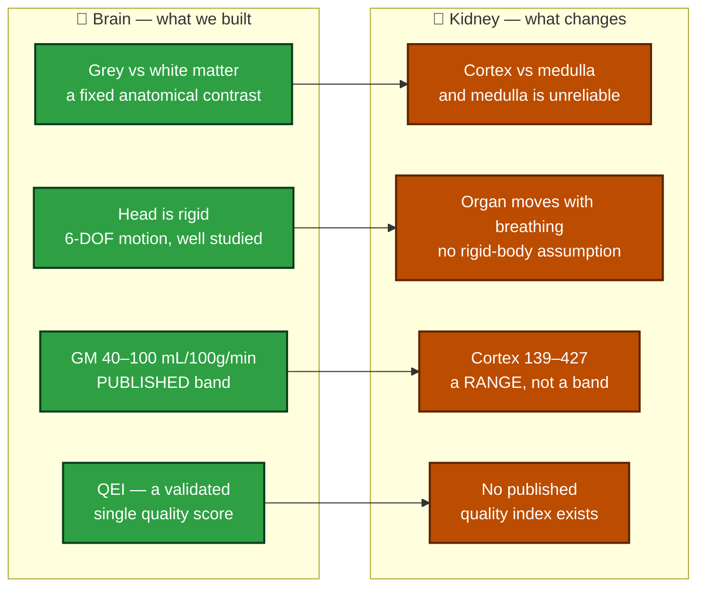
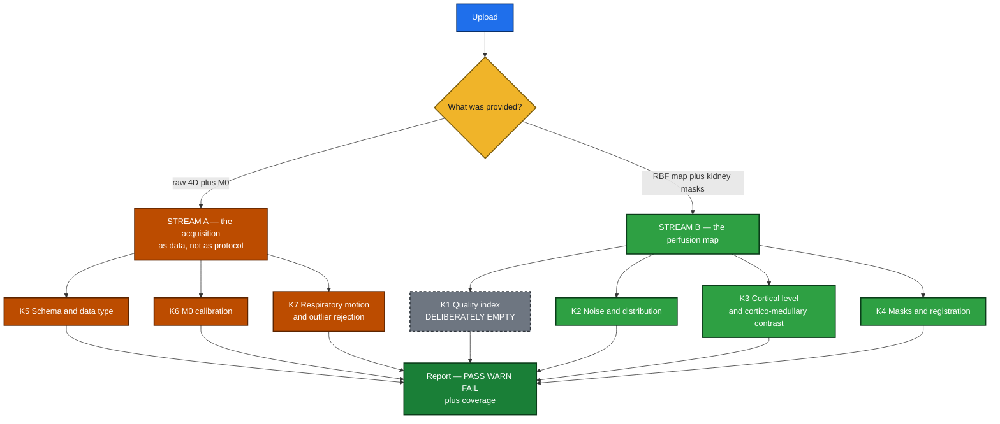

# 🫘 Kidney QC — the short version

### Extending the ASL QC ToolBox from brain to kidney
**What transfers · what breaks · what the literature will and will not let us grade**

---

## 🔭 In one paragraph

The brain toolbox grades a CBF map against grey matter. The kidney has no grey matter. It has a
**cortex and a medulla**, it **moves with every breath**, and it is perfused roughly **five times
harder** than the brain. Most of the maths survives that move; almost none of the *thresholds* do.
The single most important finding from reading the literature is a negative one, and it shapes
everything below.

> ### 🚨 The finding that shapes the design
> **Nery et al. 2020** (*MAGMA*, PARENCHIMA COST Action) is the renal equivalent of the ASL White
> Paper — 59 consensus statements, and I read every one. It contains **zero numeric quality
> thresholds.** No tSNR cutoff, no CoV cutoff, no motion limit, no QEI equivalent.
>
> So the published material is all about *how to acquire* the scan, and none of it is about
> *whether the map is good*. v1 grades the map and leaves protocol conformance out of scope, which
> means every threshold we ship is labelled **UNCALIBRATED**. That is a publishable statement about
> the field, not a gap in our work.

---

## 🧠 → 🫘 Why the kidney is harder

**The perfusion numbers do not converge.** Published healthy cortical perfusion spans
**139–427 mL/100 g/min**. The dominant driver is not biology — it is the **labelling scheme**:
**FAIR reads 1.5–1.8× higher than pCASL in the same subjects** (362 ± 57 vs 201 ± 72). Field strength
adds ~10%, age another ~15–20%. A band that is not conditioned on labelling scheme and field strength
is measuring the protocol, not the patient.

---

## ⚖️ Two consensus rules we get for free

These are the only *published mandates* that map directly onto our report, and both are cheap to honour:

| Rule | Agreement | What it means for us |
|---|---|---|
| **R10.1** — report **cortical** RBF (not whole-kidney), **separately for left and right** | **100%** | our report schema is decided for us: per-kidney, cortex-restricted |
| **R10.2** — medullary values **"are not considered reliable with current measurement approaches"** | **89%** | 🚨 the cortex:medulla ratio **cannot be a perfusion verdict** |

R10.2 is the one that hurts. The cortex:medulla ratio looked like the obvious kidney analogue of the
brain's GM/WM ratio — scale-free, contrast-based, exactly the kind of check that survives a calibration
error. Consensus says the medullary half of it is not trustworthy. So it ships as a
**segmentation-integrity flag** (INFO/WARN, never FAIL): if the ratio inverts, the *masks* are probably
swapped — which is a real and useful thing to catch, just not the thing we hoped for.

---

## 🗺️ The proposed check set

**Protocol conformance is deliberately out of scope for v1.** Nery's 59 statements are the only
published, directly checkable requirements in renal ASL — labelling scheme, timings, geometry, readout,
quantification constants — and v1 does not grade any of them. That is a real cost, stated plainly: it
leaves the design resting almost entirely on **uncalibrated** thresholds. The boundary is the same one
the brain tool draws — grade the data, not the acquisition parameters.

**K1 is deliberately empty** for a different reason: there is no renal QEI, and inventing one would be
the single least defensible thing we could do.

**K7 carries the one genuinely implementable published rule family** — subtraction-outlier rejection.
Respiratory motion is the dominant renal artefact, and unlike the brain there is no rigid-body
assumption to lean on.

---

## 📥 What you must bring

The kidney has no equivalent of "just run BET on it" — **a perfusion map alone buys almost nothing**,
because every meaningful metric is ROI-restricted and the ROIs must come from outside.

| Tier | Supply | Unlocks |
|---|---|---|
| **B0** | RBF map only | almost nothing — histogram shape, implausible-value fraction |
| **B1** | + whole-kidney masks, **left and right separately** | negative fraction, left-vs-right consistency, mask integrity |
| **B2** | + **cortex mask per kidney** | **cortical RBF — the quantity R10.1 mandates** |
| **B3** | + medulla mask (or a T1 map) | cortex:medulla ratio, as an integrity flag only |
| **A0** | raw 4D + kidney masks | outlier rate, respiratory displacement, control/label order |
| **A1** | + M0 | M0 checks, perfusion signal as % of M0 |
| **A2** | + acquisition metadata | four existing checks sharpen; **no new check** — v1 grades no protocol parameters |
| **A3** | + respiratory trace | gating efficiency, motion-vs-outlier correlation |

---

## 🔧 What transfers from the brain code

| Brain check | Verdict |
|---|---|
| Negative-voxel fraction, histogram | ✅ **transfers as-is** — non-physical is non-physical in any organ |
| Schema, data type, M0 presence / TR / background suppression | ✅ **transfers**, with renal metadata fields |
| CBF level, left-right consistency | 🔶 **new bands** — and they must be conditioned on labelling scheme |
| GM/WM ratio → cortex:medulla | 🔶 **reworked** — demoted to an integrity flag by R10.2 |
| Motion (FWD/DVARS) | 🔶 **reworked** — the organ moves, the head does not |
| **QEI** | ❌ **does not transfer** — it is built on GM/WM/CSF probability maps and a grey-matter spatial prior. No renal equivalent exists |

**The architecture change this forces:** `cfg.organ` already exists in the config but **no check reads
it** — it is inert today. Kidney is the reason to make it real, so checks, thresholds and profiles
become organ-aware rather than kidney being bolted on beside brain.

---

## ❓ For the mentors and the renal specialist

1. **R10.2 says medullary RBF is unreliable — do you agree the cortex:medulla ratio should be an
   integrity flag rather than a quality verdict?** It is the most useful-looking metric we have and
   consensus undercuts it.
2. **Should cortical bands be conditioned on labelling scheme?** FAIR vs pCASL differ 1.5–1.8× in the
   same subjects. One band cannot serve both, and pretending otherwise grades the protocol.
3. **Is there an unpublished or in-progress renal quality index we should build toward** rather than
   leaving K1 empty?
4. **What is realistically available in practice** — do sites have cortex and medulla masks, or is B1
   (whole-kidney only) the honest default tier?

---

**Full detail:** `BRAIN_TO_KIDNEY.md` → `KIDNEY_ASL_EXPLAINED.md` → `KIDNEY_QC_DESIGN.md`
**Read first:** `papers/nery2020_renal_asl_consensus.pdf`
51 papers · 68 highlighted source pages

