# 🫄 Placental ASL — Explained Simply

### *A from-zero guide to arterial spin labelling in the placenta, written for someone who already knows brain ASL*

> 🧭 **What this file is:** the placenta equivalent of [`../kidney/KIDNEY_ASL_EXPLAINED.md`](../kidney/KIDNEY_ASL_EXPLAINED.md)
> and [`../RESEARCH_EXPLAINED.md`](../RESEARCH_EXPLAINED.md). It assumes you can read code and know brain
> ASL cold, but have never seen a placental scan. It spends its time only on **what the placenta does
> differently** — and that turns out to be almost everything.
>
> 🔒 **The rule it obeys:** every number carries its **ROI, gestational age, field strength and
> labelling scheme.** A placental perfusion value without those four is not a weak number, it is a
> meaningless one. The summary line has to obey the rule too, so: the same organ reads
> **106 mL/100 g/min** (mean, whole placenta, GA 14–16 wk, 3 T pCASL, n = 34) or **336 mL/100 g/min**
> (median within the mask averaged across participants, whole placenta, GA 21 wk, 1.5 T VSASL,
> BMI ≥ 30 subgroup, n = 14) depending on how you acquired it — two different statistics of two
> different ROIs at two gestational ages under two labelling schemes.
> Where something could not be verified, it says so.
>
> 📌 **Evidence:** [`papers/`](papers/) holds 58 source PDFs; [`screenshots/`](screenshots/) holds
> **70** rendered pages at 130 dpi with **84** verbatim phrases highlighted in amber. **61** of those
> pages are shown below, each caption naming exactly what is highlighted on it. Where a caption gives
> context beyond the highlight, it says so.
>
> ⚠️ **Two things this document does not have, and neither does the field:** a consensus statement,
> and a normal range. Part 7 is the honest inventory.

---

## 📋 Part 0 — The one-page version

1. **There is no placental ASL consensus.** Not a weak one — none. The ISMRM Perfusion Study Group's
   own body-ASL review gives the **kidney** a formal *"Recommendations:"* block derived from
   PARENCHIMA, and gives the **placenta** a *"Summary"* that recommends nothing. The same review
   tells you when it thinks recommendations are premature (it says so explicitly for lung); for
   placenta it does not even say that. **There is no placental Nery 2020.** (§7.1)

2. **The organ has two circulations that never mix**, and **the labelling scheme decides which one
   you measure.** pCASL from an aortic plane labels **maternal** blood only. VSASL labels blood by
   its velocity wherever it already is, so its signal is *"contributed to by both maternal and fetal
   flow."* These are not two estimates of one quantity. **They are two different quantities.** (Part 2)

3. **In the same seven women, in the same session, pCASL recovered 9–16% of the VSASL value.** Not
   9–16% lower — *of.* Whole placenta, manual per-slice segmentation, **GA 25.4 ± 4.7 wk
   (range 21.9–35.4)**, 1.5 T, n = 7. That is the single most important number in placental ASL and it
   means no absolute perfusion threshold can be written without first branching on labelling
   scheme. (§2.4)

4. **There is no obvious labelling plane.** The placenta has multiple tortuous feeding arteries and
   no single upstream vessel, so *"a spatial labeling plane may be difficult (if not impossible) to
   define."* pCASL is done anyway, on the maternal aorta, at ~77% labelling efficiency because aortic
   blood is slow. VSASL and FAIR exist to avoid the problem entirely. (Part 3)

5. **The protocol moves the number more than the disease does.** Changing one VSASL parameter — the
   cutoff velocity — swings whole-placenta perfusion-weighted signal **9-fold**. Changing one FAIR
   parameter swings reported blood flow **84%** in the same 66 women. The disease effects reported in
   this literature run 14–35%. (§3.4)

6. **The organ grows and changes for the entire measurement window**, so "normal" is a function of
   gestational age — and the published trend does not even agree on its **sign**. Three pCASL groups
   report increase, increase, and significant decrease across overlapping windows. (Part 4)

7. **Motion is threefold and none of it is rigid.** Maternal breathing (~2 mm), fetal movement (an
   order of magnitude above adult fMRI), and uterine contractions (~8 mm) — plus a **utero-placental
   pump** that transiently removes **up to 40% of placental volume** mid-scan, in ≥60% of *healthy*
   pregnancies. And in VSASL, tissue moving within the cutoff velocity band gets **labelled as if it
   were blood**. (Part 5)

8. **Gadolinium is off the table**, which is precisely why non-contrast ASL matters here. The one
   substantial human placental DCE dataset was acquired two days before termination of pregnancy.
   (§1.3)

9. **What can be built anyway:** motion and outlier metrics that are *self-referenced* — computed
   against the scan's own distribution, not against a fixed number. That design is already standard
   in fetal MRI, and it is the only kind of threshold that cannot penalise a site for older hardware.
   (§5.5, §6.7)

---

# PART 1 — What the placenta is, and why anyone images it

## 1.1 The organ, physically

The placenta is a **temporary organ**. It does not exist before pregnancy, it grows for roughly nine
months, and it is delivered and discarded. Everything else in this document follows from that
sentence.

At term it is a disc about 20 cm across and 2–3 cm thick, weighing **500–600 g**, attached to the
inside of the uterine wall. It has two faces and they are not equivalent:

- The **basal plate** is the maternal side, fused to the uterine wall. Maternal blood enters here.
- The **chorionic plate** is the fetal side. The umbilical cord attaches here, and fetal vessels fan
  out across it.

Between the two plates sits the **intervillous space** — a blood-filled cavity, not a vascular bed.
Growing into it from the chorionic plate are **villous trees**: branching structures containing fetal
capillaries, with a surface area of ten-plus square metres, bathed directly in maternal blood.

The disc is divided by septa into **15–28 cotyledons** — visible lobes on the delivered organ. The
functional unit is slightly different and is called a **placentone**: one fetal villous tree plus the
maternal decidual vessels serving it, with a reference radius of about **2 cm**.

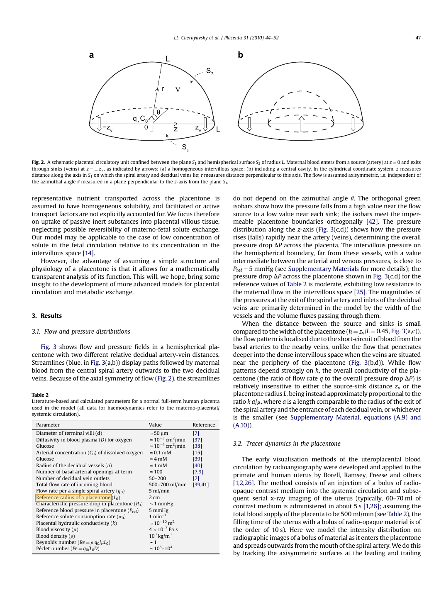

*Chernyavsky 2010, p. 4. Highlighted: **"reference radius of a placentone"** in the model parameter
table. This is what sets the spatial scale of the functional unit — roughly 2 cm radius, so ~4 cm
across. At a typical placental ASL in-plane resolution of 3–6 mm, a placentone is on the order of ten
voxels wide, which is why cotyledon-scale structure is visible in perfusion maps at all (§6.6).*

Those perfusion domains are not a modelling convenience. In a rhesus macaque study, contrast-derived
perfusion domains were photographically aligned to the actual cotyledons of the delivered placenta.

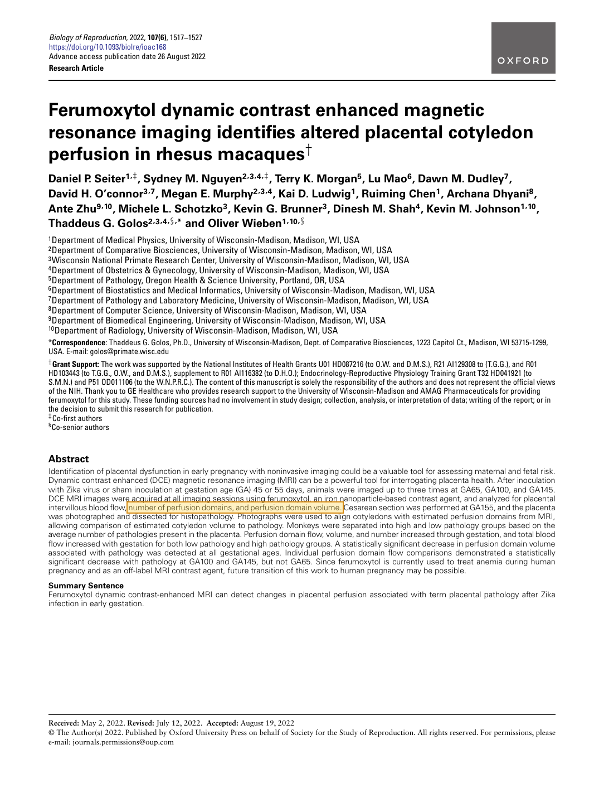

*Seiter 2022, p. 1. Highlighted: **"number of perfusion domains, and perfusion domain volume"**.
Perfusion domains segmented from contrast arrival-time maps correspond to anatomical cotyledons
confirmed against the delivered organ. Note this is a **macaque** study using **ferumoxytol contrast**
— it establishes that the anatomy is real, not that any human ASL number transfers.*

## 1.2 Why it is imaged

The placenta is the interface across which everything the fetus needs is delivered. When it
under-performs, the consequences are **fetal growth restriction**, **pre-eclampsia**, **stillbirth**
— collectively grouped as *ischaemic placental disease* or *placental insufficiency*. These are
common, serious, and currently diagnosed indirectly (by ultrasound Doppler of the umbilical artery,
by fetal growth measurement) rather than by measuring placental function directly.

That is the clinical promise: measure perfusion, catch failing placentas early. It is also why the
field has an unusual structure — most modern placental MRI was produced by one funding programme, the
**NIH Human Placenta Project**, rather than accreting organically over decades.

Be careful about the target, though. Even the disease has no agreed definition.

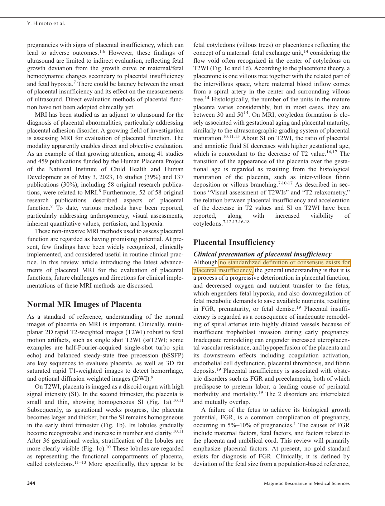

*Himoto 2025, p. 2. Highlighted: **"no standardized definition or consensus exists for placental
insufficiency"**. This matters for QC design: you cannot calibrate a quality threshold against a
clinical outcome that is itself undefined. It is one reason a placental QC tool should grade **data
quality**, not clinical plausibility.*

## 1.3 Why non-contrast, and why that is the whole point

In brain and body MRI, if you want perfusion you can inject gadolinium and watch it arrive. In
pregnancy you cannot. Gadolinium-based contrast agents cross the placenta, enter the fetal
circulation, are excreted into amniotic fluid and re-swallowed, and their residence time in the fetus
is not well characterised. Population data (Ray et al., *JAMA* 2016; 1,424,105 Ontario deliveries,
397 gadolinium-exposed) associate gadolinium exposure at any point in pregnancy with an increased
rate of rheumatological, inflammatory or infiltrative skin conditions (aHR 1.36, 95% CI 1.09–1.69)
and with stillbirth or neonatal death (aRR 3.70, 95% CI 1.55–8.85 — though on only **7 events** among
397 exposed pregnancies, so the confidence interval spans a factor of six). Professional guidance
treats it as contraindicated absent a compelling indication.

The consequence for the literature is stark. The one substantial human placental DCE dataset exists
because the contrast was given **two days before a termination of pregnancy** — the only setting in
which the risk calculus permits it.

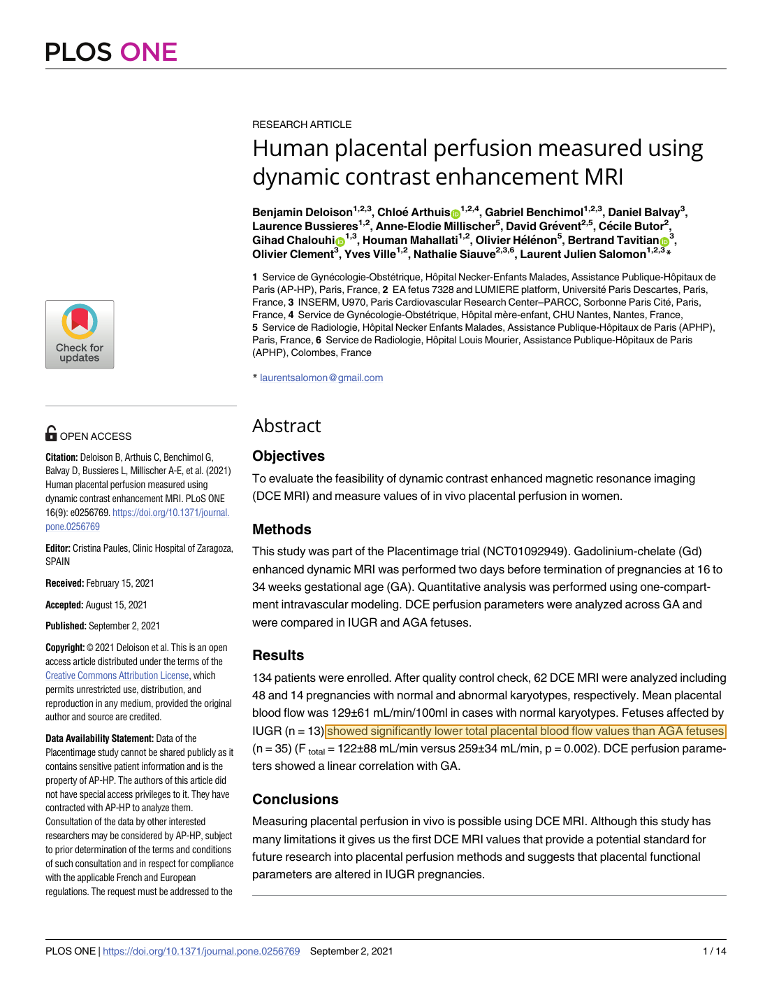

*Deloison 2021, p. 1. Highlighted: **"showed significantly lower total placental blood flow values
than AGA fetuses"** — the IUGR group differed in **total** flow (mL/min) but not significantly in
flow per unit volume. That distinction recurs throughout this document: perfusion **density** and
**total organ flow** are different measurements and behave differently. Note also the units here are
mL/min/100 **mL** (per volume), not the mL/100 **g**/min (per mass) used by every ASL study — never
pool the two.*

So: **the placenta is the organ where non-contrast perfusion imaging is not a convenience, it is the
only option.** That is the case for placental ASL in one sentence.

The output quantity has a name and units. OSIPI's living ASL Lexicon defines it as
*"Placenta | Placental Blood Flow / Placental perfusion | **PBF** | mL/100g/min"* — the same units you
already use for CBF and RBF.

---

# PART 2 — The two circulations, and what ASL actually labels

This is the conceptually hardest thing about the organ. It is worth being slow here, because every
downstream design decision turns on it.

## 2.1 Two blood supplies, one organ, no mixing

The placenta is perfused by **two entirely separate circulatory systems** belonging to two different
people:

**The maternal side (uteroplacental).** Maternal blood leaves the heart, travels down the descending
aorta, through the internal iliac and uterine arteries, into ~120 **spiral arteries** that pierce the
basal plate. It does not enter a capillary bed. It **squirts into the open intervillous space**,
washes over the outside of the villous trees, and drains out through decidual veins. Roughly
600–700 mL/min at term, turning the whole intervillous volume over 2–3 times per minute.

**The fetal side (fetoplacental).** Fetal blood leaves the fetal heart, travels down the umbilical
**arteries**, fans out over the chorionic plate, descends **inside** the villous trees to fetal
capillaries millimetres from maternal blood, and returns via the umbilical **vein**. Roughly
440 mL/min in the second trimester.

The two are separated everywhere by the placental barrier — syncytiotrophoblast, connective tissue,
fetal capillary endothelium. Oxygen, glucose, water and small molecules cross by diffusion or active
transport. **The blood itself never mixes.**

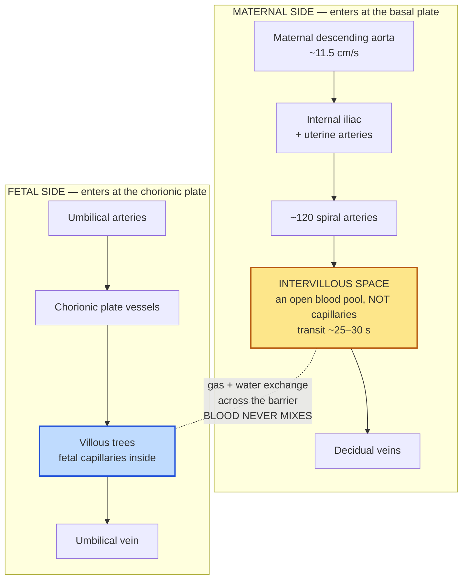
```mermaid
flowchart TB
    subgraph M["MATERNAL SIDE — enters at the basal plate"]
        A["Maternal descending aorta<br/>~11.5 cm/s"] --> B["Internal iliac<br/>+ uterine arteries"]
        B --> C["~120 spiral arteries"]
        C --> D["INTERVILLOUS SPACE<br/>an open blood pool, NOT capillaries<br/>transit ~25–30 s"]
        D --> E["Decidual veins"]
    end
    subgraph F["FETAL SIDE — enters at the chorionic plate"]
        G["Umbilical arteries"] --> H["Chorionic plate vessels"]
        H --> I["Villous trees<br/>fetal capillaries inside"]
        I --> J["Umbilical vein"]
    end
    D -. "gas + water exchange<br/>across the barrier<br/>BLOOD NEVER MIXES" .- I
    style D fill:#fde68a,stroke:#b45309,stroke-width:2px
    style I fill:#bfdbfe,stroke:#1d4ed8,stroke-width:2px
```

At around 30 weeks the two compartments are roughly **70% maternal, 30% fetal** by blood volume.

## 2.2 The intervillous space is not a capillary bed — and that breaks the ASL model

Standard ASL kinetics assume labelled water arrives in an arteriole, exchanges into a small
extravascular tissue compartment, and you image before it decays. The placenta violates this twice.

First, the placenta is *"a highly vascularized organ containing **>60% of blood by volume** (vs 4.5%
in the brain) with little tissue/parenchyma for the label to accumulate"* (Harteveld 2020, p. 13).
Hold those two numbers next to each other: brain ASL's whole kinetic model is built around a tracer
that leaves a 4.5%-blood compartment and accumulates in tissue. In the placenta there is barely a
"tissue compartment" to fill.

Second, and worse, the transit time is wrong by an order of magnitude:

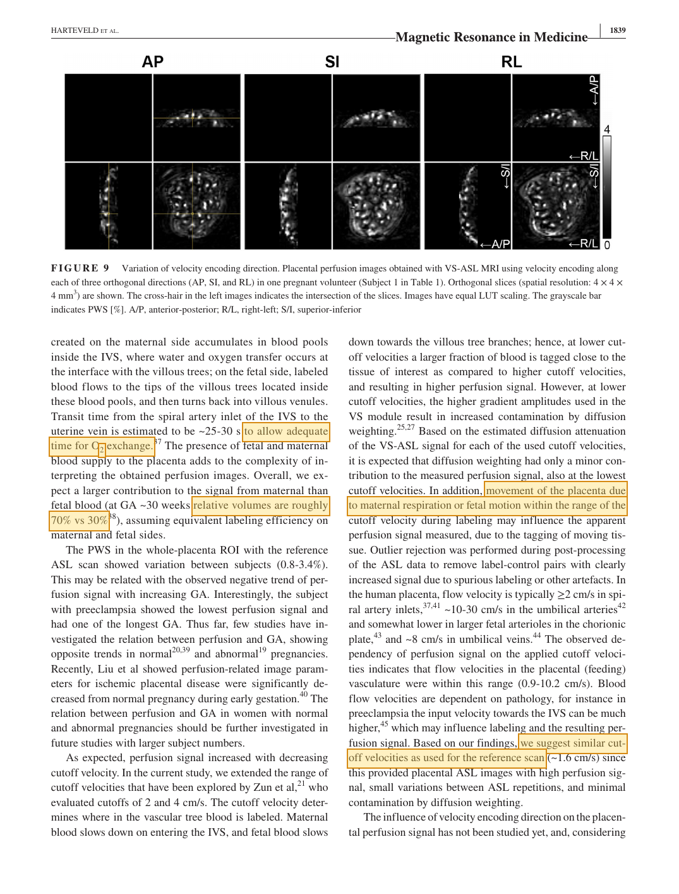

*Harteveld 2020, p. 12 — the densest page in the corpus, carrying four highlighted phrases used
throughout this document. Here: **"relative volumes are roughly 70% vs 30%"** (maternal vs fetal
blood volume at ~30 weeks) and **"to allow adequate time for O₂ exchange"** — the sentence in which
transit from the spiral artery inlet to the uterine vein is estimated at **25–30 seconds**. The same
page also carries **"movement of the placenta due to maternal respiration or fetal motion within the
range of the"** cutoff velocity (§5.4) and **"we suggest similar cutoff velocities as used for the
reference scan"** (§3.4).*

**25–30 seconds.** Labelled water decays with the T1 of blood — about 1.65 s at 3 T, 1.35 s at 1.5 T.
After 25 seconds there is nothing left. So ASL **cannot see the intervillous space as a whole**; it
sees only the neighbourhood of the spiral artery inlets, where blood has just arrived. A macaque
study comparing FAIR ASL against ferumoxytol DCE found exactly this: ASL signal was not above noise
in regions that filled late on DCE, and concluded the technique is *"limited due to extended transit
times for flow within the placenta beyond the immediate vicinity of the maternal spiral arteries."*

This is the mechanistic root of placental perfusion heterogeneity. The bright focal spots on a
placental perfusion map are inlets, not a uniform tissue bed.

## 2.3 What each labelling scheme measures

Now the payoff. Because the two circulations are anatomically separate, **where you create the label
determines which circulation you measure.**

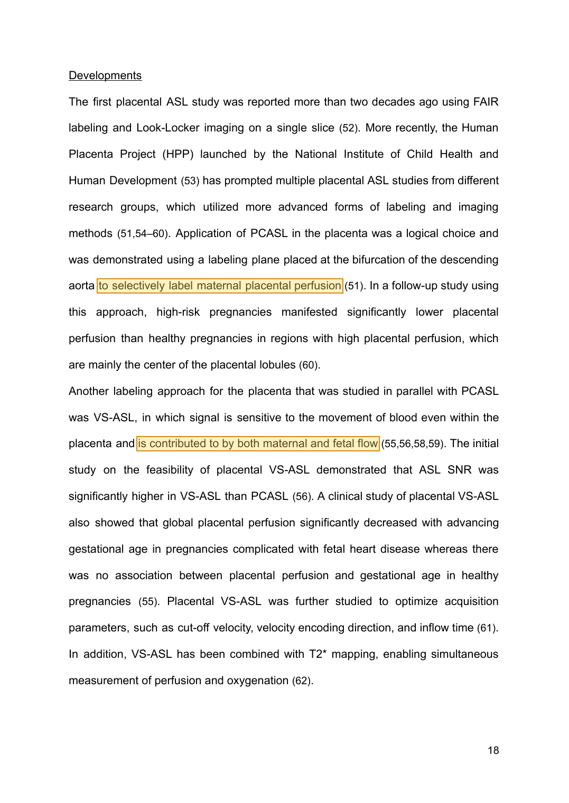

*Taso 2023 (ISMRM Perfusion Study Group body-ASL review), p. 18 — the two sentences that define the
problem, highlighted on one page. **"to selectively label maternal placental perfusion"** describes
pCASL with a labelling plane at the descending aorta bifurcation. **"is contributed to by both
maternal and fetal flow"** describes VS-ASL, in which signal is sensitive to blood moving anywhere
within the placenta. Same organ, same units, two different physical quantities.*

| Scheme | Where the label is created | What it measures |
|---|---|---|
| **pCASL** | A plane on the **maternal descending aorta**, above the bifurcation | Maternal supply only — fetal blood never crosses that plane |
| **VSASL** | Everywhere at once, by velocity, **inside the imaging volume** | Both circulations, weighted ~70:30 maternal:fetal |
| **FAIR** | A selective slab **containing the placenta itself** | Both circulations |

One important honesty caveat: **ASL labels water, not blood cells**, and water crosses the placental
barrier freely. So "pCASL is maternal-only" is a statement about **where the label is created**, not
about where the labelled water ends up. Harteveld's discussion notes that late-arriving signal is
consistent with *"labeled water being transferred to the fetal blood at the interface of the villous
trees."* The compartment boundary is watertight for blood and porous for the tracer.

## 2.4 The consequence: no conversion factor exists

If pCASL and VSASL measured the same thing with different efficiencies, you could calibrate between
them. They do not, and you cannot.

The measurement that proves it: **Zun & Limperopoulos (2018, *Magn Reson Med* 80:1036–1047)** scanned
**seven healthy pregnant women** with both schemes at 1.5 T, back to back in the same session, with
whole-placenta manual segmentation. The result:

> *"Apparent placental perfusion measured using PCASL with two different labeling locations was only
> **16% and 9%** of that of VSASL (n=7, p<0.01 for both)."*

Note the paper's own careful wording — *apparent* placental perfusion. It is not claiming pCASL
under-reads true perfusion by a factor of ten; it is reporting that two accepted techniques, applied
to the same organ in the same women minutes apart, return numbers an order of magnitude apart. Note
also the dispersion: **16 ± 12%** and **9 ± 11%**. The standard deviation approaches the mean, so
this is not a stable ratio you could invert into a correction factor — it is a demonstration that the
ratio is not stable.

> ⚠️ **Provenance:** Zun & Limperopoulos 2018 is a NIHMS author manuscript. PMC serves its PDF only
> behind a bot challenge, so there is **no PDF in `papers/`** — the verified full text is at
> [`fulltext_no_pdf/`](fulltext_no_pdf/) and there is therefore no highlighted screenshot for this
> number. It is the largest single gap in this corpus.

Two mechanisms are offered for the gap, and they point in the same direction. First, the transit
problem of §2.2: pCASL labels upstream and by the time the label arrives, most of it has decayed —
the same paper reports near-zero pCASL signal *outside* the placental lobules, consistent with very
long transit. Second, VSASL is picking up the fetal contribution that pCASL structurally cannot see.

**Design consequence.** Any placental perfusion check must read the labelling scheme **first** and
branch on it before comparing any value to any reference. A single mL/100 g/min band spanning both
schemes is not a loose threshold; it is a category error. This is the placental restatement of the
FAIR-versus-pCASL problem that made kidney thresholds unwritable — except that in kidney the two
schemes differ by 1.5–1.8×, and here they differ by an order of magnitude.

---

# PART 3 — Why there is no labelling plane, and what is used instead

## 3.1 The problem with pCASL here

pCASL works by holding a plane of tissue in a continuous inversion condition and letting blood flow
through it. It requires a vessel that (a) you can locate, (b) carries all or most of the supply, and
(c) runs roughly perpendicular to the plane at reasonable velocity. In the brain you have the
carotids and vertebrals. In the kidney you have the aorta 8–10 cm upstream.

The placenta has none of that. Maternal supply arrives via the descending aorta, then the internal
iliac and uterine arteries — *"highly circuitous and complex"* — plus a further route through the
ovarian arteries accounting for about 15% of maternal-placental circulation. There is no single
vessel that carries everything.

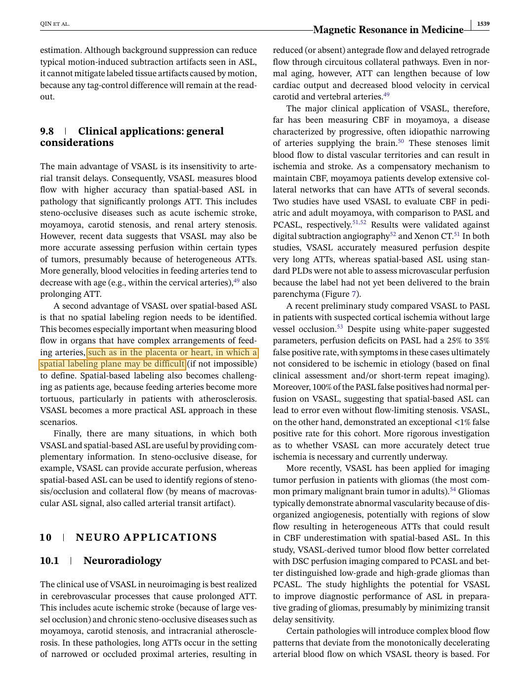

*Qin 2022 (ISMRM Perfusion Study Group VSASL recommendations), p. 12. Highlighted: **"such as in the
placenta or heart, in which a spatial labeling plane may be difficult"** — the full sentence
continues *"(if not impossible) to define."* This is the published rationale for using
velocity-selective labelling in the placenta at all: VSASL needs no spatial labelling region.*

If you do it anyway — and two groups do — you pay for it. Aortic blood is slow compared with carotid
blood, and pCASL labelling efficiency falls with velocity:

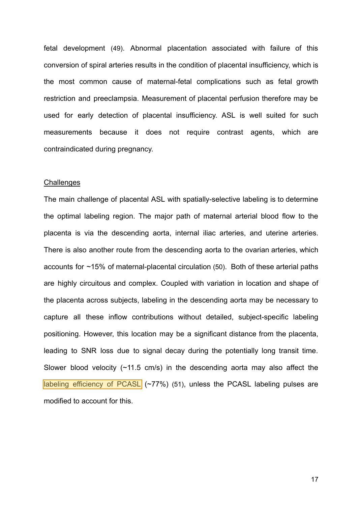

*Taso 2023, p. 17. Highlighted: **"labeling efficiency of PCASL"** — in context, slower blood
velocity of about 11.5 cm/s in the descending aorta degrades pCASL labelling efficiency to roughly
**77%**, against >90% at carotid velocities. Shao's Bloch simulation, averaging over the laminar flow
profile at the aortic bifurcation, arrived at **63.8%** and used that value for quantification. Which
of those two you assume changes reported PBF by about 17%.*

There is also no correct plane **position**. Zun 2018 tried planes 2.2 cm above and below the imaging
slab and found the better one flipped depending on where the placenta sat in the uterus — higher
placentas favoured the lower plane and vice versa. There is a subject-specific rule (put the plane
where the feeding vessels are), but no fixed one.

## 3.2 What is used instead

**VSASL (velocity-selective ASL)** labels blood by how fast it is moving rather than where it is. A
preparation module saturates or inverts spins moving above a **cutoff velocity** (V_cut), and the
readout re-applies the same condition, so only blood that has **decelerated below** the cutoff between
label and readout contributes signal. Because the label is created inside the imaging volume, arterial
transit time is in principle zero — which is exactly what an organ with 25-second transit needs.

**FAIR (flow-alternating inversion recovery)**, a pulsed scheme, alternates a selective inversion of
a slab containing the placenta with a non-selective inversion of everything. Subtracting isolates
blood that flowed in from outside the slab. Simple, no labelling plane, and it also captures both
circulations.

In the human placental ASL literature — about a dozen primary studies in total — FAIR, VSASL and
pCASL are all in use, at 0.5 T, 1.5 T and 3 T.

## 3.3 What VSASL costs

Two things a brain reader will not expect.

**It labels motion.** More on this in §5.4, but the physics belongs here: the cutoff velocities used
in the placenta are **0.9 to 2.4 cm/s**. Maternal breathing and fetal movement displace placental
*tissue* at velocities inside that band. VSASL cannot tell moving tissue from moving blood, so motion
does not merely blur the image — it **creates perfusion signal that is not there**.

**Quantification needs a second module, and SAR often forbids it.** A single VS module gives you a
signal proportional to perfusion but not calibrated to it; a second module is what makes the number
absolute. Adding it costs RF power, and pregnancy is scanned under a strict SAR limit. In the PERFOX
study, adding the second module *"raised the minimally achievable repetition time from 3.5 s to
6.4 s"* under a 2 W/kg limit. Several 3 T placental studies drop the second module and report
relative signal instead of physiological units. (This is a **fetal-study** SAR constraint reported by
one collaboration; the 2 W/kg whole-body normal-operating-mode limit applies at 1.5 T too, so do not
read it as a pure field-strength effect.)

## 3.4 The protocol knobs, and how far they move the number

This is the section that determines whether an absolute threshold is possible. It is not.

**Cutoff velocity.** Harteveld swept V_cut from 0.9 to 10.2 cm/s in the same subjects:

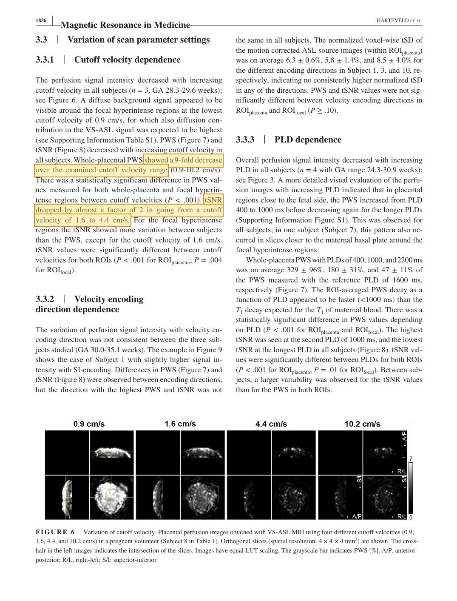

*Harteveld 2020, p. 9. Two highlights. **"showed a 9-fold decrease over the examined cutoff velocity
range"** — whole-placental perfusion-weighted signal, same women, one parameter, ninefold. And
**"tSNR dropped by almost a factor of 2 in going from a cutoff velocity of 1.6 to 4.4 cm/s"** — so
even the SNR you would use to judge quality is itself protocol-dependent. Whole-placenta ROI,
n = 3 for this sub-experiment, GA 28.3–29.6 wk, 3 T.*

Cutoff velocity is **not standardised**: Harteveld recommends ~1.6 cm/s, Zun used 2.0, Seiter 2.4.
Two sites both running "VSASL" with different V_cut are not measuring the same thing.

*Harteveld 2020, p. 12 (shown again for a different highlight). **"we suggest similar cutoff
velocities as used for the reference scan"** — ~1.6 cm/s, with inflow times ~1000 ms. This is the
**only** placenta-specific VSASL parameter suggestion in the literature. It is a single-centre
optimisation study, n = 10, anterior placentas only, BMI < 30 — grade it `implementation`, not
consensus.*

**Post-labelling delay.** In the same study, whole-placenta signal at PLD 400 ms was **329%** of the
1600 ms reference and at 2200 ms was **47%** — a sevenfold span. Worse, the PLD dependence differs
between the fetal-side and maternal-side regions, so it is not a global scaling you could correct out.

**FAIR inversion slab thickness.** Jungelson et al. (*Placenta* 2026) scanned **66 uncomplicated
pregnancies** at 1.5 T, varying only the selective inversion pulse thickness:

| Inversion thickness | Mean placental blood flow | ROI · GA · field |
|---|---|---|
| 30 mm | 323.5 ± 93.7 mL/100 g/min | single 10 mm axial slice · **GA not stated** · 1.5 T |
| 50 mm | 213.8 ± 62.4 mL/100 g/min | single 10 mm axial slice · **GA not stated** · 1.5 T |
| 70 mm | 175.6 ± 57.4 mL/100 g/min | single 10 mm axial slice · **GA not stated** · 1.5 T |

Same women, same scanner, same session, p < 0.01. The 30 mm setting reads **84% higher** than the
70 mm setting. **Report this with the paper's own conclusion attached**, or you misrepresent it: the
authors state that reproducibility was highest at 70 mm and that the 70 mm values are consistent with
previously reported values. So 323.5 is not a competing legitimate value — it is the paper's own
rejected setting. The finding is *"this parameter must be pinned and reported"*, not *"placental
perfusion is unknowable"*.

> ⚠️ **Provenance — the weakest citation in this document, and it is flagged everywhere it appears.**
> Jungelson 2026 is behind an Elsevier paywall: **abstract only**, no PDF, no full text in
> `fulltext_no_pdf/`, no screenshot, and **none of these figures is verifiable from this corpus** —
> a search for "jungelson", "323.5" and "175.6" across all 58 PDFs and 14 text-only papers returns
> zero hits. Its ROI is a **single 10 mm axial slice**, not a whole-placenta volume, so it is not the
> same measured quantity as the whole-placenta values elsewhere in Part 4. The abstract does not
> state gestational age. **Do not use these numbers as a reference range**, and read the paper in
> full before quoting it.

**Together:** one VSASL parameter → 9×. One FAIR parameter → 1.84×. Labelling scheme → an order of
magnitude. Against disease effects that, across this literature, run 14–35% (Chandra Sekhar's IUGR
14.7%; Liu's ischaemic placental disease 35% on the high-perfusion sub-region). This is the
equipment-over-biology failure mode in its purest form.

---

# PART 4 — Gestational age: what does "normal" even mean?

## 4.1 The problem

Brain ASL has a stable target. An adult brain at 25 and at 45 is the same organ, and normal grey
matter CBF is ~50–60 mL/100 g/min throughout. The placenta is **built and consumed inside the
measurement window**. It roughly doubles in volume between 16 and 20 weeks. Its tissue T1 falls with
gestation. Its vascular architecture matures. There is no gestational age at which it is "the adult
placenta".

So a normal range must be a **curve in gestational age**, not a band. That curve does not exist.

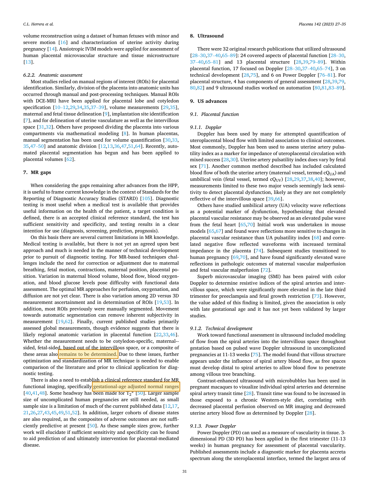

*Herrera CL, et al., *Placenta* 2023 (**PMC11257151**) — the NIH Human Placenta Project **programme
review**, not the same-author *Eur Radiol* pCASL primary quoted in §4.2/§4.3 — p. 5, the
authoritative statement of the gap, with two highlights on one page. **"gestational-age adjusted
normal ranges"** appears in the sentence stating there is a need to establish a clinical reference
standard, specifically GA-adjusted normal ranges. And **"remains to be determined"** closes the
sentence asking whether the measurement needs to be cotyledon-specific, maternal-sided, fetal-sided,
based out of the intervillous space, or a composite. **Both the normal range and the ROI are
unresolved in the literature** — stated by the programme that funded most of this work.*

## 4.2 The published values, with everything attached

Every number below carries GA, ROI, field strength and labelling scheme, because without all four it
is not usable.

### VSASL, 1.5 T, whole placenta

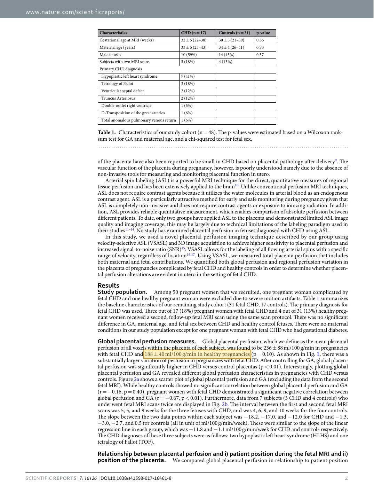

*Zun 2017, p. 2. Highlighted: **"188 ± 40 mL/100 g/min in healthy pregnancies"**. Whole placenta —
defined in the paper as the mean of all voxels within a manual per-slice delineation. n = 31 healthy
controls, GA **30 ± 5 weeks (range 21–39)**, 1.5 T GE MR450, VSASL with V_cut 2 cm/s and TI 1600 ms.
The fetal-CHD group in the same study read 236 ± 88, which was **not** significant unadjusted
(p = 0.10) and became significant only after controlling for GA.*

> 📌 **A citation trap worth knowing.** A widely used cross-study comparison table lists this cohort's
> GA as 32 ± 5 weeks. The primary paper says **30 ± 5**; 32 ± 5 is the fetal-CHD group. Take GA from
> primaries, not from summary tables — the drift is already visible in the one column that matters
> most.

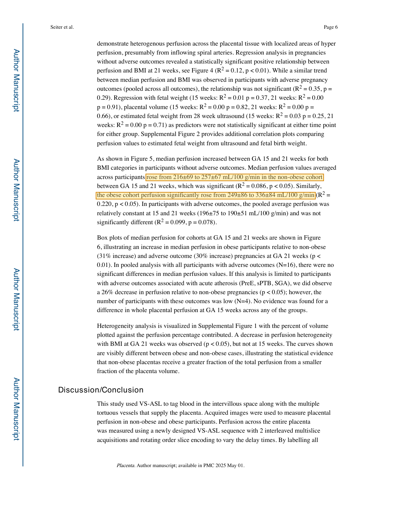

*Seiter 2024, p. 6 — two highlights. **"rose from 216±69 to 257±67 mL/100 g/min in the non-obese
cohort"** between GA 15 and 21 weeks, and **"the obese cohort perfusion significantly rose from
249±86 to 336±84 mL/100 g/min"** over the same window. Whole placenta, 8-slice manual mask on M0, and
note the statistic is the **median** within the mask averaged across participants — not a mean, so it
is not directly comparable with the mean-based studies above. 1.5 T GE Optima MR450w, VSASL,
V_cut 2.4 cm/s, PLD 1.2 s.*

### pCASL, 3 T, whole placenta

Second trimester (Shao 2018, *JMRI* 47:1667–1676, PMC5951737, n = 34): **105.9 ± 26.5** at 14–16 wk
and **116.9 ± 25.7** at 19–22 wk, a **+10.4%** rise; arterial transit time ~1387 ms with no
significant GA change. ROI = hand-drawn on the **T2-weighted GRASE control images**, covering most of
the placental volume across 8 slices (2.4 cm), drawn by two research fellows. Liu 2020 (*JMRI*
51:1247–1257, PMC7654100, n = 54 normal): **104.9 ± 31.4** at 16 wk and **111.3 ± 25.9** at 20 wk,
whole placenta, 8 slices, 3 T — with both timepoints **normalised to 16 and 20 weeks** on a linearity
assumption rather than acquired at exactly those ages. *(Both are NIHMS manuscripts — full text
verified, no PDF, no screenshot.)*

Third trimester:

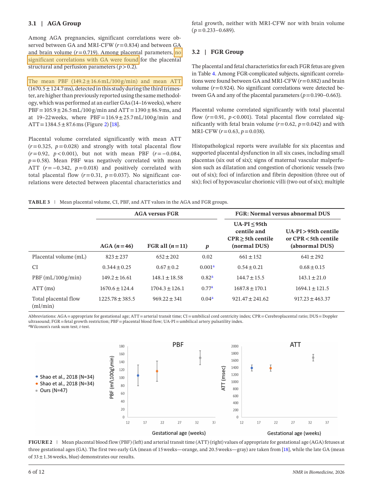

*Link-Sourani 2026, p. 6 — two highlights. **"The mean PBF (149.2 ± 16.6 mL/100 g/min) and mean
ATT"** (1670.5 ± 124.7 ms) for the appropriate-for-gestational-age group, whole placenta, multi-delay
3 D GRASE pCASL at 3 T, GA 33 ± 1.4 weeks. And **"no significant correlations with GA were found"** —
within this study's own narrow ~3-week recruitment window, no GA trend is detectable at all. Note the
implausibly tight SD (16.6 on n = 46, against 26–48 in every comparable cohort) and treat it
cautiously.*

## 4.3 The trend does not agree on its sign

Line the pCASL studies up and the problem is obvious:

| Study | Field | Window | ROI | Change |
|---|---|---|---|---|
| Shao 2018 | 3 T | 14–16 → 19–22 wk | whole placenta, 8 slices | **+10.4%** |
| Liu 2020 | 3 T | 16 → 20 wk (normalised) | whole placenta, 8 slices | **+6.1%** |
| Seiter 2024 (VSASL) | 1.5 T | 15 → 21 wk | whole placenta, 8 slices, **median** | **+19.0%** |
| **Herrera 2023** (Eur Radiol) | 3 T | 16–20 → 24–28 wk | ⚠️ **two selected T2w slices**, not a volume | **−30.7%** (103.1 → 71.4, p = 0.004, n = 18) |
| Link-Sourani 2026 | 3 T | within 30–37 wk | whole placenta | **none detectable** |
| Zun 2017 (VSASL, lateral) | 1.5 T | 21–39 wk | whole placenta | **flat** (r = −0.09, p = 0.74) |

The windows are adjacent rather than identical, so a curve that rises to ~21 weeks and falls by 26
would reconcile several of these. But that curve has never been measured; Herrera's decline is a
**within-subject longitudinal** finding, which is the hardest kind to explain away — and it is also
the one row whose ROI is different from every other row, which is the hardest kind of difference to
notice.

> ⚠️ **Two traps in one row.**
> **(1) Naming.** The −30.7% study is **Herrera CL, et al., *European Radiology*
> 2023;33(12):9223–9232 (PMC10796849)** — a primary pCASL study. It is a *different paper* from
> **Herrera CL, Kim MJ, Do QN, et al., *Placenta* 2023, doi 10.1016/j.placenta.2023.08.067
> (PMC11257151)**, the Human Placenta Project programme review quoted in §4.1. Same first author,
> same year, different journals, different document types. Cite by journal and PMCID, never by
> author-year.
> **(2) ROI.** The *Eur Radiol* paper is routinely read as a whole-placenta value. It is not. Its
> methods state that from the 5 pCASL-matched T2-weighted slices, *"2 slices that had the most
> coverage of the placenta were selected"*, ROIs were drawn on those two and transferred to the PBF
> map, and *"the mean PBF value and its standard deviation were calculated from the 2 ROIs."* So
> 103.1 and 71.4 are **two-slice** values. They may not be compared head-to-head with the 3D or
> multi-slice whole-placenta numbers in the rest of this section — this is the placental version of
> the kidney cortex-versus-medulla error, and it is invisible because both are printed in
> mL/100 g/min and both are called "placental perfusion".

## 4.4 Two more things that move the number at fixed gestational age

**Maternal position.** In the same healthy cohort:

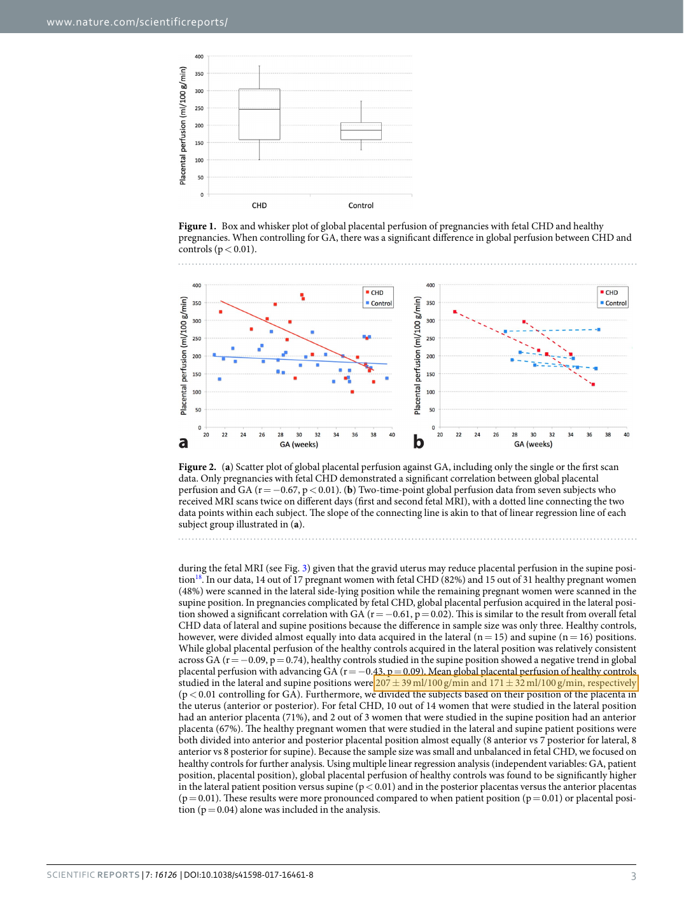

*Zun 2017, p. 3. Highlighted: **"207 ± 39 mL/100 g/min and 171 ± 32 mL/100 g/min, respectively"** —
lateral decubitus versus supine, p < 0.01 controlling for GA. The supine **group** reads **17%
lower** (equivalently, lateral is +21%). Whole placenta, 1.5 T VSASL, GA 21–39 wk, n = 31 total.
**Read the design before the mechanism.** This is a **between-subject** comparison — 15 lateral
women against 16 different supine women — and it was **not randomised**; position was assigned by
patient size and preference. So it supports *"these two groups of women differ"*, not *"turning a
woman onto her back lowers her placental perfusion by 17%."* The usual mechanism offered — the gravid
uterus compressing the inferior vena cava and aorta when supine — is real, independently documented,
and consistent with the direction; it is simply not what this comparison measured. A second study, a
66-woman 1.5 T FAIR cohort, reports **no** significant association with maternal position ⚠️ (that is
Jungelson 2026, abstract only, not verifiable in this corpus — §3.4). Record position as metadata; do
not treat 17% as a correction factor.*

**Maternal BMI.** From the Seiter figure above: at GA 21 weeks, obese (BMI ≥ 30, n = 14)
**336 ± 84** versus non-obese (n = 46) **257 ± 67** — a **31%** difference in healthy pregnancies at
identical gestational age, whole placenta on an 8-slice manual mask, 1.5 T VSASL, the statistic being
the median within the mask averaged across participants. This is **also between-subject**, and
whether it is physiology or B1/coil-loading is unresolved; the authors raise the possibility of noise
and B1 variability themselves.

## 4.5 What the fix looks like, and it exists — for a different parameter

Placental **T2\*** faced exactly this problem and solved it. The solution was not a fixed band but a
**gestational-age-and-field-specific z-score**:

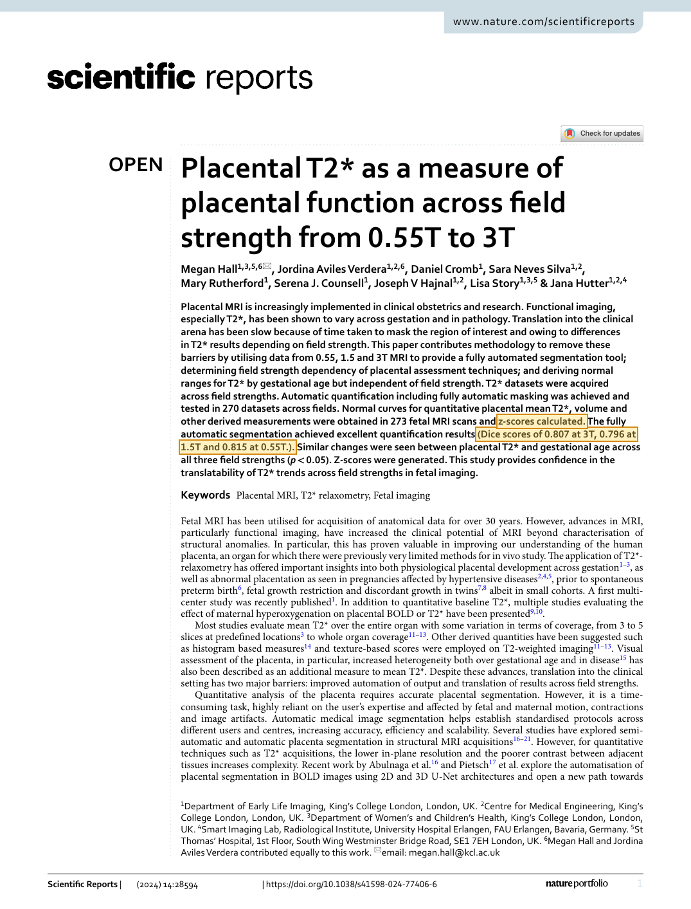

*Hall 2024, p. 1 — two highlights. **"Dice scores of 0.807 at 3T, 0.796 at 1.5T and 0.815 at 0.55T"**
— automatic whole-placenta segmentation is essentially field-strength independent, so the mask is not
the obstacle. And **"z-scores calculated"** — raw placental T2\* differs by a factor of 3.3 between
0.55 T and 3 T at 30 weeks, but after GA-and-field-specific z-scoring there is **no significant
difference between field strengths** (F = 0.03, p_FDR = 0.97), and the z-score is uncorrelated with
GA, maternal BMI, maternal age and placental location. This is the architecture placental ASL needs
and does not have.*

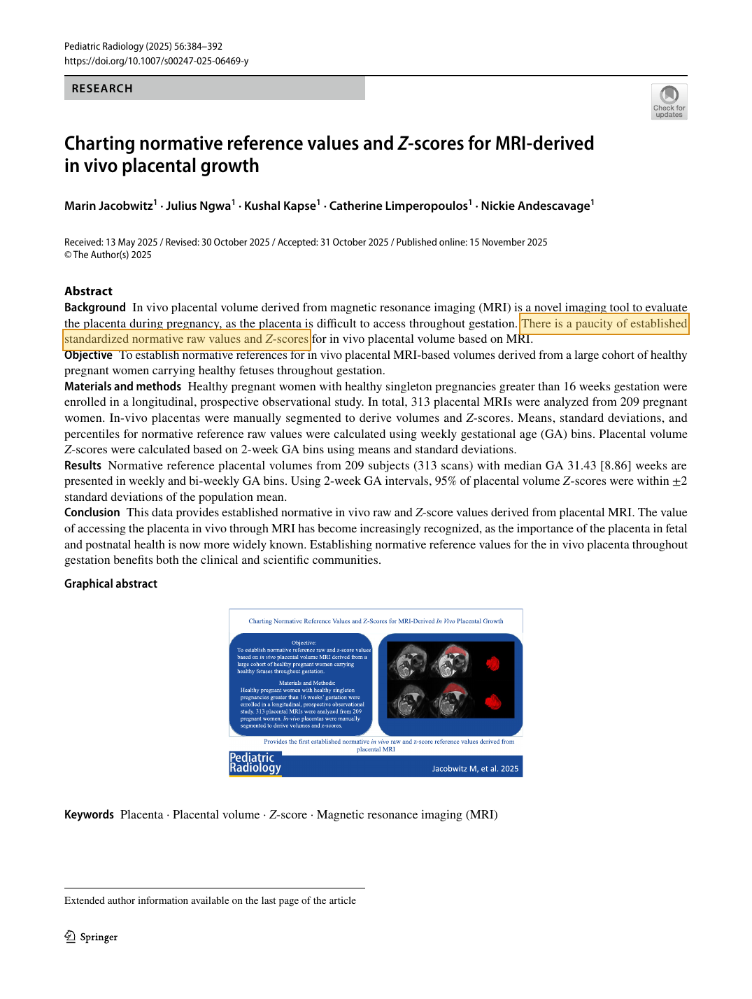

*Jacobwitz 2026, p. 1. Highlighted: **"there is a paucity of established standardized normative raw
values and z-scores"** — the paper then supplies them, in weekly gestational bins, **for placental
volume**. Normative placental references exist. They exist for volume and for T2\*. They do not exist
for perfusion.*

The cost is the point: the T2\* normative work took 273–797 scans across multiple sites. The **entire**
human placental ASL literature is roughly a dozen primary studies totalling well under 500 women.

---

# PART 5 — Motion, threefold, and why no rigid-body assumption survives

## 5.1 What brain motion correction assumes

Brain motion correction assumes the object is a **rigid body**: it can translate and rotate, but it
does not deform. Six parameters describe any brain movement, framewise displacement collapses them
into one number, and a threshold on that number is meaningful because the underlying model is true.

In the placenta, every clause of that is false. The organ deforms. It is pushed by an independent
moving object inside the same field of view. And it contracts.

## 5.2 Source one — maternal respiration

The whole abdomen moves with every breath, and the uterus and placenta move with it.

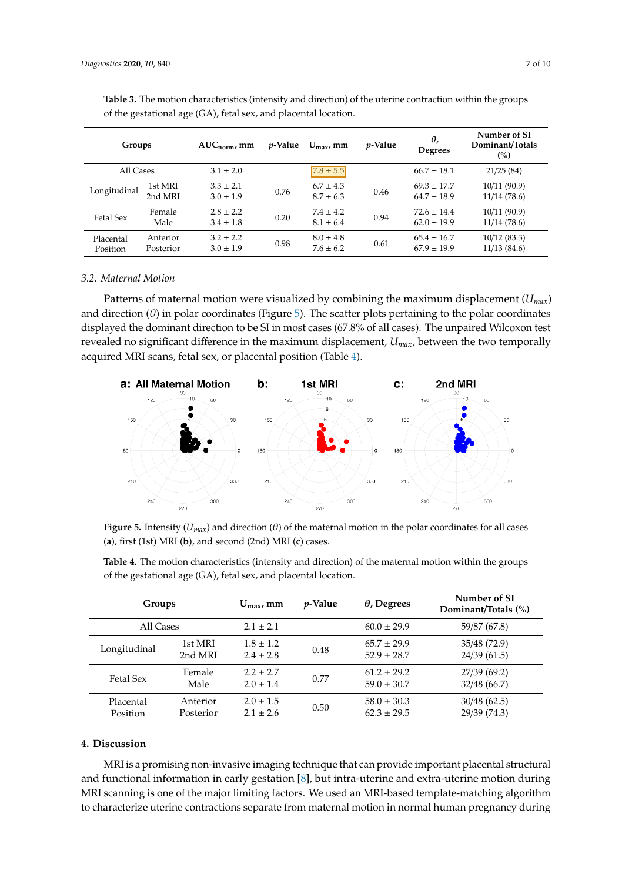

*Martin 2020, p. 7. Highlighted: **"7.8 ± 5.5"** — maximum uterine displacement during a
**contraction**, in mm, from MRI-based template-matching motion tracking. The comparison figure in
the same study is **2.1 ± 2.1 mm** for maternal (extrauterine, respiratory and other-organ) motion.
So respiration is the **smallest** of the placental motion sources — roughly a quarter of a
contraction — which inverts the usual abdominal-MRI intuition. 112 scans in 66 women, GA 14–24 wk,
3 T. Note the tracked structure is the uterus, and the motion was superior-inferior dominant in 84%
of contraction cases.*

## 5.3 Source two — fetal movement

There is a second person in the field of view and they move independently, unpredictably, and hard.
The best available magnitude is from fetal brain fMRI:

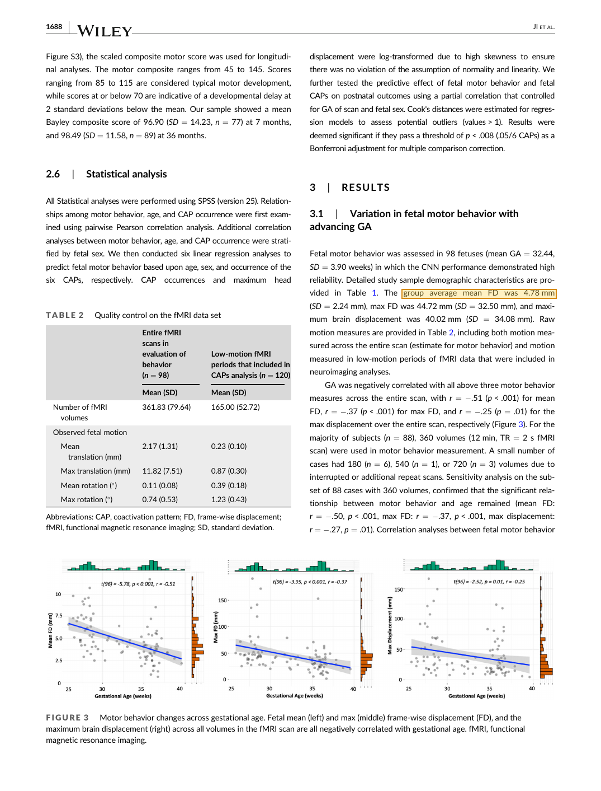

*Ji 2023, p. 6. Highlighted: **"group average mean FD was 4.78 mm"** — mean framewise displacement
across 98 fetuses, with max FD reaching 44.72 mm. A routine adult brain fMRI scrubbing threshold is
0.2–0.5 mm, so **mean** fetal motion is roughly an order of magnitude above what adult pipelines
censor at. Two caveats: this is the fetal **brain**, not the placenta, and the FD here uses a 30 mm
rotation radius scaled for the fetal head rather than the adult 50 mm — so it is not numerically
interchangeable with adult FD. Fetal motion also **decreases** with gestational age (r = −0.51), as
the fetus runs out of room.*

Note the direction of that last finding, and note what it is *not* paired with. Fetal motion **falls**
with GA (r = −0.51). Contraction behaviour, by contrast, shows **no detectable GA trend** in the one
healthy cohort that tested it — rate, duration, placental-volume reduction and ΔR2\* all flat across
gestation (p = 0.64 / 0.27 / 0.65 / 0.56, n = 36; §5.4, arXiv preprint). So the two largest motion
sources do not scale together and cannot be traded off against each other: a single GA-independent
motion threshold is mis-set at one end of gestation for fetal motion, and a GA-indexed one has
nothing to index against for contractions.

## 5.4 Source three — contractions, and the utero-placental pump

This is the one with no analogue anywhere else in MRI. Contractions in a non-labouring pregnancy —
Braxton Hicks and related activity — are common, usually unfelt, and they deform the organ being
measured **during** the acquisition.

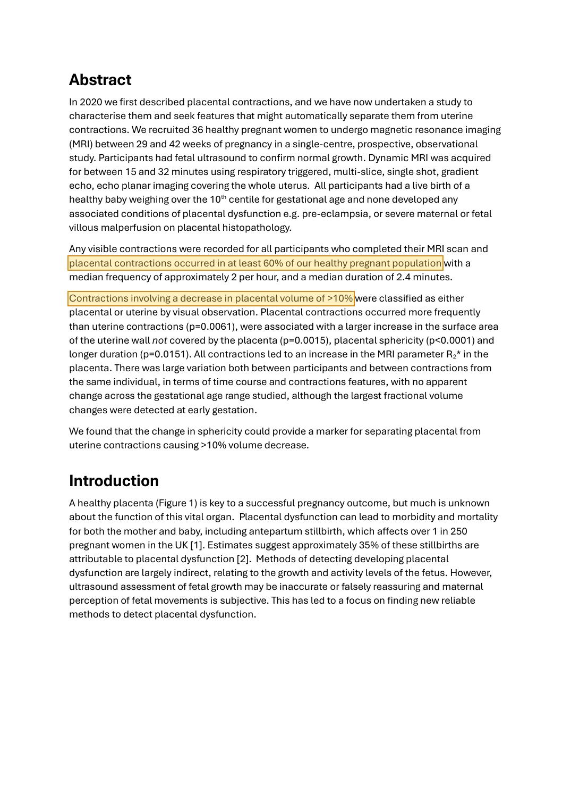

*Dewick 2026, p. 2 — two highlights. **"placental contractions occurred in at least 60% of our
healthy pregnant population"** (n = 36, GA 29–42 wk, median ~2 per hour, median duration 2.4 min),
and **"contractions involving a decrease in placental volume of >10%"** — the operational criterion
used to classify them. ⚠️ **This is an arXiv preprint, not peer reviewed.** Treat both numbers as
provisional. At ~2/hour and 2.4 min duration, the chance that a 5–10 minute acquisition overlaps a
contraction is roughly one in three at worst, not a coin flip.*

And the deformation is not small:

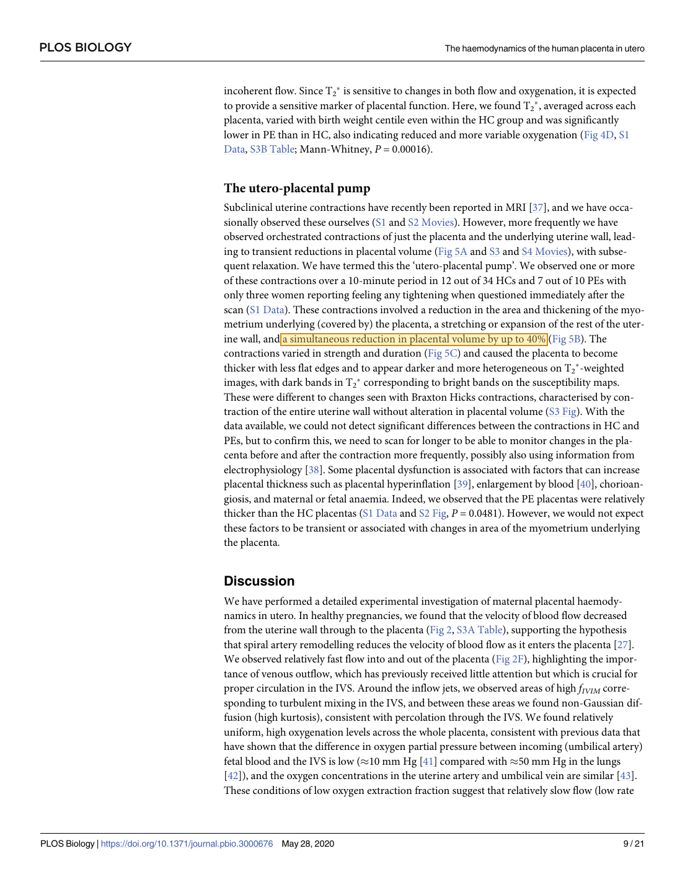

*Dellschaft 2020, p. 9. Highlighted: **"a simultaneous reduction in placental volume by up to 40%"**.
This describes the **utero-placental pump** — the placenta and the uterine wall beneath it contracting
independently of the rest of the uterus. Observed in 12 of 34 healthy controls and 7 of 10
pre-eclamptic women within a **10-minute** window, and **only three women reported feeling anything**.
So the organ you are measuring can lose almost half its volume mid-scan with no external warning at
all.*

Can this be detected automatically? Not yet:

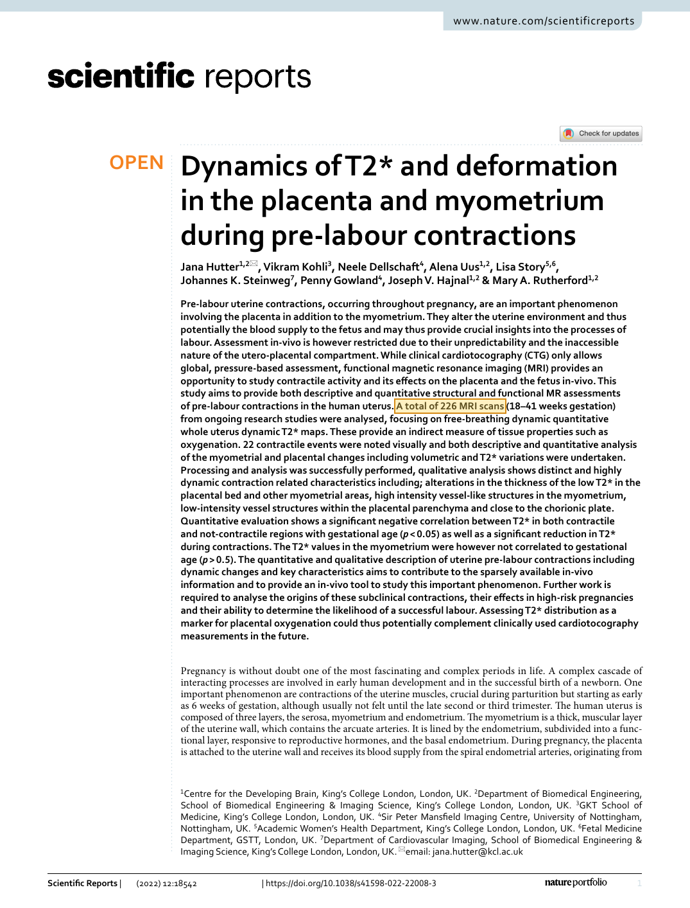

*Hutter 2022, p. 1. Highlighted: **"A total of 226 MRI scans"** — searched **visually** for
contractile events, because no automated detector exists. ⚠️ **Do not quote 226 as a denominator for
a prevalence.** The abstract calls 226 the total; the paper's own Table 1 splits the cohort as
*"Contractions identified (N = 22) / No contractions identified (N = 226)"*, which would make the
total 248. The paper is internally ambiguous on this point, so this document uses it only for what is
unambiguous — that a **few hundred** scans were reviewed **by eye**. The same paper reports that
deformation-field and Jacobian analysis *"did not robustly identify all visually observed
contractions"*, so the definition fell back to visual impression. That is a **published negative
result** on automating contraction detection, and it is harder evidence than an absence would be.*

## 5.5 What this does to motion correction — and what fetal MRI does instead

The consequences are structural:

- **Rigid-body registration is mis-specified.** Placental ASL uses **non-rigid** registration — ANTs
  SyN with iterative template construction (Harteveld, Hutter), Elastix (Seiter). A six-parameter
  framewise-displacement analogue is not the right motion metric here; motion QC must be built on
  **deformable-registration residuals**.
- **Deformable slice-to-volume registration** is the placenta-validated approach, and it ships
  numbers:

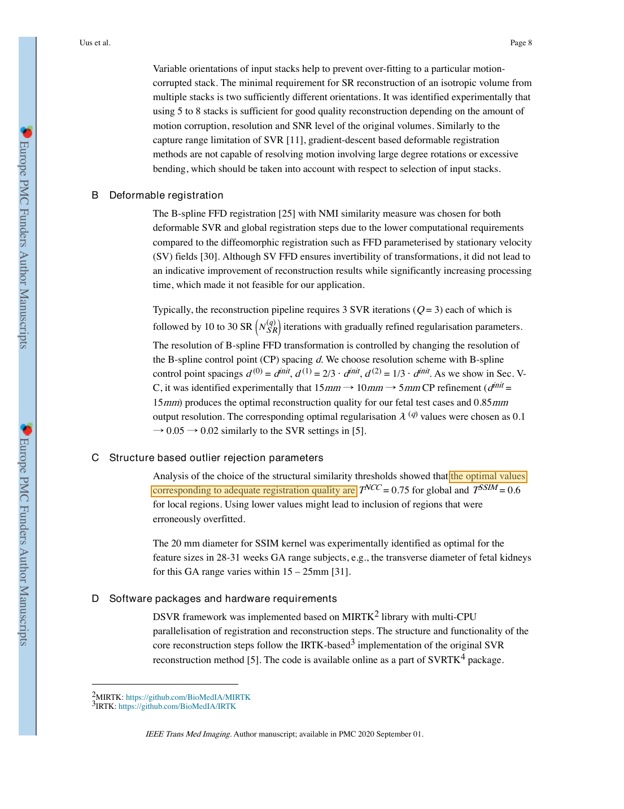

*Uus 2020, p. 8. Highlighted: **"the optimal values corresponding to adequate registration quality
are"** — T_NCC = **0.75** for global slice rejection and T_SSIM = **0.6** for local regions, with a
20 mm SSIM kernel tuned for 28–31 week feature sizes. These are the only slice-rejection thresholds
in the corpus **validated on placenta** rather than fetal brain. They are internal to a slice-to-volume
reconstruction, so they are not a scan-level PASS/FAIL gate — but they are the right family.*

- **Background suppression is deliberately incomplete.** In brain ASL you want static tissue crushed.
  Seiter's placental VSASL protocol used two inversion pulses *"optimized to minimize the background
  signal evenly from 300 to 3600ms"*, explicitly accepting incomplete suppression to keep *"a small
  level of signal for image registration."* A brain-derived check that flags weak background
  suppression as a defect would fire wrongly here.

- **And in VSASL, motion is not just misregistration — it is fake signal.** The
  *"movement of the placenta due to maternal respiration or fetal motion within the range of the
  cutoff velocity"* highlighted on Harteveld p. 12 (§2.2) means moving tissue gets tagged. A second
  group put it plainly: *"Depending on encoding direction, VS-ASL may also label bulk fetal or
  maternal motion, making perfusion image inspection important."*

  **Design consequence, and it is counter-intuitive:** in placental VSASL, an **anomalously high**
  perfusion value is as likely to be a motion artefact as a low one. A placental QC check must flag
  both tails.

## 5.6 The design pattern worth stealing: self-referenced thresholds

Fetal MRI has already solved the "our threshold would grade the hardware" problem, and the solution
is consistent across four independent groups: **derive the boundary from the data in hand.**

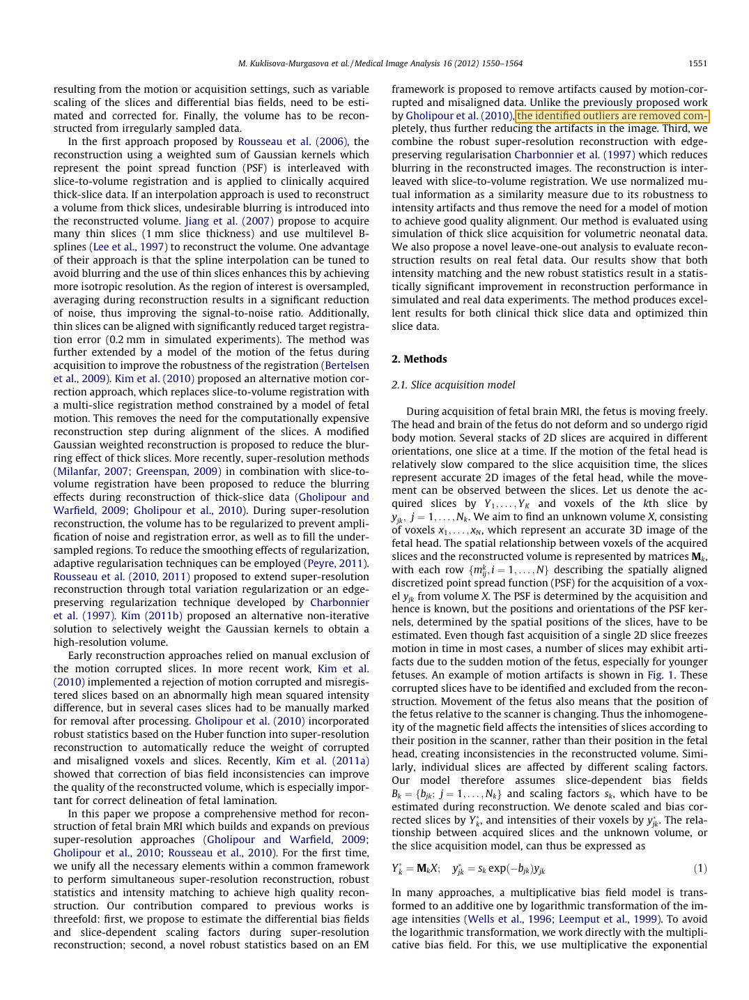

*Kuklisova-Murgasova 2012, p. 2. Highlighted: **"the identified outliers are removed com-"**
(completely, at the next line break). The method models voxel errors as a Gaussian-inlier plus
uniform-outlier mixture and **estimates the inlier variance and inlier proportion from the data
itself by EM** — a redescending M-estimator with no fixed cut-off, explicitly contrasted in the paper
with Huber statistics where *"errors are instead thresholded at a certain value and thus artifacts
cannot be fully removed."* This is the foundational template: **no number to port, and therefore no
number that can penalise a site for older hardware.***

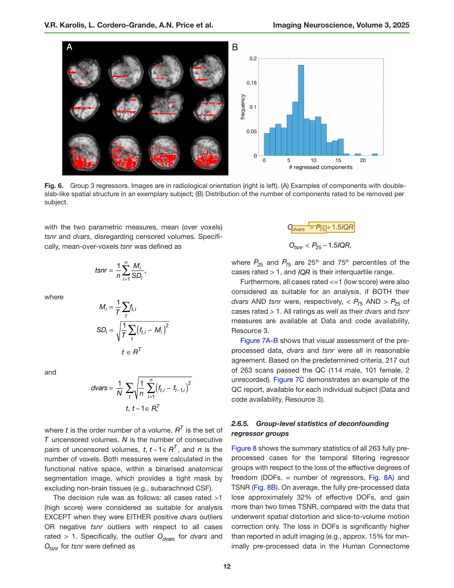

*Karolis 2025 (dHCP fetal fMRI release), p. 12. Highlighted: **"dvars > p75 + 1.5iqr"** — the
exclusion rule uses **Tukey fences computed within the cohort being analysed**, not a fixed
threshold. The full rule is bidirectional: metrics can rescue a low-rated scan as well as veto a
high-rated one. 217 of 263 scans passed (82.5%), GA 20.9–38.3 wk. Note the accompanying dHCP
volume-censoring metric is also self-referenced — it compares each volume to **that scan's own
temporal median**, not to an absolute displacement.*

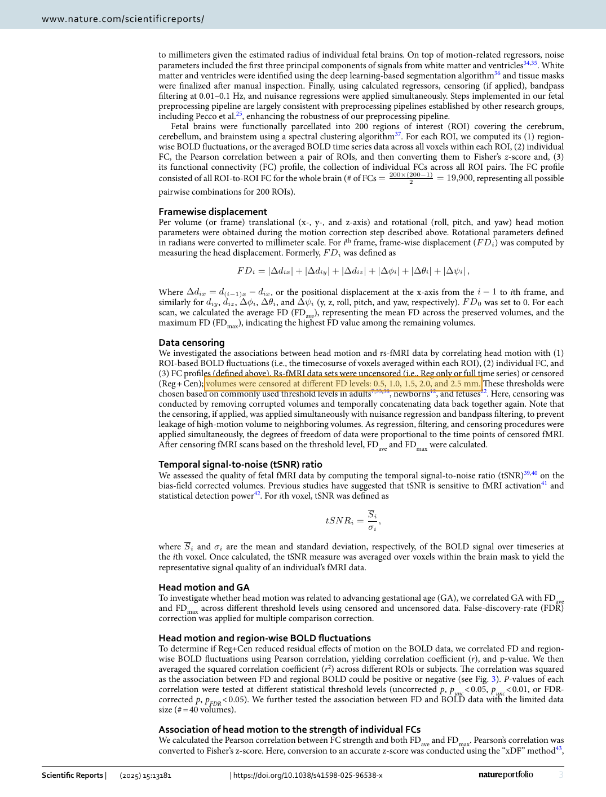

*Kim 2025, p. 3. Highlighted: **"volumes were censored at different fd levels: 0.5, 1.0, 1.5, 2.0,
and 2.5 mm"** — the study swept the threshold rather than inheriting one, and concluded that a
moderate cut-off of **1.5–2.0 mm** was appropriate for fetal data, three to ten times more permissive
than typical adult values. The lesson is not the number (this is fetal **brain** BOLD at 1.5 T); it is
that in-utero thresholds must be **re-derived**, never inherited.*

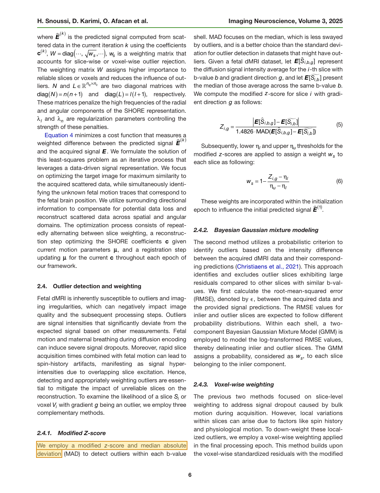

*Snoussi 2025, p. 6. Highlighted: **"we employ a modified z-score and median absolute deviation"** —
computed **within each b-value shell**, and used to **soft-weight** slices rather than hard-reject
them. Note the two z-score thresholds in this method (η_l, η_u) are **never given numeric values
anywhere in the paper** — they are uncalibrated engineering defaults, and the paper is honest about
being a weighting scheme rather than a gate.*

Four groups, three modalities, thirteen years apart, same answer: **learn the inlier/outlier boundary
from this scan or this cohort.** For placenta — where no published threshold exists and equipment
varies enormously — this is the design to copy.

---

# PART 6 — Failure modes, and what each looks like in the data

## 6.1 Motion-corrupted label/control pairs

**What it looks like:** individual subtraction images with wildly elevated or structured signal,
often over the whole uterus rather than confined to the placenta. In VSASL specifically, bright
regions tracking anatomy that moved.

**The one published rule that is directly implementable** — "implementable" being the operative word,
because it is *not* the only rejection criterion in this literature. Shao 2018 states one too:
*"Outliers of the perfusion images were removed when identified as beyond two standard deviations."*
That is explicit and numeric, but it never says two SD **of what statistic, over which voxels, along
which axis** — so it cannot be reimplemented from the text without guessing three things. Liu 2020
states a third (§6.2). Harteveld's is the only one that names every term:

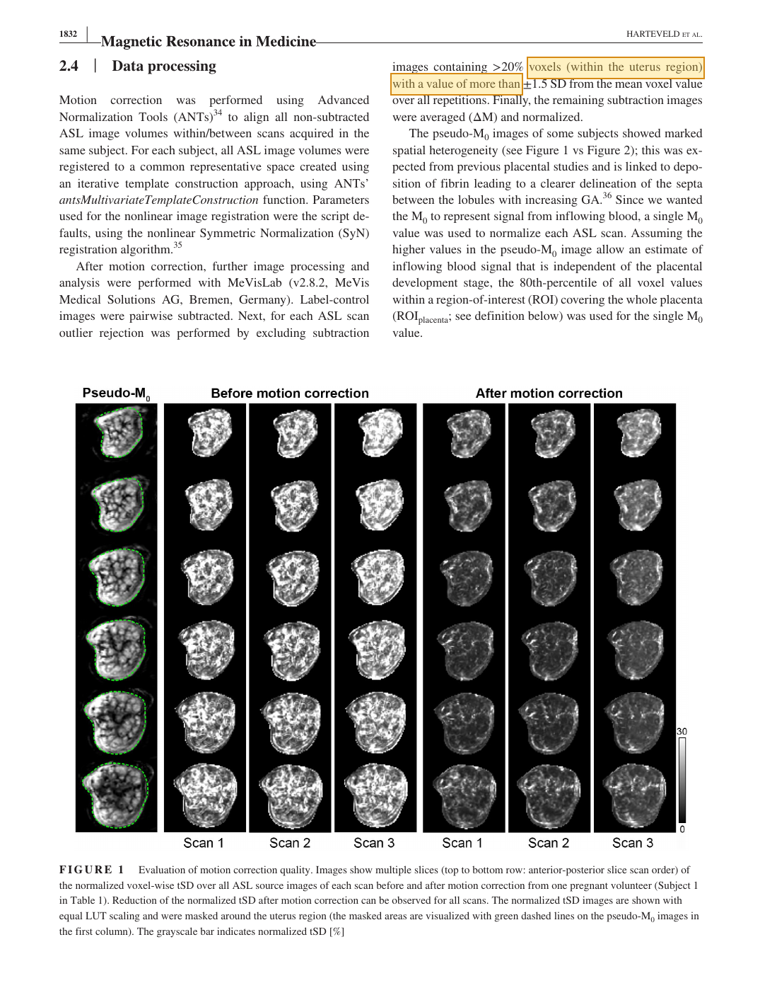

*Harteveld 2020, p. 5. Highlighted: **"voxels (within the uterus region) with a value of more than"**
— the full rule rejects a subtraction image if **more than 20% of voxels within the uterus region
deviate by more than ±1.5 SD from that voxel's mean across repetitions**. Note the ROI: **uterus**,
deliberately wider than the placenta. This is the most transferable single artefact in placental ASL
QC — and it is **self-referenced**, comparing each voxel to its own distribution across the scan's
own repetitions, so it needs no reference database and never leaves the institution.*

**How much it fires in practice, and what "clean" looks like afterwards:**

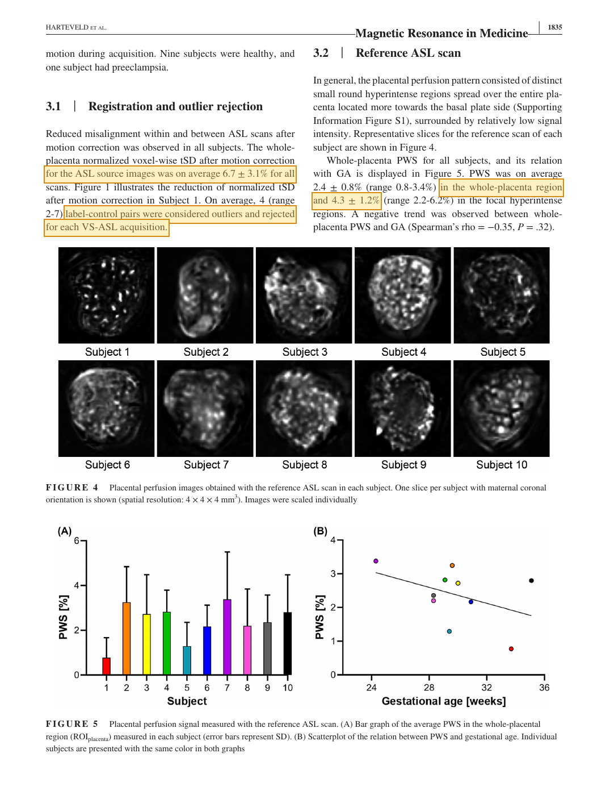

*Harteveld 2020, p. 8 — three highlights on one page. **"label-control pairs were considered outliers
and rejected for each VS-ASL acquisition"** — on average **4 (range 2–7)** per acquisition. **"for the
ASL source images was on average 6.7 ± 3.1% for all"** — the whole-placenta normalised voxel-wise
temporal SD after motion correction, i.e. what a successfully corrected placental ASL series looks
like. And **"in the whole-placenta region and 4.3 ± 1.2%"** — the ROI trap of §6.6. All from n = 10
analysed, 3 T, BMI < 30, anterior placentas only.*

**A second published rule, from a different modality but the same anatomy:**

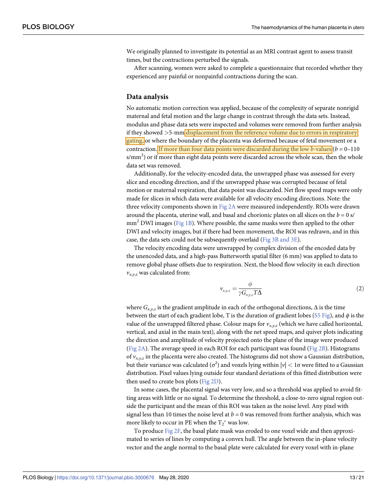

*Dellschaft 2020, p. 13 — two highlights. **"displacement from the reference volume due to errors in
respiratory gating"** — volumes were removed if they showed **>5 mm displacement**, or if the
placental boundary was deformed by fetal movement or a contraction. And **"if more than four data
points were discarded during the low b-values"** — the scan-level rule discards the **entire dataset**
if more than four low-b or more than eight total volumes were dropped. Two caveats: the >5 mm was
judged by **visual inspection**, not a computed registration metric, and the second limb of the rule
(boundary deformed) has no threshold at all. It is a human reading protocol with one numeric anchor,
not an automated gate. Also: **the authors deliberately applied no automatic motion correction**,
because maternal and fetal non-rigid motion cannot be separated.*

## 6.2 Labelling failure

**What it looks like:** a perfusion map with no coherent high-perfusion structure at all — no bright
inlet regions, just noise at the level of the subtraction floor.

The only automated *labelling-failure* detector in the placental ASL literature comes from Liu 2020,
which defined a high-perfusion sub-region as the intersection of an Otsu-thresholded high-PBF region
with an SNR > 1 region — and **excluded the scan if that intersection was empty**. It fired on
**9 of 69 subjects** (13%), *"all of whom delivered normally"*. So this is a genuine
acquisition-quality gate, not a disease signal. Two things to carry: the PBF threshold is computed
**per scan by Otsu's method**, not hardcoded, and only the SNR > 1 half is a fixed constant. That
makes it the second reimplementable quality criterion in this literature after Harteveld's pair
rejection — a different job (it grades the scan, not the pair), but worth knowing before anyone
writes "there is only one". *(Liu 2020, *JMRI* 51:1247–1257, PMC7654100 — NIHMS manuscript, full text
verified, no PDF, no screenshot.)*

## 6.3 Contamination — amniotic fluid, fat, and the maternal bladder

**What it looks like:** implausibly high values in voxels at the placental boundary, or structured
bright regions outside the organ leaking into the mask.

Amniotic fluid is the dominant one and has a published, copyable rule — from T2\*, not ASL, but the
principle ports directly:

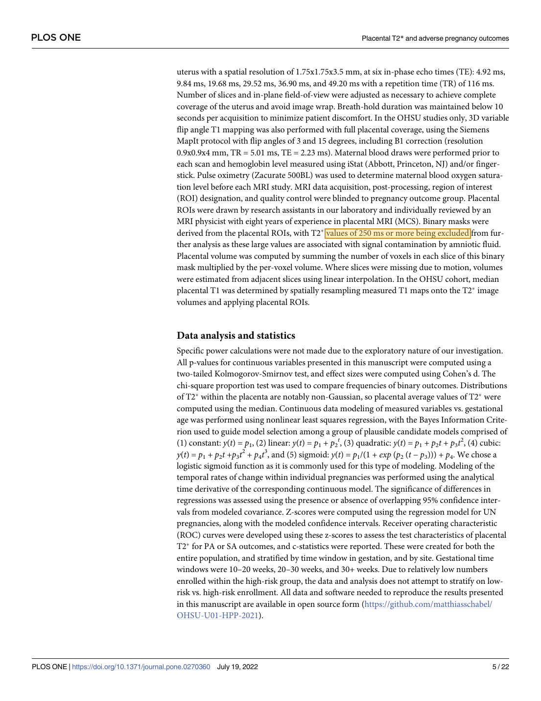

*Schabel 2022, p. 5. Highlighted: **"values of 250 ms or more being excluded"** — voxels with
T2\* ≥ 250 ms were excluded from the placental mask as amniotic fluid contamination. This is the
template for a placental **implausibility guard**: an upper physiological bound on the parameter map
itself, used to clean the ROI rather than to grade the patient. 316 pregnancies, 797 imaging studies,
3 T, two sites.*

Liu 2020 lists the full set of named error sources for placental pCASL: *"motion, amniotic fluid,
subcutaneous fat, large vessels, and B₀ inhomogeneity"*, and manually excluded 10 subjects on those
grounds.

## 6.4 Field-strength and B1 failure

**What it looks like:** shading — regions of localised signal loss across the gravid abdomen — and,
at 3 T, protocols that are already SAR-limited before you add anything.

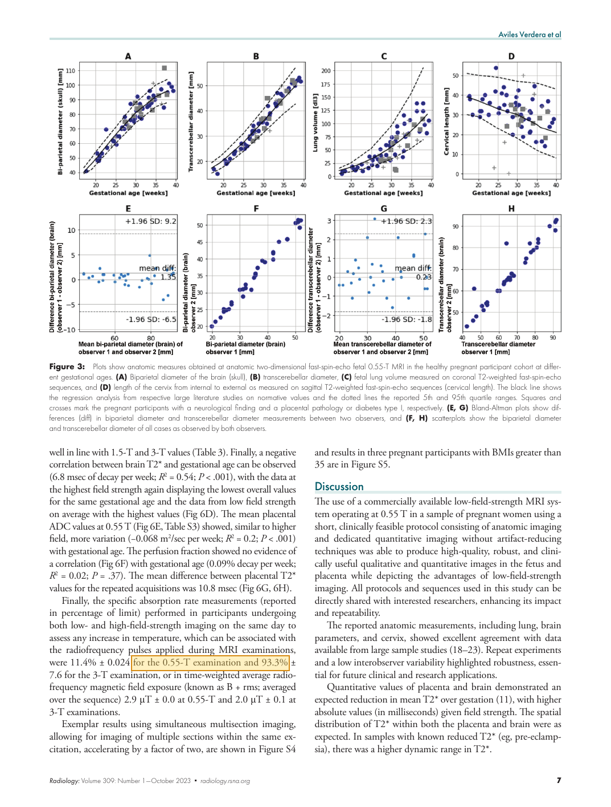

*Aviles Verdera 2023, p. 7. Highlighted: **"for the 0.55-T examination and 93.3%"** — in participants
scanned at **both** field strengths on the same day, a routine fetal protocol consumed **11.4%** of
the SAR limit at 0.55 T and **93.3%** at 3 T. That is roughly eightfold different headroom. At 3 T
there is essentially no budget left for an RF-hungry ASL preparation; at low field there is room to
spare. This directly constrains which labelling schemes are even acquirable at each field strength.*

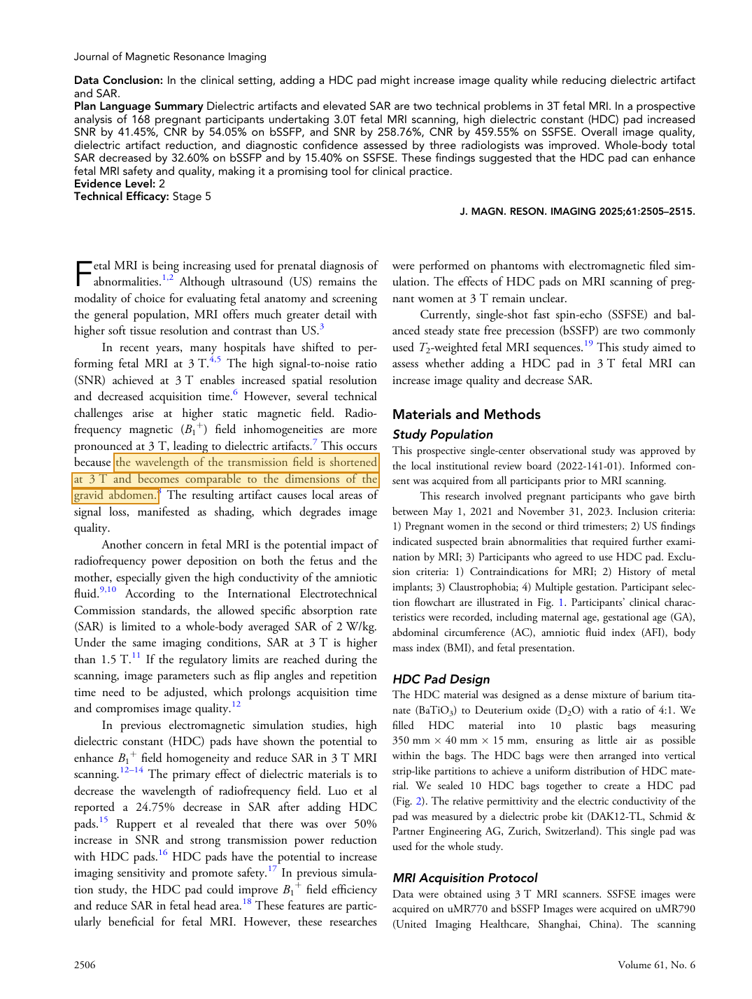

*Zhu 2025, p. 2. Highlighted: **"the wavelength of the transmission field is shortened at 3 T and
becomes comparable to the dimensions of the gravid abdomen"** — the physical cause of dielectric
standing-wave artefact, which produces local signal loss manifesting as shading. This is a real
reason groups choose 1.5 T for placental work. ⚠️ The SNR improvements this paper reports are measured
in **fetal brain** ROIs, not placenta — do not transfer them.*

## 6.5 Contraction contamination

**What it looks like:** a step change in placental volume, shape and signal partway through a
dynamic series, with the myometrium thickening beneath the placenta.

There is an operational onset definition, though it is narrower than it looks:

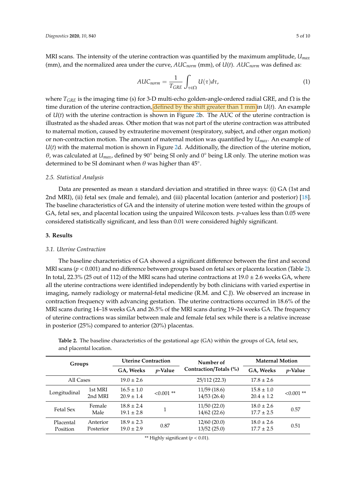

*Martin 2020, p. 5. Highlighted: **"defined by the shift greater than 1 mm"** — a displacement shift
greater than 1 mm in the tracked trace defines the **duration window** of a contraction. Important
scope limit: in this paper contractions were first identified by **two clinicians**, and the 1 mm
criterion then delimits the window for computing a summary statistic. It is not a standalone
detector, and it will not reproduce the paper's 22% prevalence if used as one.*

## 6.6 The ROI trap — the placental cortex-versus-medulla

In kidney, the classic error is quoting a cortical value against a medullary reference. The placenta
has its own version, and it is worse because both numbers are printed in the same units and both are
called "placental perfusion".

Within the **same scans, same women**, Harteveld p. 8 (§6.1) reports whole-placenta perfusion-weighted
signal of **2.4 ± 0.8%** against **4.3 ± 1.2%** in focal hyperintense regions — a 1.8× difference from
ROI choice alone. Liu 2020 reports whole-placenta PBF of **104.9** against high-PBF sub-region
(hPBF) of **278.1 mL/100 g/min** — 2.65×.

Both of those sub-region values are **supra-threshold by construction** — a region selected for being
bright must exceed the mean it was selected from — so the ratios are partly tautological. That does
not make them harmless. It makes them **exactly the kind of number that gets quoted without its
qualifier.** Liu's hPBF is also computed on n = 45 where whole-placenta PBF used n = 54, because 9
subjects had no computable hPBF region at all.

There are at least four distinct placental ROI conventions in current use, and they are not
interconvertible:

| Convention | Example |
|---|---|
| **Whole placenta**, 3D or multi-slice manual mask | Zun, Seiter, Harteveld, Link-Sourani |
| **High-perfusion sub-region**, data-derived threshold | Liu (hPBF) |
| **Single slice** | Jungelson (one 10-mm axial slice) |
| **Scattered small ROIs**, 40–60 mm² ellipses averaged | Chandra Sekhar |

And on top of that sits the maternal-versus-fetal-side axis, which is a real, measured spatial
gradient — perfusion peaks near the maternal basal plate while T2\* peaks near the fetal chorionic
plate. A whole-placenta mean averages across two opposing physiological gradients.

The best available guidance is honest but blunt:

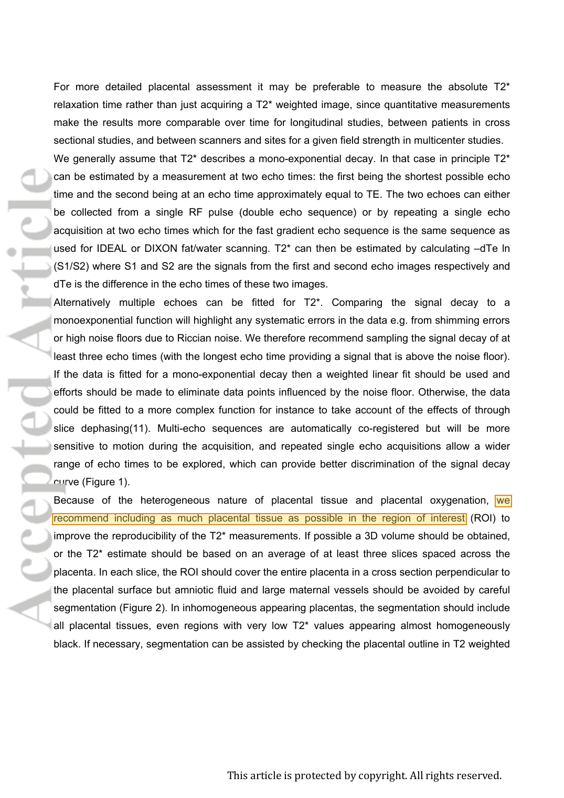

*Sørensen 2020, p. 9. Highlighted: **"we recommend including as much placental tissue as possible in
the region of interest"** — for reproducibility of the **mean**. The same review adds two things the
brain instinct gets wrong: do **not** exclude very dark, near-black placental regions from the mask
(they are tissue, not artefact), and report a **volume-normalised histogram alongside the mean**,
because the mean alone discards the heterogeneity that is the signal of interest. ⚠️ This is an expert
**narrative review** about **T2\***, not a consensus and not about ASL.*

And there is a concrete, implementable regional recipe if you need one:

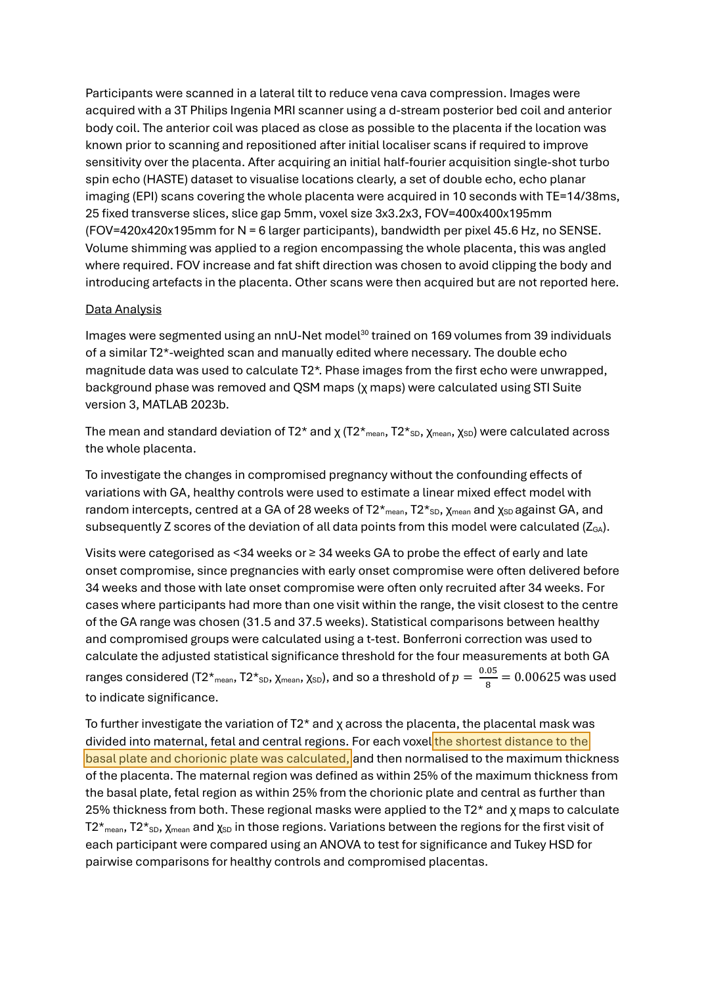

*Turnbull 2026, p. 4. Highlighted: **"the shortest distance to the basal plate and chorionic plate
was calculated"** — normalised to maximum placental thickness, with maternal region = within 25% of
the basal plate, fetal region = within 25% of the chorionic plate, central = the rest. This is the
only reproducible maternal/central/fetal recipe in the corpus. ⚠️ **arXiv preprint**, derived on
T2\*/QSM at 3 T in the third trimester only, and untested on ASL.*

## 6.7 What "normal" heterogeneity looks like — and why the brain sCoV threshold would misfire

If you are tempted to port the brain spatial-coefficient-of-variation check:

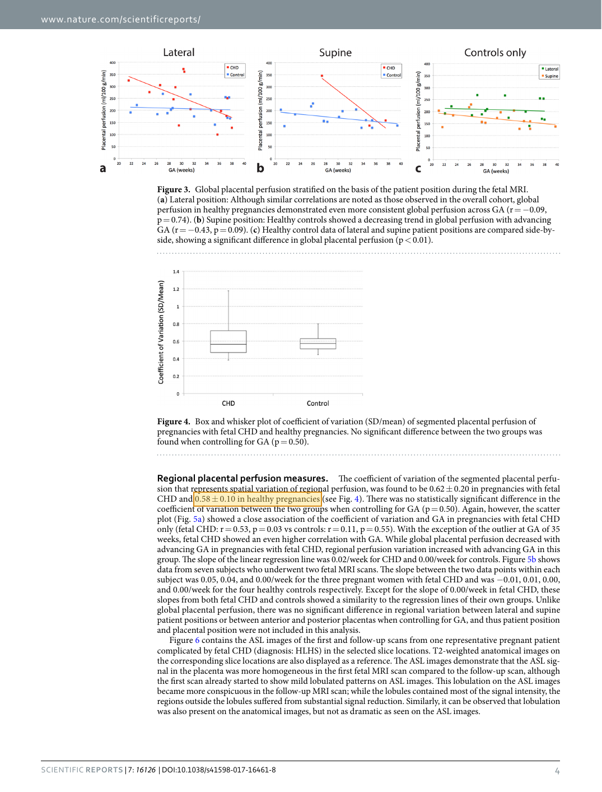

*Zun 2017, p. 4. Highlighted: **"0.58 ± 0.10 in healthy pregnancies"** — the coefficient of variation
of segmented placental perfusion, representing spatial variation of regional perfusion (0.62 ± 0.20
in fetal CHD; not significantly different, p = 0.50). The brain ExploreASL sCoV FAIL cut-off is
**0.67**. A **healthy** placenta sits well inside one standard deviation of it. But do not compute
the near-miss and act on it: Zun's statistic is the CoV of **3×3-voxel segment means** on interpolated
images, while brain sCoV is a voxelwise CoV inside a grey-matter probability mask. Different
estimators at different spatial scales. The correct conclusion is not "18% of healthy placentas would
fail" — it is that **the brain threshold has no placental derivation and must not be ported at any
value.***

## 6.8 The worst failure mode: adopting a number that looks like a threshold

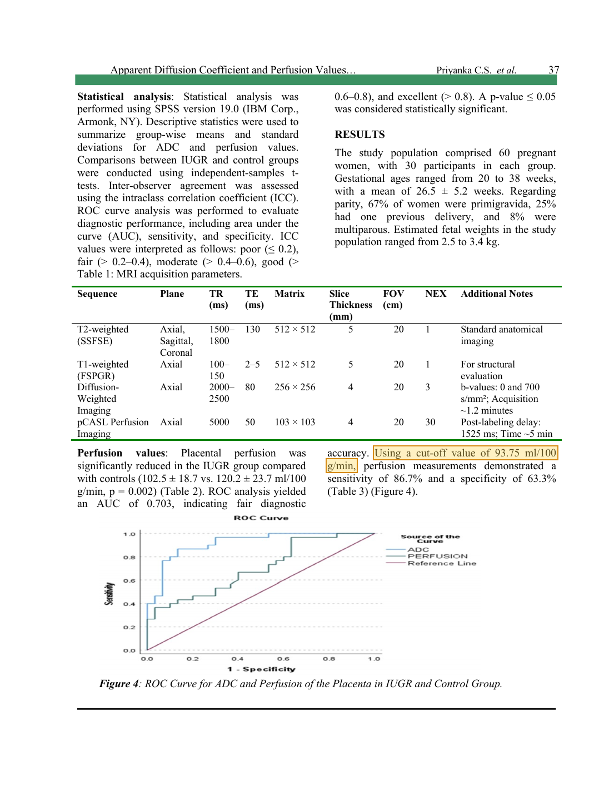

*Chandra Sekhar 2026, p. 5. Highlighted: **"using a cut-off value of 93.75 ml/100 g/min"** — the only
published placental perfusion cut-off in existence. The underlying measurement is placental perfusion
of **102.5 ± 18.7** in IUGR versus **120.2 ± 23.7** in controls (30 vs 30, p = 0.002) — a 14.7%
separation. **Do not adopt the cut-off.** It is (a) a **diagnostic** cut-off separating IUGR from
control, not a data-quality threshold — a completely different job; (b) from n = 60 with **AUC
0.703** and specificity of only **63.3%**, so roughly one healthy placenta in three lands on the
wrong side of it; and (c) measured on **scattered 40–60 mm² elliptical ROIs**, a spatial scale no
other placental study uses, so it is not commensurable with any whole-placenta value in Part 4. Three
independent reasons, each sufficient. This is the worked example of a number to **flag, not adopt.***

## 6.9 How often placental ASL actually fails

Useful for calibrating expected verdict rates rather than assuming near-zero rejection:

| Study | Loss | Cause |
|---|---|---|
| Zun 2017 | 2 / 50 (4.0%) | severe motion artefacts |
| Harteveld 2020 | 1 / 11 (9.1%) | severe fetal motion |
| Liu 2020 | 10 / 84 (**11.9%**) | artefacts from amniotic fluid, subcutaneous fat, or motion — 10 excluded from the **84** who completed both exams (the 69 in the analysis is *after* a further 5 exclusions for gestational diabetes, so 69 is the wrong denominator for an artefact rate) |
| Liu 2020 (hPBF only) | 9 / 69 (13.0%) | no computable high-perfusion region — labelling failure; here 69 *is* the right denominator, because the gate ran on the analysed cohort |
| Seiter 2024 | 16 / 97 (16.5%) | technical failure **or** artefact at one of two timepoints |

One honest caveat on the last row: Seiter's exclusions were *"caused by incomplete data transfers of
the raw MRI data **or** image artifacts (e.g. from motion)"* — data-transfer failure is an IT problem
no image-quality tool can catch, and the paper gives no breakdown. Treat 16.5% as an upper bound.

**Roughly one placental ASL scan in ten is lost to quality problems.** That is the volume a QC tool
addresses, and it is a real number, not a hypothetical.

---

# PART 7 — What is not known

This section is as valuable as the rest. Every gap below was searched for and not found; where the
absence rests on a specific search, that is stated.

## 7.1 There is no placental ASL consensus document

Not a weak one — none. The strongest evidence is structural, and it lives in one document:

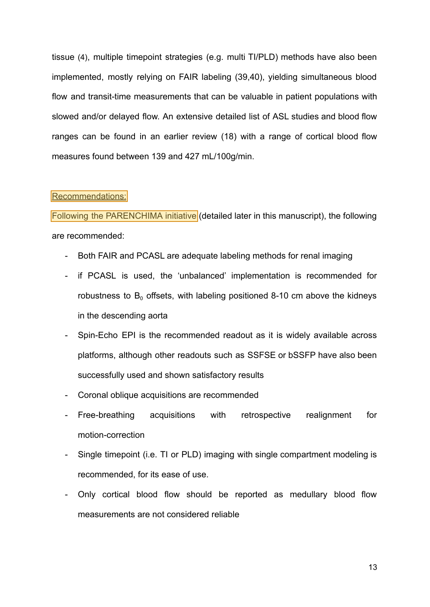

*Taso 2023, p. 13 — the **kidney** section. Highlighted: **"Recommendations: Following the PARENCHIMA
initiative"**, which opens a block of seven concrete acquisition recommendations derived from the
renal ASL consensus. This is the comparator.*

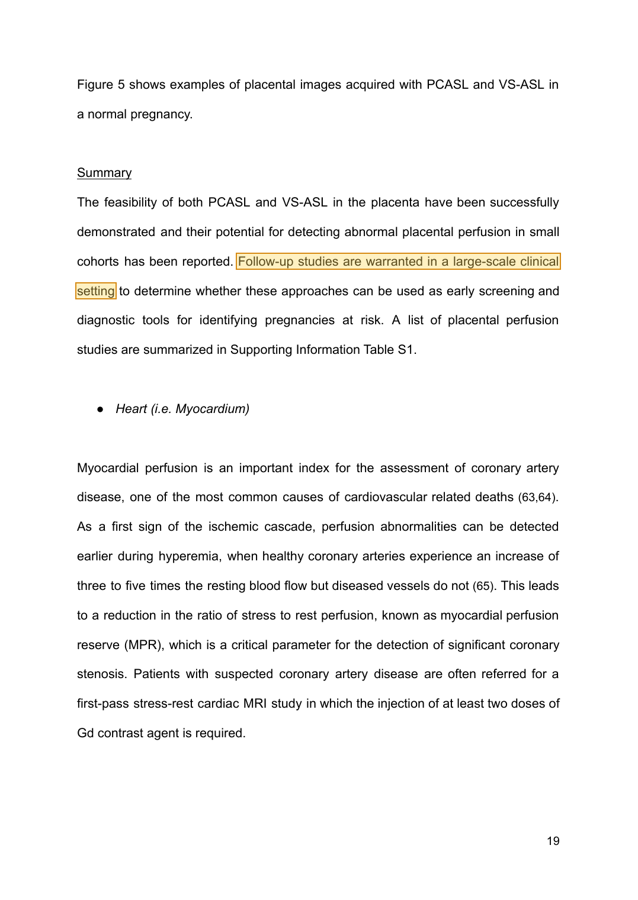

*Taso 2023, p. 19 — the **placenta** section, in the same review by the same authors. Highlighted:
**"Follow-up studies are warranted in a large-scale clinical setting"** — the closing sentence of a
subsection headed **Summary**, not Recommendations. No acquisition parameters, no bullets, no
recommended values. Across the eight organs in this review, only **kidney** and **eye/retina** receive
a Recommendations block.*

> 📌 **Say the negative precisely: the review is not silent about placenta, it is silent about what to
> do.** Its **Supporting Information Table S2** *is* a placental ASL summary table — ten studies with
> labelling scheme, readout, field strength, blood-flow mean (SD), a *"Blood supply"* column marking
> every FAIR and VS-ASL study *maternal and fetal* and every pCASL study *maternal*, a gestational-age
> column, and a complications column. That table is where the compartment mapping in Part 2 is
> independently corroborated, and it is genuinely useful. What the review never does is **endorse** a
> value, **recommend** a parameter, or **summarise** practice for this organ. The finding is not
> "no numbers"; it is "numbers tabulated, nothing prescribed."
> ⚠️ **And there is a pointer bug in the review itself.** The placenta section's closing line sends
> readers to *"Supporting Information Table S1"*, but the supplement's own headings read
> **S1 = Lung**, **S2 = Placenta**, S3 = Cardiac, S4 = Liver, S5 = Retinal. The body-text references
> are consistently off by one. Follow the supplement's headings, not the in-text pointer — a reader
> who follows the pointer lands on lungs and concludes there is no placental table.

And the review demonstrably knows how to say "not yet":

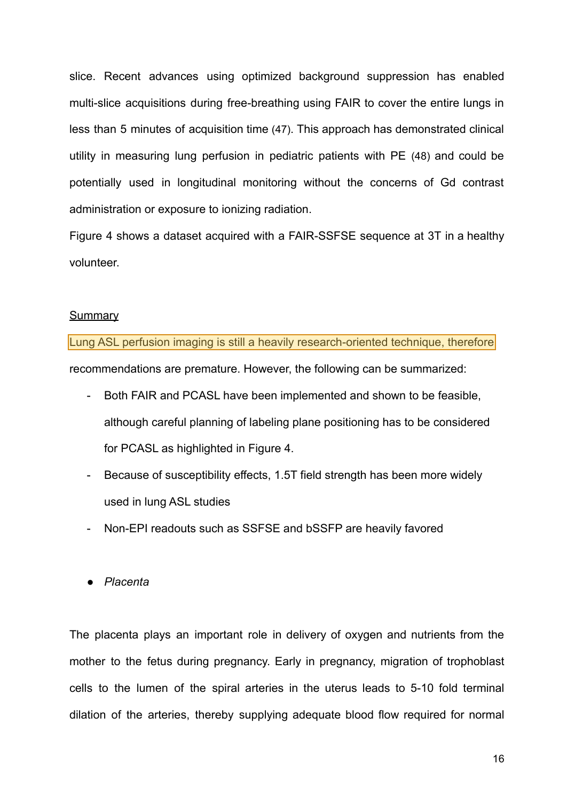

*Taso 2023, p. 16 — the **lung** section. Highlighted: **"Lung ASL perfusion imaging is still a
heavily research-oriented technique, therefore"** — the sentence continues *"recommendations are
premature. However, the following can be summarized:"* followed by bullets. So the authors have an
explicit formula for premature recommendations, **and they still gave lung a bullet list.** The
placenta section is the only organ summary in the review that is pure prose with neither.*

The nearest thing to a placental recommendation elsewhere is also a deferral:

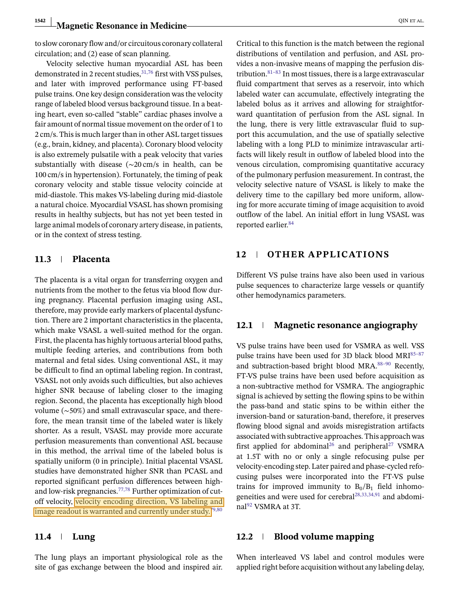

*Qin 2022, p. 15 — the placenta subsection of the ISMRM Perfusion Study Group's VSASL recommendations
paper. Highlighted: **"velocity encoding direction, VS labeling and image readout is warranted and
currently under study"** — the sentence begins *"Further optimization of cutoff velocity, …"*. This
paper **does** issue a recommended-parameter table, but that table is explicitly for **brain CBF at
3 T**. Placental VSASL parameters are left open by the study group that would set them.*

Independently confirmed:

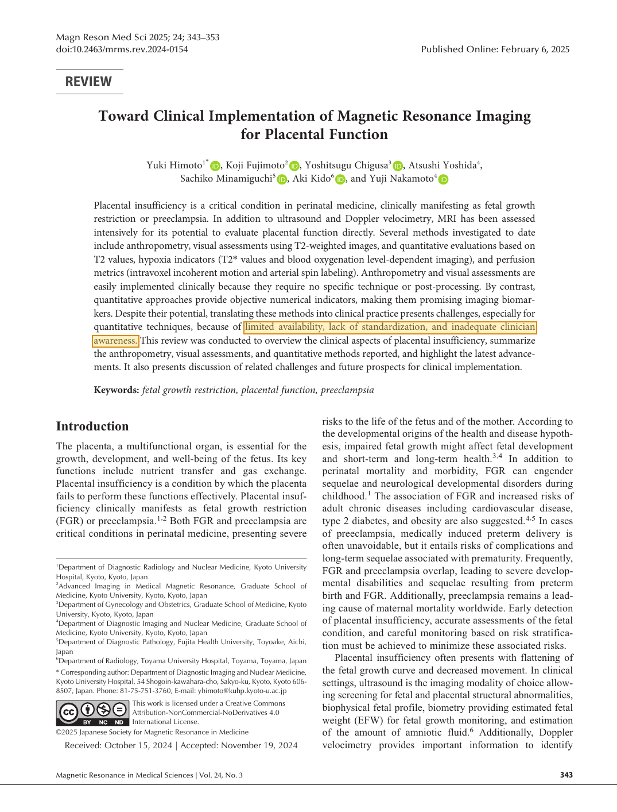

*Himoto 2025, p. 1. Highlighted: **"limited availability, lack of standardization, and inadequate
clinician awareness"** — a 2025 review, independent of the ISMRM groups, naming lack of
standardisation as a primary barrier to clinical translation of quantitative placental MRI.*

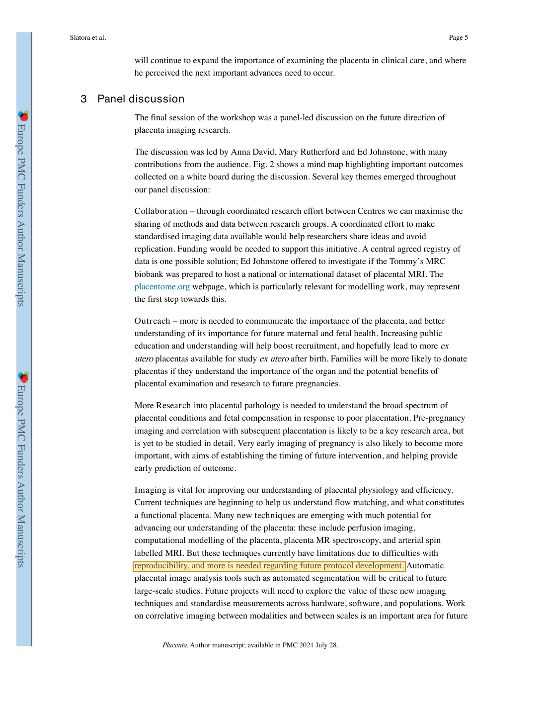

*Slator 2019, p. 5 — the report of the 2018 Placenta Imaging Workshop. Highlighted:
**"reproducibility, and more is needed regarding future protocol development"** — the placental
imaging community's own assessment that reproducibility and protocol standardisation are unsolved.*

> 📌 **State the negative precisely.** What is absent is a **technical consensus on placental perfusion
> acquisition, quantification or quality**. Placental MRI consensus documents *do* exist — the
> SAR–ESUR joint statement on **placenta accreta spectrum** (Jha et al., *Eur Radiol* 2020) is a
> genuine RAND-UCLA consensus with an 80% agreement threshold — but it standardises seven
> **morphological T2-weighted** features for diagnosing invasive placentation and contains no
> perfusion, no ASL and no quality content. Likewise, professional-society guidance on **performing**
> fetal MRI exists (ISUOG practice guidelines, ESPR reporting recommendations); it covers indications,
> field strength, SAR and personnel, not quantitative image-quality metrics. The accurate statement
> is: **no document anywhere defines placental perfusion acquisition parameters or quality thresholds.**

## 7.2 There are no gestational-age-referenced normal perfusion values

Established in §4.1 and §4.5. Normative GA-referenced placental references exist for **volume**
(Jacobwitz 2026) and for **T2\*** (Schabel 2022, Hall 2024). For **perfusion** there is nothing —
just a scatter of cohort means from a dozen studies whose windows barely overlap and whose trends
disagree in sign.

## 7.3 The correct ROI is undecided in the literature

Not "under-specified" — **open**, per the Human Placenta Project's own review (§4.1, Herrera p. 5):
cotyledon-specific, maternal-sided, fetal-sided, intervillous-space-based, or composite *"remains to
be determined."* Four incompatible conventions are in active use (§6.6).

## 7.4 There is no repeatability figure that survives real-world conditions

There is exactly one dedicated placental ASL repeatability study, and its design deliberately removes
almost everything you would want measured. **Zun Z & Limperopoulos C**, *Magn Reson Med*
2018;80(3):1036–1047 (**PMC5980687**, Children's National, Washington DC): within-subject CoV
**3.4–3.6%**, repeatability **19.7 mL/100 g/min**, ICC **0.97**, n = 14, GA 27.8 ± 5.3 (21.4–35.4)
wk, 1.5 T VSASL. But the scans were *"repeated back to back within the same scan session **without
repositioning** of the subject"* and *"identical segmentation of the placenta was used."* That
excludes repositioning, maternal position change, day-to-day physiology and segmentation variance.
**It is an instrument noise floor, not a test–retest tolerance.**

The realistic figure is nearly three times worse — and it comes from **a different group and a
different study**, which is the single easiest attribution error to make in this literature, because
the two share an author on other papers and both are 2018–2020 VSASL work:

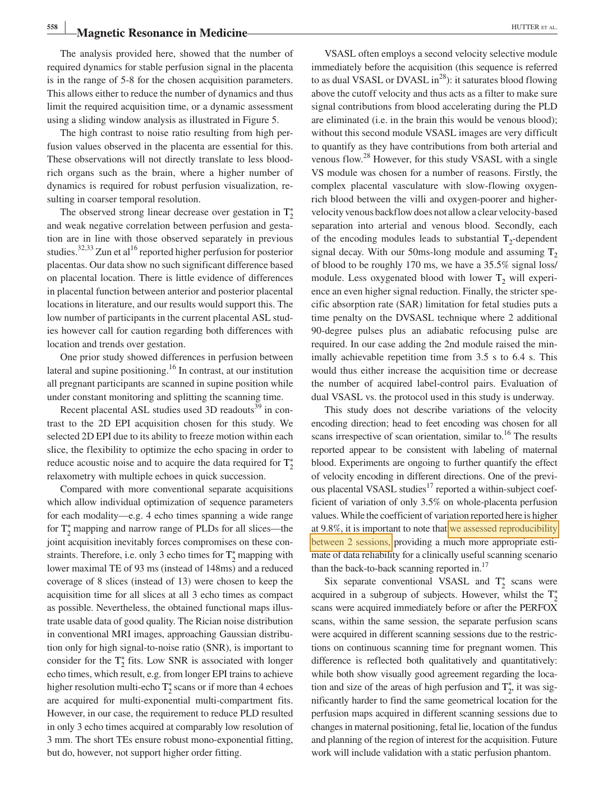

*Hutter J, Harteveld AA, Jackson LH, … De Vita E (PERFOX), *Magn Reson Med* 2020;83(2):549–560,
Centre for the Developing Brain, King's College London — p. 10. Highlighted: **"we assessed
reproducibility between 2 sessions"** — the between-session coefficient of variation was
**9.8 ± 6.3%** for perfusion (against 4.6 ± 1.5% for T2\* in the same data), 3 T. The authors
explicitly treat Zun as an **external** comparator, which is the sentence that settles the
attribution: *"One of the previous placental VSASL studies reported a within-subject coefficient of
variation of only 3.5%. While the coefficient of variation reported here is higher at 9.8%, it is
important to note that we assessed reproducibility between 2 sessions, providing a much more
appropriate estimate of data reliability for a clinically useful scanning scenario than the
back-to-back scanning reported in."* ⚠️ n = **3** repeated participants. This is an
order-of-magnitude indication, not a tolerance — and 3.4–3.6% and 9.8% must never be described as
one group's two figures.*

## 7.5 Absolute quantification is contested by the people doing it

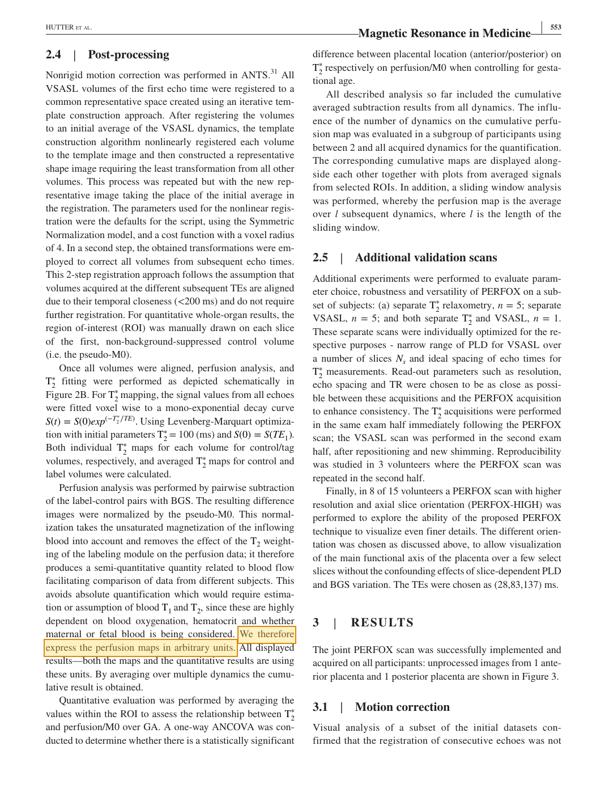

*Hutter 2020 (PERFOX), p. 5. Highlighted: **"We therefore express the perfusion maps in arbitrary
units"** — the preceding sentence explains why: absolute quantification *"would require estimation or
assumption of blood T1 and T2, since these are highly dependent on blood oxygenation, hematocrit and
whether maternal or fetal blood is being considered."* A leading group looked at the placenta's two
circulations and declined to produce a mL/100 g/min number at all. **Any tool that assumes placental
ASL output is in physiological units will silently mis-handle this entire class of data.***

The constants themselves are not agreed:

- **λ (blood–tissue partition coefficient):** Shao uses **1.0 mL/g**, reasoning the placenta is highly
  vascularised; Zun and Liu use **0.9 mL/g**. That is an 11% swing on identical raw data. And 0.9 is
  the **brain** blood–brain partition coefficient, carried over without placental validation.
- **Labelling efficiency:** 0.638 (Shao, laminar-averaged) versus 0.767 (Liu). Neither was measured in
  a pregnant subject.
- **Blood T1:** 1350 ms at 1.5 T, 1650–1660 ms at 3 T. This one is correct field-dependence rather
  than disagreement — but it means the field strength must be read from metadata before any number is
  computed.
- **Placental tissue T1** is both field- and gestation-dependent:

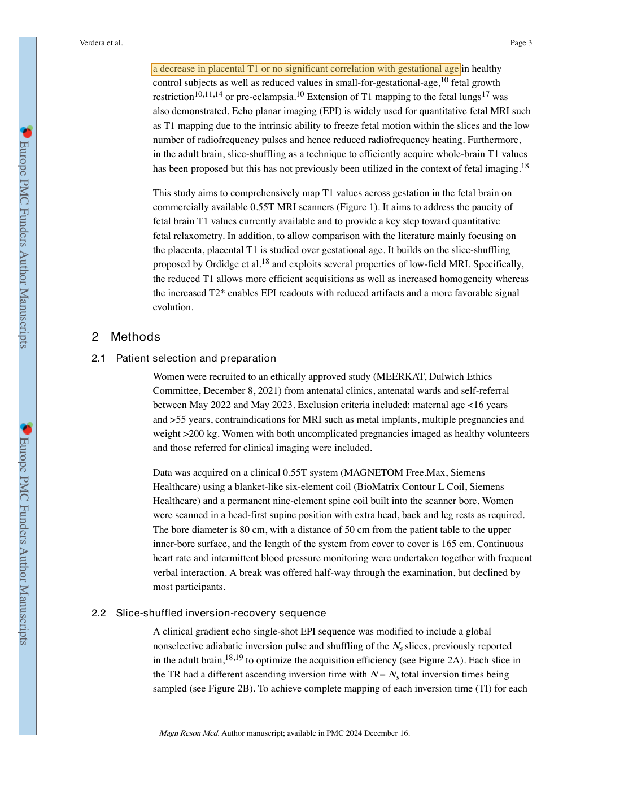

*Aviles Verdera 2024, p. 3. Highlighted: **"a decrease in placental T1 or no significant correlation
with gestational age"** — the literature disagrees even on whether placental T1 falls with gestation.
Measured values differ substantially by field strength (~1825 ms at 3 T; ~1150–1320 ms at 0.55 T over
20–40 weeks). **No single constant can be hard-coded.***

> 🚩 **A flagged defect in OSIPI's own table.** The living OSIPI ASL Lexicon lists placental
> T1tissue as **1684 ms at 1.5 T**, citing Wright et al. Tracing that to source: Wright
> et al. 2011 (*Placenta* 32:1010–15, free at PMC3588143) reports *"a fall in T1 across gestation of
> 20.2 ms/week (95% CI −35.1 to −5.2, **intercept = 1684 ms**, r² = 0.22, p = 0.01)"* from n = 29 at
> GA 21.9–41.7 wk. **1684 ms is the GA = 0 intercept of a weak regression, not a measured T1.** The
> implied real values are ~1280 ms at 20 weeks and ~880 ms at 40 weeks. The published constant is
> **32–92%** too high across the range anyone actually scans. This is a concrete, checkable correction to
> take to TF4.1 — verify it independently before reporting it.

## 7.6 There is no placental analogue of the QEI, and no placental quality index of any kind

No published placental ASL quality metric produces a score, a verdict, or a threshold. What exists is
listed in Part 6: one outlier-rejection rule, one temporal-SD reference value, one motion-rejection
rule from a different modality, and one contamination bound from T2\*.

The tooling gap is equally clean:

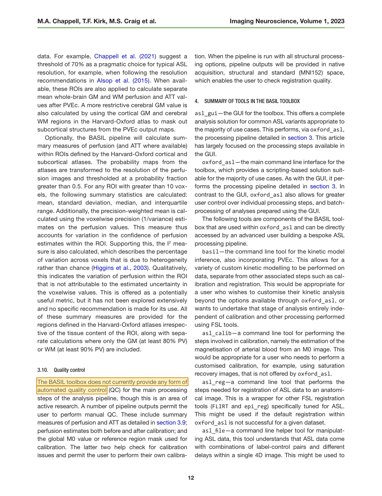

*Chappell 2023, p. 12. Highlighted: **"the BASIL toolbox does not currently provide any form of
automated quality control"** — from the FSL ASL quantification toolbox's own paper. It adds that
*"this is an area of active research"* and that some outputs permit **manual** QC. The niche is real
and it is acknowledged by the field's most-used tool.*

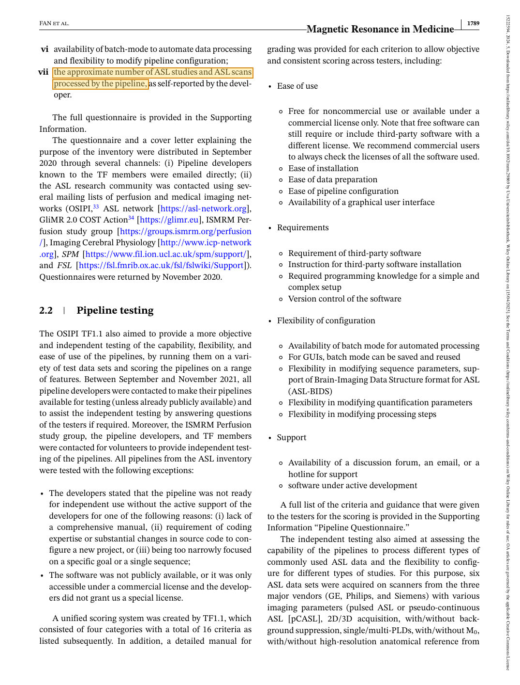

*Fan 2023, p. 4 — the OSIPI ASL pipeline inventory. Highlighted: **"the approximate number of ASL
studies and ASL scans processed by the pipeline"** — the inventory records per-pipeline usage
including a **human non-brain scans** column. ASLPrep, ExploreASL, ASLtbx, ASL-MRICloud and
Quantiphyse all report **zero**. The paper states plainly that *"the inventory contains pipelines for
human brain data only, as nobody registered ASL pipelines that would be primarily non-brain."* The
inventory's organ column lists kidney and prostate. **Placenta appears zero times.***

## 7.7 The standards do not cover the organ, or the labelling scheme

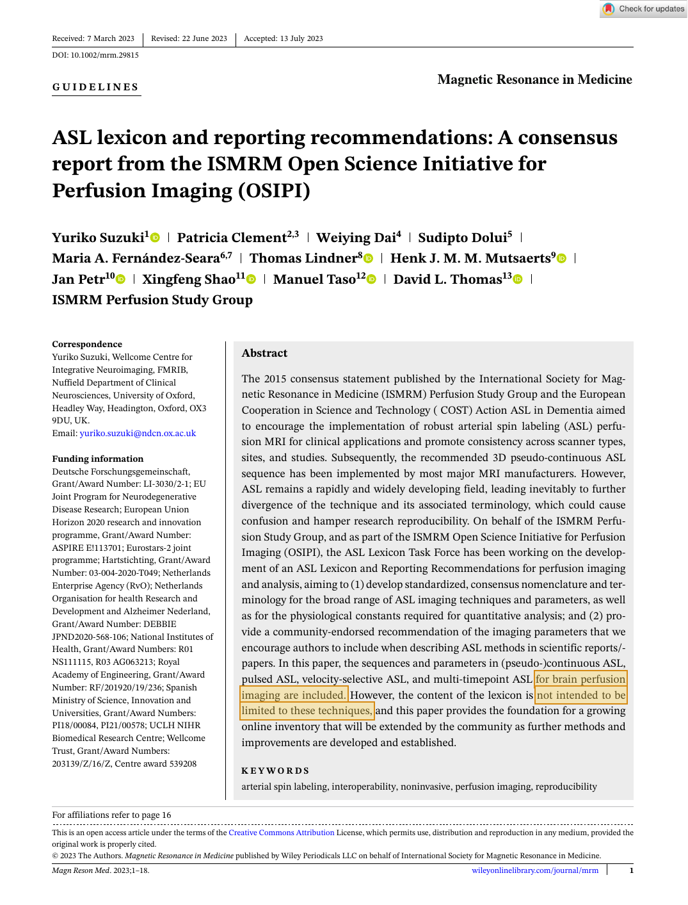

*Suzuki 2024 (OSIPI ASL Lexicon consensus report), p. 1 — two highlights. **"for brain perfusion
imaging are included"** scopes the peer-reviewed lexicon to the brain. **"not intended to be limited
to these techniques"** is the explicit invitation to extend it. The peer-reviewed lexicon contains
zero mentions of placenta or pregnancy; the **living** Google Doc version has a *"Section 7: Outside
of Brain"* carrying the PBF definition and the λ/T1 row discussed in §7.5 — that is OSIPI's entire
placental content.*

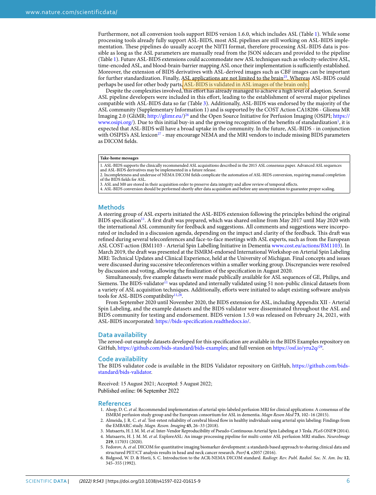

*Clement 2022, p. 6. Highlighted: **"ASL-BIDS is validated in ASL images of the brain only"** — the
standard's own authors, in print, declining to validate it for other body parts.*

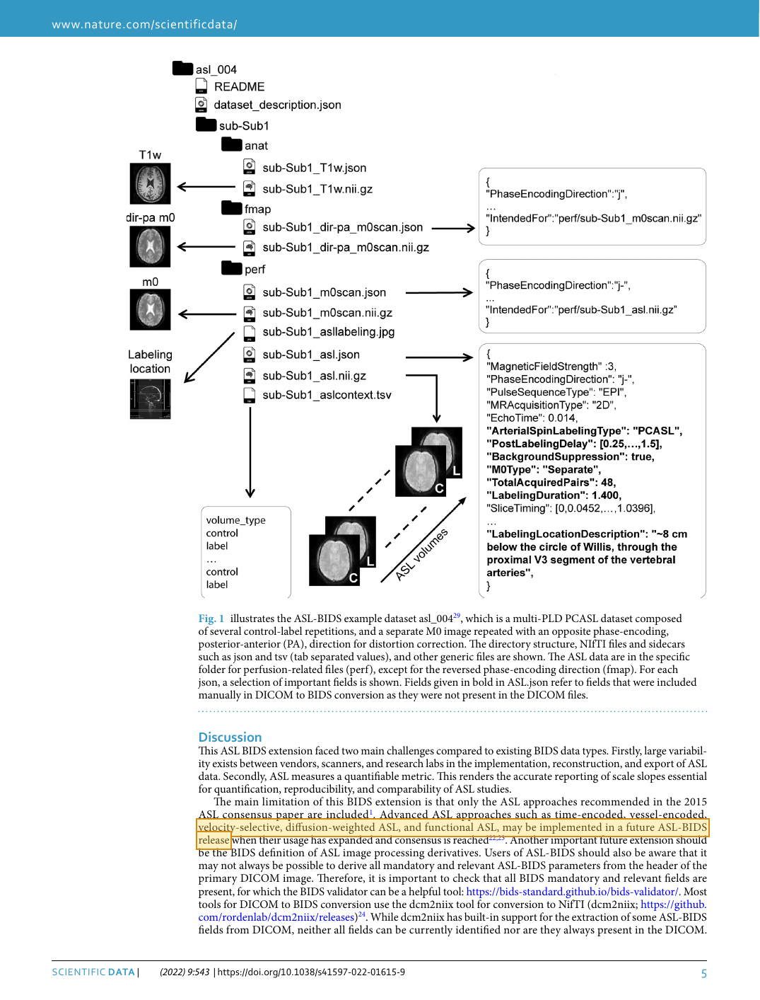

*Clement 2022, p. 5. Highlighted: **"velocity-selective, diffusion-weighted ASL, and functional ASL,
may be implemented in a future ASL-BIDS release"** — VSASL, the placental workhorse, is explicitly out
of scope. Concretely: `ArterialSpinLabelingType` is a **required** field whose enum admits only
`CASL`, `PCASL`, `PASL`, so **a placental VSASL dataset cannot be encoded as valid BIDS at all**.
FAIR, by contrast, **is** representable — as `PASL` with `PASLType: "FAIR"`. And BIDS has no standard
field for maternal position, for breathing strategy, or for gestational age (its `age` column is
explicitly *"Subject postnatal age"*, and the gestational-versus-postnatal reference-point issue has
been open on the BIDS tracker since 2023). There is no fetal or placental BIDS Extension Proposal —
the one attempt at a general medical-imaging extension, BEP025, was dropped.*

## 7.8 There is no placental quality dataset, and there may never be a shareable one

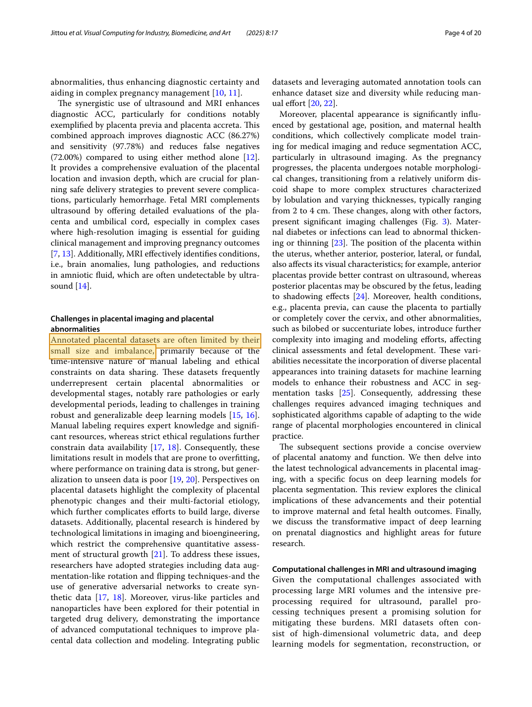

*Jittou 2025, p. 4. Highlighted: **"annotated placental datasets are often limited by their small size
and imbalance"** — the sentence continues *"primarily because of the time-intensive nature of manual
labeling and **ethical constraints on data sharing**."* This is the published justification for an
in-house-only architecture: the constraint the mentors described is documented in the peer-reviewed
literature, not a local quirk.*

## 7.9 What CAN be built — the transferable precedents

Three things already exist that show the shape of the answer.

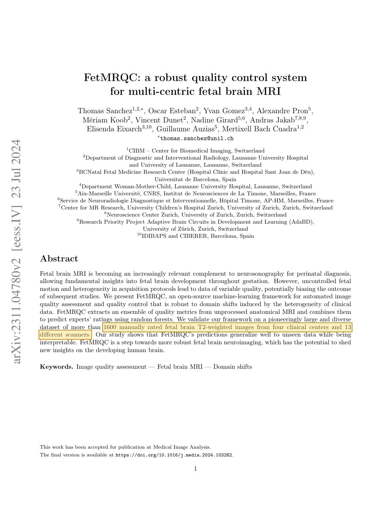

*Sanchez 2024, p. 1. Highlighted: **"1600 manually rated fetal brain T2-weighted images from four
clinical centers and 13 different scanners"** — FetMRQC is the closest architectural precedent to
osipy-qc for in-utero MRI: BIDS-based, Apache-2.0, Docker or pip, runs **entirely locally**, and
publishes its extracted **quality metrics** on Zenodo while stating raw data cannot be shared. That
is exactly the deployment model for placental data that cannot leave the institution. ⚠️ Fetal
**brain T2w**, not placenta — borrow the architecture, not the metrics. Note too that two expert
raters agreed only moderately on the binary include/exclude decision (κ = 0.58), which argues for a
graded score rather than a hard verdict.*

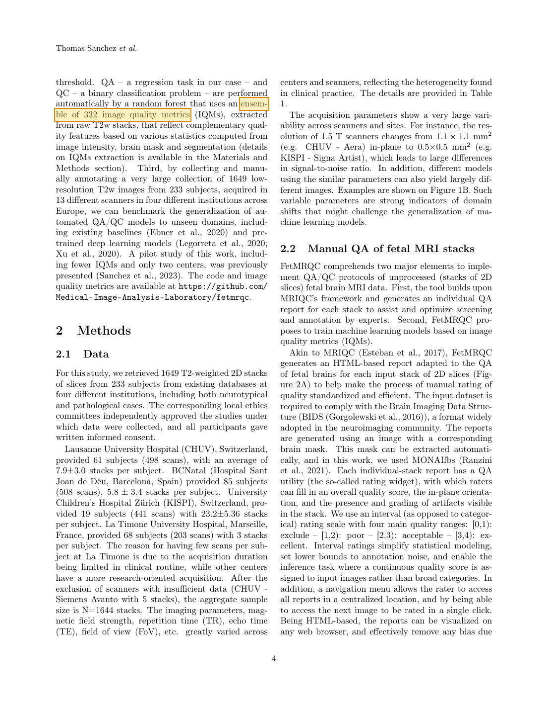

*Sanchez 2024, p. 4. Highlighted: **"ensemble of 332 image quality metrics"** — FetMRQC predicts
expert ratings from a large metric bank via random forests rather than from a fixed threshold rule.
One design detail worth copying directly: each metric carries a **"computation failed" boolean flag**,
so a metric that could not be computed never silently becomes a spurious verdict.*

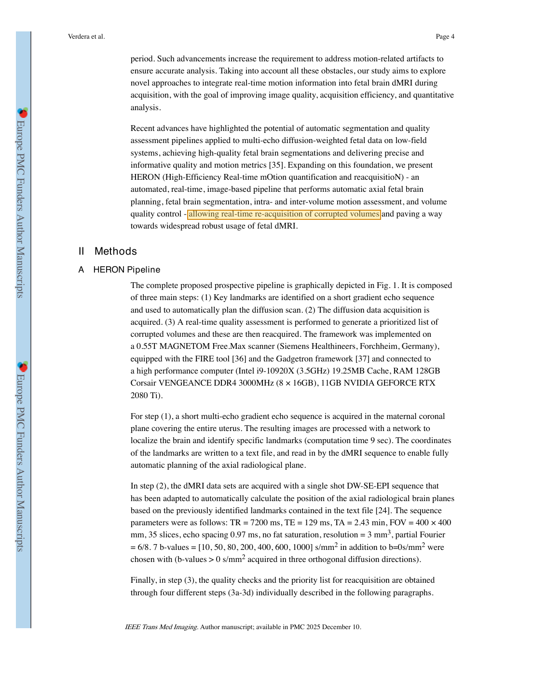

*Aviles Verdera 2025 (HERON), p. 4. Highlighted: **"allowing real-time re-acquisition of corrupted
volumes"** — on-scanner fetal MRI QC that detects motion-corrupted volumes and triggers reacquisition
automatically, with no human in the loop, in roughly 10 seconds. Fetal **brain** diffusion at 0.55 T,
n = 20 — a feasibility demonstration, not a product. But it is the endgame for a tool that must run
where the scan is.*

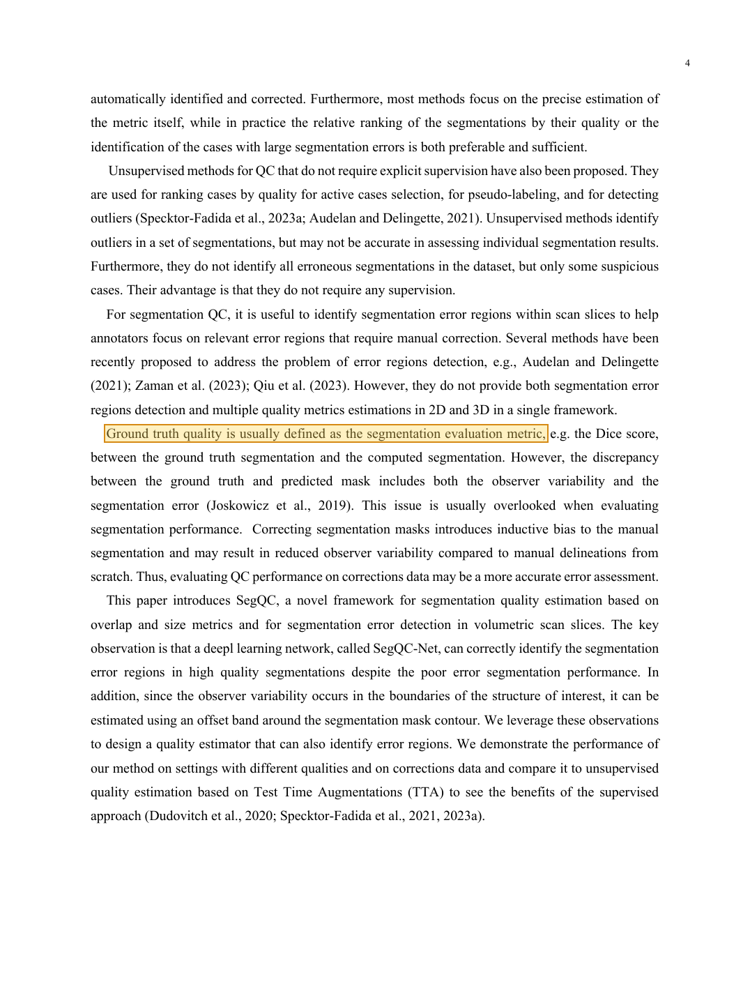

*Specktor-Fadida 2025 (SegQC), p. 4. Highlighted: **"ground truth quality is usually defined as the
segmentation evaluation metric"** — prior art for grading a segmentation **without** ground truth,
demonstrated on fetal MRI **including the placenta**. Relevant because a placental QC tool will
usually be handed a mask it cannot verify.*

And the one tool that already combines artefact detection, motion correction and placenta
segmentation is unusable here for exactly the reason that matters:

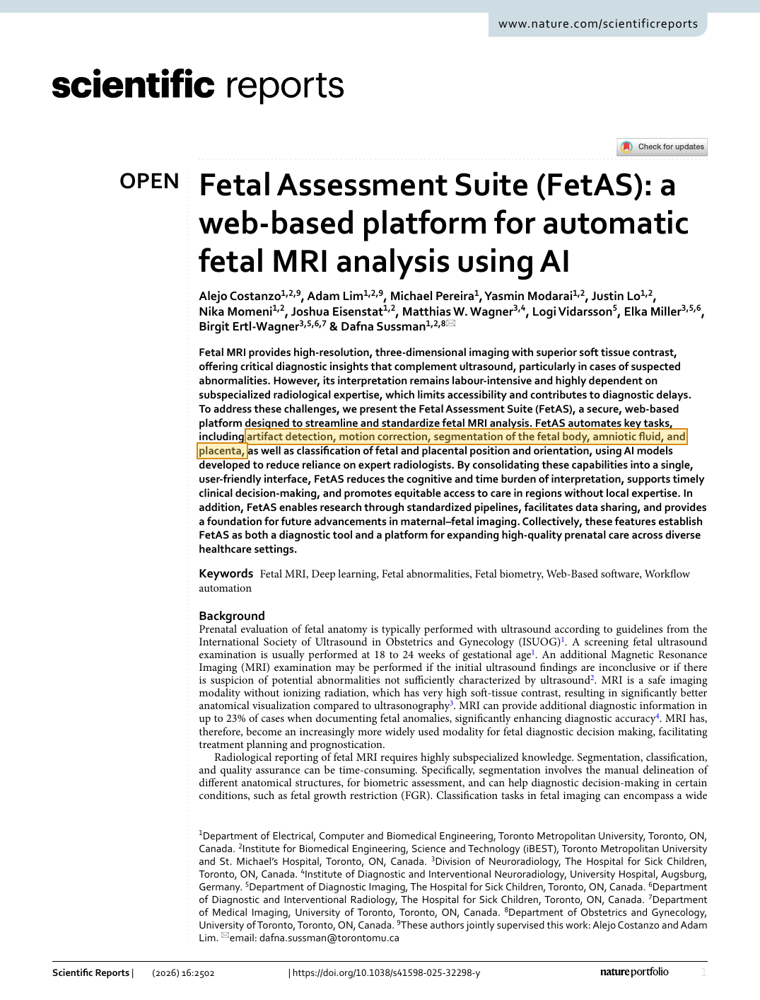

*Costanzo 2025, p. 1. Highlighted: **"artifact detection, motion correction, segmentation of the fetal
body, amniotic fluid, and placenta"** — the FetAS platform does all three. It is a **hosted web
service** with access granted on request and no public code repository, so under the constraint that
placental data cannot leave the institution it cannot be used or built upon.*

Segmentation itself is not the obstacle:

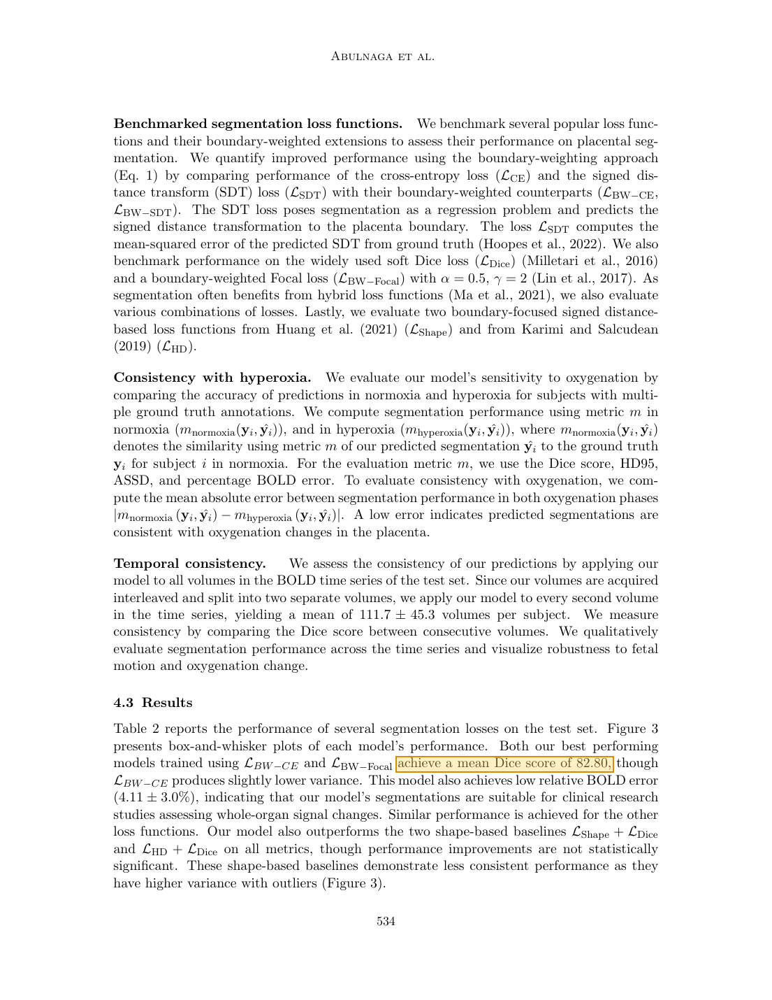

*Abulnaga 2023, p. 8. Highlighted: **"achieve a mean Dice score of 82.80"** — automatic placenta
segmentation on **BOLD EPI time series** at 3 T, the same readout family as placental ASL. GPL-3.0,
public weights, CPU-runnable. ⚠️ Two practical traps: the `.pt` weights are Git-LFS tracked, so a
plain zip download yields a 134-byte pointer rather than a model; and this Dice is on
**BOLD magnitude** volumes, whose contrast resembles an ASL M0 far more than an ASL difference image.*

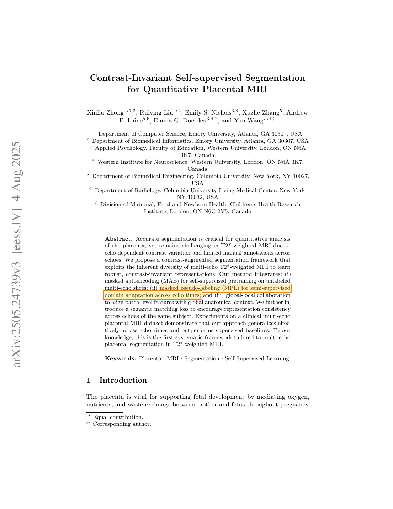

*Zhong 2025, p. 1. Highlighted: **"masked pseudo-labeling (MPL) for semi-supervised domain adaptation
across echo times"** — the paper exists because placental segmentation accuracy **degrades as image
contrast degrades** across echo times. That is precisely the regime an ASL difference image lives in,
and it is why an M0-derived mask is not automatically transferable to a perfusion map.*

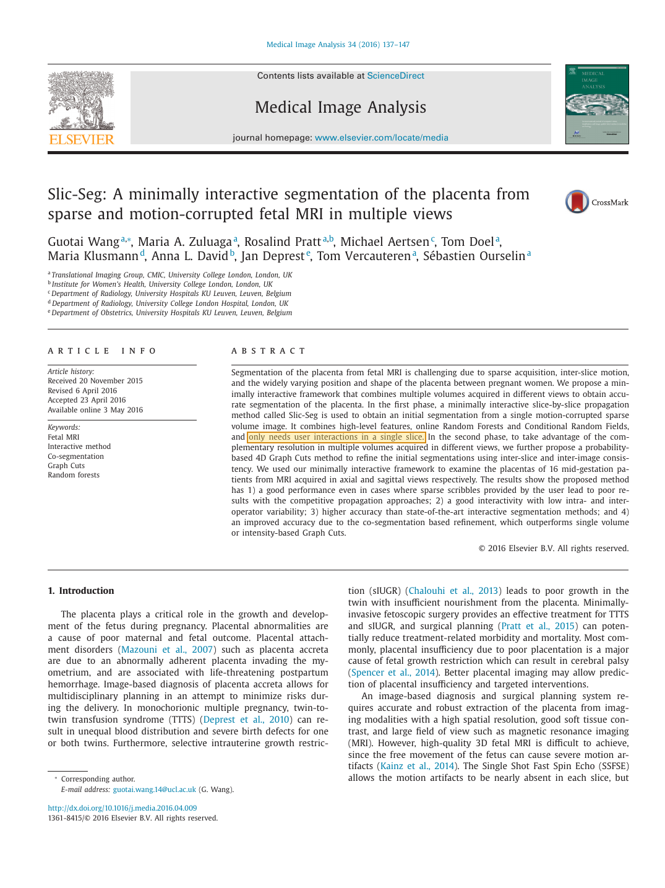

*Wang 2016 (Slic-Seg), p. 1. Highlighted: **"only needs user interactions in a single slice"** —
scribble-based placental segmentation from one slice, with high intra- and inter-user reproducibility
(κ 0.93). For a tool run by someone who cannot send you the scan, a one-slice human-in-the-loop mask
is a legitimate design target rather than a fallback.*

## 7.10 Placental disease *is* detectable — just not by ASL perfusion, yet

Worth stating so the honest gaps do not read as pessimism about the organ:

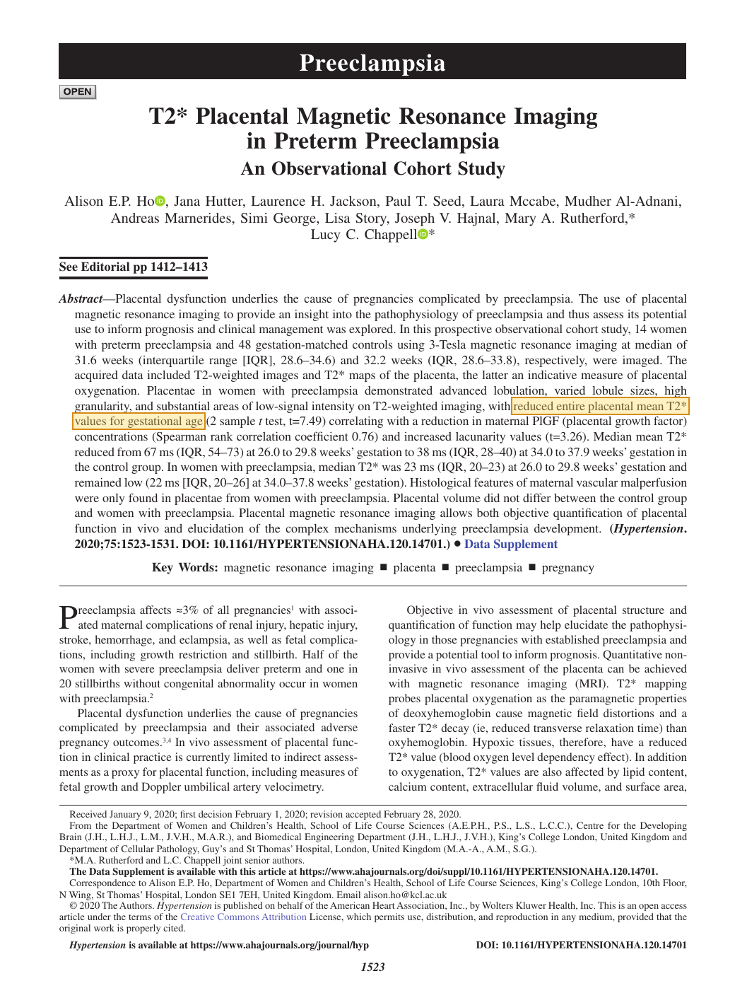

*Ho 2020, p. 1. Highlighted: **"reduced entire placental mean T2\* values for gestational age"** — in
preterm pre-eclampsia, **13 of 14 cases** fell below the 10th centile of normal, with median placental
T2\* of 23 ms against 67 ms in gestation-matched controls at 26–30 weeks. That is a roughly threefold
separation, against ASL perfusion disease effects of 14–35%. Placental dysfunction is cleanly visible
on MRI. It is the **perfusion** measurement specifically that does not yet separate groups reliably.*

Other modalities show the same pattern. IVIM perfusion **fraction** shows a clean gradient
(Sohlberg 2015 — but in **percent**, not mL/100 g/min; never pool the units), and placenta accreta
spectrum turns out **not** to be a low-perfusion state at all (Lu 2022 — IVIM f essentially unchanged;
only diffusion parameters differ), which is a useful reminder that "placental abnormality" and "low
placental perfusion" are not synonyms.

## 7.11 The tagging table

| Placental quantity | Best available tier |
|---|---|
| Harteveld >20%-of-uterus-voxels / ±1.5 SD pair rejection | ⚠️ **`implementation`** — one lab, n = 10, VSASL, 3 T, unvalidated |
| Post-motion-correction normalised temporal SD (6.7 ± 3.1%) | ⚠️ **`implementation`** — descriptive cohort mean, not a bound |
| Dellschaft >5 mm volume / >4 low-b / >8 total rejection | ⚠️ **`implementation`** — DWI, respiratory-gated, visually judged |
| Uus DSVR slice rejection (NCC 0.75, SSIM 0.6) | ⚠️ **`implementation`** — placenta-validated, but SVR-internal |
| Amniotic-fluid bound (T2\* ≥ 250 ms) | ⚠️ **`implementation`** — copyable as a *template*, T2\* not ASL |
| Liu empty-hPBF labelling-failure gate (Otsu ∧ SNR>1) | ⚠️ **`implementation`** — threshold recomputed per scan |
| Harteveld V_cut ~1.6 cm/s, TI ~1000 ms | ⚠️ **`implementation`** — single-centre n = 10 optimisation |
| Zun 2018 **within-session** repeatability (CoV 3.4–3.6%, ICC 0.97) | ⚠️ **`implementation`** — instrument floor only, n = 14, no repositioning, 1.5 T |
| Hutter/PERFOX 2020 **between-session** reproducibility (CoV 9.8 ± 6.3%) | ⚠️ **`implementation`** — **different group, different study**; n = **3** repeated participants, 3 T |
| Any absolute placental PBF band | ❌ **`uncalibrated`** — protocol moves it 9× and ~10× |
| Any GA-referenced normal perfusion curve | ❌ **`uncalibrated`** — does not exist; trends disagree in sign |
| Placental sCoV threshold | ❌ **`uncalibrated`** — 0.58 ± 0.10 healthy, different estimator from brain |
| Motion threshold in mm or FD | ❌ **`uncalibrated`** — no rigid-body model; must be self-referenced |
| λ, labelling efficiency, tissue T1 as fixed constants | ❌ **`uncalibrated`** — disputed, brain-borrowed, GA- and field-dependent |
| Maternal-side vs fetal-side reference values | ❌ **`uncalibrated`** — recipe exists (preprint); no values |
| The 93.75 mL/100 g/min cut-off | ⛔ **do not ship** — diagnostic not quality; n = 60, AUC 0.703, specificity 63.3%; scattered 40–60 mm² ROIs |
| Any placental QEI analogue | ❌ **`uncalibrated`** and novel |

---

# PART 8 — What ports from the existing toolbox

| Brain/kidney module | Ports to placenta? | Why |
|---|---|---|
| 1 — QEI engine | ❌ **No** | No tissue probability maps, no rated placental dataset, no ground truth |
| 2 — Noise & distribution | ⚠️ Partly | Negative-fraction ports onto a placental mask; **sCoV must be re-derived** (§6.7) |
| 3 — CBF level & contrast | ❌ **Reframe entirely** | No defensible absolute band. Implausibility guard only, branched on labelling scheme |
| 4 — Co-registration | ⚠️ Rebuild | Dice/overlap are organ-agnostic, but the transform is **non-rigid**; metrics must be deformation residuals |
| 5 — Schema & data-type | ⚠️ Rebuild | BIDS cannot encode VSASL at all, has no GA field, no maternal position (§7.7) |
| 6 — M0 calibration | ⚠️ **Invert one rule** | Relaxation physics ports — but placental BS is **deliberately incomplete** for registration (§5.5), so "weak BS" is not a defect here |
| 7 — Motion | ⚠️ **Rebuild** | Threefold, non-rigid, contraction-deformed, and in VSASL motion **creates** signal. Flag both tails (Part 5) |
| 8 — Acquisition metadata | ✅ **Yes, and it is the highest-value module** | GA, labelling scheme, V_cut, PLD, field strength, maternal position, ROI definition — all decide whether any number is interpretable |

Two things the evidence forces regardless of design taste:

**Branch on labelling scheme before anything else.** pCASL and VSASL measure different physical
quantities (Part 2), and the numbers differ by an order of magnitude.

**Make every threshold self-referenced.** No fixed number in this document survives a change of
scanner, field strength, cutoff velocity or gestational age. What does survive is the family of
methods in §5.6: compare each voxel to its own distribution across repetitions, each volume to the
scan's own temporal median, each scan to its own cohort. That is the only design that grades the
data rather than the equipment — and it is the only design that works when the images never leave
the building.

---

# 📚 Sources

**The two closest things to authority (neither is a placental consensus)**
- **Taso M, Aramendía-Vidaurreta V, Englund EK, … Zun Z, Fernández-Seara MA; ISMRM Perfusion Study Group.**
  *"Update on state-of-the-art for arterial spin labeling (ASL) human perfusion imaging outside of the brain."*
  ***Magn Reson Med* 2023;89(5):1754–1776.** [`papers/taso2023_body_asl_outside_brain.pdf`](papers/taso2023_body_asl_outside_brain.pdf)
  ⚠️ *UCL Discovery accepted manuscript — section numbers do not appear; the section structure does.*
- **Qin Q, Alsop DC, Bolar DS, … Zun Z, Guo J; ISMRM Perfusion Study Group.** *"Velocity-selective ASL
  perfusion MRI: review and recommendations."* ***Magn Reson Med* 2022;88(4):1528–1547.**
  DOI [10.1002/mrm.29371](https://doi.org/10.1002/mrm.29371)

**Placental ASL primaries**
- Harteveld AA, Hutter J, Franklin SL, et al. *Magn Reson Med* 2020;84(4):1828–1843 — the VSASL settings study; source of most implementable numbers here
- Zun Z, Zaharchuk G, Andescavage NN, Donofrio MT, Limperopoulos C. *Sci Rep* 2017;7:16126 — healthy reference, maternal position, spatial CoV
- **Zun Z, Limperopoulos C.** *Magn Reson Med* 2018;80(3):1036–1047 (**PMC5980687**) — pCASL-vs-VSASL head-to-head and the **within-session** repeatability study. ⚠️ **No PDF obtainable**; text at [`fulltext_no_pdf/`](fulltext_no_pdf/). Do **not** attach PERFOX's between-session 9.8 ± 6.3% to this paper — different group, see §7.4
- Seiter D, Chen R, Ludwig KD, et al. *Placenta* 2024;150:72–79 — GA and BMI
- Link-Sourani D, Avisdris N, Shao X, … Ben Bashat D. *NMR Biomed* 2026;39(8):e70346 — third trimester
- Hutter J, Harteveld AA, Jackson LH, et al. (PERFOX) *Magn Reson Med* 2020;83(2):549–560 — arbitrary units, between-session CoV
- **Shao X, et al.** *JMRI* 2018;47(6):1667–1676 (**PMC5951737**) · **Liu D, et al.** *JMRI* 2020;51(4):1247–1257 (**PMC7654100**) · **Herrera CL, et al.** *Eur Radiol* 2023;33(12):9223–9232 (**PMC10796849**) — 3 T pCASL. ⚠️ **No PDFs**; text at [`fulltext_no_pdf/`](fulltext_no_pdf/). The Herrera entry here is the **primary pCASL study**, not the programme review below — cite these by PMCID
- Chandra Sekhar P, et al. *Ethiop J Health Sci* 2026;36(1) — the 93.75 cut-off, flagged not adopted

**Motion, contractions, and the fetal-MRI QC playbook**
- Martin T, et al. *Diagnostics* 2020;10(10):840 · Dellschaft NS, et al. *PLoS Biol* 2020;18(5):e3000676 · Hutter J, et al. *Sci Rep* 2022;12:18542
- Dewick L, Turnbull A, Walker KF, et al. **arXiv:2511.19547 — PREPRINT**
- Ji L, et al. *Hum Brain Mapp* 2023;44(4) · Kim JH, et al. *Sci Rep* 2025;15:13181 · Karolis VR, et al. *Imaging Neurosci* 2025
- Kuklisova-Murgasova M, et al. *Med Image Anal* 2012 · Ebner M, et al. *NeuroImage* 2020 (NiftyMIC) · Uus A, et al. *IEEE TMI* 2020;39(9):2750–2759 · Snoussi H, et al. 2025 (HAITCH)
- Sanchez T, et al. *Med Image Anal* 2024 (FetMRQC) · Aviles Verdera J, et al. *IEEE TMI* 2025 (HERON) · Specktor-Fadida B, et al. *Med Image Anal* 2025 (SegQC) · Costanzo A, et al. *Sci Rep* 2025 (FetAS)

**Normative frameworks, T2\*, and segmentation**
- Schabel MC, et al. *PLoS One* 2022;17(7):e0270360 · Hall M, et al. *Sci Rep* 2024;14:28594 · Jacobwitz M, et al. *Pediatr Radiol* 2025;56:384–392
- Sørensen A, Hutter J, Seed M, Grant PE, Gowland P. *Ultrasound Obstet Gynecol* 2020;55:293–302 · Turnbull A, et al. **arXiv:2603.22092 — PREPRINT**
- Ho AEP, et al. *Hypertension* 2020 · Deloison B, et al. *PLoS One* 2021;16(9):e0256769 · Sohlberg S, et al. *Ultrasound Obstet Gynecol* 2015;46:700–705 · Lu T, et al. *BMC Pregnancy Childbirth* 2022;22:349
- Abulnaga SM, et al. *MELBA* 2023 · Liu Y, et al. PIPPI@MICCAI 2023 · Wang G, et al. *Med Image Anal* 2016 · Zhong X, et al. PIPPI@MICCAI 2025 · Jittou A, et al. *Vis Comput Ind Biomed Art* 2025;8:17

**Safety, field strength, standards and programme context**
- Aviles Verdera J, et al. *Radiology* 2023 · Yetisir F, et al. *JMRI* 2025 · Zhu Z, et al. *JMRI* 2025;61(6):2505–2515 · Puris G, et al. *Diagnostics* 2025;15(2):208 · MHRA, *Safety guidelines for MRI equipment in clinical use*, 2014
- **Ray JG, Vermeulen MJ, Bharatha A, Montanera WJ, Park AL.** *"Association between MRI exposure during pregnancy and fetal and childhood outcomes."* ***JAMA* 2016;316(9):952–961** — the gadolinium evidence. ⚠️ **Abstract only**
- Suzuki Y, Clement P, Dai W, **Dolui S**, et al. *Magn Reson Med* 2024;91(5) — OSIPI ASL Lexicon · Clement P, et al. *Sci Data* 2022;9:543 — ASL-BIDS · Chappell MA, et al. *Imaging Neurosci* 2023 — BASIL · Fan H, … **Dolui S**, Petr J. *Magn Reson Med* 2023 — OSIPI pipeline inventory
- Herrera CL, Kim MJ, Do QN, et al. *Placenta* 2023, doi 10.1016/j.placenta.2023.08.067 (**PMC11257151**) — Human Placenta Project **programme review**, a different paper from the *Eur Radiol* primary above · Himoto Y, et al. *Magn Reson Med Sci* 2025;24(3):343–353 · Slator PJ, et al. *Placenta* 2019 — 2018 workshop report
- Chernyavsky IL, Jensen OE, Leach L. *Placenta* 2010 — placentone model · Seiter DP, et al. *Biol Reprod* 2022 — macaque cotyledon validation

**Not obtained, and it matters most**
**Jungelson A, Bartin R, Arthuis C, Henry C, Taso M, Alsop DC, Bussières L, Ville Y, Salomon LJ, Grévent D.**
*"Evaluation of the reproducibility and factors affecting perfusion measurement in normal pregnancies
with single-slice FAIR arterial spin labeling."* ***Placenta* 2026;179:121–127** — Elsevier paywall,
abstract only. **Nothing from this paper is verifiable from this corpus**: "jungelson", "323.5" and
"175.6" return zero hits across all 58 PDFs and 14 text-only papers. It supplies the FAIR
slab-thickness sensitivity in §3.4 and the null maternal-position result in §4.4, and **both are
marked unverified wherever they appear**. Note the title's own scope: *single-slice*. It should be
read in full before being quoted. Also unobtained: **Mora Álvarez MG, Madhuranthakam AJ, Udayakumar D.**
*MAGMA* 2024;37(4):681–695 — a body-ASL review **first-authored by one of the project's mentors**;
ask her directly. Full lists of the 9 unobtainable and 14 text-only papers, with DOIs, are in
[`papers/README.md`](papers/README.md).

---

*Every screenshot above lives in [`screenshots/`](screenshots/) at 130 dpi, and every caption names*
*what is highlighted on that page. Highlights were resolved by searching every page of the named PDF*
*rather than by asserting a page number — see [`build_evidence.py`](build_evidence.py). All 84*
*phrases were found. Every PDF lives in [`papers/`](papers/).*
