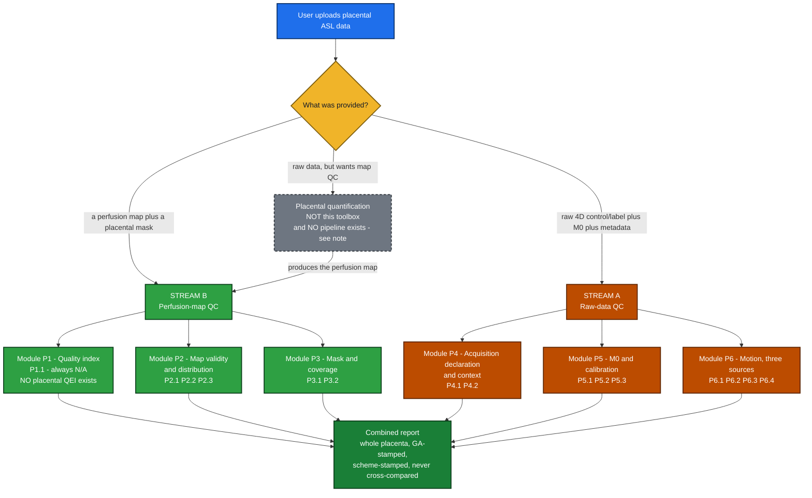

<div align="center">

# Placenta QC ToolBox — Placental ASL QC Design

### Automatic PASS / WARN / FAIL triage for **placental** ASL MRI
**Two streams · 6 modules · 15 checks · per-check inputs, outputs, method, verdict, sources & provenance tier**

</div>

---

## 🔭 Overview

This is the placental counterpart to `QC_DESIGN.md` (brain) and `KIDNEY_QC_DESIGN.md`. It keeps the
same shape — two streams, a module per topic, one spec card per check — so all three toolboxes share
a registry, a result type and a report format.

**The headline is a negative, and it is worse than kidney's.** Kidney had no image-quality thresholds
but it did have an authoritative acquisition standard: Nery 2020, 59 Delphi consensus statements with
agreement percentages. **Placenta has no consensus document of any kind.** Not for acquisition, not
for analysis, not for quality. I verified this by extracting the ISMRM Perfusion Study Group's own
body-ASL review (`taso2023_body_asl_outside_brain.pdf`) and enumerating every organ section heading:

| organ | section structure | issues parameters? |
|---|---|---|
| **Kidneys** | Challenges → Developments → **`Recommendations:`** | ✅ yes, 7 bullets, derived from PARENCHIMA/Nery |
| **Eye (retina)** | Challenges → **`Recommendations`** | ✅ yes |
| Lungs | Challenges → Developments → `Summary` | ⚠️ *"recommendations are premature. However, the following can be summarized:"* + 3 bullets of practice |
| Heart, Liver, Pancreas, Muscle | Challenges → Developments → `Summary` | ⚠️ summarised practice, bulleted |
| **Placenta** | Challenges → Developments → `Summary` | ❌ **prose only, no bullets, no parameters, no practice summary** |

Of eight organs, only two receive recommendations. **The placenta is the only one that receives
neither recommendations nor even a bulleted summary of practice.** Its entire Summary is four
sentences ending *"Follow-up studies are warranted in a large-scale clinical setting to determine
whether these approaches can be used as early screening and diagnostic tools"* — a statement that the
evidence base is not yet clinically established. The lung section shows what a deliberate deferral
looks like when a study group still wants to summarise practice; the placenta section does not even
do that.

**State the negative precisely, because the review is not silent about placenta — it is silent about
what to do.** Its **Supporting Information Table S2** *is* a placental ASL summary table: ten studies
with labelling scheme, readout and field, blood-flow means and SDs, a *"Blood supply"* column and a
gestational-age column. So the review **tabulates** what has been measured; what it never does is
endorse a value, recommend a parameter, or summarise practice. That is the finding — not an absence
of numbers, but an absence of any statement about which numbers or settings are right. (The body text
points readers to *"Table S1"* for this; the supplement's own heading says S1 is Lung and S2 is
Placenta. See P4.1.)

Everything downstream is consistent with it. The ISMRM VSASL recommendations paper scopes its
parameter table to *"VSASL at 3T for CBF quantification"* — cerebral — and closes its placenta
subsection with *"Further optimization of cutoff velocity, velocity encoding direction, VS labeling
and image readout is warranted and currently under study."* OSIPI's own peer-reviewed ASL Lexicon
(Dolui co-author) states its scope is *"…for brain perfusion imaging are included."* ASL-BIDS states
*"ASL-BIDS is validated in ASL images of the brain only."* BASIL states *"[the toolbox] does not
currently provide any form of automated quality control (QC) for the main processing steps of the
analysis pipeline."* And the NIH Human Placenta Project's own review states that gestational-age
adjusted normal ranges *"remain to be established"* and that whether the measurement should be
*"cotyledon-specific, maternal-sided, fetal-sided, based out of the intervillous space, or a composite
of these areas also remains to be determined."*

**Consequence, stated at the top rather than buried: not one threshold in this document is
`PUBLISHED` in the sense of "a paper states this number, for this purpose, in placenta."** Every
numeric bound here is `IMPLEMENTATION` (one study's method), `DEFINITION` (physics/maths), or
`SELF-REFERENCED` (derived from the scan in front of us). There are no `PUBLISHED` rows. The design
is built around that fact instead of hiding it.

### The design principle that follows

Placental perfusion magnitude cannot be graded, because the protocol moves it far more than the
biology does. **Every row carries the context that makes it a number rather than a rumour** —
gestational age, ROI and field strength — because the document's own verdict rule 2 (below) requires
it, and because two of these rows are not the same quantity as the other four.

| what changed | effect on the reported number | GA · ROI · field · n | source |
|---|---|---|---|
| **labelling scheme** pCASL vs VSASL — *same women, same session* | pCASL recovers **only 16% and 9%** of the VSASL value | GA 25.4 ± 4.7 wk (21.9–35.4) · whole placenta, manual per-slice · 1.5 T · n = 7 | Zun & Limperopoulos 2018, *Magn Reson Med* (PMC5980687) |
| **VSASL cut-off velocity** 0.9 → 10.2 cm/s — *same women* | **9-fold** change in perfusion-weighted signal | GA 28.3–29.6 wk · whole placenta · 3 T · n = 3 | Harteveld 2020, *Magn Reson Med* (PMC7384055) |
| **post-labelling delay** 400 → 2200 ms — *same women* | 329 ± 96% → 47 ± 11% of the 1600 ms reference (**7×**) | GA 24.3–30.9 wk · whole placenta · 3 T · n = 4 | Harteveld 2020 (PMC7384055) |
| **ROI** whole placenta vs high-flow sub-region — *same scans* | 104.9 → 278.1 mL/100 g/min (**2.65×**) | GA normalised to 16 wk · whole placenta vs Otsu ∧ SNR>1 sub-region · 3 T pCASL · n = 54 / 45 | Liu 2020, *JMRI* (PMC7654100) |
| **FAIR inversion-slab thickness** 30 → 70 mm — *same women* ⚠️ | 323.5 → 175.6 mL/100 g/min (**1.84×**) | **GA not stated in the abstract** · **single 10 mm axial slice, not a whole-placenta volume** · 1.5 T · n = 66 | Jungelson 2026, *Placenta* — ⚠️ **abstract only, not verifiable in this corpus** |
| **maternal BMI** ≥ 30 vs < 30 — ⚠️ **between-subject, different women** | 257 → 336 mL/100 g/min (**+31%**) | GA 21 wk · whole placenta, 8-slice manual mask · 1.5 T VSASL · n = 46 vs 14 · statistic is the **median within the mask, averaged across participants** | Seiter 2024, *Placenta* |

Two caveats that the table must carry rather than bury. **The Jungelson row is the one row in this
document sourced from an abstract**: the paper is paywalled, no PDF or full text is in `papers/`, and
the figures 323.5 / 175.6 could not be re-checked against a primary source. Its ROI is a *single
10 mm axial slice*, so it is not the same measured quantity as the whole-placenta rows above it, and
the paper's own conclusion is that 70 mm is the reproducible setting — 323.5 is its rejected setting,
not a competing legitimate value. **The BMI row is between-subject**: two groups of different women
at the same gestational age, so it shows that the number moves with a maternal covariate, not that a
protocol change moved it within a person.

Against that, the **disease** effect measured like-for-like on the same quantity: whole-placenta
perfusion in normal vs ischaemic placental disease, normalised to 16 weeks, was **104.9 ± 31.4 vs
97.2 ± 25.3 mL/100 g/min, P = 0.53** — not significant (Liu 2020, 3 T pCASL, whole placenta,
n = 54 normal vs 15 IPD, verified in the paper's Table 3). Only the thresholded high-flow sub-ROI
separated the groups. The same pattern repeats: Link-Sourani 2026 found perfusion did not separate
growth-restricted from appropriately-grown placentas — **149.2 ± 16.6 vs 148.1 ± 18.6 mL/100 g/min,
p = 0.82**, GA 33 ± 1.4 wk (recruitment window 30–37 wk), whole placenta manually segmented on the
ASL data, 3 T multi-delay pCASL, n = 46 AGA vs 11 FGR — only total flow (perfusion × volume) did. And
the direction of the disease effect is not even consistent: fetal congenital heart disease is
associated with *higher* placental perfusion, growth restriction with *lower*.

> **So: every check in this design is either SELF-REFERENTIAL — computed from the scan in front of it,
> with its boundary derived from that scan's own distribution — or a DECLARATION check, which asks
> whether the metadata says what it must say for the number to mean anything. No check in this
> document compares a placental perfusion value to an external band.**

That is not a workaround. It is the design the fetal-MRI literature already converged on
independently: the foundational fetal slice-rejection method estimates its own inlier distribution by
EM rather than thresholding; the dHCP fetal release defines its exclusion rule using Tukey fences
computed *within the cohort being analysed*; and the one placental ASL rejection rule that exists
compares each subtraction image to *the mean over that scan's own repetitions*. A self-referenced
boundary cannot penalise a site for older hardware, because it is re-derived per scan.

**What the verdict therefore means.** A PASS from this toolbox says: *this scan's numbers are
internally consistent and interpretable, and are safe to compare against other scans acquired with
the same labelling scheme, at the same field strength, at a comparable gestational age.* It does not
say the perfusion value is correct, and it does not say the placenta is healthy. Stating that plainly
in the report is part of the design.



> ⚠️ **The gray dashed box is empty for placenta.** For brain it means ASLPrep / ExploreASL / PyASL.
> For kidney it meant "no pipeline exists". For placenta the same is true and it is documented by
> OSIPI itself: the TF1.1 pipeline inventory covers 22 ASL pipelines, records zero placenta support,
> and its accompanying paper states *"the inventory contains pipelines for human brain data only, as
> nobody registered ASL pipelines that would be primarily non-brain or non-human."* ASLPrep,
> ExploreASL and PyASL contain zero placenta/fetal/gestation strings; OSIPI's TF2.2 code repository
> (414 files) contains none either; OSIPI's `perfusion-artifacts` repository — the designated home for
> documenting perfusion artefacts — is an empty placeholder whose only page reads *"This is an Example
> Page."* Every published placental ASL study wrote its own single-use analysis code and none released
> it. **The toolbox must therefore consume near-raw NIfTI plus a user-supplied mask.**

**Scope decision: the toolbox consumes a perfusion map, it never computes one.** Same line as brain
and kidney, and the case is stronger here than in either. Quantifying placental perfusion means
choosing λ (0.9 or 1.0 in the literature — an 11% swing), α (0.638, 0.767 or 0.6 — combined with λ a
**33.6%** swing), and a blood T1 that has *never been measured in pregnancy*, where haemodilution and
fetal haemoglobin both push it up. One leading group refuses to quantify at all for exactly this
reason, publishing in arbitrary units because absolute quantification *"would require estimation or
assumption of blood T1 and T2, since these are highly dependent on blood oxygenation, hematocrit and
whether maternal or fetal blood is being considered."* A QC layer that silently made those three
choices would be grading its own arithmetic.

**Positioning inside OSIPI.** OSIPI has no placental task force — its 13 task forces are split by
contrast mechanism, not organ — and no placental datasets (TF3.2, which would inventory them, is
currently inactive for lack of members). OSIPI's entire placental output is two rows in the
*online* (non-peer-reviewed) lexicon. But both task forces whose written roadmap targets non-brain
ASL are led by this project's mentors: **TF2.2** (*"the code collection will be focused on preclinical
and non-brain applications"*) and **TF1.1** (*"non-brain and pre-clinical functionality"*). This work
fills a gap OSIPI has documented and owns.

---

## 🧬 Four placental facts that constrain every check

These are not background. Each one removes a check that works in brain or kidney, and each one is
cited again inside the module it drives.

**1 · Gestational age changes the number, and the field does not agree on the direction.** Across
studies: Shao 2018 **+10.4%** (14–16 → 19–22 wk, 3 T pCASL, whole placenta on T2w GRASE control
images, n = 34), Liu 2020 **+6.1%** (16 → 20 wk, 3 T pCASL, whole placenta, n = 54), Seiter 2024
**+19.0%** (15 → 21 wk, 1.5 T VSASL, whole placenta, median-of-medians, n = 46) — all rising; against
**Herrera 2023 (*Eur Radiol*) −30.7%** (103.1 ± 48.0 → 71.4 ± 18.3 mL/100 g/min, GA windows 16–20 →
24–28 wk with cohort means 18.0 ± 1.1 → 26.4 ± 1.3, 3 T pCASL, n = 18, p = 0.004) — falling; and
Zun 2017 no correlation at all in healthy controls (r = −0.16, p = 0.40, 1.5 T VSASL, whole placenta,
GA 21–39 wk). ⚠️ Two disambiguations this list depends on. **Herrera 2023 is two different papers:**
the number above is the primary pCASL study, *Eur Radiol* 2023;33(12):9223–9232 (PMC10796849); the
Human Placenta Project programme review quoted elsewhere in this document is Herrera CL, et al.,
*Placenta* 2023, doi 10.1016/j.placenta.2023.08.067 (PMC11257151). Same first author, same year,
different journals, different document types. And **the −30.7% is not a whole-placenta value**: that
study drew ROIs on the **two T2-weighted slices with the most placental coverage** and transferred
them to the PBF map, so it must not be compared head-to-head with the 3D or multi-slice
whole-placenta values beside it. The gestational windows also differ, so these are not strictly
contradictory — but they are **not combinable**, which is the operative point. *What this design does
instead of a GA-indexed band:* it makes gestational age a **required field** (P4.2), stamps it onto
every emitted metric, and applies **no magnitude band at any gestational age**. A value without a GA
is marked uninterpretable rather than graded against a default.

**2 · Two circulations, and the labelling scheme decides which one you measured.** pCASL with a
labelling plane at the aortic bifurcation labels **maternal** blood only; VSASL and FAIR label blood
moving *within* the placenta and are contributed to by **both maternal and fetal** flow. Those are
different physical quantities, not two estimates of one — which is why pCASL reads 9–16% of VSASL in
the same women. Two further limits compound it: ASL labels **water**, and water crosses the placental
barrier, so "maternal-only" describes where the label was *created*, not where it ends up; and
intervillous transit takes **~25–30 s**, far beyond any usable label lifetime, so ASL sees only the
subset of placenta near the spiral-artery inlets (confirmed against ferumoxytol contrast in macaque,
where arrival times reached 34 ± 25 s and ASL signal was not above noise in late-enhancing regions).
*What this design does:* P4.1 records the measured compartment as a first-class field and blocks
cross-scheme comparison; no check ever converts between schemes.

**3 · Motion is threefold and the largest source is not breathing.** Measured in one 112-scan
tracking study: uterine **contractions** displace tissue **7.8 ± 5.5 mm**, superior–inferior dominant
in 84% of cases, versus **2.1 ± 2.1 mm** for extrauterine motion (respiratory, subject and other organ
motion combined — the paper's own category, so it is *not* a pure breathing figure). Fetal motion is
larger still, though only measured on the fetal brain: mean framewise displacement 4.78 mm against a
0.2–0.5 mm adult convention — and computed with a 30 mm rotation radius rather than the adult 50 mm,
so it is not directly comparable. **Contractions are physiology, not artefact**, and they are common:
placental contractions were seen in **at least 60%** of one healthy cohort (n = 36, GA 29–42 wk,
median ~2 per hour, median duration 2.4 min — arXiv preprint), and Braxton–Hicks activity in **57%**
of 24 women scanned in two ~10-minute BOLD datasets. The utero-placental pump can transiently remove
**up to 40%** of placental volume, and in one 34-woman healthy cohort only three women felt
anything. In the one healthy cohort that tested it, contraction rate, duration, volume reduction and
ΔR2\* showed **no detectable trend with gestational age** (p = 0.64 / 0.27 / 0.65 / 0.56, n = 36),
so a GA-indexed contraction expectation cannot be built either. Critically, a
published attempt to detect contractions automatically **failed**: *"The assessment with above
mentioned deformation and Jacobians did not robustly identify all visually observed contractions…The
definition of a contraction was thus based on visual impression."* *What this design does:* Module P6
is the largest module, no rigid-body motion metric is ported, and contraction detection is
**report-only** (P6.4) because the published automated detector does not work.

**4 · Placental masks are hand-drawn, on a non-perfusion image, and humans agree only moderately.**
In every placental ASL study read, the whole-organ mask was drawn manually on a **calibration or
structural** image — the M0 / pseudo-M0 / proton-density image in most studies, a T2-weighted
reference in two of them — and **never on the perfusion map**. (Sub-ROIs are sometimes drawn on the
perfusion image; whole-organ masks are not.) The one inter-rater figure available for placental
functional MRI is **Dice = 0.68 between two radiologists**, reported by Abulnaga 2023 (*MELBA*, p. 14)
describing Pietsch 2021 (APPLAUSE) and explicitly called *"an upper limit"*. ⚠️ It reaches this
document **second-hand**: the APPLAUSE main text is not machine-retrievable and only its 3-page
supplement is in `papers/`, so the number is verified in Abulnaga's report of it, not in the paper
that measured it.
There is no placental atlas, and TotalSegmentator has no placenta or uterus class. One openly
downloadable model exists (GPL-3.0, CPU-runnable, Dice 82.8 on 3 T GRE-EPI) — but its weights are
Git-LFS pointers, so a plain zip download yields a 134-byte stub rather than a model. *What this
design does:* masks are a declared input with a recorded provenance (P3.1), a derived mask flags every
metric it touches as `provisional`, and the minimum-input table starts where a mask exists, not below.

**5 · The ethics constraint is a design input.** Placental images are frequently not shareable. The
mentors' stated expectation is that a site runs the tool in-house and reports back whether it worked.
This design therefore has three hard properties: **(a)** every threshold is derived from the scan at
hand, so no reference database ships and none is needed; **(b)** every check runs locally on pure
NumPy + nibabel with no network call and no model download — the one optional deep-learning
segmenter is an *input*, never a dependency; **(c)** the report is self-explanatory — every metric
carries its own definition string, its provenance tier, its acquisition context and its gestational
age, so a reader who cannot send us the scan can still send us the report and have it mean something.
The precedent is FetMRQC, which ships its extracted image-quality metrics publicly while stating the
raw fetal data cannot be shared.

---

## ⚖️ How the verdict works

Identical machinery to brain and kidney — same `Verdict` enum, same worst-wins aggregation — with
**three placenta-specific rules**, each a decision with a justification.

**1 · No absolute perfusion magnitude may produce any verdict, ever.** Not PASS, not WARN, not FAIL.
The evidence is in the Overview table: protocol moves the number 1.8–11×, disease moves it by an
amount that does not reach significance on the same quantity. Perfusion level is emitted as `INFO`
with its full context attached. This is stricter than kidney, which still applied a 50–500 sanity
window; here even a sanity window is refused, because the published healthy values span **~71 to
~336 mL/100 g/min** across labelling schemes and a window wide enough to contain it would catch
nothing. Those two endpoints are **not the same quantity**, which is the point: the low end is
**71.4 ± 18.3** at GA 24–28 wk (mean GA 26.4 ± 1.3), 3 T pCASL, n = 18, ROI = two selected
T2-weighted slices transferred to the perfusion map; the high end is **336 ± 84** at GA 21 wk, 1.5 T
VSASL, n = 14, ROI = whole placenta over an 8-slice manual mask, and it is a **median within the
mask averaged across participants**, not a mean. Two gestational windows, two labelling schemes, two
ROI definitions, two statistics — and the upper endpoint is a maternal-obesity subgroup.

**2 · Every metric is stamped with the tuple that makes it comparable.** Every number emitted by
every check carries
`{labelling_scheme, measured_compartment, field_strength_T, gestational_age_wk, maternal_position, roi_definition, units}`.
A report consumer that drops this tuple and pools the values across it is making the exact error the
literature makes. The tuple is not optional metadata; it is part of the metric.

**3 · A `SELF-REFERENCED` or `UNCALIBRATED` boundary never drives a FAIL on its own.** Inherited from
`THRESHOLD_PROVENANCE.md`. In brain that rule protected a minority of checks; in kidney, most of
Stream B; here it protects **every threshold in the document**. Every FAIL below is therefore
traceable to one of exactly three things: a physical impossibility (empty mask, all-non-finite map,
grid mismatch), a definitional violation (an M0 that was labelled; a physiological threshold requested
against a map in arbitrary units), or a **missing declaration that makes the number uninterpretable**
(no labelling scheme, no gestational age). That third class is the placental-specific one and it is
where most FAILs in this design live.

Aggregation is otherwise unchanged: any FAIL → FAIL; else any WARN → WARN; else any PASS → PASS; else
UNKNOWN. `N/A`, `INFO` and `UNKNOWN` are excluded from aggregation and reported through `coverage()`.

### Provenance tiers used throughout

| tag | meaning | how common in this doc |
|---|---|---|
| 📄 **PUBLISHED** | a paper states this number, for this purpose, **in placenta** | **zero rows. There are none.** |
| 💻 **IMPLEMENTATION** | one study's method or code uses it; not a validated cutoff | the outlier rule (P6.1), the DSVR registration thresholds (P6.3), the amniotic-fluid bound (P2.2) |
| 🔁 **SELF-REFERENCED** | boundary derived from this scan's own distribution — no external number | the majority of graded checks |
| 🔧 **UNCALIBRATED** | engineering default, no published source | the few fixed numbers that remain |
| 🧮 **DEFINITION** | physics/maths, nothing to tune | ratios, fractions, geometry |

---

# 🟢 STREAM B — QC of the perfusion map *(Modules P1–P3)*

## 🧪 Shared PRE-STEP (runs once, before any perfusion-map check)

1. **Establish units first.** P2.1 runs before everything. A map in arbitrary units or %M0 is legal
   and common — two of the studies read publish in exactly those — and every downstream check must
   know, because a physiological bound applied to an a.u. map is meaningless.
2. **The mask must ARRIVE on the perfusion grid — the toolbox does not resample it.** Same hard rule
   as brain and kidney: a grid mismatch raises an actionable error rather than a silent guess.
3. **No default priors, no atlas fallback, and no self-derived mask.** Brain can threshold |CBF| into
   a rough brain mask. Kidney could not. **Placenta cannot either, and for a worse reason:** the
   placenta is not the brightest or most distinctive structure in an abdominal FOV, it abuts the
   uterine wall with which it shares contrast, and amniotic fluid produces high signal adjacent to
   it. If no mask is supplied, ROI checks return UNKNOWN.
4. **No smoothing step.** Tied to QEI's fitted constants in brain; there is no placental QEI, and the
   placental cotyledon/septum structure that smoothing would destroy is exactly the structure P2.3
   measures.
5. **Clean non-finite voxels** — replace or exclude, unchanged from brain.
6. **Attach the comparability tuple to every metric** (see verdict rule 2).

---

## 🟢 Module P1 — Quality index ⭐ *(the QEI slot — and why it is empty)*

### P1.1 Placental composite quality index · `REGISTERED — ALWAYS N/A IN v1`

**🎯 what it asks:** is there a single 0–1 number summarising placental perfusion-map quality, the way
QEI does for brain? The answer is no, and this check exists to say so in the report rather than leave
a silent hole where a reviewer expects the anchor metric.

**📥 inputs:**
```python
{
  "perfusion_map":  "NIfTI 3D float | None",
  "placenta_mask":  "NIfTI 3D bool | None",
}
```
**📤 output:**
```python
{
  "metric": {
    "placental_qei": None,
    "blockers": ["no_tissue_probability_substrate", "human_inter_rater_dice_0.68",
                 "no_labelled_placental_dataset", "no_agreed_roi_definition"],
    "components_shipped_separately": ["P2.2.negative_fraction", "P2.3.segment_cov",
                                      "P6.1.outlier_fraction", "P6.2.temporal_sd"],
  },
  "verdict": "N/A",
  "reason":  "no placental quality index exists; computable components ship as P2.2, P2.3, P6.1, P6.2",
}
```

**🔧 how I plan to compute it (method):**
1. Return `N/A` unconditionally with the blocker list. No arithmetic runs.
2. Emit the ids of the checks carrying the individually-computable pieces, so a report reader is
   routed to what *does* exist.
3. **Do not form a composite.** A geometric mean of four self-referenced components is not more
   trustworthy than its components — a single 0.41 would hide which one caused it, and none of the
   four has a validated scale to be averaged on.

**📊 PASS / WARN / FAIL:**
| outcome | condition |
|---|---|
| ⊘ N/A | always in v1 — *excluded from the overall verdict, so the empty slot cannot drag a scan down* |

**📍 thresholds & sources — the *absence* is the finding:**
- **Blocker 1 — no probability substrate.** QEI's structural term is `spCBF = 2.5·GM + 1.0·WM`,
  requiring two tissue classes with priors. The placenta has no such decomposition: its compartments
  are maternal and fetal *blood*, interdigitated at sub-voxel scale, not segmentable tissue classes.
  The nearest spatial decomposition — maternal-basal vs fetal-chorionic thirds — has at least two
  mutually incompatible published recipes (a 25%-of-thickness rule and a 10 mm/5 mm absolute-distance
  rule) and the thickness-normalised one comes from a preprint.
- **Blocker 2 — the boundary is not reliably drawable, even by humans.** The one available inter-rater
  figure for placental functional MRI is **Dice = 0.68 between two radiologists** — 💻 IMPLEMENTATION,
  reported by Abulnaga 2023 (*MELBA* 2023;2:527–546, p. 14) as the *"upper limit"* against which its
  own model was compared, describing Pietsch 2021 (APPLAUSE). Against > 0.90 typical for brain GM/WM.
  ⚠️ Carried second-hand: the APPLAUSE main text is not machine-retrievable, so 0.68 is verified in
  Abulnaga's report of it and not in the paper that measured it. It is used here as evidence that the
  placental boundary is hard, never as a threshold.
- **Blocker 3 — no labels, therefore no curves and no cutoff.** QEI's `f₁ f₂ f₃` and its ≈0.5 cutoff
  were fitted against expert ratings. No placental ASL dataset with expert quality ratings exists;
  OSIPI's data task force that would inventory one is inactive.
- **Blocker 4 — no agreed ROI.** The Human Placenta Project review states the correct ROI *"remains to
  be determined"*. A quality index cannot be defined over an undefined region.

**🔗 needs (dependency):** nothing. Returns N/A regardless of inputs; never blocks a report.

**🩺 catches:** nothing, deliberately. Its job is to make the absence of a placental anchor metric
visible in every report, so the Stream-B verdict is never read as if a QEI stood behind it.

---

## 🟣 Module P2 — Map validity & distribution

### P2.1 Units & quantification declaration · `REQUIRED` *(gate — runs first)*

**🎯 what it asks:** what *is* this map — physiological perfusion, a percentage of M0, or arbitrary
units — and were the constants that produced it declared?

**📥 inputs:**
```python
{
  "perfusion_map":  "NIfTI 3D float",
  "declared_units": "'mL/100g/min' | 'pct_M0' | 'arbitrary' | None",
  "quantified":     "bool | None",          # was a kinetic model applied at all?
  "constants":      {"lambda": 0.9, "alpha": 0.767, "t1_blood_ms": 1650} ,  # or None
}
```
**📤 output:**
```python
{
  "metric": {
    "declared_units":     "mL/100g/min",
    "units_family":       "per_mass",     # per_mass | pct_M0 | arbitrary | unknown
    "quantified":         True,
    "constants_declared": ["lambda", "alpha", "t1_blood_ms"],
    "physiological_bounds_applicable": True,
    "note": "mL/100g/min and mL/min/100g are the same unit; mL/min/100mL is per-volume and is NOT",
  },
  "verdict": "PASS | WARN | FAIL | UNKNOWN",
  "reason":  "map declared in mL/100g/min with all three constants recorded",
}
```

**🔧 how I plan to compute it (method):**
1. Normalise the declared unit string. **`mL/100g/min` and `mL/min/100g` are the same unit** — only
   denominator ordering differs — and are folded into `per_mass`. `mL/min/100mL` is *per volume* and
   is kept distinct, because converting it needs a tissue density the placenta has no agreed value for.
2. If `declared_units is None`, attempt no inference from the data. A placental map in a.u. and one in
   mL/100 g/min are not distinguishable by their histogram, and guessing would silently license the
   physiological checks downstream.
3. Set `physiological_bounds_applicable = (units_family == "per_mass")`. **Be precise about what this
   flag does, because it is easy to over-read.** It does *not* gate any bound inside this document —
   **no check here applies a physiological ceiling**, including P2.2, whose upper fence is
   unit-agnostic and self-referenced (P2.2 step 4). It gates exactly two things: **(a)** whether the
   INFO-level magnitude report is emitted in physiological units or as a unitless distribution, and
   **(b)** whether a *caller-supplied* physiological bound may be honoured at all.
4. Record which of λ, α, T1blood were declared. Do **not** grade their values here — that is P5.3.
5. Emit and stop.

**📊 PASS / WARN / FAIL:**
| outcome | condition |
|---|---|
| ✅ PASS | units declared, and if `quantified` then all three constants declared |
| ⚠️ WARN | units declared but one or more constants missing — the map is interpretable but not reproducible |
| ❌ FAIL | `declared_units is None` **and** the caller requested a physiological-units metric or supplied a physiological bound — *definitional: the request cannot be honoured* |
| ❓ UNKNOWN | no map supplied |

> **Reachability note.** No check in this document requests a physiological bound, so that FAIL never
> fires from inside the toolbox. It exists for callers who pass one in — a site with its own local
> reference range, or a downstream script — and it is what stops an undeclared-units map from
> silently satisfying such a request.

**📍 thresholds & sources:**
- 🧮 **DEFINITION** — unit-family folding. No threshold to tune.
- 💻 **IMPLEMENTATION** — that a.u. and %M0 are real, common placental output formats: one 3 T VSASL
  group publishes perfusion-weighted signal as a percentage (2.4 ± 0.8% whole placenta) and a second
  publishes in arbitrary units, refusing absolute quantification explicitly. A tool that assumed
  mL/100 g/min would silently mis-handle both.
- 🔧 **UNCALIBRATED** — nothing here. There is no threshold in this check; it is pure declaration.

**🔗 needs (dependency):** the map, plus whatever the user declared. Runs first; every other Stream-B
check reads its `units_family`, and the report reads `physiological_bounds_applicable` to decide
whether the INFO-level magnitude is printed in physiological units. **No check reads it to select a
bound**, because no check in this document has one.

**🩺 catches:** the single most likely silent failure in a multi-site placental study — pooling
arbitrary-unit maps with quantified ones, or applying a physiological bound to a map that never had
physiological units.

---

### P2.2 Implausible-value & negative-voxel fraction · `REQUIRED`

**🎯 what it asks:** what fraction of the placental mask holds values that cannot be perfusion — and
is there a signature of amniotic-fluid or vascular contamination in the mask?

**📥 inputs:**
```python
{
  "perfusion_map":  "NIfTI 3D float",
  "placenta_mask":  "NIfTI 3D bool",
  "units_family":   "per_mass | pct_M0 | arbitrary",   # from P2.1
}
```
**📤 output:**
```python
{
  "metric": {
    "n_voxels": 4180, "negative_fraction": 0.041, "nonfinite_fraction": 0.000,
    "upper_outlier_fraction": 0.018,          # self-referenced, see method
    "upper_bound_used": 612.4, "upper_bound_rule": "P75 + 3*IQR (within-mask)",
    "physiological_bound_applied": False,
    "provenance": "self-referenced; no published placental implausibility bound exists",
  },
  "verdict": "PASS | WARN | FAIL | UNKNOWN",
  "reason":  "4.1% negative, 1.8% above the within-mask upper fence",
}
```

**🔧 how I plan to compute it (method):**
1. Restrict to `placenta_mask`. Count non-finite → `nonfinite_fraction`, then exclude them.
2. `negative_fraction = mean(v < 0)`. Negativity is unit-independent and needs no external number:
   perfusion cannot be negative in any unit system, so this is a `DEFINITION`-tier floor.
3. **Upper bound is self-referenced, not published.** Compute `P75 + 3·IQR` over the in-mask values and
   report the fraction above it. A 3·IQR fence (rather than Tukey's 1.5) is used because the placenta
   is genuinely heterogeneous — the normal cotyledon/septum structure produces a long right tail that
   a 1.5·IQR fence would flag as artefact in healthy scans.
4. **Do not apply any physiological ceiling**, even when `units_family == "per_mass"` — which is why
   P2.1's `physiological_bounds_applicable` flag gates only the *units of the INFO-level magnitude
   report*, never a bound in this document. Published healthy whole-placenta values span **~71**
   (mean 71.4 ± 18.3, GA 24–28 wk, 3 T pCASL, two-slice T2w-drawn ROI, n = 18) to **~336** (median-
   within-mask averaged across participants, 336 ± 84, GA 21 wk, 1.5 T VSASL, whole-placenta 8-slice
   mask, BMI ≥ 30 subgroup, n = 14), and a **data-derived high-perfusion sub-region** reaches ~500
   (hPBF 298.2 ± 90.2 at GA 20 wk with a reported interval to 515.0, 3 T pCASL, n = 45 — an interval
   endpoint, not a mean of anything). A ceiling wide enough to contain that is not a check.
5. Report all three fractions. Grade only on the self-referenced fence and the definitional floor.

**📊 PASS / WARN / FAIL:**
| outcome | condition |
|---|---|
| ✅ PASS | `negative_fraction` and `upper_outlier_fraction` each below their WARN triggers |
| ⚠️ WARN | `negative_fraction > 0.10` 🔧 or `upper_outlier_fraction > 0.05` 🔁 |
| ❌ FAIL | `nonfinite_fraction > 0.50` — *physical: the map is mostly not a map* |
| ❓ UNKNOWN | no mask |

**📍 thresholds & sources:**
- **Negative perfusion is impossible** — 🧮 DEFINITION. No source needed and none exists.
- **`P75 + 3·IQR` upper fence** — 🔁 SELF-REFERENCED. The *form* is borrowed from the dHCP fetal
  release, which excludes scans using Tukey fences computed within the cohort being analysed
  (`O_dvars > P75 + 1.5·IQR`, `O_tsnr < P25 − 1.5·IQR`). The widening from 1.5 to 3 is 🔧 UNCALIBRATED
  and is stated as such.
- **The 10% and 5% WARN triggers** — 🔧 UNCALIBRATED engineering defaults. **No published placental
  negative-voxel or implausible-value fraction exists.** They can only WARN.
- **Contamination bound, contextual only** — 💻 IMPLEMENTATION: the one directly analogous published
  placental rule is a T2* one, *"T2* values of 250 ms or more being excluded… as these large values
  are associated with signal contamination by amniotic fluid"* (n = 316, 797 scans). It is the right
  *template* — an upper physiological bound flags fluid in the mask — but it is a T2* number and does
  not transfer to a perfusion value. It is cited as the pattern, not the threshold.

**🔗 needs (dependency):** a placental mask (P3.1) and the units family (P2.1). Without a mask →
UNKNOWN; it never falls back to a whole-image fraction, because outside the placenta the denominator
is bowel, fluid and maternal tissue.

**🩺 catches:** subtraction failure and severe motion (both drive negativity), amniotic-fluid or large
maternal vessel inclusion in the mask (drives the upper tail), and quantification blow-ups near
zero-valued M0.

---

### P2.3 Within-placenta heterogeneity · `REQUIRED` *(report-only — emits INFO, never a verdict)*

**🎯 what it asks:** how spatially variable is perfusion inside this placenta — the slot where someone
would otherwise port the brain spatial-CoV check.

**📥 inputs:**
```python
{
  "perfusion_map": "NIfTI 3D float",
  "placenta_mask": "NIfTI 3D bool",
  "context":       {"labelling": "VSASL", "field_T": 1.5, "ga_wk": 28.4, "units": "mL/100g/min"},
}
```
**📤 output:**
```python
{
  "metric": {
    "segment_cov": 0.61, "n_segments": 118, "segment_size_voxels": [3, 3, 1],
    "voxelwise_cov": 0.88,
    "definition": "SD/mean over 3x3 in-plane segment means, boundary segments discarded",
    "reference_context": {"healthy_vsasl_1p5T": "0.58 +/- 0.10", "fetal_chd": "0.62 +/- 0.20",
                          "group_difference": "not significant, p = 0.50"},
    "brain_scov_threshold_applicable": False,
    "provenance": "reported for inspection only; no placental heterogeneity threshold exists",
  },
  "verdict": "INFO | UNKNOWN",
  "reason":  "segment-level CoV 0.61 at GA 28.4 wk, VSASL 1.5 T - reported, not graded",
}
```

**🔧 how I plan to compute it (method):**
1. Partition the in-mask voxels into non-overlapping **3 × 3 in-plane segments**, discarding any
   segment not fully inside the mask. This reproduces the only published placental heterogeneity
   definition rather than inventing one.
2. `segment_cov = std(segment_means, ddof=1) / mean(segment_means)`.
3. Also emit plain `voxelwise_cov` over the mask, clearly labelled as a *different quantity* — it is
   dominated by voxel noise at placental tSNR and is not comparable to the segment figure.
4. Emit `segment_size_voxels` **in acquired-voxel units**, not interpolated ones, because the published
   0.58 was computed on 128 × 128 images interpolated from a 64 × 64 acquisition — so its 3 × 3 segment
   is only ~1.5 acquired voxels across, and a large part of that 0.58 is voxel noise rather than
   physiology. Any user comparing to it needs that written down.
5. Set `brain_scov_threshold_applicable = False` explicitly and carry it in the metric.
6. **Emit INFO and stop.**

**📊 PASS / WARN / FAIL:**
| outcome | condition |
|---|---|
| ℹ️ INFO | always, when it runs |
| ❓ UNKNOWN | no mask, or fewer than 20 complete segments |

**📍 thresholds & sources:**
- **Segment CoV definition** — 🧮 DEFINITION, matching the only published placental usage (3 × 3
  segments, boundary segments discarded).
- **Reference values, context only and explicitly NOT thresholds** — healthy **0.58 ± 0.10** vs fetal
  CHD 0.62 ± 0.20, **no significant group difference (p = 0.50)**, n = 31 vs 17, 1.5 T VSASL, whole
  placenta, healthy-cohort GA **30 ± 5 wk (range 21–39)**. ⚠️ Do not take that GA from cross-study
  summary tables: at least one lists this cohort as 32 ± 5 wk, which is the *fetal-CHD* group's GA,
  not the healthy group's.
- **The brain sCoV 0.67 FAIL cutoff is not applicable and no placental band is set**, for three
  reasons stated so the omission is a decision: **(a)** it is a different estimator — ExploreASL's
  sCoV is voxelwise within a GM probability mask, this is between-segment-mean; **(b)** healthy
  placental values sit at 0.58 ± 0.10, so the brain cutoff would fall less than one SD above the
  healthy mean; **(c)** the published healthy and diseased distributions overlap almost entirely and
  did not separate, so no cut on this metric can carry a verdict.

**🔗 needs (dependency):** a placental mask. Never falls back to a whole-image CoV.

**🩺 catches:** *for a human reader* — regional dropout, focal artefact, and severe
segmentation error. The graded versions of those failures live in P3.1 and P6.

---

## 🟦 Module P3 — Mask & coverage

### P3.1 Placental mask integrity & provenance · `REQUIRED`

**🎯 what it asks:** is this mask geometrically sane, and where did it come from — hand-drawn on the
M0 as the literature does it, drawn on the perfusion map, or produced by a model?

**📥 inputs:**
```python
{
  "placenta_mask":   "NIfTI 3D bool",
  "reference_image": "NIfTI 3D float | None",   # M0 / pseudo-M0 / T2w the mask was drawn on
  "mask_source":     "'manual_on_m0' | 'manual_on_perfusion' | 'derived' | 'unknown'",
  "perfusion_map":   "NIfTI 3D float",
  "roi_definition":  "'whole_placenta' | 'sub_roi' | 'maternal_side' | 'fetal_side'",
}
```
**📤 output:**
```python
{
  "metric": {
    "n_voxels": 4180, "volume_ml": 401.3,
    "largest_component_fraction": 1.000, "n_components": 1,
    "holes_fraction": 0.004, "touches_fov_edge": False,
    "mask_source": "manual_on_m0", "roi_definition": "whole_placenta",
    "grid_matches_perfusion": True, "provisional": False,
  },
  "verdict": "PASS | WARN | FAIL | UNKNOWN",
  "reason":  "single connected mask, 401 mL, drawn manually on M0, grid matches",
}
```

**🔧 how I plan to compute it (method):**
1. **Grid check first.** Compare affine and shape against `perfusion_map`. A mismatch is a FAIL with
   an actionable message; the toolbox does not resample.
2. `volume_ml` from voxel count × voxel volume from the affine.
3. **Connectivity in pure NumPy** (no scipy, per project rule): seed at the highest-index voxel and
   iteratively dilate within the mask using six axis-shifted boolean ORs until stable, giving
   `largest_component_fraction` and a component count via repetition on the residual.
4. `holes_fraction` by the same shift-based dilation applied to the mask complement, restricted to the
   mask's bounding box.
5. `touches_fov_edge` — any mask voxel on a volume face. True is not an error; it is the input to P3.2.
6. **Record `mask_source` and `roi_definition` verbatim into every downstream metric.** A `derived`
   mask sets `provisional: True` on every check that consumes it.
7. If `mask_source == 'manual_on_perfusion'` and `roi_definition == 'whole_placenta'`, WARN: this
   inverts the literature's convention and risks circularity, since the mask is then drawn on the same
   map whose quality is being graded.

**📊 PASS / WARN / FAIL:**
| outcome | condition |
|---|---|
| ✅ PASS | grid matches, `largest_component_fraction ≥ 0.95` 🔧, holes below trigger, source recorded |
| ⚠️ WARN | `largest_component_fraction < 0.95` 🔧, `holes_fraction > 0.05` 🔧, `mask_source` unknown, or a whole-placenta mask drawn on the perfusion map |
| ❌ FAIL | grid/affine mismatch, or empty mask — *physical* |
| ❓ UNKNOWN | no mask supplied |

**📍 thresholds & sources:**
- **Grid must match; no resampling** — 🧮 DEFINITION, inherited from brain and kidney.
- **Masks are drawn on a calibration or structural image, never on the perfusion map** — 💻
  IMPLEMENTATION, and on that point the placental ASL literature is unanimous: manual on pseudo-M0
  (Harteveld), manual in FIJI on the M0 reference across 8 slices (Seiter), *"manually delineated the
  placenta on each slice of the proton density images"* (Zun), manual on M0 excluding fat and
  amniotic fluid with T2w HASTE reference (Liu), manual on the first non-background-suppressed
  control volume (PERFOX). Two studies use a **T2-weighted** image rather than the M0 and then
  transfer the ROI: Shao drew on the T2-weighted GRASE control images, and Herrera drew on two
  selected T2-weighted slices and copied the ROI onto the PBF map. So the invariant is *"not the
  perfusion map"*, not *"the M0 specifically"* — which is why `mask_source` admits a structural
  reference and `reference_image` is a separate input. Sub-ROIs are sometimes drawn on the perfusion
  image; whole-organ masks are not.
- **0.95 / 0.05 connectivity and hole triggers** — 🔧 UNCALIBRATED engineering defaults. They can only
  WARN.
- **Derived masks are advisory** — 💻 the one openly downloadable placenta segmenter reports mean Dice
  **82.8** on 3 T BOLD GRE-EPI (Abulnaga 2023, GPL-3.0, CPU-runnable). Two operational caveats carried
  into the report: its `.pt` weights are Git-LFS-tracked, so a plain archive download yields a
  134-byte pointer rather than a model; and the same paper names **Dice = 0.68 between two
  radiologists** on placental functional MRI as the *"upper limit"* any automated mask is measured
  against. ⚠️ That 0.68 is Abulnaga's report of Pietsch 2021 (APPLAUSE), whose main text is not in
  `papers/` — it is second-hand and is carried as context, never as a threshold.

**🔗 needs (dependency):** a mask and the perfusion map. Everything else in Stream B depends on this
check passing its grid test.

**🩺 catches:** grid/affine mismatch (the single most common silent failure when a mask travels between
tools), fragmented or hole-riddled segmentations, and the circularity of grading a map against a mask
drawn on that same map.

---

### P3.2 Slab coverage of the placenta · `REQUIRED`

**🎯 what it asks:** did the acquired slab actually contain the whole placenta, or was the organ
clipped by a field of view chosen under a SAR or scan-time budget?

**📥 inputs:**
```python
{
  "placenta_mask":     "NIfTI 3D bool",       # on the ASL grid
  "anatomical_mask":   "NIfTI 3D bool | None", # placenta on a wider structural scan, if available
  "perfusion_map":     "NIfTI 3D float",
}
```
**📤 output:**
```python
{
  "metric": {
    "n_slices_with_placenta": 7, "n_slices_total": 8,
    "edge_slice_occupied": True, "edge_voxel_fraction": 0.061,
    "covered_fraction_vs_anatomical": 0.84,   # None when no anatomical mask
    "slab_thickness_mm": 64.0,
  },
  "verdict": "PASS | WARN | UNKNOWN",
  "reason":  "placenta occupies the first slice of the slab; 84% of anatomical extent covered",
}
```

**🔧 how I plan to compute it (method):**
1. Count slices containing any mask voxel; record slab thickness from the affine.
2. `edge_slice_occupied` — mask present on the first or last acquired slice, or on any in-plane FOV
   face. This is the coverage signal that needs no second image.
3. `edge_voxel_fraction` — fraction of mask voxels on a face, to distinguish a genuine clip from a
   single-voxel touch.
4. If an `anatomical_mask` is supplied on a wider scan, resample **nothing**: instead compare physical
   bounding boxes via the two affines and report `covered_fraction_vs_anatomical` as the fraction of
   the anatomical bounding-box extent that lies inside the ASL slab.
5. Report. Grade WARN-only — a clipped placenta is a real limitation on the value, not a broken scan.

**📊 PASS / WARN / FAIL:**
| outcome | condition |
|---|---|
| ✅ PASS | no mask voxel on a slab face, or `edge_voxel_fraction < 0.02` 🔧 |
| ⚠️ WARN | `edge_voxel_fraction ≥ 0.02` 🔧, or `covered_fraction_vs_anatomical < 0.90` 🔧 — the whole-placenta value is a partial-placenta value |
| ❓ UNKNOWN | no mask |

**📍 thresholds & sources:**
- **Coverage is a real and documented constraint, not a hypothetical** — 💻 IMPLEMENTATION: one 3 T
  VSASL protocol used a **57 mm** slab and restricted recruitment to **anteriorly located placentas**
  so the organ would fit; a 3 T pCASL study covered **8 slices, 2.4 cm**; and one joint
  perfusion/T2\* protocol lost **5 of 13 slices** to accommodate the extra echoes. Partial coverage is
  the normal state of placental ASL, not an anomaly.
- **The 2% and 90% triggers** — 🔧 UNCALIBRATED. No published placental coverage criterion exists.
  WARN only.
- **Why this matters more than in brain** — 🧮 the placenta has a genuine spatial perfusion gradient,
  highest near the maternal basal plate, so a clipped slab does not sample a random subset of the
  organ; it preferentially loses one end of a physiological axis.

**🔗 needs (dependency):** the mask from P3.1. The anatomical comparison is optional and upgrades the
metric from "touches the edge" to "misses 16% of the organ".

**🩺 catches:** an FOV or slab shortened to stay within the SAR or scan-time budget, and the resulting
silent redefinition of "whole placenta" into "the part of the placenta that fitted".

---

# 🟠 STREAM A — QC of the raw data *(Modules P4–P6)*

## 🟠 Module P4 — Acquisition declaration & context

### P4.1 Labelling scheme & measured compartment · `REQUIRED`

**🎯 what it asks:** which labelling scheme produced this scan, therefore **which circulation was
measured**, and were the scheme-critical parameters that move the number most recorded?

**📥 inputs:**
```python
{
  "labelling_scheme":  "'pCASL' | 'VSASL' | 'FAIR' | 'PASL' | None",
  "scheme_params":     {"cutoff_velocity_cm_s": 2.0, "pld_ms": 1600,
                        "inversion_slab_mm": None, "labelling_plane": None},
  "n_vs_modules":      1,        # VSASL only: 1 = not quantifiable, 2 = quantifiable
  "asl_4d":            "NIfTI 4D float | None",
}
```
**📤 output:**
```python
{
  "metric": {
    "labelling_scheme": "VSASL",
    "measured_compartment": "maternal_and_fetal",
    "critical_params_required": ["cutoff_velocity_cm_s", "pld_ms"],
    "critical_params_present":  ["cutoff_velocity_cm_s", "pld_ms"],
    "quantifiable": False,          # single VS module -> arterial + venous both contribute
    "cross_scheme_comparison_permitted": False,
  },
  "verdict": "PASS | WARN | FAIL | UNKNOWN",
  "reason":  "VSASL, Vcut 2.0 cm/s, PLD 1600 ms - measures maternal AND fetal flow; single VS module",
}
```

**🔧 how I plan to compute it (method):**
1. Map scheme → compartment from the ISMRM review's own table: **pCASL → `maternal`** (labelling plane
   at the aortic bifurcation *"to selectively label maternal placental perfusion"*); **VSASL →
   `maternal_and_fetal`** (*"sensitive to the movement of blood even within the placenta and is
   contributed to by both maternal and fetal flow"*); **FAIR → `maternal_and_fetal`**.
2. Select the required parameter set **by scheme**, because a different knob dominates in each:
   VSASL → cut-off velocity + PLD; FAIR → inversion slab thickness; pCASL → labelling-plane position
   + PLD. Report which are present.
3. For VSASL, record `n_vs_modules`. With a single module, arterial *and venous* flow both contribute
   and the scan is not quantifiable in physiological units — set `quantifiable: False`.
4. Set `cross_scheme_comparison_permitted = False` unconditionally and carry it into the report. This
   is a flag the report consumer must honour; it is not advisory.
5. Attach `measured_compartment` to every metric emitted anywhere in the run.

**📊 PASS / WARN / FAIL:**
| outcome | condition |
|---|---|
| ✅ PASS | scheme declared and all scheme-critical parameters present |
| ⚠️ WARN | scheme declared, one or more critical parameters missing — the number is not reproducible |
| ❌ FAIL | **no labelling scheme declared** — *definitional: without it the measured compartment is unknown and no value can be interpreted or compared* |
| ❓ UNKNOWN | nothing supplied |

**📍 thresholds & sources:**
- **Scheme → compartment mapping** — 💻 IMPLEMENTATION, from the ISMRM body-ASL review's placenta
  section and its **Supporting Information Table S2**, which carries an explicit *"Blood supply"*
  column recording every FAIR and VS-ASL study as *maternal and fetal* and every pCASL study as
  *maternal*. ⚠️ **Citation trap in the review itself:** the placenta section's closing line points
  readers to *"Supporting Information Table S1"*, but the supplement lists **S1 = Lung ASL studies**
  and **S2 = Placenta ASL studies** — the body-text pointers are consistently off by one (heart → S2
  where the supplement says S3, and so on). Follow the supplement's own headings, not the body text.
  Independently stated by a second group: *"VS-ASL perfusion is a measure of blood delivered from both
  the maternal and fetal circulations, while other ASL sequences (e.g., pCASL) solely measure maternal
  blood to the placenta."*
- **Why the compartment must block comparison** — 🧮 pCASL recovered **only 16% and 9%** of the VSASL
  value in the same seven women (p < 0.01 both; GA 25.4 ± 4.7 wk, whole placenta, 1.5 T), which is
  the largest single effect in the placental ASL literature and larger than any disease effect ever
  reported. Note the dispersion: 16 ± 12% and 9 ± 11% — the SD approaches the mean, so this is not a
  stable ratio that could be inverted into a conversion factor.
- **Why scheme-critical parameters are not interchangeable** — 💻 sweeping VSASL cut-off velocity
  0.9 → 10.2 cm/s moved the signal **9-fold** (GA 28.3–29.6 wk, whole placenta, 3 T, n = 3); changing
  PLD 400 → 2200 ms moved it **7-fold** (GA 24.3–30.9 wk, n = 4). Changing FAIR slab thickness
  70 → 30 mm is reported to move perfusion **1.84×** in 66 women on one scanner (single 10 mm axial
  slice, 1.5 T) — ⚠️ from an **abstract only**, not verifiable in this corpus, and its GA is not
  stated. That study concluded 70 mm is the reproducible setting, so that spread is not irreducible
  ambiguity; but it does mean a number without its slab thickness cannot be placed on any scale.
- **Two VS modules are required for quantification** — 💻 with one module, *"both arterial and venous
  blood flow will contribute to the signal."* No threshold; a definitional consequence.
- **No PUBLISHED recommended values exist to grade against.** The one placenta-specific suggestion in
  the literature (~1.6 cm/s cut-off, ~1000 ms inflow time) comes from a single-centre n = 10 study that
  recruited only anterior placentas and BMI < 30. It is recorded in the report as context and **no
  check grades a parameter against it.**

**🔗 needs (dependency):** metadata only; runs without images. Its `measured_compartment` and
`cross_scheme_comparison_permitted` flags propagate to every other check.

**🩺 catches:** the placental analogue of the FAIR-vs-pCASL kidney trap — a study that pools maternal
-only pCASL values with maternal+fetal VSASL values, or that inherits a threshold across schemes.

---

### P4.2 Gestational age & maternal/scanner context · `REQUIRED`

**🎯 what it asks:** are the covariates present without which no placental number can be interpreted —
gestational age above all?

**📥 inputs:**
```python
{
  "gestational_age_wk": 28.4,
  "maternal_position":  "'supine' | 'left_lateral' | None",
  "maternal_bmi":       27.1,
  "field_strength_T":   1.5,
  "placental_location": "'anterior' | 'posterior' | None",
}
```
**📤 output:**
```python
{
  "metric": {
    "gestational_age_wk": 28.4, "ga_within_studied_range": True,
    "context_present": ["gestational_age_wk", "field_strength_T", "maternal_bmi"],
    "context_missing": ["maternal_position", "placental_location"],
    "magnitude_band_applied": False,
    "note": "no GA-indexed placental perfusion band is applied at any GA; direction of the GA trend is contested",
  },
  "verdict": "PASS | WARN | FAIL | UNKNOWN",
  "reason":  "GA 28.4 wk recorded; maternal position and placental location not recorded",
}
```

**🔧 how I plan to compute it (method):**
1. Require `gestational_age_wk`. Absent → FAIL. This is the strongest declaration requirement in the
   document and it is justified below.
2. `ga_within_studied_range` — flag whether GA falls inside roughly **14–41 weeks**, the span over
   which placental ASL has been performed at all. Outside it, the scan is not comparable to anything
   published. This is a *range* flag, not a perfusion band.
3. Record maternal position, BMI, field strength and placental location. Missing ones are listed, not
   imputed.
4. **Set `magnitude_band_applied: False` and emit it.** The report states in words that no
   gestational-age-indexed band was applied, so a reader cannot mistake silence for a pass.
5. Do **not** correct any value for position, BMI or GA. Correction requires an agreed model, and
   none of the three has one.

**📊 PASS / WARN / FAIL:**
| outcome | condition |
|---|---|
| ✅ PASS | GA present and within the studied range; field strength present |
| ⚠️ WARN | GA present but outside 14–41 wk 🔧, or maternal position / BMI / placental location missing |
| ❌ FAIL | **gestational age absent** — *definitional: every placental value is GA-dependent and an unstamped value cannot be compared to anything, including itself at another visit* |
| ❓ UNKNOWN | no metadata at all |

**📍 thresholds & sources:**
- **Why GA is mandatory and why no band follows from it** — the direction of the GA trend is contested
  across studies of comparable quality: **+10.4%** (14–16 → 19–22 wk, 3 T pCASL, whole placenta,
  n = 34), **+6.1%** (16 → 20 wk, 3 T pCASL, whole placenta, n = 54), **+19.0%** (15 → 21 wk, 1.5 T
  VSASL, whole placenta, median-of-medians, n = 46) — against **−30.7%** (16–20 → 24–28 wk, 3 T pCASL,
  n = 18, p = 0.004, **ROI = two selected T2-weighted slices, not a whole-placenta volume**) and *no
  correlation at all* in a 1.5 T VSASL healthy cohort (r = −0.16, p = 0.40, GA 21–39 wk). The windows,
  the schemes **and the ROIs** differ, so these are not strictly contradictory, but they cannot be
  combined into a trajectory. **A GA-indexed band cannot be built from a literature that disagrees on
  the sign and does not measure the same region.**
- **The 14–41 wk range** — 🔧 UNCALIBRATED, taken as the envelope of published placental ASL
  acquisitions. WARN only.
- **Maternal position is recorded, never corrected for** — 💻 one 1.5 T VSASL healthy cohort reports
  lateral **207 ± 39** vs supine **171 ± 32** mL/100 g/min, p < 0.01 controlling for GA (+21%
  lateral over supine; equivalently supine reads 17% lower), whole placenta, GA 21–39 wk, n = 31
  total. **It is a between-subject comparison of 15 lateral vs 16 different supine women, and it was
  not randomised** — position was assigned by patient size and preference — so the design supports
  *"the number differs between these two groups"* and not *"repositioning a woman changes her
  number"*. The physiological story usually attached to it (the gravid uterus compressing the
  inferior vena cava when supine) is plausible and independently documented, but it is not what this
  comparison measured. A second study, a 66-woman 1.5 T FAIR cohort, reports **no significant
  association** with maternal position — ⚠️ that study is Jungelson 2026, abstract only and not
  verifiable in this corpus. A disputed, non-randomised, partly unverifiable effect is grounds for
  recording the covariate, not for applying a correction factor.
- **Maternal BMI is recorded, never corrected for** — 💻 **336 ± 84** (BMI ≥ 30, n = 14) vs
  **257 ± 67** (BMI < 30, n = 46), **+31%**, at GA 21 wk, 1.5 T VSASL, whole placenta over an 8-slice
  manual mask, the statistic being the median within the mask averaged across participants. Also
  **between-subject**, and larger than most reported disease effects. The source study itself raises
  noise and B1 variability as an alternative explanation to physiology, so even the sign of the
  mechanism is unsettled.
- **Field strength is recorded and never used to normalise** — 🧮 **no study has ever scanned the same
  placentas at 1.5 T and 3 T.** Field strength is fully confounded with labelling scheme, ROI, vendor
  and position in every cross-study comparison available, so no field-strength correction can be
  derived from the literature as it stands.

**🔗 needs (dependency):** metadata only. Its GA stamp is attached to every metric in the run.

**🩺 catches:** the most common way a placental study becomes uninterpretable — values pooled across
gestational ages, positions and BMIs, at which point the between-subject spread swamps any effect
being looked for.

---

## 🟦 Module P5 — M0 & calibration

### P5.1 M0 present, unlabelled, and background-suppression state · `REQUIRED`

**🎯 what it asks:** does a calibration image exist, was it acquired without labelling, and is its
background-suppression state consistent with its role?

**📥 inputs:**
```python
{
  "m0":              "NIfTI 3D float | None",
  "asl_4d":          "NIfTI 4D float | None",
  "m0_metadata":     {"labelled": False, "background_suppression": False, "tr_s": 6.0},
  "asl_metadata":    {"background_suppression": True, "n_bs_pulses": 2},
  "quantified":      True,
}
```
**📤 output:**
```python
{
  "metric": {
    "m0_present": True, "m0_labelled": False, "m0_background_suppressed": False,
    "asl_background_suppressed": True, "m0_tr_s": 6.0,
    "grid_matches_asl": True,
    "bs_asymmetry_correct": True,     # BS on the ASL pairs, off on the M0
  },
  "verdict": "PASS | WARN | FAIL | UNKNOWN",
  "reason":  "M0 present, unlabelled, no background suppression, TR 6.0 s, grid matches",
}
```

**🔧 how I plan to compute it (method):**
1. Presence: if `quantified` and no M0 → FAIL. A quantified map with no calibration image cannot be
   reproduced or checked.
2. **Labelled M0 → FAIL.** Definitional: an M0 that carries label is not a calibration image.
3. **Background suppression on the M0 → FAIL** when quantification is claimed. BS crushes the tissue
   signal that is the denominator; the placental literature follows the same convention as brain —
   *"an image without labeling and background suppression (M0) was first acquired."*
4. **Background suppression absent from the ASL pairs → WARN, not FAIL.** This inverts the brain
   habit and is placenta-specific: one 1.5 T VSASL protocol used **deliberately incomplete**
   background suppression, *"This provided incomplete background suppression but maintained a small
   level of signal for image registration."* In an organ where non-rigid registration is mandatory,
   weak BS can be a correct design choice, so it is flagged and not failed.
5. Grid check against the ASL series; mismatch → FAIL.
6. Record `m0_tr_s` for P5.3. Apply no TR rule here — see below.

**📊 PASS / WARN / FAIL:**
| outcome | condition |
|---|---|
| ✅ PASS | M0 present, unlabelled, not background-suppressed, grid matches |
| ⚠️ WARN | ASL pairs not background-suppressed (may be deliberate); `m0_tr_s` not recorded; **or M0 background-suppressed while `quantified` is False** — the M0 is then a reference image, not a calibration denominator, so it is a flag rather than a failure |
| ❌ FAIL | quantification claimed with no M0; M0 labelled; **M0 background-suppressed *and* `quantified` is True**; M0/ASL grid mismatch — *all definitional or physical* |
| ❓ UNKNOWN | metadata absent and state not inferable |

**📍 thresholds & sources:**
- **M0 unlabelled and unsuppressed** — 💻 IMPLEMENTATION, and the convention holds in placenta exactly
  as in brain: *"For each PLD, an image without labeling and background suppression (M0) was first
  acquired."* This is one of the very few brain rules that transfers to placenta unchanged.
- **Weak BS on the ASL pairs is not an error in placenta** — 💻 IMPLEMENTATION, quoted above. A brain
  check that failed weak BS would mis-fire on a correctly designed placental protocol.
- **No M0 TR rule is applied.** The brain White Paper's 5 s rule and its
  `1/(1 − e^(−TR/T1))` correction both need a tissue T1. Placental tissue T1 is field- **and**
  gestation-dependent — measured at ~1825 ms at 3 T, and falling from ~1320 ms to ~1150 ms between 20
  and 40 weeks at 0.55 T — and the only value OSIPI publishes for it is unusable (see P5.3). Applying
  a brain T1 to a placental TR correction would inject an error larger than the one it corrects.
  `m0_tr_s` is therefore recorded and reported, and no correction is computed.

**🔗 needs (dependency):** the M0 and the ASL series or their metadata.

**🩺 catches:** the calibration errors that silently rescale every voxel of a quantified map — a
labelled or background-suppressed M0 — and M0/ASL geometry mismatch.

---

### P5.2 M0 heterogeneity & normalisation strategy · `REQUIRED`

**🎯 what it asks:** is this M0 spatially structured enough that dividing by it voxel-wise would
inject that structure into the perfusion map?

**📥 inputs:**
```python
{
  "m0":                 "NIfTI 3D float",
  "placenta_mask":      "NIfTI 3D bool",
  "normalisation_mode": "'voxelwise' | 'scalar' | None",
  "gestational_age_wk": 28.4,
}
```
**📤 output:**
```python
{
  "metric": {
    "m0_in_mask_cov": 0.34, "m0_p80": 812.5, "m0_median": 690.1,
    "normalisation_mode": "voxelwise",
    "scalar_reference_available": True,        # P80 of in-mask M0, per the published method
    "structure_risk": "high",
    "provenance": "self-referenced; the scalar alternative is an implementation, not a standard",
  },
  "verdict": "PASS | WARN | UNKNOWN",
  "reason":  "in-mask M0 CoV 0.34 with voxel-wise normalisation - septal structure will propagate",
}
```

**🔧 how I plan to compute it (method):**
1. Compute the coefficient of variation of the M0 **inside the placental mask**.
2. Compute the **80th percentile** of in-mask M0 and expose it as `scalar_reference_available` — this
   is the published alternative normalisation and the tool should surface it, not silently apply it.
3. Classify `structure_risk` from the in-mask CoV against a **self-referenced** split: high when the
   M0's own in-mask CoV exceeds the perfusion map's segment-level CoV from P2.3, meaning the
   denominator is more structured than the numerator.
4. WARN when `normalisation_mode == 'voxelwise'` **and** `structure_risk == 'high'`.
5. Never re-normalise the map. The toolbox reports; it does not re-quantify.

**📊 PASS / WARN / FAIL:**
| outcome | condition |
|---|---|
| ✅ PASS | scalar normalisation, or voxel-wise with low structure risk |
| ⚠️ WARN | voxel-wise normalisation with high structure risk 🔁, or `normalisation_mode` undeclared |
| ❓ UNKNOWN | no M0 or no mask |

**📍 thresholds & sources:**
- **Placental M0 is genuinely structured, and it worsens with gestation** — 💻 IMPLEMENTATION, verified
  verbatim in the source: *"The pseudo-M0 images of some subjects showed marked spatial heterogeneity…
  this was expected from previous placental studies and is linked to deposition of fibrin leading to a
  clearer delineation of the septa between the lobules with increasing GA."*
- **The published response is a scalar, not a voxel-wise division** — 💻 *"a single M0 value was used
  to normalize each ASL scan… the 80th-percentile of all voxel values within a region-of-interest
  covering the whole placenta was used for the single M0 value."* That is one group's method, not a
  standard, which is why this check surfaces the scalar rather than enforcing it.
- **The comparison threshold** — 🔁 SELF-REFERENCED. No published placental M0-heterogeneity bound
  exists; comparing the M0's structure against the perfusion map's own structure needs no external
  number and cannot penalise a scanner.

**🔗 needs (dependency):** M0 and mask; reads P2.3's segment CoV for the comparison.

**🩺 catches:** anatomical structure imported from the calibration image into the perfusion map and
then misread as regional perfusion heterogeneity — a failure that increases with gestational age and
so preferentially corrupts third-trimester scans.

---

### P5.3 Quantification constants & field-consistency · `REQUIRED`

**🎯 what it asks:** which λ, α and blood T1 produced this map, and is the declared blood T1 consistent
with the declared field strength?

**📥 inputs:**
```python
{
  "constants":        {"lambda": 0.9, "alpha": 0.767, "t1_blood_ms": 1650},
  "field_strength_T": 3.0,
  "labelling_scheme": "pCASL",
  "n_bs_pulses":      2,
}
```
**📤 output:**
```python
{
  "metric": {
    "lambda": 0.9, "alpha": 0.767, "t1_blood_ms": 1650,
    "t1_field_consistent": True,
    "published_placental_lambda_range": [0.9, 1.0],
    "published_placental_alpha_range": [0.6, 0.767],
    "lambda_over_alpha": 1.173,
    "spread_vs_alternative_choice_pct": 33.6,
    "graded_against_standard": False,
  },
  "verdict": "PASS | WARN | UNKNOWN",
  "reason":  "constants recorded; T1blood 1650 ms consistent with 3 T; no placental standard to grade against",
}
```

**🔧 how I plan to compute it (method):**
1. Record all three constants verbatim. **Grade none of them against a placental standard**, because
   none exists.
2. **Grade the one thing that is gradable: internal consistency between blood T1 and field strength.**
   A T1blood near 1650 ms declared at 1.5 T, or near 1350 ms declared at 3 T, is a field mismatch — an
   internal contradiction, not a disagreement with a standard. WARN.
3. Compute `lambda_over_alpha`, since perfusion scales with it, and report the percentage difference
   against the alternative published choice so a reader can see the size of the constant-driven
   spread on their own value.
4. Record `n_bs_pulses` alongside α, because background-suppression efficiency is folded into α in
   some placental papers and not in others — so two studies reporting "α" are not always reporting the
   same quantity.
5. Emit `graded_against_standard: False` explicitly.

**📊 PASS / WARN / FAIL:**
| outcome | condition |
|---|---|
| ✅ PASS | all three constants recorded and T1blood consistent with field strength |
| ⚠️ WARN | any constant missing, or T1blood inconsistent with the declared field 🧮 |
| ❓ UNKNOWN | no constants and no quantification claimed |

**📍 thresholds & sources:**
- **The constants are not agreed, even between groups sharing authors** — 💻 λ = **1.0** mL/g
  (*"As a highly-vascularized organ, the blood and placental tissue water partition coefficient λ was
  assumed to be 1 ml/g"*) versus λ = **0.9** elsewhere; α = **0.638** (Bloch-simulated laminar average
  at the aortic bifurcation), **0.767**, and **0.6** (= 0.9 pCASL × 0.75 background suppression).
  Since perfusion scales as λ/α, the two 3 T pCASL choices differ by **33.6%** on identical raw data.
- **Blood T1 in pregnancy has never been measured** — 💻 *"Despite no available literature on direct
  measurement of blood T1, reduced hematocrit in pregnancy [from 40% to 35%] likely increases T1 of
  maternal blood. T1 of fetal blood is also expected to be longer than that of adults due to the
  presence of fetal hemoglobin."* The same source bounds the resulting overestimation at ~6% for VSASL
  and ~11% for pCASL.
- **Field consistency is the only gradable rule here** — 🧮 DEFINITION. Blood T1 is field-dependent by
  physics, so a mismatch is an internal contradiction regardless of which placental value is right.
- **OSIPI's published placental tissue T1 is not used, and the check says why.** OSIPI's online lexicon
  lists placental T1 = **1684 ms at 1.5 T**. Traced to source, that number is the **GA = 0 intercept**
  of a linear regression of T1 against gestational age (slope −20.2 ms/week, r² = 0.22, n = 29,
  measured over GA 21.9–41.7 wk). Evaluated inside the range anyone actually scans, the same regression
  gives ≈1280 ms at 20 wk and ≈880 ms at 40 wk — so the published constant is **32–92% too high**
  wherever it would be applied. This design therefore uses no placental tissue T1 at all (see P5.1's
  refusal of the M0 TR correction), and the discrepancy is worth reporting upstream to the OSIPI
  lexicon task force as a concrete, checkable defect.

**🔗 needs (dependency):** declared constants and field strength; metadata only.

**🩺 catches:** a blood T1 carried over from a brain protocol at the wrong field strength, and — by
reporting λ/α and its 33.6% alternative — the invisible constant-driven rescaling that leaves every
other metric in this document unchanged.

---

## 🟥 Module P6 — Motion: three sources ⭐

> The largest module, because placental motion is threefold — maternal respiration, **fetal
> movement**, and **uterine/placental contraction** — and because contraction, the largest of the
> three at **7.8 ± 5.5 mm** against 2.1 ± 2.1 mm for extrauterine motion, is *physiology* that must be
> flagged rather than corrected away. **No rigid-body motion metric is ported from brain.** Every
> modern placental ASL study uses non-rigid registration (ANTs SyN with iterative template
> construction; Elastix), and one large placental study applied no automatic correction at all
> *"because of the complexity of separate nonrigid maternal and fetal motion."*

### P6.1 Per-pair subtraction outlier rejection · `REQUIRED` ⭐ *(the one implementable published rule)*

**🎯 what it asks:** which individual label–control pairs are corrupted — by motion, by spurious
labelling of moving tissue, or by anything else — judged against this scan's own repetitions?

**📥 inputs:**
```python
{
  "delta_m_4d":     "NIfTI 4D float",   # (X, Y, Z, n_pairs) per-repetition subtractions
  "rejection_mask": "NIfTI 3D bool",    # uterus region preferred; placenta mask acceptable
  "labelling_scheme": "VSASL",
}
```
**📤 output:**
```python
{
  "metric": {
    "n_pairs": 26, "n_rejected": 4, "rejected_fraction": 0.154,
    "rejected_indices": [3, 11, 12, 19],
    "rule": "reject pair if >20% of in-mask voxels deviate >1.5 SD from that voxel's mean over pairs",
    "two_sided": True, "n_rejected_high": 3, "n_rejected_low": 1,
    "reference_rate": {"published": "4 of 26 (15.4%), range 2-7 (7.7-26.9%)",
                       "cohort": "n=10, GA 29.9+/-2.8 wk, 3 T, BMI<30, anterior placentas only"},
    "provenance": "rule boundary is self-referenced (each voxel vs its own mean over pairs); "
                  "the 0.154 comparison rate is an EXTERNAL cohort constant, not scan-derived",
  },
  "verdict": "PASS | WARN | FAIL | UNKNOWN",
  "reason":  "4 of 26 pairs rejected (15.4%); 3 rejected for excess signal - possible spurious labelling",
}
```

**🔧 how I plan to compute it (method):**
1. Compute the per-voxel mean and SD **across the pair axis**, within `rejection_mask`.
2. For each pair, count voxels deviating by more than **±1.5 SD** from that voxel's own mean. Reject
   the pair if more than **20%** of in-mask voxels do. This is the published rule, applied verbatim.
3. **Keep the sign.** Report `n_rejected_high` and `n_rejected_low` separately. This matters because
   in VSASL a *high* outlier is the signature of moving tissue being labelled as if it were blood —
   the rule's own author describes it as removing *"label-control pairs with clearly increased signal
   due to spurious labeling or other artefacts."* A one-sided low-signal rule would miss exactly the
   placenta-specific artefact.
4. Use the **uterus region** rather than the placenta when available, as the published rule does: a
   wider mask captures bulk motion that a tight placental mask would miss.
5. Report `rejected_fraction` and the surviving pair count. Both feed P6.2.

**📊 PASS / WARN / FAIL:**

Rows are evaluated **top-down, first match wins**, so every `(rejected_fraction, n_surviving)` pair
lands on exactly one outcome — there is no fall-through.

| outcome | condition |
|---|---|
| ❓ UNKNOWN | no 4D series, or no mask |
| ❌ FAIL | fewer than **4** pairs survive 🧮 — *physical: a mean and an SD over fewer than 4 repetitions carry no usable precision* |
| ⚠️ WARN | **4–7** pairs survive 🔧; **or** `rejected_fraction > 0.154` 💻 (above the published rate); **or** `n_rejected_high` exceeds `n_rejected_low` by more than 3× 🔧 — a spurious-labelling signature |
| ✅ PASS | ≥ **8** pairs survive 🔧 **and** `rejected_fraction ≤ 0.154` 💻 **and** the high/low split is not skewed |

The report additionally marks `rejected_fraction > 0.269` — above **7 of 26**, the top of the only
published range — as a *severe* rejection rate in the reason string. **The verdict is still WARN.**
An external cohort constant may not drive a FAIL in this design, and 0.269 is an external cohort
constant.

**📍 thresholds & sources:**
- **The >20% / ±1.5 SD rule** — 💻 IMPLEMENTATION, verified verbatim in the source:
  *"for each ASL scan outlier rejection was performed by excluding subtraction images containing >20%
  voxels (within the uterus region) with a value of more than ±1.5 SD from the mean voxel value over
  all repetitions."* It is **not the only rejection criterion in the placental ASL literature** — two
  others exist and are named below — but it is the only one specified completely enough to
  reimplement without guessing: it names the statistic, the deviation, the voxel fraction, the ROI
  and the axis. Its boundary is computed from the scan's own repetitions, which is why it survives
  the "must not grade the equipment" test.
- **The expected yield** — 💻 *"On average, 4 (range 2-7) label-control pairs were considered outliers
  and rejected for each VS-ASL acquisition"*, against a denominator I verified in the same paper:
  *"Each ASL scan consisted of 26 label-control pairs for signal averaging."* So **15.4%, range
  7.7–26.9%**. **Cohort caveat carried into the report:** that study analysed **n = 10** (GA
  29.9 ± 2.8 wk, range 24.3–35.1), 3 T, recruiting **BMI < 30 and anteriorly located placentas
  only**, so this is a best-case rate from a deliberately easy cohort.
- **The 0.154 WARN trigger and the 0.269 severity flag** — 💻 **IMPLEMENTATION**, and only that. Both
  are **external cohort constants** read off the range that one 10-woman study reported (4 of 26, and
  7 of 26). They are **not** 🔁 SELF-REFERENCED — nothing about them is derived from the scan being
  graded — and calling them self-referenced would be the one place in this document where the
  provenance vocabulary made a borrowed number look scan-derived. They are also not 🔧 UNCALIBRATED
  engineering defaults, because a source states them. What is true is narrower and is what the report
  says: *one study observed this rate in ten easy cases, and no study has validated it as a quality
  boundary.* WARN only, and never a FAIL.
- **The 4-pair and 8-pair floors** — 🧮 DEFINITION (4) and 🔧 UNCALIBRATED (8). The 8 is an
  engineering default with no source; it can only WARN.
- **Two weaker sibling rules exist and are not used.** A second placental pCASL study removes
  perfusion-image outliers *"when identified as beyond two standard deviations"* — explicit and
  numeric, but it does not say of what statistic, over which voxels, or along which axis, so it is
  not reimplementable from the text. A third defines a labelling-failure gate — exclude the scan when
  the intersection of an Otsu-thresholded high-PBF region with an `SNR > 1` region is empty — which
  *is* reimplementable, but it detects labelling failure rather than per-pair corruption, so it
  belongs to a different check and is recorded here only so the claim above is not read as
  *"nothing else exists"*.

**🔗 needs (dependency):** a 4D ΔM or control/label series and a mask. Its surviving-pair list is
consumed by P6.2.

**🩺 catches:** all three motion sources at the pair level, and — via the two-sided split — the
VSASL-specific artefact in which bulk fetal or maternal motion is labelled and appears as *elevated*
perfusion.

---

### P6.2 Temporal stability after motion correction · `REQUIRED`

**🎯 what it asks:** after motion correction and outlier rejection, how stable is the signal across
repetitions inside the placenta?

**📥 inputs:**
```python
{
  "asl_source_4d":   "NIfTI 4D float",   # label/control source images, post motion correction
  "delta_m_4d":      "NIfTI 4D float",
  "placenta_mask":   "NIfTI 3D bool",
  "surviving_pairs": [0, 1, 2, 4, 5],    # from P6.1
  "context":         {"labelling": "VSASL", "field_T": 3.0, "ga_wk": 29.9},
}
```
**📤 output:**
```python
{
  "metric": {
    "normalised_tsd_pct": 7.4, "tsnr_delta_m": 1.6,
    "n_pairs_used": 22,
    "definition": "voxelwise SD over source images / voxelwise mean, averaged in mask, as percent",
    "reference_context": {"published_post_moco": "6.7 +/- 3.1%",
                          "cohort": "n=10, GA 29.9+/-2.8 wk, 3 T VSASL, BMI<30, anterior placentas only",
                          "cohort_comparable": True},
    "brain_snr_threshold_applicable": False,
    "provenance": "reference is an external implementation-grade cohort mean, not a threshold",
  },
  "verdict": "INFO | WARN | UNKNOWN",
  "reason":  "normalised temporal SD 7.4% post-correction, within the published spread",
}
```

**🔧 how I plan to compute it (method):**
1. On the **source** images (not the subtractions), compute voxelwise SD and mean across the retained
   volumes, take `SD/mean`, average inside the mask, express as a percentage. This reproduces the
   published definition of motion-correction quality.
2. Separately compute `tsnr_delta_m` on the subtraction series as voxelwise `mean/SD` averaged in the
   mask, and emit it with its definition string.
3. Report against the published post-correction value as **context**, with its cohort restrictions
   attached.
4. **Set `brain_snr_threshold_applicable = False`.** Placental pCASL temporal SNR is ~**1.4** — barely
   above unity. Any SNR floor inherited from brain ASL would fail every placental scan ever acquired,
   and stating that in the metric prevents someone porting one.
5. Compute `cohort_comparable` — true when the scan is VSASL at 3 T, which is the only setting the
   reference value was measured in. WARN only when the value exceeds the published mean + 1 SD **and**
   `cohort_comparable` is true; otherwise INFO. Emit `cohort_comparable` so a reader can see which
   branch was taken.

**📊 PASS / WARN / FAIL:**

Rows are evaluated **top-down, first match wins**. This check never produces PASS or FAIL.

| outcome | condition |
|---|---|
| ❓ UNKNOWN | no 4D series, no mask, or fewer than 3 usable volumes |
| ⚠️ WARN | `normalised_tsd_pct > 9.8` 💻 (the reference mean + 1 SD) **and** `cohort_comparable` — advisory, cannot drive a FAIL |
| ℹ️ INFO | otherwise, whenever it runs — **including when the value exceeds 9.8% but the cohort is not comparable**, because the reference was measured only on 3 T VSASL |

**📍 thresholds & sources:**
- **Definition** — 💻 IMPLEMENTATION: *"the normalized voxel-wise tSD was calculated over…each scan
  before and after motion correction"*, averaged in the placental ROI.
- **Reference value 6.7 ± 3.1%** — 💻 IMPLEMENTATION (Harteveld 2020, PMC7384055), n = 10, GA
  29.9 ± 2.8 wk, 3 T VSASL, **BMI < 30 and anterior placentas only**. A mean over ten easy cases is
  context, not a bound, and roughly a third of perfectly acceptable scans would sit above it by
  construction.
- **The 9.8% WARN trigger** — 💻 **IMPLEMENTATION**: it is that study's mean + 1 SD (6.7 + 3.1), an
  **external cohort constant**, not something derived from the scan being graded. It is *not*
  🔁 SELF-REFERENCED, and it is not a validated quality boundary — no study has tested it as one.
  WARN only, and only within the cohort it was measured in.
  > ⚠️ **A numerical coincidence that must not be read as corroboration.** The between-session
  > repeatability CoV quoted in the next bullet is *also* 9.8%. It is a **different quantity from a
  > different study by a different group** — between-session reproducibility of the perfusion
  > *value*, versus this trigger, which is a post-correction temporal SD. Neither confirms the other.
- **No SNR floor is set** — 🧮 placental pCASL tSNR is 1.39–1.42 across post-labelling delays. Against
  brain ASL expectations that is a failing number, and it is the normal state of the modality.
- **Repeatability context, deliberately not used as a tolerance — and it comes from two different
  groups, which the report must not merge.**
  - **Within-session**, Zun & Limperopoulos 2018 (*Magn Reson Med* 80:1036–1047, PMC5980687,
    Children's National): within-subject CoV **3.4–3.6%**, repeatability 19.7 mL/100 g/min,
    ICC **0.97**, **n = 14**, GA 27.8 ± 5.3 wk (21.4–35.4), 1.5 T VSASL. It is a **best-case
    instrument floor, not a test–retest tolerance**: the scans were *"repeated back to back within
    the same scan session without repositioning of the subject"* and the *"identical segmentation of
    the placenta was used"*, so it excludes repositioning, physiological drift and segmentation
    variance.
  - **Between-session**, PERFOX — Hutter, Harteveld, Jackson et al. 2020 (*Magn Reson Med*
    83:549–560, King's College London): CoV **9.8 ± 6.3%** for perfusion, on **n = 3 repeated
    participants**, 3 T VSASL. **This is a different group and a different study**, and PERFOX treats
    Zun as an external comparator, not as its own earlier work: *"One of the previous placental VSASL
    studies reported a within-subject coefficient of variation of only 3.5%. While the coefficient of
    variation reported here is higher at 9.8%, it is important to note that we assessed
    reproducibility between 2 sessions, providing a much more appropriate estimate of data
    reliability for a clinically useful scanning scenario than the back-to-back scanning reported
    in."*
  - **What this design takes from the pair:** roughly a threefold gap between the instrument floor
    and a realistic between-session figure — but the floor rests on 14 women and the realistic figure
    on 3. A tolerance built on 3.5% would fail almost nothing; one built on 9.8% would rest on three
    scans. Neither is used as a tolerance.

**🔗 needs (dependency):** a 4D series, a mask, and P6.1's surviving-pair list.

**🩺 catches:** residual motion that survived correction, and unstable subtraction generally. It is
INFO because the graded versions of those failures live in P6.1 and P6.3.

---

### P6.3 Registration model & residual deformation · `REQUIRED`

**🎯 what it asks:** was a non-rigid registration used — as placenta requires — and how much
frame-to-frame deformation remains?

**📥 inputs:**
```python
{
  "asl_source_4d":     "NIfTI 4D float",
  "placenta_mask":     "NIfTI 3D bool",
  "registration_model": "'nonrigid' | 'rigid' | 'none' | None",
  "reference_volume":   0,
}
```
**📤 output:**
```python
{
  "metric": {
    "registration_model": "nonrigid",
    "ncc_to_reference": {"median": 0.91, "min": 0.72, "n_below_0p75": 2},
    "local_ssim_min": 0.64,
    "n_volumes_below_ncc_threshold": 2, "n_volumes": 26,
    "thresholds_used": {"ncc_global": 0.75, "ssim_local": 0.6},
    "provenance": "implementation-grade thresholds, validated on fetal body and placenta",
  },
  "verdict": "PASS | WARN | FAIL | UNKNOWN",
  "reason":  "non-rigid registration; 2 of 26 volumes below NCC 0.75",
}
```

**🔧 how I plan to compute it (method):**
1. **Grade the model first.** `rigid` or `none` → WARN with an explicit message, because every modern
   placental study uses non-rigid registration and one declined to correct automatically at all on the
   grounds that maternal and fetal non-rigid motion cannot be separated.
2. Compute **normalised cross-correlation** between each volume and the reference, restricted to the
   mask, in pure NumPy.
3. Compute a **local SSIM** map against the reference over a box kernel — local means and variances
   from cumulative sums, no scipy — and take its in-mask minimum.
4. Count volumes below the published DSVR thresholds: **NCC 0.75** globally and **SSIM 0.6** locally.
5. Report counts, not just a pass/fail, so a reader sees *how much* of the series is affected.

**📊 PASS / WARN / FAIL:**
| outcome | condition |
|---|---|
| ✅ PASS | non-rigid model, and fewer than 10% of volumes below NCC 0.75 🔧 |
| ⚠️ WARN | rigid or undeclared registration model, or 10–30% of volumes below threshold 🔧 |
| ❌ FAIL | no reference volume resolvable, or mask/series grid mismatch — *physical* |
| ❓ UNKNOWN | fewer than 3 volumes, or no mask |

**📍 thresholds & sources:**
- **NCC 0.75 global and SSIM 0.6 local, 20 mm kernel** — 💻 IMPLEMENTATION, verified in the source:
  *"the optimal values corresponding to adequate registration quality are T_NCC = 0.75 for global and
  T_SSIM = 0.6 for local regions."* These come from deformable slice-to-volume reconstruction
  **validated on fetal body and placenta** — the closest published thresholds to this use — but they
  were tuned for 28–31 week feature sizes on T2-weighted stacks, so they are ported as *defaults*, not
  as validated ASL bounds.
- **Non-rigid is the placental norm** — 💻 ANTs SyN with iterative template construction in two
  studies, Elastix in a third, ANTs non-rigid plus PCA denoising in a fourth. One large study applied
  no automatic correction at all *"because of the complexity of separate nonrigid maternal and fetal
  motion."*
- **The 10% / 30% volume-fraction triggers** — 🔧 UNCALIBRATED engineering defaults. WARN only.
- **No framewise-displacement metric is computed** — 🧮 rigid-body FD is undefined for an organ that
  deforms, and the fetal-brain FD figures that do exist (mean 4.78 mm) use a 30 mm rotation radius
  rather than the adult 50 mm, so they are not comparable to any adult convention either.

**🔗 needs (dependency):** a 4D series and a mask. Independent of P6.1 — a series can pass pair
rejection and still be poorly registered.

**🩺 catches:** a rigid-body pipeline silently applied to a deforming organ, and residual
misregistration concentrated in a subset of volumes.

---

### P6.4 Contraction / bulk-deformation event detection · `REQUIRED` *(report-only — emits INFO)*

**🎯 what it asks:** did a uterine or placental contraction occur during this acquisition?

**📥 inputs:**
```python
{
  "asl_source_4d":  "NIfTI 4D float",
  "placenta_mask":  "NIfTI 3D bool",     # or a per-volume mask series if available
  "tr_s":           6.4,
}
```
**📤 output:**
```python
{
  "metric": {
    "mask_area_timecourse": [4180, 4172, 3901, "..."],
    "max_fractional_decrease": 0.11,
    "candidate_event_volumes": [12, 13, 14],
    "candidate_event_duration_s": 19.2,
    "detector_status": "advisory - published automated detection of contractions failed",
    "prevalence_context": {"healthy_cohort_placental_contractions": ">=60% (n=36, GA 29-42 wk, preprint)",
                           "braxton_hicks_bold": "57% (n=24, two ~10-min datasets)",
                           "utero_placental_pump": "12 of 34 healthy controls over 10 min",
                           "note": "different entities over different observation windows; do not average",
                           "ga_trend": "none detectable in the one cohort that tested it (n=36)"},
  },
  "verdict": "INFO | UNKNOWN",
  "reason":  "11% transient decrease in in-mask signal extent around volumes 12-14 - inspect visually",
}
```

**🔧 how I plan to compute it (method):**
1. Track the in-mask signal extent per volume — the count of voxels above a within-volume Otsu-style
   split inside the mask — giving a time course that responds to bulk deformation without needing a
   per-volume segmentation.
2. Flag candidate events where the time course drops by more than **10%** below its running median and
   recovers, since the published operational criterion for classifying a contraction is a
   **>10% placental volume decrease**.
3. Convert the candidate run length to seconds using `tr_s`, and report it against the published
   median contraction duration of ~2.4 minutes.
4. **Emit INFO and stop. Never grade.** Two reasons, both published: contraction is physiology, not
   artefact — it occurs in a large fraction of entirely healthy pregnancies (see below) — and the one
   published attempt at automated detection **failed**.
5. Emit `detector_status` verbatim into the report so the flag is never read as a verdict.

**📊 PASS / WARN / FAIL:**
| outcome | condition |
|---|---|
| ℹ️ INFO | always, when it runs — candidate events are surfaced for human inspection |
| ❓ UNKNOWN | fewer than 5 volumes, or no mask |

**📍 thresholds & sources:**
- **Automated contraction detection is a published negative result** — 💻 *"The assessment with above
  mentioned deformation and Jacobians did not robustly identify all visually observed
  contractions…The definition of a contraction was thus based on visual impression."* That is why this
  check surfaces candidates rather than deciding.
- **The >10% volume-decrease criterion** — 💻 IMPLEMENTATION, from a **preprint** (labelled as such),
  which used it to classify contractions as placental versus uterine.
- **Contractions are common, and they are physiology.** The estimates below measure **different
  entities over different observation windows** and must never be averaged into one prevalence:
  **≥ 60%** of a healthy cohort showed placental contractions (n = 36, GA 29–42 wk, median ~2 per
  hour, median duration 2.4 min — 💻 arXiv **preprint**); **57%** of 24 women showed Braxton–Hicks
  activity across two ~10-minute BOLD datasets; **12 of 34** healthy controls showed the
  utero-placental pump in a 10-minute window; and **8 of 56** showed contraction-consistent uterine
  shape change on 5-minute cine R2\* scans (14%).
  > ⚠️ **One widely quoted figure is deliberately not used here.** A 2026 preprint reports, at second
  > hand, that a 2025 study *"reviewed over 800 MRI dynamic data sets"* and *"concluded episodes of
  > uterine contractility occurred in 19% of the cases analysed"*. The primary — Aviles Verdera J,
  > et al., *"Comprehensive assessment of uterine contractility using a large database of dynamic T2\*
  > studies,"* *Placenta* 2025;169:39–48, doi [10.1016/j.placenta.2025.07.078](https://doi.org/10.1016/j.placenta.2025.07.078)
  > — **could not be obtained**, so neither its exact denominator nor any covariate analysis is
  > verifiable from this corpus. It is recorded as an unverified pointer and **no check uses it**.
- **No gestational-age trend can be assumed either.** In the one healthy cohort that tested it,
  contraction rate, duration, placental-volume reduction and ΔR2\* showed **no apparent change with
  gestational age** (p = 0.64 / 0.27 / 0.65 / 0.56, n = 36 — 💻 preprint). So this check cannot
  GA-index its expectation any more than it can grade the event.
- **The magnitude that matters** — 💻 the utero-placental pump transiently reduces placental volume by
  **up to 40%**, and in a 34-woman healthy cohort only **three women felt anything**. A contraction
  can therefore deform the organ severely with no clinical signal and no operator awareness.
- **Displacement scale** — 💻 contraction 7.8 ± 5.5 mm, superior–inferior dominant in 84% of cases,
  against 2.1 ± 2.1 mm for extrauterine motion (the source's own category: respiratory, subject and
  other organ motion combined — **not** a pure breathing figure).

**🔗 needs (dependency):** a 4D series and a mask.

**🩺 catches:** the placenta-specific event that no brain or kidney QC tool looks for, and that
silently redefines what "the placenta" was during part of the acquisition.

---

# 🚫 Deliberately out of scope for v1

Recorded as decisions, not oversights. Each line states why it is not buildable now.

- **Any absolute placental perfusion band, at any gestational age.** The direction of the GA trend is
  contested across studies of comparable quality (+19% to −31%), the published healthy values span
  **~71 (mean, GA 24–28 wk, 3 T pCASL, two-slice T2w ROI, n = 18) to ~336 (median-of-medians, GA 21 wk,
  1.5 T VSASL, whole placenta, BMI ≥ 30 subgroup, n = 14)** — two gestational windows, two schemes,
  two ROIs, two statistics — and the protocol moves the number 1.8–11× while disease does not reach
  significance on the same quantity. There is nothing to calibrate against.
- **A placental composite quality index.** No labelled dataset, no tissue-probability substrate, and a
  human inter-rater ceiling of only **Dice 0.68** on placental functional MRI (reported second-hand by
  Abulnaga 2023 from Pietsch 2021). *(P1.1 documents this in every report.)*
- **Porting the brain spatial-CoV 0.67 cutoff.** Different estimator, and healthy placental values sit
  at 0.58 ± 0.10 with healthy and diseased distributions overlapping (p = 0.50). *(P2.3 reports the
  metric and states the cutoff is inapplicable.)*
- **Maternal-side / fetal-side regional split.** Real and measurable — perfusion peaks near the
  maternal basal plate, oxygenation near the fetal chorionic plate — but it requires the user to
  identify which placental surface is which, and the two published recipes are mutually incompatible
  (25%-of-thickness versus 10 mm/5 mm absolute distance), with the thickness-normalised one from a
  preprint. P4.1 handles the compartment question where it is actually decidable: at the labelling
  scheme.
- **Arterial transit time and multi-delay analysis.** Measured placental ATT is ~1390 ms in the second
  trimester and ~1670 ms in the third, and the standard three-PLD schedule (1000/1500/2000 ms) censors
  anything outside that window. With two ATT values from two cohorts and no repeatability figure, a
  rail-pinning check would be reporting the acquisition's design rather than the scan's quality.
- **Automatic placental segmentation as a dependency.** Shipped as an optional *input* only. The one
  openly downloadable model is 3 T BOLD GRE-EPI-trained at Dice 82.8, against the human inter-rater
  ceiling of 0.68 its own paper reports; a second multi-field model's code link in its own paper reads
  `(ANONYMIZED LINK)`. Requiring either would break the local-execution constraint.
- **Grading acquisition parameters against a recommendation.** There is no placental recommendation to
  grade against — this is the whole finding. P4.1 records the scheme-critical parameters; no check
  compares them to a target.
- **The published IUGR perfusion cut-off (93.75 mL/100 g/min).** The paper reports placental perfusion
  of **102.5 ± 18.7** in IUGR against **120.2 ± 23.7** in controls (30 vs 30, p = 0.002) and offers
  93.75 as a diagnostic operating point. Excluded on three grounds: **(a)** it is a *diagnostic*
  operating point separating IUGR from control, not an image-quality one — a different job; **(b)** it
  comes from an **n = 60** pilot with **AUC 0.703** and specificity **63.3%**, which is a coin-flip-
  plus for the half of the decision a QC tool would rely on; **(c)** it was measured on **scattered
  40–60 mm² elliptical ROIs**, a spatial scale no other placental ASL study uses, so it is not
  commensurable with any whole-placenta value in this document. A tool that adopted it would fail
  patients for being ill.
- **Split-half reproducibility as a quality metric.** The often-cited placental "test–retest r = 0.91"
  is a between-subject correlation across 69 subjects formed by randomly splitting one acquisition's
  pairs. On a single scan it is undefined, so it cannot be a per-scan metric.
- **In-toolbox quantification.** Same rule as brain and kidney, and stronger here: λ, α and a blood T1
  that has never been measured in pregnancy jointly move the answer by more than 33% while leaving
  every metric in this document unchanged.

---

# 📥 Minimum inputs — what you must bring for each tier of placental QC

**The floor is higher than brain and the same as kidney: nothing here can be auto-derived.** There is
no placental atlas, no self-derivable mask, and the placenta is not separable from the uterine wall by
intensity alone.

| Tier | You must supply | What becomes computable | What stays UNKNOWN |
|---|---|---|---|
| **B0** | perfusion map only | units declaration (P2.1) and nothing else — no ROI metric exists without a mask | every in-mask metric |
| **B1** | + **placental mask** (on the perfusion grid) | negative/implausible fraction, heterogeneity, mask integrity, slab coverage | everything requiring a time series or metadata |
| **B2** | + **anatomical mask on a wider structural scan** | coverage as a *fraction of the organ* rather than "touches the edge" | — |
| **A0** | raw 4D control/label series + placental mask | per-pair outlier rejection, temporal stability, registration residual, contraction candidates | everything metadata-driven |
| **A1** | + **M0 / pseudo-M0** | M0 presence and state, M0 heterogeneity and normalisation risk | M0 background-suppression state without metadata |
| **A2** | + **labelling scheme and gestational age** | **the two hard gates**: measured compartment (P4.1) and GA stamping (P4.2). Without these two fields, P4.1 and P4.2 FAIL and the run is marked uninterpretable | maternal position, BMI, placental location |
| **A3** | + full acquisition metadata (constants, field strength, BS state, TR) | quantification-constant recording and T1-vs-field consistency, M0 BS grading, scheme-critical parameter completeness | — |
| **A4** | + **uterus mask** (wider than the placenta) | P6.1 runs on the region the published rule specifies rather than a tighter substitute | — |

**Practical reading, and it differs sharply from brain and kidney:**

- **The highest-value inputs are two metadata fields, not an image.** Labelling scheme and gestational
  age are the only two inputs whose absence produces a FAIL. That inverts the kidney finding, where a
  sidecar was the lowest-yield tier. It follows directly from the headline: when no external band can
  be applied, the entire interpretability of a placental number rests on knowing what was measured and
  when in gestation.
- **A mask is the floor for everything image-based**, exactly as in kidney — but unlike kidney there
  is at least one openly downloadable segmenter, so B1 is reachable without a radiologist. A derived
  mask marks every metric it touches `provisional`.
- **A uterus mask is a small, cheap, high-yield extra.** The one published rejection rule specifies the
  *uterus* region, not the placenta, because a wider mask catches bulk motion that a tight placental
  outline misses. Most sites will not think to export it.
- **B0 is nearly empty and that is honest.** A placental perfusion map with no mask supports one
  check — the units declaration. Brain would still yield a whole-brain level; placenta yields nothing.

---

# 🔗 Where a brain or kidney check CANNOT transfer, and why

✅ = ports; ⚠️ = ports with changed constant or scope; ❌ = does not port.

| Brain / kidney check | Placenta | Why |
|---|---|---|
| **QEI (brain Module 1)** | ❌ → P1.1 | No tissue-probability substrate — the placenta's compartments are interdigitated maternal and fetal *blood*, not segmentable tissue classes. Human inter-rater ceiling on placental functional MRI is only Dice 0.68 (second-hand, Abulnaga 2023 reporting Pietsch 2021). No labelled placental dataset. No agreed ROI. |
| **Spatial CoV, 0.67 cutoff** | ⚠️ → P2.3 *(INFO only)* | Different estimator (between-segment vs voxelwise-in-GM); healthy placental value is 0.58 ± 0.10, less than one SD below the brain cutoff; healthy and diseased overlap (p = 0.50). Metric reported, cutoff explicitly inapplicable. |
| **GM CBF 40–100 mL/100 g/min** | ❌ | Healthy published placental values span ~71 (mean, GA 24–28 wk, 3 T pCASL, two-slice T2w ROI) to ~336 (median-of-medians, GA 21 wk, 1.5 T VSASL, whole placenta, BMI ≥ 30) — different windows, schemes, ROIs and statistics. A window containing that catches nothing. |
| **Kidney's 50–500 sanity window** | ❌ → P2.2 | Even a sanity window is refused. A data-derived high-perfusion sub-region legitimately reaches ~500 (hPBF at GA 20 wk, 3 T pCASL, n = 45, reported interval to 515), and two of the studies read publish in %M0 or arbitrary units where a physiological window is meaningless. Replaced by a within-mask upper fence. |
| **Negative-voxel fraction** | ✅ → P2.2 | Ports directly; negativity is unit-independent and definitional. |
| **FD / DVARS, 0.2–0.5 mm** | ❌ → P6.3 | Rigid-body FD is undefined for a deforming organ. Fetal-brain FD figures use a 30 mm radius, not the adult 50 mm, so they are not comparable to the adult convention either. Replaced by NCC/SSIM registration residual. |
| **Kidney's per-kidney rigid registration** | ❌ → P6.3 | Kidney moves as two rigid bodies. The placenta deforms; every modern placental study uses non-rigid registration and one declined to correct automatically at all. |
| **Motion = artefact** | ❌ → P6.4 | Contraction is *physiology*: placental contractions in ≥ 60% of one healthy cohort (n = 36, preprint), transiently removing up to 40% of placental volume, usually unfelt, with no detectable gestational-age trend. It must be flagged, not corrected away — and the published automated detector failed. |
| **M0 present, unlabelled, unsuppressed** | ✅ → P5.1 | One of the very few brain rules that transfers unchanged; the placental literature follows the same convention verbatim. |
| **Strong background suppression on ASL pairs is good** | ❌ → P5.1 | Inverted: one placental protocol used deliberately *incomplete* BS *"to maintain a small level of signal for image registration."* A brain check would fail a correct placental design. |
| **M0 TR ≥ 5 s with T1-based correction** | ❌ → P5.1 | The correction needs a tissue T1. Placental T1 is field- *and* gestation-dependent, and the only value OSIPI publishes (1684 ms) is a regression intercept that is 32–92% too high in range. TR is recorded; no correction is computed. |
| **Voxel-wise M0 division** | ❌ → P5.2 | Placental M0 carries fibrin/septal structure that worsens with gestation; the published response is a **scalar** (80th percentile in-mask), not voxel-wise division. |
| **λ = 0.9, T1blood by field** | ⚠️ → P5.3 | λ is 0.9 *or* 1.0 in placenta; α is 0.638, 0.767 *or* 0.6; together a 33.6% spread. Blood T1 has never been measured in pregnancy. Only field-consistency is gradable. |
| **tSNR floors** | ❌ → P6.2 | Placental pCASL tSNR is ~1.4. Any brain-derived SNR floor fails every placental scan ever acquired. |
| **BIDS schema check** | ❌ | BIDS contains **zero** fetal, placental or pregnancy content, and `ArterialSpinLabelingType` is a required closed enum of `{CASL, PCASL, PASL}` — so a **VSASL** placental dataset cannot be validly encoded at all. (FAIR can, as `PASL` + `PASLType: FAIR`.) Replaced by the declaration checks P4.1/P4.2. |
| **Kidney's per-organ split (left/right)** | ❌ | One organ. Replaced by the maternal/fetal *compartment* question, which is decided by labelling scheme (P4.1), not by geometry. |
| **Kidney's cortex:medulla ratio** | ❌ | No placental two-compartment segmentation exists with an agreed weighting; the nearest spatial split has two incompatible recipes, one from a preprint. |
| **Consensus-anchored protocol conformance (Nery, kidney)** | ❌ → P4.1 | There is no placental consensus to conform to — the central finding of this document. Parameters are recorded; nothing is graded against a target. |
| **Rough organ mask from the map itself** | ❌ | Worse than kidney: the placenta abuts the uterine wall with shared contrast and sits beside high-signal amniotic fluid. |
| **5 mm FWHM pre-smoothing** | ❌ | Tied to QEI's fitted constants, which do not exist here — and it would destroy the cotyledon/septum structure P2.3 measures. |

---

*Every threshold in this document carries a provenance tier, and **not one of them is `PUBLISHED`**.
That is the finding, not a gap in the search: placental ASL has no consensus document, no reporting
standard, no reference dataset, no pipeline and no quality index, and the ISMRM's own body-ASL review
is the only organ section of eight that issues neither recommendations nor a summary of practice. The
design answers that by never comparing a placental number to an external band — every graded check is
either self-referenced to the scan in front of it or asks whether the metadata says what it must say.
Where the honest answer is "nobody has published this", the document says so rather than inventing a
band, and where a number exists but was measured on ten women with BMI under 30 and anterior
placentas, it says that too.*
