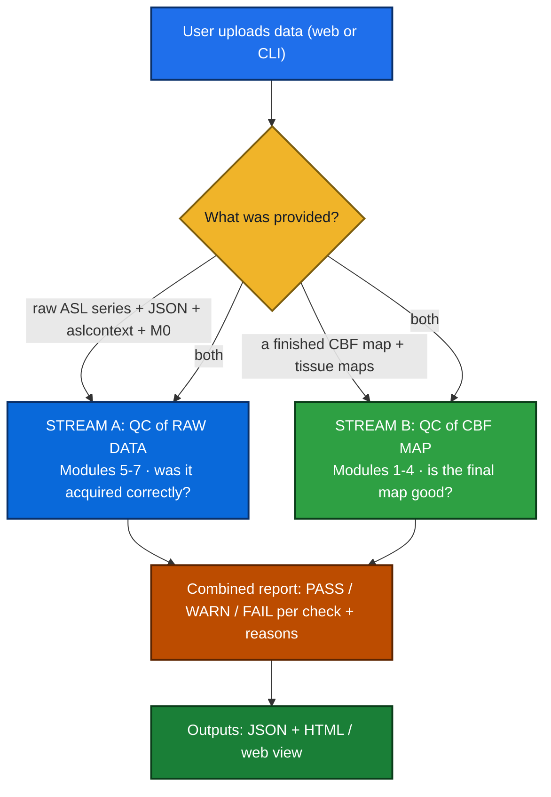
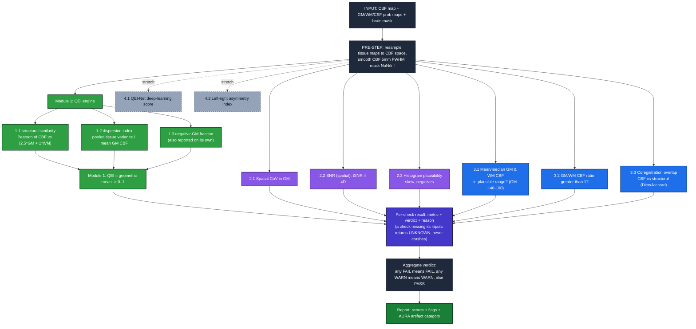
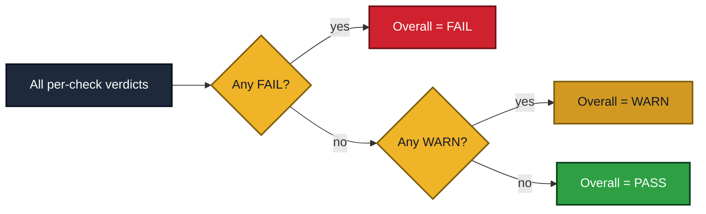
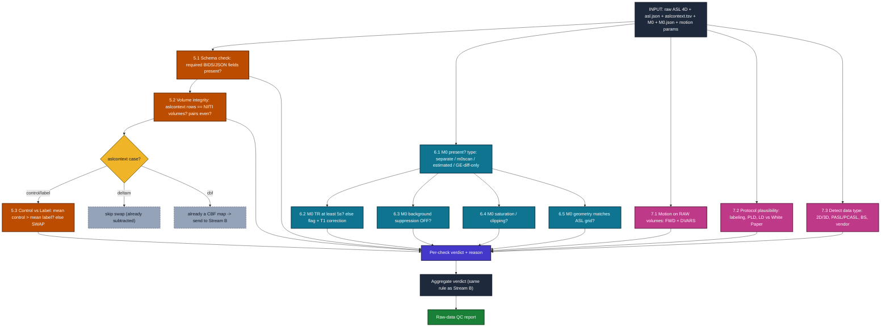

<div align="center">

# 🧠 Quality Check ToolBox v1.0 — QC Design

### Automated PASS / WARN / FAIL triage for ASL perfusion data
**2 streams · 7 modules · ~22 checks ·**
</div>

---

## 🔭 Overview — the two streams

ASL quality asks **two logically different questions**, so the toolbox has two entry points. A user
may have only one input type (e.g. GE scanners output only a difference image + M0; a collaborator
may hand over only a finished CBF map), so each stream runs on whatever inputs exist and marks the
rest **UNKNOWN**.

**The two streams are independent and run in parallel** whichever applies to the uploaded data
runs and their results merge into one report.They are **not** sequential: Stream B needs a CBF map,
which this tool does **not** generate from raw data (that's the preprocessing pipeline's job). The
only exception is the routing case where a "raw" upload turns out to already be a CBF map then
Stream A hands it to Stream B (check `5.2`'s `cbf` branch).



| | **Stream A — Raw-data QC** | **Stream B — CBF-map QC** |
|---|---|---|
| **Question** | "Was the scan acquired correctly?" | "Is the final map good quality?" |
| **Inputs** | 4D ASL series, M0, JSON + `aslcontext.tsv`, motion params | CBF map + GM/WM/CSF probability maps |
| **Modules** | 5, 6, 7 | 1, 2, 3, 4 |
| **When** | before/at the input | after processing, on the output |
| **Build order** | second | **first** |

---

## 🧩 The 7 modules

| Module | Stream | Was (original proposal module) | Checks |
|---|---|---|---|
| 🟢 **Module 1 — QEI** | B | 1. QEI | 1.1 structural similarity · 1.2 dispersion · 1.3 negative-GM |
| 🟣 **Module 2 — Noise & distribution** | B | 5. SNR / spatial CoV / histogram | 2.1 spatial CoV · 2.2 SNR · 2.3 histogram |
| 🔵 **Module 3 — CBF level & contrast** | B | 6. Tissue-mask quality | 3.1 GM/WM CBF level · 3.2 GM/WM ratio · 3.3 coregistration |
| ⚪ **Module 4 — Advanced (stretch)** | B | *(new)* | 4.1 QEI-Net (DL) · 4.2 asymmetry |
| 🟠 **Module 5 — Schema & control-label** | A | 3. Control-label pattern | 5.1 schema · 5.2 volume/pair integrity · 5.3 control-label swap |
| 🟦 **Module 6 — M0 calibration** | A | 4. M0 checking | 6.1 present/type · 6.2 TR · 6.3 BS · 6.4 saturation · 6.5 geometry |
| 🟥 **Module 7 — Motion & protocol** | A | 2. Motion tracking (+new) | 7.1 motion · 7.2 protocol · 7.3 data-type |


---

## 📋 All checks at a glance

| # | Check | Module | What it catches | Verdict (provisional) | Status |
|---|---|---|---|---|---|
| 1.1 | Structural similarity | 🟢 1 | scrambled map, misregistration | feeds QEI | `REQUIRED` |
| 1.2 | Dispersion index | 🟢 1 | motion, wrong CBF scaling | feeds QEI | `REQUIRED` |
| 1.3 | Negative-GM fraction | 🟢 1 | failed subtraction, swap | feeds QEI | `REQUIRED` |
| — | **QEI (combined)** | 🟢 1 | general degradation | FAIL < 0.5 | `REQUIRED` |
| 2.1 | Spatial CoV (3-tier) | 🟣 2 | macrovascular / long transit time | PASS <0.55 · WARN 0.55–0.67 · **FAIL >0.67** *(ExploreASL)* | `REQUIRED` |
| 2.2 | SNR (tSNR if 4D) | 🟣 2 | low signal / noisy scan | higher = better | `REQUIRED` |
| 2.3 | Histogram plausibility | 🟣 2 | severe noise, failed labeling | supporting | `REQUIRED` |
| 3.1 | Mean/median GM & WM CBF | 🔵 3 | bad M0, global labeling failure | WARN outside 40–100 | `REQUIRED` |
| 3.2 | GM/WM ratio | 🔵 3 | no tissue contrast (poor label/motion) | FAIL ≤ 1 | `REQUIRED` |
| 3.3 | Coregistration overlap | 🔵 3 | CBF↔structural misregistration | FAIL Dice < 0.7 | `REQUIRED`* |
| 4.1 | QEI-Net (DL) | ⚪ 4 | general degradation (learned) | model cut-off | `STRETCH` |
| 4.2 | Asymmetry index | ⚪ 4 | unilateral lesion (stroke) | large → WARN | `STRETCH` |
| 5.1 | BIDS schema | 🟠 5 | malformed / non-BIDS dataset | FAIL if absent | `REQUIRED` |
| 5.2 | Volume / pair integrity | 🟠 5 | truncated/corrupt acquisition | FAIL on mismatch | `REQUIRED` |
| 5.3 | Control-label swap | 🟠 5 | reversed order → negative CBF | FAIL if swapped | `REQUIRED` |
| 6.1 | M0 present + type | 🟦 6 | missing/odd calibration source | WARN if absent | `REQUIRED` |
| 6.2 | M0 TR ≥ 5 s | 🟦 6 | M0 too fast → inflated CBF | WARN < 5 s | `REQUIRED` |
| 6.3 | M0 background suppression OFF | 🟦 6 | BS on M0 → inflated CBF | FAIL if on | `REQUIRED` |
| 6.4 | M0 saturation | 🟦 6 | ADC clipping in M0 | FAIL > 5% | `STRETCH` |
| 6.5 | M0 geometry match | 🟦 6 | M0 grid mismatch | WARN if differs | `STRETCH` |
| 7.1 | Motion (FWD + DVARS) | 🟥 7 | head motion during scan | WARN/FAIL by FWD | `REQUIRED` |
| 7.2 | Protocol plausibility | 🟥 7 | wrong acquisition parameters | WARN if implausible | `STRETCH` |
| 7.3 | Data-type / vendor | 🟥 7 | (routes other checks) | informational | `STRETCH` |

<sub>* `3.3` is required only when a structural image is provided; otherwise it returns UNKNOWN.</sub>

---

# 🟢🟣🔵⚪ STREAM B — QC of the CBF map *(Modules 1–4, build first)*

## Stream B flowchart



**End to end:** user provides a CBF map (ideally + tissue maps + brain mask) → a shared **pre-step**
prepares the data once → each check runs **independently** and returns *metric + verdict + reason*
(missing inputs → **UNKNOWN**, never crashes) → verdicts **aggregate** conservatively → a **report**
lists scores, flags, and AURA categories.

> **🔧 The shared pre step (runs once):** resample GM/WM/CSF probability maps onto the CBF voxel grid ·
> smooth the CBF map **5 mm FWHM** for the QEI (its constants + 0.5 cut-off assume it; ASLPrep smooths
> inside its QEI function) · clean NaN/Inf · build tissue masks by thresholding probability maps
> (threshold value = open question, see end).

---

## 🟢 Module 1 — QEI (Quality Evaluation Index) ⭐ *(anchor metric, code first)*

The single most validated ASL-CBF quality score (Dolui 2024). It mimics how a neuroradiologist eyes a
map, from **three components** combined by a **geometric mean** — so one catastrophic component
collapses the whole score (the right behaviour for triage). **Overall QEI verdict:** FAIL < 0.5,
WARN 0.5–0.55, PASS ≥ 0.55 *(provisional; the paper's practical cut-off = 0.5)*.

```
spCBF  = 2.5*GM + 1.0*WM                                  # structural template (continuous maps)
cbf    = smooth(cbf, 5mm)
rho_ss = clip( Pearson(cbf, spCBF) over cbf != 0 , 0, None )      # 1.1
DI     = [(n_gm-1)var_gm + (n_wm-1)var_wm + (n_csf-1)var_csf] / (n_gm+n_wm+n_csf-3) / |mean_gm_cbf|   # 1.2
negGM  = count(cbf[GM] < 0) / count(GM)                            # 1.3
QEI    = [ (1 - e^(-3.0126*rho_ss^2.4419)) * e^(-(0.054*DI^0.9272 + 2.8478*negGM^0.5196)) ]^(1/3)
```
**Source:** Dolui 2024; reference impl ASLPrep `compute_qei` (co-authored by Dolui). Lineage SCORE 2017 → QEI 2024 → QEI-Net 2025.

### 1.1 Structural similarity (ρ_ss) · `REQUIRED`
> `in:` CBF + GM/WM probability maps → `out:` ρ_ss ∈ [0,1] → `verdict:` higher = map matches anatomy

**Catches:** maps that don't look like a brain gross noise, scrambled data or CBF↔structural
misregistration. *How:* Pearson correlation between the CBF map and a template `spCBF = 2.5·GM + 1·WM`
(GM normally ~2.5× WM flow). **It is Pearson, not SSIM.** Negative correlations clipped to 0; computed
over all voxels where CBF ≠ 0.

### 1.2 Dispersion index (DI) · `REQUIRED`
> `in:` CBF + GM/WM/CSF masks → `out:` DI ≥ 0 → `verdict:` higher = noisier (penalised)

**Catches:** motion artifacts and wrong CBF scaling (values scattered within a tissue that should be
fairly uniform). *How:* pooled within-tissue variance ÷ mean GM CBF — the **index of dispersion**
(variance/mean), deliberately **not** the CoV, so incorrect scaling is penalised.

### 1.3 Negative-GM fraction · `REQUIRED`
> `in:` CBF + GM mask → `out:` fraction 0–1 → `verdict:` more negatives = worse

**Catches:** failed subtraction, control/label swap (→ ≈100% negative), and severe noise. *How:* the
share of GM voxels with physically-impossible negative CBF. This exact value is also surfaced as a
standalone, easy-to-read flag in the report.

---

## 🟣 Module 2 — Noise & distribution *(was: SNR / spatial CoV / histogram)*

Three complementary "how noisy / how plausible is the GM CBF distribution" checks.

### 2.1 Spatial CoV in GM · `REQUIRED` · *uses ExploreASL's 3-tier classifier*
> `in:` CBF + GM mask → `out:` sCoV = std/mean of positive GM CBF + classification tier → `verdict:` **PASS — CBF-contrast** (sCoV < ~0.55) · **WARN — vascular contrast** (0.55–0.67) · **FAIL — unusable for CBF / macrovascular-dominant** (> 0.67 — ExploreASL threshold)

**Catches:** macrovascular / transit-time artifacts — when blood arrives late it pools in arteries, so
some spots are spuriously bright and tissue spuriously dark → GM values spread out → high sCoV.
**ExploreASL classifier (Maria's ask):** above sCoV > **0.67**, macrovascular signal dominates and the
image is excluded from CBF statistics but still usable for **vascular** analyses (ExploreASL 2020).
**Cohort context (Mutsaerts 2017):** mean GM sCoV ≈ **56.9 ± 13.2 %** (range 39.3–113.6 %); strong
correlation with arterial transit time (r = 0.85). *Pitfall:* positive GM voxels only (negatives drag
the mean to 0 and the ratio explodes). **Source:** Mutsaerts 2017 (JCBFM); Mutsaerts 2020 (ExploreASL).

### 2.2 SNR (and tSNR if a time series exists) · `REQUIRED` *(tSNR: stretch)*
> `in:` CBF + GM mask (optionally CBF time series) → `out:` spatial SNR = mean/std in GM; tSNR if 4D → `verdict:` higher = better; thresholds after data

**Catches:** low-signal / noisy acquisitions. A single CBF map supports only **spatial** SNR;
**temporal** SNR needs the CBF time series (→ UNKNOWN if absent). **Source:** ExploreASL.

### 2.3 Histogram plausibility · `REQUIRED`
> `in:` CBF + GM mask → `out:` mean, median, skewness, % negative → `verdict:` supporting (strong left-skew + many negatives → noise)

**Catches:** severe noise / failed labeling, seen as a strongly left-skewed GM distribution with many
negatives. Corroborates QEI and the negative-fraction flag rather than failing on its own. Skewness in
pure NumPy (no scipy). **Source:** ExploreASL-style histogram QC.

---

## 🔵 Module 3 — CBF level & contrast *(was: tissue-mask quality)*

"Are the absolute numbers physiologically sensible, and is the map aligned to anatomy?"

### 3.1 Mean / median GM & WM CBF · `REQUIRED`
> `in:` CBF + GM/WM masks → `out:` mean & median GM/WM CBF → `verdict:` WARN if GM outside ~40–100 mL/100g/min; FAIL if absurd (<10 or >150)

**Catches:** a bad M0 / global labeling failure / wrong scaling — values wildly off usually mean a
calibration problem, not biology. Population-dependent (neonates ~20–50) → use config profiles; prefer
WARN for clinical low-perfusion. **Source:** White Paper QA section; ASLPrep.

### 3.2 GM/WM CBF ratio · `REQUIRED`
> `in:` CBF + GM/WM masks → `out:` ratio = mean(GM)/mean(WM) → `verdict:` PASS > 1.5, WARN 1–1.5, FAIL ≤ 1

**Catches:** loss of tissue contrast (poor labeling or motion smearing). Good maps show GM clearly
brighter than WM (healthy ≈ 2–2.5); ratio ≈ 1 = no contrast. (If mean WM ≈ 0 → UNKNOWN.)
**Source:** ASLPrep; White Paper.

### 3.3 Coregistration overlap · `REQUIRED` *(if a structural is provided)*
> `in:` CBF brain mask + structural brain mask (in CBF space) → `out:` Dice, Jaccard (+ cross-corr, coverage) → `verdict:` WARN Dice < 0.9, FAIL Dice < 0.7

**Catches:** misregistration between the CBF and structural images — which would make every tissue
metric unreliable (and also lowers QEI's 1.1). No structural in CBF space → UNKNOWN.
**Source:** ASLPrep.

---

## ⚪ Module 4 — Advanced CBF-map QC *(stretch)*

### 4.1 QEI-Net — deep-learning quality · `STRETCH`
> `in:` CBF + GM/WM/CSF maps + trained model → `out:` learned score → `verdict:` model's cut-off

**Catches:** general degradation, learned from expert ratings. A neural net using the **same inputs**
as classical QEI → a drop-in alternative engine. Kept as an optional plugin so the core stays
pure-NumPy. **Source:** Beltran Urbano/Dolui/Detre 2025.

### 4.2 Left-right asymmetry index · `STRETCH`
> `in:` CBF in symmetric space / midline → `out:` asymmetry index → `verdict:` large asymmetry → WARN

**Catches:** unilateral lesions (e.g. stroke) — flags the scan for human review rather than auto-fail.
Needs symmetric-space CBF → often UNKNOWN; prefer contralateral comparison for lesion cases.
**Source:** clinical practice.

---

## ⚖️ Stream B — combining into one verdict


**Rule (conservative):** any **FAIL → FAIL**; else any **WARN → WARN**; else **PASS**. UNKNOWN checks
are listed but don't block the verdict (batch jobs never crash on one incomplete subject). **The same
rule is reused by Stream A.**

---

# 🟠🟦🟥 STREAM A — QC of the raw data *(Modules 5–7, design second)*

## Stream A flowchart



---

## 🟠 Module 5 — Schema & control-label *(was: control-label pattern)*

The gatekeeper module: is the dataset well-formed, and is the most dangerous error (swapped ordering)
present?

### 5.1 BIDS schema check · `REQUIRED`
> `in:` asl.json + aslcontext.tsv → `out:` list of missing fields → `verdict:` FAIL if aslcontext/JSON absent; WARN if required fields missing

**Catches:** malformed / non-BIDS datasets and missing metadata that would break everything
downstream. Required PCASL fields: `ArterialSpinLabelingType`, `PostLabelingDelay`, `LabelingDuration`.
**Source:** Clement 2022 (ASL-BIDS).

### 5.2 Volume / pair integrity · `REQUIRED`
> `in:` aslcontext.tsv + NIfTI header → `out:` n_rows vs n_volumes, pair parity, aslcontext case → `verdict:` FAIL on mismatch or odd # of control/label

**Catches:** truncated / corrupt acquisitions (counts don't line up). Control/label come in **pairs**,
so the `aslcontext.tsv` row count must equal the NIfTI volume count. Also detects the data's "case":
`control/label` (→ 5.3), `deltam` (already subtracted → skip swap), or `cbf` (already a map → route to
Stream B). **Source:** ASL-BIDS.

### 5.3 Control vs Label swap (intensity) · `REQUIRED`
> `in:` raw 4D + aslcontext + BS flag → `out:` mean(control) vs mean(label) → `verdict:` FAIL if mean(label) > mean(control) when BS is OFF

**Catches:** the single most dangerous error — swapped control/label ordering, which makes CBF come out
globally **negative**. Runs only for raw `control/label` data and only when background suppression is
OFF (otherwise intensities aren't comparable). **Source:** SCORE idea (Dolui 2017); White Paper.

---

## 🟦 Module 6 — M0 calibration *(was: M0 checking)*

M0 is the denominator in `CBF = (control − label)/M0 × constants`, so any M0 error scales **every**
voxel. Five checks.

### 6.1 M0 present + type detection · `REQUIRED`
> `in:` dataset → `out:` M0 type (separate / m0scan / estimated / GE-diff-only / none) → `verdict:` WARN if absent (calibration limited)

**Catches:** a missing or unusual calibration source. Routes which of 6.2–6.5 apply and handles vendor
differences (e.g. GE gives only a difference image + M0). **Source:** White Paper.

### 6.2 M0 TR ≥ 5 s (correctable) · `REQUIRED`
> `in:` M0.json TR → `out:` TR value → `verdict:` WARN if < 5 s (needs `1/(1−e^(−TR/T1))` correction); PASS if ≥ 5 s

**Catches:** an M0 acquired too fast → incomplete T1 recovery → low M0 → **inflated** CBF. It's
correctable, so flag rather than hard-fail. **Source:** White Paper p.15.

### 6.3 M0 background suppression OFF · `REQUIRED`
> `in:` M0.json BackgroundSuppression → `out:` bool → `verdict:` FAIL if BS on during M0

**Catches:** background suppression mistakenly left on for the M0 scan — it crushes the static-tissue
signal you need as the calibration denominator → CBF too high. *(BS is fine/recommended for the
label-control pairs — just not for M0.)* **Source:** White Paper p.15.

### 6.4 M0 saturation / clipping · `STRETCH`
> `in:` M0 image → `out:` % voxels at intensity ceiling → `verdict:` FAIL if > ~5%

**Catches:** ADC clipping (a spike at maximum intensity) that corrupts the denominator. **Source:** QC heuristic.

### 6.5 M0 geometry match · `STRETCH`
> `in:` M0 header + ASL header → `out:` match? → `verdict:` WARN if voxel grid differs

**Catches:** an M0 on a different voxel grid than the ASL data → interpolation artifacts during
calibration. **Source:** White Paper (calibration/coregistration).

---

## 🟥 Module 7 — Motion & protocol *(was: motion tracking, + new protocol/data-type checks)*

### 7.1 Motion on raw volumes (FWD + DVARS) · `REQUIRED` *(DVARS: stretch)*
> `in:` motion params (T×6) and/or raw 4D → `out:` mean/max FWD (mm), DVARS → `verdict:` WARN/FAIL above thresholds *(provisional)*

**Catches:** head motion during the scan (the dominant ASL noise source). Estimated on the **raw**
volumes (subtracted difference images have too little contrast to register). FWD = Power 2012
(rotations → mm on a 50 mm sphere). **Source:** Power 2012.

### 7.2 Protocol plausibility · `STRETCH`
> `in:` asl.json → `out:` labeling type, PLD, LD vs White Paper Table 1 → `verdict:` WARN if implausible

**Catches:** wrong / implausible acquisition parameters (e.g. PLD far from recommended). Sanity-checks
against consensus (PCASL LD ≈ 1800 ms; PLD per population). **Source:** White Paper Table 1.

### 7.3 Data-type / vendor detection · `STRETCH`
> `in:` asl.json + dims → `out:` 2D/3D, PASL/PCASL/CASL, BS on/off, vendor, with/without M0 → `verdict:` informational (routes other checks)

**Catches:** nothing on its own — it **classifies** the dataset so the right checks run on the right
data (and flags missing critical fields). **Source:** White Paper.

---

## 📤 Output / report (both streams)
- **JSON** per subject: overall verdict + every metric + per-check verdict & reason + UNKNOWN list.
- **Web / HTML view**: human-readable version (stretch; the JSON is the core deliverable).
- Each flagged issue → an **AURA artifact category** (high sCoV → *macrovascular*; many negatives →
  *SNR failure*; control/label swap → *labeling error*; M0 saturation → *calibration artifact*).


## 📚 Sources
**Papers**
- **QEI** — Dolui S, et al. JMRI 2024;60(6):2497–2508. [doi:10.1002/jmri.29308](https://doi.org/10.1002/jmri.29308) · 
- **ASL White Paper** — Alsop DC, et al. MRM 2015;73(1):102–116. [doi:10.1002/mrm.25197](https://doi.org/10.1002/mrm.25197) · 
- **ASLPrep** — Adebimpe A, et al. Nat Methods 2022;19:683–686. · `researchpaper/nihms-1827527.pdf`
- **ExploreASL** — Mutsaerts HJMM, et al. NeuroImage 2020;219:117031.
- **Spatial CoV** — Mutsaerts HJMM, et al. JCBFM 2017;37(9):3184–3192.
- **SCORE** — Dolui S, et al. JMRI 2017;45(6):1786–1797.
- **QEI-Net** — Beltran Urbano X, …, Dolui S. ISMRM 2025. [github.com/xavibeltranurbano/QEI-Net](https://github.com/xavibeltranurbano/QEI-Net)
- **ASL-BIDS** — Clement P, et al. Scientific Data 2022;9:543.
- **FWD** — Power JD, et al. NeuroImage 2012;59(3):2142–2154.

