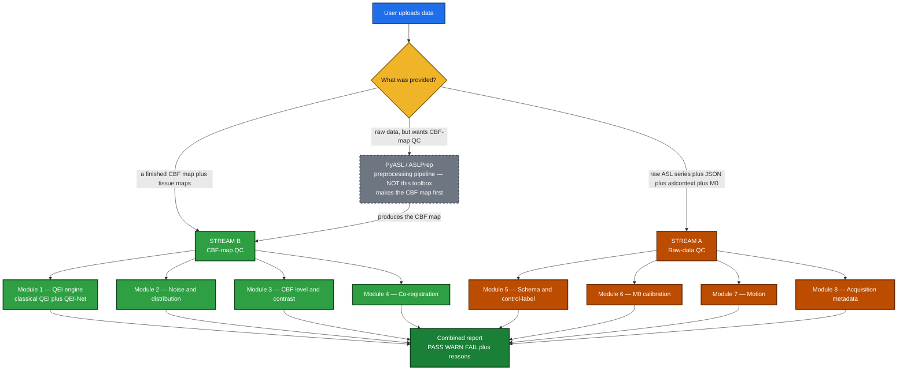

<div align="center">

# Quality Check ToolBox v1.0 — QC Design

### Automatic PASS / WARN / FAIL triage for ASL MRI — grade a scan before it pollutes a study
**Two streams · 8 modules · 20 registered checks · per-check inputs, outputs, method, verdict & sources**

</div>

---

## 🔭 Overview

ASL perfusion signal is about 1% of the image, so a substantial fraction of scans in large studies
(commonly cited around 10–20%) are corrupted. This toolbox takes a scan and returns a
**PASS / WARN / FAIL** verdict per check, with reasons, so bad data can be filtered automatically.

It is a **QC layer, not a full processing pipeline.** It grades data and does only light, QC-grade
derivation; the heavy work (CBF quantification, T1 segmentation, co-registration, motion correction) is
the preprocessing pipeline's job (PyASL / ASLPrep). For any input a check needs:

1. **use it** if the user uploaded it,
2. **derive it cheaply** if possible (e.g. a quick brain mask, default MNI tissue priors, motion from the raw 4D), else
3. the check returns **UNKNOWN**, which is reported with its reason and counted in the report's
   **coverage** — it does *not* move the overall verdict (see "How the verdict works" below).

The work splits into **two streams**, each made of modules:

| Stream | Question | Modules |
|---|---|---|
| **Stream B — CBF-map QC** | "Is the final blood-flow map good?" | 1 QEI · 2 Noise & distribution · 3 CBF level & contrast · 4 Co-registration · (+ asymmetry, stretch) |
| **Stream A — Raw-data QC** | "Was the scan acquired correctly?" | 5 Schema & control-label · 6 M0 calibration · 7 Motion · 8 Acquisition metadata |

**Two design fixes folded in from review:**
- **QEI is in one place** — the classical QEI and the deep-learning QEI-Net are merged into **Module 1** (two ways to the same number), not split across two modules.
- **Co-registration is its own module (Module 4)** — it was wrongly filed under "CBF level & contrast." Dice/Jaccard *evaluate* a registration; they are not registration methods.



> **How to read the gray dashed box:** PyASL / ASLPrep is the **preprocessing pipeline — it is *not* part
> of this toolbox.** It turns raw scans into a CBF map. If a user only has raw data but wants CBF-map QC,
> the pipeline makes the map first, then **Stream B grades it.** That dashed box is exactly the boundary
> between "their job" (produce the map) and "our job" (grade it) — the toolbox sits **downstream**.

---

## 🧪 Real test data (3 vendor cases)

The design is validated against three real datasets — one per vendor/protocol. I measured each NIfTI
directly (full write-up in `DATASET_ANALYSIS.md`):

| Case | ASL | M0 | T1 | What it is |
|---|---|---|---|---|
| **GE 3D pCASL** (ADNI) | 128×128×40 **3D** (pre-subtracted ΔM) | ✓ separate | ✓ | a single difference image + M0, **no control/label pairs** |
| **Siemens 2D pCASL** | 80×80×20×**80** (control/label series) | ✗ **absent** | ✓ | 80-volume time series, **no separate M0** |
| **Siemens BS 3D pCASL** | 88×88×52×**16** (control/label series) | ✓ separate | ✓ | background-suppressed, the complete case |

> ⚠️ **Key finding that shaped the design:** the real data has **no BIDS JSON sidecars and no
> `aslcontext.tsv`** — just raw `.nii.gz`. So the **schema check degrades gracefully** when metadata is
> absent, and **data-type / vendor detection (8.2) becomes the critical first step** — it infers
> 2D-vs-3D, control/label-vs-pre-subtracted, M0 presence, and BS from the NIfTI shape, volume count,
> and filenames. The ASL grid is always coarser than the T1 (e.g. 1.88×1.88×4 mm vs 1 mm), which is
> exactly why the QEI needs the T1 segmentations co-registered + downsampled into ASL space.

---

## ⚖️ How the verdict works

Each check returns the same simple structure: a **metric** (the numbers it measured), a **verdict**
(`PASS`, `WARN`, `FAIL`, `UNKNOWN`, or `N/A`), and a one-line **reason**. A check returns **UNKNOWN**
when its required inputs are *missing but could in principle exist* and cannot be cheaply derived;
it returns **N/A** when the check is *structurally inapplicable* to this data type (e.g. a control/label
swap test on a pre-subtracted GE image that has no pairs). It never invents a PASS or FAIL. A few
checks also emit **INFO** — a description, not a judgment. That is now three kinds of check, not one:
the routing check 8.2; any check reporting numbers it has no defensible cutoff for — `2.3.histogram`
always, and `2.2.snr` when only a 4D series was supplied and no spatial SNR could be formed; and
`7.1.motion`, which reports DVARS as INFO whenever a 4D series arrives without motion parameters.

The overall verdict aggregates the individual checks with one rule:

- **any FAIL → overall FAIL**
- else **any WARN → overall WARN**
- else **any PASS → overall PASS**
- else **UNKNOWN** — nothing was gradeable at all

**`UNKNOWN`, `N/A` and `INFO` are all excluded from aggregation.** All three state an *absence*
("I was given nothing to measure"), not a *finding* ("I measured something and it concerns me"), and
only findings get a vote. A check that cannot apply must not drag a clean scan down — otherwise the GE
pre-subtracted case, which has no time series, would be wrongly WARNed by its inapplicable motion and
swap checks.

> 📜 **UNKNOWN used to escalate to WARN, and this changed in July 2026.** That was the agreed rule and
> it was documented everywhere — not an oversight. **The July review overturned it:** a good CBF map
> was uploaded on its own, came back **WARN**, and the reviewer said it should not have. That was
> right. Hand the toolbox a CBF map and nothing else and **18 of the 20 checks have no input**, so
> those 18 UNKNOWNs manufactured a warning about files the user had never been asked to supply — and
> no file they could add, short of *every* file, would have cleared it. A verdict nobody can earn is
> not a verdict. The rule changed because the review caught it.

**The cost, and how it is paid.** The verdict no longer carries "this report was partial", so
**`coverage()` does** — and it must be shown beside every verdict:

```python
{"graded": 7, "total": 8, "unknown": 1, "complete": False,
 "missing": ["4.1.coregistration"]}
```

`graded` counts the checks that reached a real PASS/WARN/FAIL. `total` excludes N/A and INFO — a check
that *cannot apply* to this data was never owed an answer, so counting it would understate coverage.
Anything that renders a verdict renders this next to it: the JSON, the HTML report and the web app all
do. A bare `PASS` on a lone CBF map would be **more** misleading than the old WARN.

**Threshold provenance.** Thresholds are no longer uniformly "provisional". Every one now carries a
tier, and `osipy-qc --provenance` prints all 36 with their citations:

| tier | meaning | count |
|---|---|---|
| **PUBLISHED** | a paper states this number for this purpose | 11 |
| **IMPLEMENTATION** | a reference implementation uses it (e.g. the ASLPrep QEI constants, the 0.7 tissue threshold) | 9 |
| **UNCALIBRATED** | our engineering default, no published derivation | 16 |

Only the UNCALIBRATED group is genuinely provisional, and the code treats it as such: a verdict decided
by an uncalibrated cutoff is marked `provisional`, and running with `strict=False` demotes it from FAIL
to WARN. Those are still tagged 🔧 in the per-check specs below.

---

## 📤 Report & usage

**Default = full report.** By default the toolbox emits a complete report containing *every* metric
the provided inputs allow (QEI, spatial CoV, GM/WM ratio, GM/WM CBF level, SNR, histogram, motion,
co-registration, etc.), with each check's verdict and reason, plus the aggregated overall verdict.
Checks whose inputs are missing appear as UNKNOWN rather than being dropped — that is what the library's
`run_qc` over the full registry does, and on a lone CBF map that is **eighteen** of them. The **web console
and the batch runner go one step further and run only the check set the inputs justify**
(`web._checks_for`, `batch.cbf_map_checks`): a CBF-map upload is never offered the nine Stream A checks, a
raw-only upload is never asked for a CBF map, and neither runner offers 4.1. The same upload comes back
with eight UNKNOWNs instead of eighteen. Reporting eighteen of them about files the user was never asked
to supply is noise, not disclosure — `coverage()` carries "this was partial".

**Optional = filter to specific checks.** The user may also select and run only specific checks
(e.g. "only SNR", or "only the CBF-map checks"). Both modes share the same per-check engine.

**Two deployment targets:**

- **Python library** (`pip install osipy-qc`) — runs entirely on the **user's own machine**. All heavy
  processing happens locally, data never leaves the institution (a real concern for clinical MRI), and
  there is **zero server cost** to host. This is the primary deployment and the natural home for the
  heavy path, since researchers already work in Python/terminal pipelines (ASLPrep, ExploreASL, PyASL).
- **Hosted website** — the user uploads data to a backend and gets a report, in the spirit of
  MRICloud. **This now exists**: `osipy-qc --serve` runs the single-scan upload UI and
  `osipy-qc --dashboard FOLDER` runs the cohort dashboard, both from the same package, and an upload
  of raw acquisition files with **no CBF map at all** is accepted — Stream A grades the acquisition on
  its own. The website **stays on the light path** (QC math on files the user already provides —
  CBF map, motion parameters, masks), which runs comfortably on a free or low-cost tier. **In-backend
  heavy processing** (segmentation, co-registration, motion correction) is **deferred**: it is the only
  part that costs real money, so it is added later, behind the upload-vs-derive rule, when there is
  demand and budget. Until then, any input the backend cannot cheaply derive simply yields an UNKNOWN
  for that check — no compute spent.

---

# 🟢 STREAM B — QC of the CBF map *(Modules 1–4)*

## 🧪 Shared PRE-STEP (runs once, before any CBF-map check)

Every check in Stream B consumes the same prepared arrays, so the pre-step runs once
and caches its outputs:

1. **Tissue maps must ARRIVE on the CBF grid — the toolbox does not resample them.** Resampling is
   pipeline work (it needs the affines and an interpolation policy), and doing it quietly inside a QC
   layer would be exactly the scope creep this design avoids. So a grid mismatch is a hard, actionable
   error rather than a silent guess: `load_cbf_inputs` raises
   `"wm shape (208, 300, 320) != cbf shape (128, 128, 40) — resample the tissue maps into ASL space first"`.
2. **Brain-mask fallback — one check, not all of them.** `brain_mask_fallback` is a percentile
   threshold on |CBF| (voxels above the 50th percentile of the non-zero magnitudes), not a BET-style
   extraction, and exactly one check uses it: **3.5 whole-brain CBF**. No other Stream B check falls
   back to it, because a whole-brain mask is not a GM mask and quietly substituting one for the other
   would change what sCoV, SNR, the level checks and the QEI measure.
3. **There is no default tissue-prior fallback, and that is deliberate.** An earlier draft of this
   design promised to warp default MNI priors into CBF space so nothing would return UNKNOWN. It is
   not shipped, and it should not be: an MNI prior on an un-normalised subject is a *guess about where
   grey matter is*, and a QEI or a GM CBF level computed on a guess is indistinguishable in the report
   from one computed on a real segmentation. A check without tissue maps returns **UNKNOWN** and
   `coverage()` says so. What a lone CBF map does buy is **3.5 whole-brain CBF** — that is the honest
   floor, and it is why 3.5 exists.
4. **CSF is derived when GM and WM are given.** If `csf` is omitted, it is built as
   `clip(1 − GM − WM, 0, 1)` restricted to the voxels the CBF map actually covers — restricted,
   because outside the head GM and WM are both 0, so the raw complement is 1 everywhere in the air and
   the QEI would pool the entire background into its within-tissue variance, deflating DI and
   inflating the score. So the practical requirement for the whole of Stream B is **CBF + GM + WM**.
4. **Smoothing happens in exactly ONE place.** The QEI engine needs a 5 mm FWHM Gaussian-smoothed
   CBF map (Dolui 2024 fitted its constants and the ≈0.5 cutoff on 5 mm-smoothed data). ASLPrep's
   `compute_qei` smooths **internally** and its docstring says the input must **not** be pre-smoothed
   — so to avoid *double-smoothing* (which would break the ≈0.5 cutoff), the smoothing lives inside
   the QEI engine, not in this shared pre-step. Non-QEI checks use the unsmoothed map. *(osipy bans
   scipy, so the 5 mm smoother is a pure-NumPy separable Gaussian, σ = FWHM/2.355 in voxel units,
   validated against nibabel.)*
5. **Clean NaN / Inf** — replace non-finite voxels (set to 0 or exclude from masks) so no
   downstream statistic is poisoned.
6. **Build tissue masks** — threshold the probability maps into boolean GM/WM/CSF masks. Default to
   **prob > 0.7** to match the live QEI reference (ASLPrep `compute_qei` binarizes with a strict `>`
   at 0.7); **0.9** is offered as the paper-faithful option and exposed as config. *(Reading the
   actual code settled this: it is no longer an open question — see Module 1.)*

---

## 🟢 Module 1 — QEI engine ⭐

The QEI is one of the most extensively validated single CBF-map quality scores in the literature.
It now lives in **one place**: the classical QEI (Dolui 2024) and its deep-learning sibling **QEI-Net**
are just two ways to produce the *same* 0–1 number, so they belong in one module rather than split across two.

### 1. QEI engine · `REQUIRED` *(QEI-Net variant `STRETCH`)*

**🎯 what it checks:** produces a single 0–1 quality number that mimics a radiologist's
eye on the CBF map — computed two ways: classical QEI (Dolui 2024) and, as a stretch,
the deep-learning QEI-Net.

This is the **anchor** of Stream B (CBF-map QC) and merges what were previously two separate modules
(classical QEI and the QEI-Net DL score): both take the CBF map and tissue maps and emit
the same kind of 0–1 quality number, so they are one engine with two backends.

**(a) Classical QEI (Dolui 2024)** combines three sub-components by a geometric mean so a
single disaster collapses the whole score:

```
spCBF = 2.5·GM_prob + 1.0·WM_prob
ρ_ss  = Pearson(CBF, spCBF)  over voxels where CBF ≠ 0      # structural similarity
V     = [(n_gm−1)·var_gm + (n_wm−1)·var_wm + (n_csf−1)·var_csf] / (n_gm + n_wm + n_csf − 3)
DI    = V / |mean(GM CBF)|                                  # dispersion index
p     = #(GM voxels with CBF < 0) / #(GM voxels)            # negative-GM fraction

f₁(ρ) = 1 − e^(−3.0126·ρ^2.4419)
f₂(DI)= e^(−0.054·DI^0.9272)
f₃(p) = e^(−2.8478·p^0.5196)

QEI   = ( f₁ · f₂ · f₃ )^(1/3)                              # geometric mean, cutoff ≈ 0.5
```
*(Constants shown match the ASLPrep `compute_qei` reference implementation; the
paper-rounded forms are `3.0/2.4`, `0.1/0.9`, `2.8/0.5`.)*

> ❓ **The open question is narrower than "paper vs implementation" — it is one constant.** Five of the
> six round cleanly to the paper's printed values: 3.0126→3.0, 2.4419→2.4, 0.9272→0.9, 2.8478→2.8,
> 0.5196→0.5. **`qei_c` does not.** ASLPrep uses **0.054**, which rounds to 0.05, while the paper's
> Fig. 2 prints `exp(−0.1·x^0.9)` — a **~1.85× gap**, not a rounding difference. The default here is
> ASLPrep's 0.054 because that is the code the QEI has actually been validated through, but this is
> the one number only the QEI's author can settle.

**(b) QEI-Net (deep-learning, `STRETCH`)** takes the same inputs (CBF map + tissue maps)
and returns a single learned quality score in 0–1, trained on expert ratings. It uses the
model's own calibrated cutoff rather than the geometric-mean formula. Shipped as an
optional plugin (a DL framework dependency that core osipy should not require).

> ⚠️ **Dependency note (design decision):** the classical QEI needs GM/WM/CSF tissue maps
> **in ASL space**. Obtaining them means segmenting a T1, co-registering it to the ASL
> space, and downsampling — roughly **5 minutes of compute per scan**. So they are either
> uploaded by the user or derived in the backend; if neither is possible the check is
> **UNKNOWN**.
>
> **📐 Real data confirms this:** in every test case the T1 is far finer than the ASL —
> GE ASL `1.88×1.88×4` mm vs T1 `1` mm; Siemens 2D `2.75×2.75×6` mm vs `1` mm; Siemens BS 3D
> `2.5` mm vs `0.8` mm. None ship with tissue maps in ASL space, so a CBF map alone here
> cannot produce a QEI until the T1 is segmented and resampled down to the ASL grid.

**📥 inputs:**
```python
{
  "cbf_map":  "NIfTI 3D float",     # mL/100g/min, UNSMOOTHED — the engine smooths 5 mm internally
  "gm_prob":  "NIfTI 3D float[0,1]",  # GM probability map in ASL space
  "wm_prob":  "NIfTI 3D float[0,1]",  # WM probability map in ASL space
  "csf_prob": "NIfTI 3D float[0,1]",  # CSF probability map in ASL space (for DI pooled var)
  "model":    "QEI-Net weights file (optional; only for the DL variant)",
}
```
**📤 output:**
```python
{
  "metric": {
    "qei": 0.76,                                  # classical QEI = (f1·f2·f3)^(1/3)
    "rho_ss": 0.80, "DI": 1.50, "negGM_fraction": 0.04,
    "f1": 0.83, "f2": 0.92, "f3": 0.59,           # f1=1-e^(-3.0126·ρ^2.4419); f2=e^(-0.054·DI^0.9272); f3=e^(-2.8478·negGM^0.5196)
    "qei_net": 0.85,                              # null if no model supplied
  },
  "verdict": "PASS | WARN | FAIL | UNKNOWN",
  "reason":  "QEI 0.76 above pass threshold",
}
```

**🔧 how I plan to compute it (method):**
1. Build the pseudo-CBF template `spCBF = 2.5·gm_prob + 1·wm_prob` from the **continuous** probability
   maps (CSF excluded). Apply the **exact reference mask** `(cbf != 0) & ~isnan(cbf) & ~isnan(spCBF)`,
   take the Pearson r with the pure-NumPy `utils.mathops.pearson` (same formula, no `corrcoef` call so
   the arithmetic is auditable line by line), and clip negatives away with `max(rho, 0.0)` → `ρ_ss`
   (matches ASLPrep `structural_pseudocbf_correlation` byte-for-byte).
2. Compute per-tissue variances with `numpy.var` inside the GM/WM/CSF masks, pool them
   with the `(n_k−1)` weighting, divide by `abs(mean(GM CBF))` → `DI`.
3. Count GM voxels with `cbf < 0` over total GM voxels → `p` (the negative-GM fraction).
4. Map each component through its fitted curve `f₁, f₂, f₃` (pure NumPy `exp`), take the
   geometric mean `(f₁·f₂·f₃)**(1/3)` → classical `qei`.
5. If a QEI-Net model file is provided, run the network on the same inputs to also emit
   `qei_net`; otherwise leave it null. The overall verdict uses the classical QEI by
   default, with QEI-Net reported alongside.
6. Guard edge cases: `n_k ≤ 1` per tissue, `mean(GM CBF) ≈ 0`, all-zero CBF → UNKNOWN.

**📊 PASS / WARN / FAIL:**
| outcome | condition |
|---|---|
| ✅ PASS | QEI ≥ 0.55 |
| ⚠️ WARN | 0.50 ≤ QEI < 0.55 (borderline) |
| ❌ FAIL | QEI < 0.50 |
| ❓ UNKNOWN | tissue maps absent |
| ❓ UNKNOWN | a "probability" map whose max is > 1 — a 0–255 or 0–100 segmentation. Refused rather than scored: thresholded at 0.7 it would make **every** tissue mask the whole brain, and the score would come out plausible and wrong |
| ❓ UNKNOWN | degenerate masks — ≤ 1 voxel above `tissue_thresh` in any of GM/WM/CSF, or \|mean GM CBF\| ≈ 0. Never scored, because both penalty terms take their *best* value on an empty mask, so falling back silently would hand the worst-prepared scans the highest QEI |

**📍 thresholds & sources** *(📄 = paper with page · 🔧 = provisional, calibrate later · 🧮 = physics/definition)*:
- **cutoff approx 0.50 (ROC 0.53, 99% sens / 79% spec)** — 📄 Dolui 2024, p.2503 (PDF p.7)
- **curve `1 − e^(−3.0126·ρ^2.4419)`** — 📄 ASLPrep `compute_qei`; paper-rounded `3.0/2.4`, Dolui 2024 p.2501
- **curve `e^(−0.054·DI^0.9272)`** — 📄 ASLPrep `compute_qei`; paper-rounded `0.1/0.9`, Dolui 2024 p.2501
- **curve `e^(−2.8478·p^0.5196)`** — 📄 ASLPrep `compute_qei`; paper-rounded `2.8/0.5`, Dolui 2024 p.2500
- **spCBF = 2.5·GM + 1·WM, Pearson over CBF ≠ 0** — 📄 Dolui 2024 p.2500; ASLPrep `structural_pseudocbf_correlation`
- **var/mean (not std/mean) for DI** — 📄 Dolui 2024 p.2500 (so a scaling error is penalised)
- **geometric mean** — 🧮 definition: one near-zero component collapses the score
- **PASS 0.55 / WARN band 0.50–0.55** — 🔧 PASS is anchored at 0.55, *deliberately one notch above* the
  paper's validated ≈0.50 operating point (ROC 0.53), as a conservative provisional margin. This means a
  scan the paper would accept at 0.50–0.55 is downgraded to WARN rather than passed silently — **open to
  setting PASS = 0.50 to match the paper exactly** if you'd prefer.
- **QEI-Net cutoff** — 📄 Beltran Urbano et al., ISMRM 2025 *(conference abstract — citation/venue to confirm)*; uses the model's own calibrated threshold

**🔗 needs (dependency):** CBF map **and** GM/WM/CSF tissue maps in ASL space (uploaded or
backend-derived via segment + co-register + downsample). Without tissue maps → UNKNOWN.
The QEI-Net variant additionally needs the pretrained model file.

**🩺 catches:** overall map degradation — noise, scrambled data, CBF↔structural
misregistration, motion, wrong CBF scaling, and control/label swap (which drives the
negative-GM fraction toward 100% and collapses the score).

---

## 🟣 Module 2 — Noise & distribution

Two questions about the map's quality: how noisy is it, and does the GM blood-flow distribution look plausible?

### 2.1 Spatial CoV in GM · `REQUIRED` *(ExploreASL 3-tier classifier)*

**🎯 what it checks:** how spread-out are the GM CBF values across space — the 3-tier
clean/vascular/macrovascular classification.

**📥 inputs:**
```python
{
  "cbf_map": "NIfTI 3D float",
  "gm_mask": "NIfTI 3D bool",   # whole-brain mask gives a rough version if no GM mask
}
```
**📤 output:**
```python
{
  "metric":  {"sCoV": 0.40, "tier": "CBF-contrast"},
  "verdict": "PASS | WARN | FAIL | UNKNOWN",
  "reason":  "sCoV 0.40 within CBF-contrast tier",
}
```

**🔧 how I plan to compute it (method):**
1. Select GM voxels with `cbf_map[gm_mask]`, then keep **positive** values only (negatives
   drag the mean toward 0 and make the ratio explode).
2. Compute `numpy.std` and `numpy.mean` over those positive GM voxels.
3. `sCoV = std / mean` (report as a fraction and as a percentage).
4. Classify into the three ExploreASL tiers below.
5. If only a whole-brain mask is available (no real GM segmentation), still compute it but
   label the result "rough" in the report.

**📊 PASS / WARN / FAIL:**
| outcome | condition |
|---|---|
| ✅ PASS | sCoV < 0.67 → CBF-contrast (clean perfusion) |
| ⚠️ WARN | 0.67 ≤ sCoV ≤ 1.0 → vascular contrast (mixed signal) — **ExploreASL keeps this band**; it excludes it only from CBF statistics |
| ❌ FAIL | sCoV > 1.0 → artifactual contrast. Demoted to WARN with `strict=False` |
| ❓ UNKNOWN | no GM mask, fewer than 2 positive GM voxels, or mean GM CBF is 0 |

**📍 thresholds & sources** *(📄 = paper with page · 🔧 = provisional, calibrate later · 🧮 = physics/definition)*:
- **0.67 boundary** — ⚙️ **IMPLEMENTATION, not a paper.** Cite it as an ExploreASL convention and nothing
  more: the usual citation chain is broken. ExploreASL 2020 attributes it to Mutsaerts 2018, which
  contains neither the phrase "spatial CoV" nor the number 0.67; Mutsaerts 2017 (the sCoV paper) reports
  only a cohort mean and gives **no cutoff at all**. 0.67 is literally 2/3, a bin edge in
  `xASL_qc_SortBySpatialCoV.m`
- **1.0 exclusion line** — ⚙️ IMPLEMENTATION, the same file. ExploreASL's own tiers are
  CBF-contrast < 0.67 < vascular < 1.0 < artifactual, and only the last is excluded
- **cohort context 56.9 ± 13.2%** — 📄 Mutsaerts 2017, p.3186 (186 elderly; r = 0.85 with ATT)
- **sCoV = std/mean** — 🧮 definition

**🔗 needs (dependency):** CBF map **and** a GM mask (or, for a rough version, a whole-brain
mask). Without any mask → UNKNOWN.

**🩺 catches:** macrovascular artifacts from long arterial transit time — blood pools in
arteries so some voxels are bright and others dark, raising the spatial spread.

---

### 2.2 SNR · `REQUIRED` *(tSNR variant `STRETCH`)*

**🎯 what it checks:** is the signal strong relative to the noise (spatial SNR on a single
map; temporal SNR if a 4D series is provided)?

**📥 inputs:**
```python
{
  "cbf_map": "NIfTI 3D float",
  "gm_mask": "NIfTI 3D bool",
  "asl_4d":  "NIfTI 4D float (optional, for tSNR)",
  "brain":   "NIfTI 3D bool (optional; the mask tSNR is averaged over)",
}
```
**📤 output:**
```python
{
  "metric":  {"spatial_SNR": 2.5, "tSNR": 9.0},   # tSNR null if no 4D series
  "verdict": "PASS | WARN | FAIL | UNKNOWN",
  "reason":  "SNR within typical range",
}
```

**🔧 how I plan to compute it (method):**
1. Spatial SNR = `mean(cbf_map[gm_mask]) / std(cbf_map[gm_mask])` (pure NumPy on one map).
2. If a 4D series `asl_4d` is supplied: compute per-voxel `mean / std` along the time axis, then
   average that over the `brain` mask if one was given, and otherwise over every voxel whose temporal
   mean is non-zero → tSNR. Not the GM mask: tSNR is usually wanted on the raw ASL series, which
   arrives long before any tissue segmentation does.
3. Note spatial SNR is exactly `1/sCoV` (same information inverted); the genuinely
   additive metric is tSNR, which is why tSNR is the stretch goal worth pursuing.
4. Report numbers without a hard cutoff for now — the pass/warn/fail boundary is set after
   calibrating on a real cohort.

**📊 PASS / WARN / FAIL:**
| outcome | condition |
|---|---|
| ✅ PASS | spatial SNR > 1/0.67 ≈ **1.49** |
| ⚠️ WARN | spatial SNR ≤ 1.49 — "low, see sCoV for the verdict" |
| ❌ FAIL | never. Spatial SNR is exactly 1/sCoV, so it carries nothing 2.1 does not already carry; sCoV owns that verdict and this check must not double-count it |
| ℹ️ INFO | only a 4D series was supplied — tSNR is reported, ungraded |
| ❓ UNKNOWN | neither a GM CBF map nor a usable 4D series |

**📍 thresholds & sources** *(📄 = paper with page · 🔧 = provisional, calibrate later · 🧮 = physics/definition)*:
- **SNR = mean/std** — 📄 ExploreASL (standard definition)
- **the 1.49 boundary is not an independent threshold** — 🧮 it is `1/scov_vascular`, the algebraic image
  of the sCoV PASS boundary. Adding a separately-tuned SNR cutoff would be inventing a second opinion
  about one number

**🔗 needs (dependency):** CBF map **and** a GM/brain mask for spatial SNR; a 4D CBF series
for tSNR. Missing the 4D series → tSNR is UNKNOWN (spatial SNR still reported).

**🩺 catches:** low-signal / noisy acquisitions.

---

### 2.3 Histogram plausibility · `OPTIONAL` *(registered `required=False`; reported, never graded)*

**🎯 what it checks:** does the shape of the GM CBF distribution look healthy (a supporting
check that corroborates the QEI and negative-fraction flags)?

**📥 inputs:**
```python
{
  "cbf_map": "NIfTI 3D float",
  "gm_mask": "NIfTI 3D bool",   # CBF map alone gives a rough whole-brain version
}
```
**📤 output:**
```python
{
  "metric":  {"skewness": 0.20, "neg_fraction": 0.02, "mean": 55.0, "median": 56.0,
              "provenance": "uncalibrated - no published skewness cutoff exists for CBF; "
                            "reported for inspection and future ROC calibration only"},
  "verdict": "INFO | UNKNOWN",
  "reason":  "skew 0.20, 2.0% negative (informational)",
}
```

**🔧 how I plan to compute it (method):**
1. Select GM CBF values (or whole-brain values for the rough version).
2. Compute `numpy.mean`, `numpy.median`, and `% negative` directly.
3. Compute skewness in **pure NumPy** (osipy bans scipy):
   `skewness = mean(((x − mean)/std)**3)`. Positive skew = tail to the right (normal);
   negative skew = tail to the left.
4. **Report the shape; do not grade it.** This check issues no verdict at all. It used to WARN below a
   skewness of −0.5 — a number taken from a general statistics textbook (Bulmer 1979's "approximately
   symmetric" rule of thumb) with no ASL or CBF basis behind it. Rather than re-word an unsupported
   rule, the numbers are reported as INFO for a human and for later ROC calibration. The negative-voxel
   verdict lives in **3.3**, where it rests on a physical argument — negative perfusion is impossible.

**📊 PASS / WARN / FAIL:**
| outcome | condition |
|---|---|
| ℹ️ INFO | always, when it runs — skewness, negative fraction, mean and median are reported, never graded |
| ❓ UNKNOWN | no CBF map or no GM mask, or fewer than 2 GM voxels |

**📍 thresholds & sources** *(📄 = paper with page · 🔧 = provisional, calibrate later · 🧮 = physics/definition)*:
- **no cutoff, and the old justification was wrong** — 🔧 the previous line here cited "ExploreASL-style
  histogram QC". That was not true. **ASLPrep does not compute CBF skewness at all** (its only `skew` in
  the tree is a comment about dropping NaNs), and **ExploreASL does not grade it**: the only skewness code
  in that tree is `External/ExploreQC/xQC_Stats.m`, a generic intensity-statistics helper whose single
  caller runs it on the **T1**, not on a CBF map. No published skewness cutoff exists for CBF, so grading
  one would be inventing a standard and attributing it to somebody else
- **skewness = mean(((x−μ)/σ)³)** — 🧮 standard statistics definition

**🔗 needs (dependency):** CBF map **and** a GM mask — it does not run on a CBF map alone. Empty/absent mask with no usable voxels → UNKNOWN.

**🩺 catches:** severe noise or failed labeling, which show up as a heavy left tail plus
many negative voxels.

---

## 🔵 Module 3 — CBF level & contrast *(five shipped checks: 3.1–3.5)*

Are the absolute CBF numbers physiologically sensible and is tissue contrast right? *(Co-registration was removed from here — it is now its own Module 4.)*

### 3.1 Mean / median GM & WM CBF · `REQUIRED`

**🎯 what it checks:** are the absolute CBF numbers in gray matter and white matter
physiologically sensible?

**📥 inputs:**
```python
{
  "cbf_map": "NIfTI 3D float",
  "gm_mask": "NIfTI 3D bool",
  "wm_mask": "NIfTI 3D bool",
  "population_profile": "adult_brain",   # selects the per-population x per-organ threshold table
}
```
**📤 output:**
```python
{
  "metric": {
    "mean_gm_cbf": 55.0, "median_gm_cbf": 54.5,
    "mean_wm_cbf": 22.0, "median_wm_cbf": 21.8,
    "gm_verdict": "PASS", "wm_verdict": "PASS",
    "population": "adult", "gm_band": [40.0, 100.0], "wm_band": [15.8, 27.5],
  },
  "verdict": "PASS | WARN | FAIL | UNKNOWN",
  "reason":  "GM (55) and WM (22) both within healthy adult ranges",
}
```

**🔧 how I plan to compute it (method):**
1. Take `cbf_map[gm_mask]` and `cbf_map[wm_mask]` and compute `numpy.mean` and
   `numpy.median` for each tissue.
2. Look up the WARN/FAIL bounds from the selected profile. v1.0 ships **two populations** — `adult`
   (the brain target) and `neonate` — because a newborn's normal GM CBF (~16) sits well outside the
   adult 40–100 band and an adult's ~58 sits well outside the neonatal 8–32 one, so each is flagged on
   the other's profile. Organs are `brain` and a declared `kidney` **stub**; placenta is not shipped.
   `for_population('child')` raises rather than silently returning adult bands — a silent adult default
   on a neonate would flag every scan.
3. Score GM and WM **separately** against their own per-tissue ranges (one range cannot
   fit both tissues).
4. Combine: overall verdict is the **worst** of the GM and WM outcomes.
5. For clinical low-perfusion cohorts, run with `strict=False`: every FAIL here comes from an
   uncalibrated bound, so `strict=False` demotes it to WARN and no genuinely low-flow patient is
   auto-excluded on a number nobody has published. The verdict is also flagged `provisional` in the
   report so it is never presented as hard, evidence-backed failure.

**📊 PASS / WARN / FAIL:**
| outcome | condition |
|---|---|
| ✅ PASS | GM in 40–100 **and** WM in **15.8–27.5** |
| ⚠️ WARN | GM outside 40–100 *or* WM outside 15.8–27.5 (but not absurd) |
| ❌ FAIL | GM **≤ 10** or > 150 *or* WM **≤ 5** or > 50. Demoted to WARN with `strict=False`, and always flagged `provisional` — every one of these four bounds is uncalibrated |
| ❓ UNKNOWN | no GM/WM masks available (even after the prior fallback) |

**📍 thresholds & sources** *(📄 = paper with page · 🔧 = provisional, calibrate later · 🧮 = physics/definition)*:
- **GM 40–100** — 📄 ASL White Paper (Alsop 2015), p.17, verbatim: *"As a general rule, gray matter CBF
  values from 40-100 ml/min/100ml can be normal."* Two things that sentence does **not** say, and the
  code respects both: the unit is per 100 **mL**, not per 100 g (converting needs a density assumption,
  ~1.05 g/mL — do not silently equate them); and *"can be normal"* is a **sufficiency** statement. It
  licenses "inside the band → do not flag". It does **not** license "outside the band → fail". That is
  exactly why crossing 40–100 is a WARN here and only the invented absurd bounds can FAIL
- **WM 15.8–27.5** — 📄 **PUBLISHED**, Wu W-C et al., *PLoS One* 2013;8(12):e82679, verbatim: *"The
  measured white matter perfusion ... 15.8-27.5 ml/100ml/min ... depending on spatial resolution as
  well as the amount of deep white matter included."* Corroborated by Clement 2022 (Dolui a co-author),
  "about 20 mL/100g/min in WM in young and healthy adults". Note the White Paper itself states **no** WM
  CBF value — its WM section is entirely qualitative
- **absurd bounds (GM <10 or >150, WM <5 or >50)** — 🔧 provisional engineering
- **population AND organ dependent** — 🔧 design decision: brain v1.0 here; non-brain organs get their own config profiles

**🔗 needs (dependency):** CBF map **and** GM and WM masks. Without tissue masks → UNKNOWN.

**🩺 catches:** bad M0 calibration, global labeling failure, wrong CBF scaling — values
wildly off usually mean a calibration problem, not biology.

---

### 3.2 GM/WM CBF ratio · `REQUIRED`

**🎯 what it checks:** is gray matter clearly brighter than white matter (is there
perfusion contrast)?

**📥 inputs:**
```python
{
  "cbf_map": "NIfTI 3D float",
  "gm_mask": "NIfTI 3D bool",
  "wm_mask": "NIfTI 3D bool",
}
```
**📤 output:**
```python
{
  "metric":  {"gm_wm_ratio": 2.5},
  "verdict": "PASS | WARN | FAIL | UNKNOWN",
  "reason":  "good GM/WM contrast (ratio 2.5)",
}
```

**🔧 how I plan to compute it (method):**
1. Compute `mean(cbf_map[gm_mask])` and `mean(cbf_map[wm_mask])` with `numpy.mean`.
2. If **either** tissue mean is non-positive → return **FAIL**, not UNKNOWN. Two negative means would
   otherwise divide to a healthy-looking positive ratio and a false PASS, and a non-positive tissue CBF
   is a finding about the map, not an absence of input.
3. `ratio = mean_gm / mean_wm`.
4. Score against the contrast bands below. This metric is **scale-independent**, so it
   stays valid even when check 3.1 (absolute level) fails from a wrong M0 — they catch
   different failures.

**📊 PASS / WARN / FAIL:**
| outcome | condition |
|---|---|
| ✅ PASS | ratio > 1.5 (healthy approx 2–2.5) |
| ⚠️ WARN | 1 < ratio ≤ 1.5 (weak contrast) |
| ❌ FAIL | ratio ≤ 1 (no contrast or inverted) |
| ❌ FAIL | mean GM **or** mean WM CBF is non-positive — the ratio is invalid, and two negatives would otherwise divide to a false PASS |
| ❓ UNKNOWN | GM/WM masks missing, or empty after excluding voxels the CBF map does not cover |

**📍 thresholds & sources** *(📄 = paper with page · 🔧 = provisional, calibrate later · 🧮 = physics/definition)*:
- **ratio greater than 1 expected** — 📄 ASLPrep (Adebimpe 2022), p.10: "the ratio ... is expected to be greater than 1"
- **healthy ≈ 2–4×** — 📄 Clement 2022 (Dolui a co-author): *"CBF in GM is around 2 to 4 times higher
  than the WM CBF"*; Wu 2013 measured **1.8–4.0**; Zhang 2014 got 3.0 (PET) and 3.4 (pCASL). Dolui
  2024's 2.5 is the **spCBF template weighting**, a modelling choice, not a measured normal range —
  do not read it as one
- **1.5 PASS boundary** — 🔧 **UNCALIBRATED. No source states 1.5**, and the published ranges above
  cannot justify it: they are *population ranges*, and a population range is not a decision boundary.
  Three reasons any fixed line here is unsafe, in both directions: (1) the ratio is
  **smoothing-dependent** — Wu 2013 measured 2.3 unsmoothed, 2.2 at 3 mm, 1.8 at 8 mm, and we smooth at
  5 mm FWHM for the QEI; (2) it declines **~0.79 %/year** with age (Parkes 2004); (3) smooth GE 3D
  spiral scans legitimately land at **1.2–1.3**. A *ceiling* would be no safer: healthy young
  volunteers average **4.3** on Philips 2D-EPI against **2.2** on GE 3D-spiral at identical GM CBF —
  readout smoothing alone. So 1.5 can only ever produce a WARN here
- **ratio ≤ 1 → FAIL** — 📄 the one publishable rule in this check, ASLPrep (Adebimpe 2022), stated
  twice: *"this ratio is expected to be greater than 1"* and *"we excluded participants with ... a CBF
  GM to WM ratio of less than 1."*

**🔗 needs (dependency):** CBF map **and** GM and WM masks. Without them, or with mean WM
approx 0 → UNKNOWN.

**🩺 catches:** loss of tissue contrast from poor labeling or motion smearing — and an
inverted ratio (ratio < 1) which signals a control/label swap or failed subtraction.

---

### 3.3 Negative-GM fraction · `REQUIRED`

**🎯 what it checks:** what fraction of GM voxels have physically-impossible negative CBF —
reported standalone (it is the same `p` the QEI engine consumes internally).

**📥 inputs:**
```python
{
  "cbf_map": "NIfTI 3D float",
  "gm_mask": "NIfTI 3D bool",
}
```
**📤 output:**
```python
{
  "metric":  {"negGM_fraction": 0.03, "n_negative": 3, "n_gm": 100},
  "verdict": "PASS | WARN | FAIL | UNKNOWN",
  "reason":  "3% negative voxels (within normal range)",
}
```

**🔧 how I plan to compute it (method):**
1. Select GM voxels with `cbf_map[gm_mask]`.
2. Count voxels where `cbf < 0` with `numpy.count_nonzero(values < 0)`.
3. `p = n_negative / n_gm`. Count only **inside** the GM mask — WM naturally has more
   noise-driven negatives, so including it would inflate `p`.
4. Score against the standalone bands below. (Inside the QEI engine this same `p` feeds
   `f₃(p)`; here it is exposed on its own so a swap is obvious in the report.)

**📊 PASS / WARN / FAIL:**
| outcome | condition |
|---|---|
| ✅ PASS | p ≤ 10% of GM voxels negative |
| ⚠️ WARN | 10% < p ≤ 20% |
| ❌ FAIL | p > 20% (approx 100% indicates a control/label swap) |
| ⊘ N/A | input is a raw pre-subtracted ΔM, not a quantified CBF map (see real-data note) |
| ❓ UNKNOWN | no GM mask available |

**📍 thresholds & sources** *(📄 = paper with page · 🔧 = provisional, calibrate later · 🧮 = physics/definition)*:
- **definition `p = #(GM CBF < 0) / #GM`** — 📄 Dolui 2024 p.2500 ("we did not consider WM")
- **standalone 10% / 20% cut-offs** — 🔧 provisional engineering (not from a paper); calibrate on data later

**📐 Real data:** this check is only meaningful on a **quantified CBF map**. A raw pre-subtracted ΔM
(like the **GE** case) legitimately contains noise-driven negatives, so 3.3 is marked **N/A** until CBF
is quantified — running it on ΔM would mislabel a clean product image. *(Measured: the GE ΔM negative
fraction over the brain was ≈0.0%, but that's not a guarantee — the gate is data-type, not the number.)*

**🔗 needs (dependency):** CBF map **and** GM mask. Without a GM mask → UNKNOWN.

**🩺 catches:** failed subtraction, severe noise, and the control/label swap (which drives
the fraction toward approx 100% negative).

---

### 3.4 Deep-GM / cortical-GM CBF ratio · `OPTIONAL` *(neonatal populations only)*

**🎯 what it checks:** in a newborn, deep grey matter is perfused **more** than cortex — the reverse of
the adult pattern. A neonatal map without that gradient is suspect.

**📥 inputs:** `cbf`, `deep_gm`, `cortical_gm` (masks), `population`
**📤 output:** `{"deep_cortical_ratio": 1.88, "mean_deep_gm_cbf": 30.1, "mean_cortical_gm_cbf": 16.0}`

**📊 PASS / WARN / FAIL:**
| outcome | condition |
|---|---|
| ✅ PASS | ratio within 1.3–2.6 (the expected neonatal gradient) |
| ⚠️ WARN | ratio < 1.0 — cortex exceeds deep GM, inverting the expected neonatal pattern |
| ⚠️ WARN | ratio outside 1.3–2.6 otherwise |
| ⊘ N/A | population is `adult` — this is a neonatal pattern and does not apply |
| ❓ UNKNOWN | deep-GM or cortical-GM mask missing, or empty after coverage masking |

**📍 thresholds & sources:**
- **1.3 / 2.6 band** — 🔧 **UNCALIBRATED**, derived from Miranda 2006's measured ratios (1.88 term,
  2.05 preterm at term-equivalent age). Note those are point values with **no standard deviations
  reported**, so the band brackets them rather than following from their dispersion.

**🔗 needs:** CBF map **and** separate deep-GM and cortical-GM masks. It never runs on an adult profile.

---

### 3.5 Whole-brain CBF over a self-derived mask · `OPTIONAL`

**🎯 what it checks:** the only magnitude check that runs when **no tissue maps were supplied at all**.
Added directly in response to the July review question — *"do we have an overall check of CBF brain
values?"*

**📥 inputs:** `cbf` only (a brain mask is derived internally)
**📤 output:**
```python
{
  "mean_brain_cbf": 52.9, "median_brain_cbf": 51.4, "negative_fraction": 0.0,
  "mask": "self-derived (magnitude > p50 of non-zero)",
  "graded_against": "gross implausibility only - no published whole-brain band exists",
}
```

> ⚠️ **It deliberately does NOT grade against a normal range,** and the reasoning matters because it
> will be asked about:
> 1. **No published bound exists.** Every magnitude bound in the ASL literature is stated for **grey
>    matter** (White Paper p.17: *"gray matter CBF values from 40–100 ml/min/100ml can be normal"* —
>    note per 100 **mL**, and *"can be normal"* is a sufficiency statement, which licenses "inside → do
>    not flag" but **not** "outside → fail") or for a **ratio** (ASLPrep excludes GM/WM < 1). Published
>    "global" figures are also not this quantity — they are computed inside parenchyma masks with CSF
>    excluded, so a brain-mask mean that includes ventricles reads systematically lower.
> 2. **The quantity is not stable.** The mask is a percentile threshold, and on synthetic data the
>    resulting mean moves **41 → 60 mL/100g/min** as that percentile goes 25 → 75 — roughly a third of
>    the width of any plausible band. A threshold on a number an internal knob moves that far is not
>    measuring the scan.
>
> So it grades only what survives both objections: whether this can be a quantified CBF map **at all**.
> On the same sweep the garbage case is negative at *every* percentile while the clean case is positive
> at every percentile — the **sign** is robust to the mask in a way the **value** is not.

**📊 PASS / WARN / FAIL:**
| outcome | condition |
|---|---|
| ✅ PASS | brain mean is positive and below 300 — plausible as CBF |
| ❌ FAIL | mean ≤ 0 — cannot be quantified CBF (check labelling efficiency and M0/PD scaling) |
| ❌ FAIL | mean ≥ 300 — implies a scaling or unit error, not perfusion |
| ⊘ N/A | tissue maps were supplied — 3.1 grades GM/WM against published bands instead |
| ❓ UNKNOWN | no non-zero voxels, so no mask can be derived |

**📍 thresholds & sources:**
- **0 and 300 bounds** — 🔧 both **UNCALIBRATED**; verdicts are marked `provisional`. They encode
  "this cannot be CBF", **not** "this is not healthy CBF" — 3.1 does the latter, from published bands.

> ⚠️ **Known limitation — it cannot tell CBF from arbitrary units.** Nothing in a NIfTI states its
> units, so a raw ΔM in scanner units is indistinguishable from CBF here. Measured on the three real
> datasets, raw ASL series give brain means of **191, 482 and 905** — the last two FAIL as implausible,
> which is the right answer for the wrong reason, and **191 passes while being no more a CBF map than
> the others**. A PASS means "the magnitude does not rule out CBF", not "this is quantified CBF".
> Tightening the upper bound would not fix it: the overlap between plausible CBF and plausible
> arbitrary units is real, and a tighter bound would start failing genuine high-perfusion scans.

**🔗 needs:** a CBF map, nothing else. Stands aside (N/A) as soon as tissue maps are available.

**🩺 catches:** gross mis-scaling — a global labelling-efficiency loss or a mis-scaled M0/PD scan,
which is exactly what the White Paper (p.17) attributes an out-of-range overall value to.

---

## 🟦 Module 4 — Co-registration & coverage

> 🚨 **Read this before demoing 4.1.** It is registered and implemented, but **it never runs on a real
> upload.** It needs an `asl_mask` *and* a `struct_mask`, and **no loader in the package produces
> either** — `asl_mask` appears nowhere outside `checks/coreg.py` itself. So on every real dataset it
> returns `UNKNOWN: "needs both an ASL mask and a structural (T1) mask"`, and it is the one entry in
> `coverage()["missing"]` even on an otherwise perfect Stream B upload (`graded 7 / total 8`).
> Both the batch runner and the web console already exclude it by name. Wiring a mask producer is
> outstanding work, and it is stated here rather than discovered in a meeting.

Co-registration is **not** part of CBF level & contrast — it gets its own module. Dice and Jaccard are **evaluation indices that grade an existing registration, not registration methods.**

### 4.1 Co-registration quality — Dice & Jaccard · `REQUIRED`

**🎯 what it checks:** whether the ASL/CBF image and the structural (T1) image are actually aligned in the same space, by measuring how well their brain (or tissue) masks overlap.

**📥 inputs:**
```python
{
  "cbf_brain_mask":                 NIfTI 3D bool,   # brain/tissue mask from the ASL/CBF image
  "struct_brain_mask_in_cbf_space": NIfTI 3D bool,   # T1/structural mask warped into CBF space
  # both masks MUST already be in the same voxel grid/space; if only the images are
  # provided, brain masks can be derived (BET-style) before comparison
}
```
**📤 output:**
```python
{
  "metric": { "dice": 0.93, "jaccard": 0.87,
              "n_cbf_voxels": 110000, "n_struct_voxels": 105000, "n_intersection": 100000 },
  "verdict": "PASS | WARN | FAIL | UNKNOWN",
  "reason": "CBF and structural masks well-aligned, Dice 0.93"
}
```

**🔧 how I plan to compute it (method):**
1. **Frame what this measures.** **Dice and Jaccard are EVALUATION indices that grade an existing registration — they are NOT registration methods.** They do not align anything; they score how well two already-registered masks overlap. So this module presupposes a registration was performed (by the pipeline, not by us) and reports a quality number for it.
2. **Get two masks in one space.** Take the ASL/CBF brain (or tissue) mask and the structural T1 brain mask **warped into the same CBF space**. Both masks must be provided or derivable; if only the raw images are present I'll run a lightweight BET-style brain extraction on each to build the masks before comparing.
3. **Boolean overlap, pure NumPy.** Compute `intersection = numpy.logical_and(A, B).sum()`, `|A| = A.sum()`, `|B| = B.sum()`, `union = numpy.logical_or(A, B).sum()`.
4. **Compute the indices.** `Dice = 2·intersection / (|A| + |B|)` and `Jaccard = intersection / union`. No scipy needed.
5. **Map to a verdict** on the Dice value, and surface the raw voxel counts so a human can sanity-check a borderline case.

**📊 PASS / WARN / FAIL:**
| outcome | condition |
|---|---|
| ✅ PASS | Dice ≥ 0.9 (well aligned) |
| ⚠️ WARN | 0.7 ≤ Dice < 0.9 (mild misalignment) |
| ❌ FAIL | Dice < 0.7 (misregistration). Demoted to WARN with `strict=False`; any non-PASS is flagged `provisional`, because both cutoffs are uncalibrated |
| ❓ UNKNOWN | either mask missing — **which is every real upload today, see the banner above** |
| ❓ UNKNOWN | the two masks are on different voxel grids |
| ❓ UNKNOWN | either mask is empty |

**📍 thresholds & sources** *(📄 = paper with page · 🔧 = provisional, calibrate later · 🧮 = physics/definition)*:
- **Dice and Jaccard as the registration-quality metric** — 📄 ASLPrep (Adebimpe 2022, p.10): *"ASLPrep calculates the mask overlap, spatial correlation, Dice coefficient and Jaccard index for each step of registration."*
- **Dice and Jaccard formulas** — 🧮 standard set-overlap definitions; not tunable.
- ⚠️ **code-vs-docs note (from reading the live ASLPrep source):** the actual `compute_qei`/coreg code computes **Dice + Pearson-on-binarized-masks + Szymkiewicz–Simpson overlap** — it does **not** implement Jaccard or cross-correlation despite the paper/`outputs.rst` listing them. Dice and Jaccard are monotonically related (`J = D/(2−D)`), so I keep both as scipy-free standard indices; just don't expect them voxel-identical to an ASLPrep TSV column that doesn't exist.
- **0.9 / 0.7 cut-offs** — 🔧 **UNCALIBRATED**, and to be clear about what is being claimed: ASLPrep does
  not report 0.9 or 0.7 — it reports Dice values and attaches **no** pass/fail line to them. The closest
  published number is Zou 2004's *"good overlap ... DSC>0.700"*, which is **segmentation validation**,
  not registration QC, and not ASL. Birn 2023 goes further and shows Dice is **not even monotonic** with
  registration quality. Treat both as hints, not thresholds — which is why any non-PASS here is
  `provisional` and softens with `strict=False`.

**🔗 needs (dependency):** **both** a structural (T1) brain/tissue mask **and** an ASL/CBF brain/tissue mask, in the **same space**. Either uploaded directly, or derived (BET-style) from the corresponding images. If the structural mask is missing and cannot be derived, the check is **UNKNOWN** ("missing T1/structural mask").

**🩺 catches:** misregistration between the CBF map and the anatomy. If the two are not aligned, tissue masks land on the wrong tissue and **every downstream tissue-based metric breaks** — GM/WM CBF, GM/WM ratio, and the QEI all silently become meaningless.

---

### 4.2 Tissue coverage — does the CBF map reach the whole ROI? · `REQUIRED`

**🎯 what it checks:** what fraction of the GM (and WM) mask actually has CBF data under it. A map can
be beautifully registered and still be missing the top of the head or the cerebellum — 4.1 grades
*alignment*, 4.2 grades *how much of the brain was imaged at all*.

**📥 inputs:**
```python
{
  "cbf": "NIfTI 3D float",
  "gm":  "NIfTI 3D float[0,1]",   # required
  "wm":  "NIfTI 3D float[0,1]",   # optional; if present the worse of the two decides
}
```
**📤 output:**
```python
{
  "metric":  {"gm_coverage": 0.94, "wm_coverage": 0.96},
  "verdict": "PASS | WARN | FAIL | UNKNOWN",
  "reason":  "94.0% of the GM ROI is covered by CBF data",
}
```

**🔧 how it computes it (method):**
1. Threshold GM (and WM if supplied) at `tissue_thresh` to get the ROI.
2. Coverage = fraction of ROI voxels where the CBF map has real data (finite and non-zero).
3. Take the **worse** of GM and WM — a map covering GM well but missing WM is still truncated.
4. Empty mask after thresholding → UNKNOWN rather than a divide-by-zero.

**📊 PASS / WARN / FAIL:**
| outcome | condition |
|---|---|
| ✅ PASS | worst coverage ≥ 90% |
| ⚠️ WARN | 75% ≤ worst coverage < 90% *(provisional)* |
| ❌ FAIL | worst coverage < 75% *(provisional)* |
| ❓ UNKNOWN | no GM mask, or the mask is empty after thresholding |

**📍 thresholds & sources:**
- **90% / 75% cut-offs** — 🔧 `coverage_warn` / `coverage_fail`, both **UNCALIBRATED** (source: NONE).
  Verdicts from them are marked `provisional`, so `strict=False` softens the FAIL to a WARN.

**🔗 needs (dependency):** CBF map **and** a GM mask; WM optional. Without GM → UNKNOWN.

**🩺 catches:** truncated field of view, a CBF map that does not reach the whole brain, and
resampling that silently dropped slices.

**📐 Real data:** the **GE** case measures **70.1% GM coverage → FAIL** — the 3D pCASL volume does not
cover the whole segmented ROI. This is the check most likely to fire first on real vendor data, and it
is worth expecting rather than being surprised by.

---

# 🟠 STREAM A — QC of the raw data *(Modules 5–8)*

---

## 🟠 Module 5 — Schema & control-label

Is the upload well-formed, and is the most dangerous error — a control/label swap — present?

### 5.1 BIDS schema check · `REQUIRED`

**🎯 what it checks:** does the upload follow ASL-BIDS closely enough that we can actually parse it (required files and JSON fields present)?

**📥 inputs:**
```python
{
  "sidecar":  {...parsed BIDS JSON...} | None,   # the CONTENTS, already loaded — not a path
  "detected": {...},                             # what 8.2 inferred; used when there is no sidecar
}
```
**📤 output:**
```python
{
  "metric": {
    "missing_fields": ["PostLabelingDelay"],    # only when a sidecar IS present
    # ...or, when there is none:
    "inferred": {...the 8.2 detection dict...},
  },
  "verdict": "PASS | WARN | UNKNOWN",          # there is no FAIL branch
  "reason":  "no BIDS sidecar - fields inferred from NIfTI + filenames",
}
```

**🔧 how I plan to compute it (method):**
1. If a sidecar was supplied, validate it; if there is none, **do not fail** — degrade to inference. A missing sidecar is the normal case in the real data, not a corrupt upload, and there is no FAIL branch in this check at all.
2. The sidecar arrives already parsed (a plain dict), so the check itself does no file I/O. And it is worth saying plainly rather than implying otherwise: **nothing in v1.0 produces one.** No loader reads a `.json` sidecar, so the branch that runs on every real upload is the inference fallback in step 4 — the validation path exists, but only a caller passing the dict in by hand exercises it.
3. Test for the three fields the check actually enforces — `ArterialSpinLabelingType`, `MRAcquisitionType`, `PostLabelingDelay` — and collect any that are missing into `missing_fields`.
4. With no sidecar, fall back to the **8.2** detection dict and report what was inferred instead. `aslcontext.tsv` is **not parsed anywhere in v1.0** — nothing in the shipped code opens one — so it cannot be a required input here.
5. Emit PASS when a sidecar is present and complete, WARN when a field is missing **or** when there is no sidecar and only inference is available, UNKNOWN when there is neither.

**📊 PASS / WARN / FAIL:**
| outcome | condition |
|---|---|
| ✅ PASS | a sidecar is present and carries all three required fields |
| ⚠️ WARN | a required field is missing — **or** there is no sidecar at all and the fields were inferred instead |
| ❔ UNKNOWN | no sidecar *and* nothing to infer from (no files were inspected) |
| ❌ FAIL | **not reachable.** A missing sidecar is a degradation, not a corruption, so this check never fails a scan |

**📍 thresholds & sources** *(📄 = paper with page · 🔧 = provisional, calibrate later · 🧮 = physics/definition)*:
- **required fields** — the check enforces exactly three: `ArterialSpinLabelingType`, `MRAcquisitionType`, `PostLabelingDelay`. ASL-BIDS (Clement 2022, p.3) 📄 lists more (`LabelingDuration`, `TotalAcquiredPairs`), and those are in the standard — but they are **not enforced here**, because no shipped check consumes them yet. Listing a field as required when nothing reads it would be a promise the code does not keep.
- **pass/fail logic** — 🧮 binary presence test, nothing to tune

**🔗 needs (dependency):** a parsed JSON sidecar, or failing that the **8.2** detection dict. Neither → **UNKNOWN**. `aslcontext.tsv` is *not* a dependency: v1.0 never reads one.

**🩺 catches:** missing JSON sidecars and missing required acquisition fields — the upstream problems that would otherwise make every later check guess in silence. It never crashes on them; degrading to inference *and saying so* is the entire design.

**📐 Real data:** all three test cases (GE, Siemens 2D, Siemens BS 3D) ship as **raw `.nii.gz` with no JSON and no `aslcontext.tsv`**. So on all three this check returns **WARN**, `"no BIDS sidecar - fields inferred from NIfTI + filenames"`, and hands off to data-type detection (8.2), which infers what it can from the NIfTI shape and filenames. Worth being blunt about the consequence: that WARN is a *measured* finding, so it counts — and it is the reason **all three real cases come back WARN overall**. On the GE and Siemens BS 3D cases it is the only WARN there is.

---

### 5.2 Volume / pair integrity · `REQUIRED`

**🎯 what it checks:** that a control/label series has an **even** number of volumes, so every label has a control to pair with.

**📥 inputs:**
```python
{
  "asl_4d":    NIfTI 4D float,   # the count is read off .shape[3]
  "n_volumes": 80,               # or supplied directly, and it wins over asl_4d
  "structure": "control/label series (80 volumes)",   # from 8.2; gates the N/A branch
}
```
**📤 output:**
```python
{
  "metric": {
    "n_volumes": 80, "n_pairs": 40,
  },
  "verdict": "PASS | FAIL | UNKNOWN | N/A",
  "reason":  "80 volumes -> 40 pairs",
}
```

**🔧 how I plan to compute it (method):**
1. If **8.2** reported a **pre-subtracted** structure, stop there: a single difference image has no pairs to count → **N/A**.
2. Take `n_volumes` if the caller gave one, otherwise read the 4th dimension of `asl_4d` (a 3-D array counts as one volume).
3. No volume count at all → **UNKNOWN**. Fewer than two volumes → **N/A** ("single volume - no pairs").
4. Even count → PASS, reporting `n_pairs = n_volumes / 2`.
5. Odd count → **FAIL**: one volume has no partner, so the last pair is incomplete and the subtraction would be built on half a pair.

**📊 PASS / WARN / FAIL:**
| outcome | condition |
|---|---|
| ✅ PASS | an even number of volumes → `n_volumes / 2` complete pairs |
| ❌ FAIL | an odd number of volumes — one volume has no partner |
| ⊘ N/A | pre-subtracted data, or a single volume: there are no pairs to count — *excluded from the overall verdict* |
| ❔ UNKNOWN | the volume count could not be determined at all |

**📍 thresholds & sources** *(📄 = paper with page · 🔧 = provisional, calibrate later · 🧮 = physics/definition)*:
- **even-pair rule** — 🧮 definition: control and label are acquired in pairs, so the count must be even. No tunable number, no threshold.
- **row-count == volume-count rule** — 📄 ASL-BIDS (Clement 2022) states it, but v1.0 **does not implement it**: nothing in the shipped code reads `aslcontext.tsv`, so there are no rows to compare a volume count against.

**🔗 needs (dependency):** a volume count — from an explicit `n_volumes` or from a 4D array. Missing → **UNKNOWN**; pre-subtracted or single-volume → **N/A**.

**🩺 catches:** a truncated acquisition — a scan that stopped mid-pair, or a dropped volume. It cannot catch a *mislabeled* order; that is 5.3's job, within the limits 5.3 spells out.

**📐 Real data:** **Siemens 2D** 80 volumes → **PASS** (40 pairs); **Siemens BS 3D** 16 volumes → **PASS** (8 pairs); **GE** pre-subtracted → **N/A**, which is the point of the N/A branch — a clean GE scan must not be dragged down by a check that cannot apply to it.

---

### 5.3 Control vs Label swap · `REQUIRED`

**🎯 what it checks:** is the control/label **polarity** the right way round — are the even-indexed volumes brighter than the odd ones, as they must be when background suppression is OFF? It is a polarity test, not an ordering test; the difference is spelled out below and it matters.

**📥 inputs:**
```python
{
  "asl_4d":                 NIfTI 4D float,   # even index ASSUMED control, odd ASSUMED label
  "background_suppression": False,            # True or None; True makes the check N/A
  "structure":              "control/label series (80 volumes)",   # from 8.2
}
```
**📤 output:**
```python
{
  "metric": {
    "mean_control": 455.27, "mean_label": 452.4,   # the even slab, the odd slab
    "rel_diff_pct": 0.63,
    "assumption": "even=control (no aslcontext.tsv); BS assumed off",
  },
  "verdict": "PASS | FAIL | UNKNOWN | N/A",
  "reason":  "control brighter than label (+0.63%)",
}
```

**🔧 how I plan to compute it (method):**
1. First gate on background suppression — if BS is ON the intensity comparison is not meaningful, so return **N/A** (not UNKNOWN: it *cannot* apply, so it must not move the verdict). Same for pre-subtracted data, and for anything that is not a 4D array of at least two volumes.
2. **Split the series by index parity, not by a label list.** `asl_4d[..., 0::2]` is taken as control and `asl_4d[..., 1::2]` as label. There is no `aslcontext.tsv` in the real data and v1.0 never reads one, so **even = control is an assumption**, and the check writes that assumption into its own metric (`"assumption": "even=control (no aslcontext.tsv); BS assumed off"`) so that no reader can mistake it for a measured fact.
3. Take `nanmean` over each slab (NaN-robust; if a whole slab is non-finite the check returns UNKNOWN rather than comparing NaNs), and express the gap as a percentage of the two means' average.
4. Physically the control keeps full tissue signal while the label is slightly suppressed by the inverted blood, so the even slab should be the brighter one.
5. If the odd slab is brighter, FAIL — subtraction then runs backwards and CBF comes out globally negative.

> ⚠️ **What this test can and cannot detect — the honest limit.** It compares two slab means, so it
> catches a **polarity inversion**: the whole series recorded label-first. It **cannot** catch a
> **broken alternation**. Hand it `label, label, label, label…`, or `control, control, label, label…`,
> and the even and odd slabs contain the same mixture, the two means come out equal, and the check
> returns **PASS**. Verified directly: a synthetic `c,c,l,l` series scores `+0.00%` and passes, as does
> an all-identical series. Two consequences worth stating plainly — a PASS here means "not inverted",
> not "correctly alternating"; and an exact tie is reported as PASS, because the comparison is `>=`.
> Detecting a broken pattern needs a real `aslcontext.tsv` or per-volume classification, which is the
> natural v1.1 extension.

**📊 PASS / WARN / FAIL:**
| outcome | condition |
|---|---|
| ✅ PASS | mean(even slab) **≥** mean(odd slab) *(BS OFF or unknown)* — including an exact tie, which is also what a broken alternation looks like |
| ❌ FAIL | mean(odd slab) > mean(even slab) → inverted polarity → globally negative CBF |
| ⊘ N/A | structurally inapplicable: background suppression is ON, the data is pre-subtracted, or the array is not a ≥2-volume 4D series — *excluded from the overall verdict* |
| ❔ UNKNOWN | no 4D series was supplied, or the volumes are entirely non-finite (all-NaN) |

**📍 thresholds & sources** *(📄 = paper with page · 🔧 = provisional, calibrate later · 🧮 = physics/definition)*:
- **control brighter than label** — 🧮 physics: the control keeps full signal, the label is slightly suppressed by inverted blood
- **the even-vs-odd mean comparison** — 🔧 our own construction; **no published method is being cited here.** (SCORE (Dolui 2017) gets mentioned near this topic, but SCORE rejects *outlier volumes* by structural correlation — it does not test control/label polarity, so it is not the source of this test and should not be claimed as one.) There is no threshold to tune: the comparison is a bare `>=`.
- **assumed-BS-off when unknown** — 🔧 with no sidecar the detector returns BS = `true` or `unknown` (never a confident `false`); the swap test runs under an explicit *assumed-BS-off* default and the report states the assumption

**🔗 needs (dependency):** the 4D series and the `background_suppression` flag from **8.2**. No `aslcontext` rows are needed — or read. If BS is ON or there is no control/label series (e.g. GE pre-subtracted), this check is **N/A** (not UNKNOWN — it cannot apply, so it does not affect the verdict).

**🩺 catches:** an inverted control/label polarity — the catastrophic case where every CBF value flips negative. It does **not** catch a broken alternation; see the limit above.

**📐 Real data:** on the **Siemens 2D** series (no BS) the even-vs-odd volume means are **455.3 vs 452.4** — control is brighter by just **0.63%** (the famous ~1% ASL "whisper"), so no swap, but the margin is tiny and the check must be noise-robust. Two caveats this data exposed: (1) with **no `aslcontext.tsv`** the order genuinely isn't known — and the code deliberately does *not* let the physics pick whichever half is brighter and call that one control, because then a FAIL would be impossible by construction. It **assumes** even = control, tests the physics against that assumption, and prints the assumption in the metric; (2) on the **Siemens BS 3D** series the even-vs-odd gap is **7.02%** (BS suppresses static tissue, so the perfusion difference is a bigger fraction of what survives) — which is exactly why this check is **N/A under background suppression**.

---

## 🟦 Module 6 — M0 calibration

M0 is the denominator in `CBF = (control − label)/M0 × constants`, so any M0 error scales every voxel.

### 6.1 M0 present + type detection · `REQUIRED`

**🎯 what it checks:** is there an M0 calibration reference at all? The detector emits one of two values — `"separate"` (a file whose *name* says M0) or `"absent"` — and the check additionally accepts `"included"` for the in-series `m0scan` case, ready for when a BIDS reader is wired in. The finer typing (estimated, vendor-specific) is designed, not built.

**📥 inputs:**
```python
{
  "m0_type": "separate",   # | "included" | "absent" | None — comes straight from 8.2
}
```
**📤 output:**
```python
{
  "metric": {
    "m0_type": "separate",   # | "included" | "absent"
  },
  "verdict": "PASS | WARN | UNKNOWN",
  "reason":  "M0 present (separate)",
}
```

**🔧 how I plan to compute it (method):**
1. The detection happens in **8.2**, from filenames alone: a file whose name *contains* `m0`, or whose name **starts with** `calib`, is the M0. The contains/starts distinction is load-bearing — oxford_asl writes `perfusion_calib` and `aCBV_calib`, which are *calibrated output maps*, so a `contains` rule would misfile them as calibration scans.
2. Any such file → `m0_type = "separate"`; none → `"absent"`. The detector does **not** consult the manufacturer, and it does **not** yet recognise an in-series `m0scan` row (that needs `aslcontext.tsv`, which v1.0 does not read) — `"included"` is accepted by the check but nothing emits it today.
3. PASS on `separate` or `included`.
4. WARN on `absent`: quantification downstream must fall back to a derived or default M0. That is a real limitation, not a disqualification, so it is a warning and not a failure.
5. `None` — no detection ran at all — → UNKNOWN.

**📊 PASS / WARN / FAIL:**
| outcome | condition |
|---|---|
| ✅ PASS | `m0_type` is `separate` or `included` |
| ⚠️ WARN | `m0_type` is `absent` → calibration falls back to a derived/default M0 (limited) |
| ❔ UNKNOWN | `m0_type` was never determined — no detection ran |

**📍 thresholds & sources** *(📄 = paper with page · 🔧 = provisional, calibrate later · 🧮 = physics/definition)*:
- **M0 needed for calibration** — 📄 ASL White Paper (Section 6, PDF p.15): the recommended PD/M0 image
- **presence test** — 🧮 binary file/row detection

**🔗 needs (dependency):** the `m0_type` string from **8.2**, which in turn needs the file listing. Without it → **UNKNOWN**. A detected M0 is *conceptually* the dependency for 6.2–6.5 — but that gating is **not wired**: see the open question after 6.5, where those three return UNKNOWN even when 6.1 has already established there is no M0 to ask about.

**🩺 catches:** a dataset with no calibration reference, which forces a degraded default-M0 path downstream. It does **not** distinguish M0 *types* beyond present/absent — the finer typing is designed but not implemented, so it catches nothing a mis-typed M0 setup would do.

**📐 Real data:** the **Siemens 2D** case has **no M0 file at all** → this check returns **WARN**, `"no M0 - calibration falls back to a derived/default M0"`. Note who does that falling back: the toolbox performs no quantification, so deriving an M0 from the control volumes is the *downstream pipeline's* job — 6.1's job is to make sure nobody arrives there without being told. The **GE** and **Siemens BS 3D** cases each have a separate M0 file → **PASS**.

---

### 6.2 M0 TR at least 5 s · `REQUIRED`

**🎯 what it checks:** was the M0 acquired with a long enough repetition time (TR ≥ 5 s) for tissue signal to recover — and if not, can the standard T1-recovery correction fix it?

**📥 inputs:**
```python
{
  "m0_tr_s": 5.0,   # seconds, already extracted — the check reads a number, not a JSON blob
  # T1,tissue is NOT an input: it comes from the config (cfg.t1_tissue_s, default 1.4 s)
}
```
**📤 output:**
```python
{
  "metric": {
    "tr_seconds": 5.0,
    "correction_factor": 1.0,   # PASS reports 1.0 — no correction is being asked for
  },
  "verdict": "PASS | WARN | UNKNOWN",
  "reason":  "TR 5.0s >= 5s (no correction needed)",
}
```

**🔧 how I plan to compute it (method):**
1. Read the M0 TR (`RepetitionTimePreparation`, or the relevant TR field) from the M0 JSON sidecar.
2. If TR ≥ 5 s, PASS — tissue magnetization has essentially fully recovered, so the M0 is a clean denominator.
3. If TR < 5 s, compute the White Paper correction factor `1 / (1 − exp(−TR / T1_tissue))` in pure NumPy, using `cfg.t1_tissue_s` (default 1.4 s — see the provenance note below, it is *not* a White Paper number). Worked values: TR 4 s → **×1.061**, TR 3 s → **×1.133**, TR 2 s → **×1.315**.
4. Report the correction factor and WARN (not FAIL) — this is a *correctable* problem; the factor can scale the M0 back to full recovery, so we flag it rather than reject the scan.
5. If the TR field is absent, return UNKNOWN.

**📊 PASS / WARN / FAIL:**
| outcome | condition |
|---|---|
| ✅ PASS | M0 TR ≥ 5 s |
| ⚠️ WARN | TR < 5 s → flag and apply the T1-recovery correction `1 / (1 − e^(−TR/T1))` |
| ❔ UNKNOWN | no TR field in the M0 JSON |

**📍 thresholds & sources** *(📄 = paper with page · 🔧 = provisional, calibrate later · 🧮 = physics/definition)*:
- **the 5 s rule + the exact correction formula** — 📄 ASL White Paper (PDF p.15): *"If TR is less than 5s, the PD image should be multiplied by 1/(1 − e^(−TR/T1,tissue))"*
- **T1_tissue = 1.4 s default** — 🔧 **UNCALIBRATED**, and this one deserves to be said out loud rather than filed under "physics". The White Paper gives the formula but **no number**: it says only *"where T1,tissue is the assumed T1 of gray matter"* (p.15) and its Table 3 lists no GM T1 at all. 1400 ms matches nothing in the literature either — ExploreASL uses 1240 ms GM, Wansapura 1999 reports ~1331 ms. It is our engineering default, it is overridable, and `osipy-qc --provenance` prints it as `source: NONE for 1.4 s specifically`.

**🔗 needs (dependency):** an `m0_tr_s` value in seconds. Missing → **UNKNOWN**. In practice that is **always**: no shipped loader extracts an M0 TR (there is no sidecar reader), so on every real upload today this check returns UNKNOWN, and only a caller passing the number by hand can make it grade. See the open question after 6.5.

**🩺 catches:** a too-fast M0 acquisition, which gives an artificially low calibration denominator and therefore inflated CBF — caught and corrected rather than silently passed.

---

### 6.3 M0 acquired WITHOUT background suppression · `REQUIRED`

**🎯 what it checks:** a simple flag — was the M0 calibration scan acquired *without* background suppression? An M0 acquired *with* BS is useless as a calibration reference.

**📥 inputs:**
```python
{
  "m0_background_suppression": False,   # True | False | None — a bare tri-state flag, not a JSON blob
}
```
**📤 output:**
```python
{
  "metric": {},   # no metric — the verdict and reason carry everything there is to say
  "verdict": "PASS | FAIL | UNKNOWN",
  "reason":  "M0 acquired without background suppression",
}
```

**🔧 how I plan to compute it (method):**
1. Read the `BackgroundSuppression` field specifically from the **M0 scan's** JSON sidecar (not the ASL-pairs sidecar — the two volumes follow opposite rules).
2. If `BackgroundSuppression` is `false`, PASS.
3. If `BackgroundSuppression` is `true`, FAIL — BS crushes the static tissue signal that the M0 is supposed to provide as the calibration denominator, so the resulting CBF is over-estimated.
4. If the field is absent from the M0 sidecar, return UNKNOWN (we cannot assert either way).
5. This is purely a metadata flag — no voxel data is touched.

**📊 PASS / WARN / FAIL:**
| outcome | condition |
|---|---|
| ✅ PASS | M0 background suppression is OFF |
| ❌ FAIL | BS was ON during the M0 scan → tissue signal crushed → CBF over-estimated |
| ❔ UNKNOWN | no `BackgroundSuppression` field in the M0 JSON |

**📍 thresholds & sources** *(📄 = paper with page · 🔧 = provisional, calibrate later · 🧮 = physics/definition)*:
- **BS must be OFF for M0** — 📄 ASL White Paper (PDF p.15): *"No labeling or BS should be applied for this scan."* (Note the contrast: BS is *recommended* for the label/control pairs but *forbidden* for the M0 — different rules per volume.)
- **flag logic** — 🧮 binary read of one metadata field

**🔗 needs (dependency):** an `m0_background_suppression` flag. Missing → **UNKNOWN**, which today means always: nothing in v1.0 reads an M0 sidecar. Note deliberately what is *not* wired — **8.2 does infer a BS flag, but from the ASL folder/filename text, and it is not fed to this check.** That is correct, not an omission: BS on the *pairs* is recommended while BS on the *M0* is forbidden, so borrowing one flag for the other would invent the opposite conclusion. The consequence is that 6.3 can only fire when a caller passes the M0's own flag explicitly.

**🩺 catches:** an M0 mistakenly acquired with background suppression — a setup that quietly inflates every CBF value in the final map.

---

### 6.4 M0 saturation / clipping · `DESIGNED — NOT IMPLEMENTED` *(no registry id)*

**🎯 what it checks:** is the M0 image hitting the scanner's intensity ceiling (clipped voxels), which corrupts the calibration denominator?

**📥 inputs:**
```python
{
  "m0_image":   NIfTI 3D float,
  "brain_mask": NIfTI 3D bool,
}
```
**📤 output:**
```python
{
  "metric": { "clipping_pct": 0.2, "max_intensity": 4095 },
  "verdict": "PASS | FAIL | UNKNOWN",
  "reason":  "no significant clipping detected",
}
```

**🔧 how I plan to compute it (method):**
1. Load the M0 image voxels and the brain mask.
2. Find the maximum intensity value present inside the brain mask (a clipping ceiling such as 4095 for a 12-bit ADC tends to appear as a hard pile-up at one value).
3. Count tissue voxels sitting at (or within a tiny epsilon of) that maximum, using NumPy boolean indexing.
4. Divide by the number of tissue voxels to get `clipping_pct`.
5. FAIL if more than the provisional threshold (~5%) of tissue voxels are clipped; otherwise PASS. If no brain mask is available and one cannot be derived, return UNKNOWN.

**📊 PASS / WARN / FAIL:**
| outcome | condition |
|---|---|
| ✅ PASS | few voxels at the intensity ceiling |
| ❌ FAIL | greater than approx 5% of tissue voxels clipped at the maximum |
| ❔ UNKNOWN | no M0 image or no brain mask available/derivable |

**📍 thresholds & sources** *(📄 = paper with page · 🔧 = provisional, calibrate later · 🧮 = physics/definition)*:
- **clipping = bad denominator** — 🔧 standard QC heuristic
- **the 5% cut-off** — 🔧 provisional engineering, no canonical paper number; calibrate later

**🔗 needs (dependency):** the M0 image and a brain mask. If the M0 voxel data or a usable mask is absent, the check is **UNKNOWN**.

**🩺 catches:** ADC saturation / clipping in the M0 — voxels stuck at the maximum value, which biases the calibration and therefore the whole CBF map.

---

### 6.5 M0 geometry match · `IMPLEMENTED` · registry id `6.5.m0_geometry`

**🎯 what it checks:** does the M0 sit on the same voxel grid as the ASL series, so it can be used for per-voxel calibration without interpolation artifacts?

**📥 inputs:**
```python
{
  "m0_shape":  (88, 88, 52),        # shape tuples, not headers
  "asl_shape": (88, 88, 52, 16),    # only the first three dims are compared
}
```
**📤 output:**
```python
{
  "metric": {
    "m0_shape":  (88, 88, 52),
    "asl_shape": (88, 88, 52),
  },
  "verdict": "PASS | WARN | UNKNOWN",
  "reason":  "M0 (88, 88, 52) matches ASL grid",
}
```

**🔧 how I plan to compute it (method):**
1. Read the **shape** of both images from their headers — no voxel data is touched.
2. Compare the first three dimensions as an **exact tuple equality**: `tuple(m0_shape[:3]) == tuple(asl_shape[:3])`. Slicing to three is what lets a 3-D M0 be compared against a 4-D ASL series; there is no floating-point tolerance because integers need none.
3. Equal → PASS: the M0 can divide the ASL difference voxel-for-voxel.
4. Different → WARN: calibration will need the M0 resampled onto the ASL grid, with the interpolation artifacts that brings.
5. Either shape missing → UNKNOWN.

> ⚠️ **Be precise about what this proves.** A matrix-size test is a *necessary* condition, not a
> sufficient one. Two images can share `88×88×52` and still sit on different voxel sizes or different
> affines, and this check would pass them. Comparing voxel sizes (or the full affine) is the obvious
> hardening — it is written up here as the intent, so the current version should not be read as more
> than it is.

**📊 PASS / WARN / FAIL:**
| outcome | condition |
|---|---|
| ✅ PASS | M0 and ASL share the same 3-D matrix size |
| ⚠️ WARN | matrix sizes differ → needs resampling (interpolation artifacts) |
| ❔ UNKNOWN | M0 or ASL header missing |

**📍 thresholds & sources** *(📄 = paper with page · 🔧 = provisional, calibrate later · 🧮 = physics/definition)*:
- **same readout / grid recommendation** — 📄 ASL White Paper (PDF p.15), verbatim: *"The PD image should have an identical readout module as the ASL label and control images, with a long TR to provide proton density weighting."* Identical readout implies identical geometry, which is what the matrix-size test is a cheap proxy for.
- **grid comparison** — 🧮 header comparison, nothing to tune

**🔗 needs (dependency):** both the M0 header and the ASL header. Missing either → **UNKNOWN**.

**🩺 catches:** an M0 acquired on a different voxel grid than the ASL, which forces resampling and the interpolation artifacts that come with it.

**📐 Real data:** both cases that have an M0 pass cleanly — **GE** M0 `128×128×40` == ASL `128×128×40`, and **Siemens BS 3D** M0 `88×88×52` == ASL `88×88×52` → **6.5 PASS** for both.

---

## 🟥 Module 7 — Motion

Did the head move too much during the scan? The toolbox only ever **measures** motion — it never corrects it, and it never runs a realignment. **FWD** requires 6-DOF parameters produced by an external tool; **DVARS** is computed straight from the 4D series. They are two different statistics, and DVARS is not a stand-in for the FWD that is missing.

### 7.1 Motion — FWD & DVARS · `REQUIRED`

**🎯 what it checks:** how much the head moved during the ASL acquisition, frame to frame, both in head position (FWD) and in image intensity (DVARS).

**📥 inputs:**
```python
{
  # 6-DOF parameters from an EXTERNAL realignment (SPM / FSL / PyASL). The toolbox
  # never produces these itself; without them there is no FWD, only DVARS.
  "motion_params": np.ndarray (T, 6) float,   # ALREADY ordered [tx, ty, tz, rx, ry, rz], mm and rad
  # The 4D series. This buys DVARS — a different statistic, not a substitute for FWD.
  "asl_4d":        NIfTI 4D float,
  "brain":         NIfTI 3D bool,             # optional; restricts DVARS to brain voxels
}
```
**📤 output:**
```python
{
  "metric": {
    "mean_fwd_mm": 0.18, "max_fwd_mm": 0.55,   # framewise displacement, mm
    "n_frames": 16,
    "n_frames_over_censor": 1,                 # frames a censoring pass would drop
    "censored_fraction": 0.0667,
    "censor_threshold_mm": 0.5,
    "n_nonfinite_frame_pairs": 0,              # present only when some pairs are NaN/Inf
    "mean_dvars": 24.6,                        # raw signal units — within-scan, not across scans
  },
  "verdict": "PASS | WARN | FAIL | UNKNOWN | INFO",
  "reason": "mean FWD 0.180 mm (1/15 frames over censor line)"
}
```

**🔧 how I plan to compute it (method):**
1. **Receive the motion parameters — never compute them.** They are an **optimization output, not present in raw data**: they only exist after a rigid-body alignment. **The toolbox does not perform that alignment.** There is no realignment code in the package and none planned for v1.0, so either the caller hands over a `(T, 6)` array from SPM / FSL / PyASL, or there is no FWD. This is the QC-layer boundary in its purest form: we grade motion, the pipeline corrects it.
2. **Assume the canonical column order.** `motion_params` must arrive as `[tx, ty, tz, rx, ry, rz]`, translations in mm and rotations in radians. The **format normalizer described in earlier drafts is not implemented** — SPM's `rp_*.txt` and MCFLIRT's `.par` really do differ in column order, and reordering them is currently the caller's job, not ours. Writing that normalizer is a clean, well-scoped v1.1 item.
3. **Compute FWD (Power 2012).** `FWD_t = |Δtx| + |Δty| + |Δtz| + 50·(|Δrx| + |Δry| + |Δrz|)` across consecutive volumes — pure NumPy `diff` + `abs` + `sum`. Non-finite frame pairs are **dropped, not zero-filled**: a NaN row means "unmeasurable", not "perfectly still", and filling it with 0.0 would fabricate stillness. If *every* pair is non-finite the check is UNKNOWN; if only some are, the verdict cannot rise above WARN.
4. **Compute DVARS.** Root-mean-square of the per-voxel intensity change between consecutive volumes, `sqrt(mean((I_t − I_{t−1})²))`, restricted to `brain` when a mask is supplied. No loader supplies one on the raw path today, so in practice DVARS is taken over the **whole image, air included**, and it is in **raw scanner units** — a number to compare across volumes of one scan, never across scans.
5. **Grade.** With FWD: mean FWD > 1.0 mm → FAIL (WARN when `strict=False`); else more than 20% of frames over the 0.5 mm censoring line → WARN; else PASS. With **no** motion parameters but a 4D series present, the check reports mean DVARS as **INFO** — a measurement with no judgment attached, so it is excluded from the overall verdict.

**📊 PASS / WARN / FAIL:**
| outcome | condition |
|---|---|
| ✅ PASS | mean FWD ≤ **1.0 mm** **and** ≤ 20% of frames over the **0.5 mm** censoring line |
| ⚠️ WARN | more than 20% of frames over the 0.5 mm line, **or** some frame pairs were non-finite and therefore unmeasurable |
| ❌ FAIL | mean FWD > **1.0 mm** — demoted to WARN when `strict=False` |
| ℹ️ INFO | no motion parameters, but a 4D series was supplied → mean DVARS is reported and nothing is graded |
| ❓ UNKNOWN | neither motion parameters nor a 4D series — or the parameters are entirely non-finite |

**📍 thresholds & sources** *(📄 = paper with page · 🔧 = provisional, calibrate later · 🧮 = physics/definition)*:
- **FWD definition (50 mm sphere, sum of abs frame-to-frame displacements)** — 📄 Power 2012 (*NeuroImage* 59(3):2142-2154); the framewise-displacement formula the field standardized on.
- **DVARS definition (RMS intensity change between volumes)** — 📄 Power 2012; the intensity-domain companion to FWD.
- **mean FWD > 1.0 mm → FAIL** — 📄 **PUBLISHED**: Adebimpe 2022 (ASLPrep), verbatim: *"we excluded participants with mean frame-wise displacement greater than 1 mm."* It is a statement about the **mean**, and the mean is the statistic it is applied to here.
- **0.5 mm per-frame censoring line** — 📄 **PUBLISHED**: Power 2012, verbatim: *"values of 0.5 for framewise displacement … were chosen to represent values well above the norm found in still subjects."* Note what it is and is not: a **per-frame censoring** threshold, chosen by eyeballing plots of healthy adults — *not* a subject-level mean cutoff. So the toolbox only **counts** the frames that cross it. (Earlier drafts of this doc used 0.2 / 0.5 mm as mean-FWD bands, which wired two published numbers to statistics neither paper defines. That has been corrected.)
- **"more than 20% of frames censored" → WARN** — 🔧 **UNCALIBRATED**: our own default for how many censored frames is too many. No paper states it, and ASL's ~16 volumes (against hundreds in fMRI) is exactly why it needs calibrating on real ASL data.
- **50 mm sphere radius** — 📄 Power 2012, verbatim: *"converted from degrees to millimeters by calculating displacement on the surface of a sphere of radius 50 mm."* A definition, not a threshold.

**🔗 needs (dependency):** 6-DOF motion parameters from an external realignment for FWD; a 4D series for DVARS. **The toolbox never derives motion parameters** — no realignment ships in v1.0 and no loader supplies them, so on every folder upload today FWD is absent and the check reports DVARS as INFO. With neither input it is **UNKNOWN**.

**🩺 catches:** head motion during the scan — the dominant ASL artifact. Motion blurs the control-label subtraction, smears the GM/WM boundary, and injects spurious negative and over-bright voxels into the CBF map. It **measures** that motion; it never corrects it.

**📐 Real data:** not one of the three cases ships motion parameters, so **FWD never runs**. What the check actually returns is **INFO**: mean DVARS **24.60** on the Siemens 2D 80-volume series and **41.76** on the Siemens BS 3D 16-volume series (whole-image, raw units — there is no brain mask on the raw path). On the **GE** pre-subtracted case there is no time series at all → **UNKNOWN**. So Module 7 currently produces **no graded verdict on any real dataset**, which is the honest state of it and the strongest argument for accepting motion parameters from a processed folder.

---

## 🔷 Module 8 — Acquisition metadata

Sanity checks on the acquisition parameters — plus the data-type detection (8.2) that routes every other check, and is the critical first step when there is no metadata to read.

### 8.1 Protocol plausibility vs White Paper Table 1 · `DESIGNED — NOT IMPLEMENTED` *(no registry id)*

**🎯 what it checks:** are the labeling type, post-labeling delay, and labeling duration sensible compared with the ASL White Paper Table 1 recommendations?

**📥 inputs:**
```python
{
  "asl_json": {
    "ArterialSpinLabelingType": "PCASL",
    "PostLabelingDelay": 1800,   # ms
    "LabelingDuration":  1800,   # ms
  },
  "subject_age": 35,   # optional, refines the recommended PLD
}
```
**📤 output:**
```python
{
  "metric": {
    "labeling_type": "PCASL", "pld_ms": 1800, "ld_ms": 1800,
    "recommended_pld_ms": 1800, "deviation_ms": 0,
  },
  "verdict": "PASS | WARN | UNKNOWN",
  "reason":  "params match White Paper recommendations",
}
```

**🔧 how I plan to compute it (method):**
1. Read `ArterialSpinLabelingType`, `PostLabelingDelay`, and `LabelingDuration` from the ASL JSON.
2. Look up the recommended PLD from the White Paper Table 1 by population — children 1500 ms, adults under 70 → 1800 ms, over 70 / clinical → 2000 ms, neonates → 2000 ms — using `subject_age` when provided (default to the adult value otherwise).
3. Compare the acquired PLD against the recommended value and record the deviation in ms.
4. Sanity-check the labeling duration (PCASL LD ≈ 1800 ms) and the labeling type.
5. PASS if parameters track the recommendations; WARN if they deviate substantially (e.g. a far-too-short PLD that invites transit-time artifacts).

**📊 PASS / WARN / FAIL:**
| outcome | condition |
|---|---|
| ✅ PASS | labeling type / PLD / LD match the White Paper recommendations |
| ⚠️ WARN | parameters implausible (e.g. PLD far from the recommended value for the population) |
| ❔ UNKNOWN | the labeling parameters are absent from the JSON |

**📍 thresholds & sources** *(📄 = paper with page · 🔧 = provisional, calibrate later · 🧮 = physics/definition)*:
- **recommended values** — 📄 ASL White Paper, Table 1 (PDF p.34): PCASL LD ≈ 1800 ms; PLD children 1500, adults < 70 → 1800, > 70 / clinical → 2000, neonates → 2000 ms
- **the "far from recommended" WARN boundary** — 🔧 provisional; the exact deviation tolerance is calibrated later

**🔗 needs (dependency):** the ASL JSON labeling fields (`ArterialSpinLabelingType`, `PostLabelingDelay`, `LabelingDuration`); `subject_age` is optional. Missing labeling fields → **UNKNOWN**.

**🩺 catches:** an implausible acquisition protocol — most importantly a PLD far shorter than recommended for the subject's age, which produces transit-time artifacts in the CBF map.

---

### 8.2 Data-type / vendor detection · `IMPLEMENTED` · registry id `8.2.data_type` — **the critical first step on metadata-less data**

**🎯 what it checks:** classifies the acquisition — vendor, 2D vs 3D readout, pre-subtracted vs control/label, volume count, M0 present or absent, background suppression, whether a T1 is there — so the right checks run on the right data. It works from **filenames and NIfTI shapes alone**. Note one axis it does *not* classify: **PASL vs PCASL is not inferred**, because nothing in the filename or the shape distinguishes them without a sidecar.

**📥 inputs:**
```python
{
  "files":   [{"name": "PCASL.nii.gz", "shape": (80,80,20,80), "voxel_mm": (2.75,2.75,6.0)}, ...],
  "context": "Siemens2DPCASL_No_M0",   # the folder name — where the vendor and the BS hint usually live
}
```
**📤 output:**
```python
{
  "metric": {
    "vendor":                 "Siemens",  # | "Philips" | "GE" | "unknown"
    "readout":                "2D",       # | "3D" | "unknown"
    "structure":              "control/label series (80 volumes)",   # | "pre-subtracted deltaM" | "unknown"
    "n_volumes":              80,
    "m0":                     "absent",   # | "separate"
    "background_suppression": None,       # True or None — never a confident False
    "t1_structural":          True,
  },
  "verdict": "INFO",                      # routing description, excluded from the overall verdict
  "reason":  "Siemens 2D control/label series (80 volumes)",
}
```

**🔧 how I plan to compute it (method):**
1. **Give every file a role from its name.** This is the foundation everything else stands on, so the rule table is written out rather than described. It is applied **in order, first match wins**, and it is the single source of truth — `role_vocabulary()` exports it and the upload page renders its rules *from that same export*, so the page and the loader cannot drift apart again. (They had: the page called `calib.nii.gz` an M0 while the loader returned `other` and silently dropped the file.)

   | order | role | match | tokens |
   |---|---|---|---|
   | 1 | `m0` | contains | `m0` |
   | 2 | `asl` | contains | `pcasl`, `pasl`, `asl`, `perf`, `cbf`, `deltam`, `delta_m`, `pair`, `control`, `ctrl`, `label`, `tag`, `subtract` |
   | 3 | `asl` | **starts with** | `con`, `tag`, `diff`, `dm` |
   | 4 | `m0` | **starts with** | `calib` |
   | 5 | `t1` | contains | `mprage`, `t1`, `anat`, `struct` |
   | — | `other` | *(nothing matched)* | |

   Two orderings are load-bearing. **ASL before T1**, so `PCASL_T1corrected.nii.gz` is an ASL series and not a structural — the modality token has to beat a stray `t1`. And **`calib` only as a prefix**, because oxford_asl writes `perfusion_calib` and `aCBV_calib`, which are *calibrated output maps*; a file actually named `calib`/`calibration` is the calibration (M0) scan itself.
2. **Read the shapes.** A 3-D ASL file → `"pre-subtracted deltaM"`, `n_volumes = 1`. A 4-D file → `"control/label series (N volumes)"` from `shape[3]`. Any file with the `m0` role → `m0: "separate"`, otherwise `"absent"`.
3. **Mine the text** — the folder name plus every filename — for vendor and readout. `siemens` and `philips` are long enough to match as substrings; **`ge` must match as a whole token**, or it fires inside "ima**ge**", "sto**ra ge**", "**GE**neral". Readout: an explicit `3d`/`2d` anywhere in the text wins; failing that, slice thickness ≥ 5 mm → 2D, else 3D.
4. **Background suppression is tri-state and never confidently false.** A `bs` token (or `bs3d`, or `_bs`) in the text → `True`; anything else → `None`, meaning *unknown*. It is never `False` without metadata, because asserting BS-off on no evidence is precisely what would make 5.3 grade a scan it cannot judge.
5. This is an INFO output — it never PASS/FAILs and is excluded from aggregation. **There are no `applicable_checks` / `skipped_checks` lists**: gating is not centralised here. 8.2 publishes `structure` and `background_suppression`, and each downstream check reads them and decides its own N/A (5.2 and 5.3 both test `"pre-subtracted" in structure`; 5.3 also tests the BS flag). Separately, the web layer picks the check *set* from what was uploaded — Stream A only for a raw folder, the CBF-map set for a CBF map.

**📊 PASS / WARN / FAIL:**
| outcome | condition |
|---|---|
| ℹ️ INFO | not pass/fail — it classifies the data and routes the other checks |
| ❔ UNKNOWN | no files were passed in at all (`"no files to inspect"`) — that is the only way this check declines to classify |

**📍 thresholds & sources** *(📄 = paper with page · 🔧 = provisional, calibrate later · 🧮 = physics/definition)*:
- **the axes that are actually inferred** (2D/3D readout, pre-subtracted vs control/label, BS, vendor, M0 present) — 📄 ASL White Paper, Sections 2 (labeling), 4 (BS), 5 (readout) (PDF pp.4–13). **PASL vs PCASL is *not* inferred** — it is listed here only because the White Paper defines the axis, not because the code resolves it.
- **the filename vocabulary and the whole-token `ge` rule** — 🧮 deterministic classification, nothing to tune.
- **the 5 mm slice-thickness fallback for 2D-vs-3D** — 🔧 **UNCALIBRATED**, and worth naming precisely: it is hard-coded in `guess_readout`, it is not a config field, and it is therefore **not one of the 36 thresholds `osipy-qc --provenance` prints**. It only fires when neither the folder name nor any filename says "2D"/"3D" — which is exactly the GE case below.

**🔗 needs (dependency):** the file listing (names + shapes + voxel sizes) and the folder name. Nothing else — **no JSON, no `aslcontext.tsv`, no header metadata beyond shape and zooms.** With an empty listing it is **UNKNOWN**. Note: GE pre-subtracted data routes the swap check 5.3 to **N/A**, not UNKNOWN — and that distinction is the whole reason a clean GE scan is not dragged down.

**🩺 catches:** nothing on its own — it prevents *mis-application* of later checks (e.g. running a control/label swap test on data that has no control/label series), which would otherwise produce misleading verdicts.

**📐 Real data — this is the check that makes the no-metadata data usable.** With no JSON/aslcontext, it infers everything from the NIfTI shape + filenames:
- **GE**: `PCASL_*.nii.gz` (3-D) + `M0_*.nii.gz` + `MPRAGE_*.nii.gz` → vendor **GE** (whole-token match on the folder name), structure `pre-subtracted deltaM`, `m0: separate`. Readout comes out **3D — but from the 4.0 mm slice thickness, not from "no time axis"**: nothing in that folder's text says 3D, so the uncalibrated 5 mm fallback is what decides it. Downstream: 5.2 and 5.3 both → **N/A**; 7.1 → **UNKNOWN** (no series to take DVARS from — it is not gated to N/A, which is a rough edge worth flagging).
- **Siemens 2D**: `PCASL.nii.gz` 4-D, 80 vols, no M0 file → `Siemens / 2D / control/label series (80 volumes) / m0: absent`. Readout `2D` comes from the `2D` in the folder name. Downstream: 5.2 **PASS** (40 pairs), 5.3 **PASS** (+0.63%), 6.1 **WARN**, 7.1 **INFO** (DVARS only).
- **Siemens BS 3D**: `PCASL.nii.gz` 4-D, 16 vols + `M0.nii.gz` → `Siemens / 3D / 16 volumes / m0: separate`, and the folder name `Siemens_BS3DPCASL` trips the `bs3d` token → `background_suppression: True`. That single filename inference is what sends **5.3 to N/A**. There is no CBF map in the folder, so nothing in Stream B *grades* — but the three verdicts are not the same verdict: **2.2** still reports tSNR off the 4D series as **INFO**, **3.4** is **N/A** on an adult profile, and the other nine are **UNKNOWN**. The "full CBF-map path" only opens once a pipeline has produced a map.

---

# ⚪ Advanced / stretch

Future checks, kept separate so nothing unrelated is mixed in.

### Left-right asymmetry · `STRETCH`

**🎯 what it checks:** is CBF roughly the same on the left and right hemispheres (a large
gap is flagged for human review, not auto-failed — it could be real pathology)?

> ⚠️ **Design note:** this **cannot** be done by splitting the image down the middle,
> because the head may be tilted in the scanner. It requires proper **left/right hemisphere
> masks**, which is why it is a stretch goal and returns UNKNOWN without them.

**📥 inputs:**
```python
{
  "cbf_map_symmetric_space": "NIfTI 3D float",
  "gm_mask_per_hemisphere":  {"left": "NIfTI 3D bool", "right": "NIfTI 3D bool"},
}
```
**📤 output:**
```python
{
  "metric":  {"asymmetry_index": 0.037, "cbf_left": 55.0, "cbf_right": 53.0},
  "verdict": "PASS | WARN | FAIL | UNKNOWN",
  "reason":  "near-symmetric perfusion",
}
```

**🔧 how I plan to compute it (method):**
1. Require explicit left/right hemisphere GM masks (uploaded or derived); never infer them
   by mirroring the image, because a tilted head breaks the midline assumption.
2. Compute `cbf_left = mean(cbf[left_mask])` and `cbf_right = mean(cbf[right_mask])`.
3. `AI = (cbf_left − cbf_right) / (0.5·(cbf_left + cbf_right))` (a normalized difference).
4. Treat a large `|AI|` as a **flag for human review** rather than an automatic FAIL — it
   may be genuine unilateral pathology (e.g. stroke); for known lesions prefer a
   contralateral comparison.

**📊 PASS / WARN / FAIL:**
| outcome | condition |
|---|---|
| ✅ PASS | small `|AI|` → near-symmetric perfusion |
| ⚠️ WARN | large left-vs-right asymmetry → flag for human review (could be real pathology) |
| ❌ FAIL | (no auto-fail — large asymmetry is a review flag, not a rejection) |
| ❓ UNKNOWN | no left/right hemisphere masks (cannot split down the middle) |

**📍 thresholds & sources** *(📄 = paper with page · 🔧 = provisional, calibrate later · 🧮 = physics/definition)*:
- **no fixed number** — 🔧 clinical heuristic; for known lesions prefer contralateral comparison
- **AI = (L − R) / (0.5·(L + R))** — 🧮 standard asymmetry-index definition

**🔗 needs (dependency):** CBF map in symmetric space **and** left/right hemisphere masks.
Without hemisphere masks → UNKNOWN.

**🩺 catches:** unilateral perfusion deficits (e.g. stroke) — surfaced for a human to
review rather than silently passed or failed.

---

# 🔗 Inputs → possible outputs (the dependency map)

Rows = what the user uploaded. Cells = which checks become possible (✓), become possible only **roughly** (~), or return **UNKNOWN** (✗). This is the explicit inputs-to-outputs map, delivered in text.

| What the user uploaded | QEI (classical) | QEI-Net (DL) | GM/WM CBF level | GM/WM ratio | Negative-GM frac | Spatial CoV | SNR | Histogram | Tissue coverage (4.2) | Co-registration (4.1) | Asymmetry | Motion (FWD/DVARS) | Stream A raw checks |
|---|---|---|---|---|---|---|---|---|---|---|---|---|---|
| **CBF map only** | ✗ UNKNOWN (no tissue maps) | ✗ (needs tissue maps + model) | ✗ — but **3.5 whole-brain runs** | ✗ | ✗ | ✗ (GM-defined) | ✗ (GM-defined) | ✗ (GM-defined) | ✗ (needs a GM mask) | ✗ | ✗ | ✗ | ✗ |
| **CBF map + GM/WM/CSF probability maps** (in ASL space) | ✓ | ✓ | ✓ | ✓ | ✓ | ✓ | ✓ | ✓ | ✓ | ✗ (no mask producer) | ✗ (no hemisphere masks) | ✗ | ✗ |
| **CBF map + T1 + tissue maps** | ✓ | ✓ | ✓ | ✓ | ✓ | ✓ | ✓ | ✓ | ✓ | ✗ — **nothing turns the T1 into a `struct_mask`** | ✗ (still need hemisphere masks) | ✗ | ✗ |
| **CBF map + tissue maps + hemisphere masks** | ✓ | ✓ | ✓ | ✓ | ✓ | ✓ | ✓ | ✓ | ✓ | ✗ (same) | ✓ | ✗ | ✗ |
| **Raw 4D + JSON + aslcontext** (no CBF, no processing) | ✗ (until backend derives) | ✗ | ✗ | ✗ | ✗ | ✗ | ✗ | ✗ | ✗ | ✗ | ✗ | ~ only if backend runs motion correction | ✓ all Stream A |
| **Processed folder with motion params** | ✗ (unless CBF also present) | ✗ | ✗ | ✗ | ✗ | ✗ | ✗ | ✗ | ✗ (unless CBF + GM present) | ✗ (masks must be handed in by hand) | ✗ | ✓ (normalize SPM/FSL/PyASL format) | partial |
| **Everything** (raw 4D + JSON + aslcontext + CBF + T1 + tissue maps + hemisphere masks + motion params) | ✓ | ✓ | ✓ | ✓ | ✓ | ✓ | ✓ | ✓ | ✓ | ✗ until a mask producer is wired | ✓ | ✓ | ✓ |

Reading the table:
- **CBF map alone** → exactly **one** check grades: **3.5 whole-brain CBF** over a self-derived mask, and it
  grades gross implausibility only. sCoV, SNR and the histogram are **GM-defined** in the shipped code and
  return UNKNOWN without a tissue map — widening them to the whole brain would change what they measure and
  invalidate their published thresholds, so they are deliberately left UNKNOWN. The report's `coverage()`
  says so explicitly: `graded 1 / total 9` — 9, not 10, because `3.4.deep_gm_ratio` is N/A on an adult
  profile and a check that cannot apply was never owed an answer. That is the honest floor of what one
  file can buy you.
- **CBF + tissue maps** → unlocks the QEI engine, GM/WM CBF level, GM/WM ratio, negative-GM fraction.
- **QEI-Net (DL)** additionally needs the **pretrained model file** — it is a stretch-goal plugin, not part of core osipy, so it stays ✗ on any row until that model is supplied.
- **Co-registration (4.1)** needs a **T1 (structural) brain mask *and* an ASL brain mask**, both already in the same space — and **no loader in the package builds either one.** `asl_mask` and `struct_mask` appear nowhere outside `checks/coreg.py`, so a full-registry run (the library, the CLI) gets UNKNOWN from 4.1 every time, and the web layer skips it from the check set altogether for exactly that reason. It is reachable today only by calling the check directly with two mask arrays. Read the ✓ in its column as "the maths runs if you hand it two masks", not as something the shipped loaders can deliver — the mask-building step is the missing piece, and it is honest to call it that.
- **Asymmetry** needs **left/right hemisphere masks** (cannot split the image down the middle).
- **Motion** splits in two, and conflating them is the mistake this row used to make. **FWD** needs **6-DOF motion parameters from an external realignment** (SPM / FSL / PyASL), already in `[tx, ty, tz, rx, ry, rz]` order — the toolbox contains no realignment and no format normalizer, so it neither derives them nor reorders them. **DVARS** needs only the 4D series and is computed directly, but it comes back as **INFO**: a measurement with no verdict attached.

Anything a cell marks ✗ is reported as **UNKNOWN** with its reason ("needs CBF map + GM/WM/CSF tissue maps in ASL space", "needs both an ASL mask and a structural (T1) mask", "needs motion parameters or a 4D series to estimate motion"), it is listed by id in `coverage()["missing"]`, and — since July — it **does not move the overall verdict**. The reason string says what is missing; it does not promise that the backend can derive it, because in v1.0 the backend derives none of these.

---

# ❓ Open questions for the mentors

The places where the code does one thing today and a defensible argument exists for the other. Each is
a single decision, and each is cheap to change once decided.

1. **Should 6.2 / 6.3 / 6.5 return N/A instead of UNKNOWN when there is no M0 at all?** Laid out in full
   in the box after 6.5 rather than restated here. The short of it: 6.1 has already established the M0
   is absent, and the other three then say so again as three separate UNKNOWNs. Since UNKNOWN no longer
   escalates the answer changes nothing about the overall verdict — only what `coverage()` reports.
   **My inclination: N/A when 6.1 says `absent`, UNKNOWN when 6.1 is itself UNKNOWN.**
2. **Should 7.1 be N/A rather than UNKNOWN on pre-subtracted data?** The GE case has no time series,
   so there is nothing to move between frames — the same structural-inapplicability argument that 5.2
   and 5.3 already act on. Today it reports UNKNOWN.
3. **Which fields should 5.1 actually require?** It enforces three (`ArterialSpinLabelingType`,
   `MRAcquisitionType`, `PostLabelingDelay`). ASL-BIDS defines more, but requiring a field that no
   check consumes turns a schema check into a paperwork check.
4. **Is a matrix-size comparison enough for 6.5?** It is necessary but not sufficient — see the note
   there. Comparing voxel sizes or full affines is a small change if you want it.
5. **Should `aslcontext.tsv` be read in v1.1?** It is the one input that would let 5.3 detect a
   *broken alternation* rather than only an inverted polarity, and let 5.2 do the row-vs-volume check
   that ASL-BIDS actually specifies.

---


