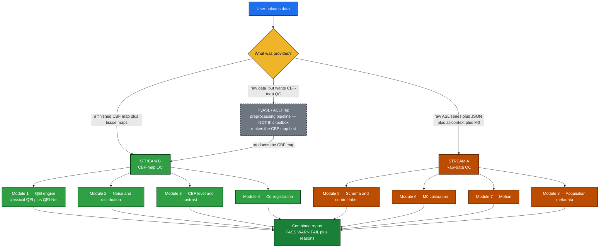

<div align="center">

# Quality Check ToolBox v1.0 — QC Design

### Automatic PASS / WARN / FAIL triage for ASL MRI — grade a scan before it pollutes a study
**Two streams · 8 modules + stretch · per-check inputs, outputs, method, verdict & sources**

</div>

---

## 🔭 Overview

ASL perfusion signal is about 1% of the image, so a substantial fraction of scans in large studies
(commonly cited around 10–20%) are corrupted. This toolbox takes a scan and returns a
**PASS / WARN / FAIL** verdict per check, with reasons, so bad data can be filtered automatically.

It is a **QC layer, not a full processing pipeline.** It grades data and does only light, QC-grade
derivation; the heavy work (CBF quantification, T1 segmentation, co-registration, motion correction) is
the preprocessing pipeline's job (PyASL / ASLPrep). For any input a check needs:

1. **use it** if the user uploaded it,
2. **derive it cheaply** if possible (e.g. a quick brain mask, default MNI tissue priors, motion from the raw 4D), else
3. the check returns **UNKNOWN** (which escalates the overall verdict to WARN — never a silent pass).

The work splits into **two streams**, each made of modules:

| Stream | Question | Modules |
|---|---|---|
| **Stream B — CBF-map QC** | "Is the final blood-flow map good?" | 1 QEI · 2 Noise & distribution · 3 CBF level & contrast · 4 Co-registration · (+ asymmetry, stretch) |
| **Stream A — Raw-data QC** | "Was the scan acquired correctly?" | 5 Schema & control-label · 6 M0 calibration · 7 Motion · 8 Acquisition metadata |

**Two design fixes folded in from review:**
- **QEI is in one place** — the classical QEI and the deep-learning QEI-Net are merged into **Module 1** (two ways to the same number), not split across two modules.
- **Co-registration is its own module (Module 4)** — it was wrongly filed under "CBF level & contrast." Dice/Jaccard *evaluate* a registration; they are not registration methods.



> **How to read the gray dashed box:** PyASL / ASLPrep is the **preprocessing pipeline — it is *not* part
> of this toolbox.** It turns raw scans into a CBF map. If a user only has raw data but wants CBF-map QC,
> the pipeline makes the map first, then **Stream B grades it.** That dashed box is exactly the boundary
> between "their job" (produce the map) and "our job" (grade it) — the toolbox sits **downstream**.

---

## 🧪 Real test data (3 vendor cases)

The design is validated against three real datasets — one per vendor/protocol. I measured each NIfTI
directly (full write-up in `DATASET_ANALYSIS.md`):

| Case | ASL | M0 | T1 | What it is |
|---|---|---|---|---|
| **GE 3D pCASL** (ADNI) | 128×128×40 **3D** (pre-subtracted ΔM) | ✓ separate | ✓ | a single difference image + M0, **no control/label pairs** |
| **Siemens 2D pCASL** | 80×80×20×**80** (control/label series) | ✗ **absent** | ✓ | 80-volume time series, **no separate M0** |
| **Siemens BS 3D pCASL** | 88×88×52×**16** (control/label series) | ✓ separate | ✓ | background-suppressed, the complete case |

> ⚠️ **Key finding that shaped the design:** the real data has **no BIDS JSON sidecars and no
> `aslcontext.tsv`** — just raw `.nii.gz`. So the **schema check degrades gracefully** when metadata is
> absent, and **data-type / vendor detection (8.2) becomes the critical first step** — it infers
> 2D-vs-3D, control/label-vs-pre-subtracted, M0 presence, and BS from the NIfTI shape, volume count,
> and filenames. The ASL grid is always coarser than the T1 (e.g. 1.88×1.88×4 mm vs 1 mm), which is
> exactly why the QEI needs the T1 segmentations co-registered + downsampled into ASL space.

---

## ⚖️ How the verdict works

Each check returns the same simple structure: a **metric** (the numbers it measured), a **verdict**
(`PASS`, `WARN`, `FAIL`, `UNKNOWN`, or `N/A`), and a one-line **reason**. A check returns **UNKNOWN**
when its required inputs are *missing but could in principle exist* and cannot be cheaply derived;
it returns **N/A** when the check is *structurally inapplicable* to this data type (e.g. a control/label
swap test on a pre-subtracted GE image that has no pairs). It never invents a PASS or FAIL. A few
routing checks (notably 8.2) also emit **INFO** — a description, not a judgment.

The overall verdict aggregates the individual checks with one rule:

- **any FAIL → overall FAIL**
- else **any WARN _or UNKNOWN_ → overall WARN**
- else **PASS**

**`N/A` and `INFO` are excluded from aggregation** — a check that *cannot apply* must not drag a clean
scan down (otherwise the GE pre-subtracted case, which has no time series, would be wrongly WARNed by
its inapplicable motion/swap checks). Only **UNKNOWN** escalates to WARN, because UNKNOWN means a check
that *should* have run *couldn't* — so the user knows the report is **incomplete** rather than mistaking
a missing check for a clean one. Every UNKNOWN check is listed in the report alongside its reason and
whether the missing input could be derived. All thresholds in the per-check specs are **provisional** wherever they are not taken
directly from a paper — those are tagged 🔧 and will be calibrated on real data

---

## 📤 Report & usage

**Default = full report.** By default the toolbox emits a complete report containing *every* metric
the provided inputs allow (QEI, spatial CoV, GM/WM ratio, GM/WM CBF level, SNR, histogram, motion,
co-registration, etc.), with each check's verdict and reason, plus the aggregated overall verdict.
Checks whose inputs are missing appear as UNKNOWN rather than being dropped.

**Optional = filter to specific checks.** The user may also select and run only specific checks
(e.g. "only SNR", or "only the CBF-map checks"). Both modes share the same per-check engine.

**Two deployment targets:**

- **Python library** (`pip install osipy-qc`) — runs entirely on the **user's own machine**. All heavy
  processing happens locally, data never leaves the institution (a real concern for clinical MRI), and
  there is **zero server cost** to host. This is the primary deployment and the natural home for the
  heavy path, since researchers already work in Python/terminal pipelines (ASLPrep, ExploreASL, PyASL).
- **Hosted website** — the user uploads data to a backend and gets a report, in the spirit of
  MRICloud. The website **starts on the light path** (QC math on files the user already provides —
  CBF map, motion parameters, masks), which runs comfortably on a free or low-cost tier. **In-backend
  heavy processing** (segmentation, co-registration, motion correction) is **deferred**: it is the only
  part that costs real money, so it is added later, behind the upload-vs-derive rule, when there is
  demand and budget. Until then, any input the backend cannot cheaply derive simply yields an UNKNOWN
  for that check — no compute spent.

---

# 🟢 STREAM B — QC of the CBF map *(Modules 1–4)*

## 🧪 Shared PRE-STEP (runs once, before any CBF-map check)

Every check in Stream B consumes the same prepared arrays, so the pre-step runs once
and caches its outputs:

1. **Resample tissue maps to CBF space** — GM/WM/CSF probability maps are resampled onto
   the CBF voxel grid (nearest/linear), so masks line up voxel-for-voxel with the CBF map.
2. **Brain-extraction fallback** *(design decision)* — if no brain mask is supplied, run a
   lightweight BET-style brain extraction directly on the CBF map, so the user does not
   have to bring a mask for the toolbox to run.
3. **Default tissue-prior fallback** *(design decision)* — if GM/WM/CSF probability maps
   are not supplied, warp **default MNI-space tissue priors** into the CBF space. Results
   are degraded versus subject-specific maps, but the pipeline does not refuse to run.
   Checks that strictly need real tissue maps (QEI, GM/WM level/ratio) are downgraded to
   "rough" and flagged in the report.
4. **Smoothing happens in exactly ONE place.** The QEI engine needs a 5 mm FWHM Gaussian-smoothed
   CBF map (Dolui 2024 fitted its constants and the ≈0.5 cutoff on 5 mm-smoothed data). ASLPrep's
   `compute_qei` smooths **internally** and its docstring says the input must **not** be pre-smoothed
   — so to avoid *double-smoothing* (which would break the ≈0.5 cutoff), the smoothing lives inside
   the QEI engine, not in this shared pre-step. Non-QEI checks use the unsmoothed map. *(osipy bans
   scipy, so the 5 mm smoother is a pure-NumPy separable Gaussian, σ = FWHM/2.355 in voxel units,
   validated against nibabel.)*
5. **Clean NaN / Inf** — replace non-finite voxels (set to 0 or exclude from masks) so no
   downstream statistic is poisoned.
6. **Build tissue masks** — threshold the probability maps into boolean GM/WM/CSF masks. Default to
   **prob > 0.7** to match the live QEI reference (ASLPrep `compute_qei` binarizes with a strict `>`
   at 0.7); **0.9** is offered as the paper-faithful option and exposed as config. *(Reading the
   actual code settled this: it is no longer an open question — see Module 1.)*

---

## 🟢 Module 1 — QEI engine ⭐

The QEI is one of the most extensively validated single CBF-map quality scores in the literature.
It now lives in **one place**: the classical QEI (Dolui 2024) and its deep-learning sibling **QEI-Net**
are just two ways to produce the *same* 0–1 number, so they belong in one module rather than split across two.

### 1. QEI engine · `REQUIRED` *(QEI-Net variant `STRETCH`)*

**🎯 what it checks:** produces a single 0–1 quality number that mimics a radiologist's
eye on the CBF map — computed two ways: classical QEI (Dolui 2024) and, as a stretch,
the deep-learning QEI-Net.

This is the **anchor** of Stream B (CBF-map QC) and merges what were previously two separate modules
(classical QEI and the QEI-Net DL score): both take the CBF map and tissue maps and emit
the same kind of 0–1 quality number, so they are one engine with two backends.

**(a) Classical QEI (Dolui 2024)** combines three sub-components by a geometric mean so a
single disaster collapses the whole score:

```
spCBF = 2.5·GM_prob + 1.0·WM_prob
ρ_ss  = Pearson(CBF, spCBF)  over voxels where CBF ≠ 0      # structural similarity
V     = [(n_gm−1)·var_gm + (n_wm−1)·var_wm + (n_csf−1)·var_csf] / (n_gm + n_wm + n_csf − 3)
DI    = V / |mean(GM CBF)|                                  # dispersion index
p     = #(GM voxels with CBF < 0) / #(GM voxels)            # negative-GM fraction

f₁(ρ) = 1 − e^(−3.0126·ρ^2.4419)
f₂(DI)= e^(−0.054·DI^0.9272)
f₃(p) = e^(−2.8478·p^0.5196)

QEI   = ( f₁ · f₂ · f₃ )^(1/3)                              # geometric mean, cutoff ≈ 0.5
```
*(Constants shown match the ASLPrep `compute_qei` reference implementation; the
paper-rounded forms are `3.0/2.4`, `0.1/0.9`, `2.8/0.5` )*

**(b) QEI-Net (deep-learning, `STRETCH`)** takes the same inputs (CBF map + tissue maps)
and returns a single learned quality score in 0–1, trained on expert ratings. It uses the
model's own calibrated cutoff rather than the geometric-mean formula. Shipped as an
optional plugin (a DL framework dependency that core osipy should not require).

> ⚠️ **Dependency note (design decision):** the classical QEI needs GM/WM/CSF tissue maps
> **in ASL space**. Obtaining them means segmenting a T1, co-registering it to the ASL
> space, and downsampling — roughly **5 minutes of compute per scan**. So they are either
> uploaded by the user or derived in the backend; if neither is possible the check is
> **UNKNOWN**.
>
> **📐 Real data confirms this:** in every test case the T1 is far finer than the ASL —
> GE ASL `1.88×1.88×4` mm vs T1 `1` mm; Siemens 2D `2.75×2.75×6` mm vs `1` mm; Siemens BS 3D
> `2.5` mm vs `0.8` mm. None ship with tissue maps in ASL space, so a CBF map alone here
> cannot produce a QEI until the T1 is segmented and resampled down to the ASL grid.

**📥 inputs:**
```python
{
  "cbf_map":  "NIfTI 3D float",     # mL/100g/min, smoothed 5 mm by the pre-step
  "gm_prob":  "NIfTI 3D float[0,1]",  # GM probability map in ASL space
  "wm_prob":  "NIfTI 3D float[0,1]",  # WM probability map in ASL space
  "csf_prob": "NIfTI 3D float[0,1]",  # CSF probability map in ASL space (for DI pooled var)
  "model":    "QEI-Net weights file (optional; only for the DL variant)",
}
```
**📤 output:**
```python
{
  "metric": {
    "qei": 0.76,                                  # classical QEI = (f1·f2·f3)^(1/3)
    "rho_ss": 0.80, "DI": 1.50, "negGM_fraction": 0.04,
    "f1": 0.83, "f2": 0.92, "f3": 0.59,           # f1=1-e^(-3.0126·ρ^2.4419); f2=e^(-0.054·DI^0.9272); f3=e^(-2.8478·negGM^0.5196)
    "qei_net": 0.85,                              # null if no model supplied
  },
  "verdict": "PASS | WARN | FAIL | UNKNOWN",
  "reason":  "QEI 0.76 above pass threshold",
}
```

**🔧 how I plan to compute it (method):**
1. Build the pseudo-CBF template `spCBF = 2.5·gm_prob + 1·wm_prob` from the **continuous** probability
   maps (CSF excluded). Apply the **exact reference mask** `(cbf != 0) & ~isnan(cbf) & ~isnan(spCBF)`,
   take `numpy.corrcoef(cbf, spCBF)[0,1]`, and clip to `[0, ∞)` (`np.clip(r, 0, None)`) → `ρ_ss`
   (matches ASLPrep `structural_pseudocbf_correlation` byte-for-byte).
2. Compute per-tissue variances with `numpy.var` inside the GM/WM/CSF masks, pool them
   with the `(n_k−1)` weighting, divide by `abs(mean(GM CBF))` → `DI`.
3. Count GM voxels with `cbf < 0` over total GM voxels → `p` (the negative-GM fraction).
4. Map each component through its fitted curve `f₁, f₂, f₃` (pure NumPy `exp`), take the
   geometric mean `(f₁·f₂·f₃)**(1/3)` → classical `qei`.
5. If a QEI-Net model file is provided, run the network on the same inputs to also emit
   `qei_net`; otherwise leave it null. The overall verdict uses the classical QEI by
   default, with QEI-Net reported alongside.
6. Guard edge cases: `n_k ≤ 1` per tissue, `mean(GM CBF) ≈ 0`, all-zero CBF → UNKNOWN.

**📊 PASS / WARN / FAIL:**
| outcome | condition |
|---|---|
| ✅ PASS | QEI ≥ 0.55 |
| ⚠️ WARN | 0.50 ≤ QEI < 0.55 (borderline) |
| ❌ FAIL | QEI < 0.50 |
| ❓ UNKNOWN | GM/WM/CSF tissue maps absent and not derivable |

**📍 thresholds & sources** *(📄 = paper with page · 🔧 = provisional, calibrate later · 🧮 = physics/definition)*:
- **cutoff approx 0.50 (ROC 0.53, 99% sens / 79% spec)** — 📄 Dolui 2024, p.2503 (PDF p.7)
- **curve `1 − e^(−3.0126·ρ^2.4419)`** — 📄 ASLPrep `compute_qei`; paper-rounded `3.0/2.4`, Dolui 2024 p.2501
- **curve `e^(−0.054·DI^0.9272)`** — 📄 ASLPrep `compute_qei`; paper-rounded `0.1/0.9`, Dolui 2024 p.2501
- **curve `e^(−2.8478·p^0.5196)`** — 📄 ASLPrep `compute_qei`; paper-rounded `2.8/0.5`, Dolui 2024 p.2500
- **spCBF = 2.5·GM + 1·WM, Pearson over CBF ≠ 0** — 📄 Dolui 2024 p.2500; ASLPrep `structural_pseudocbf_correlation`
- **var/mean (not std/mean) for DI** — 📄 Dolui 2024 p.2500 (so a scaling error is penalised)
- **geometric mean** — 🧮 definition: one near-zero component collapses the score
- **PASS 0.55 / WARN band 0.50–0.55** — 🔧 PASS is anchored at 0.55, *deliberately one notch above* the
  paper's validated ≈0.50 operating point (ROC 0.53), as a conservative provisional margin. This means a
  scan the paper would accept at 0.50–0.55 is downgraded to WARN rather than passed silently — **open to
  setting PASS = 0.50 to match the paper exactly** if you'd prefer.
- **QEI-Net cutoff** — 📄 Beltran Urbano et al., ISMRM 2025 *(conference abstract — citation/venue to confirm)*; uses the model's own calibrated threshold

**🔗 needs (dependency):** CBF map **and** GM/WM/CSF tissue maps in ASL space (uploaded or
backend-derived via segment + co-register + downsample). Without tissue maps → UNKNOWN.
The QEI-Net variant additionally needs the pretrained model file.

**🩺 catches:** overall map degradation — noise, scrambled data, CBF↔structural
misregistration, motion, wrong CBF scaling, and control/label swap (which drives the
negative-GM fraction toward 100% and collapses the score).

---

## 🟣 Module 2 — Noise & distribution

Two questions about the map's quality: how noisy is it, and does the GM blood-flow distribution look plausible?

### 2.1 Spatial CoV in GM · `REQUIRED` *(ExploreASL 3-tier classifier)*

**🎯 what it checks:** how spread-out are the GM CBF values across space — the 3-tier
clean/vascular/macrovascular classification.

**📥 inputs:**
```python
{
  "cbf_map": "NIfTI 3D float",
  "gm_mask": "NIfTI 3D bool",   # whole-brain mask gives a rough version if no GM mask
}
```
**📤 output:**
```python
{
  "metric":  {"sCoV": 0.40, "tier": "CBF-contrast"},
  "verdict": "PASS | WARN | FAIL | UNKNOWN",
  "reason":  "sCoV 0.40 within CBF-contrast tier",
}
```

**🔧 how I plan to compute it (method):**
1. Select GM voxels with `cbf_map[gm_mask]`, then keep **positive** values only (negatives
   drag the mean toward 0 and make the ratio explode).
2. Compute `numpy.std` and `numpy.mean` over those positive GM voxels.
3. `sCoV = std / mean` (report as a fraction and as a percentage).
4. Classify into the three ExploreASL tiers below.
5. If only a whole-brain mask is available (no real GM segmentation), still compute it but
   label the result "rough" in the report.

**📊 PASS / WARN / FAIL:**
| outcome | condition |
|---|---|
| ✅ PASS | sCoV < approx 0.55 → CBF-contrast (clean perfusion) |
| ⚠️ WARN | 0.55 ≤ sCoV ≤ 0.67 → vascular contrast (mixed signal) |
| ❌ FAIL | sCoV > 0.67 → macrovascular-dominant (unusable for CBF) |
| ❓ UNKNOWN | no GM or brain mask available |

**📍 thresholds & sources** *(📄 = paper with page · 🔧 = provisional, calibrate later · 🧮 = physics/definition)*:
- **0.67 cut-off** — 📄 ExploreASL (Mutsaerts 2020), p.5: "macrovascular signal predominates ... spatial CoV above 0.67"
- **0.55 lower boundary** — 🔧 provisional, set just below the Mutsaerts 2017 cohort mean
- **cohort context 56.9 ± 13.2%** — 📄 Mutsaerts 2017, p.3186 (186 elderly; r = 0.85 with ATT)
- **sCoV = std/mean** — 🧮 definition

**🔗 needs (dependency):** CBF map **and** a GM mask (or, for a rough version, a whole-brain
mask). Without any mask → UNKNOWN.

**🩺 catches:** macrovascular artifacts from long arterial transit time — blood pools in
arteries so some voxels are bright and others dark, raising the spatial spread.

---

### 2.2 SNR · `REQUIRED` *(tSNR variant `STRETCH`)*

**🎯 what it checks:** is the signal strong relative to the noise (spatial SNR on a single
map; temporal SNR if a 4D series is provided)?

**📥 inputs:**
```python
{
  "cbf_map": "NIfTI 3D float",
  "gm_mask": "NIfTI 3D bool",
  "cbf_4d":  "NIfTI 4D float (optional, for tSNR)",
}
```
**📤 output:**
```python
{
  "metric":  {"spatial_SNR": 2.5, "tSNR": 9.0},   # tSNR null if no 4D series
  "verdict": "PASS | WARN | FAIL | UNKNOWN",
  "reason":  "SNR within typical range",
}
```

**🔧 how I plan to compute it (method):**
1. Spatial SNR = `mean(cbf_map[gm_mask]) / std(cbf_map[gm_mask])` (pure NumPy on one map).
2. If a 4D series `cbf_4d` is supplied: compute per-voxel `mean / std` along the time axis,
   then average that within the GM mask → tSNR.
3. Note spatial SNR is exactly `1/sCoV` (same information inverted); the genuinely
   additive metric is tSNR, which is why tSNR is the stretch goal worth pursuing.
4. Report numbers without a hard cutoff for now — the pass/warn/fail boundary is set after
   calibrating on a real cohort.

**📊 PASS / WARN / FAIL:**
| outcome | condition |
|---|---|
| ✅ / ⚠️ / ❌ | higher SNR is better; no fixed numeric cutoff yet — set after seeing real data |
| ❓ UNKNOWN | tSNR is UNKNOWN if no 4D series is provided; spatial SNR is UNKNOWN if no GM/brain mask |

**📍 thresholds & sources** *(📄 = paper with page · 🔧 = provisional, calibrate later · 🧮 = physics/definition)*:
- **SNR = mean/std** — 📄 ExploreASL (standard definition)
- **no numeric threshold yet** — 🔧 deliberately provisional until calibrated on a real cohort

**🔗 needs (dependency):** CBF map **and** a GM/brain mask for spatial SNR; a 4D CBF series
for tSNR. Missing the 4D series → tSNR is UNKNOWN (spatial SNR still reported).

**🩺 catches:** low-signal / noisy acquisitions.

---

### 2.3 Histogram plausibility · `REQUIRED`

**🎯 what it checks:** does the shape of the GM CBF distribution look healthy (a supporting
check that corroborates the QEI and negative-fraction flags)?

**📥 inputs:**
```python
{
  "cbf_map": "NIfTI 3D float",
  "gm_mask": "NIfTI 3D bool",   # CBF map alone gives a rough whole-brain version
}
```
**📤 output:**
```python
{
  "metric":  {"mean": 55.0, "median": 56.0, "skewness": 0.20, "neg_pct": 2.0},
  "verdict": "PASS | WARN | FAIL | UNKNOWN",
  "reason":  "distribution shape healthy",
}
```

**🔧 how I plan to compute it (method):**
1. Select GM CBF values (or whole-brain values for the rough version).
2. Compute `numpy.mean`, `numpy.median`, and `% negative` directly.
3. Compute skewness in **pure NumPy** (osipy bans scipy):
   `skewness = mean(((x − mean)/std)**3)`. Positive skew = tail to the right (normal);
   negative skew = tail to the left.
4. Treat the result as supporting evidence — it does not FAIL standalone, but a strong
   left-skew combined with many negatives raises a WARN-level hint of noise / failed
   labeling that backs up the QEI and negative-GM checks.

**📊 PASS / WARN / FAIL:**
| outcome | condition |
|---|---|
| ✅ PASS | distribution shape healthy (slight positive skew, few negatives) |
| ⚠️ WARN | strong left-skew **and** many negative voxels → noise / failed labeling hint |
| ❌ FAIL | (no standalone FAIL — supporting check that corroborates QEI and negative-fraction) |
| ❓ UNKNOWN | no CBF voxels available (empty mask) |

**📍 thresholds & sources** *(📄 = paper with page · 🔧 = provisional, calibrate later · 🧮 = physics/definition)*:
- **shape interpretation** — 🔧 ExploreASL-style histogram QC (general practice; no single cutoff paper)
- **skewness = mean(((x−μ)/σ)³)** — 🧮 standard statistics definition

**🔗 needs (dependency):** CBF map (works alone for a rough version); a GM mask sharpens it
to per-tissue. Empty/absent mask with no usable voxels → UNKNOWN.

**🩺 catches:** severe noise or failed labeling, which show up as a heavy left tail plus
many negative voxels.

---

## 🔵 Module 3 — CBF level & contrast

Are the absolute CBF numbers physiologically sensible and is tissue contrast right? *(Co-registration was removed from here — it is now its own Module 4.)*

### 3.1 Mean / median GM & WM CBF · `REQUIRED`

**🎯 what it checks:** are the absolute CBF numbers in gray matter and white matter
physiologically sensible?

**📥 inputs:**
```python
{
  "cbf_map": "NIfTI 3D float",
  "gm_mask": "NIfTI 3D bool",
  "wm_mask": "NIfTI 3D bool",
  "population_profile": "adult_brain",   # selects the per-population x per-organ threshold table
}
```
**📤 output:**
```python
{
  "metric": {
    "mean_gm_cbf": 55.0, "median_gm_cbf": 54.5,
    "mean_wm_cbf": 22.0, "median_wm_cbf": 21.8,
    "gm_in_range": True, "wm_in_range": True,
  },
  "verdict": "PASS | WARN | FAIL | UNKNOWN",
  "reason":  "GM (55) and WM (22) both within healthy adult ranges",
}
```

**🔧 how I plan to compute it (method):**
1. Take `cbf_map[gm_mask]` and `cbf_map[wm_mask]` and compute `numpy.mean` and
   `numpy.median` for each tissue.
2. Look up the WARN/FAIL bounds from the selected `population_profile` (brain v1.0 here;
   kidney/placenta get their own profiles since their normal CBF ranges differ entirely).
3. Score GM and WM **separately** against their own per-tissue ranges (one range cannot
   fit both tissues).
4. Combine: overall verdict is the **worst** of the GM and WM outcomes.
5. For clinical low-perfusion cohorts, prefer WARN over FAIL to avoid auto-excluding
   genuinely low-flow patients.

**📊 PASS / WARN / FAIL:**
| outcome | condition |
|---|---|
| ✅ PASS | GM in 40–100 **and** WM in 15–30 mL/100g/min |
| ⚠️ WARN | GM outside 40–100 *or* WM outside 15–30 (but not absurd) |
| ❌ FAIL | GM < 10 or > 150 *or* WM < 5 or > 50 (physiologically absurd) |
| ❓ UNKNOWN | no GM/WM masks available (even after the prior fallback) |

**📍 thresholds & sources** *(📄 = paper with page · 🔧 = provisional, calibrate later · 🧮 = physics/definition)*:
- **GM 40–100 mL/100g/min** — 📄 ASL White Paper (Alsop 2015), p.17 QA section: "gray matter CBF values from 40–100 ml/min/100ml can be normal"
- **WM 15–30 mL/100g/min** — 🔧 community convention (ASLPrep GM/WM means; QEI template weights GM approx 2.5x WM); per-tissue because one range cannot fit both
- **absurd bounds (GM <10 or >150, WM <5 or >50)** — 🔧 provisional engineering
- **population AND organ dependent** — 🔧 design decision: brain v1.0 here; non-brain organs get their own config profiles

**🔗 needs (dependency):** CBF map **and** GM and WM masks. Without tissue masks → UNKNOWN.

**🩺 catches:** bad M0 calibration, global labeling failure, wrong CBF scaling — values
wildly off usually mean a calibration problem, not biology.

---

### 3.2 GM/WM CBF ratio · `REQUIRED`

**🎯 what it checks:** is gray matter clearly brighter than white matter (is there
perfusion contrast)?

**📥 inputs:**
```python
{
  "cbf_map": "NIfTI 3D float",
  "gm_mask": "NIfTI 3D bool",
  "wm_mask": "NIfTI 3D bool",
}
```
**📤 output:**
```python
{
  "metric":  {"gm_wm_ratio": 2.5},
  "verdict": "PASS | WARN | FAIL | UNKNOWN",
  "reason":  "good GM/WM contrast (ratio 2.5)",
}
```

**🔧 how I plan to compute it (method):**
1. Compute `mean(cbf_map[gm_mask])` and `mean(cbf_map[wm_mask])` with `numpy.mean`.
2. If `mean WM ≈ 0` (degenerate denominator) → return UNKNOWN rather than a divide-by-zero.
3. `ratio = mean_gm / mean_wm`.
4. Score against the contrast bands below. This metric is **scale-independent**, so it
   stays valid even when check 3.1 (absolute level) fails from a wrong M0 — they catch
   different failures.

**📊 PASS / WARN / FAIL:**
| outcome | condition |
|---|---|
| ✅ PASS | ratio > 1.5 (healthy approx 2–2.5) |
| ⚠️ WARN | 1 < ratio ≤ 1.5 (weak contrast) |
| ❌ FAIL | ratio ≤ 1 (no contrast or inverted) |
| ❓ UNKNOWN | mean WM CBF approx 0, or masks missing |

**📍 thresholds & sources** *(📄 = paper with page · 🔧 = provisional, calibrate later · 🧮 = physics/definition)*:
- **ratio greater than 1 expected** — 📄 ASLPrep (Adebimpe 2022), p.10: "the ratio ... is expected to be greater than 1"
- **healthy approx 2–2.5** — 📄 Dolui 2024 (GM approx 2.5x WM, the spCBF weighting)
- **1.5 WARN boundary** — 🔧 provisional

**🔗 needs (dependency):** CBF map **and** GM and WM masks. Without them, or with mean WM
approx 0 → UNKNOWN.

**🩺 catches:** loss of tissue contrast from poor labeling or motion smearing — and an
inverted ratio (ratio < 1) which signals a control/label swap or failed subtraction.

---

### 3.3 Negative-GM fraction · `REQUIRED`

**🎯 what it checks:** what fraction of GM voxels have physically-impossible negative CBF —
reported standalone (it is the same `p` the QEI engine consumes internally).

**📥 inputs:**
```python
{
  "cbf_map": "NIfTI 3D float",
  "gm_mask": "NIfTI 3D bool",
}
```
**📤 output:**
```python
{
  "metric":  {"negGM_fraction": 0.03, "n_negative": 3, "n_gm": 100},
  "verdict": "PASS | WARN | FAIL | UNKNOWN",
  "reason":  "3% negative voxels (within normal range)",
}
```

**🔧 how I plan to compute it (method):**
1. Select GM voxels with `cbf_map[gm_mask]`.
2. Count voxels where `cbf < 0` with `numpy.count_nonzero(values < 0)`.
3. `p = n_negative / n_gm`. Count only **inside** the GM mask — WM naturally has more
   noise-driven negatives, so including it would inflate `p`.
4. Score against the standalone bands below. (Inside the QEI engine this same `p` feeds
   `f₃(p)`; here it is exposed on its own so a swap is obvious in the report.)

**📊 PASS / WARN / FAIL:**
| outcome | condition |
|---|---|
| ✅ PASS | p ≤ 10% of GM voxels negative |
| ⚠️ WARN | 10% < p ≤ 20% |
| ❌ FAIL | p > 20% (approx 100% indicates a control/label swap) |
| ⊘ N/A | input is a raw pre-subtracted ΔM, not a quantified CBF map (see real-data note) |
| ❓ UNKNOWN | no GM mask available |

**📍 thresholds & sources** *(📄 = paper with page · 🔧 = provisional, calibrate later · 🧮 = physics/definition)*:
- **definition `p = #(GM CBF < 0) / #GM`** — 📄 Dolui 2024 p.2500 ("we did not consider WM")
- **standalone 10% / 20% cut-offs** — 🔧 provisional engineering (not from a paper); calibrate on data later

**📐 Real data:** this check is only meaningful on a **quantified CBF map**. A raw pre-subtracted ΔM
(like the **GE** case) legitimately contains noise-driven negatives, so 3.3 is marked **N/A** until CBF
is quantified — running it on ΔM would mislabel a clean product image. *(Measured: the GE ΔM negative
fraction over the brain was ≈0.0%, but that's not a guarantee — the gate is data-type, not the number.)*

**🔗 needs (dependency):** CBF map **and** GM mask. Without a GM mask → UNKNOWN.

**🩺 catches:** failed subtraction, severe noise, and the control/label swap (which drives
the fraction toward approx 100% negative).

---

## 🟦 Module 4 — Co-registration *(its own module now)*

Co-registration is **not** part of CBF level & contrast — it gets its own module. Dice and Jaccard are **evaluation indices that grade an existing registration, not registration methods.**

### 4.1 Co-registration quality — Dice & Jaccard · `REQUIRED`

**🎯 what it checks:** whether the ASL/CBF image and the structural (T1) image are actually aligned in the same space, by measuring how well their brain (or tissue) masks overlap.

**📥 inputs:**
```python
{
  "cbf_brain_mask":                 NIfTI 3D bool,   # brain/tissue mask from the ASL/CBF image
  "struct_brain_mask_in_cbf_space": NIfTI 3D bool,   # T1/structural mask warped into CBF space
  # both masks MUST already be in the same voxel grid/space; if only the images are
  # provided, brain masks can be derived (BET-style) before comparison
}
```
**📤 output:**
```python
{
  "metric": { "dice": 0.93, "jaccard": 0.87,
              "n_cbf_voxels": 110000, "n_struct_voxels": 105000, "n_intersection": 100000 },
  "verdict": "PASS | WARN | FAIL | UNKNOWN",
  "reason": "CBF and structural masks well-aligned, Dice 0.93"
}
```

**🔧 how I plan to compute it (method):**
1. **Frame what this measures.** **Dice and Jaccard are EVALUATION indices that grade an existing registration — they are NOT registration methods.** They do not align anything; they score how well two already-registered masks overlap. So this module presupposes a registration was performed (by the pipeline, not by us) and reports a quality number for it.
2. **Get two masks in one space.** Take the ASL/CBF brain (or tissue) mask and the structural T1 brain mask **warped into the same CBF space**. Both masks must be provided or derivable; if only the raw images are present I'll run a lightweight BET-style brain extraction on each to build the masks before comparing.
3. **Boolean overlap, pure NumPy.** Compute `intersection = numpy.logical_and(A, B).sum()`, `|A| = A.sum()`, `|B| = B.sum()`, `union = numpy.logical_or(A, B).sum()`.
4. **Compute the indices.** `Dice = 2·intersection / (|A| + |B|)` and `Jaccard = intersection / union`. No scipy needed.
5. **Map to a verdict** on the Dice value, and surface the raw voxel counts so a human can sanity-check a borderline case.

**📊 PASS / WARN / FAIL:**
| outcome | condition |
|---|---|
| ✅ PASS | Dice ≥ 0.9 (well aligned) |
| ⚠️ WARN | 0.7 ≤ Dice < 0.9 (mild misalignment) |
| ❌ FAIL | Dice < 0.7 (misregistration) |
| ❓ UNKNOWN | no structural (T1) mask provided and none derivable → cannot compare |

**📍 thresholds & sources** *(📄 = paper with page · 🔧 = provisional, calibrate later · 🧮 = physics/definition)*:
- **Dice and Jaccard as the registration-quality metric** — 📄 ASLPrep (Adebimpe 2022, p.10): *"ASLPrep calculates the mask overlap, spatial correlation, Dice coefficient and Jaccard index for each step of registration."*
- **Dice and Jaccard formulas** — 🧮 standard set-overlap definitions; not tunable.
- ⚠️ **code-vs-docs note (from reading the live ASLPrep source):** the actual `compute_qei`/coreg code computes **Dice + Pearson-on-binarized-masks + Szymkiewicz–Simpson overlap** — it does **not** implement Jaccard or cross-correlation despite the paper/`outputs.rst` listing them. Dice and Jaccard are monotonically related (`J = D/(2−D)`), so I keep both as scipy-free standard indices; just don't expect them voxel-identical to an ASLPrep TSV column that doesn't exist.
- **0.9 / 0.7 cut-offs** — 🔧 provisional engineering. ASLPrep reports these numbers but does not fix a pass/fail line, so these boundaries are placeholders to calibrate on real data.

**🔗 needs (dependency):** **both** a structural (T1) brain/tissue mask **and** an ASL/CBF brain/tissue mask, in the **same space**. Either uploaded directly, or derived (BET-style) from the corresponding images. If the structural mask is missing and cannot be derived, the check is **UNKNOWN** ("missing T1/structural mask").

**🩺 catches:** misregistration between the CBF map and the anatomy. If the two are not aligned, tissue masks land on the wrong tissue and **every downstream tissue-based metric breaks** — GM/WM CBF, GM/WM ratio, and the QEI all silently become meaningless.

---

# 🟠 STREAM A — QC of the raw data *(Modules 5–8)*

---

## 🟠 Module 5 — Schema & control-label

Is the upload well-formed, and is the most dangerous error — a control/label swap — present?

### 5.1 BIDS schema check · `REQUIRED`

**🎯 what it checks:** does the upload follow ASL-BIDS closely enough that we can actually parse it (required files and JSON fields present)?

**📥 inputs:**
```python
{
  "asl_json_path":    "/path/sub-01_asl.json",
  "aslcontext_path":  "/path/sub-01_aslcontext.tsv",
}
```
**📤 output:**
```python
{
  "metric": {
    "missing_files":  [],
    "missing_fields": [],
    "labeling_type": "PCASL", "pld_ms": 1800, "ld_ms": 1800,
  },
  "verdict": "PASS | WARN | FAIL | UNKNOWN",
  "reason":  "BIDS schema complete",
}
```

**🔧 how I plan to compute it (method):**
1. Check the two structural files exist on disk — the JSON sidecar and `aslcontext.tsv`. If either is absent, this is a hard FAIL (we cannot parse the dataset at all).
2. Load the JSON sidecar with the standard library `json` module (no heavy deps).
3. Test for the presence of the required ASL-BIDS fields — for PCASL that is `ArterialSpinLabelingType`, `PostLabelingDelay`, and `LabelingDuration`; collect any that are missing into `missing_fields`.
4. Parse `aslcontext.tsv` (a one-column TSV of volume types) to confirm it is readable.
5. Emit PASS if everything is present, WARN if a non-blocking field is missing, FAIL if a structural file is absent.

**📊 PASS / WARN / FAIL:**
| outcome | condition |
|---|---|
| ✅ PASS | all required BIDS files and fields present |
| ⚠️ WARN | a required JSON field is missing (e.g. `PostLabelingDelay`) |
| ❌ FAIL | `aslcontext.tsv` or the JSON sidecar is absent |
| ❔ UNKNOWN | neither file is readable / not a recognizable BIDS layout |

**📍 thresholds & sources** *(📄 = paper with page · 🔧 = provisional, calibrate later · 🧮 = physics/definition)*:
- **required fields** (`ArterialSpinLabelingType`, `PostLabelingDelay`, `LabelingDuration`, `TotalAcquiredPairs`) — 📄 ASL-BIDS (Clement 2022, p.3)
- **pass/fail logic** — 🧮 binary presence test, nothing to tune

**🔗 needs (dependency):** the JSON sidecar and `aslcontext.tsv` must be present and readable. If neither can be located or parsed, the check is **UNKNOWN**.

**🩺 catches:** missing JSON sidecars, a missing `aslcontext.tsv`, or missing required acquisition fields — the upstream problems that would make every later check crash or guess.

**📐 Real data:** all three test cases (GE, Siemens 2D, Siemens BS 3D) ship as **raw `.nii.gz` with no JSON and no `aslcontext.tsv`**. So this check **does not hard-fail on missing BIDS** — it records "no sidecar" and hands off to data-type detection (8.2), which infers what it can from the NIfTI shape and filenames.

---

### 5.2 Volume / pair integrity · `REQUIRED`

**🎯 what it checks:** the number of rows in `aslcontext.tsv` matches the number of NIfTI volumes, and control/label volumes come in even pairs.

**📥 inputs:**
```python
{
  "aslcontext_path": "/path/sub-01_aslcontext.tsv",
  "nifti_header":    nibabel header,   # or { "n_volumes": int }
}
```
**📤 output:**
```python
{
  "metric": {
    "n_rows": 50, "n_volumes": 50,
    "n_control": 25, "n_label": 25, "pairs_even": True,
    "case": "control/label",   # | "deltam" | "cbf"
  },
  "verdict": "PASS | WARN | FAIL | UNKNOWN",
  "reason":  "row/volume counts match, pairs even",
}
```

**🔧 how I plan to compute it (method):**
1. Count the data rows in `aslcontext.tsv` (one row per volume type).
2. Read the 4th dimension of the NIfTI header to get `n_volumes` (no need to load voxel data — the header alone gives the shape).
3. Compare `n_rows == n_volumes`; a mismatch means a truncated or corrupt acquisition → FAIL.
4. Tally the `control` and `label` rows; if their counts are unequal or the total is odd, FAIL (control/label must be paired).
5. Inspect the distinct row labels to detect the `aslcontext` **case** — `control/label` (proceed to swap check 5.3), `deltam` (already subtracted → skip swap), or `cbf` (already a CBF map → route to the CBF-map checks (Stream B)).

**📊 PASS / WARN / FAIL:**
| outcome | condition |
|---|---|
| ✅ PASS | aslcontext rows == NIfTI volumes **and** control/label count is even |
| ❌ FAIL | row/volume mismatch **or** an odd number of control/label volumes |
| ❔ UNKNOWN | NIfTI header or `aslcontext.tsv` unreadable |

**📍 thresholds & sources** *(📄 = paper with page · 🔧 = provisional, calibrate later · 🧮 = physics/definition)*:
- **row-count == volume-count rule** — 📄 ASL-BIDS (Clement 2022)
- **even-pair rule** — 🧮 definition: control and label are acquired in pairs, so the count must be even

**🔗 needs (dependency):** a readable `aslcontext.tsv` and a NIfTI header (or an explicit `n_volumes`). Missing either → **UNKNOWN**.

**🩺 catches:** truncated or corrupt acquisitions (a scan that stopped early, a dropped volume, or a mislabeled `aslcontext`).

---

### 5.3 Control vs Label swap · `REQUIRED`

**🎯 what it checks:** is the control/label ordering correct — i.e. mean(control) > mean(label) when background suppression is OFF — or has it been swapped?

**📥 inputs:**
```python
{
  "asl_4d":                 NIfTI 4D float,
  "aslcontext_rows":        ["control", "label", "control", ...],
  "background_suppression": False,   # bool, from the JSON sidecar
}
```
**📤 output:**
```python
{
  "metric": {
    "mean_control": 1000.0, "mean_label": 990.0,
    "diff": 10.0, "swap_detected": False,
  },
  "verdict": "PASS | FAIL | UNKNOWN",
  "reason":  "control brighter than label (no swap)",
}
```

**🔧 how I plan to compute it (method):**
1. First gate on background suppression — if BS is ON for the ASL series, the control/label intensity comparison is not meaningful, so return UNKNOWN/skip. Same for `deltam`/`cbf` cases (no control/label series).
2. Use `aslcontext_rows` to index which volumes of `asl_4d` are control and which are label.
3. Compute `mean(control_volumes)` and `mean(label_volumes)` with `numpy.mean` over each subset.
4. Physically, the control image keeps full tissue signal while the label is slightly suppressed by the inverted blood, so we expect mean(control) > mean(label).
5. If mean(label) > mean(control), flag a swap (FAIL) — this is the single most dangerous ASL error because subtraction then runs backwards and CBF comes out globally negative.

**📊 PASS / WARN / FAIL:**
| outcome | condition |
|---|---|
| ✅ PASS | mean(control) > mean(label)  *(BS OFF or unknown)* |
| ❌ FAIL | mean(label) > mean(control) → swap → globally negative CBF |
| ⊘ N/A | structurally inapplicable: background suppression is ON, or data is `deltam` / `cbf` / GE difference-only (no control/label pairs) — *excluded from the overall verdict* |

**📍 thresholds & sources** *(📄 = paper with page · 🔧 = provisional, calibrate later · 🧮 = physics/definition)*:
- **control brighter than label** — 🧮 physics: the control keeps full signal, the label is slightly suppressed by inverted blood
- **the swap-detection idea** — 📄 SCORE (Dolui 2017): structural-correlation outlier logic; no tunable number
- **assumed-BS-off when unknown** — 🔧 with no sidecar the detector returns BS = `true` or `unknown` (never a confident `false`); the swap test runs under an explicit *assumed-BS-off* default and the report states the assumption

**🔗 needs (dependency):** the 4D series, the `aslcontext` rows, and the `BackgroundSuppression` flag. If BS is ON or there is no control/label series (e.g. GE difference-only, gated by **8.2**), this check is **N/A** (not UNKNOWN — it cannot apply, so it does not affect the verdict).

**🩺 catches:** a swapped control/label order — the catastrophic case where every CBF value flips negative.

**📐 Real data:** on the **Siemens 2D** series (no BS) the even-vs-odd volume means are **455.3 vs 452.4** — control is brighter by just **0.63%** (the famous ~1% ASL "whisper"), so no swap, but the margin is tiny and the check must be noise-robust. Two caveats this data exposed: (1) with **no `aslcontext.tsv`**, the order isn't known — the physics ("control is brighter") is what decides which half is control; (2) on the **Siemens BS 3D** series the difference is **7%** (BS suppresses static tissue, so the perfusion difference is a bigger fraction) — which is exactly why this check is **skipped under background suppression**.

---

## 🟦 Module 6 — M0 calibration

M0 is the denominator in `CBF = (control − label)/M0 × constants`, so any M0 error scales every voxel.

### 6.1 M0 present + type detection · `REQUIRED`

**🎯 what it checks:** is there an M0 calibration reference, and what kind is it (separate file, in-series m0scan, estimated, GE difference-only, or none)?

**📥 inputs:**
```python
{
  "dataset_files":   [...],          # file listing of the upload
  "aslcontext_rows": [...],
  "manufacturer":    "Siemens" | "Philips" | "GE" | None,
}
```
**📤 output:**
```python
{
  "metric": {
    "m0_type": "separate",   # | "m0scan" | "estimated" | "GE-diff-only" | "none"
    "m0_path": "/path/sub-01_m0scan.nii.gz",
  },
  "verdict": "PASS | WARN | UNKNOWN",
  "reason":  "separate M0 detected",
}
```

**🔧 how I plan to compute it (method):**
1. Scan the uploaded file listing for a standalone `*_m0scan.nii.gz` → classify as `"separate"`.
2. If not found, inspect `aslcontext_rows` for an `m0scan` entry inside the 4D series → classify as `"m0scan"`.
3. Use the manufacturer field to detect the GE case — GE often ships a single pre-subtracted difference image plus an M0, so flag `"GE-diff-only"` for routing.
4. If a calibration can only be approximated from the control volumes, mark `"estimated"`; if nothing usable exists, mark `"none"`.
5. PASS when a real M0 is present; WARN when there is none (calibration falls back to a default, which is limited). The detected `m0_type` and `m0_path` are what gate checks 6.2–6.5.

**📊 PASS / WARN / FAIL:**
| outcome | condition |
|---|---|
| ✅ PASS | an M0 is present (`separate` / `m0scan` / `GE-diff-only`) |
| ⚠️ WARN | no M0 → calibration falls back to a default (limited) |
| ❔ UNKNOWN | file listing / aslcontext not readable, so M0 presence cannot be determined |

**📍 thresholds & sources** *(📄 = paper with page · 🔧 = provisional, calibrate later · 🧮 = physics/definition)*:
- **M0 needed for calibration** — 📄 ASL White Paper (Section 6, PDF p.15): the recommended PD/M0 image
- **presence test** — 🧮 binary file/row detection

**🔗 needs (dependency):** the dataset file listing, the `aslcontext` rows, and (ideally) the manufacturer. Without a readable file list this is **UNKNOWN**. A detected M0 is itself the dependency for checks 6.2–6.5.

**🩺 catches:** a dataset with no calibration reference (which forces a degraded default-M0 path), and mis-typed M0 setups that would otherwise be quantified wrong.

**📐 Real data:** the **Siemens 2D** case has **no M0 file at all** → this check returns **WARN** and calibration falls back to deriving M0 from the control volumes — a real example of the upload-vs-derive rule. The **GE** and **Siemens BS 3D** cases each have a separate M0 → **PASS**.

---

### 6.2 M0 TR at least 5 s · `REQUIRED`

**🎯 what it checks:** was the M0 acquired with a long enough repetition time (TR ≥ 5 s) for tissue signal to recover — and if not, can the standard T1-recovery correction fix it?

**📥 inputs:**
```python
{
  "m0_json": { "RepetitionTimePreparation": 5.0, ... },
  "t1_tissue_seconds": 1.4,   # White Paper default
}
```
**📤 output:**
```python
{
  "metric": {
    "tr_seconds": 5.0,
    "correction_factor": 1.029,
  },
  "verdict": "PASS | WARN | UNKNOWN",
  "reason":  "TR = 5 s, no correction needed",
}
```

**🔧 how I plan to compute it (method):**
1. Read the M0 TR (`RepetitionTimePreparation`, or the relevant TR field) from the M0 JSON sidecar.
2. If TR ≥ 5 s, PASS — tissue magnetization has essentially fully recovered, so the M0 is a clean denominator.
3. If TR < 5 s, compute the White Paper correction factor `1 / (1 − exp(−TR / T1_tissue))` in pure NumPy, using the default `T1_tissue ≈ 1.4 s`.
4. Report the correction factor and WARN (not FAIL) — this is a *correctable* problem; the factor can scale the M0 back to full recovery, so we flag it rather than reject the scan.
5. If the TR field is absent, return UNKNOWN.

**📊 PASS / WARN / FAIL:**
| outcome | condition |
|---|---|
| ✅ PASS | M0 TR ≥ 5 s |
| ⚠️ WARN | TR < 5 s → flag and apply the T1-recovery correction `1 / (1 − e^(−TR/T1))` |
| ❔ UNKNOWN | no TR field in the M0 JSON |

**📍 thresholds & sources** *(📄 = paper with page · 🔧 = provisional, calibrate later · 🧮 = physics/definition)*:
- **the 5 s rule + the exact correction formula** — 📄 ASL White Paper (PDF p.15): *"If TR is less than 5s, the PD image should be multiplied by 1/(1 − e^(−TR/T1,tissue))"*
- **T1_tissue ≈ 1.4 s default** — 🧮 physics constant (overridable)

**🔗 needs (dependency):** the M0 JSON sidecar with a TR field. Missing TR → **UNKNOWN**.

**🩺 catches:** a too-fast M0 acquisition, which gives an artificially low calibration denominator and therefore inflated CBF — caught and corrected rather than silently passed.

---

### 6.3 M0 acquired WITHOUT background suppression · `REQUIRED`

**🎯 what it checks:** a simple flag — was the M0 calibration scan acquired *without* background suppression? An M0 acquired *with* BS is useless as a calibration reference.

**📥 inputs:**
```python
{
  "m0_json": { "BackgroundSuppression": False, ... },
}
```
**📤 output:**
```python
{
  "metric": { "bs_on_m0": False },
  "verdict": "PASS | FAIL | UNKNOWN",
  "reason":  "M0 acquired without background suppression",
}
```

**🔧 how I plan to compute it (method):**
1. Read the `BackgroundSuppression` field specifically from the **M0 scan's** JSON sidecar (not the ASL-pairs sidecar — the two volumes follow opposite rules).
2. If `BackgroundSuppression` is `false`, PASS.
3. If `BackgroundSuppression` is `true`, FAIL — BS crushes the static tissue signal that the M0 is supposed to provide as the calibration denominator, so the resulting CBF is over-estimated.
4. If the field is absent from the M0 sidecar, return UNKNOWN (we cannot assert either way).
5. This is purely a metadata flag — no voxel data is touched.

**📊 PASS / WARN / FAIL:**
| outcome | condition |
|---|---|
| ✅ PASS | M0 background suppression is OFF |
| ❌ FAIL | BS was ON during the M0 scan → tissue signal crushed → CBF over-estimated |
| ❔ UNKNOWN | no `BackgroundSuppression` field in the M0 JSON |

**📍 thresholds & sources** *(📄 = paper with page · 🔧 = provisional, calibrate later · 🧮 = physics/definition)*:
- **BS must be OFF for M0** — 📄 ASL White Paper (PDF p.15): *"No labeling or BS should be applied for this scan."* (Note the contrast: BS is *recommended* for the label/control pairs but *forbidden* for the M0 — different rules per volume.)
- **flag logic** — 🧮 binary read of one metadata field

**🔗 needs (dependency):** the M0 JSON sidecar with a `BackgroundSuppression` field. Missing field → **UNKNOWN**.

**🩺 catches:** an M0 mistakenly acquired with background suppression — a setup that quietly inflates every CBF value in the final map.

---

### 6.4 M0 saturation / clipping · `STRETCH`

**🎯 what it checks:** is the M0 image hitting the scanner's intensity ceiling (clipped voxels), which corrupts the calibration denominator?

**📥 inputs:**
```python
{
  "m0_image":   NIfTI 3D float,
  "brain_mask": NIfTI 3D bool,
}
```
**📤 output:**
```python
{
  "metric": { "clipping_pct": 0.2, "max_intensity": 4095 },
  "verdict": "PASS | FAIL | UNKNOWN",
  "reason":  "no significant clipping detected",
}
```

**🔧 how I plan to compute it (method):**
1. Load the M0 image voxels and the brain mask.
2. Find the maximum intensity value present inside the brain mask (a clipping ceiling such as 4095 for a 12-bit ADC tends to appear as a hard pile-up at one value).
3. Count tissue voxels sitting at (or within a tiny epsilon of) that maximum, using NumPy boolean indexing.
4. Divide by the number of tissue voxels to get `clipping_pct`.
5. FAIL if more than the provisional threshold (~5%) of tissue voxels are clipped; otherwise PASS. If no brain mask is available and one cannot be derived, return UNKNOWN.

**📊 PASS / WARN / FAIL:**
| outcome | condition |
|---|---|
| ✅ PASS | few voxels at the intensity ceiling |
| ❌ FAIL | greater than approx 5% of tissue voxels clipped at the maximum |
| ❔ UNKNOWN | no M0 image or no brain mask available/derivable |

**📍 thresholds & sources** *(📄 = paper with page · 🔧 = provisional, calibrate later · 🧮 = physics/definition)*:
- **clipping = bad denominator** — 🔧 standard QC heuristic
- **the 5% cut-off** — 🔧 provisional engineering, no canonical paper number; calibrate later

**🔗 needs (dependency):** the M0 image and a brain mask. If the M0 voxel data or a usable mask is absent, the check is **UNKNOWN**.

**🩺 catches:** ADC saturation / clipping in the M0 — voxels stuck at the maximum value, which biases the calibration and therefore the whole CBF map.

---

### 6.5 M0 geometry match · `STRETCH`

**🎯 what it checks:** does the M0 sit on the same voxel grid as the ASL series, so it can be used for per-voxel calibration without interpolation artifacts?

**📥 inputs:**
```python
{
  "m0_header":  nibabel header,
  "asl_header": nibabel header,
}
```
**📤 output:**
```python
{
  "metric": {
    "m0_voxel_size":  [3.4, 3.4, 4.0],
    "asl_voxel_size": [3.4, 3.4, 4.0],
    "match": True,
  },
  "verdict": "PASS | WARN | UNKNOWN",
  "reason":  "M0 and ASL on same voxel grid",
}
```

**🔧 how I plan to compute it (method):**
1. Read the voxel dimensions (and ideally the affine/shape) from both the M0 and the ASL NIfTI headers — no voxel data needed.
2. Compare voxel sizes within a small floating-point tolerance.
3. If they match, PASS — the M0 can divide the ASL difference voxel-for-voxel.
4. If they differ, WARN — calibration will require resampling the M0 onto the ASL grid, which introduces interpolation artifacts.
5. If either header is missing, return UNKNOWN.

**📊 PASS / WARN / FAIL:**
| outcome | condition |
|---|---|
| ✅ PASS | M0 sits on the same voxel grid as the ASL |
| ⚠️ WARN | grids differ → needs resampling (interpolation artifacts) |
| ❔ UNKNOWN | M0 or ASL header missing |

**📍 thresholds & sources** *(📄 = paper with page · 🔧 = provisional, calibrate later · 🧮 = physics/definition)*:
- **same readout / grid recommendation** — 📄 ASL White Paper (calibration section, PDF p.15)
- **grid comparison** — 🧮 header comparison, nothing to tune

**🔗 needs (dependency):** both the M0 header and the ASL header. Missing either → **UNKNOWN**.

**🩺 catches:** an M0 acquired on a different voxel grid than the ASL, which forces resampling and the interpolation artifacts that come with it.

**📐 Real data:** both cases that have an M0 pass cleanly — **GE** M0 `128×128×40` == ASL `128×128×40`, and **Siemens BS 3D** M0 `88×88×52` == ASL `88×88×52` → **6.5 PASS** for both.

---

## 🟥 Module 7 — Motion

Did the head move too much during the scan? Measured from motion parameters when they are uploaded, or derived from the raw 4D series when they are not.

### 7.1 Motion — FWD & DVARS · `REQUIRED`

**🎯 what it checks:** how much the head moved during the ASL acquisition, frame to frame, both in head position (FWD) and in image intensity (DVARS).

**📥 inputs:**
```python
{
  # EITHER the already-computed motion parameters from a processed folder ...
  "motion_params": np.ndarray (T, 6) float,   # 6-DOF per volume: 3 translations mm + 3 rotations rad
  "motion_format": "spm | fsl | pyasl | auto", # which package wrote them (auto-detect by default)
  # ... OR the 4D series so the backend can derive them by running motion correction:
  "asl_4d":        NIfTI 4D float,             # optional fallback, used only if motion_params absent
  "voxel_size_mm": [3.0, 3.0, 4.0],            # for DVARS / mm conversion
  "brain_mask":    NIfTI 3D bool,              # optional, restricts DVARS to brain voxels
}
```
**📤 output:**
```python
{
  "metric": {
    "mean_fwd": 0.18, "max_fwd": 0.55,         # framewise displacement, mm
    "pct_frames_over_thresh": 4.0,             # % of frames above the FWD spike cutoff
    "mean_dvars": 1.10,                        # intensity-based motion proxy
    "n_volumes": 16, "source": "fsl",          # which format was read/normalized
  },
  "verdict": "PASS | WARN | FAIL | UNKNOWN",
  "reason": "mean FWD 0.18 mm, 4% of frames flagged"
}
```

**🔧 how I plan to compute it (method):**
1. **Locate the motion parameters.** They are an **optimization output, not present in raw data** — they only exist after a rigid-body alignment of the ~16 ASL volumes. If the processed folder has them, read them; if it only has the 4D series and the backend is allowed to run, derive them via motion correction (borrow from PyASL), else return **UNKNOWN**.
2. **Normalize the format.** SPM, FSL, and PyASL store the 6-DOF parameters in **different formats** (SPM `rp_*.txt` is translations-mm then rotations-rad; FSL `*.par` from MCFLIRT is rotations-rad first then translations-mm; column order and units differ). I'll write a small **normalizer** that detects the format (by filename pattern, column count, and value-range heuristics) and returns a canonical `(T, 6)` array in `[tx, ty, tz, rx, ry, rz]` with translations in mm and rotations in radians.
3. **Compute FWD (Power 2012).** Convert each rotation to a displacement on a sphere of radius 50 mm (`disp = radius · angle`), then `FWD_t = Σ |Δtx| + |Δty| + |Δtz| + |Δrx'| + |Δry'| + |Δrz'|` across consecutive volumes — pure NumPy `diff` + `abs` + `sum`.
4. **Compute DVARS.** Root-mean-square of the per-voxel intensity change between consecutive volumes inside the brain mask (`sqrt(mean((I_t - I_{t-1})^2))`), again pure NumPy.
5. **Summarize.** Report mean/max FWD, the fraction of frames above the spike threshold, and mean DVARS; map to PASS/WARN/FAIL.

**📊 PASS / WARN / FAIL:**
| outcome | condition |
|---|---|
| ✅ PASS | mean FWD < ~0.2 mm **and** few flagged frames |
| ⚠️ WARN | mean FWD ~0.2–0.5 mm **or** a moderate fraction of frames spike |
| ❌ FAIL | mean FWD > ~0.5 mm **or** many high-motion frames |
| ❓ UNKNOWN | no motion parameters **and** the backend cannot run motion correction (no 4D series, or no compute) |

**📍 thresholds & sources** *(📄 = paper with page · 🔧 = provisional, calibrate later · 🧮 = physics/definition)*:
- **FWD definition (50 mm sphere, sum of abs frame-to-frame displacements)** — 📄 Power 2012 (*NeuroImage*); the framewise-displacement formula the field standardized on.
- **DVARS definition (RMS intensity change between volumes)** — 📄 Power 2012; intensity-domain companion to FWD.
- **mean-FWD ~0.2 / ~0.5 mm cut-offs** — 🔧 provisional engineering, not a paper line; ASL has only ~16 volumes (vs hundreds in fMRI), so these will be re-calibrated on real ASL data rather than borrowed wholesale from fMRI scrubbing thresholds.
- **50 mm sphere radius** — 🧮 convention (approximate average head radius) used to turn rotations into millimeters.

**🔗 needs (dependency):** 6-DOF motion parameters must be present in the processed folder **or** derivable from the 4D series by running motion correction in the backend. If neither is available, the check is **UNKNOWN** ("missing motion parameters").

**🩺 catches:** head motion during the scan — the dominant ASL artifact. Motion blurs the control-label subtraction, smears the GM/WM boundary, and injects spurious negative/over-bright voxels into the CBF map.

---

## 🔷 Module 8 — Acquisition metadata

Sanity checks on the acquisition parameters — plus the data-type detection (8.2) that routes every other check, and is the critical first step when there is no metadata to read.

### 8.1 Protocol plausibility vs White Paper Table 1 · `STRETCH`

**🎯 what it checks:** are the labeling type, post-labeling delay, and labeling duration sensible compared with the ASL White Paper Table 1 recommendations?

**📥 inputs:**
```python
{
  "asl_json": {
    "ArterialSpinLabelingType": "PCASL",
    "PostLabelingDelay": 1800,   # ms
    "LabelingDuration":  1800,   # ms
  },
  "subject_age": 35,   # optional, refines the recommended PLD
}
```
**📤 output:**
```python
{
  "metric": {
    "labeling_type": "PCASL", "pld_ms": 1800, "ld_ms": 1800,
    "recommended_pld_ms": 1800, "deviation_ms": 0,
  },
  "verdict": "PASS | WARN | UNKNOWN",
  "reason":  "params match White Paper recommendations",
}
```

**🔧 how I plan to compute it (method):**
1. Read `ArterialSpinLabelingType`, `PostLabelingDelay`, and `LabelingDuration` from the ASL JSON.
2. Look up the recommended PLD from the White Paper Table 1 by population — children 1500 ms, adults under 70 → 1800 ms, over 70 / clinical → 2000 ms, neonates → 2000 ms — using `subject_age` when provided (default to the adult value otherwise).
3. Compare the acquired PLD against the recommended value and record the deviation in ms.
4. Sanity-check the labeling duration (PCASL LD ≈ 1800 ms) and the labeling type.
5. PASS if parameters track the recommendations; WARN if they deviate substantially (e.g. a far-too-short PLD that invites transit-time artifacts).

**📊 PASS / WARN / FAIL:**
| outcome | condition |
|---|---|
| ✅ PASS | labeling type / PLD / LD match the White Paper recommendations |
| ⚠️ WARN | parameters implausible (e.g. PLD far from the recommended value for the population) |
| ❔ UNKNOWN | the labeling parameters are absent from the JSON |

**📍 thresholds & sources** *(📄 = paper with page · 🔧 = provisional, calibrate later · 🧮 = physics/definition)*:
- **recommended values** — 📄 ASL White Paper, Table 1 (PDF p.34): PCASL LD ≈ 1800 ms; PLD children 1500, adults < 70 → 1800, > 70 / clinical → 2000, neonates → 2000 ms
- **the "far from recommended" WARN boundary** — 🔧 provisional; the exact deviation tolerance is calibrated later

**🔗 needs (dependency):** the ASL JSON labeling fields (`ArterialSpinLabelingType`, `PostLabelingDelay`, `LabelingDuration`); `subject_age` is optional. Missing labeling fields → **UNKNOWN**.

**🩺 catches:** an implausible acquisition protocol — most importantly a PLD far shorter than recommended for the subject's age, which produces transit-time artifacts in the CBF map.

---

### 8.2 Data-type / vendor detection · `STRETCH`

**🎯 what it checks:** classifies the acquisition (2D vs 3D, PASL vs PCASL, BS on/off, vendor, M0 type) so the right checks run on the right data; it routes the rest of the raw-data checks (Stream A).

**📥 inputs:**
```python
{
  "asl_json":        { ...full BIDS JSON... },
  "nifti_dims":      (X, Y, Z, T),   # or (X, Y, Z)
  "aslcontext_rows": [...],
}
```
**📤 output:**
```python
{
  "metric": {
    "readout":                "3D",       # | "2D"
    "labeling_type":          "PCASL",    # | "PASL" | "CASL"
    "background_suppression": True,
    "manufacturer":           "Siemens",
    "m0_type":                "separate",
    "applicable_checks":      ["5.1", "5.2", "6.1", "6.2", "6.5"],
    "skipped_checks":         [],         # e.g. ["5.3"] for GE difference-only (→ N/A)
  },
  "verdict": "INFO",                      # routing description, excluded from the overall verdict
  "reason":  "data type classified — routing downstream checks",
}
```

**🔧 how I plan to compute it (method):**
1. Read the classifying axes from the JSON sidecar — `MRAcquisitionType` (2D/3D), `ArterialSpinLabelingType` (PASL/PCASL/CASL), `BackgroundSuppression`, and `Manufacturer`.
2. Cross-reference the NIfTI dimensions and `aslcontext_rows` to infer the series structure (a control/label series, a single pre-subtracted difference image, with or without a separate M0).
3. Pull in the M0 type from check 6.1 to complete the picture.
4. Build the `applicable_checks` and `skipped_checks` lists — crucially, **GE pre-subtracted difference data has no control/label series, so swap check 5.3 is marked not-applicable** (→ **N/A** downstream, excluded from the verdict — so a clean GE scan is not dragged to WARN).
5. This is an INFO/routing output — it never PASS/FAILs on its own and is excluded from aggregation; if the JSON is unreadable it falls back to inferring from the NIfTI shape + filenames (see real-data note below) rather than failing.

**📊 PASS / WARN / FAIL:**
| outcome | condition |
|---|---|
| ℹ️ INFO | not pass/fail — it classifies the data and routes the other checks |
| ❔ UNKNOWN | the JSON sidecar is unreadable, so the data type cannot be classified |

**📍 thresholds & sources** *(📄 = paper with page · 🔧 = provisional, calibrate later · 🧮 = physics/definition)*:
- **the data-type axes** (2D/3D, PASL/PCASL, BS, vendor, M0 type) — 📄 ASL White Paper, Sections 2 (labeling), 4 (BS), 5 (readout) (PDF pp.4–13)
- **routing logic** — 🧮 deterministic classification, nothing to tune

**🔗 needs (dependency):** the ASL JSON, the NIfTI dimensions, and the `aslcontext` rows. If the JSON cannot be read, classification (and therefore routing) is **UNKNOWN**. Note: GE difference-only data routes the swap check 5.3 to UNKNOWN.

**🩺 catches:** nothing on its own — it prevents *mis-application* of later checks (e.g. running a control/label swap test on data that has no control/label series), which would otherwise produce misleading verdicts.

**📐 Real data — this is the check that makes the no-metadata data usable.** With no JSON/aslcontext, it infers everything from the NIfTI shape + filenames:
- **GE**: PCASL is **3D** (no time axis) + a separate M0 → "pre-subtracted ΔM, GE" → gates OFF the swap check (5.3→N/A) and motion (no series).
- **Siemens 2D**: PCASL is **4D, 80 vols**, no M0 file → "control/label series, no M0" → derive M0, run motion + swap.
- **Siemens BS 3D**: PCASL is **4D, 16 vols** + M0 + the foldername flags BS → "BS 3D" → skip the swap check, run the full CBF-map path.

---

# ⚪ Advanced / stretch

Future checks, kept separate so nothing unrelated is mixed in.

### Left-right asymmetry · `STRETCH`

**🎯 what it checks:** is CBF roughly the same on the left and right hemispheres (a large
gap is flagged for human review, not auto-failed — it could be real pathology)?

> ⚠️ **Design note:** this **cannot** be done by splitting the image down the middle,
> because the head may be tilted in the scanner. It requires proper **left/right hemisphere
> masks**, which is why it is a stretch goal and returns UNKNOWN without them.

**📥 inputs:**
```python
{
  "cbf_map_symmetric_space": "NIfTI 3D float",
  "gm_mask_per_hemisphere":  {"left": "NIfTI 3D bool", "right": "NIfTI 3D bool"},
}
```
**📤 output:**
```python
{
  "metric":  {"asymmetry_index": 0.037, "cbf_left": 55.0, "cbf_right": 53.0},
  "verdict": "PASS | WARN | FAIL | UNKNOWN",
  "reason":  "near-symmetric perfusion",
}
```

**🔧 how I plan to compute it (method):**
1. Require explicit left/right hemisphere GM masks (uploaded or derived); never infer them
   by mirroring the image, because a tilted head breaks the midline assumption.
2. Compute `cbf_left = mean(cbf[left_mask])` and `cbf_right = mean(cbf[right_mask])`.
3. `AI = (cbf_left − cbf_right) / (0.5·(cbf_left + cbf_right))` (a normalized difference).
4. Treat a large `|AI|` as a **flag for human review** rather than an automatic FAIL — it
   may be genuine unilateral pathology (e.g. stroke); for known lesions prefer a
   contralateral comparison.

**📊 PASS / WARN / FAIL:**
| outcome | condition |
|---|---|
| ✅ PASS | small `|AI|` → near-symmetric perfusion |
| ⚠️ WARN | large left-vs-right asymmetry → flag for human review (could be real pathology) |
| ❌ FAIL | (no auto-fail — large asymmetry is a review flag, not a rejection) |
| ❓ UNKNOWN | no left/right hemisphere masks (cannot split down the middle) |

**📍 thresholds & sources** *(📄 = paper with page · 🔧 = provisional, calibrate later · 🧮 = physics/definition)*:
- **no fixed number** — 🔧 clinical heuristic; for known lesions prefer contralateral comparison
- **AI = (L − R) / (0.5·(L + R))** — 🧮 standard asymmetry-index definition

**🔗 needs (dependency):** CBF map in symmetric space **and** left/right hemisphere masks.
Without hemisphere masks → UNKNOWN.

**🩺 catches:** unilateral perfusion deficits (e.g. stroke) — surfaced for a human to
review rather than silently passed or failed.

---

# 🔗 Inputs → possible outputs (the dependency map)

Rows = what the user uploaded. Cells = which checks become possible (✓), become possible only **roughly** (~), or return **UNKNOWN** (✗). This is the explicit inputs-to-outputs map, delivered in text.

| What the user uploaded | QEI (classical) | QEI-Net (DL) | GM/WM CBF level | GM/WM ratio | Negative-GM frac | Spatial CoV | SNR | Histogram | Co-registration (Dice/Jaccard) | Asymmetry | Motion (FWD/DVARS) | Stream A raw checks |
|---|---|---|---|---|---|---|---|---|---|---|---|---|
| **CBF map only** | ✗ UNKNOWN (no tissue maps) | ✗ (needs tissue maps + model) | ✗ | ✗ | ✗ | ~ rough (whole-brain mask) | ~ rough | ~ rough | ✗ | ✗ | ✗ | ✗ |
| **CBF map + GM/WM/CSF probability maps** (in ASL space) | ✓ | ✓ | ✓ | ✓ | ✓ | ✓ | ✓ | ✓ | ✗ (no T1 mask) | ✗ (no hemisphere masks) | ✗ | ✗ |
| **CBF map + T1 + tissue maps** | ✓ | ✓ | ✓ | ✓ | ✓ | ✓ | ✓ | ✓ | ✓ (T1 mask vs ASL mask) | ✗ (still need hemisphere masks) | ✗ | ✗ |
| **CBF map + tissue maps + hemisphere masks** | ✓ | ✓ | ✓ | ✓ | ✓ | ✓ | ✓ | ✓ | depends on T1 | ✓ | ✗ | ✗ |
| **Raw 4D + JSON + aslcontext** (no CBF, no processing) | ✗ (until backend derives) | ✗ | ✗ | ✗ | ✗ | ✗ | ✗ | ✗ | ✗ | ✗ | ~ only if backend runs motion correction | ✓ all Stream A |
| **Processed folder with motion params** | ✗ (unless CBF also present) | ✗ | ✗ | ✗ | ✗ | ✗ | ✗ | ✗ | ✓ if masks present | ✗ | ✓ (normalize SPM/FSL/PyASL format) | partial |
| **Everything** (raw 4D + JSON + aslcontext + CBF + T1 + tissue maps + hemisphere masks + motion params) | ✓ | ✓ | ✓ | ✓ | ✓ | ✓ | ✓ | ✓ | ✓ | ✓ | ✓ | ✓ |

Reading the table:
- **CBF map alone** → only spatial CoV and histogram (and a rough SNR), all approximate because there is no tissue segmentation. No QEI, no GM/WM level/ratio, no negative-GM fraction.
- **CBF + tissue maps** → unlocks the QEI engine, GM/WM CBF level, GM/WM ratio, negative-GM fraction.
- **QEI-Net (DL)** additionally needs the **pretrained model file** — it is a stretch-goal plugin, not part of core osipy, so it stays ✗ on any row until that model is supplied.
- **Co-registration** needs a **T1 (structural) mask** to compare against the ASL mask.
- **Asymmetry** needs **left/right hemisphere masks** (cannot split the image down the middle).
- **Motion** needs **6-DOF motion parameters** — provided in a processed folder, or derived by running motion correction in the backend, with a normalizer across SPM/FSL/PyASL formats.

Anything a cell marks ✗ is reported as **UNKNOWN** with the reason ("missing GM/WM/CSF maps", "missing T1 mask", "missing hemisphere masks", "missing motion parameters"), and the user is told whether the backend can derive it.

---


