# osipy-qc v1.0: threshold sources by module

This document lists, for each quality-control module, the thresholds the toolbox uses and where every published number comes from. For any value taken from the literature, the exact sentence is highlighted on the source page. Values that have no published source are labelled plainly as engineering defaults, so it is always clear which numbers are grounded in evidence and which are provisional.

**How to read this.** A yellow box marks the exact sentence, or line of code, that a number is taken from. Each source falls into one of three kinds:

- **Published.** A peer-reviewed paper states the number for this purpose.
- **Implementation.** A reference pipeline's code uses the number (ASLPrep or ExploreASL). This is weaker than a paper, because a code choice is not always explained or peer-reviewed.
- **Uncalibrated.** An engineering default with no source. These never cause a scan to fail on their own.

Where a value is uncalibrated there is no page to show, and the text says so rather than dressing it up.

---

## Module 1: QEI

This is the one check with a genuinely published cutoff. Every number below comes from Dolui 2024.

| Threshold | Value | Source |
|---|---|---|
| `qei_warn` (fail cutoff) | 0.50 | Published (Dolui 2024) |
| `smooth_fwhm_mm` | 5.0 | Published (Dolui 2024) |
| `qei_pass` (pass margin) | 0.55 | Uncalibrated (a small margin above 0.50) |
| `tissue_thresh` | 0.7 | Implementation (ASLPrep code; the paper says 0.9) |
| `qei_a` to `qei_f` (curve constants) | see code | Implementation (ASLPrep compute_qei) |

**The 0.50 cutoff.** Dolui S, et al. J Magn Reson Imaging 2024;60(6):2497-2508. doi:10.1002/jmri.29308, page 12:

> "…a cut-off value of 0.5 has worked reliably for a wide variety [of] ASL protocols in multiple studies."

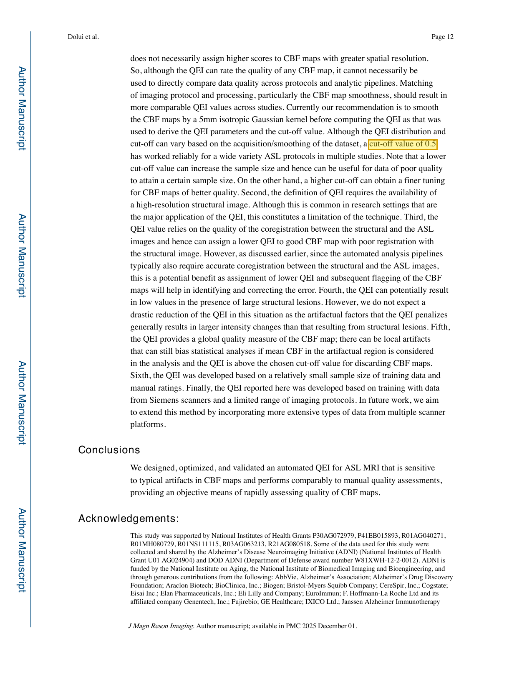

**The 5 mm smoothing step.** The same paper, page 4. The page 12 paragraph above also states it:

> "…smooth the CBF maps by a 5mm isotropic Gaussian kernel before computing the QEI as that was used to derive the QEI parameters and the cut-off value."

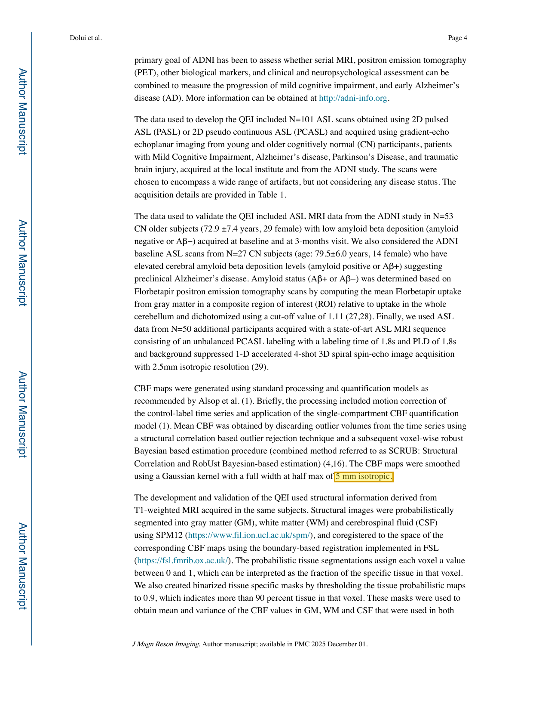

**The implementation values.** The six QEI curve constants and the tissue-probability threshold of 0.7 are taken directly from ASLPrep's compute_qei function, of which Dolui is a co-author. The code itself notes that these constants differ slightly from the published paper, which is why they are labelled Implementation rather than Published.

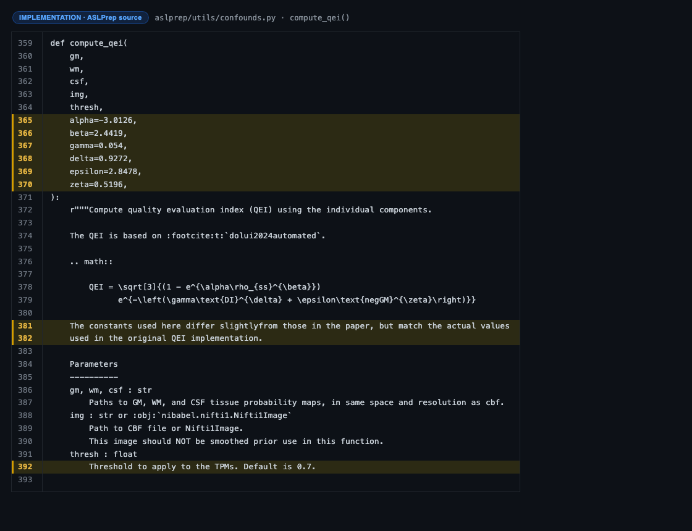

Open question: ASLPrep's code uses a tissue threshold of 0.7 (line 392), while the QEI paper (page 4) states 0.9. Similarly, the constant `qei_c` is 0.054 in the code (line 367) but 0.1 in the paper. The toolbox follows the code, and this is worth confirming.

---

## Module 2: noise and distribution (spatial CoV)

| Threshold | Value | Source |
|---|---|---|
| `scov_vascular` (warn) | 0.67 | Implementation (ExploreASL) |
| `scov_artifact` (fail) | 1.0 | Implementation (ExploreASL) |

The spatial coefficient of variation is a published metric (Mutsaerts 2017). The 0.67 and 1.0 cutoffs, however, are ExploreASL's own convention rather than a published threshold.

**The metric and its normal range.** Mutsaerts HJMM, et al. "The spatial coefficient of variation in arterial spin labeling cerebral blood flow images", page 3186:

> "The overall mean GM spatial CoV was 56.9 ± 13.2% (range 39.3%–113.6%)."

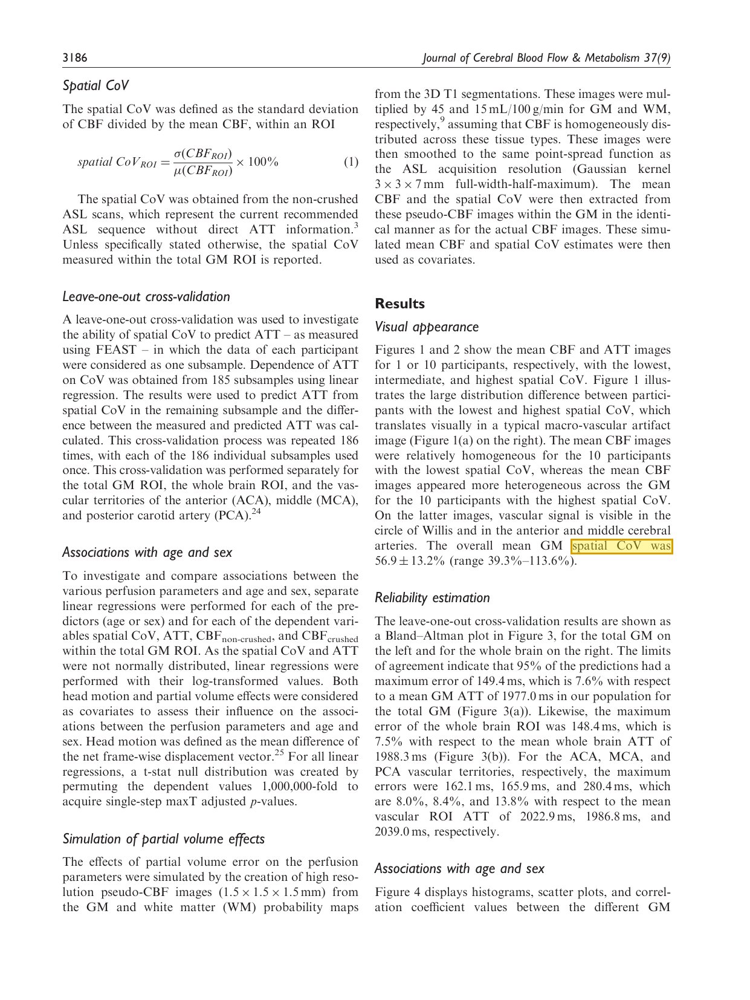

**The 0.67 and 1.0 cutoffs in ExploreASL's code.** The file xASL_qc_SortBySpatialCoV.m defines the tiering (CBF contrast below Threshold1, vascular contrast between the two values, artefactual contrast above Threshold2) and sets the defaults:

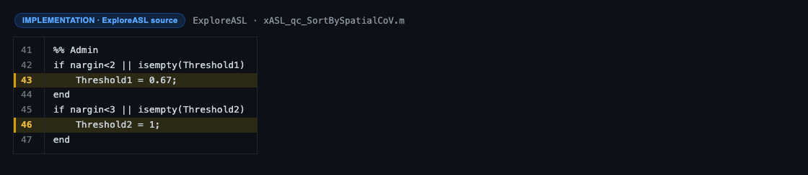

Note: the value 0.67 (two-thirds) is often attributed to Mutsaerts, but that attribution does not hold, because the 2017 paper gives no cutoff. Both numbers come from ExploreASL's binning, so they are labelled Implementation rather than Published. (ExploreASL: Mutsaerts H, et al. NeuroImage 2020;219:117031.)

---

## Module 3: CBF level and contrast

| Threshold | Value | Source |
|---|---|---|
| `gm_cbf_lo` / `gm_cbf_hi` (adult pass band) | 40 to 100 | Published (White Paper) |
| `wm_cbf_lo` / `wm_cbf_hi` (adult pass band) | 15.8 to 27.5 | Published (Wu 2013) |
| `ratio_min` (fail if GM/WM below this) | 1.0 | Published (ASLPrep) |
| `ratio_pass` (pass line) | 1.5 | Uncalibrated (no source for 1.5) |
| GM/WM CBF fail bounds | 10 / 150, 5 / 50 | Uncalibrated |
| `neg_gm_warn` / `neg_gm_fail` | 0.10 / 0.20 | Uncalibrated |
| `deep_gm_ratio_lo` / `hi` (neonatal) | 1.3 to 2.6 | Uncalibrated (derived from Miranda 2006) |

**Adult grey-matter band, 40 to 100.** Alsop DC, et al. Magn Reson Med 2015;73(1):102-116 (the ASL White Paper), page 17. doi:10.1002/mrm.25197:

> "As a general rule, gray matter CBF values from 40–100 ml/min/100ml can be normal."

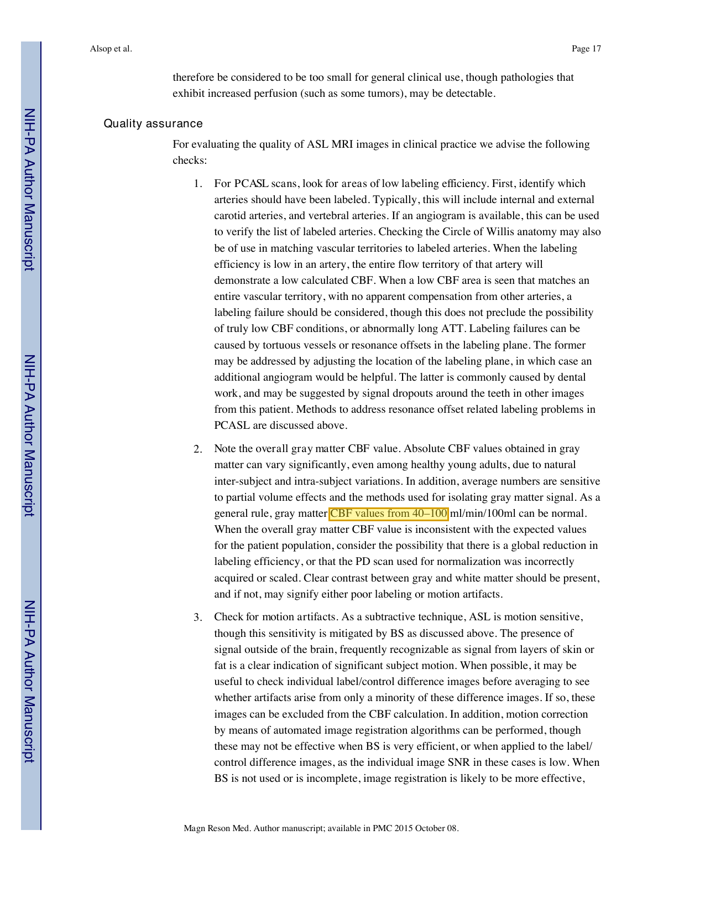

**Adult white-matter band, 15.8 to 27.5.** Wu W-C, et al. PLoS One 2013;8(12):e82679. doi:10.1371/journal.pone.0082679 (open access), abstract:

> "The measured white matter perfusion and perfusion ratio of gray matter to white matter were 15.8–27.5 ml/100ml/min and 1.8–4.0, respectively…"

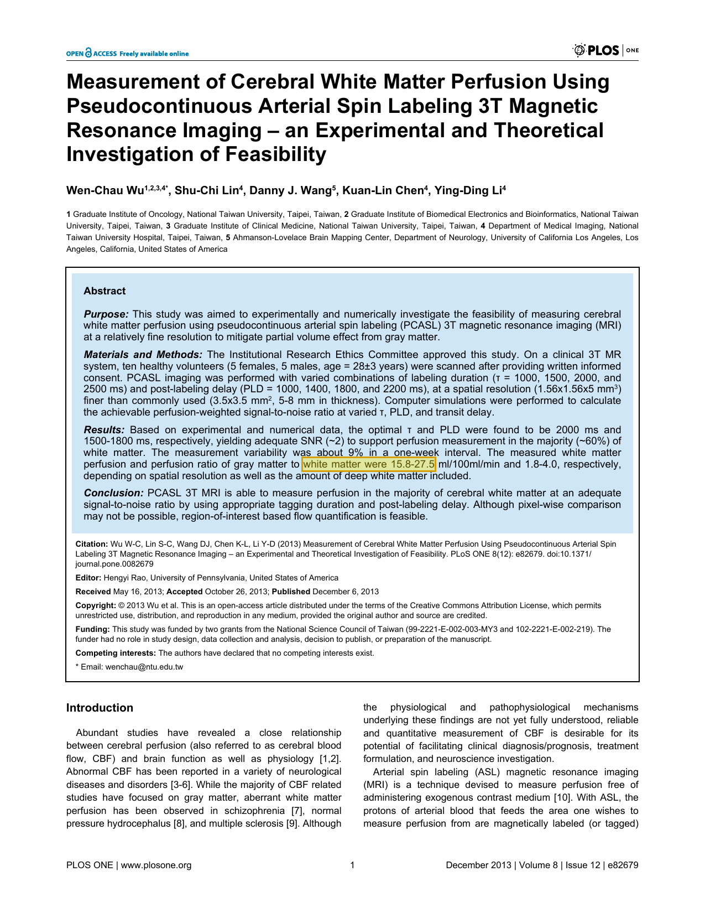

**Grey to white matter ratio above 1.** Adebimpe A, et al. Nat Methods 2022;19:683-686 (ASLPrep). doi:10.1038/s41592-022-01458-7, page 10:

> "…the WM mask; this ratio is expected to be greater than 1."

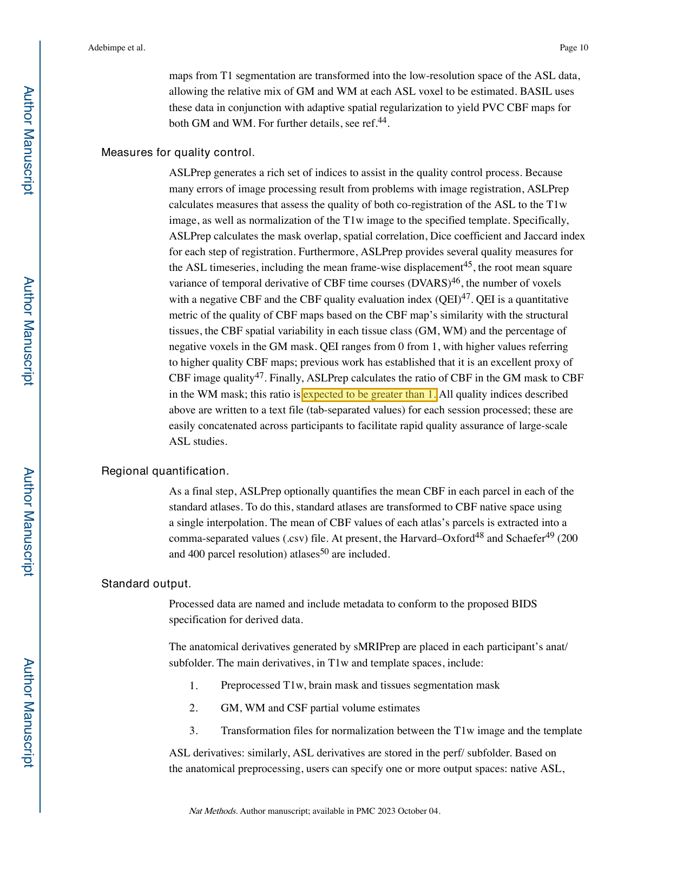

**Neonate band and the deep grey-matter check.** Miranda MJ, Olofsson K, Sidaros K. Pediatr Res 2006;60(3):359-363. doi:10.1203/01.PDR.0000232785.00965.b3 (PMID 16857776). The abstract contains every number the neonate profile uses:

> "Perfusion in the basal ganglia (39 and 30 mL/100 g/min for preterm and term neonates) was significantly higher (p < 0.0001) than in cortical gray matter (19 and 16 mL/100 g/min) and white matter (15 and 10 mL/100 g/min)…"

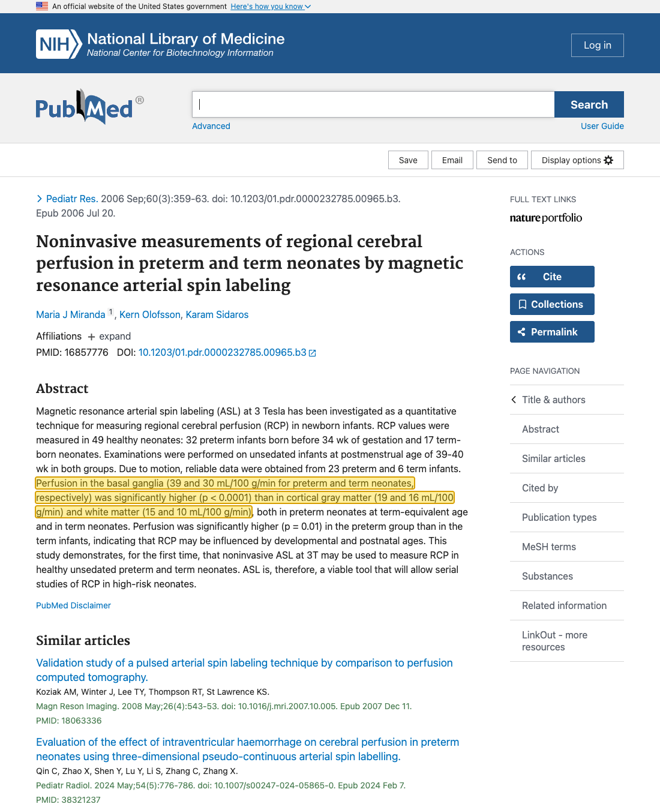

Note: the `ratio_pass` value of 1.5 has no source. The published ranges (a grey to white matter ratio of roughly 2 to 4) describe a population and cannot justify a fixed decision boundary, and the ratio itself depends on smoothing and on age. The various fail bounds and the negative grey-matter fractions are engineering defaults as well.

---

## Module 4: co-registration and coverage

| Threshold | Value | Source |
|---|---|---|
| `dice_pass` / `dice_warn` | 0.9 / 0.7 | Uncalibrated (closest reference below) |
| `coverage_warn` / `coverage_fail` | 0.90 / 0.75 | Uncalibrated |

There is no published Dice cutoff for registration quality control. The closest reference is for segmentation validation, and it is cited as exactly that, not as a registration threshold.

**The closest Dice reference (segmentation, not registration).** Zou KH, et al. Acad Radiol 2004;11(2):178-189. doi:10.1016/S1076-6332(03)00671-8 (PMID 14974593):

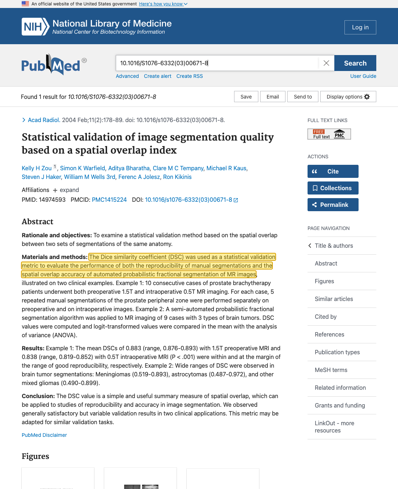

Note: Zou 2004 validates the Dice coefficient for segmentation overlap, not for ASL-to-structural registration, and later work (Birn 2023) shows that Dice is not monotonic with registration quality. So `dice_warn` is treated as a hint and labelled Uncalibrated. The coverage thresholds, which guard against the cerebellum falling outside the ASL field of view, have no source at all.

---

## Module 6: M0 calibration

| Threshold | Value | Source |
|---|---|---|
| `m0_tr_min_s` | 5.0 | Published (White Paper) |
| `t1_tissue_s` | 1.4 | Uncalibrated (matches no published value) |

**An M0 TR below 5 seconds needs the T1 correction.** White Paper (Alsop 2015), page 15:

> "If TR is less than 5s, the PD image should be multiplied by the factor (1/(1 − e^(−TR/T1,tissue)))…"

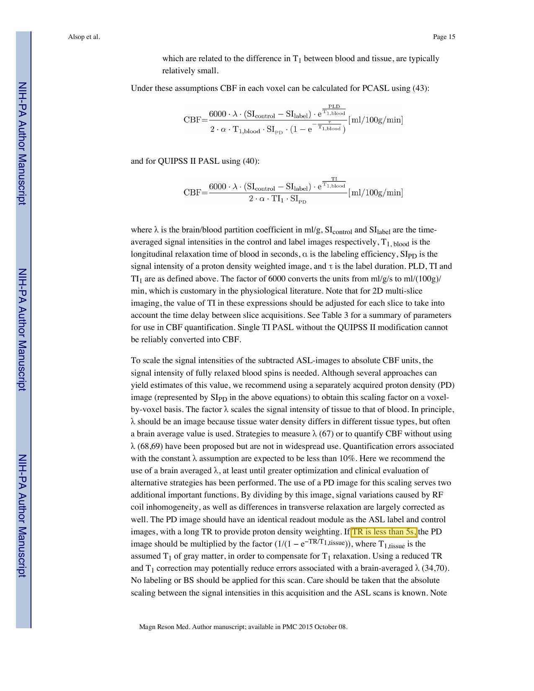

Note: the tissue T1 of 1.4 seconds used in that correction matches no single published grey-matter value (ExploreASL uses 1.24 seconds, and Wansapura 1999 reports about 1.33 seconds), so it is labelled Uncalibrated.

---

## Module 7: motion

Both numbers here are published, but they describe different statistics, and the toolbox now applies each to the statistic its source actually defines.

| Threshold | Value | Source | Applies to |
|---|---|---|---|
| `fd_mean_fail_mm` | 1.0 | Published (Adebimpe 2022) | subject mean framewise displacement |
| `fd_frame_censor_mm` | 0.5 | Published (Power 2012) | per-frame censoring |
| `head_radius_mm` | 50.0 | Published (Power 2012) | converting rotation to millimetres |
| `fd_censor_frac_warn` | 0.20 | Uncalibrated | share of censored frames |

**Mean framewise displacement above 1 mm excludes a scan.** Adebimpe 2022 (ASLPrep), page 10:

> "…we excluded participants with mean frame-wise displacement greater than 1 mm or a CBF GM to WM ratio of less than 1."

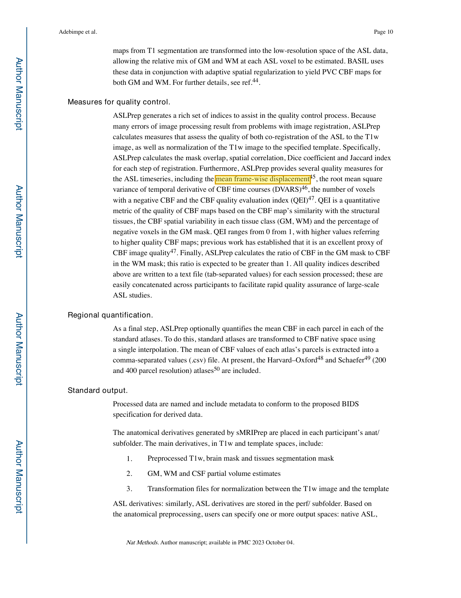

**Per-frame censoring at 0.5 mm.** Power JD, et al. NeuroImage 2012;59(3):2142-2154. doi:10.1016/j.neuroimage.2011.10.018, page 8:

> "…values of 0.5 for framewise displacement and 0.5% ΔBOLD for DVARS were chosen to represent values well above the norm found in still subjects."

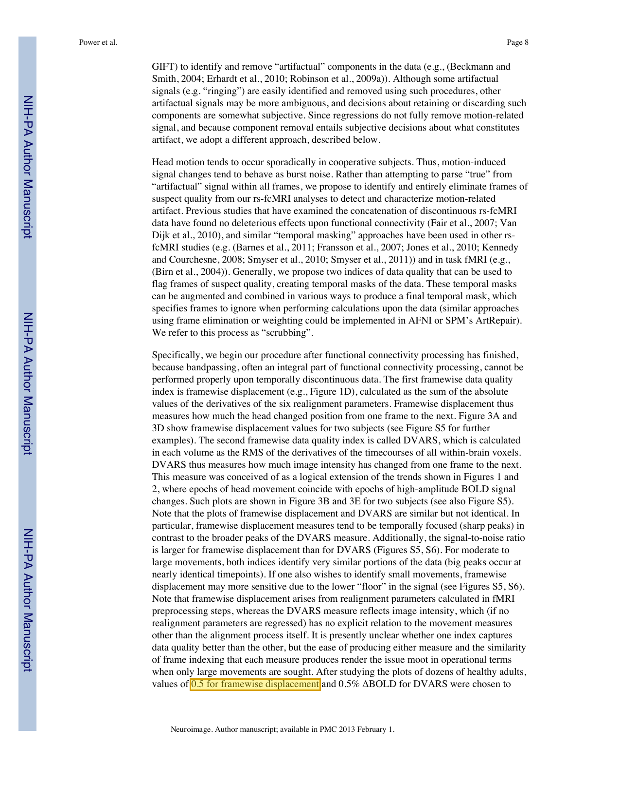

**Head radius of 50 mm, for converting rotations to millimetres.** Power 2012, page 5:

> "…displacement on the surface of a sphere of radius 50 mm, which is approximately the mean distance from the cerebral cortex to the center of the head."

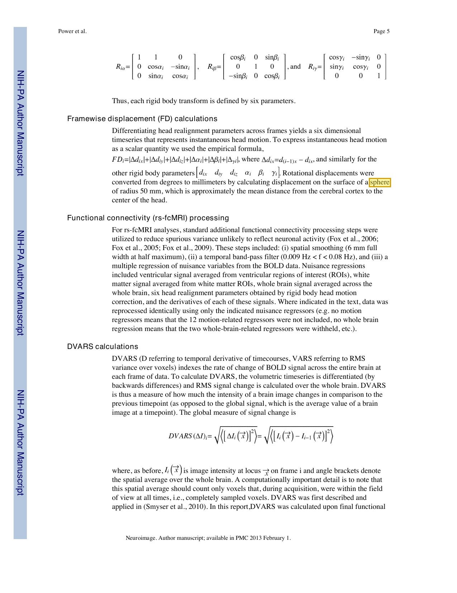

---

## Modules 5 and 8: schema, data type, and acquisition metadata

These modules check that the data is present and plausible rather than comparing a value against a threshold, so there is no cutoff to source. The specifications they follow are still worth showing.

**Schema and ASL-BIDS.** Clement P, et al. "ASL-BIDS, the brain imaging data structure extension for arterial spin labeling", Sci Data 2022;9:543. doi:10.1038/s41597-022-01615-9 (open access), page 3:

> "'REQUIRED' fields comprise parameters that are essential for CBF quantification as defined in the 2015 ASL [White Paper]."

The schema check enforces exactly these required fields.

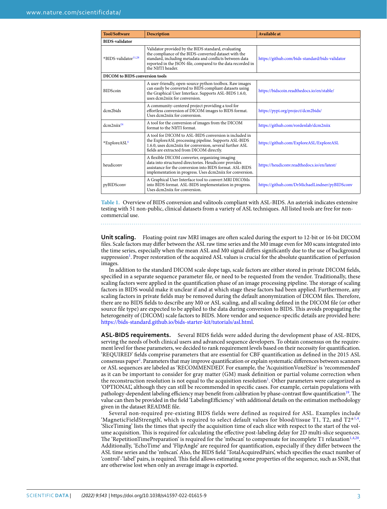

**Post-labeling delay and labeling duration.** White Paper (Alsop 2015), Table 1 (page 34). The toolbox asks the user for these values rather than guessing. Highlighted are the PCASL labeling duration and the population-specific delays.

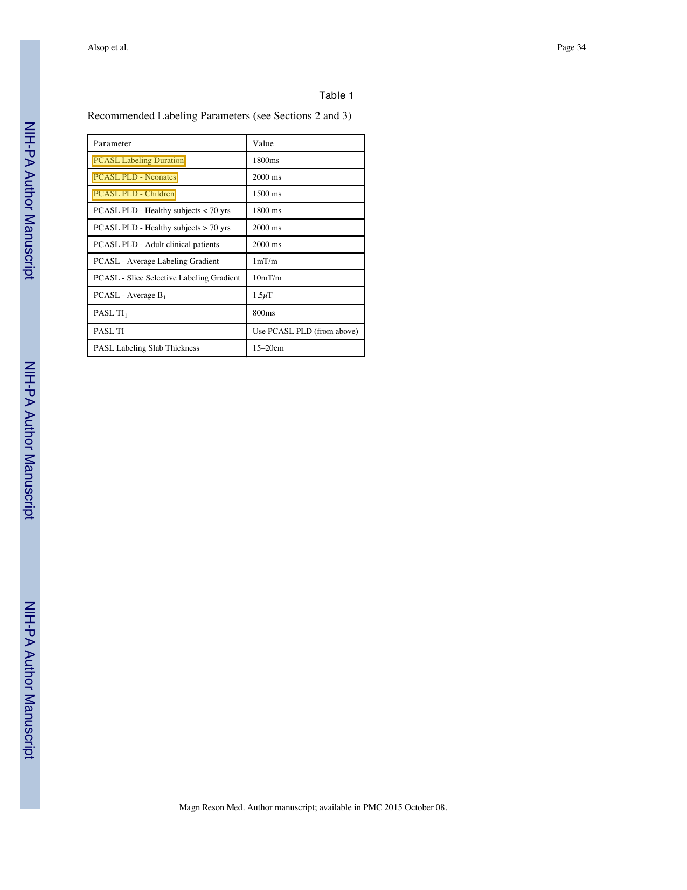

**Labeling efficiency and blood T1.** White Paper Table 3 (page 36). Highlighted are a blood T1 of 1650 ms at 3 tesla and labeling efficiencies of 0.85 (PCASL) and 0.98 (PASL).

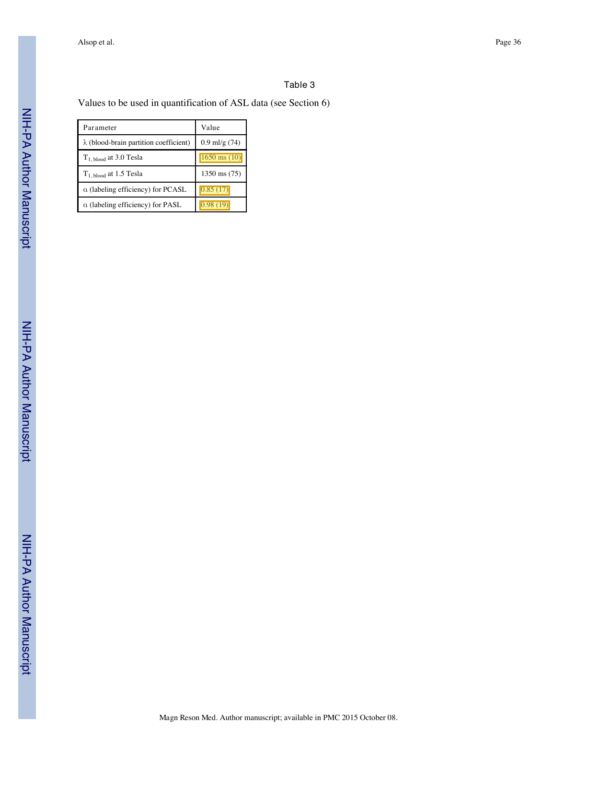

**Recommended values for adult and neonate, taken from those two tables:**

| Acquisition parameter | Adult | Neonate | White Paper |
|---|---|---|---|
| PCASL labeling duration | 1800 ms | 1800 ms | Table 1 |
| PCASL post-labeling delay | 1800 ms (under 70 years; 2000 ms over 70 or clinical) | 2000 ms | Table 1 |
| Labeling efficiency (PCASL / PASL) | 0.85 / 0.98 | 0.85 / 0.98 | Table 3 |
| Blood T1 at 3 tesla | 1650 ms | hematocrit-dependent | Table 3 |
| Blood-brain partition coefficient | 0.9 mL/g | 0.9 mL/g | Table 3 |

Only two of these values genuinely change for newborns. The post-labeling delay is longer (2000 ms), and the blood T1 depends on hematocrit, so the adult value of 1650 ms at 3 tesla does not transfer (Varela M, et al. NMR Biomed 2011;24(1):80-88. doi:10.1002/nbm.1559). Everything else is the White Paper default for both.

These are user-supplied acquisition facts rather than thresholds (`labeling_efficiency`, `label_duration_s`, `post_labeling_delay_s`, `t1_blood_s`). The checks report N/A rather than assume a value. The table above is the reference to hand to the user, not a default the toolbox applies silently.

---

## Appendix A: population profiles across the lifespan

Grey-matter CBF changes substantially with age, so a single adult band cannot fairly grade a newborn or an elderly participant. Each age group below has a grey-matter CBF mean from a peer-reviewed paper. The exact band widths are engineering extrapolations of those means and are uncalibrated, which is the same status as the adult and neonate bands.

| Profile | Grey-matter CBF mean | Source |
|---|---|---|
| neonate (term / preterm) | ~16 / ~19 mL/100 g/min | Miranda 2006 |
| infant (~4 months) | ~38 (whole brain) | Kim 2018 |
| child | 97 ± 5 | Biagi 2007 |
| adolescent | 79 ± 3 | Biagi 2007 |
| adult | 58 ± 4 (band 40 to 100) | Biagi 2007 / White Paper |
| elderly | 46 ± 9 | Leoni 2017 |

**Neonate.** Miranda MJ, Olofsson K, Sidaros K. Pediatr Res 2006;60(3):359-363. doi:10.1203/01.PDR.0000232785.00965.b3 (PMID 16857776). The highlighted sentence contains every number the neonate band uses:

> "Perfusion in the basal ganglia (39 and 30 mL/100 g/min for preterm and term neonates)… cortical gray matter (19 and 16 mL/100 g/min) and white matter (15 and 10 mL/100 g/min)."

**Infant.** Kim HG, et al. AJNR Am J Neuroradiol 2018. doi:10.3174/ajnr.A5774 (PMID 30190257).

> "…significantly higher whole-brain CBF in infants (38.3 mL/100 g/min) compared with preterm (15.5 mL/100 g/min) and term-equivalent-age (18.3 mL/100 g/min) neonates."

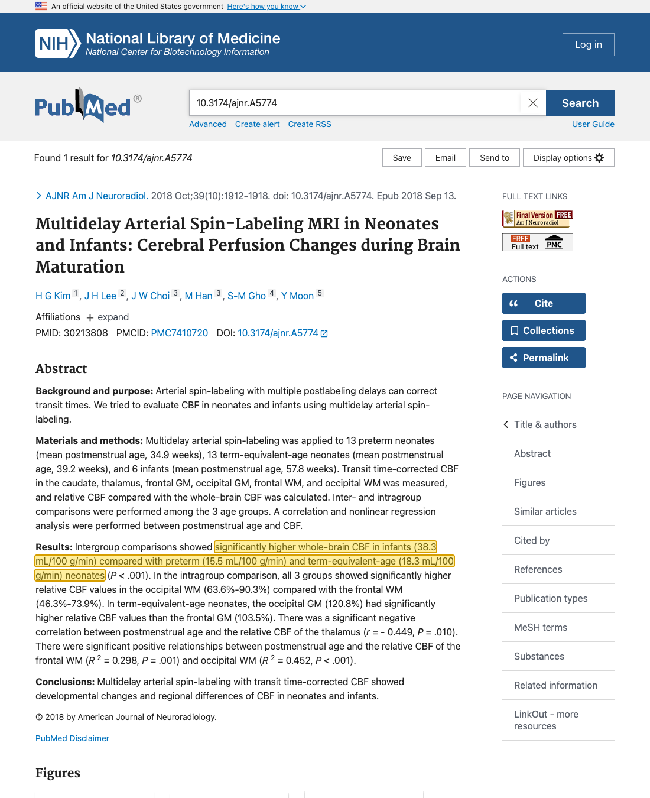

**Child, adolescent, and the adult reference.** Biagi L, et al. J Magn Reson Imaging 2007;25(4):696-702. doi:10.1002/jmri.20839 (PMID 17279531). A single abstract gives the means for three age groups:

> "CBF values decreased with age (97 ± 5 mL/100 g/minute in GM… for the children, GM 79 ± 3… teenagers, and GM 58 ± 4 mL/100 g/minute… for the adults)."

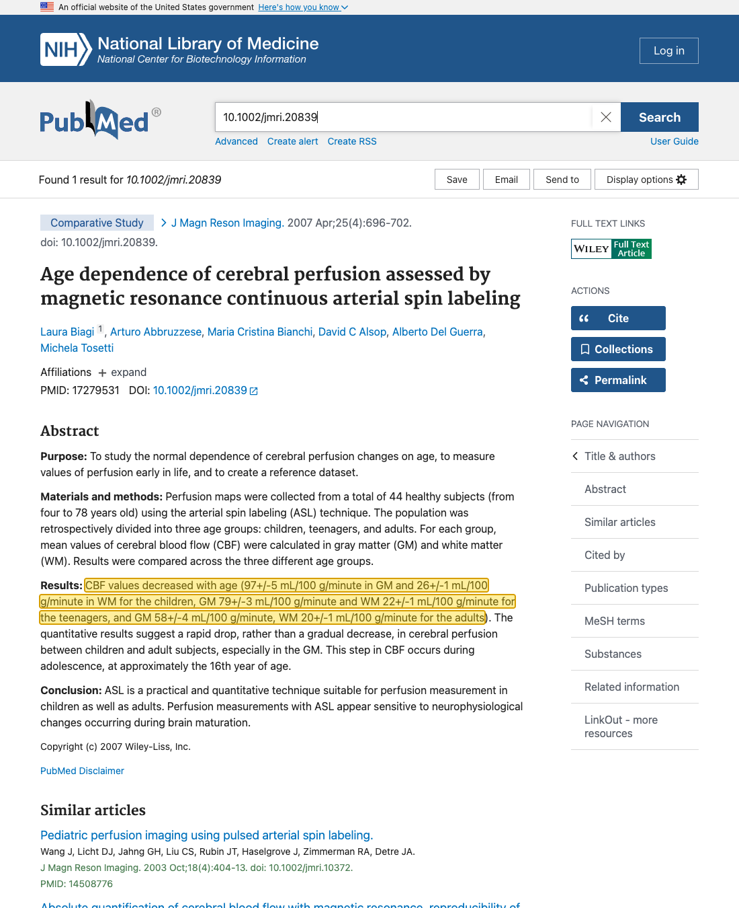

**Elderly.** Leoni RF, et al. Braz J Med Biol Res 2017;50(4):e5670. doi:10.1590/1414-431X20175670 (PMID 28355354, open access).

> "Average baseline CBF in gray matter was significantly reduced in elderly (46±9 mL·100 g-1·min-1) compared to young adults (57±8…)."

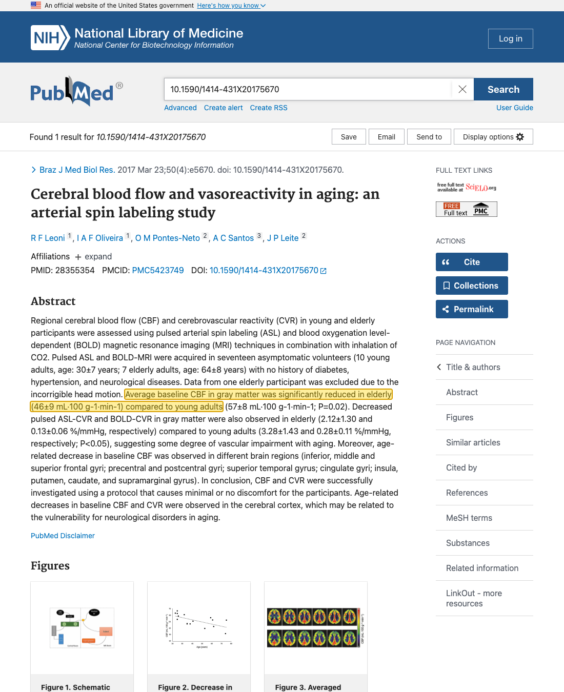

The grey-matter mean for every age group is published; only the band widths are uncalibrated, and those are being brought to the team for confirmation.

---

## Appendix B: values with no published source

The following are engineering defaults with no paper and no receipt. They never cause a scan to fail on their own; in the report, verdicts driven by these are shown as provisional.

`qei_pass`, `gm_cbf_fail_lo`, `gm_cbf_fail_hi`, `wm_cbf_fail_lo`, `wm_cbf_fail_hi`, `ratio_pass`, `neg_gm_warn`, `neg_gm_fail`, `deep_gm_ratio_lo` and `deep_gm_ratio_hi` (extrapolated from Miranda), `dice_pass`, `dice_warn`, `coverage_warn`, `coverage_fail`, `t1_tissue_s`, and `fd_censor_frac_warn`.

The full provenance is also available from the command line by running `osipy-qc --provenance`.
